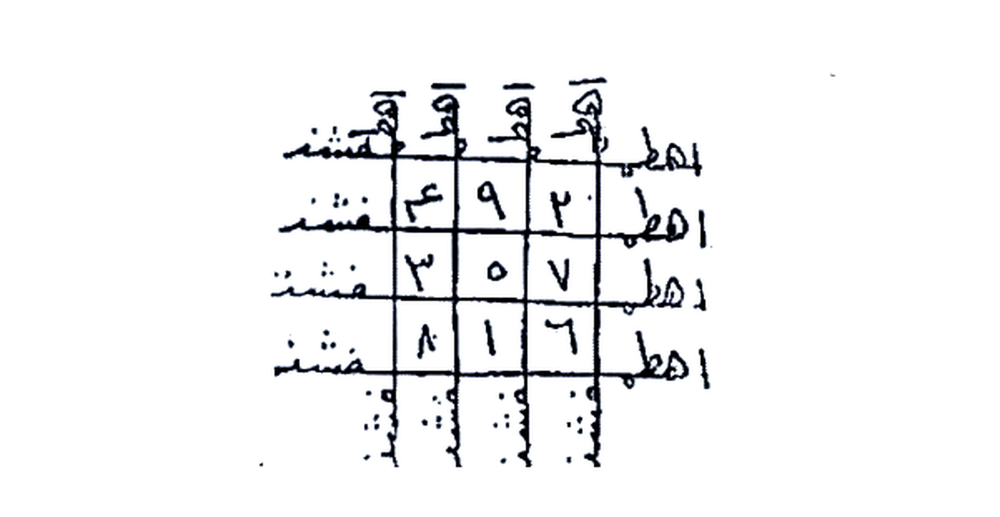

# KITAB ASRAR WA KHAFAYYAT — BATCH 02 — Halaman 006–011
### (Picture 003.jpg Hal. 6–7, Picture 004.jpg Hal. 8–9, Picture 005.jpg Hal. 10–11)

> Sambungan langsung dari Batch 01 yang berakhir di: *“...وتوكل بما تريد في سبع أوراق — pada tujuh lembar”*

**Format:** [Teks Arab Asli] di atas — [Terjemahan Indonesia] di bawah setiap paragraf. Rajah tidak diterjemahkan, tampil apa adanya + keterangan. Istilah hikmah dibiarkan Arab + penjelasan.

---

> [!CAUTION]
> **Peringatan:** Isi bab Mahabbah/Jalb/Tahyij adalah kepercayaan tradisional. Terjemahan untuk studi akademik, bukan anjuran praktik tanpa izin target. Jangan gunakan untuk manipulasi. Tidak ada bukti ilmiah.

---

## HALAMAN 06 — Lanjutan Mas-alah 4: Tata Cara 7 Lembar & Azimah Besar (Picture 003 kanan)

### [Teks Arab Asli]
```
وتجعل في كل ورقة عدد ٢ حبات لبان ذكر وثلاث عدد ٢ حبات
كزبرة وتجعلها على النار حتى يفرغ دخانها إلى آخر السبعة تكمل
القراءة عدد ٢١ مرة.

وهذه العزيمة
بسم الله العظيم مجرى البحار والأنهار ومكون الليل والنهار
وهو السميع العليم أقسمت عليكم يا معاشر الجن والشياطين
والمردة والوساوسة والتوابعة من بني شمراخ وبني وقاض وبني
كماخ من قام منكم وقعد وعلى الخلائق تمرد وفي الطريق بعد
ورصد بقول الله هو الله أحد الله الصمد لم يلد ولم يولد ولم يكن له
كفواً أحد ليس كمثله شيء وهو السميع البصير اقبلوا من كل فج
عميق إلى فلان ابن فلانة إن كان نائماً فأيقظوه وإن كان يقظاناً
فأوقفوه وعلى خيولكم فركبوه وافتحوا له الباب واكسروا له الأقفال
والأغلال ومشوه على جمر النيران وهيجوه واجلبوه إلى فلانة بنت
فلانة تريكلوا يا معشر العمار والملوك العلوية والسفلية والأرضية
والسحابية والغمامية والمستمرون في الهوا أجيبوا من معاشر
الأرض ومغاربها هيجوا واجلبوه إلى فلانة أين ذهب أين شمراخ
أين طيكل أجيبوا بقدرة من يحيي العظام وهي رميم أقسمت عليكم
بانسماء وما أظلت والأرض وما أقلت والرياح وما لفحت والمياه
وما جرت ارعدوا وازجروا وزلزلوا وانزلوا على فلان ابن فلانة
وهيجوه واجلبوه إلى فلانة بنت فلانة بحق اهيا شراهيا أذرناي
```

### [Terjemahan Indonesia]
**Dan jadikan di setiap lembar 2 butir *luban dzakar* (kemenyan jantan) dan 3 kali 2 butir *kuzbarah* (ketumbar)** — *(naskah menulis “ثلاث عدد ٢ حبات كزبرة” — literal “tiga (kali) bilangan 2 butir ketumbar”, dibiarkan Arab dengan penjelasan: total 6 butir ketumbar per lembar menurut kebiasaan penyalinan, ada yang membaca 3 butir × 2)* — **lalu letakkan (lembaran itu) di atas api hingga asapnya habis, teruskan sampai lembar ketujuh selesai. Sempurnakan pembacaan (azimah) sebanyak 21 kali.**

**Dan inilah azimahnya:**

*“Bismillahir `Adzhim, yang mengalirkan lautan dan sungai, yang membentuk malam dan siang, Dia Maha Mendengar Maha Mengetahui. Aku bersumpah kepada kalian wahai para golongan Jin, Setan, Maradah (pembangkang), Waswasa, dan Tawabi’ (pengikut) dari Bani Syamrakh, Bani Waqadh, Bani Kamakh — yang berdiri di antara kalian maupun yang duduk, yang memberontak terhadap makhluk dan yang berjaga di jalan — dengan firman Allah ‘Qul Huwallahu Ahad, Allahu Shamad, lam yalid wa lam yulad wa lam yakun lahu kufuwan ahad, Laisa kamitslihi syai-un wa Huwas Sami’ul Bashir’ — datanglah dari setiap lembah yang dalam menuju si Fulan bin Fulanah (sebut nama target + ibunya). Jika dia sedang tidur maka bangunkan, jika sedang terjaga maka hentikan (buat gelisah), naikkan dia ke atas kuda-kuda kalian, bukakan pintu untuknya, pecahkan gembok dan belenggunya, jalankan dia di atas bara api neraka, bangkitkan geloranya dan bawalah dia kepada si Fulanah binti Fulanah!*

*Wahai Trikal (تريـكلوا? — dalam naskah tertulis ‘تريكلوا’ — kemungkinan asma, dibiarkan), wahai para `Ammar (penghuni tempat) dan para raja `Ulviyyah (atas), Sufliyyah (bawah), Ardhiyyah (bumi), Sahabiyyah (awan), Ghamamiyyah (mendung), dan yang terus-menerus di udara — jawablah, wahai golongan bumi dan baratnya, gelisahkan dan bawalah dia kepada si Fulanah! Di mana Dzahab? Di mana Syamrakh? Di mana Thaykal? Jawablah dengan kekuasaan Zat yang menghidupkan tulang-belulang padahal sudah hancur — aku bersumpah kepada kalian demi langit dan apa yang dinaunginya, demi bumi dan apa yang dipikulnya, demi angin dan apa yang dihembusnya, demi air dan apa yang dialirkannya — gemuruhkan, bentaklah, guncangkan, turunkan (pengaruh) kepada si Fulan bin Fulanah, bangkitkan dan bawalah dia kepada si Fulanah binti Fulanah, dengan hak **Ahya Syarahya Adranai (اهيا شراهيا أذرناي)**”* — *(asma hikmah, dibiarkan Arab).*

---

### [Teks Arab Asli — Sambungan di Hal. 07 atas]
```
اصباؤوت ال شداي ما أعظم سلطان الله الوحا العجل الساعة هيا
يا خدام هذه الأسماء لا يعصى منكم كبير ولا صغير ولا ملك ولا
مملوك إن كل من في السماوات والأرض إلا آتي الرحمن عبداً
السماء بكم تنقذف والأرض من تحت أقدامكم تشعل ناراً حتى
تأتوا بفلان إلى محبة فلانة إن كانت إلا صيحة واحدة فإذا هم
جميع لدينا محضرون.
```

### [Terjemahan Indonesia]
*“Ashba-ut Al Syaddai (اصباؤوت ال شداي), betapa agungnya kekuasaan Allah! Al-Waha (segera), Al-‘Ajal (cepat), As-Sa’ah (sekarang)! Wahai para khadam (pelayan) asma-asma ini, jangan ada yang membangkang dari kalian baik yang besar maupun kecil, baik raja maupun budak. ‘In kullu man fis samawati wal ardhi illa ati Rahman ‘abda’ (Tidak ada seorang pun di langit dan bumi kecuali akan datang kepada Tuhan Yang Maha Pemurah sebagai hamba — QS. Maryam:93). Langit karena kalian akan terbelah, bumi dari bawah kaki kalian akan menyala api, sampai kalian mendatangkan si Fulan kepada cinta si Fulanah! ‘In kanat illa shaihataw wahidatan fa idza hum jami’un ladaina muhdharun’ (QS. Yasin:53).”*

---

## HALAMAN 07 — Khatam/Wafaq 7 Lembar & Mas-alah 5 (Picture 003 kiri)

### [Teks Arab Asli]
```
وهذا الخاتم الذي يكتب في ٧ أوراق
```

### [Terjemahan Indonesia]
**Dan inilah Khatam (cincin/wafaq — tabel mistik) yang ditulis pada 7 lembar kertas.**

---

### Gambar Rajah Asli Halaman 07 — Khatam 7 Waraq



**Gambar Rajah Asli Halaman 07**

*Keterangan cara baca (dari halaman 06):*
- Salin **persis** tabel 4 baris × 3 kolom yang terlihat di atas, angka di tengah: `٩ ، ٢ ، ع` di baris 1, `٣ ، ٥ ، ٧` di baris 2, `٨ ، ١ ، ٦` di baris 3 (angka Arab), plus tulisan di sekelilingnya: `اهطل` di kanan (berulang 4×), `فشنت` di kiri (berulang 4×), dan di atas setiap kolom ada simbol `ـه` kecil dengan angka, serta ekor bertitik di bawah setiap kolom (bagian dari thilasm). 
- **Jangan diterjemahkan, jangan diubah.** Tulis pada 7 lembar seperti instruksi Hal. 06. Crop di atas hanya kotaknya saja, tanpa kalimat pengantar “وهذا الخاتم...” (sudah dipisah) dan tanpa kalimat setelahnya. Background putih bersih, 4× upscale (2404×1244 px), siap cetak.

---

### [Teks Arab Asli]
```
وإن كتبت العزيمة المذكورة في ورقتين ويبخرنهم ويحمل
واحدة الطالب والأخرى تعلق في الهواء فإن المطلوب يحضر.

المسألة الخامسة
باب تهييج لحضور
يتلى عدد ٤٠٠ مرة بعد صلاة العشاء والبخور كزبرة فإن
الخادم يأتيك بعد عدد ٣٠٠ مرة وينفخ حتى تنتهي من العدة واضحاً
```

### [Terjemahan Indonesia]
**Dan jika engkau menulis azimah yang telah disebutkan tadi pada dua lembar kertas, lalu mengasapi (membakar bukhur di atas) keduanya, kemudian satu lembar dibawa oleh si pencari (thalib — orang yang menghendaki) dan lembar lainnya digantung di udara, maka yang dicari (mathlub — target) akan hadir.**

**MAS-ALAH KELIMA**
**BAB TAHYIJ UNTUK MENDATANGKAN (HUDHUR)**

Dibaca sebanyak **400 kali setelah shalat Isya**, dan **bukhur-nya ketumbar (kuzbarah)**. Maka, kata naskah, *“khadam (pelayan ruhani) akan datang kepadamu setelah bacaan ke-300, lalu meniup (memberi isyarat) sampai engkau selesai dari hitungan 400 — jelas.”*

---

### [Teks Arab Asli — Sambungan Azimah Mas-alah 5 di Hal. 08]
```
يده على صدره فبعد فراغك يقول سريعاً ما تريد فاطلب منه
حاجتك وهذا ما تقول:
أجب يا عنقود بحق الأيمان والعهود والدوايب والسود
وبحق الأيمان المنزلة على اليهود وبحق الاسم الذي تفجر منه
الماء من الحجر الجلمود وهو قاني لكنوت اكوت
```

### [Terjemahan Indonesia]
*(lanjutan Mas-alah 5 — Hal. 08 atas):*
**(Khadam itu) meletakkan tangannya di dadanya, maka setelah engkau selesai (400×) dia akan cepat berkata “apa yang kau inginkan?”, maka mintalah hajatmu darinya. Dan inilah yang engkau katakan:**

*“Jawablah wahai ‘Unqud (عنقود — nama khadam, dibiarkan), dengan hak sumpah dan janji, dengan hak Dawabib dan Sud (دوايب والسود — asma, dibiarkan), dengan hak sumpah yang diturunkan kepada orang Yahudi, dan dengan hak Nama yang dengannya memancar air dari batu yang keras membatu, yaitu **Qani Lakanut Akut (قاني لكنوت اكوت)**”* — *(asma, dibiarkan).*

---

## HALAMAN 08 — Mas-alah 5 (lanjutan) & Mas-alah 6 / 5 duplikat : Bab Mahabbah Surat Al-Humazah (Picture 004 kanan)

### [Teks Arab Asli]
```
المسألة الخامسة
باب محجة
تكتب سورة الهمزة على شمعة اسكندراني بتمامها باسم من
تريد ثم توقدها وتبخرها بجاوي ولبان وعود قاقلي واتل العزيمة
عليها فما تفرغ إلا والمطلوب يأتي سريعاً.

وهذه العزيمة
تقول - بانقش عدد ٢ ياجلجميش عدد ٢ ياجلجميش عدد ٢ هويش
عدد ٢ مهراقش مهورقش عجل أيها الملك جرنوش أجلب وهيج
فلان ابن فلانة إلى فلانة بنت فلانة بالذي قال للسموات والأرض
اتينا طوعاً أو كرهاً قالتا أتينا طائعين بحق ويل لكل همزة لمزة
الذي جمع مالاً وعدده أيحسب أن ماله أخلده كلا لينبذن في
الحطمة وما أدراك ما الحطمة نار الله الموقدة في قلب فلانة بنت
فلانة التي تطلع على الأفئدة إنها عليهم مؤصدة في عمد ممددة.
```

### [Terjemahan Indonesia]
**MAS-ALAH KELIMA (di cetakan tertulis “Al-Khamisah” lagi — duplikat penomoran, tetap ditranskrip apa adanya)**
**BAB MAHABBAH**

Tulis **Surat Al-Humazah (ويل لكل همزة لمزة) selengkapnya** di atas **lilin Iskandari (syam’ah Iskandarani — lilin panjang khas Iskandariah)** dengan **nama orang yang kau tuju**, kemudian **nyalakan lilin itu dan asapi dengan jawi, luban, dan kayu gaharu qaquli (عود قاقلي)**, lalu **bacakan azimah di atasnya. Maka tidaklah engkau selesai kecuali yang dicari sudah datang dengan cepat.**

**Dan inilah azimahnya, engkau katakan:**

*“Banqasy 2 kali, Ya Jaljamyisy 2 kali, Ya Jaljamyisy 2 kali, Huwaisy 2 kali, Mahraqisy Mahuraqisy (مهراقش مهورقش) — Segerakan wahai Raja Jarnusy (جرنوش), tarik dan bangkitkan si Fulan bin Fulanah kepada si Fulanah binti Fulanah, dengan (hak) Zat yang berfirman kepada langit dan bumi ‘I’tiya thau’an au karhan, qalata ataina tha-i’in’ (Datanglah kalian dengan suka atau terpaksa, keduanya berkata: kami datang dengan patuh — QS. Fushshilat:11), dengan hak ‘Wailul likulli humazatil lumazah, alladzi jama’a malan wa ‘addadah, ayahsabu anna malahu akhladah, kalla layunbadzanna fil huthamah, wa ma adraka mal huthamah, narullahil muqadah...’ (Surat Al-Humazah ayat 1–9) — (azimah ini mengutip surat tersebut) — ‘Narullahil muqadah fi qalbi Fulanah binti Fulanah, allati taththali’u ‘alal af-idah, innaha ‘alaihim mu’shadah fi ‘amadim mumaddadah’ — (api Allah yang menyala di hati si Fulanah binti Fulanah yang membakar sampai ke hati, sesungguhnya api itu tertutup rapat atas mereka dalam tiang-tiang yang memanjang).”*

> *Catatan: `Banqasy (بانقش), Jaljamyisy (ياجلجميش), Huwaisy (هويش)` adalah asma hikmah, dibiarkan.*

---

## HALAMAN 09 — Mas-alah 7 & 8 : Bab Mahabbah (Picture 004 kiri)

### [Teks Arab Asli — Mas-alah 7]
```
المسألة السابعة
باب محبة
يكتب يوم الأربع وتعـلقه على شجرة شرقية ويخره لبان ذكر
وهذا ما تكتب وبه تعزم تقول:

أن لا ملجأ من الله إلا إليه وحيل بينهم وبين ما يشتهون
فضرب بينهم بسور له باب باطنه فيه الرحمة وظاهره من قبله
العذاب توكل يا ميمون الطيار ويا ميمون أبي نوخ واضربوا بأيديكم
العملة الغوية فلان على صوره وترهـموا عقله بهوتر عدد ٢ كرش
عدد ٢ لوش عدد ٢ نفخ عدد ٢ أنا عدد ٢ أجب أيها السيد أنا واحـضروا
وازعجوا فلان واحرقوا قلبه بمحبة فلانة الرحا عدد ٢ العجل عدد ٢
الساعة عدد ٢.
```

### [Terjemahan Indonesia]
**MAS-ALAH KETUJUH**
**BAB MAHABBAH**

Ditulis pada **hari Rabu** dan **digantungkan pada pohon yang menghadap timur (syajarah syarqiyyah)**, dan **dibakari dengan luban dzakar**. Dan inilah yang engkau tulis dan sekaligus engkau jadikan azimah, engkau katakan:

*“An la malja-a minallahi illa ilaih, wa hila bainahum wa baina ma yasytahun, fa dhuriba bainahum bi surin lahu bab, bathinuhu fihi rahmah wa zhahiruhu min qibalihi ‘adzab (Tidak ada tempat berlindung dari Allah kecuali kepada-Nya... lalu dipasang dinding yang memiliki pintu, dalamnya ada rahmat dan luarnya ada azab — kutipan Quran).*

*Tawakkal wahai Maimun Ath-Thayyar (ميمون الطيار) dan wahai Maimun Abi Nukh (ميمون أبي نوخ), pukullah dengan tangan kalian patung/gambar si Fulan sesuai rupanya, dan hilangkan akalnya dengan **Bahutar 2 kali, Karasy 2 kali, Lusy 2 kali, Nafakh 2 kali, Ana 2 kali** (بهوتر، كرش، لوش، نفخ، أنا — asma, dibiarkan) — Jawablah wahai tuan Ana, hadirkan, ganggu si Fulan, bakar hatinya dengan cinta kepada si Fulanah — **Ar-Raha 2, Al-‘Ajal 2, As-Sa’ah 2**.”*

---

### [Teks Arab Asli — Mas-alah 8]
```
المسألة الثامنة
باب محبة
يكتب على أثر من تريد أو على بغنة هندي وهذا ما تكتب
أجب يا عبد النار ويا هارش ويا احمر ويا سريع ويا برق ويا أجيبوا
وأعطوها وازعجوا واحرقوا وأقلقوا قلب فلان ابن فلانة بمحبة فلانة
حتى لا يأكل ولا يشرب ولا ينام حتى يأتي إلى فلانة بنت فلانة
طلاعاً ذليلاً الوحا عدد ٢ العجل عدد ٢ الساعة عدد ٢ ثم اجعلهم في
سراج أخضر جديد وتأخذ ماجورا وتكتب في قعره هاروت
وماروت وميمون افراطيش بشماهوج أجيبوا أيها الخدام واحضروا
```

### [Terjemahan Indonesia]
**MAS-ALAH KEDELAPAN**
**BAB MAHABBAH**

Ditulis di atas **bekas (atsar) orang yang kau tuju** atau di atas **kain sutra India (bughnah hindi — sapu tangan/penutup kepala sutra India)**. Dan inilah yang engkau tulis:

*“Jawablah wahai ‘Abdin Nar (عبد النار — hamba api), wahai Harisy, wahai Ahmar, wahai Sari’, wahai Barq, wahai... — jawablah, berikan, ganggu, bakar, gelisahkan hati si Fulan bin Fulanah dengan cinta kepada si Fulanah, sampai dia tidak bisa makan, tidak minum, tidak tidur sampai datang kepada si Fulanah binti Fulanah dalam keadaan tunduk hina — **Al-Waha 2, Al-‘Ajal 2, As-Sa’ah 2**. Kemudian jadikan (tulisan itu) di dalam **lampu hijau baru (siraj akhdhar jadid)**. Ambil **bejana (majura — periuk)** dan tulis di dasarnya **Harut dan Marut, serta Maimun Afrathisy Basyamahuj (افراطيش بشماهوج)** — Jawablah wahai para khadam, hadirkan...”*

*(azimah terpotong di ujung halaman 09, bersambung ke Hal. 10)*

---

## HALAMAN 10 & 11 — Lanjutan Mas-alah 8 & Mas-alah 9 : Bab Mahabbah wa Jalb (Picture 005)

### [Teks Arab Asli — Lanjutan Hal. 10 atas]
```
وماروت وميمون افراطيش بشماهوج أجيبوا أيها الخدام واحضروا
بفلان إلى مكان فلانة العجل الوحا الساعة بحق اهطمفشذ أسرعوا
به ثم اكفي الماجور على الموقود ثم تعزم عليها بهذه العزيمة
عدد ٣١ مرة على مهلك وإن كان عدد اسم المطلوب كان أخرى.
```

### [Terjemahan Indonesia]
*(lanjutan tulisan di dasar bejana Hal. 09):* *“...dan Marut serta Maimun Afrathisy Basyamahuj — jawablah wahai para khadam, hadirkan si Fulan ke tempat si Fulanah — Al-‘Ajal, Al-Waha, As-Sa’ah, dengan hak **Ahtamfasyadz (اهطمفشذ)** — bersegeralah dengannya!”*

Kemudian **balikkan bejana itu di atas tungku yang menyala (muqad), lalu baca azimah di atasnya 31 kali dengan pelan. Jika jumlah (hisab) nama orang yang dicari (itu) ada, maka (ulangi) sekali lagi.**

---

### [Teks Arab Asli — Mas-alah 9 Hal. 10–11]
```
المسألة التاسعة
باب محبة وجلب
يكتب على أثر المطلوب أو على خرقة كتان جديدة وتوقده
في سراج جديد بدهن ياسمين ليلة الثلاثاء .

وهذا ما تكتب على الأثر
محـملع همـعلسعطـلمم مـمعلـسعطلمـمـسلح
سلسكلسمـكا مسـلفمـلي لحـمين لهـوسـا عوسـا والنجـمل ناهـويا
العجل بكذا توكل بجلب فلان إلى فلانة بحق هذه الأسماء عليكم
والبخور مقل أزرق وكندر وسنكي.

وهذه العزيمة
الحمد لله الذي كان قبل وجود المخلوقات الذي خلق بنوره
الظلمات وعلم ما كان وما يكون وما هو كائن لاإله إلا هو الملك
المعبود يخرج الأشياء من العدم إلى الوجود فسبحان الذي بيده
ملكوت كل شيء وإليه ترجعون أقسمت عليكم يا خدام هذه
الأسماء بحقها عليكم وطاعتها لديكم إلا ما توكلتم وأجرتم
وجلبتم فلان إلى فلانة عنكموش عدد ٢ هيوش عدد ٢ طلوش عدد ٢
فروش عدد ٢ أميوش عدد ٢ طايوش عدد ٢ طهموش عدد ٢ ميوش
عدد ٢ كرميانوش عدد ٢ نوش عدد ٢ هيجوا واجلبوا واثنوني به سريعاً
عاجلاً حتى يأتي إلى فلانة بنت فلانة الوحا عدد ٢ العجل عدد ٢
الساعة عدد ٢.
```

### [Terjemahan Indonesia]
**MAS-ALAH KESEMBILAN**
**BAB MAHABBAH DAN JALB (Menarik)**

Ditulis di atas **bekas orang yang dicari (atsar)** atau di atas **kain linen baru (khirqah kattan jadidah)**, lalu **nyalakan di lampu baru dengan minyak melati (duhn yasamin) pada malam Selasa.**

**Dan inilah yang engkau tulis di atas atsar:**

*“Mahmala‘, Ham‘alsa‘thalamam, Ma‘alsa‘thalamamsalah, Salsakalsamaka Maslafmali Lahmin Lahawsa ‘Awsa wan Najm Nahu-ya (محملع همعلسعطلمم... — rangkaian thilasm/huruf terpenggal, dibiarkan Arab + transliterasi, tidak diterjemahkan) — Al-‘Ajal, dengan ini wakilkan untuk menarik si Fulan kepada si Fulanah, dengan hak asma-asma ini atas kalian.”*

**Bukhur-nya:** *muqul azraq (getah biru), kundur (kemenyan), dan sanki (سنكي — jenis dupa)*.

**Dan inilah azimahnya:**

*“Segala puji bagi Allah yang ada sebelum wujud makhluk, yang menciptakan kegelapan dengan cahaya-Nya, yang mengetahui apa yang telah terjadi, apa yang akan terjadi, dan apa yang sedang terjadi, tiada Tuhan selain Dia, Raja yang disembah, yang mengeluarkan segala sesuatu dari ketiadaan menjadi ada, Maha Suci yang di tangan-Nya kerajaan segala sesuatu dan kepada-Nya kalian dikembalikan. Aku bersumpah kepada kalian wahai khadam asma-asma ini, dengan haknya atas kalian dan ketaatannya di sisi kalian, kecuali kalian telah mewakilkan, menjalankan, dan menarik si Fulan kepada si Fulanah — dengan **‘Ankamyusy 2 kali, Hayusy 2 kali, Thalusy 2 kali, Farusy 2 kali, Amyusy 2 kali, Thayusy 2 kali, Thahmusy 2 kali, Miyusy 2 kali, Karmiyanusy 2 kali, Nusy 2 kali (عنكموش، هيوش، طلوش، فروش، أميوش، طايوش، طهموش، ميوش، كرميانوش، نوش — asma, dibiarkan)** — gelisahkan, tarik, dan datangkan dia kepadaku dengan cepat, segera, sampai dia datang kepada si Fulanah binti Fulanah — **Al-Waha 2, Al-‘Ajal 2, As-Sa’ah 2**.”*

---

### [Teks Arab Asli — Hal. 10 bawah & Hal. 11 atas: Azimah Panjang]
```
وهذه العزيمة
تقول - أقسمت عليكم يا معاشر الجن والشياطين والأبالسة
والمردة والزوابع والنوابع واكسيام ملك السفلية وملك العمار
وملك القرينة بحق هذه الأسماء العظيمة وهو اسم الله الأعظم
المخزون الذي بين الكاف والنون الذي ذلت له رقاب الجبابرة
وأطاعت له الملوك الأكاسرة وسجدت له ملوك الأرض مشرقاً
ومغرباً قالوا إنا لله طائعين ولعظمته خاضعين ولمز هيبته ساجدين
باسم اهيا شراهيا. ادوناي أصباؤوت. ال شداي. أهيا اهيا
العزيز المعتز الذي نظر إلى السماء فارتفعت وانجلت وإلى الأرض
فاستعدت وما جت وإلى الجبال زلت وخر موسى صعقاً الذي
أوحى في كل سماء أمرها أن تلقوا محبة فلان ابن فلانة في قلب
فلانة بنت فلانة وتهيجوها وتقلقوها وتزعجوها قلب فلانة لمحبة
فلان الوحا العجل الساعة عدد ٢ أجيبوا يا خدام هذه الأسماء بحقها
عليكم أجيبوا داعي الله من كل فج عميق وأطيعوا وأسرعوا وهيجوا
واجلبوا واحرقوا قلب فلانة بمحبة فلان من قبل ما تحترق هذه
الأسماء فتكونوا من النادمين أسرعوا بارك الله فيكم وعليكم عدد
٣١ مرة.
```

### [Terjemahan Indonesia]
**Dan inilah azimah (yang lain, versi panjang — 31×), engkau katakan:**

*“Aku bersumpah kepada kalian wahai golongan Jin, Setan, Iblis, Maradah, Zawabi’, Nawabi’, dan **Aksiyam** Raja Sufliyyah, Raja ‘Ammar, dan Raja Qarinah, dengan hak asma-asma agung ini — yaitu **Ismullah Al-A’dham (Nama Allah Teragung) yang tersimpan antara Kaf dan Nun**, yang tunduk kepadanya leher para penguasa tiran, yang patuh kepadanya raja-raja Persia, yang sujud kepadanya raja-raja bumi timur dan barat, mereka berkata ‘Inna lillahi tha-i’in’ (kami patuh kepada Allah), tunduk pada keagungan-Nya, sujud pada wibawa-Nya — dengan nama **Ahya Syarahya, Adonai Ashba-ut, Al Syaddai, Ahya Ahya (اهيا شراهيا، ادوناي، أصباؤوت، ال شداي — asma, dibiarkan)**, Yang Maha Perkasa lagi Maha Mulia yang memandang langit lalu meninggi dan terang, memandang bumi lalu terhampar, memandang gunung lalu berguncang dan Musa jatuh pingsan, yang mewahyukan pada setiap langit perintahnya — bahwa kalian harus melemparkan cinta si Fulan bin Fulanah ke dalam hati si Fulanah binti Fulanah, gelisahkan, gundahkan, ganggu hatinya untuk cinta kepada si Fulan — **Al-Waha, Al-‘Ajal, As-Sa’ah 2 kali** — jawablah wahai khadam asma-asma ini dengan haknya atas kalian, jawablah penyeru Allah dari setiap lembah dalam, taatilah, bersegeralah, bangkitkan, tarik, bakar hati si Fulanah dengan cinta kepada si Fulan, sebelum asma-asma ini terbakar (hangus), maka kalian akan menjadi orang-orang yang menyesal. Bersegeralah, semoga Allah memberkahi kalian — (dibaca) **31 kali**.”*

---

## Ringkasan Rajah Batch 02

| Hal. | Rajah | Isi | Crop |
|------|-------|-----|------|
| **07** | Khatam 7 Waraq | Tabel 3×3 angka 9-2-ع, 3-5-7, 8-1-6 + tulisan `اهطل ×4` kanan, `فشنت ×4` kiri, ekor bertitik bawah | `assets/rajah-hal-007-khatam-7waraq.jpg` — **HANYA kotak**, tanpa heading “وهذا الخاتم...” & tanpa kalimat “وإن كتبت...”, putih bersih 4× (2404×1244 px) |
| 06 | — | Tidak ada rajah (hanya azimah) | — |
| 08–11 | — | Tidak ada rajah (hanya teks & thilasm huruf terpenggal di Hal. 11 yang ditulis di atsar, bukan tabel) | — |

> Jika nanti ada halaman dengan 2 rajah, akan di-crop terpisah jadi Rajah-1 (atas) & Rajah-2 (bawah) sesuai aturan.

---

**Batch 02 selesai (Hal. 006–011).** 
**Selanjutnya Batch 03: Hal. 012–016 (Picture 006.jpg Hal. 12–13 + Picture 007.jpg Hal. 14–15 + Picture 008.jpg Hal. 16)** — akan berisi Mas-alah 10 dst. (cek `Picture 006.jpg` di repo untuk preview).

*File ini + Rajah HQ sudah siap unduh di panel. Lanjutkan per 5 halaman sampai selesai (≈30 batch untuk 150 halaman).*
