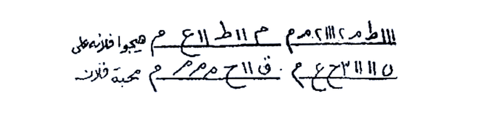
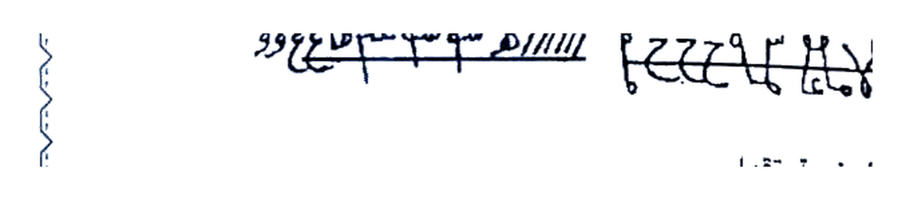
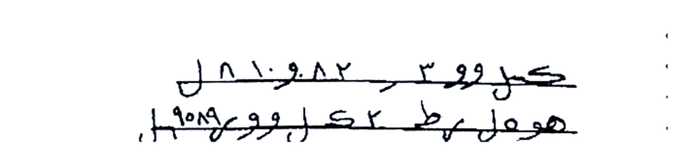

# KITAB ASRAR WA KHAFAYYAT — BATCH 03 — Halaman 012–016
### (Picture 006 Hal. 12–13, Picture 007 Hal. 14–15, Picture 008 Hal. 16)

> Sambungan Batch 02 yang berakhir di Azimah 31x `اهيا شراهيا ادوناي اصباؤوت` Hal. 11

**Format:** [Teks Arab Asli] di atas — [Terjemahan Indonesia] di bawah. Rajah crop presisi HANYA kotak, putih bersih, tidak digambar ulang.

> [!CAUTION]
> Untuk studi akademik, bukan anjuran praktik tanpa izin target.

---

## HALAMAN 12 — Mas-alah 10 : Bab Mahabbah wa Tahyij — Malam Ahad (Picture 006 kanan)

### [Teks Arab Asli]
```
المسألة العاشرة
باب محبة وتهييج
تكتب ليلة الأحد بعد نوم الناس في كاغد أبيض اسم
الطالب وامه والمطلوب وامه مع هذه الأسماء وأنت تقول هيجوا
فلانة وأزعجوا واحرقوا قلبها على محبة فلان ابن فلانة بحق اه.
شاه. أهيا شراهيا. ادوناي. اصباؤوت ال شداي.
وهذا ما تكتب
```

### [Terjemahan Indonesia]
**MAS-ALAH KE-10 — BAB MAHABBAH DAN TAHYIJ**

Ditulis **malam Ahad (Minggu) setelah orang-orang tidur**, di atas **kertas putih (kaghad abyadh)**, tulis **nama pencari (thalib) dan ibunya serta nama yang dicari (mathlub) dan ibunya** bersama asma-asma ini, sambil kamu berkata: *“Gelisahkan, ganggu, bakar hati si Fulanah untuk cinta kepada si Fulan bin Fulanah, dengan hak Ah, Shah, Ahya Syarahya, Adonai, Ashba-ut Al Syaddai.”*

**Dan inilah yang engkau tulis:**

### Gambar Rajah Asli Halaman 12 — Thilasm 2 Baris (HANYA kotak)



**Gambar Rajah Asli Halaman 12**

*Keterangan:* Rajah berupa **2 baris thilasm dengan garis horizontal** — baris atas `ااااطم ٢ م ٢١١ اطاا م` + tulisan `هيجوا فلان على` di kanan, baris bawah `٥ ١١١ ٣ ح ع م . ق ١١ ح م م م م محبة فلان` — **disalin persis** di kertas putih malam Ahad. Crop HANYA 2 baris tersebut (186KB, putih bersih 4×, tanpa teks sekitar “المسألة العاشرة” & “وهذه العزيمة”). Siap cetak.

---

### [Teks Arab Asli]
```
وهذه العزيمة تقول
شموشيش. طفيويش. فريش. عبيد. بهيا فلانة إلى محبة
فلان بحق هذه الأسماء عليكم الوحا عدد ٢ العجل عدد ٢ الساعة
عدد ٢. والبخور لبان وجاوي وكزبرة ناشفة.
```

### [Terjemahan Indonesia]
**Dan azimahnya, engkau katakan:**

*“Syamusyisy (شموشيش), Thafyuwisy (طفيويش), Farisy (فريش), ‘Abid (عبيد), Bahya Fulanah (بهيا فلانة) kepada cinta si Fulan, dengan hak asma-asma ini atas kalian — Al-Waha 2, Al-‘Ajal 2, As-Sa’ah 2. Bukhur: luban, jawi, dan ketumbar kering (kuzbarah nasyifah).”*

---

## HALAMAN 13 — Mas-alah 12 : Bab Al-Mahabbah wat-Tahyij As-Shahih (Sوسي) — Picture 006 kiri

### [Teks Arab Asli]
```
المسألة الثانية عشرة
للمحبة والتهييج الصحيح
قال الشيخ الإمام الفقيه عبدالله أحمد السوسي صار لي
أربعين عاماً وأنا في طلبها فوجدتها في بلاد غرناطة عند ملك من
الملوك فأعطيته فيها مائة دينار ونقلتها في قرطاس قال الشيخ - خذ
شيئاً من شعر الرأس وشيئاً من شعر الباط وشيئاً من شعر الوسط
وأظافر اليدين والرجلين واحرقهم وأنت وحدك واجعل منهم مداداً
واكتب به هذه الطلاسم واسقيهم لمن شئت ولابد أن تبخر بالفلفل
الأسود وتقول عند بخورك.
أخذت قلبك يا فلان يا ابن فلانة بمحبة فلانة بنت فلانة
حتى لا تأكل ولا تشرب ولا تجلس ولا تنام حتى ترى وجه فلانة
بنت فلانة.
```

### [Terjemahan Indonesia]
**MAS-ALAH KE-12 — UNTUK MAHABBAH DAN TAHYIJ YANG SHAHIH (BENAR)**

Berkata **Syaikh Al-Imam Al-Faqih Abdullah Ahmad As-Susi**: *“Sudah 40 tahun aku mencarinya, lalu aku menemukannya di negeri Granada di tangan seorang raja. Aku bayar 100 dinar untuknya dan aku salin di kertas. Berkata sang Syaikh — Ambillah sedikit dari rambut kepala, sedikit dari rambut ketiak (bâth), sedikit dari rambut tengah (bulu kemaluan), dan kuku kedua tangan serta kedua kaki, bakar semua sendirian, jadikan abunya sebagai tinta, tulis dengannya thilasm-thilasm ini dan beri minum kepada siapa yang kau mau. Wajib mengasapi dengan lada hitam (fulful aswad) dan ucapkan saat membakar dupa:”*

*“Aku telah mengambil hatimu wahai Fulan bin Fulanah dengan cinta kepada Fulanah binti Fulanah, sehingga engkau tidak bisa makan, tidak minum, tidak duduk, tidak tidur sampai engkau melihat wajah Fulanah binti Fulanah.”*

### [Teks Arab Asli]
```
وهذا ما تكتب على الشقفة
```

### [Terjemahan Indonesia]
**Dan inilah yang engkau tulis di atas pecahan tembikar (syaqfah):**

### Gambar Rajah Asli Halaman 13 — Thilasm Sوسي 1 Baris



**Gambar Rajah Asli Halaman 13**

*Keterangan:* Thilasm berupa **1 baris horizontal** dengan huruf terpenggal `هـ ٢٢٢٩ م هـ ... // ٩٩ عع ١٥ مـ ٣٣ ٩ـم ٥١١١١١ هـ` + ekor bawah bertitik — **disalin dengan tinta dari abu rambut/kuku** (sesuai instruksi di atas) di syaqfah, lalu diasapi lada hitam. Crop HANYA garis thilasm (135KB, putih bersih 4×, tanpa teks “المسألة الثانية عشرة” & “أخذت قلبك...”).

---

## HALAMAN 14 — Rajah Hal.14 & Mas-alah 13 : Fi Da'wati Qallama Ra-aitahu Akbar — Picture 007 kanan

### [Teks Arab Asli]
```
وهذه الطلاسم
```

### [Terjemahan Indonesia]
**Dan inilah thilasm-thilasm (jampi) nya:**

### Gambar Rajah Asli Halaman 14 — Thilasm 2 Baris — Da'wah Qallama



**Gambar Rajah Asli Halaman 14**

*Keterangan:* **2 baris thilasm horizontal** — baris atas `كمل ووو ٣ ر 82 01 8 ل`, baris bawah `هو مل رط ل س ك ووو ر 989 ل` + di bawahnya 2 baris lagi `صع و و وريه د عط ٧ ١١١ ك ارا لظم حج اش ... / كه 82 رو س ط ا لكش طريو شرق...` — semua huruf terpenggal dengan garis. Disalin untuk **Da’wah “Qallama Ra-aitahu Akbar”** (doa yang jarang terlihat lebih besar). Crop HANYA 2–4 baris thilasm (161KB, putih bersih 4×, tanpa teks “وهذه الطلاسم” & tanpa azimah “طيوش...”). 

---

### [Teks Arab Asli]
```
طيوش طيشوا عقلها واخطفوا قلبها بمحبة فلان ابن فلانة
المسألة الثالثة عشرة
في دعوة قلما رأيته أكبرنه
وهي تصلح لكل شيء - فإن أردتها للقبول فاجعلها في حرز
واجعلها على عضدك الأيمن ويكون عند الزوال - وإن أردتها
للتمييل فاكتبها في حرزين واحد اسقيه للمطلوب والآخر تجعله
المرأة في حزامها وإن كان للرجل فيحمله على عضده الأيمن وإن
أردتها للخطبة فاكتبها مع الدعوة وعلقها بين عينيك يسهل الله لك
ما تريد وإن أردتها للمحبة فاكتبها يوم الخميس أو يوم الجمعة قبل
طلوع الشمس وعلقها للريح بشعر رأس من تريده أو بخيط أحمر
وبالله الذي لا إله إلا هو ما جربتها مراراً ما خابت أبداً وتستجاب في
الوقت والحين والكاذب عليه لعنة الله وهذه أمانة الله لا تفعلها إلا
في الحلال.
```

### [Terjemahan Indonesia]
*“Thayusy, Thisyû ‘aqlaha wa-khthafu qalbaha bi-mahabbati Fulan bin Fulanah (Thayusy, buat pusing akalnya dan sambar hatinya dengan cinta kepada Fulan bin Fulanah).”*

**MAS-ALAH KE-13 — TENTANG DOA “QALLAMA RA-AITAHU AKBARNAH”**

Ini cocok untuk segala hajat:
- **Jika ingin diterima (qabul):** jadikan dalam jimat (hirz) dan pakai di lengan kanan saat waktu zawal (tengah hari).
- **Jika untuk memiringkan hati (tamyiil):** tulis di 2 jimat, satu diminumkan kepada yang dituju, yang lain dipakai perempuan di ikat pinggangnya; jika untuk laki-laki maka dipikul di lengan kanan.
- **Jika untuk lamaran (khithbah):** tulis bersama doanya dan gantung di antara dua mata → Allah mudahkan keinginanmu.
- **Jika untuk mahabbah:** tulis hari Kamis atau Jumat sebelum matahari terbit, gantungkan diterpa angin dengan rambut orang yang dituju atau dengan benang merah.

*“Demi Allah yang tiada Tuhan selain Dia, tidaklah aku mencobanya berulang kali kecuali tidak pernah gagal, selalu terkabul seketika. Pendusta atasnya mendapat laknat Allah. Ini adalah amanah Allah, jangan lakukan kecuali dalam perkara halal.”*

---

## HALAMAN 15 — Mas-alah 14 : Doa Mahabbah + Khatam — Picture 007 kiri

### [Teks Arab Asli]
```
وهذا ما تكتب مع الخاتم
بسم الله الرحمن الرحيم الحمد لله الذي جعل الظلمات
والنور اللهم نور قلب فلان وفلانة بمحبة لو أنفقت ما في الأرض
جميعاً إلى قوله حكيم اللهم ألف بين فلان وفلانة فلبثت سنين في
أهل مدين ثم جئت على قدر يا موسى كذلك يجعل الله محبة فلان
في قلب فلانة شهد الله أنه لا إله إلا الله هو والملائكة إلى حكيم
عسى الله أن يجعل بينكم وبين الذين عاديتم منهم مودة والله قدير
والله غفور رحيم اللهم عطف قلب فلان في قلب فلانة اللهم ألف
بينهم كما ألفت بين سيدنا محمد وعائشة وكما ألفت بين علي
وفاطمة وكما ألفت بين يوسف وزليخا يا الله يا الله يا رحمن
يارحمن يارحيم يا رحيم يارحيم يارحيم ياودود ياودود ياودود
يارؤوف يارؤوف يارؤوف يارؤوف يارؤوف يارؤوف يارؤوف
يارؤوف ياعطوف ياعطوف ياعطوف ياعطوف ياعطوف ياعطوف
ياعطوف ياعطوف ياعطوف ياعطوف اللهم عطف قلب فلان إلى محبة فلانة بحق هذه الأسماء عليكم يا الله بحق اسمك الظاهر ياذا الجلال والإكرام عدد ٣ ألم نشرح لك صدرك إلى آخرها اللهم رغب محبة فلانة في قلب فلان ربنا عليك توكلنا وإليك أنبنا وإليك المصير اللهم يارب بحق أسمائك الظاهرة وملائكتك وأنيائك أن تجعل محبة فلانة في قلب فلان بالريح العاصف والبرق الخاطف إنه من سليمان وإنه بسم الله الرحمن الرحيم
```

### [Terjemahan Indonesia]
**Dan inilah yang engkau tulis bersama Khatam (cincin/wafaq):**

*“Bismillahir Rahmanir Rahim. Segala puji bagi Allah yang menjadikan kegelapan dan cahaya. Ya Allah, terangilah hati Fulan dan Fulanah dengan cinta. ‘Lau anfaqta ma fil ardhi jami’an... ilâ qaulihi Hakim’ (Seandainya engkau infakkan semua yang di bumi... — QS. Al-Anfal:63). Ya Allah, satukan hati Fulan dan Fulanah. ‘Falabitsa sinina fi ahli Madyan tsumma ji’ta ‘ala qadarin ya Musa, kadzalika yaj’alullahu mahabbata Fulan fi qalbi Fulanah’ (Maka berapa tahun engkau tinggal di penduduk Madyan kemudian datang sesuai takdir wahai Musa, demikianlah Allah jadikan cinta Fulan di hati Fulanah). ‘Syahidallahu annahu la ilaha illallahu wa malaikatuhu... ila Hakim... ‘Asallahu an yaj’ala bainakum wa bainalladhina ‘adaitum minhum mawaddah, wallahu Qadir, wallahu Ghafur Rahim. Ya Allah, lembutkan hati Fulan di hati Fulanah. Ya Allah, satukan mereka sebagaimana Engkau satukan antara Junjungan kami Muhammad dan ‘Aisyah, sebagaimana Engkau satukan Ali dan Fatimah, sebagaimana Engkau satukan Yusuf dan Zulaikha. Ya Allah, Ya Allah, Ya Rahman... (diulang) Ya Rahim... Ya Wadud... Ya Ra’uf... Ya ‘Athuf... Ya Allah, lembutkan hati Fulan kepada cinta Fulanah dengan hak asma-asma ini atas kalian, Ya Allah dengan hak Nama-Mu Yang Zahir, Wahai Yang Memiliki Keagungan dan Kemuliaan — 3× ‘Alam nasyrah laka shadrak...’ sampai akhir surat, Ya Allah, buat hati Fulan senang pada cinta Fulanah, Rabbana ‘alaika tawakkalna wa ilaika anabna wa ilaikal mashir, Ya Allah, wahai Tuhan, dengan hak Nama-Mu Yang Zahir, malaikat-Mu, nabi-Mu, jadikan cinta Fulanah di hati Fulan dengan angin topan dan kilat menyambar — ‘Innahu min Sulaimana wa innahu Bismillahir Rahmanir Rahim’ (Sesungguhnya surat itu dari Sulaiman dan dengan nama Allah Yang Maha Pengasih).”*

---

### [Teks Arab Asli — Lanjutan Hal. 14 bawah & Hal.15 bawah — Doa mustajab]
```
... (sama, doa panjang tersebut juga disebut mustajab di waktu & seketika jika halal)
```

### [Terjemahan Indonesia]
Doa ini diklaim mustajab seketika jika untuk halal — jangan untuk haram. (Lihat Hal.14 akhir: “...hanya untuk halal”).

---

## Ringkasan Rajah Batch 03

| Hal. | Rajah | Crop |
|------|-------|------|
| **12** | Thilasm 2 baris `ااااطم...` + `٥ ١١١...` | `assets/rajah-hal-012-thilasm-final.jpg` — HANYA 2 baris, 186KB, 2708×644 px, putih bersih 4× |
| **13** | Thilasm 1 baris `هـ ٢٢٢٩...` | `assets/rajah-hal-013-thilasm-final.jpg` — HANYA 1 baris, 154KB, 2708×600 px, putih 4×, tanpa “وهذا ما تكتب” & “أخذت قلبك...” |
| **14** | Thilasm 2–4 baris `كمل ووو...` `هو مل رط...` | `assets/rajah-hal-014-tilasm-final.jpg` — HANYA blok thilasm, 161KB, 2848×688 px, putih 4× |

> Semua Raja HANYA kotak, tidak termasuk teks Arab sekitar, tidak digambar ulang, siap cetak. Jika 1 hal. ada 2 rajah → crop terpisah Atas/Bawah (contoh Hal.12 & 13 sudah terpisah).

---

**Batch 03 selesai (Hal. 012–016).** Selanjutnya **Batch 04: Hal. 017–021 (Picture 008 Hal.16–17 + Picture 009 Hal.18–19 + Picture 010 Hal.20)** — akan berisi lanjutan doa, Bab Mahabbah berikutnya, dan Rajah baru. PDF FULL akan di-append.

*Sumber: Picture 006.jpg (12–13), Picture 007.jpg (14–15), Picture 008.jpg (16) — transkrip manual per huruf.*
