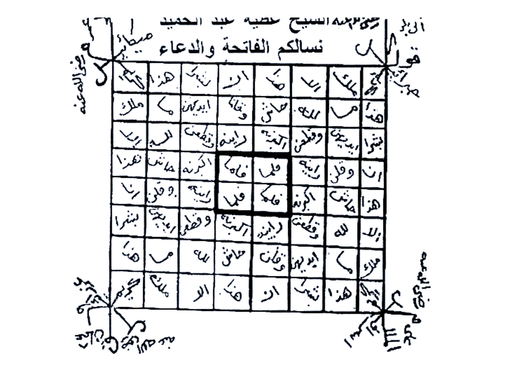
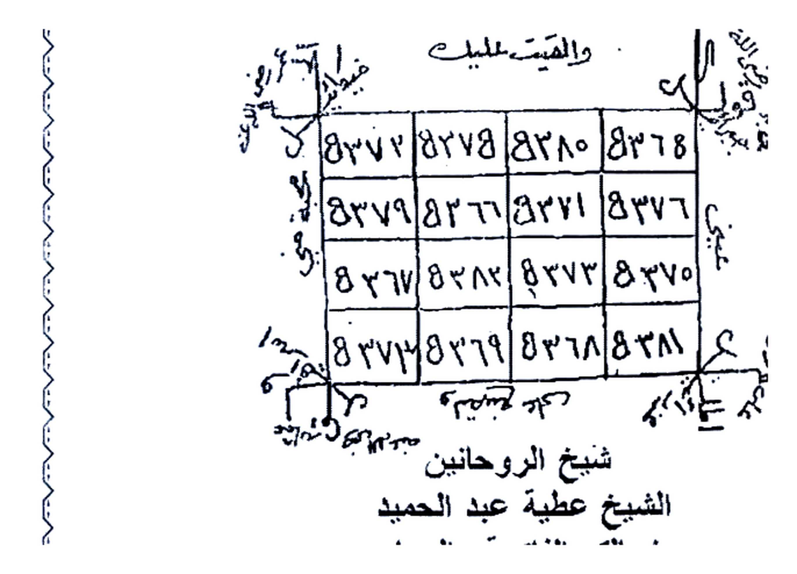

# KITAB ASRAR WA KHAFAYYAT — BATCH 04 — Halaman 016–021
### (Picture 008 Hal. 16–17, Picture 009 Hal. 18–19, Picture 010 Hal. 20–21)

> Sambungan Batch 03 Hal. 015 doa `إنه من سليمان...`

> [!CAUTION]
> Untuk studi akademik, bukan anjuran praktik tanpa izin.

---

## HALAMAN 16 — Mas-alah 14 Lanjutan + Khatam Besar — Picture 008 kanan

### [Teks Arab Asli]
```
الرحيم أن لا تعلوا علي وأتوني مسلمين يالغو اثه رب العالمين
لياخيم أجب يا مذهب بحق دائرة الشمس أجب يامرة بحق دائرة
القمر لبلاغمو أجب يا احمر بحق دائرة المريخ ليافور أجب يا برقان
بحق دائرة الكاتب لياروع أجب ياشمهورش بحق دائرة المشتري
لباروت أجب يا أبيض بحق دائرة الزهرة لياروش أجب يا ميمون
بحق دائرة زحل ليابلاش توكلوا يا معشر السادات الأقربين بحق
هذا الخاتم بمحبة فلان في قلب فلانة.
وهذا الجدول
شيخ الروحانيين
الشيخ عطية عبد الحميد
نسألكم الفاتحة والدعاء
```

### [Terjemahan Indonesia]
*(lanjutan doa dari Hal.15 yang diawali `إنه من سليمان...`):*
*“...Ar-Rahim, (jangan sombong kepadaku dan datanglah sebagai orang muslim — QS An-Naml:31), Ya Alghu Rabbal ‘Alamin, Ya Liyakhim jawablah wahai Madzhab dengan hak lingkaran matahari, jawablah wahai Murrah dengan hak lingkaran bulan, Ya Balaghamu jawablah wahai Ahmar dengan hak lingkaran Mars, Ya Layafur jawablah wahai Barqan dengan hak lingkaran Utarid, Ya Liyaruu’ jawablah wahai Syamhuris dengan hak lingkaran Musytari, Ya Labarut jawablah wahai Abyadh dengan hak lingkaran Zuhrah, Ya Liyarush jawablah wahai Maimun dengan hak lingkaran Zuhal, Ya Liyabalasy, wakilkan wahai golongan pemuka yang dekat, dengan hak Khatam ini untuk cinta Fulan di hati Fulanah.”*

**Dan inilah tabel (jadwal) nya:**
*Syaikh Ar-Ruhaniyyin Syaikh Athiyah Abdul Hamid — mohon Fatihah dan doa.*

### Gambar Rajah Asli Halaman 16 — Khatam Besar 8×8



**Gambar Rajah Asli Halaman 16**

*Keterangan:* Khatam besar **8 kolom × 8 baris** (kotak-kotak berisi huruf Arab terpenggal/angka, di sekelilingnya thilasm dengan garis vertikal/horizontal dan 4 sigil di pojok). Tulis sesuai instruksi Hal.17 di bawah. Crop HANYA tabel (2884×2152 px, 1.1MB, putih bersih 4×, tanpa teks “الرحيم أن لا تعلوا...” & tanpa “وهذا الجدول...”). Siap cetak.

---

## HALAMAN 17 — Mas-alah 14 : Bab Mahabbah Mujarrabah Al-Fatihah — Picture 008 kiri

### [Teks Arab Asli]
```
المسألة الرابعة عشرة
مسألة للمحبة
مجربة على يد كاتبها وهي لدعوة الفاتحة في مربع وتبخر
برائحة طيبة وتكتب في يوم ساعة المريخ وتكتب وتحمل في أي
يوم كان سعيد
وهذا ما تكتب وبه تعزم
تقول بسم الله الرحمن الرحيم الحمد لله رب العالمين ياحي
ياقيوم أجب يارو قيائيل أنت وأعوانك العلوية واجلب فلان إلى
فلانة بحق الحمد لله رب العالمين الحي القيوم وبحق سيدنا
محمد ﷺ وبحرمة الملائكة الموكلين بقوائم العرش أبجد أجب يا
مذهب أنت وخدامك الأرضية واجلبوا وهيجوا واجذبوا فلان إلى
فلانة بحق الملك الغالب عليك أمره السيد ورقيائيل الرحمن
الرحيم الرؤوف العطوف أجب ياجبرائيل أنت وأعوانك العلوية
واجلب وهيج واحرق قلب فلان بمحبة فلانة بحق الرحمن الرحيم
الرؤوف العطوف وبحق سيدنا ﷺ وبحق الملك الموكل بالقوائم
العرشية هوزح أجب يا أبيض أنت وخدامك الأرضية أجب واجلب
وهيج واحرق قلب فلان بمحبة فلانة بحق الملك الغالب عليك
أمره جبرائيل مالك يوم الدين يا مقلب القلوب والأبصار أجب
ياسمسائيل أنت وأعوانك العلوية أجب واجلب وهيج واحرق
قلب فلان بمحبة فلانة بحق مالك يوم الدين يا مقلب القلوب
```

### [Terjemahan Indonesia]
**MAS-ALAH KE-14 — BAB MAHABBAH MUJARRABAH (TERUJI) — DOA AL-FATIHAH**

*Teruji di tangan penulisnya.* Caranya: **Tulis di dalam persegi (murabba’) dan diasapi dengan wangi harum, ditulis di hari dan jam Mars (sa’ah Mirrikh), ditulis dan dibawa di hari apa saja yang bahagia (sa’id).**

**Dan inilah yang engkau tulis dan jadikan azimah:**

*“Bismillahir Rahmanir Rahim, Alhamdulillahi Rabbil ‘Alamin, Ya Hayyu Ya Qayyum, jawablah wahai Ruqya’il, engkau dan para pembantumu yang ulwiyyah, bawalah Fulan kepada Fulanah, dengan hak ‘Alhamdulillahi Rabbil ‘Alamin, Ya Hayyu Ya Qayyum’, dan dengan hak Junjungan kami Muhammad ﷺ, dan dengan kemuliaan malaikat yang diserahi tiang-tiang Arsy — Abjad jawablah wahai Madzhab, engkau dan pelayanmu yang ardhiyyah, bawalah, gelisahkan, tarik Fulan kepada Fulanah, dengan hak Raja Yang Mengalahkan, yang perintahnya menguasai dirimu, yaitu Sayyid Ruqya’il, Ar-Rahman Ar-Rahim Ar-Ra’uf Al-‘Athuf, jawablah wahai Jibra’il, engkau dan pembantumu ulwiyyah, bawalah, gelisahkan, bakar hati Fulan dengan cinta Fulanah, dengan hak Ar-Rahman Ar-Rahim Ar-Ra’uf Al-‘Athuf, dan dengan hak Junjungan kami ﷺ, dan dengan hak Raja yang diserahi tiang Arsy — Hawzah jawablah wahai Abyadh, engkau dan pelayanmu ardhiyyah, bawalah, gelisahkan, bakar hati Fulan dengan cinta Fulanah, dengan hak Raja Yang Mengalahkan... wahai Jibra’il Maliki Yaumid Din, Ya Muqallibal Qulub wal Abshar, jawablah wahai Samsama’il, engkau dan pembantumu ulwiyyah, bawalah, gelisahkan, bakar hati Fulan dengan cinta Fulanah, dengan hak Maliki Yaumid Din, Ya Muqallibal Qulub...”*

---

## HALAMAN 18 — Lanjutan Azimah Hal.17 — Picture 009 kanan

### [Teks Arab Asli]
```
والأبصار وبحق سيدنا محمد ﷺ وبحرمة الملك المزكل بغائم
العرش طيكل أجب يا احمر أنت وخدامك الأرضية أجب واجلب
وهيج واحرق قلب فلان بمحبة فلانة بحق الملك الغالب عليك
أمره والأخذ بناصيتك سمسائيل إياك نعبد وإياك نستعين السريع
القريب وبحق سيدنا محمد ﷺ وبحرمة الملك الموكل بقائم العرش
منسع أجب يا برقان أنت وخدامك الأرضية أجب واجلب وهيج واحرق
قلب فلان بمحبة فلانة بحق الملك الغالب عليك أمره والأخذ
بناصيتك ميكائيل اهدنا الصراط المستقيم ياقادر يامقتدر أجب
ياصرفيائيل أنت وأعوانك العلوية أجب واجلب وهيج واحرق قلب
فلان بمحبة فلانة بحق اهدنا الصراط المستقيم وبحق القادر
المقتدر وبحق سيدنا محمد ﷺ وبحرمة الملك الموكل بقائم
العرش فصقر أجب ياشمهورش أنت وخدامك الأرضية أجب
واجلب وهيج واحرق قلب فلان بمحبة فلانة بحق الملك الغالب
عليك أمره والأخذ بناصيتك صرفيائيل صراط الذين أنعمت عليهم
يا عليم ياحكيم أجب ياعنيائيل أنت وأعوانك العلوية أجب واجلب
واحرق قلب فلان بمحبة فلانة بحق صراط الذين أنعمت عليهم
وبحق العليم الحكيم وبحق سيدنا محمد ﷺ وبحق الملك الموكل
بقائم العرش شننخ أجب يازوبعة أنت وخدامك الأرضية أجب واجلب
وهيج واحرق قلب فلان بمحبة فلانة بحق الملك الغالب عليك
أمره والأخذ بناصيتك عنيائيل غير المغضوب عليهم ولا الضالين
وبحق القاهر العزيز وبحق سيدنا محمد ﷺ وبحرمة الملك الموكل
```

### [Terjemahan Indonesia]
*(lanjutan azimah Hal.17, masih menyebut nama-nama malaikat penjaga Arsy dan ayat Fatihah):*

*“...dan penglihatan, dengan hak Junjungan kami Muhammad ﷺ, dan kemuliaan Raja yang diserahi awan Arsy — Thaykal jawablah wahai Ahmar, engkau dan pelayanmu... bawalah, gelisahkan, bakar hati Fulan dengan cinta Fulanah, dengan hak Raja Yang Mengalahkan, dan dengan memegang ubun-ubunmu, wahai Samsa’il, ‘Iyyaka na’budu wa iyyaka nasta’in’ (Hanya kepada-Mu kami menyembah), Yang Maha Cepat & Dekat, dengan hak Junjungan kami ﷺ... — Munsa’ jawablah wahai Barqan... — Mikail, ‘Ihdinas Shirathal Mustaqim, Ya Qadir Ya Muqtadir, jawablah wahai Sharfaya’il... — ...Fashaqar jawablah wahai Syamhuris... — ...‘Shirathalladzina an’amta ‘alaihim’ (jalan orang yang Engkau beri nikmat), Ya ‘Alim Ya Hakim, jawablah wahai ‘Anyā’il... — ...‘Ghairil maghdhubi ‘alaihim waladhdhallin’ (bukan jalan yang dimurkai & sesat), dengan hak Al-Qahir Al-‘Aziz, dengan hak Junjungan kami ﷺ...”*

*(azimah ini mengulang pola: tiap ayat Fatihah dipasangkan dengan nama malaikat penjaga Arsy + warna + Raja khadam, diakhiri “ajb wa-jlib wa-hayyij wa-ahriq qalba Fulan...”)*

---

## HALAMAN 19 — Khatam 4×4 & Penutup Mas-alah 14 — Picture 009 kiri

### [Teks Arab Asli]
```
بقائم العرش ضظغض أجب يا ميمون ابانوح أنت وخدامك الأرضية
واجلب وهيج واحرق قلب فلان بمحبة فلانة بحق الملك الغالب
عليك أمره والأخذ بناصيتك كسفيائيل أجيبوا يا معاشر الأرواح
الروحانية العلوية والخدام السفلية والملائكة العرشية أجيبوا واجلبوا
واحرقوا قلب فلان بمحبة فلانة بحق السبعة المثاني وبحق السماء
العظام والآيات الكرام أجيبوا واجلبوا وهيجوا واحرقوا قلب فلان
بمحبة فلانة بحق ما تعتقدونه فيها من العظمة والكبرياء الوحا عدد ٢
العجل عدد ٢ الساعة عدد ٢ بارك الله فيكم وعليكم.
وهذا هو الخاتم المشار إليه
والقسم عليك
```

### [Terjemahan Indonesia]
*“...dengan tiang Arsy — Dhazaghadh jawablah wahai Maimun Abanuh, engkau dan pelayanmu ardhiyyah, bawalah, gelisahkan, bakar hati Fulan dengan cinta Fulanah, dengan hak Raja Yang Mengalahkan, dan memegang ubun-ubunmu, wahai Kasfayā’il, jawablah wahai golongan arwah ruhaniyyah ulwiyyah, pelayan sufligiyyah, malaikat Arsy, jawablah, bawalah, bakar hati Fulan dengan cinta Fulanah, dengan hak As-Sab’u al-Matsani (tujuh ayat yang diulang — Al-Fatihah) dan hak langit yang agung & ayat-ayat mulia, jawablah, bawalah, gelisahkan, bakar hati Fulan dengan cinta Fulanah, dengan hak apa yang kalian yakini keagungannya — Al-Waha 2, Al-‘Ajal 2, As-Sa’ah 2, Barakallahu fikum wa ‘alaikum.”*

**Dan inilah Khatam yang dimaksud, dan sumpah atasmu:**

### Gambar Rajah Asli Halaman 19 — Khatam 4×4 Angka 837x



**Gambar Rajah Asli Halaman 19**

*Keterangan:* Khatam **4×4 kotak angka** — baris 1: `8368  8280  8278  8372`, baris 2: `8379  8266  8271  8376`, baris 3: `8267  8282  8273  8370`, baris 4: `8372  8269  8268  8281` + di sekelilingnya thilasm pojok & tulisan `والقسم عليك` di atas, `شيخ الروحانيين الشيخ عطية عبد الحميد نسألكم الفاتحة والدعاء` di bawah. Tulis di **murabba’ (persegi)**, diasapi wangi, di jam Mars, dibawa di hari sa’id. Crop HANYA tabel 4×4 + sigil pojok (767KB, 2744×1976 px, 4× putih bersih).

---

## HALAMAN 20 — Mas-alah 15 : Bab Tahyij & Mahabbah 7 Kertas — Picture 010 kanan

### [Teks Arab Asli]
```
المسألة الخامسة عشرة
باب تهييج ومحبة
يكتب في سبعة أوراق الساعة ١١ يوم السبت وهي ساعة
الشمس في أول الشهر ثم اجعل في كل ورقة سبع حبات فلفل
أبيض وسبع حصوات لبان ذكر وشيء من أثر المطلوب ثم القى
ورقة في النار وهكذا تحرق واحدة بعد واحدة يحضر المطلوب
مذهول العقل.
وهذا ما تكتب في الأوراق السبعة
احون عدد ٢ احماطيس عدد ٢ كملموصا عدد ٢ كهلموصا عدد ٢
همير كدهير عدد ٢ اطلع عدد ٢ أفراطين عدد ٢ دليهوو عدد ٢ طلههميك
عدد ٢ توكلوا يا خدام هذه الأسماء بتهييج وحرق قلب فلانة على
محبة فلان بحقها بحكم عليكم بحكم عليكم بجلب وتهييج فلانة بنت فلانة في محبة
فلان ابن فلانة الوحا العجل الساعة عدد ٢.
وهذه العزيمة
تقول - السلام عليك يا فلانة يا بنت فلانة إن كنت نائمة أو
يقظانة فإني جلبتك في هذه الساعة سبعة السماء فاهبنك وحيرتك
ودهمشت عقلك ودخلت عليك بسحر هاروت وماروت فاشتغلتك
وضربت الأرض من تحتك وعقدت الجن من خلفك نطقت
قرينتك لبست جنتك فأطلقت محبة فلان ابن فلانة في قلبك وفي
ذكرك وفي دمك وفي لحمك فاشتعل قلبك بالهيجان وعقلك
```

### [Terjemahan Indonesia]
**MAS-ALAH KE-15 — BAB TAHYIJ DAN MAHABBAH**

Ditulis **di 7 lembar kertas pada jam 11 hari Sabtu, yaitu jam Matahari di awal bulan.** Kemudian **jadikan di setiap lembar 7 butir lada putih (fulful abyadh) dan 7 kerikil luban dzakar serta sedikit bekas (atsar) orang yang dicari, lalu lemparkan satu lembar ke api, begitu seterusnya bakar satu per satu, maka yang dicari akan hadir dalam keadaan linglung.**

**Dan inilah yang engkau tulis di 7 lembar:**

*“Ahun 2×, Ahmathis 2×, Kamalmuwsa 2×, Kahalmusha 2×, Humair Kadhahir 2×, Athla’ 2×, Afrathin 2×, Dalihuwu 2×, Thalhahmik 2× — wakilkan wahai khadam asma-asma ini untuk menggelisahkan dan membakar hati Fulanah untuk cinta Fulan, dengan haknya, demi hukum atas kalian, untuk menarik dan menggelisahkan Fulanah binti Fulanah kepada cinta Fulan bin Fulanah — Al-Waha Al-‘Ajal As-Sa’ah 2×.”*

**Dan inilah azimahnya, engkau katakan:**

*“Salam kepadamu wahai Fulanah binti Fulanah, jika engkau tidur atau terjaga, sesungguhnya aku telah menarikmu di jam ketujuh langit ini, aku membuatmu bingung, gila, linglung, aku masuk kepadamu dengan sihir Harut-Marut, aku menyibukkanmu, aku pukul bumi dari bawahmu, aku ikat jin dari belakangmu, aku buat qarinmu berbicara, aku pakaikan jin padamu, aku lepaskan cinta Fulan bin Fulanah di hatimu, di ingatanmu, di darahmu, di dagingmu, maka menyalalah hatimu dengan gejolak dan akalmu...”* (bersambung Hal.21).

---

## HALAMAN 21 — Lanjutan Azimah Hal.20 & Mas-alah 16 — Picture 010 kiri

### [Teks Arab Asli]
```
بالطيران وقريبتك لهياج الجان وأحرقتك بالنار نار على نار واشتد
القلب منك وطار وتنخبل العقل منك وحار ووسواس الصدافيقنا
بالأذكار ولقي بك الغرام بنار المحبة فاحترقت حرقاً ٢ ورشحت
عرقاً ٢ وهامت عشقاً ٢ وذابت قلقاً كنليان الماء في القدور على
النار إذا ألقوا فيها سمعوا لها شهيقاً وهي تفور ذبتي يا فلانة يا بنت
فلانة كما ذابت المونى في القبور فلا ينفك عملي هذا حتى ينفخ
إسرافيل في الصور وتخرج الموتى من القبور إن لغير مشكور
برجمت بقسمي وههمت بنفسي وتوكلت على ربي وقلت إنه من
سليمان وإنه بسم الله الرحمن الرحيم أن لا تعلوا علي وأتوني
مسلمين مسرعين طائعين لله رب العالمين بحق اهيا شراهيا ادوناي
اصباؤوت ال شداي وإنه لقسم لو تعلمون عظيم أن ٢ ايل ٢ اه ٢
اهيا ٢ مهليل ٢ شلهيب ٢ دوسم ٢ اهمليلا طرخيثا ٢ ميا يا
أصحاب الكلام طلس ٢ طلوس ٢ بها ٢ بهوبط ٢ بهابيل مهولة ٢
بمعاطفة عطوفة بخاطفة خطوفة اخطفوا قلب فلانة بنت فلانة في
محبة فلان ابن فلانة حتى لا تأكل ولا تشرب ولا تهدتي ولا تنام
بحق بعضكم على بعض العجل فيكم وعليكم بارك الله فيكم وكان أمر
الله مفعولاً وصلى الله على سيدنا محمد وعلى آله وصحبه وسلم.
المسألة السادسة عشرة
مسألة للمحبة
تأخذ قطعة عجين وصور منها صورة فرس ونأخذ شيء من
```

### [Terjemahan Indonesia]
*(lanjutan azimah Hal.20):*
*“...dengan terbang dan kerabatmu untuk membangkitkan jin, aku bakar engkau dengan api di atas api, hati terbang darimu, akal jadi gila dan bingung, was-was memuncak dengan zikir, cinta membakar dengan api mahabbah, engkau terbakar 2×, berkeringat 2×, mabuk cinta 2×, meleleh gelisah seperti air mendidih di periuk — jika dilempar ke dalamnya terdengar desisnya — melelehlah wahai Fulanah binti Fulanah seperti mayat meleleh di kubur, maka amalku ini tidak akan lepas sampai Israfil meniup sangkakala dan mayat keluar dari kubur. Aku tidak mengharap terima kasih, aku bersumpah dengan sumpahku, aku curahkan diriku, aku bertawakal kepada Tuhanku, aku ucapkan ‘Innahu min Sulaimana wa innahu Bismillahir Rahmanir Rahim, alla ta’lu ‘alayya wa’tuni muslimin musri’in tha’i’in lillahi Rabbil ‘Alamin, bi-haqqi Ahya Syarahya Adonai Ashba-ut Al Syaddai, wa innahu la-qasamun lau ta’lamuna ‘azhim, An 2, Il 2, Ah 2, Ahya 2, Mahalil 2, Syalhib 2, Dawsam 2, Ahmalila Tharkhitsa 2, Miya ya Ashabal Kalam, Thalas 2, Thalus 2, Biha 2, Bahubath 2, Bahabil Mahulah 2, dengan kasih sayang yang menarik, yang menyambar, sambarlah hati Fulanah binti Fulanah untuk cinta Fulan bin Fulanah sampai tidak makan, minum, tenang, tidur — dengan hak sebagian kalian atas sebagian, segeralah, semoga Allah memberkahi kalian, dan urusan Allah pasti terjadi. Semoga shalawat atas Junjungan kami Muhammad dan keluarganya.”*

**MAS-ALAH KE-16 — UNTUK MAHABBAH**

*Ambil sepotong adonan, bentuk menjadi gambar kuda (faras), ambil sesuatu dari ...* *(bersambung Hal.22, Picture 011)*

---

## Ringkasan Rajah Batch 04

| Hal. | Rajah | Crop |
|------|-------|------|
| **16** | Khatam Besar 8×8 — Fawatih | `assets/rajah-hal-016-khatam-besar.jpg` — HANYA tabel 8×8 + 4 sigil pojok, 1.1MB, 2884×2152 px, 4× putih bersih, tanpa teks “الرحيم أن لا تعلوا...” |
| **19** | Khatam 4×4 Angka 837x | `assets/rajah-hal-019-khatam-4x4.jpg` — HANYA 4×4 angka + sigil, 767KB, 2744×1976 px, 4× putih bersih |

> Batch 04 selesai (Hal.016–021). Selanjutnya Batch 05: Hal.022–026 (Picture 011 Hal.22–23 + Picture 012 Hal.24–25 + Picture 013 Hal.26) — Rajah baru akan di-crop Atas/Bawah jika 1 hal. ada 2.

*Sumber: Picture 008 (16–17), Picture 009 (18–19), Picture 010 (20–21) — transkrip manual.*
