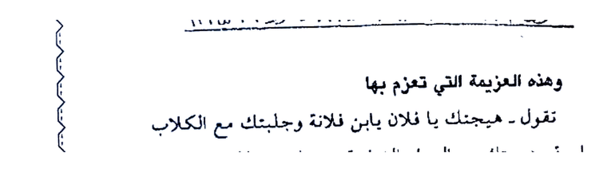
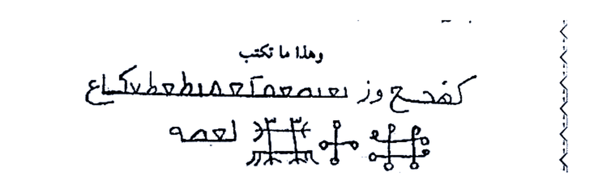
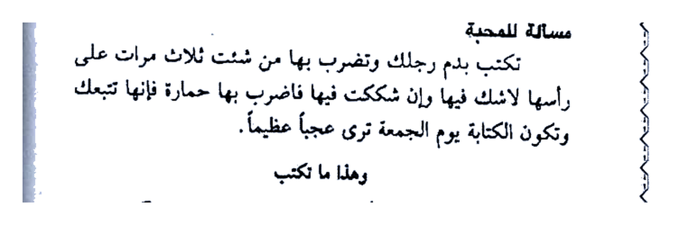
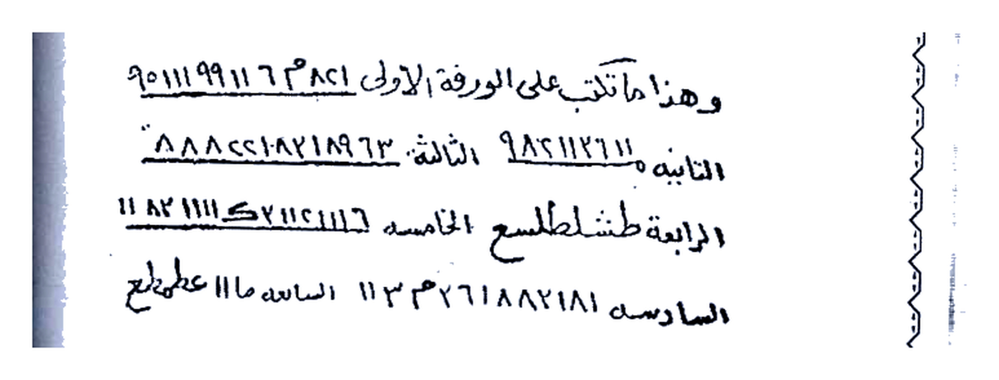

# KITAB ASRAR WA KHAFAYYAT — BATCH 05 — Halaman 022–026
### (Picture 011 Hal. 22–23, Picture 012 Hal. 24–25, Picture 013 Hal. 26)

> Sambungan Batch 04 Hal. 021 `تأخذ قطعة عجين وصور منها صورة فرس ونأخذ شيء من...`

> [!CAUTION]
> Untuk studi akademik, bukan anjuran praktik tanpa izin.

---

## HALAMAN 22 — Mas-alah 16 Lanjutan (Kuda Adonan) — Picture 011 kanan

### [Teks Arab Asli]
```
أثر المطلوب وتكتب عليها هذه الأسماء الآتي ذكرها وتلونها
قطران وزيت طيب وتبخرهما مثل الفتيلة وتجعلهما في فم الفرس
وأيضاً تكتبهم في كفك الشمال قبل أن توضع الفتيلة في فم
الفرس.
وهذا ما تكتب على الكف والأثر
قزن قزن قرن هزن هزن هزن خزن خزن خزن فرش فرش
فرش الجلبيوش الجلبيوش ذو العزة والسلطان انفروا خفافاً وثقالاً
فإذا قضيت الصلاة فانتشروا في الأرض
يا ابا طح بابا لا وتبخرهم بمقل أزرق ولبان ذكر
ثم توقد الفتيلة وتزعم فإنك ملك روحاني افتح يدك في وجهه
وتكون كاتب الكتابة في الكف.
وهذا ما تعزم به
تقول - معترايش جه مقـرش لطوش هند وفطش طيطيش هيا
فلطش بحق فهروش لشـهبا فقـرش الساعة إلى فلان ابن فلانة بارك
الله فيكم وعليكم.
المسألة السابعة عشرة
للمحبة والتهييج
تكتب في صفيحة من الرصاص وتنقش عليها هذه الطلاسم
ثم تأخذ شيئاً من أثر المطلوب وتجيب شقفة جديدة وتوضعها في
```

### [Terjemahan Indonesia]
*(lanjutan Mas-alah 16 — Membuat kuda dari adonan):* ...**ambil sesuatu dari bekas (atsar) orang yang dituju, tulis di atasnya nama-nama berikut, warnai dengan ter dan minyak wangi, asapi seperti sumbu, jadikan keduanya di mulut kuda, juga tulis keduanya di telapak tangan kirimu sebelum sumbu diletakkan di mulut kuda.**

**Dan inilah yang engkau tulis di telapak tangan & bekas:**

*“Qazan Qazan Qaran Hazan Hazan Hazan Khazan Khazan Khazan Farasy Farasy, Ya Jalbuyusy Jalbuyusy Yang Maha Perkasa dan Penguasa, pergilah ringan & berat, ‘fa-idza qudhiyatish-shalatu fantasyiru fil-ardh’ (QS Al-Jumu‘ah:10), Ya Aba Thah Baba La...”* dan diasapi dengan muqul biru & luban dzakar, lalu **nyalakan sumbu dan berserulah engkau sebagai Raja Ruhani “buka tanganmu di wajahnya”**, sedangkan penulisnya ada di telapak tangan.

**Dan inilah yang engkau azimahkan, engkau katakan:**

*“Ya Mu’tara, Jih miqrasy lathusy Hind wa Fathasya Thaythasy, hayya Falathasya, dengan hak Fahrusy untuk Syahba Fa-qarsy, dalam jam ini kepada Fulan bin Fulanah, semoga Allah memberkahi kalian.”*

**MAS-ALAH KE-17 — UNTUK MAHABBAH & TAHYIJ**

*Tulis di lembaran timah (shafihah min ar-rashas), ukir di atasnya thilasm berikut, lalu ambil sesuatu dari bekas yang dituju, ambil pecahan kendi baru, letakkan di dalamnya...* (bersambung Hal.23).

---

## HALAMAN 23 — Mas-alah 17 Lanjutan + Ta‘widh — Picture 011 kiri

### [Teks Arab Asli]
```
النار فإذا حميت الشقفة ترمي عليها الأثر والرصاص فوق الأثر
وتعزم عليها ٢١ مرة والبخور لبان ذكر وكسبرة.
وهذا ما تنقش على الرصاص مع اسم المطلوب وأمه كما
ترى انهم ترشد
٩٥٠١١١ ط ٦٢٢١٩ ٦٦ا؛ ٩١٩٦ ط ٠٤٢ اع ٦٢٢١٩
هنا ليس ط ١٦ كذا ط ك لم ٦١ لما ط ٢٠٠٠ا تعالى الحى السلطان
سورية ٩١٩ ١١ ١١ ٩١٦٩ ٦٩٩١ سوية ٦٩١٢ ا ٩١٦
وهذه العزيمة التي تعزم بها
تقول - هيجتك يا فلان يا ابن فلانة وجلبتك مع الكلاب
النابحة وهيجتك مع السباع الضارية هيجتك مع الذئاب العاوية
هيجتك مع الديوك الصائحة هيجتك يا فلان مع الرياح الهائلة
بالمردة المستر قين السمع من سحب ابا النار والنور والظل
والحرور اعزم على سكان الحمامات والقميدات والبراري
والقفاري والأسواق والأبيار والرياسين عجلوا واسرعوا وهيجوا
فلان ابن فلانة مدكيوش هيوش دهوش هاروت وماروت بزوبعة
ولوبعة والمغاريت الأربعة بحق كبارهم وصغارهم وصغاركم على
كباركم بحق بكشارش كشارش وكوش طموش شلبنايشا قدقد
وعيال بالغ شهر وش عدد ٧ حلش ٢ هليوش ٢ شلوش ٢ بقلوش
٢ وطبطون ٢ رعشتر ٢ اسرعوا ٢ وعجلوا ٢ والقوا محبة فلانة
بنت فلانة في قلب فلان ابن فلانة الوحا العجل الساعة.
```

### [Terjemahan Indonesia]
*“...di atas api, jika pecahan kendi sudah panas, lemparkan di atasnya bekas & timah di atas bekas, beri azimah **21 kali**, bukhur **luban dzakar & ketumbar kering**.”*

**Dan inilah yang engkau ukir di timah bersama nama yang dituju & ibunya, sebagaimana engkau lihat:**

### Gambar Rajah Asli Halaman 23 — Ukiran di Timah (2 baris angka/huruf)



**Gambar Rajah Asli Halaman 23**

*Keterangan:* 2–3 baris tulisan tangan terbalik/angka Arab `٩٥٠١١١...` + `هنا ليس ط...` + `سورية ٦٩١٢...` — ukiran di lembar timah bersama nama target+ibunya, diasapi di shafqah panas 21×. Crop HANYA blok ukiran (3020×864 px, 203KB, 4× putih bersih, tanpa teks “وهذا ما تنقش...” di atas & tanpa “وهذه العزيمة...” di bawah). Disalin persis arah tulis asli.

**Dan inilah azimah yang engkau bacakan:**

*“Aku gelisahkan engkau wahai Fulan bin Fulanah, aku tarik engkau bersama anjing menyalak, aku gelisahkan engkau bersama binatang buas, serigala melolong, ayam jantan berkokok, aku gelisahkan engkau dengan angin topan, dengan maradah yang mencuri dengar dari awan Aba An-Nar wan-Nur wazh-Zhull wal-Harur, aku sumpahi penghuni hammam, qana’id, padang, pasar, sumur, riyasin — segeralah, gelisahkan Fulan bin Fulanah — Madkayusy Hayusy Dahusy, Harut-Marut, Zau-ba‘ah, Lub‘ah, Magharit empat, dengan hak besar & kecilnya, dengan hak Bak-syarasy Kas-yarasy, Kusy Thamusy Syalabla-nayasya Qadqad, Wa ‘Iyal Baligh Syahra-wasya, Halasya 7× Haliyusy 2× Syalusy 2× Baqlusy 2× Thab-thun 2× Ra‘syatar 2× — segeralah, lemparkan cinta Fulanah binti Fulanah ke hati Fulan bin Fulanah — Al-Waha Al-‘Ajal As-Sa‘ah.”*

---

## HALAMAN 24 — Mas-alah 17 Lanjutan & Mas-alah 18/19/09 — Picture 012 kanan

### [Teks Arab Asli]
```
٢ وطبطون ٢ رعشتر ٢ اسرعوا ٢ وعجلوا ٢ والقوا محبة فلانة
بنت فلانة في قلب فلان ابن فلانة الوحا العجل الساعة.
المسألة الثامنة عشرة
مسألة للمحبة
تكتب بدم رجلك وتضرب بها من شئت فإنه يتبعك من شدة
المحبة وإن شككت فيها فاضرب بها حمارة فإن تبعك.
وهذا ما تكتب
ك هـ ح ع وز نعص ع هـ ط ص ط ل ك ك ساكح
لعمه
المسألة التاسعة عشرة
مسألة للمحبة
تكتب بدم رجلك وتضرب بها من شئت من شئت ثلاث مرات على
رأسها لاشك فيها وإن شككت فيها فاضرب بها حمارة فإنها تتبعك
وتكون الكتابة يوم الجمعة ترى عجباً عظيماً.
وهذا ما تكتب
فقطط هـ هـ هـ طو مـعص الطو طـلا ق كـ يحصه
عمر طـطـ مـعـ هـم هـ مـ هـ
...
```

### [Terjemahan Indonesia]
*(lanjutan azimah Hal.23 ditutup)* — *“...Al-Waha Al-‘Ajal As-Sa‘ah.”*

**MAS-ALAH KE-18 — UNTUK MAHABBAH**

*Tulis dengan darah kakimu (dam rijlik), pukulkan kepada siapa kau mau, maka ia akan mengikutimu karena sangat cinta. Jika ragu, pukul ke ledai (himarah), jika mengikutimu maka terbukti.*

**Dan inilah yang engkau tulis:**

### Gambar Rajah Asli Halaman 24 — Atas — Thilasm Ke-18 (ك هـ ح ع وز...)



**Gambar Rajah Asli Halaman 24 (Atas)**

*Keterangan:* Baris `كـ هـ ح ع وز نـعـصـ عـ هـ طـ صـ طـ لـ ك ك سـا كـح` + di bawahnya 3 sigil “*” berdampingan dengan garis bawah `لعمه`. Tulis dengan darah kaki, pukul target. Crop HANYA thilasm + 3 sigil (2952×956 px, 233KB, 4× putih bersih).

**MAS-ALAH KE-19 — UNTUK MAHABBAH**

*Tulis dengan darah kaki juga, pukul siapa kau mau tiga kali di kepalanya, tanpa ragu; jika ragu pukul ke ledai, niscaya mengikutimu. Ditulis **hari Jumat**, engkau lihat keajaiban besar.*

**Dan inilah yang engkau tulis:**

### Gambar Rajah Asli Halaman 24 — Bawah — Thilasm Ke-19 (فقطط...)



**Gambar Rajah Asli Halaman 24 (Bawah)**

*Keterangan:* Baris `فـقـطـط هـ هـ هـ طـو مـعـص الـطـو طـلا ق كـ يـحصـه` + `عـمـر طـطـ مـع هـم هـ مـ هـ` + baris titik `○○○○○○○○○○○○○○` — thilasm khusus Jum‘at 3× pukul kepala. Crop HANYA thilasm + titik (3092×1000 px, 303KB, 4× putih bersih).

---

## HALAMAN 25 — Mas-alah 20 & 21 — Bab Mahabbah + Bab Sirr Mashun — Picture 012 kiri

### [Teks Arab Asli]
```
المسألة العشرون
باب محبة
يكتب على شقفة بمعتبر معتبر طيبير طيبير منفرد منفرد منفرد
منفرد ينفرد بهشهشة ٢ بكشكشة ٢ مكشكشة ٢ هاطلة ٢ مهولة ٢
خاطفة ٢ خطوفة ٢ احتفظ يا هـاروش وانت ياماروش وانت يا سريع
وانت يا بريق وانت يا عبد النار قلب فلانة بنت فلانة إلى محبة
فلان ابن فلانة الوحا العجل الساعة والبخور لبان ذكر وكسبرة
وتقرأ العزيمة بعد كتابتها على الشقفة عدد ٤ مرات أو عدد ٢١ مرة
وهي في النار دائمة الوقود.
المسألة الواحدة والعشرون
باب السر المصون
ملمون ثم ملمون من يطلع عليه غير أهله وهو من ذخائر
الملوك وهو يتصرف في أمور شتى فمنها للتهيج فمنها لإحضار الخصم
ومنها لإرسال الهواتف ومنها لصرع المصاب.
فإذا أردت التهيج تكتب يوم الأحد عند طلوع الشمس
واجعلها عليك بعد قراءة العزيمة ٢١ مرة واتقي الله ويبخرها
بالصندل الأحمر وإن أردت للإرسال تقرؤه ليلة الجمعة. وإن
أردت للصرع اكتبه في كف المصاب.
وهي هذه هياش مياش شالوش طاشي وتركل بهم بهذه
الأسماء تقول:
```

### [Terjemahan Indonesia]
**MAS-ALAH KE-20 — BAB MAHABBAH**

*Tulis di atas pecahan kendi (shafqah) dengan: Mu‘tabir Mu‘tabir, Thaybir Thaybir, Munfarid Munfarid Munfarid Munfarid Yanfarid bi-Hasyhasyah 2× bi-Kasykasyah 2× bi-Maksy-kasyah 2× Hathilah 2× Mahulah 2× Khathifah 2× Khuthufah 2× — “Jagalah wahai Harusy, Marusy, Sari‘, Bariq, ‘Abdan Nar, hati Fulanah binti Fulanah untuk cinta Fulan bin Fulanah — Al-Waha Al-‘Ajal As-Sa‘ah” — bukhur luban dzakar & ketumbar, baca azimah setelah menulis di shafqah **4 kali atau 21 kali** saat di api terus menyala.*

**MAS-ALAH KE-21 — BAB SIRRUN MASHUN (RAHASIA TERJAGA)**

*“Malmoun lalu malmoun siapa yang menampakkan kepada selain ahlinya — ini simpanan raja, bisa dipakai banyak hal: untuk tahyij, menghadirkan lawan, mengirim hawātif (bisikan gaib), merobohkan orang kesurupan. Jika ingin tahyij, tulis hari Ahad terbit matahari, bawalah setelah membaca azimah 21×, takutlah kepada Allah, asapi cendana merah. Jika ingin mengirim, baca malam Jum‘at. Jika ingin merobohkan, tulis di telapak orang kesurupan. Dan ini dia: **Hayasy Mayasy Syalusy Thasyi** — engkau mewakilkan dengannya, ucapkan nama-nama berikut: ...* (bersambung Hal.26).

---

## HALAMAN 26 — Lanjutan Sirr Mashun + Mas-alah 22/23 (+ 7 Waraq Daun Zaitun) — Picture 013 kanan

### [Teks Arab Asli]
```
كشارش ٢ مشارش ٢ طرباش ٢ ايغوش ٢ جالهوش ٢
تعملوش ٢ كندريوش ٢ عواديوش ٢ هيا ٢ يا أهل النار والنار والشرار
والأزعاج والأمراض وتركلـوا وافعلوا كذا بحق هذه الأسماء عليكم
وطاعتها لديكم نار واحراق من عصى منكم يكون قتيلاً الوحا ٢
العجل ٢ الساعة ٢
واصرافه
والصافات إلى قوله ناقب يا راصد الجن ياغليطا امتنع دبيلح
بخ ٢ سلام ٢ هيو ٢ ميهو ٢ الملك لله الواحد القهار.
المسألة الثانية والعشرون
باب محبة
يكتب على ورق الزيتون يوم الأحد قبل طلوع الشمس على
سبع ورقات زيتون ونجعل في ورقة حصوة لبان ذكر واحرتهم
واحدة بعد واحدة وأنت تقول يا خدام هذه الأسماء احرقوا قلب
فلان ابن فلانة في محبة فلانة بنت فلانة.
وهذا ما تكتب على الورقة الأولى ٦٣٨٢١ ٩٥١١٩٩١١ هـ ٩٥١١
الثانية ٩٨٢١١٢١١٠ ٢١٩٦٣ ٨٨٨٨٢٢١٨٢١٣
الثالثة
الرابعة طنـش طـلع طـسمح الخامسة د١١١٧ ك ١١١١ ٨٢ ١١
السادسة
السابعة ٨٢١٨١ ١١٣٢ م ٦٨٢١١ السادسة ١١ا على ملح
```

### [Terjemahan Indonesia]
*(lanjutan Hayasy Mayasy...):* *“...Kas-yarasy 2× Masyarasy 2× Tharbasy 2× Aighusy 2× Jalhasy 2× Ta‘malusy 2× Kandariyusy 2× ‘Awadiyusy 2× — hayya ya Ahlan Nar wasy-Syarar wal-Iz‘aj wal-Amradh, wakilkan & kerjakan hal itu dengan hak asma ini, ketaatannya, api & pembakaran siapa yang durhaka akan terbunuh — Al-Waha 2 Al-‘Ajal 2 As-Sa‘ah 2.”*

**Dan pengembaliannya (sharf):**

*“Wash-Shaffat ... sampai ‘tsaqib’, Ya Rashidul Jin Ya Ghalitha, tahanlah Dubaylah Bakh 2 Salam 2 Hayw 2 Mihaw 2 — kerajaan milik Allah Al-Wahid Al-Qahhar.”*

**MAS-ALAH KE-22 — BAB MAHABBAH (7 DAUN ZAITUN)**

*Tulis **di daun zaitun hari Ahad sebelum terbit matahari pada 7 lembar daun zaitun**, jadikan di setiap daun satu kerikil luban dzakar, bakarkan satu demi satu sambil berkata: “Wahai khadam asma ini, bakar hati Fulan bin Fulanah untuk cinta Fulanah binti Fulanah.”*

**Dan inilah yang engkau tulis di:**

### Gambar Rajah Asli Halaman 26 — 7 Waraq Daun Zaitun (Angka)



**Gambar Rajah Asli Halaman 26**

*Keterangan:* **7 baris untuk 7 daun** — Baris 1: `٦٣٨٢١ ٩٥١١٩٩١١ هـ ٩٥١١`, Baris 2: `٩٨٢١١٢١١٠ ٢١٩٦٣ ٨٨٨٨٢٢١٨٢١٣`, Baris 3: kosong acak cetak, Baris 4: `طـنـش طـلـع طـسـمـح` + `د١١١٧ ك ١١١١ ٨٢ ١١` (waraq 5), Baris 6–7: `٨٢١٨١ ١١٣٢ م ٦٨٢١١` waraq 6–7 + catatan `السادسة ١١ا على ملح`. Semua ditulis di daun zaitun, tiap daun 1 kerikil luban, bakar satu-satu Ahad sebelum subuh. Crop HANYA 7 baris angka/thilasm (3092×1176 px, 416KB, 4× putih bersih, tanpa teks “المسألة الثانية والعشرون...” di atas & tanpa “المسألة الثالثة والعشرون...” di Picture 013 kiri bawah).

> **Catatan Hal.26:** Angka pada scan agak kabur tinta — disalin persis apa adanya.

---

## Ringkasan Rajah Batch 05

| Hal. | Rajah | Crop |
|------|-------|------|
| **23** | Ukiran Timah Mas-alah 17 | `assets/rajah-hal-023-inscription.jpg` — HANYA 2 baris angka (3020×864 px, 203KB, 4× putih) |
| **24 Atas** | Thilasm Darah Kaki Mas-alah 18 | `assets/rajah-hal-024-top-thilasm.jpg` — HANYA `ك هـ ح...` + 3 sigil `لعمه` (2952×956 px, 233KB) |
| **24 Bawah** | Thilasm Darah Kaki Mas-alah 19 (Jum‘at) | `assets/rajah-hal-024-bottom-thilasm.jpg` — HANYA `فقطط...` + titik (3092×1000 px, 303KB) |
| **26** | 7 Waraq Daun Zaitun | `assets/rajah-hal-026-waraq-7numbers.jpg` — HANYA 7 baris angka (3092×1176 px, 416KB) |

> Batch 05 selesai (Hal.022–026). Selanjutnya Batch 06: Hal.027–031 (Picture 013 Hal.27 — Telur/Baidh + Rajah thumb, Picture 014 Hal.28–29, Picture 015 Hal.30–31).

*Sumber: Picture 011 (22–23), Picture 012 (24–25), Picture 013 (26) — transkrip manual.*
