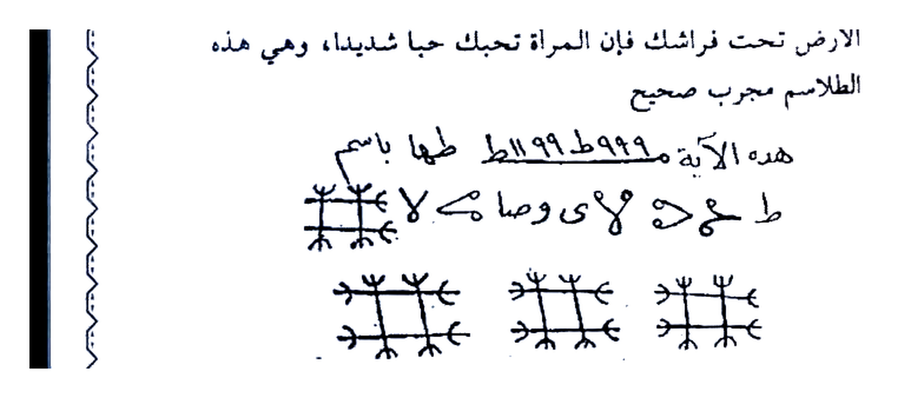
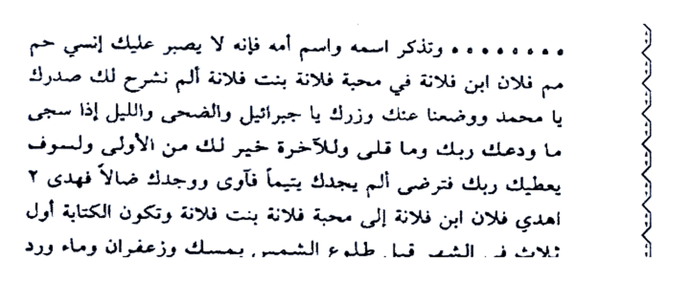

# KITAB ASRAR WA KHAFAYYAT — BATCH 06 — Halaman 027–031
### (Picture 013 Hal. 27, Picture 014 Hal. 28–29, Picture 015 Hal. 30–31)

> Sambungan Batch 05 Hal. 026 `السابعة ٨٢١٨١ ١١٣٢ م ٦٨٢١١ ... على ملح`

> [!CAUTION]
> Untuk studi akademik, bukan anjuran praktik tanpa izin.

---

## HALAMAN 27 — Mas-alah 23 & 24 — Picture 013 kiri

### [Teks Arab Asli]
```
المسألة الثالثة والعشرون
باب محبة
يكتب على بيضة بنت يومها وتبخرها بلبان وسندروس
ومسكتكي وكبريت وادفنها في نار
وهذا ما تكتب على البيضة
كموخين كلوخين عطوشين مره مروشين طلوشين ابن كزير ابن
زريعا طهوشين شلوشين ظهرفين جلاجين خورشين ابن الرياح
الموكل بالرياح وأعوانك وخدامك واحرق قلب فلانة على محبة فلان
العجل عدد ٢ الوحا عدد ٢ الساعة عدد ٢ بحق هذه الأسماء عليكم يا خدام
هذه الأسماء كونوا عوناً لي بحق سليمان بن داود عليه السلام.
المسألة الرابعة والعشرون
باب محبة النساء
تكتب يوم الاثنين مع اسم الرجل واسم المراة وتدفنه في
الأرض تحت فراشك فإن المراة تحبك حباً شديداً، وهي هذه
الطلاسم مجرب صحيح
هذه الآية ٩٩٩ ططه ١١٩٩ ط طها باسم
ط هـ ٧ حـ ٧ وصا ٧
...
```

### [Terjemahan Indonesia]
**MAS-ALAH KE-23 — BAB MAHABBAH**

*Tulis di atas telur yang baru di hari itu (binti yaumihi), diasapi dengan luban, sandarus, mustaki & belerang, lalu pendam di dalam api (kubur di bara).*

**Dan inilah yang engkau tulis di atas telur:**

*“Kamukhain Kalukhain ‘Athusyain, Marrah Marusyain Thalusyain Ibnu Kazir Ibnu Zari‘a Thahusyain Syalusyain Zhahrafain Jalajain Khurasyain Ibnu Ar-Riyah — wahai yang diserahi angin, engkau dan pembantu & pelayanmu, bakar hati Fulanah untuk cinta Fulan — Al-‘Ajal 2 Al-Waha 2 As-Sa‘ah 2, dengan hak asma ini wahai khadam, jadilah penolongku dengan hak Sulaiman bin Daud ‘alaihis salam.”*

**MAS-ALAH KE-24 — BAB MAHABBAH AN-NISA’ (CINTA WANITA)**

*Tulis **hari Senin** bersama nama lelaki & nama wanita, kubur di tanah di bawah ranjangmu, maka wanita itu akan mencintaimu sangat. Inilah thilasmnya — mujarrab shahih:*

> Ayat ini 999 Thatha 1199 Tha Thaha dengan nama `طه هـ ٧ حـ ٧ وصا ٧...`

### Gambar Rajah Asli Halaman 27 — Thilasm Hari Senin (Bawah Ranjang)



**Gambar Rajah Asli Halaman 27**

*Keterangan:* Thilasm 2 baris + 3 simbol di bawah — baris atas `هذه الآية ٩٩٩ ططه ١١٩٩ ط طها باسم`, baris bawah `طـ هـ ٧ حـ ٧ وصا ٧` + 3 sigil “*” berdampingan (jajar 3). Tulis Senin bersama nama pasangan, kubur bawah kasur. Crop HANYA thilasm + 3 sigil (3092×1352 px, 426KB, 4× putih bersih, tanpa “المسألة الثالثة...” & tanpa “يكتب على بيضة...”).

---

## HALAMAN 28 — Mas-alah 25 — Bab Mahabbah Mujarrab Shahih — Picture 014 kanan

### [Teks Arab Asli]
```
المسألة الخامسة والعشرون
باب محبة مجرب صحيح
تكتب هذه الأسماء في ورقة ويحمل على الرأس وتكتب
أيضاً وتدفن تحت عتبة باب من تريد فإنه لا يصبر عليك ساعة
واحدة
وهذا ما تكتب واحذر من الغلط
اخ ح ح ح ح ح ح ح ح لعله له له له لم لم لم لم لم لم لم لم لم
لم صر صر صر صر صر صر ص ص ص ص ص ص ص ص ص ص ص ص ص ص ص ص
لك ك ك ك ك ك !! طو طو طو طو طو طو طو طو اكر طو طر ه ٥ ٥
........... وتذكر اسمه واسم أمه فإنه لا يصبر عليك إنسي حم
مم فلان ابن ثلاثة في محبة فلانة بنت فلانة الم نشرح لك صدرك
ووضعنا عنك وزرك يا جبريل والضحى والليل إذا سجى
ما ودعك ربك وما قلى وللآخرة خير لك من الأولى ولسوف
يعطيك ربك فترضى ألم يجدك يتيماً فآوى ووجدك ضالاً فهدى ٢
اهدي فلان ابن فلانة إلى محبة فلانة بنت فلانة وتكون الكتابة أول
ثلاث في الشهر قبل طلوع الشمس بمسك وزعفران وماء ورد
ويحملها الطالب تحت العمامة في مقدم رأسه ويقبل على
المطلوب.
شيخ الروحانيين
الشيخ عطية عبد الحميد
نسألكم الفاتحة والدعاء
باب محبه مجرب صحيح والله لا شك فيه
بسم الله ابدء كلامي واصلي في الثاني على من بحبه ويجب اتباع سنته ناداني محمد
النبي الظاهر صلاة الله وسلامه عليك وعلى ال بيتك الطاهرين وعلى اصحابك التابعين
```

### [Terjemahan Indonesia]
**MAS-ALAH KE-25 — BAB MAHABBAH MUJARRAB SHAHIH**

*Tulis nama-nama ini di kertas, bawa di atas kepala, tulis lagi dan kubur di bawah ambang pintu orang yang kau tuju, maka ia tidak akan tahan darimu meski satu jam.*

**Dan inilah yang engkau tulis — hati-hati jangan salah:**

### Gambar Rajah Asli Halaman 28 — Thilasm “اخ ح ح... لم صر... طو...”



**Gambar Rajah Asli Halaman 28**

*Keterangan:* Blok thilasm besar — baris 1: `اخ ح ح ح ح ح ح ح ح لعله له له له لم لم...`, baris 2: `لم صر صر صر ص ص ص ص...`, baris 3: `لك ك ك ك !! طو طو طو... اكر طو طر ه ٥ ٥` + baris titik `○○○○●○○○○○`. Ditulis dengan “sebut nama & nama ibunya — maka tidak tahan, wahai hamba...” lanjut `Alam nasyrah laka shadrak...` (QS Alam Nasyrah & Adh-Dhuha). Crop HANYA blok thilasm (2884×1176 px, 495KB, 4× putih bersih).

*(Lanjutan teks setelah Rajah):* “...hayyu insan himmim, Fulan bin Fulana untuk cinta Fulanah binti Fulanah — *Alam nasyrah laka shadrak wa wadha’na ‘anka wizrak* — wahai Jibril, *Wadhdhuha wal laili idza saja... al am yajidka yatiman...* — hadiahkan Fulan bin Fulanah kepada cinta Fulanah binti Fulanah, 2×. Tulis **tiga hari pertama bulan sebelum terbit matahari** dengan **misk, za‘faran, air mawar**, bawa di bawah sorban di depan kepala, hadap kepada yang dituju.

— *Syaikh Ar-Ruhaniyyin Syaikh ‘Athiyah Abdul Hamid, mohon Fatihah & doa.*”

**BAB MAHABBAH MUJARRAB SHAHIH LAIN — Tidak ada keraguan, demi Allah:**

*“Bismillah aku mulai perkataanku, shalawat kedua kepada yang wajib mengikuti sunnahnya, yang memanggilku Muhammad Nabi Zhahir, semoga shalawat & salam Allah atas keluarga suci & sahabat pengikut...”* (bersambung Hal.29 — sanjungan & shalawat pembuka).

---

## HALAMAN 29 — Lanjutan Sanjungan + Bab Jalb Syam‘atain Kuat — Picture 014 kiri

### [Teks Arab Asli]
```
بإحسان الى يوم الدين امين صلى الله عليه وسلم...اما بعد ,, لمن اراد ان ينعم بحب
المحبوب يكتب بالمداد الطاهر المعروف لدينا جميعا قوله تعالى وداود وسليمان اذ يحكمان
في الحرث اذ نفشت فيه غنم القوم وكنا لحكمهم شاهدين كذلك حكمت وملكت محبة فلان
ابن فلانه في قلب فلانه بنت فلانه هل اتى على الانسان حين من الدهر لم يكن شيئا
مذكورا انا خلقنا الانسان من نطفة امشاج نبتليه نبليه نبتليه كذلك يبتلي او تبتلاى فلانه
بنت فلانه بمحبة فلان ابن فلانه بالمحبه الدائمه بدوام ملك الله تم
وكمل على وضعه الصحيح وفهما الله واياكم على كل ما هو في الخير دائما ان شاء الله
اللهم لا تكلنا الى احد غيرك طرفة عين بجاه النبي الامين
جلب الشمعتين
اكتب على شمعتين الاتي
على الاولى : ومن الجن من يعمل بين يديه بإذن ربه الى الشكور توكلوا يا خدام هذه
الايات بجلب وتهيج فلان بن فلانه
وعلى الثانية : ومن الجن من يعمل بين يديه بإذن ربه الى الشكور بمحبة فلانة بنت فلانة
ومن الجن من يعمل بين يديه بإذن ربه الى الشكور ثم اطلق الجاوي والكسبره واللبان الذكر وعزم
عليهما حتى يلتقيان ثم اشعل الشمعتين فان المطلوب يأتى سريعا وجرب وحكم والعزيمه
هى الايه التى كتبتها على الشمع بدون عدد
ملحوظه
تضع كل شمعة في يد ثم تضع اليدين على الركب وانت مستقبل القبلة ثم تعزم ثم تعزم فان اليدين
يجتمعان فعندها اشعل الشمعتين
باب جلب قوى
```

### [Terjemahan Indonesia]
*(lanjutan pembuka Hal.28):* *“...dengan kebaikan sampai hari pembalasan, amin... Bagi yang ingin dianugerahi cinta kekasih, tulis dengan tinta suci yang kita kenal — firman Allah: **‘wa Dawud wa Sulaimana idz yahkumani fil harts... wa kunna li-hukmihim syahidin’** (QS Al-Anbiya’ 78) — demikian pula aku menghukumi & memiliki cinta Fulan bin Fulanah di hati Fulanah binti Fulanah — **‘hal ata ‘alal insani hinum minad dahr... inna khalaqnal insana min nuthfatin amsyaj, nabtalihi...’** (QS Al-Insan 1–2) — demikian pula diuji Fulanah dengan cinta Fulan yang kekal selama kerajaan Allah tetap — sempurna sebagaimana aslinya, semoga Allah pahamkan.”*

*Doa:* *“Ya Allah jangan serahkan kami kepada selain-Mu sekejap mata, demi Nabi Al-Amin.”*

**JALB ASY-SYAM‘ATAIN (MENARIK DENGAN DUA LILIN):**

*Tulis di dua lilin:*

- *Lilin 1:* **“wa minal jinni man ya’malu baina yadaihi bi-idzni Rabbihi ilas Syakur — tawakkalu ya khuddam hadzihil ayat bi-jalbi wa tahyiji Fulan bin Fulanah”**
- *Lilin 2:* **“wa minal jinni... bi-mahabbati Fulanah binti Fulanah”** *(+ ulangi ayat ketiga)*

*Lalu bakar **jawi, ketumbar, luban dzakar**, beri azimah pada keduanya sampai keduanya bertemu, lalu **nyalakan dua lilin**, maka yang dituju datang cepat — telah dicoba & terbukti. Azimahnya adalah ayat yang sama yang kau tulis di lilin, tanpa hitungan.*

**Catatan penting:** *Letakkan tiap lilin di tiap tangan, letakkan tangan di lutut, menghadap kiblat, lalu beri azimah — maka kedua tangan akan bertemu, saat itu nyalakan dua lilin.*

**BAB JALB KUAT** *(judul berikutnya, bersambung Hal.30).*

---

## HALAMAN 30 — Bab Jalb Kuat (2 Figur) + Fawaid Jalb — Picture 015 kanan

### [Teks Arab Asli]
```
تأخذ على بركة الله تعالى ورقة بيضاء وتشخص منها شخصين وبخور عمال وهو
الذكر وهو ان تأخذ 50حمصة لبان ذكر وتكتب عليها حرف الجيم (( ج )) وهذا ما
على الشخصين وبه تعزم تقول جلبت بجاه جلال الجبروت بعزة العظمة وبالكبرياء و
من تجلى للجبل فجعله دكا وخر موسى صعقا جلبت محبوبي من مطلوبي لأى حبيب
القريب المحيب اجب ياطلفايل خادم حرف الجيم بما فيك من الشر والثلجج بتلجلج
وبجلطننج وفولحنج وعولحنح وارجحنح برجحنح كرجحنح الشمس في الوهيج جعلتك جوا
واقسمه عليك برب العباد سبحان من ليس كمثله شياء وهو السميع البصير...
ملحوظة
تحرم من كل شخص ورق خرم من جانب الصدر الجانب اليمين ويوضع فيهم خيط ابيض
مثل حبل الكتان او من القطن وتعزم عليهم حتى يقفوا الشخصين وينجمعوا فهذه علامة
الاجابة
ومن الفوائد الجليلة للمحبة والجلب
تأخذ قطعة من أثر المطلوب وتكتب عليها وبل لكل همزة الى نار وتوكل اجلبوا كذا الى
محبة كذا الواحا العجل الساعتو الكتابة بمسك وزعفران وماء ورد وتعملها فتيلة وتوقد
في سراج بدهن الياسمين مقايلا لبيت المطلوب وتعزم عليه بما يأتى 21 مرة وأنت تبه
بعد منقوع في ماء ورد وهو ان تقول اعزم عليكم أيها الأرواح الروحانية المتوكلين
بهذه الفتيلة أنت يادهنش وأنت يا زوبعة وأنت يا لوبعة وأنت يا مهقال وأنت يا عبدان
وان يا سيدوك بالذى جل وارتفع واثقن ما صنع وشتت وجمع وأمر البرق فلمع والغيث
فهمع وكلم موسى فاستمع وتجلى للجبل فجعله دكا وخر موسى صعقا ساجدا راكعا من
الخوف والفزع فقال الله تعالى يا موسى ) إنى انا الله لا إله إلا انا خالق السماوات
```

### [Terjemahan Indonesia]
**BAB JALB KUAT (DUA FIGUR):**

*“Ambillah dengan berkah Allah kertas putih, bentuk darinya dua figur (syakhsaini), bukhur amalnya adalah luban dzakar — yaitu ambil **50 butir luban dzakar**, tulis di atasnya huruf **ج (Jim)** — dan inilah yang (ditulis) pada dua figur, dengan itu engkau beri azimah, ucapkan: ‘Aku telah menarik dengan keagungan Jabarut, kemuliaan & kesombongan — Yang menampakkan diri ke gunung lalu hancur & Musa pingsan — aku telah menarik kekasihku dari yang kucari kepada kekasih mana saja — yang dekat yang menjawab, jawablah wahai **Thalthafayil** pelayan huruf Jim dengan apa yang ada padamu dari Syar & Tsaljuj bi-Taljuj wa Bilthanj wa Ful… wa ‘Aulah … wa Arj… — matahari dalam panasnya, aku jadikan engkau udara — aku bersumpah atasmu demi Tuhan hamba, Maha Suci Yang tidak ada seperti-Nya, Dia Maha Mendengar Maha Melihat...’”*

**Catatan:** *Lubangi tiap figur kertas di sisi dada kanan, masukkan benang putih seperti tali linen/kapas, beri azimah sampai dua figur **berdiri & bertemu** — itu tanda terkabul.*

**DAN DI ANTARA FAEDAH AGUNG UNTUK MAHABBAH & JALB:**

*Ambil sepotong dari bekas yang dituju, tulis di atasnya **‘wailun likulli humazah ila nar’** (QS Al-Humazah) dan wakilkan “tarik si anu kepada cinta si anu — Al-Waha Al-‘Ajal As-Sa‘ah” — tulis dengan **misk, za‘faran, air mawar**, jadikan sumbu, nyalakan di **lampu minyak Yasamin menghadap rumah yang dituju**, beri azimah **21 kali** sedangkan engkau (memiliki) rendaman air mawar, dengan mengucapkan: “Aku bersumpah kepada kalian wahai arwah ruhaniyyah yang diserahi sumbu ini — engkau wahai Dahnisy, Zau-ba‘ah, Lau-ba‘ah, Mahqal, ‘Abadan, dan wahai Sayyiduk dengan Yang Maha Agung & Meninggi, yang menetapkan ciptaan, yang menceraiberaikan & mengumpulkan, yang memerintahkan kilat berkilat & hujan tercurah, yang berbicara kepada Musa lalu Musa mendengar, yang menampakkan diri ke gunung lalu Musa tersungkur sujud ruku’ karena takut, lalu Allah berfirman: **‘Ya Musa, inni Ana Allahu la ilaha illa Ana Khaliqus Samawat...’**”* (bersambung Hal.31).

---

## HALAMAN 31 — Lanjutan Azimah Sumbu + Bab Wafaq Segitiga 693 — Picture 015 kiri

### [Teks Arab Asli]
```
والأرض ) أقسمت عليكم يا خدام هذه الأسماء بالإسم الذى خلق الله به البحر العجاج
فهاج وماج وتلاطم بالأمواج وصار كالليل الداج فسبحت حيتانه واضطربت أركانه من
هيبة الله ذى الجلال والإكرام بديع السموات والأرض عزمت عليكم بكهيعص وحم عسق
وبطه ويس ويسور ن وبص ويسورة ق والقرآن وبطلسم القرآن وبسورة الرحمن
والحواميم والدخان والطور وكتاب مسطور في رق منشور والبيت المعمور والسقف
المرفوع والبحر المسجور ان عذاب ربك لواقع ماله من دافع ) وانه لقسم لو تعلمون
عظيم ) أن ( تسرعوا وتهيجوا كذا كذا بحق هذه الأسماء والأقسام وإلا يرسل عليكما
شواظ من نار ونحاس فلا تنتصران أو يرسل عليكم صاعقة مثل صاعقة عاد وثمود
فتنكو كما أخبر الله في القرآن فانما خر من السماء فتخطفه الطير او تهوى به الرياح
في مكان سحيق "إلا ما هيجتم كذا كذا بحق هذه الأسماء فإن خالفتم رميتكم بشهاب
ثاقب وشواظ من نار فتلتهبوا كما تلتهب هذه الفتيلة حتى تأتوا بكذا الى كذا بحق ايها
شراهيا ادوناى اصباؤوت ال شداي الواحا2 العجل2الساعة2
باب محية وجلب وعطف بين المراة وزوجها
وهو سريع الإجابة لكل أمر من جلب خير ودفع كل شر تركب مثلث وهو عدده 693
وتوكل بما تريد حول الجدول وهو مدور وقوله أهم سقف حلع يص طرن وعلقه في
السبيية من عيدان الرومان الحلو ويبخر بالكندر والقزبور والجاوي وعنبر وأنت نتلو
عليه الإسم الأعظم المذكور عدد 1111 فان الوفق يدور فإذا دار فأعلم بأن الحاجة التى
وكلت عليها إنقضت سواء كان خيرا لم شر وهذه من مجربات التجاني الكبير وهو أن
نطرح من العدد 12 ونقسمه على 3 وادخل في بيت الواحد بزيادة الى بيت الياء ثم الى
```

### [Terjemahan Indonesia]
*(lanjutan sumpah Hal.30):* *“...dan bumi) — aku bersumpah kepada kalian wahai khadam asma ini dengan Nama yang Allah ciptakan lautan bergelombang dengannya, lalu bergolak, berombak seperti malam gelap, bertasbih ikannya, berguncang pilarnya karena wibawa Allah Pemilik Keagungan, Pencipta langit & bumi — aku sumpahi kalian dengan **Kaf Ha Ya ‘Ain Shad, Ha Mim ‘Ain Sin Qaf**, Thaha, Ya Sin, Qaf, Al-Qur’an, thilasm Qur’an, Ar-Rahman, Hawa-mim, Ad-Dukhan, Ath-Thur, ‘wa kitabin mastur fi raqqin mansyur, wal baitil ma‘mur was saqfil marfu‘ wal bahril masjur, inna ‘adzaba Rabbika lawaqi‘ ma lahu min dafi‘ — wa innahu la-qasamun lau ta‘lamuna ‘azhim — bahwa kalian **bersegeralah & gelisahkan si anu**, dengan hak asma dan sumpah ini, jika tidak maka akan dikirim kepada kalian **nyala api & tembaga** sehingga kalian tidak menang, atau dikirim **petir seperti kaum ‘Ad & Tsamud**, kalian binasa sebagaimana Allah kabarkan, ‘barang siapa jatuh dari langit disambar burung atau diterbangkan angin ke tempat jauh — kecuali kalian telah menggelisahkan si anu, jika kalian membantah aku lempar kalian dengan **syihab & nyala api**, kalian terbakar seperti sumbu ini sampai kalian datangkan si anu — dengan hak **Ahya Syarahya Adonai Ashba-ut Al Syaddai — Al-Waha 2 Al-‘Ajal 2 As-Sa‘ah 2**.’”*

**BAB MAHABBAH, JALB DAN ‘ATHF ANTARA ISTRI & SUAMINYA**

*— Cepat terkabul untuk setiap urusan menarik kebaikan & menolak kejahatan. Susunlah **wafaq segitiga (mutsallats) yang jumlahnya 693**, wakilkan sekehendakmu di sekeliling tabel, tabelnya **bundar**, ucapannya **“Ahammu Saqafa Hala‘ Yash Tharan”** — gantungkan di **anyaman (sabiyyah) dari ranting delima manis**, diasapi **kundur, ketumbar, jawi, anbar**, sedangkan engkau **membaca Ism Al-A‘dham yang tersebut sebanyak 1111 kali**, maka **wafaq akan berputar**; jika sudah berputar ketahuilah hajat yang kau wakilkan telah selesai, baik kebaikan maupun keburukan. Ini dari **mujarrabat At-Tijani Al-Kabir**, yaitu engkau **kurangi dari bilangan 12, bagi 3, masukkan di bait Alif dengan tambahan ke bait Ya’ kemudian ke ...*** (bersambung Hal.32, Picture 016 — rincian wafaq mutsallats).

---

## Ringkasan Rajah Batch 06

| Hal. | Rajah | Crop |
|------|-------|------|
| **27** | Thilasm Senin Bawah Ranjang | `assets/rajah-hal-027-thilasm-baidah.jpg` — HANYA 2 baris + 3 sigil (3092×1352 px, 426KB, 4× putih) — telur/bawah ranjang |
| **28** | Thilasm “اخ ح ح... لم صر...” | `assets/rajah-hal-028-thilasm-ah-hah.jpg` — HANYA blok 3 baris + titik (2884×1176 px, 495KB, 4× putih) — bawa di kepala & bawah ambang |

> Batch 06 selesai (Hal.027–031). Selanjutnya Batch 07: Hal.032–036 (Picture 016 Hal.32–33 + Picture 017 Hal.34–35 + Picture 018 Hal.36) — Rajah wafaq mutsallats 693.

*Sumber: Picture 013 (27), Picture 014 (28–29), Picture 015 (30–31) — transkrip manual.*
