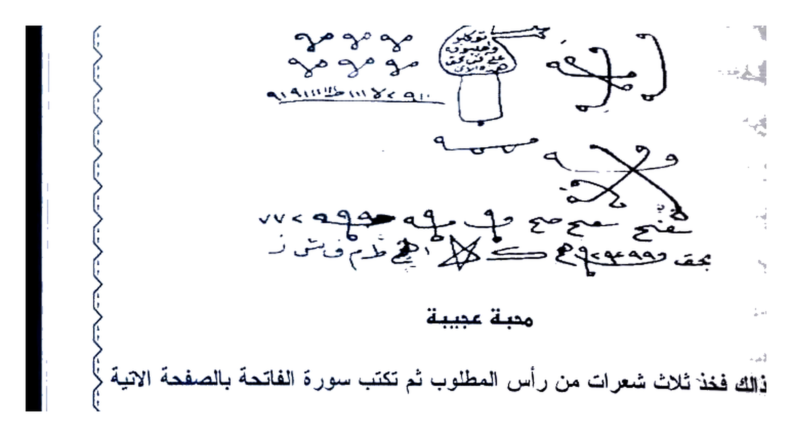

# KITAB ASRAR WA KHAFAYYAT — BATCH 08 — Halaman 037–041
### (Picture 018 Hal. 36–37, Picture 019 Hal. 38–39, Picture 020 Hal. 40–41)

> Sambungan Batch 07 Hal. 036 `...بتهييج وحرق قلب وفؤاد...`

> [!CAUTION]
> Untuk studi akademik, bukan anjuran praktik tanpa izin.

---

## HALAMAN 36 — Lanjutan Khusus ‘Aqd Naum + Bab Mahabbah Shahih Sa‘id — Picture 018 kanan

### [Teks Arab Asli]
```
وهو إذا أردت العمل به أن تجلس لوحدك في مكان خالى من الناس بعد العشاء وتنام
العزيمة الآتية على 7 سبع حصوات لبان ذكر أبيض وعلى كل حصوة من اللبان
مرات وترميها في النار وتفعل ذلك الى تمام السبع 7 حصوات لبان وتنام فإن المطلوب
ينام ولا ينقفل له جفن من شدة المحبة والقلقت حتى يأتيك سريعا وهذا ماتمزم به يشتم
2طش2 خط2 طحطيح2 بهكويل2 أجب ياريوش وتوكل بتهييج وجلب وعقد
كذا وكذا واعقدوا نومهما بمحبته حتى لاتنام لإتمام لافى ليل ولا فى نهار من شدة القلق
والوسواس والأفكار بحق كهود2 لههود2 لعهود2 بطوش2 بهاد2 بهيرك2 بهيروك2
يكروك2 توكل ياعنقود بتهييج وجلب كذا إلى كذا ومحبته كذا بين كذا واعقدوا نومه
بمحبته بحق نهرطيح2 نمليح2 ق ليح2 شلشميخ2 أن كانت إلا صيحة واحدة فإذاهم
لدينا محضرون الواحا2 العجل2 الساعة2
ولا تفعل هذا الباب إلا في الحلال فوالله مجرب ولا أضع لكم إلا المجربات فصنه عن
ليهتك به المحرمات وقد نصحتك
باب محبة صحيح ومجرب
يكتب بالزعفران والمسك ويحمل في يوم كان سعيدا الاحد والخميس والاثنين واول
إلى العاشر منه الهجرى هذه هي الايام السعيدة خذوها قاعدى لكى نتكلم عنها في
الابواب باختلاف الساعات الفلكية وهذا ما تكتب وبه تعزم بسم الله الرحمن الرحيم
الحمدلله رب العالمين يا حي يا قيوم أجب يا روقيائيل أنت وأعوانك العلوية واجلب
إلى فلانة أو العكس والحمدلله رب العالمين الحى القيوم وبحق سيدنا محمد صلى الله
وسلم وبحرمة الملائكة الموكلين بقوالم العرش أبجد أجب يا مذهب أنت وخدامك الأرض
وأفعل كذا بحق الملك الغالب عليك امره السيد روقيائيل الرحمن الرحيم بحق العزيز
```

### [Terjemahan Indonesia]
**LANJUTAN KHUSUS TA‘QID NAUM (HAL.36 ATAS):**

*Jika ingin amal: duduk sendirian di tempat sepi setelah Isya, baca **azimah berikut pada 7 kerikil luban dzakar putih**, tiap kerikil beberapa kali lalu **lempar ke api**, lakukan sampai 7 kerikil lalu tidurlah — maka target **tidak akan terpejam matanya** karena sangat cinta & gelisah sampai datang cepat. Azimahnya yang kau gumamkan:*

*“2-Thasy 2-Khath 2-Thahthah 2-Bihakwil 2 — jawablah ya Rayusy, wakilkan untuk gelisahkan, tarik, ikat — si anu & si anu, ikat tidurnya dengan cintanya sampai tidak tertidur malam–siang karena cemas & was-was — dengan hak Kahud 2 Lahud 2 La‘Hud 2 Bathusy 2 Bahad 2 Bahirak 2 Bahiruk 2 — Yakruk 2 — wakilkan ya ‘Unqud dengan gelisahkan & tarik si anu kepada si anu & cinta ... ikat tidurnya — dengan hak Nahrathih 2 Namlih 2 Qaliih 2 Syalsyamikh 2 — ‘in kanat illa shaihah wahidah fa-idza hum ladaina muhdharun — Al-Waha 2 Al-‘Ajal 2 As-Sa‘ah 2.”*

*Jangan lakukan kecuali untuk halal — demi Allah ini mujarrab, aku tidak berikan kecuali yang teruji, jagalah agar tidak dipakai untuk haram.*

**BAB MAHABBAH SHAHIH & MUJARRAB (HAL.36 BAWAH):**

*Tulis dengan **za‘faran & misk**, bawa di hari yang **sa‘id (baik)** — **Ahad, Kamis, Senin & hari 1–10 Hijriah** — itulah hari baik, pegang sebagai kaidah untuk bab lain yang berbeda jam falak. Dan inilah yang engkau tulis & jadikan azimah:*

*“Bismillahir Rahmanir Rahim, Alhamdulillahi Rabbil ‘Alamin Ya Hayyu Ya Qayyum, jawablah ya Ruqya’il, engkau & pembantumu ulwiyyah, bawalah ... kepada Fulanah atau sebaliknya, dengan hak Alhamdulillahi Rabbil ‘Alamin Al-Hayyu Al-Qayyum & hak Nabi Muhammad ﷺ & kemuliaan malaikat penjaga Arsy — Abjad jawablah ya Madzhab, engkau & pelayanmu, lakukan ...”* (bersambung Hal.37 dengan `malik ghalib... Sayyid Ruqya’il Ar-Rahman Ar-Rahim`).

---

## HALAMAN 37 — Lanjutan Doa Fatihah Mahabbah (Tiap Ayat + Malaikat) — Picture 018 kiri

### [Teks Arab Asli]
```
المتكبر أجب يا جبرائيل أنت وأعوانك العلوية أجب يا ابيض أنت وخدامك الأرضية واجلب
كذا الى كذا بحق الجبار الكريم الوهاب وبحق سيدنا محمد صلى الله عليه وسلم
وبحرمة الملك الموكل بالقوائم العرشية هوزح أجب يا ابيض أنت وخدامك الأرضية وأفعل
كذا بحق الملك الآخذ بناصيتك السيد جبرائيل وبحرمة سيدنا محمد صلى الله عليه وسلم
كذا بحق الملك الموكل بقوائم العرش هوزح ملك يوم الدين يا مقلب القلوب والأبصار أجب يا
بحق الملك الموكل بقوائم العرش سمسائيل أنت وأعوانك العلوية أجب يا أحمر وأفعل كذا أنت وخدامك الأرضية بحق
الآخذ بناصيتك الملك سمسائيل وبحرمة سيدنا محمد صلى الله عليه وسلم وبحرمة الملك
الموكل بقوائم العرش طيكل يا سريع يا قريب يا اياك نعبد واياك نستعين أجب يا ميكائيل أنت
وأعوانك العلوية وأنت يا برقان فان بخدامك الأرضية وأفعل كذا بحق اياك نعبد واياك نستعين
وبحق السريع القريب وبحق سيدنا محمد صلى الله عليه وسلم
بقوائم العرش منسع اهدنا الصراط المستقيم يا قادر يا مقتدر أجب يا صرفيائيل أنت
وأعوانك العلوية وأنت يا شمهروش أنت وخدامك الأرضية وأفعل كذا بحق الصراط
المستقيم وبحق القادر المقتدر وبحق سيدنا محمد صلى الله عليه وسلم وبحرمة الملك
الموكل بقوائم العرش فصقر صراط الذين أنعمت عليهم يا عليم يا حكيم أجب يا عنيائيل أنت
وأعوانك العلوية أجب يا ذوبعة أنت وخدامك الأرضية وأفعلوا كذا بحق صراط الذين
أنعمت عليهم وبحق العليم الحكيم وبحق سيدنا محمد صلى الله عليه وسلم وبحرمة الملك
الموكل بقوائم العرش شنئخ غير المغضوب عليهم ولا الضالين أجب يا ميمون أبانوخ أنت
وأعوانك العلوية أجب يا ميمون أبانوخ أنت وخدامك الأرضية بحق غير المغضوب عليهم
ولا الضالين بحق القاهر العزيز وبحق سيدنا محمد صلى الله عليه وسلم وبحق الملك
الموكل بقوائم العرش دضظغ أجيبوا يا معاشر الأرواح الروحانية العلوية والخدام السفلية
```

### [Terjemahan Indonesia]
*(lanjutan azimah Fatihah Hal.36, pola tiap ayat dipasangkan dengan malaikat penjaga Arsy):*

*“...Al-Mutakabbir, jawablah ya Jibra’il & pembantu ulwiyyah, jawablah ya Abyadh & pelayan ardhiyyah, bawalah si anu dengan hak Al-Jabbar Al-Karim Al-Wahhab & hak Nabi ﷺ & kemuliaan Raja penjaga tiang Arsy — Hawzah jawablah ya Abyadh... dengan hak Raja pemegang ubunmu Sayyid Jibra’il... Hawzah — Maliki yaumid din ya Muqallibal qulub... jawablah ya Samsa’il & pembantu ulwiyyah — jawablah ya Ahmar... dengan hak Raja pemegang ubunmu Samsa’il ... — Thaykal ya Sari‘ ya Qarib ya Iyyaka na‘budu... jawablah ya Mika’il... ya Barqan dengan pelayanmu... — Munsa‘ — Ihdinash shirathal mustaqim ya Qadir ya Muqtadir jawablah ya Sharfaya’il... ya Syamhuris... — Fashaqar — Shirathalladzina an‘amta ‘alaihim ya ‘Alim ya Hakim jawablah ya ‘Anyā’il... ya Zau-ba‘ah... — Syannakh — Ghairil maghdhubi ‘alaihim wa ladhallin jawablah ya Maimun Abanukh... & pelayanmu — dengan hak Al-Qahir Al-‘Aziz & hak Nabi ﷺ — & kemuliaan Raja penjaga Arsy **Dhadhazagh** — jawablah wahai arwah ruhaniyyah ulwiyyah & khadam suflyyah...”* (azimah ditutup dengan tawkil yang sama seperti Hal.19, diakhiri `Al-Waha Al-‘Ajal As-Sa‘ah` — lihat Markdown Hal.19 untuk lengkap).

---

## HALAMAN 38 — Lanjutan Tawakal + Alqait Mahabbah + Muhabbat Tiuj — Picture 019 kanan

### [Teks Arab Asli]
```
وأفعلوا كذا بحق السبع وبحق الأسماء العظام والآيات الكرام وإفعلوا كذا بحق ما تعقل
فيها من العظمة والكبرياء الواحا والكبرياء الواحا العجل الساعة
وهذا خاتمها
وألقيت عليك محبة منى
عليك محبة منى وألقيت
محبة منى ألقيت عليك
منى ألقيت عليك محبة
هذا هو خاتمها ولقد أخرجناها للزوجة الغضبانة والزوج الذى ترك زوجته والحبيب
والحبيبة اى الخطاب يرجع تارة أخرى الى محبوبته وانهيا مجربة من شيخ
التيجاني وهى شغله اليومى بها وهى مصححة وهى وليس بالضرورة ان يكتبها روحاني
يكون طاهرا متوضأً لله ويصلى ركعتين قبلها ويطلق بخوره الحلو مثل : اللبان والجاوى
والعود اذا امكن ويبدأ بتلاوتها على ورق نظيف او جلد غزال ان امكن ويقرأ على
المكتوب 7 مرات فوالله الذى نفسى بيده تجاب في اللحظة إذا كانت النية طيبة وتعتمد
الخير
محبة الم تشرح للنساء فقط
بسم الله الرحمن الرحيم اختى الزوجة الصالحة انصحك ان تستخدمى هذا العمل لزوجك
هذا الزمن الصعب تكتبي سورة الم نشرح 3 مرات بماء الورد والزعفران ومثقال درهم
الملح ثم تكتبي اسماء الله التسعة والتسعون مرة واحدة على ورقة غير مسطرة ثم تكتبي
ما كتبتي اما ان تضعي الماء مع الكحل او تمسحي الكتابة بقطعة قطنة مبلولة ثم تدهني
حتى تجف ثم تحرق وتوضع مع الكحل ويمكن لهذا الماء ان يوضع مع الحناء
```

### [Terjemahan Indonesia]
*(lanjutan tawkil Hal.37):* *“...& lakukan dengan hak ketujuh & nama agung & ayat mulia — dengan keagungan & kesombongan — Al-Waha Al-Kibriya Al-Waha Al-‘Ajal As-Sa‘ah. Dan inilah khatamnya (wafaq 4 baris):”*

> `وألقيت عليك محبة مني` *(diulang 4 baris sebagai wafaq)*

*“Inilah khatamnya — telah kami keluarkan untuk istri yang marah & suami yang meninggalkan istrinya sekä kekasih — khitbah yang kembali kepada kekasihnya — ini dari Syaikh At-Tijani, wirid hariannya, sudah ditashih, tidak harus ditulis oleh ruhani — cukup **suci, wudhu, shalat 2 rakaat sebelumnya, bukhur manis seperti luban & jawi & gaharu jika ada**, mulai baca di kertas bersih atau kulit kijang jika ada, bacakan pada tulisan **7 kali**, demi Allah akan dikabul seketika jika niat baik & untuk kebaikan.”*

**MAHABBAH ALAM NASYRAH KHUSUS UNTUK WANITA:**

*“Bismillahir Rahmanir Rahim, wahai saudariku istri shalihah, gunakan amalan ini untuk suamimu di zaman sulit ini: **tulis Surat Alam Nasyrah 3× dengan air mawar, za‘faran & seberat dirham garam**, tulis **Asmaul Husna 99× sekali di kertas tanpa garis**, lalu apa yang kau tulis — kau campur airnya dengan celak atau usap tulisan dengan kapas basah lalu oles, sampai kering lalu bakar & campur dengan celak — air ini juga bisa dicampur dengan inai...”*

---

## HALAMAN 39 — Yaqutah Tsaminah + Doa Panjang — Picture 019 kiri

### [Teks Arab Asli]
```
ايضاو ان شاء الله سوف تشعري بفرق خلال فترة و اجعلى هذا العمل دايم ولك وللأخوات كل
تقدير واحترام
الياقوتة الثمينة فى العطف مجربة على يد شيخ الروحانيين
الشيخ عطية عبد الحميد قدس الله سره
اللهم يا واحد فى اسمائه يا الله و يا منفرد فى قضائه يا الله و يا من تقدست اسمائه يا
الله و يا من تعظم شأنه يا الله و يا من هو عادل فى حكمه يا الله و يا من هو صادق فى
جوده يا الله و يا من اتخذ ابراهيم خليلا يا الله و يا من كلم موسى تكليما يا الله و يا من
ايد عيسى بروح القدس يا الله و يا من رفع ادريس مكانا عليا يا الله و يا من كشف الضر
عن ايوب يا الله و يا من رد يوسف الى يعقوب يا الله و يا من رجع موسى الى امه كى
تقر عينها يا الله و يا من افرج يونس من بطن الحوت حين دعاه يا الله و يا من حفظ
ابنت شعيب بالله و يا من مزيد الحاضر فى علمه يا الله و يا من اهبط ادم من الجنة يا
الله و يا من لين الحديد لداوود بقدرته يا الله و يا من سخر الريح لسليمان بامره يا الله و يا
من اصطفى سيدنا محمد صلى الله عليه وسلم على سائر الخلق يا الله و يا من الف بين
قلوب المومنين يا الله و اوحينا الى موسى ان اضرب بعصاك البحر فانفلق فكان كل فرق
كالطود العظيم اللهم اقلّ قلب فلان بمحبة و اجعل فى قلبها الرقاقة و الرحمة و الحنانة و
العطف و القبول ديوم دائم 7 بدوام العزة و البقاء فاكشفنا عنك غطائك فاقبصرك اليوم
حديد يكاد البرق الى قامو 7 مرات توكيل و من الناس من يتخذ من دون الله اندادا
يحبونهم لله قال رجلان من الذين يخافون انعم الله عليهم ادخلوا عليهم الباب فاذا دخلتم
فانكم غالبون و على الله فتوكلوا ان كنتم مومنين سيجعل لهم الرحمان ودا الم تر كيف
ضرب الله مثلا ان الله عسى ان يجعل بينكم و بين الذين عاديتم منهم مودة و الله غفور رحيم
```

### [Terjemahan Indonesia]
*“...Insya Allah engkau akan merasakan beda dalam waktu singkat, jadikan amalan ini rutin...”*

**AL-YAQUTAH ATS-TSAMINAH DALAM ‘ATHF — MUJARRAB DI TANGAN SYAIKH:**

*Doa panjang bertawassul:*

*“Ya Allah wahai Yang Maha Esa dalam nama-Nya, wahai Yang Sendiri dalam qadha-Nya, wahai Yang Maha Suci nama-Nya, wahai Yang Agung kedudukan-Nya, wahai Yang Adil hukum-Nya, wahai Yang Jujur kedermawanan-Nya, wahai Yang menjadikan Ibrahim kekasih, wahai Yang berbicara kepada Musa, wahai Yang menguatkan Isa dengan Ruhul Qudus, wahai Yang mengangkat Idris tinggi, wahai Yang hilangkan derita Ayub, wahai Yang kembalikan Yusuf kepada Ya‘qub, wahai Yang kembalikan Musa kepada ibunya agar tentram, wahai Yang lepaskan Yunus dari perut ikan ketika berdoa, wahai Yang jaga putri Syu‘aib, wahai Yang menambah yang hadir dalam ilmu-Nya, wahai Yang turunkan Adam dari surga, wahai Yang lunakkan besi untuk Dawud, wahai Yang tundukkan angin untuk Sulaiman, wahai Yang pilih Muhammad ﷺ atas semua makhluk, wahai Yang satukan hati mukminin — Ya Allah — ‘wa auhaina ila Musa anidhrib bi-‘ashakal bahr ... fa-kan kullu firqin kath-thaudil ‘azhim’ — Ya Allah balikkan hati Fulan dengan cinta, jadikan di hatinya kelembutan, kasih, sayang, cinta & penerimaan — **Dayum Daim 7** dengan keabadian kemuliaan & kekekalan — ‘fakasyafna ‘anka ghitha’ak fa-basharukal yauma hadid, yakadul barqu...’ — **qamu 7× tawkil** — ‘wa minan nasi man yattakhidzu min dunillah andada...’ — ‘qala rajulani... udkhulul bab... fa-innakum ghalibun...’ — ‘sayaj‘alu lahumur Rahman wudda... alam tara kaifa dharaba Allahu matsalan... ‘asa Allahu an yaj‘ala bainakum wa baina alladzina ‘adaitum mawaddah, Wallahu Ghafurur Rahim.’”*

---

## HALAMAN 40 — Lanjutan Yaqutah + Faedah Ghazal — Picture 020 kanan

### [Teks Arab Asli]
```
هو الذى ايدك بنصره و بالمومنين و الف بين قلوبهم لو انفقت ما فى الارض جميعا ما
حكيم هل اتى على الانسان حين من الدهر لم يكن شيئا مذكورا من نطفة امشاج نبتليه توكيل
اسالك بالالف المعطوف الذى هو ابتداء الحروف و بياء البهاء و بتاء التواف و بالثاء
الثبوت و بجيم الجلال و بحاء الحياء و بخاء الخوف و بدال الذلالة و بذال الذات
الذاريات و براء الرحمة و الربوبية وبزاى الزيور و الريادة و بطاء الطول و الطور
بنظاء الظلمات و بكاف الكون و الكفاية و بلام اللوح و بميم المجد و المجيد و بنون
بنظاء الظلمات و بكاف الكون ... (panjang tawassul huruf hija'iyah 28)
و بصاد الصدق و بضاد الضياء و بعين العلم و بغين الغيب و بفاء الفوز و بقاف
و بسين السلام و الستر و السلامة و بشين الشهادة و بهاء الهدى و بواو الوحدانية
بلام لا اله الا الله و بياء اليقين و بخفى لطف الله و بلطف صنع الله و يحميل ستر
دخلت فى كنف الله تشفعت برسول الله و بعظيم عظمة الله و بسر سر الله و بحاء
و بقيوم قدرة الله. اللهم انى اسالك بحرمة مضيائك و بحمالة عرشك الى ما سخرت
لين قلبها له كما لينت الحديد لداوود عليه السلام و الف قلبها له كما الفت بين قلوب
المومنين على الاسلام و بحق السجدة القران كلها. ان الذين لا يستكبرون عن عبادت
يسبحون و له يسجدون كذلك تسجد ب..........ب و هكذا ب.......... و هكذا الخ. هو الذى ايدك بنى
الى حكيم تكتب الجدول و تدور به الاسماء و تسقيه لمن شئت لمن شئت فى طاعة الله فإنه
فائدة تهيج رأس العفريت
تكتب فى رق غزال بمسك وزعفران وماء ورد وتبخرة بكندر وميعة سائلة وتعزم
بالبرهتية 21 مرة بعد صرف العمار ثم تعلق فى الهواء مع اثر المطلوب فانة غالب
الجلب وان لم يوجد الاثر فى كاغذ وهذا ما يكتب وتكتب حوله البرهتية
```

### [Terjemahan Indonesia]
*(lanjutan Yaqutah Hal.39 — tawassul huruf):* *“‘Huwalladzi ayyadaka bi-nashrihi wa bil-mu’minina wa allafa baina qulubihim lau anfaqta ma fil ardi jami‘an ma allafta...’ — ‘hal ata ‘alal insani... min nuthfatin amsyaj...’ — Aku memohon kepada-Mu dengan **Alif yang dibengkokkan yang awal huruf, Ba’ dengan Baha’, Ta’ dengan Tawaf, Tsa’ dengan Tsubut, Jim dengan Jalal, Ha’ dengan Haya’, Kha’ dengan Khauf, Dal dengan Dalalah, Dzal dengan Dzat, Ra’ dengan Rahmah ... Zai dengan Zayyin, Tha’ dengan Thul, Zha’ dengan Zhulumat, Kaf dengan Kaun, Lam dengan Lauh, Mim dengan Majd, Nun dengan Nur, Shad dengan Shidq, Dhad dengan Dhiya’, ‘Ain dengan ‘Ilm, Ghain dengan Ghaib, Fa’ dengan Fauz, Qaf dengan... Sin dengan Salam, Syin dengan Syahadah, Ha’ dengan Huda, Waw dengan Wahdaniyyah, Lam-Alif dengan La ilaha illallah, Ya’ dengan Yaqin, dengan lembutnya Luthf Allah ...’ — ‘dakhaltu fi kanafillah... bi-sirri sirrillah... bi-Hayyi bi-Qayyum qudratillah — Ya Allah aku mohon dengan kemuliaan tempat-Mu & pemikul Arsy-Mu sampai Engkau lunakkan hatinya seperti besi untuk Dawud & satukan hatinya seperti hati mukminin... & dengan sujud Qur’an semuanya...’ — lalu tulis **jadwal** & putar nama & beri minum kepada siapa kau mau dalam taat Allah.”*

**FAEDAH UNTUK MEMBANGKITKAN KEPALA IFRIT:**

*Tulis di **kulit kijang (raq ghazal) dengan misk, za‘faran, air mawar**, diasapi **kundur & mi‘ah cair**, beri azimah **Barhatiyyah 21× setelah sharf ‘ammar**, gantung di udara bersama bekas target — maka sangat menarik — jika tidak ada bekas gunakan kertas — dan inilah yang engkau tulis & tulis sekelilingnya Barhatiyyah...* (Rajanya di Hal.41).

---

## HALAMAN 41 — Mahabbah ‘Ajibah — 3 Rambut + Rajah — Picture 020 kiri

### [Teks Arab Asli]
```
محبة عجيبة
إذا أردت ذلك فخذ ثلاث شعرات من رأس المطلوب ثم تكتب سورة الفاتحة بالصفحة الايمنة
توكل باسم الطالب والمطلوب وتوضع الشعر فى قلب الورقة بعد البخور وتحمل وهذا ما
تكتب بسم الله الرحمن الرحيم الرال كهيعص مالك يوم الدين طسم طسم طسم اياك نستعين الم الم المر اهدنا الصراط المستقيم يس ق ن صراط الذين أنعمت طس طسم
عليهم غير المغضوب عليهم والاضالين امين امين امين توكلوا يا خدام هذه السورة
الشريفة والاحرف النورانية والقو محبة فلان ابن فلانة فى قلب فلانة بنت فلانة حتى
لايستقر لها حال ولا قرار ولا مكان ولا يأخذها هدوء ولا صبر عن محبة وعشق وطاعة
فلان ابن فلانة بحق سر الفاتحة وما فيها من الاسماء العظماء الاحرف النورانية ثم تعرم
عليها 131 وشمعها وقابل بيها من عملت له تری عجبا
فائدة للمحبة فى الحال مجرب على يد شيخ شيوخ شيخ عطية عبد الحميد
هذه العزيمة والطريقة اللتى للجلب والمحبة وهى طبعا فى الحلال ولا يجوز استخدامها فى
الحرام وهى قويه وتفعل العجب ويجب طبعا قبلها ان تصرف العمار الموجود بالبيت
```

### [Terjemahan Indonesia]
**MAHABBAH YANG MENAKJUBKAN:**

*Jika menginginkannya, ambil **3 helai rambut dari kepala target**, tulis **Surat Al-Fatihah di halaman kanan**, wakilkan dengan nama pencari & yang dicari, letakkan rambut di tengah kertas setelah dibukhur, lalu bawa — dan inilah yang engkau tulis:*

*“Bismillahir Rahmanir Rahim Alif Lam Ra **Kaf Ha Ya ‘Ain Shad** Maliki yaumiddin **Tha Sin Mim** **Tha Sin Mim** **Tha Sin Mim** Iyyaka nasta‘in **Alif Lam Mim Alif Lam Ra** Ihdinash shirathal mustaqim Ya Sin Qaf Nun Shirathalladzina an‘amta **Tha Sin Tha Sin Mim** ghairil maghdhubi... Amin Amin Amin — tawakkalu ya khuddam hadzihis surah asy-syarifah wal ahruf an-nuraniyyah, jatuhkan cinta Fulan bin Fulanah di hati Fulanah binti Fulanah sampai tidak tenteram, tidak tenang, tidak bisa diam, tidak sabar terhadap cinta & rindu & taat kepada Fulan bin Fulanah, dengan hak rahasia Fatihah & isinya dari Asma Agung & Huruf Nuraniah — lalu beri azimah **131×, nyalakan lilinnya, hadapkan kepada yang kau amalkan — engkau lihat keajaiban.”*

### Gambar Rajah Asli Halaman 41 — Top Figures (قبل محبة عجيبة)



**Gambar Rajah Asli Halaman 41**

*Keterangan:* Di atas judul `محبة عجيبة` terdapat **2 Rajah gambar**: Atas — figur manusia dengan tulisan di badan & angka `19 9 111...` di kiri/kanan + tulisan `حـ مو...` , Bawah — 2 sigil silang `X` dengan angka `77< حجه...` & `بمع و هموع...` + 5 sigil kecil. Ini adalah **contoh tulisan di kulit kijang + sekeliling Barhatiyyah** untuk faedah ‘kepala ifrit’ Hal.40 — ditulis di raq ghazal + garam? Crop HANYA 2 gambar (3092×1708 px, 497KB, 4× putih bersih, tanpa “محبة عجيبة” & tanpa teks bawah). Salin persis ke kulit kijang.

**FAEDAH MAHABBAH DALAM SEKETIKA (HALAL SAJA):**

*“Amalan & cara ini untuk jalb & mahabbah — tentu untuk halal, tidak boleh untuk haram, sangat kuat, lakukan keajaiban, wajib sebelumnya **sharf ‘ammar yang ada di rumah**...”* (bersambung Hal.42).

---

## Ringkasan Rajah Batch 08

| Hal. | Rajah | Crop |
|------|-------|------|
| **41** | 2 Figures Mahabbah ‘Ajibah | `assets/rajah-hal-041-figures-mahabbah.jpg` — HANYA 2 gambar atas (3092×1708 px, 497KB, 4× putih) — untuk kulit kijang Hal.40 |

> Batch 08 selesai (Hal.037–041). Selanjutnya Batch 09: Hal.042–046 (Picture 021 Hal.42–43 + Picture 022 Hal.44–45 + Picture 023 Hal.46).

*Sumber: Picture 018 (36–37), Picture 019 (38–39), Picture 020 (40–41) — transkrip manual.*
