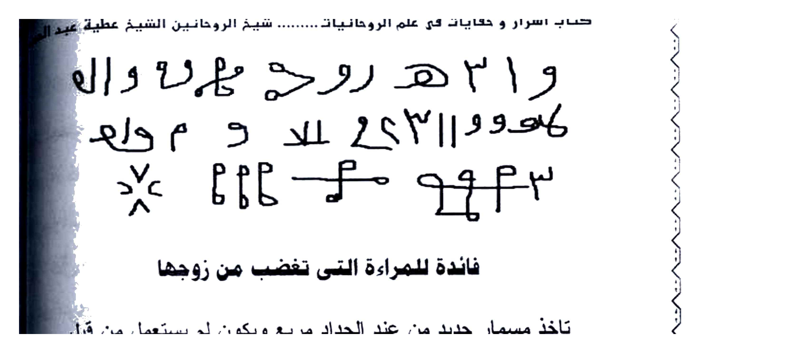
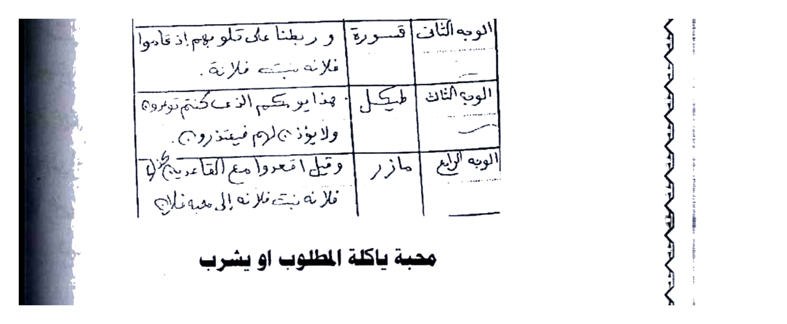
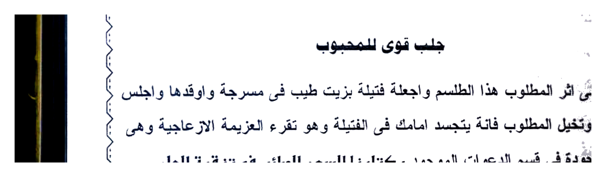
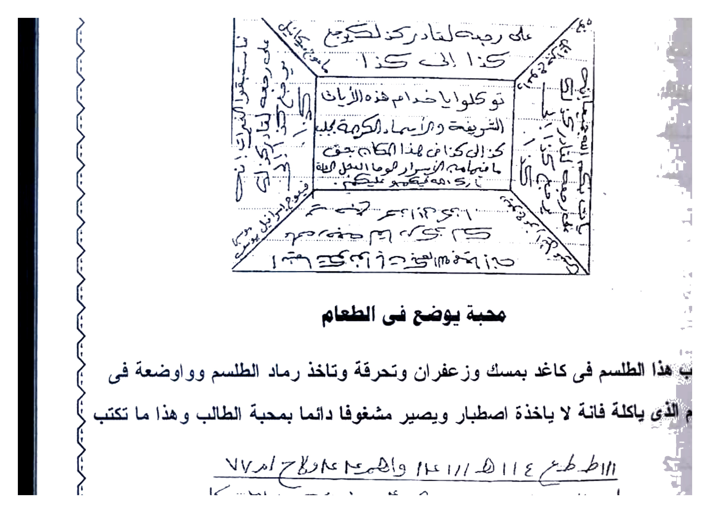
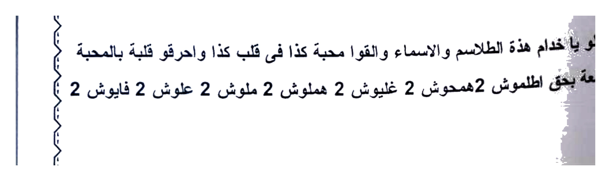

# BATCH 10 — Asrar wa Khofayyat fi ‘Ilmi ar-Ruhaniyyah — Halaman 047–051 (5 halaman)

> **Sumber:** `Picture 023.jpg` (Hal.47) + `Picture 024.jpg` (Hal.48–49) + `Picture 025.jpg` (Hal.50–51) • 2 tingkat Arab–Indonesia • **Rajah baru: 6 crop HQ** — Hal.48 atas & bawah, Hal.49 atas & bawah, Hal.51 wafaq murabba‘ & thilasm bawah

---

### Halaman 047 — Penyempurna Jلب Sari‘ 104× & Iḥrāq al-Laymūnah Mujarrab (kiri `Picture 023`)

#### [Teks Arab Asli — Hal.047]
```
بمحبة فلانة بنت فلانة حتى لا ينام ولا ياكل ولا يشرب حتى يكون معها بين يديها طائعا
ذليلا لجميع كلامها الوحا العجب الساعة 104 مرة وتقرأه الصورة فاعد العمل حتى تتحرك وتقوم الصوم الصورة وان ابطا العمل عليك والخدام
فازجرهم بهذه الاية الشريفة (ويل لكل الاية الشريفة فستسمع ايات الله تتلى عليه ثم يصر مستكبرا كأن في اذنيه وقرا فبشره بعذاب اليم ) اقسمت عليكم يا خدام هذه الايات الشريفة اجلبوا كذا وكذا الى محبة كذا وكذا الوحا العجل الساعة واصراف الزلزلة الى اشتاتا ثلاث مرات وتكرر اشتاتا في كل مرة ثلاث مرات.

احراق الليمونة مجرب وصحيح

اكتب هذه الأسماء في ورقة واجعل في قلبها حصوة لبان ذكر ثم تحضر الليمونة وتقورها
في رأسها وتعصر منها قليل من الماء ثم توضع داخلها الورقة المكتوبة واكتب مع
الأسماء الطالب والمطلوب ثم توضع الليمونة في طاسة وضع معها زيت طيب وتكتب
طلسم الطاسة بمسلة  وضعها على النار وأنت تعزم إلى أن تحرق الليمونة فمتى احترقت
احترق قلب المعمول له بالمحبة وهذا ما تكتب على الورقة ويا حبذا لو يكون على الأثر
وهو هذا = لا لم لا تلم نفسك فيما مضى وتنترك البعد وتأتي الى الصديق وإن لم تأتي إلى كذا
وكذا وميناك على جمرة بهارش 2 مع قارش 2 في حريق يلفقك في نار لها زفرة بشمشع
مع زعزعان زعزعان في سحيق توكلو يا خدام هذه الأسماء وهيجوا كذا إلى كذا
وكذا بحق اطمهفشذ وبحق جليش جليش إنه من سليمان وإنه بسم الله الرحمن الرحيم أن
لاتعلوا علي واتوني مسرعين طائعين وهيجوا واجلبوا كذا وكذا بحق هذه الأسماء عليكم
الوحا العجل العجل الساعة الساعة ونكتب هذا الطلسم في الطاسة
```

#### [Terjemahan Indonesia — Hal.047]
...sambungan **Jلب Sari‘ al-Ijabah 104× Hal.46**: *“…agar fulanah binti fulanah tidak bisa tidur, makan, minum sampai ia berada di hadapanmu di antara kedua tanganmu, patuh hina terhadap semua perkataanmu — Al-Waha al-‘Ajab as-Sa‘ah — 104× dan bacakan kepada gambar. **Ulangi amal sampai gambar itu bergerak dan berdiri tegak** — itulah tanda *shum al-shurah* (gambar berpuasa/tegak). Jika amal terasa lambat dan khodam memperlambat, **hardik (izjar) mereka dengan ayat syarifah:***

> *“Wailun likulli affakin atsim, yasma‘u ayati Allah tutla ‘alaihi tsumma yushirru mustakbiran ka-an lam yasma‘ha ka-anna fi udzunaihi waqran fa-bassyirhu bi-‘adzabin alim (QS. Al-Jatsiyah:7-8)”* — *Celakalah pendusta pendosa, ia dengar ayat Allah dibacakan lalu tetap menyombongkan diri seolah tak mendengar, seakan di telinganya ada sumbatan — beri kabar azab pedih.*

> *“Aqsamtu ‘alaikum ya khuddam hadzihi al-ayat asy-syarifah ijlibu kaza ila mahabbati kaza — Al-Waha Al-‘Ajal As-Sa‘ah, dan sharf (pengusiran) dengan Az-Zalzalah sampai **أَشْتَاتًا** diulang 3× dan kata **أَشْتَاتًا** diulang tiap kali 3×.”*

**Iḥrāq al-Laymūnah (Membakar Limun) — Mujarrab dan Shahih:**

Tulislah **nama-nama berikut pada kertas**, letakkan **di tengahnya sekerikil luban dzakar**, lalu **siapkan buah limun (lemon), lubangi bagian atasnya, peras sedikit airnya**, lalu **masukkan kertas bertulis ke dalamnya**. **Tulis bersama nama-nama itu nama si thalib dan si matlub**, lalu **letakkan limun itu di dalam bejana (thasah), tuangkan bersama minyak wangi**.

Tulislah **thilasm bejana dengan paku (misallah)**, letakkan di atas api sambil **kau beri azimah sampai limun itu terbakar**. **Ketika limun terbakar, terbakar pula hati orang yang dituju dengan cinta.** Dan inilah yang **kau tulis di kertas** — alangkah baiknya jika **di atas atsar (bekas target)** — yaitu:

> *“La lam la talum nafsaka fima madha wa tatrak al-bu‘da wa ta’ti ila as-shadiq wa in lam ta’ti ila kaza … wa kaza wa-mi-nak ‘ala jamratin bi-harasy 2 ma‘a qarasy 2 fi hariq yalfaquka fi narin laha zafrah bi-syamsya‘a ma‘a za‘za‘an za‘za‘an fi sahiq, tawakkalu ya khuddam hadzihi al-asma’ wa hayyiju kaza ila kaza — bi-haqqi Athmahfasyadz wa bi-haqqi Jalysy Jalysy, innahu min Sulaimana wa innahu Bismillahir Rahmanir Rahim alla ta‘lu ‘alayya wa’tuni musri‘in tha’i‘in …”*

> … *Al-Waha al-‘Ajal al-‘Ajal as-Sa‘ah as-Sa‘ah*, dan **tulislah thilasm ini di bejana (thasah) itu**.

> **Catatan:** *Iḥrāq laymūnah* = salah satu bab paling terkenal kitab ini — limun dibakar bertahap sambil azimah — simbol “hati terbakar”.

---

### Halaman 048 — Thilasm 7 Potong Gula & Faidah untuk Perempuan Pemarah + Jadwal 4 Wajah Surat Mulk (kanan `Picture 024`)

#### [Teks Arab Asli — Hal.048]
```
و 1 2 هـ روح مهـ وا ل
ماهو و ٢٣١١ و لا و م والو
         ٤٤٣م مول مـ ٢٢٤

فائدة للمراة التى تغضب من زوجها

تاخذ مسمار حديد من عند الحداد مربع ويكون لم يستعمل من قبل
وتكتب على كل وجة من اوجهته الاربعة ما ياتى وبعد الانتهاء من الكتابة يبخر بـ
والجاوى والكسبرة وتعزم علية بسورة الملك 11 مرة وبعد كل مرة توكل وصفة الـ
توكلو يا روحانية هذه السورة الشريفة بغفلة حتى لا تغضب ولا تترك البيت ابدا
المسمار مدقوق وبعد ان تدق المسمار عزم مرة اخرى بنفس السورة 7 مرات وهو
مجربة وصحيحة

[جدول 4 وجه]
الوجه الاول: كيلهم | حتى اذا مزقوا نتلا ورث فلانة بنت فلانة.
الوجه الثاني: قسورة | و ربضنا على قلوبهم اذ قاموا فلانة بنت فلانة.
الوجه الثالث: طيكل | هذا يركم الذى كفرتم توره و لايزد لزام فيتدر2.
الوجه الرابع: مازر | وتل ائمروا مع القاعدين فلانة بنت فلانة الى محبة فلانة

محبة ياكلها المطلوب او يشرب
```

#### [Terjemahan Indonesia — Hal.048]
**[Rajah — atas halaman 048]**



*Gambar Rajah Asli Halaman 048 Atas — Thilasm tangan `و 1 2 هـ روح مها وال / ماهو و 2311 و لا و م والو / 443 م مول م 224` — ditulis pada 7 potong gula / 7 buah / تفاح — lihat bawah.*

**Tulisan di halaman 048:**

> **“Tulislah thilasm ini pada 7 potong gula, atau 7 buah cokelat, atau 7 buah apel, atau yang lainnya — tidak ada thilasm yang bukan ghayah (tujuan) dalam mahabbah. Tulislah thilasm al-mushar ilaih dengan luban dzakar saja, dan azimahlah ‘alaihi bi-Barhatiyyah 7 atau 11 atau 21 kali, lalu bacakan ayat syarifah: *“wa zalalna…?”* (terpotong) — kemudian setiap orang memakannya akan — begitu **Yadzillu fulan ibn fulanah ila mahabbah wa ‘isyq wa tha‘ah Fulanah binti Fulanah** — dan waktu amal adalah **Sa‘at az-Zuhrah di awal bulan Arab — maka akan jadi sesuai yang kau kehendaki, dan inilah thilasmnya:**

**Rajah bawah — Thilasm silang (secara visual di tengah halaman, namun crop terpisah):**



**Faidah untuk Perempuan yang Marah kepada Suaminya:**

Ambillah **paku besi persegi dari pandai besi yang belum pernah dipakai**. Tulislah **pada setiap sisi dari empat sisinya** bacaan berikut. Setelah selesai tulisan, **ukup dengan jawi dan ketumbar**, dan **azimahlah kepadanya dengan Surat Al-Mulk 11×**, setiap selesai sekali tawkil dengan sifat:

> *“Tawakkalu ya ruhaniyyah hadzihi as-surah asy-syarifah bi-ghaflah hatta la taghdhab wa la tatruk al-bait abadan”* — Wahai ruhaniyyah surat mulia ini, buatlah ia lupa marah, tidak marah dan tidak meninggalkan rumah selamanya.

**Paku itu dipukul (ditancap), dan setelah memukul paku, beri azimah lagi dengan surat yang sama 7×**. **Mujarrabah dan shahihah.**

**[Tabel 4 Wajah Paku — Gambar Rajah Asli Halaman 048 Bawah]**

| Wajah | Yang ditulis |
|-------|--------------|
| **al-Wajh al-Awwal** | **كيلهم** *(kailhum)* `hingga` **حتى إذا مزقوا نتلا ورث فلانة بنت فلانة.** |
| **al-Wajh ats-Tsani** | **قسورة** *(qaswarah)* **وَرَبَطْنَا عَلَىٰ قُلُوبِهِمْ إِذْ قَامُوا** — **فلانة بنت فلانة.** |
| **al-Wajh ats-Tsalits** | **طيكل** *(thaykal)* **هذا يركم الذى كفرتم توره ولا يزد لزام فيتدر (2).** *(teks agak kabur di scan)* |
| **al-Wajh ar-Rabi‘** | **مازر** *(mazar)* **وَتَلْ ائْمُرُوا مَعَ الْقَاعِدِينَ** — **فلانة بنت فلانة إلى محبة فلانة** *(catatan: ayat “uq‘udu ma‘al qaghidin” QS At-Taubah:83)* |

> Ditulis di 4 sisi paku, setiap sisi satu baris seperti di atas.

**Mahabbah yang dimakan / diminum si matlub** *(judul kecil di bawah tabel, pembuka Hal.49)*


*Gambar Rajah Asli Halaman 048 Bawah — Jadwal 4 sisi paku: Al-Wajh1 Kilhum… Al-Wajh2 Qaswarah… Al-Wajh3 Thaykal… Al-Wajh4 Mazar… — Tulis di paku persegi baru, ukup Mulk 11×.*

---

### Halaman 049 — Jلب Qawiyy Lil-Mahbub  (Kuat) di Lampu & Jلب Yasin — Thilasm Silang (kiri `Picture 024`)

#### [Teks Arab Asli — Hal.049]
```
                  لةمقفيجل ٣٣٣ طلح ٤٠٣٣
                              طح ٤هه

                          [thilasm salib 4 lingkaran]

جلب قوى للمحبوب

يكتب على اثر المطلوب هذا الطلسم واجعلة فتيلة بزيت طيب فى مسرجة واوقدها واجلس
امامها وتخيل المطلوب فانة يتجسد امامك فى الفتيلة وهو تقرء العزيمة الازعاجية وهى
موجودة فى قسم الدعوات الموجود بكتابنا السهم الصائب فى تنقية العلوم
الروحانية من الشوائب وبخورك اللبان والعود ويكون عملك ليلة الخميس بعد المغرب
اول الشهر العربى وينفع ايضا لتفريقة بنفس الكيفية ولكن اخر الشهر العربى يوم السبت
وهذا الطلسم المشار الية

مهـوسـه مع     والتوكيل

جلب قوى بسورة يس

يكتب فى ورقة ويعلق فى الهواء وهذا ما تكتب يس الى قولة تسعى كذلك تسعى فلان
فلانة الى فلانة بنت فلانة فى مكان تواجدها واينما تكونو ياتى بكم الله جميعا ان ان
كل شياء قدير وكذلك ياتى فلان ابن فلانة الى هذا المكان ونفخ فى الصور فجمعناهم
كذلك يجتمع فلان ابن فلانة الى فلانة بنت فلانة فى هذا المكان قال عفريت من الجن
اتيك بة قبل ان تقوم من مقامك وانى علية لقوى امين قال الذى عنده علم من الكتاب
اتيك بية قبل ان يرتد اليك طرفك كذلك ياتى فلان ابن فلانة الى فلانة بنت فلانة
```

#### [Terjemahan Indonesia — Hal.049]
**[Rajah — Thilasm 4 simpul silang di atas judul Jلب Qawwiy]**


*Gambar Rajah Asli Halaman 049 Atas — Thilasm salib 4 lingkaran `○-+-○` + tulisan tangan `لمقفيجل ٣٣٣ طلح ٤٠٣٣ طح ٤هه` — untuk sumbu lampu malam Khamis.*

**Jلب Qawiyy (Sangat Kuat) untuk yang Dicinta:**

Tulislah **thilasm ini di atas atsar (bekas) si matlub**, jadikan **sumbu dengan minyak wangi di dalam lampu tembikar (misrajah)**, **nyalakan, dan duduklah di hadapannya sambil membayangkan si matlub** — maka **ia akan menjelma di hadapanmu di dalam nyala sumbu itu**, sementara **kau membaca ‘azimah iz‘ajiyyah (yang menggemparkan)** — yaitu **yang ada di bagian Da‘awat dalam kitab kami “As-Sahmush Sha’ib fi Tanqiyatil ‘Ulum ar-Ruhaniyyah minasy Syawa’ib”**.

**Bukhurmu: luban dan ‘ud (gaharu)**, kerjakan **malam Jum‘at (Khamis malam) setelah Maghrib pada awal bulan Arab**. **Juga bermanfaat untuk tafriqah (memisah) dengan cara yang sama namun di akhir bulan Arab pada hari Sabtu.**

> **“Dan inilah thilasm yang dimaksud — seperti di gambar atas.”**

**Rajah bawah — Tulisan “مهوسه مع … والتوكيل” (bawah Hal.49):**


*Gambar Rajah Asli Halaman 049 Bawah — `مهوسه مع` + sigil `∷` + `والتوكيل` — penempel nama pada sumbu.*

**Jلب Qawwiy dengan Surat Yasin:**

Tulislah **pada kertas dan gantungkan di udara**. Dan inilah yang kau tulis: **“Ya Sin sampai firman ‘yas‘a’ — begitu pula berusahalah fulanah binti fulanah … di tempat keberadaannya dan di mana pun kalian berada, Allah akan mendatangkan kalian semua — *Innallaha ‘ala kulli syai’in Qadir* — dan demikian datang fulan bin fulanah ke tempat ini — *wa nufikha fish-shur fa-jama‘nahum …* — demikian berkumpul fulan bin fulanah kepada fulanah binti fulanah di tempat ini — *qala ‘ifritu minal jinni atika bihi qabla an taquma min maqamik wa inni ‘alaihi la-qawiyyun amin, qala alladzi ‘indahu ‘ilmun minal kitabi atika bihi qabla an yartadda ilaika tharfuk* (QS An-Naml:39-40) — demikian datang…”** *(bersambung Hal.50)*

---

### Halaman 050 — Lanjutan Jلب Yasin — Doa Menyesakkan Langit & Bumi (kanan `Picture 025`)

#### [Teks Arab Asli — Hal.050]
```
دعوتى واستاذنو من عمار مكانى حتى يساعدونى فى قضاء حاجتى وتوكلو على فلان
ابن فلانة حتى لا يتهنا فى اكل ولا شرب ولا يتهنا فى عيش ولا نوم حتى ياتى اى فلانة
بنت فلانة الوحا العجل الساعة وهذا الوفق

[lanjut Hal.50 kanan atas — mulai Jلب Yasin bagian doa]
يكتب فى ورقة ويعلق فى الهواء وهذا ما تكتب يس الى قولة تسعى كذلك تسعى فلان
فلانة الى فلانة بنت فلانة فى مكان تواجدها واينما تكونو ياتى بكم الله جميعا ان ان
كل شياء قدير وكذلك ياتى فلان ابن فلانة الى هذا المكان ونفخ فى الصور فجمعناهم
كذلك يجتمع فلان ابن فلانة الى فلانة بنت فلانة فى هذا المكان قال عفريت من الجن
اتيك بة قبل ان تقوم من مقامك وانى علية لقوى امين قال الذى عنده علم من الكتاب
اتيك بية قبل ان يرتد اليك طرفك كذلك ياتى فلان ابن فلانة الى فلانة بنت فلانة الى فلانة بنت فلانة
الى فلانة بنت فلانة هذا المكان اللهم ان الامر امرك والحكم حكمك والسماء سماء
والارض ارضك ضيق اللهم السماء بما وسعت والارض بما رحبت والشرق شرقك والـ
غربك والقبلى قبلى والبحرى بحرى والسهل سهلك والجبال جبالك والبر بر
والبحار بحارك فضيق السماء والارض والشرق والغرب والقبلى والبحرى والسهل
والجبال والبر والبحر على قلب فلان ابن فلانة اضيق من بطن امة واضيق من خز
الغيرة وضيق الدنيا بما رحبت وخيرة فى نفسة واتنافسة وهيج اللهم روحانية حتى
الى فلانة بنت فلانة الى هذا المكان بحق او ظلمات فى بحر لجى يغشاه موج من
موج من فوقة سحاب ظلمات بعضها فوق بعض اذا اخرج يده لم يكد يراها حتى ياتى
كذا والى هذا المكان يامن رد يوسف على ابية يعقوب والعافية على جسد ايوب ورد
سليمان بعد زولة ورد موسى الى امة رد فلان ابن فلان الى فلانة بنت فلانة حيران
عى رجعة لقادر ووكلت علية خدام الايام السبعة العلوية والارضية وخدام الملوك الـ
المختصون بالجهات الاربعة وخدام الساعات النهارية والليلية وخدام الطبائع الاربعة
والحروف وجميع الملوك الموكلة العلوية والارضية توكلو يامن دعوتكم فى
```

#### [Terjemahan Indonesia — Hal.050]
...sambungan **Jلب Yasin Hal.49**: *“…sebelum matamu berkedip — demikian datang si fulan …”*

Kemudian bacalah:
> *“Da‘wati wa-sta’dzintu min ‘ammar makani hatta yusa‘iduni fi qadhai hajati wa tawakkalu ‘ala fulan ibni fulanah hatta la yathna’ fi aklin wa la syurbin wa la yathna’ fi ‘aisyin wa la naumin hatta ya’tiya fulanah binti fulanah — Al-Waha Al-‘Ajal As-Sa‘ah … dan inilah wafaqnya.”* — *(wafaq Square Hal.51 akan datang)*

**Isi tulisan Yasin di kertas yang digantung:**

> **“Ya Sin … hata qauluhu ‘yas‘a’ — demikian pula berupaya fulanah binti fulanah di tempatnya — *aina ma takunu ya’ti bikum Allahu jami‘an innallaha ‘ala kulli syai’in qadir* — demikian pula datang fulan bin fulanah ke tempat ini — *wa nufikha fish-shur fa-jama‘nahum jam‘an* — demikian berkumpul fulan bin fulanah kepada fulanah binti fulanah di tempat ini — *qala ‘ifritu minal jinni … wa inni ‘alaihi la-qawiyyun amin – qala alladzi ‘indahu ‘ilmun minal kitab …* — demikian datang… — *Ya Allah sesungguhnya urusan itu urusan-Mu, hukum itu hukum-Mu, langit itu langit-Mu, bumi itu bumi-Mu — maka sesakkanlah wahai Allah langit dengan keluasaannya dan bumi dengan kelapangannya, Timur itu timur-Mu, Barat itu barat-Mu, Selatan itu selatan-Mu, Utara itu utara-Mu, dataran itu dataran-Mu, gunung itu gunung-Mu, daratan itu daratan-Mu, lautan itu lautan-Mu — sesakkan langit, bumi, Timur, Barat, Utara, Selatan, dataran, gunung, darat, laut atas hati fulan bin fulanah — lebih sempit dari perut ibunya, lebih sempit dari lubang jarum, sesakkan dunia … dan kebingungan dalam dirinya, bisikan nafasnya, gelisahkan Ya Allah ruhaniyyahnya sampai ke fulanah binti fulanah ke tempat ini dengan hak **‘aw zhulumatin fi bahrin lujjiyyin yaghsyahu maujun min fauqi mauj … idza akhraja yadahu lam yakad yaraha (QS. An-Nur:40)’** sampai datang … Wahai Yang mengembalikan Yusuf kepada Ya‘qub, kesehatan kepada Ayub, kerajaan Sulaiman setelah lenyap, Musa kepada ibunya — kembalikan fulan bin fulan kepada fulanah binti fulanah dalam keadaan kebingungan — atas kemampuan Yang Maha Kuasa — dan aku wakilkan kepadanya khodam 7 hari ‘ulwiyyah & ardhiyyah, khodam raja-raja yang khusus 4 penjuru, khodam jam siang-malam, khodam 4 tabiat, huruf, dan semua raja yang ditugaskan — tawakkalu wahai yang kuseru …”**

> **Catatan:** Doa “tadhyiq” (menyesakkan alam) adalah ciri kitab ini — memohon agar alam semesta “sempit” bagi target sehingga hanya menemukan ketenangan di sisi thalib. QS. An-Nur:40 & kisah Yusuf-Ayub-Musa dijadikan tawassul.

---

### Halaman 051 — Wafaq Murabba‘ Yasin + Mahabbah di Makanan (kiri `Picture 025`)

#### [Teks Arab Asli — Hal.051]
```
دعوتى واستاذنو من عمار مكانى حتى يساعدونى فى قضاء حاجتى وتوكلو على فلان
ابن فلانة حتى لا يتهنا فى اكل ولا شرب ولا يتهنا فى عيش ولا نوم حتى ياتى اى فلانة
بنت فلانة الوحا العجل الساعة وهذا الوفق

[Wafaq Murabba‘ besar di tengah halaman — persegi 4, tulisan tepi keliling + isi 4 baris]

محبة يوضع فى الطعام

يكتب هذا الطلسم فى كاغد فى كاغد بمسك وزعفران وتحرقة وتاخذ رماد الطلسم واوضعة فى
الطعام الذى ياكلة فانة لا ياخذة اصطبار ويصير مشغوفا دائما بمحبة الطالب وهذا ما تكتب

ا١١ ط طع ٤ ١١١ هـ / ١١ هـ واهمء ١٢ ع اح امراح // ٧٧ امراح ١٢ ع اح
ط ١١٥ ١١ ٢٢ ١١ ٨ ع ١١ ١١ ن خجج ٤٨٨ ن خجج // ٣١١١١٣٣ انسكا
                          ٩ ١١ ١١١ ل ١٨

توكلو يا خدام هذة الطلاسم والاسماء والقوا محبة كذا فى قلب كذا واحرقو قلبة بالمحبة
القاطعة بحق اطلموش 2همحوش 2غلبوش 2هملوش 2ملوش 2علوش 2فلوش 2
```

#### [Terjemahan Indonesia — Hal.051]
… *“…tawakkalu ‘ala fulan ibni fulanah hatta la yahna’a … hatta ya’tiya fulanah binti fulanah — Al-Waha Al-‘Ajal As-Sa‘ah — dan inilah wafaqnya:”*

**[Gambar Rajah Asli Halaman 051 Atas — Wafaq Murabba‘ Yasin]**

*Gambar Rajah Asli Halaman 051 Atas — Wafaq persegi 4 (murabba‘) dengan tulisan pinggir melingkar `ولكل وجهة هو موليها...` & isi 4 baris + 4 segitiga sudut — untuk Yasin digantung di udara (Hal.49–50). HANYA kotak wafaq 915 KB 4× putih bersih.*

**Mahabbah yang Diletakkan di Makanan (يُوضع فى الطعام):**

Tulislah **thilasm ini di kertas dengan misik (kasturi) dan za‘faran, lalu bakar — ambillah abu thilasm itu dan letakkan di makanan yang akan dimakannya**. Maka **ia tidak akan bisa bersabar (menahannya), dan akan menjadi sangat tergila-gila selamanya dengan cinta kepada si thalib (pemohon)**. Dan inilah yang kau tulis:

```
ا ١١ ط طع ٤ ١١١ هـ / ١١ هـ واهمء ١٢ ع اح امراح // ٧٧ امراح ١٢ ع اح
ط ١١٥ ١١ ٢٢ ١١ ٨ ع ١١ ١١ ن خجج ٤٨٨ ن خجج // ٣١١١١٣٣ انسكا
٩ ١١ ١١١ ل ١٨
```

*(Dua baris thilasm huruf-angka + baris bawah `9 11 111 ل 18` — lihat Rajah bawah untuk penulisan persis termasuk garis bawah)*


*Gambar Rajah Asli Halaman 051 Bawah — Thilasm 2 baris untuk abu makanan: `ا11 ط طع...` / `ط115...` — bakar jadi abu campur makanan.*

**Tawkil (taukil) setelah thilasm:**
> *“Tawakkalu ya khuddam hadzihi ath-thalasil wal-asma’ wa alqau mahabbata kaza fi qalbi kaza wa ahriqu qalbahu bil-mahabbah al-qathi‘ah bi-haqqi Athlamusy 2 Hamhush 2 Ghalbush 2 Hamlush 2 Malush 2 ‘Alush 2 Falush 2.”*
>
> Wahai pelayan thilasm & nama ini, lemparkan cinta si anu ke hati si anu dan bakar hatinya dengan cinta yang memutuskan — demi Athlamush… Falush 2× masing-masing.

---

## Ringkasan Batch 10 & Rajah

| Hal | Judul | Rajah |
|-----|-------|-------|
| 047 | Iḥrāq Laymūnah bakar limun + thilasm bejana | — |
| 048 | Thilasm 7 gula + Faidah paku 4 sisi Mulk 11× | **2 Rajah**: Atas `و12هـ...` 415K + Bawah jadwal 4 wajah 411K |
| 049 | Jلب Qawiyy sumbu misrajah Khamis awal bulan + Yasin gantung | **2 Rajah**: Atas salib `لمقفيجل...` 266K + Bawah `مهوسه` 64K |
| 050 | Lanjutan Yasin doa tadhyiq langit-bumi | — |
| 051 | Wafaq Yasin murabba‘ + thilasm abu makanan | **2 Rajah**: Wafaq 915K + Thilasm abu 221K |

**Total Rajah baru Batch 10: 6** — Total akumulasi **14 + 6 = 20 Rajah HQ** (Hal.05,07,12,13,14,16,19,23,24×2,26,27,28,41,48×2,49×2,51×2)

---

*Next Batch 11 Hal.052–056 (Picture 026 Hal.52–53 + 027 Hal.54–55 + 028 Hal.56) AUTO.*
