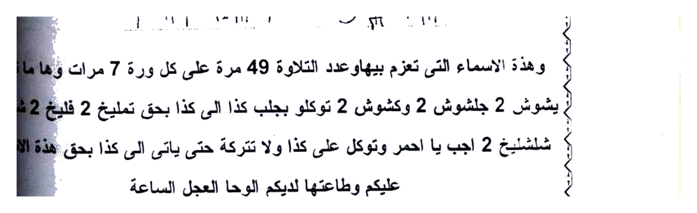
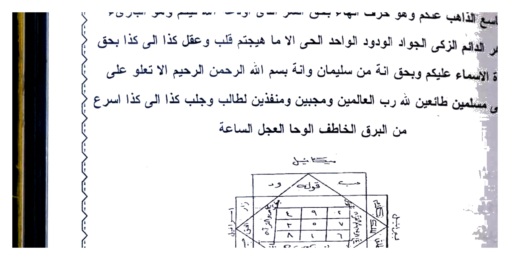
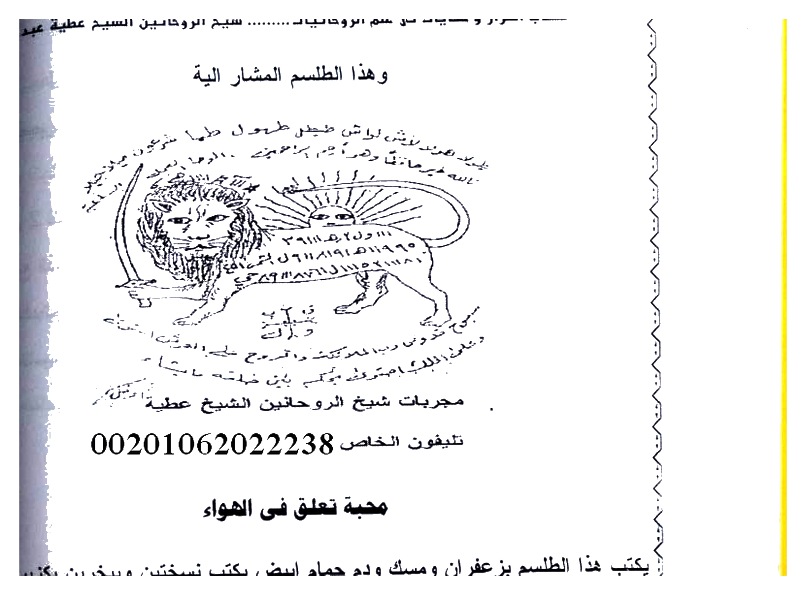
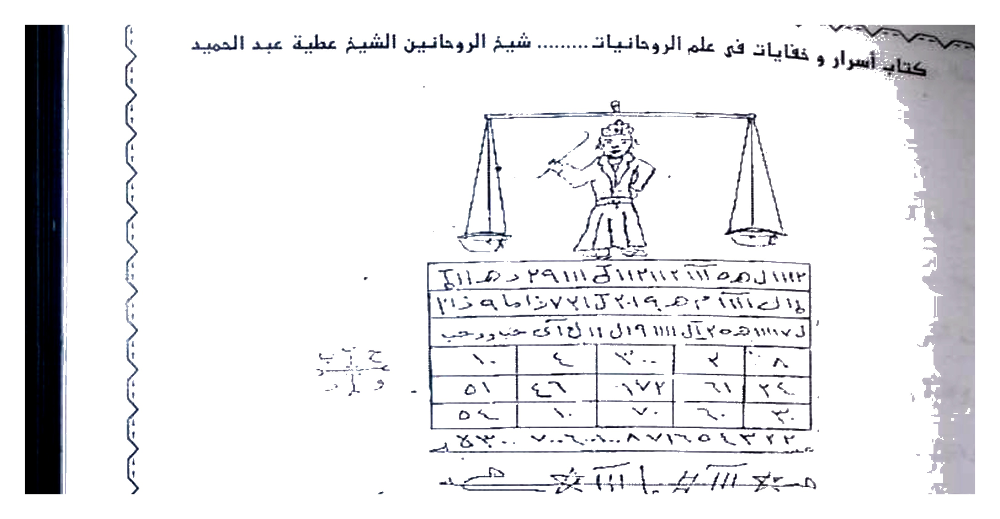
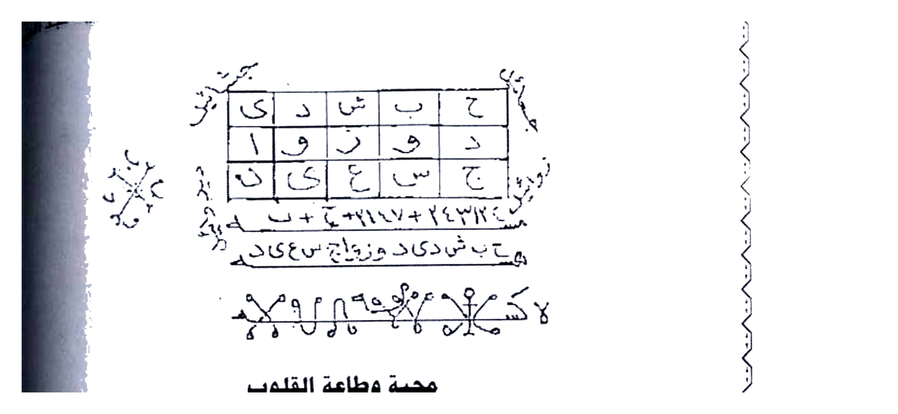
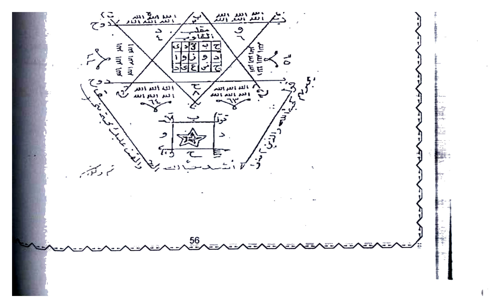

# BATCH 11 — Asrar wa Khofayyat fi ‘Ilmi ar-Ruhaniyyah — Halaman 052–056 (5 halaman)

> **Sumber:** `Picture 026.jpg` (Hal.52–53) + `Picture 027.jpg` (Hal.54–55) + `Picture 028.jpg` (Hal.56) • 2 tingkat • **Rajah baru: 6 crop HQ 4×** — Hal.52 thilasm, Hal.53 diamond, Hal.54 lion, Hal.55 mizan, Hal.56 top-grid + star-wafaq

---

### Halaman 052 — Thilasm Ahmar & Azimah 49× untuk Jلب/Mahabbah (kanan `Picture 026`)

#### [Teks Arab Asli — Hal.052]
```
هاموش 2 باروش 2 عالوش 2 بابوش 2 قالوش 2 قروش 2 اجيبو والقوا كذا
محبة كذا بالمحبة والهيام توكلو والا تكونو كالذين قالو سمعنا وهم لا يسمعون
الوحا العجل الساعة والعمل في ساعة سعيدة هوانية

طلسم الاحمر يعمل به الطالب كل شياء

يكتب على قماش حمراء ويسرج او على 7 ورقات واطلق البخور وهو كندر وقلفل
عليهم الاسماء حتى تنقطع الدخان واحدة بعد واحدة والعمل في اى وقت من الساعات
الخاصة بالمحبة والتهييج ومقابلة الملوك والسلاطين وقضاء الحوائج وهذا الطلسم
اليها

  [thilasm 2 baris + garis bawah]
  — و —      وـا لح
  ٤١١S ٨٩٩١٢٦٩١٥ ٢٩١٥

وهذة الاسماء التى تعزم بيهاو عدد التلاوة 49 مرة على كل ورة 7 مرات وهما ما تقر
يشبوش 2 جلشبوش 2 وكشبوش 2 توكلو بجلب كذا الى كذا بحق تعليخ 2 فليخ 2 شليخ
شلشليخ 2 اجب يا احمر وتوكل على كذا ولا تترك حتى ياتى كذا بحق هذة الاسماء
عليكم وطاعتها لديكم الوحا العجل الساعة

دعوة حرف الهاء للجلب
```

#### [Terjemahan Indonesia — Hal.052]
**Sambungan azimah sebelumnya (Hal.51):** *“…Hamush Barush ‘Alush Babush Qalush Qurush 2× — ijibu wa alqau mahabbata kaza bil-mahabbah wal-huyam, tawakkalu wa illa takunu ka-alladzina qalu sami‘na wa hum la yasma‘un — Al-Waha Al-‘Ajal As-Sa‘ah — amal di jam bahagia hawa’iyyah.”*

**Thilasm al-Ahmar (Thilasm Merah) — yang dipakai thalib untuk segala hajat:**

Tulislah **di atas kain merah dan diberi lampu (siraj), atau pada 7 lembar kertas**. **Lepaskan bukhur: kundur (kemenyan) dan qulqul (lada?)** — bacakan **nama-nama di atasnya sampai asap terputus, satu per satu**. Amal dapat dikerjakan **di waktu jam-jam khusus mahabbah, tahyij, menghadap raja/sultan, dan menunaikan hajat**.

Dan inilah thilasmnya:


*Gambar Rajah Asli Halaman 052 — Thilasm 2 baris `و — / وـا لح` + `411S 899126915…` + garis bawah angka — untuk kain merah / 7 kertas. HANYA thilasm 341K 4× putih.*

**Azimah untuk thilasm ini — dibaca 49× tiap lembar (7× tiap lembar):**
> *“Yasybush 2, Jalshabush 2, wa Kasybush 2, tawakkalu bi-jalbi kaza ila kaza bi-haqqi Ta‘likh 2, Falaikh 2, Syalaikh 2, Syalsyalaikh 2, ajib ya Ahmar wa tawakkal ‘ala kaza wa la tatruk hatta ya’tiya kaza bi-haqqi hadzihi al-asma’ ‘alaikum wa tha‘atiha ladaykum — Al-Waha Al-‘Ajal As-Sa‘ah.”*

**Merah adalah khadim huruf `هـ` (Ha’)?** — berikut **Da‘watu Harf al-Ha’ li al-Jalb** (seruan huruf Ha untuk menarik) — sambung Hal.53.

---

### Halaman 053 — Da‘wah Harf Ha 21×/45× + Khatam Diamond + Mahabbah Muluk (kiri `Picture 026`)

#### [Teks Arab Asli — Hal.053]
```
يكتب ويحمل هو ان تكتب الخاتم وحولة العزيمة دائرة ويتلى علية العزيمة 21 مرة وان
كان 45 مرة كان اجود ويعطى للطالب يحمله على زراعة اليمنى واحدة تعلق فى
الهواء اتجاء شرق وهذة العزيمة المشار اليها بطريابل اليها 2بطريابل 2طفيابل 2هبيابل 2زريابل 2
جريابل 2 فنيابل 2 ابل 2 جريابل 2 فنيابل 2 ابل 2 اجيبو ايتها الحروف الثمانية واتونى بما اكل اخيكم
التاسع الذاهب عنكم وهو حرف الهاء بحق السر الذى اودعة الله فيكم وهو البارى
الطاهر الدائم الزكى الجواد الودود الواحد الحى الا ما هيجتم قلب وعقل كذا الى كذا بحق
هذة الاسماء عليكم وبحق انة من سليمان واتة بسم الله الرحمن الرحيم الا تعلو على
واتونى مسلمين طائعين لله رب العالمين مجيبين ومنفذين لطال ب وجلب كذا الى كذا اسرع
من البرق الخاطف الوحا العجل الساعة

 [khatam diamond persegi + berlian tengah + tulisan pinggir]

محبة خاصة بالملوك والحكام والاكابر وهيبة

يكتب هذا الطلسم على كاغد احمر او كاغد مصبوغ بزعفران وزنجبيل وكركم وماء ورد
فى شرف الشمس وطالع الاسد من البروج ويبخر بجاوى وليان وتفاح الجان والعزيمة
سورة النمل المباركة 3 مرات ثم تنجمة ثم توكل بما تريد ثم تنجمة 3 ليالى وتشمعة ويحمل على
طهارة
```

#### [Terjemahan Indonesia — Hal.053]
**Da‘wah Harf al-Ha’ (Huruf Ha’):**

Cara **menulis dan membawa**: **Tulislah khatam (segel) dan di sekelilingnya azimahnya melingkar**. **Bacakan azimah 21×, bila 45× lebih baik**. **Berikan kepada thalib untuk dibawa di lengan kanan, dan satu lagi digantung di udara menghadap timur.**

Inilah azimahnya yang dimaksud: *“Bathrayabil ilaiha 2, Bathrayabil 2, Thufayabil 2, Habiyabil 2, Zuriyabil 2, Jirayabil 2, Funiyabil 2, Ubbul 2, Jirayabil 2, Funiyabil 2, Ubbul 2 — ajibu ayyatuha al-huruf ats-tsamaniyah wa’tuni bi-ma akala akhikum at-tasi‘ adz-dzahib ‘ankum wa huwa harful Ha’ bi-haqqi as-sirr alladzi awda‘ahu Allahu fikum wa huwa al-Bari ath-Thahir ad-Da’im az-Zaki al-Jawad al-Wadud al-Wahid al-Hayy illa ma hayyajtum qalba wa ‘aqla kaza ila kaza bi-haqqi hadzihi al-asma’ ‘alaikum wa bi-haqqi innahu min Sulaimana wa innahu Bismillahir Rahmanir Rahim alla ta‘lu ‘alaiya wa’tuni muslimina tha’i‘ina lillahi Rabbil ‘Alamin mujibina munafidzina li-thalabi wa jalbi kaza ila kaza asra‘u min al-barqi al-khathif — Al-Waha Al-‘Ajal As-Sa‘ah.”*

> *Wahai 8 huruf, bawakan milik saudara kesembilan yang hilang yaitu huruf Ha’ — demi rahasia yang Allah titipkan — wahai Yang Maha Pencipta Suci Kekal… gelisahkan hati dan akal si anu… dengan hak “Innahu min Sulaiman…” — lebih cepat dari kilat.*

**[Rajah — Khatam Diamond Hal.53]**

*Gambar Rajah Asli Halaman 053 — Khatam persegi diamond (wajik) berangka 9-2-… di tengah + tulisan pinggir melingkar — untuk harf Ha gantung timur. HANYA khatam 581K 4× putih.*

**Mahabbah Khusus untuk Raja, Hakim, Pembesar + Kewibawaan:**

Tulislah **thilasm ini di kertas merah atau kertas yang dicelup za‘faran, jahe (zanjabil), kunyit (kurkum), dan air mawar**, pada saat **kemuliaan matahari (syaraf asy-syams) dan naiknya bintang Leo (thali‘ al-Asad) dari rasi bintang**. **Ukup dengan jawi, luban (kemenyan), dan tufah al-jann (apel jin?)**. **Azimahnya adalah Surat An-Naml yang berkah 3×**, lalu **jemurkan di bawah bintang (tanajjum)**, lalu **tawakkalkan hajatmu, lalu jemur lagi 3 malam, beri lilin, dan bawa dalam keadaan suci.**

---

### Halaman 054 — Lion-Sun Thilasm & Hanging Mahabbah di Udara (kanan `Picture 027`)

#### [Teks Arab Asli — Hal.054]
```
وهذا الطلسم المشار الية

  [LION pedang - matahari muka - ekor melingkar - tulisan di badan & keliling]

مجربات شيخ الروحانين الشيخ عطية
تليفون الخاص 00201062022238

محبة تعلق فى الهواء

يكتب هذا الطلسم بزعفران ومسك ودم حمام ابيض يكتب نسختين ويبخرين بكزبرة
ويعزم عليهم بسورة القارعة المباركة 11 مرة مع التوكيل كل مرة وصرف العمار
قبل الشروع فى العمل
وتحرق واحدة والاخرى تعلق فى الهواء بخيط حرير احمر ويكون العمل ساعة
هوانية وهذا الطلسم المشار الية
هوائية
```

#### [Terjemahan Indonesia — Hal.054]
**Dan inilah thilasm yang dimaksud (yang tadi, untuk muluk):**

*Gambar Rajah Asli Halaman 054 — Singa jantan membawa pedang, di atasnya matahari berwajah, ekor melingkar, tulisan di badan singa `شجرة طيبة...` + tulisan melingkar di sekeliling — untuk sharf Syams di Leo. HANYA singa+matahari 809K 4× putih.*

**“Mujarrabat Syaikh ar-Ruhaniyyin Syaikh Athiyah — telepon pribadi 00201062022238”**

**Mahabbah yang Digantung di Udara (hawa’iyyah):**

Tulislah **thilasm ini dengan za‘faran, misk, dan darah merpati putih**. **Tulis dua salinan, keduanya diukup dengan ketumbar**. **Azimahlah keduanya dengan Surat Al-Qari‘ah yang berkah 11×, setiap kali dengan tawkil**, dan **lakukan sharf al-‘ammar sebelum memulai amal**.

**Bakar satu salinan, dan yang satunya lagi gantung di udara dengan benang sutra merah**. **Waktu amal adalah jam hawa’iyyah (angin)**. Dan inilah thilasm yang dimaksud — **masih berlanjut ke Hal.55? (thilasm hawa’iyyah akan digambar di halaman berikutnya — lihat Hal.55 mizan).**

---

### Halaman 055 — Mahabbah wa Tha‘ah — Yusuf 3× + Jelda Ular + Bintang (kiri `Picture 027`)

#### [Teks Arab Asli — Hal.055]
```
 [mizan - scales - figure sword - table bawah]
اكتب هذا الطلسم على ورقة بزعفران وماء ورد ويبخر بكزبرة وجاوى وتقر علية سورة
يوسف 3 مرات ويوضع فى جلد ثعبان اسود ويلف بخيط احمر وينجم تحت القمر 3 ليالى
ويكون القمر ليلة 12 فى الشهر ويظل التنجيم حتى يوم 15 فى الشهر ويكون التنجيم فى
اناء نحاس اصفر وتوقد شمعة خضراء اللون كل ليلة من التنجيم وكل ليلة فى التنجيم
تقر سورة يوسف مرة وتوكل بالمحبة فلان ابن فلانة الى فلان ابن فلانة بحق فاتة الحب
الخير لشديد وما ذلك على الله بعزيز توكلو بحق هذة السورة المباركة وهذا الطلسم وما
فية من الاسرار بجلب ومحبة وطاعة فلان ابن فلانة على فلان ابن فلانة الوحا العجل
الساعة بارك الله فيكم وها الطلسم المشار اليه
```

#### [Terjemahan Indonesia — Hal.055]
**[Rajah — Mizan & Tabel Hal.55]**

*Gambar Rajah Asli Halaman 055 Atas — Timbangan (mizan) dengan sosok pembawa pedang + tabel 3×3 angka/huruf di bawah + tulisan pinggir — untuk Yusuf di kulit ular. HANYA mizan+tabel 553K 4× putih.*

**Mahabbah wa Tha‘ah (Cinta & Ketaatan):**

Tulislah **thilasm ini di kertas dengan za‘faran dan air mawar, ukup dengan ketumbar dan jawi, bacakan kepadanya Surat Yusuf 3×**, lalu **letakkan di dalam kulit ular hitam, lilit dengan benang merah, dan jemurkan di bawah sinar bulan selama 3 malam**.

**Bulan harus malam ke-12 bulan (Hijriyah), dan penjemuran berlanjut sampai hari ke-15 bulan. Penjemuran di dalam bejana kuningan kuning. Nyalakan lilin hijau setiap malam penjemuran. Setiap malam penjemuran, bacalah Surat Yusuf 1× dan tawkilkan:**

> *“...bi-mahabbati fulan ibni fulanah ila fulan ibni fulanah bi-haqqi fa-innahu li-hubbil khairi la-syadid wa ma dzalika ‘ala Allahu bi-‘aziz, tawakkalu bi-haqqi hadzihi as-surah al-mubarakah wa hadza ath-thilasm wa ma fihi min al-asrar bi-jalbi wa mahabbati wa tha‘ati fulan ibni fulanah ‘ala fulan ibni fulanah — Al-Waha Al-‘Ajal As-Sa‘ah — baraka Allahu fikum — dan inilah thilasm yang dimaksud.”*

---

### Halaman 056 — Mahabbah Qalb + Star Wafaq (kanan `Picture 028`)

#### [Teks Arab Asli — Hal.056]
```
ح ب ش ى د ى
د و ر ى ا
ح ع س ى ن
 +  +  ... 
هـيـب ش دى و زخج ع س ك دى
لا كس ... ×××

محبة وطاعة القلوب

يكتب هذا الطلسم ويحرز بجلد غزال بالحبر الروحانى الاصفر على كاغد اخضر
بالبان التننية والميعة السائلة وجوز عجم وتقرء علية سورة الرحمن سبع مرات تقر
بعد كل مرة توكلو يا روحانية هذة السورة المباركة وهذا الطلسم الشريف بجلب
ومحبة قلوب اولاد ادم وبنات حواء الى محبة وطاعة حامل هذا الحرز بعزة الله
الودود القدير وهذا الطلسم المشار اليه

 [star 6 sudut + segitiga + wafaq kotak tengah 3×3 + sigil keliling]
```

#### [Terjemahan Indonesia — Hal.056]
**[Rajah — Grid Huruf Hal.56 Atas]**

*Gambar Rajah Asli Halaman 056 Atas — Tabel 3 baris huruf `ح ب ش ى د ى / د و ر ى ا / ح ع س ى ن` + baris angka + sigil `×××` + tulisan `هيب شدى و...` — untuk di jilid ghazal. HANYA grid 406K 4× putih.*

**Mahabbah wa Tha‘ah al-Qulub (Cinta & Kepatuhan Hati):**

Tulislah **thilasm ini dan jadikan jimat dengan kulit kijang (jald ghazal) dengan tinta ruhaniyyah kuning di atas kertas hijau**, dengan **luban, gum ammoniac (?), mi‘ah cair, dan walnut ‘ajam**.

Bacakan **kepadanya Surat Ar-Rahman 7×**, **setiap selesai sekali, ucapkan:**
> *“Tawakkalu ya ruhaniyyah hadzihi as-surah al-mubarakah wa hadza ath-thilasm asy-syarif bi-jalbi wa mahabbati qulubi awlad Adam wa banat Hawwa ila mahabbati wa tha‘ati hamil hadza al-hirz bi-‘izzati Allah al-Wadud al-Qadir — dan inilah thilasm yang dimaksud.”*

**[Rajah — Star Wafaq Hal.56 Bawah]**

*Gambar Rajah Asli Halaman 056 Bawah — Bintang 6/segitiga terbalik + wafaq 3×3 di tengah `9 3 2 / 7 5 1 / 8 6 4` + tulisan pinggir sigil — untuk Ar-Rahman 7×. HANYA bintang+wafaq 615K 4× putih.*

> **Catatan:** Wafaq `9-2-7` dll. adalah pola Mutsallats klasik untuk qulub — pigment kuning (huruf Safar) menandai kehangatan hati.

---

## Ringkasan Batch 11 & Rajah

| Hal | Judul | Rajah |
|-----|-------|-------|
| 052 | Thilasm Ahmar 7 kertas + 49× | **1** Thilasm 341K |
| 053 | Harf Ha diamond 21/45× + Muluk Syaraf Syams/Asad | **1** Diamond 581K |
| 054 | Lion-Sun thilasm + Mahabbah Hawa’iyyah | **1** Lion 809K |
| 055 | Mizan Yusuf 3 malam + kulit ular | **1** Mizan 553K |
| 056 | Grid huruf + Star Wafaq Ar-Rahman 7× | **2** Top-grid 406K + Star 615K |
| **Total baru Batch11** | **6 Rajah** | **3.3 MB baru** |

**Total akumulasi: 20 + 6 = 26 Rajah HQ** (Hal.05,07,12,13,14,16,19,23,24×2,26,27,28,41,48×2,49×2,51×2,52,53,54,55,56×2)

---

*Next Batch 12 Hal.057–061 (Picture 028 kiri Hal.57 couple+snake + 029 Hal.58–59 + 030 Hal.60–61) AUTO.*
