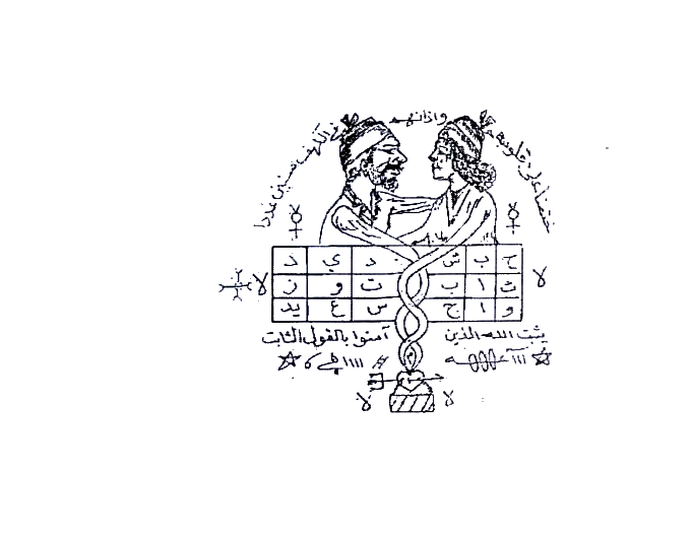
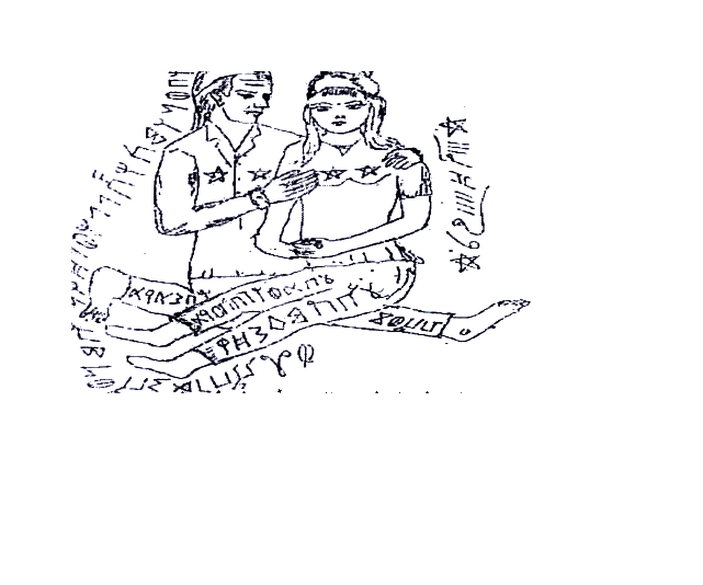
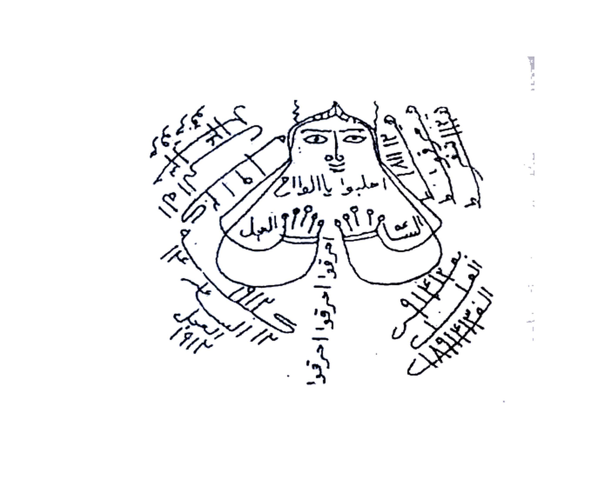
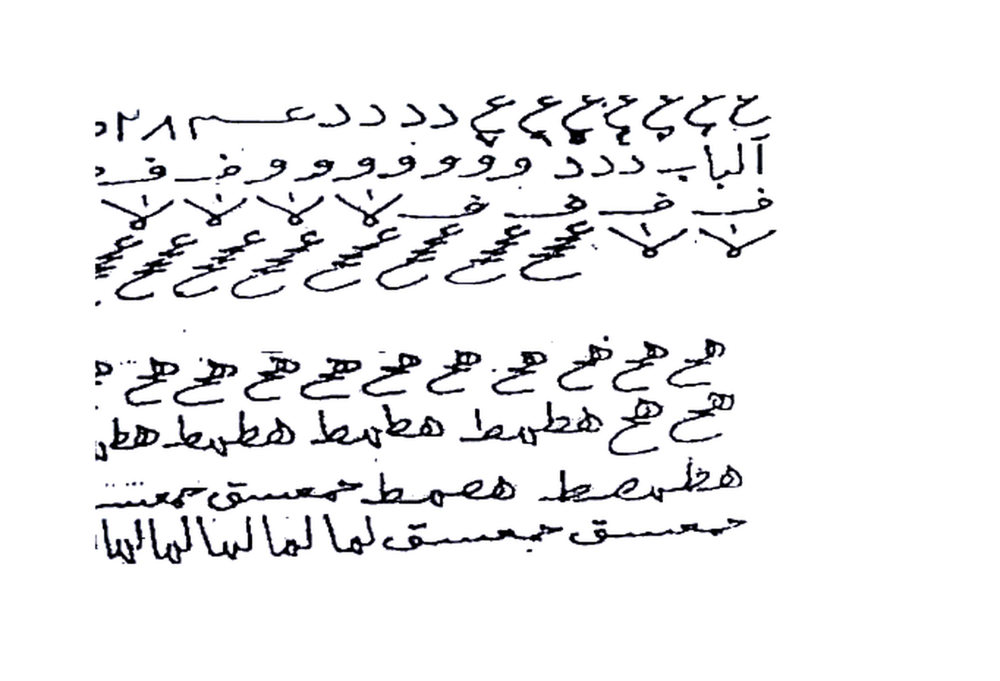
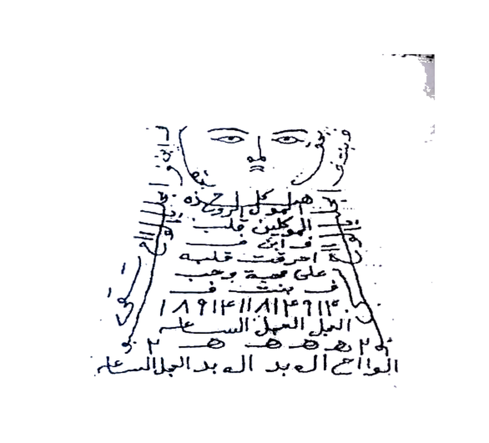

# BATCH 12 — Halaman 057–061 (Picture 028 kiri + 029 + 030)

> **Sumber:** `Picture 028.jpg` (Hal.57) + `Picture 029.jpg` (Hal.58–59) + `Picture 030.jpg` (Hal.60–61) • 2 tingkat Arab–Indonesia • **Rajah baru: 5 crop HQ** — Hal.57 pasangan+wa faq, Hal.58 pasangan duduk, Hal.59 dada perempuan, Hal.60 script shabaz, Hal.61 wajah+gumpalan
---

### Halaman 057 — Mahabbah baina az-Zaujain + lil-Mahabbah al-Qati‘ah wal-Jalb (kiri `Picture 028`)

**[Teks Arab Asli]**

محبة بين الزوجين
تكتب هذا الطلسم على 3 اوراق بمسك وزعفران وصغار البيض ودم الاخوين وتبخرهن بميعة سائلة وسندروس وتحرق يوميا وقت الغروب واحدة لمدة 3 ايام وطبعا لا تكتب الايات التي مع الطلسم في هذه الاوراق والورقة الرابعة تكتب فيها الايات والطلسم ونفس الشروط الـ 3 ينجرقن بالنستلينبور والمواد الكتابة ولكن هذه الورقة تدفن تحت فراش الزوجين والعزيمة واحدة على الاربعة ورقات وهي سورة الكهف مرتين مع التوكيل بعد كل مرة فاعلم انهم لا يفترقون مادام هذا الحجاب تحتهم طول عمرهم وهذا الطلسم المشار اليه

[Gambar pasangan memeluk + jadwal 3×6 + ular melilit hati/hati tertusuk panah + simbol `لا` di 4 penjuru]

للمحبة القاطعة والجلب
يرسم هذا الطلسم ويحرق بعد كتابته بزعفران وحليب غنم وعسل ويبخر بعود هندي وتقرء البسملة الشريفة عددها بالجمل الكبير وتتوكل يا خدام هذا الطلسم اجلبوا وهيجوا

**[Terjemahan Indonesia]**

**Mahabbah antara dua pasangan (suami-istri) agar tidak bercerai:**

Tulislah **thilasm (rajah)** ini **pada 3 lembar kertas** dengan **misk (kasturi), za‘faran (saffron), putih telur kecil (sighar al-baidh) dan dam al-akhawain (getah “darah dua saudara” — resin merah)**. Lalu **kemenyanilah (bakhur) ketiganya dengan may‘ah sa’ilah (getah storax cair) dan sandarus (damar sandarac)**. **Bakar satu lembar setiap hari pada waktu ghurub (terbenam matahari) selama 3 hari**. Tentu saja **jangan tulis ayat-ayat yang ada bersama thilasm pada ketiga kertas ini**. **Lembar keempat** tulislah **ayat-ayat dan thilasm-nya** dengan **syarat yang sama (3 lembar sebelumnya): di-asah dengan nastalainbur? (maksud: tinta disucikan / alat tulis khusus) dan bahan tulisan yang sama**, namun **lembar ini tidak dibakar — melainkan dikubur (ditanam) di bawah ranjang (firasy) kedua pasangan**.

**Azimahnya satu untuk keempat lembar kertas:** yaitu **Surah al-Kahfi dibaca 2 kali** dengan **taukil (perintah kepada khadam) setelah setiap kali baca**. Ketahuilah **mereka berdua tidak akan berpisah selama hijab (azimat) ini berada di bawah mereka sepanjang umur mereka**. Inilah **thilasm yang dimaksud:**

*Gambar Rajah Asli Halaman 057 — Pasangan berpelukan di atas jadwal `ح ش ب ح / د ي د` dst. `ث ب ت و ز س ع يد` + ular kembar melilit jatuh ke hati tertusuk panah di atas alas bergaris, dikelilingi tulisan melingkar `واذانهم...` dan simbol `لا` di 4 penjuru + `آمنوا بالقول الثابت` + `يثبت الله الذين...` — untuk 3 lembar bakar + 1 lembar tanam bawah ranjang, azimah al-Kahfi 2×. HANYA rajah 423K 4× putih.*

**Untuk mahabbah yang putus (al-qati‘ah) dan jalb (menarik):**

Gambarlah **thilasm ini lalu bakar setelah selesai menulisnya** dengan **za‘faran, susu kambing (halib ghanam) dan madu**. **Kemenyaninya dengan ‘ud hindi (gaharu India)**. Bacalah **al-Basmalah asy-Syarifah (Bismillahirrahmanirrahim) sebanyak hitungan Jumal Kabir-nya** (angka abjad besar), lalu **tawakkal: “Ya khuddam hadza ath-thilasm, ijlibu wa haiyiju (wahai khadam thilasm ini, tariklah dan gelisahkanlah) …”**

---

### Halaman 058 — Ruh & Ruhaniyyah Mahabbah 11× + Mahabbah Qawiyyah Mujarrabah Shabaz (kanan `Picture 029`)

**[Teks Arab Asli]**

روح وروحانية فلان ابن فلانة على محبة وعشق وطاعة فلان ابن فلانة بارك الله الا الوحا العجل الساعة
وصرف العمار قبل البدء في العمل وهذا الطلسم المشار اليه

[Gambar pasangan duduk bersila berpelukan: laki-laki memegang dada perempuan, keduanya bersilang kaki, di sekitar tubuh tulisan berputar + pita di paha `XP٩AЗ... ٢١Φ...` + bintang `★` di dada + simbol `☆` kiri-kanan]

محبة قوية ومجربة
تكتب دعوة البرهتية حول هذا الشعباذ وتصرف العمار بالزلزلة 7 مرات وتكرر اشتاتا 7 ثم تعلق الورقة في سبية من الرمان او الزيتون وتطلق البخور ثم تشرع في قرائة العزيمة ولا يشغلك الا عملك في وقت العمل وخذ المطلوب في حين وتتو الدعوة 21 مرة وان اتممت 45 مرة كان اجود واسرع بالاجابة العمل ساعة الزهرة وبعد اتمام العمل ادفن العمل بجوار نار او كانون هو المقصود وتكتب حوله بالحبر الروحاني

**[Terjemahan Indonesia]**

**Ruh dan ruhaniyyah (khadam) si fulan bin fulanah agar mencintai, merindu dan taat kepada fulan bin fulanah — “Barakallahu illa, al-Waha al-‘Ajal as-Sa‘ah (segerakanlah):”**

**Sharaf al-‘Ammar (mengusir ‘ammar al-makan — penghuni tempat) sebelum memulai amal.** Inilah **thilasm yang dimaksud:**

*Gambar Rajah Asli Halaman 058 — Pasangan duduk bersila berpelukan (laki-laki merangkul, tangan di dada perempuan) dengan 2 bintang di dada masing-masing, pita tulisan di kedua paha berisi huruf/angka campur `X P 9 A...`, tulisan melingkar di sekeliling tubuh dan simbol `★` di kanan-kiri + `φ φ` di bawah — untuk jalb mahabbah + ‘isyq + tha‘ah. HANYA rajah 534K 4× putih (iklan cetak di bawah sudah dibersihkan).*

**Mahabbah yang kuat dan teruji (mujarrabah):**

Tulislah **Da‘wah al-Barhatiyyah (doa Barhatiyyah)** **di sekeliling shabaz (bentuk/figur ajaib) ini**. **Sharaf al-‘ammar dengan Surah az-Zalzalah dibaca 7 kali, ulangi “asytatan (berpencarlah)” 7 kali**. Kemudian **gantungkan kertas pada sabiyah (ranting/penjepit) dari kayu delima (rumman) atau zaitun, lepaskan bukhur**. Lalu **mulailah membaca azimah, jangan menyibukkan diri selain amalmu pada waktu amal, dan ambillah yang dimaksud seketika**. **Bacalah da‘wah 21 kali, jika menyempurnakan sampai 45 kali maka lebih baik dan lebih cepat terkabul. Waktu amal adalah jam Zuhrah (Venus)**. **Setelah selesai amal, kuburkan amal di dekat api atau tungku (kanun)** — itulah yang dimaksud. Tulislah **di sekelilingnya dengan tinta ruhani (al-hibr ar-ruhani).**

---

### Halaman 059 — Bab Jalb Syurb min al-Qawathi‘ — Surah Yasin 11× wa fiq 11× (kiri `Picture 029`)

**[Teks Arab Asli]**

باب جلب شرب من القواطع
تكتب هذه الطلاسم ومن حولها سورة يس والكتابة في ساعة سعيدة والبخور يكون وقت الكتابة وساعة العمل وساعة العمل يكون الطالع سعيد اول الشهر العربي والعزيمة سورة يس والتوكيل عند كل مبين وتقرء السورة على العمل بهذه الكيفية 11 مرة وهذا العمل لا يخطئ في الحلال وهذه الطلاسم المشار اليه

[Gambar bust perempuan tanpa tubuh: wajah besar, mata lebar, dada dengan 2 wadah, di sekeliling tulisan melingkar `اصلبوا يا الفلاح... السهام...` + angka `1912` berulang + tulisan bawah `هذا العمل...`]

**[Terjemahan Indonesia]**

**Bab Jalb (menarik) untuk “minuman” dari (golongan) al-Qawathi‘ (pemutus — ilmu pemutus):**

Tulislah **thalasim (jamak thilasm) ini dan di sekelilingnya Surah Yasin**. **Penulisan pada jam yang bahagia (sa‘ah sa‘idah)**. **Bukhur dinyalakan pada waktu menulis dan pada jam amal, dan jam amal harus thali‘ (horoskop) sedang bahagia di awal bulan Arab (awal bulan Hijriyah)**. **Azimahnya adalah Surah Yasin, dan taukil (perintah) dibaca pada setiap “mubin (kata mubin di Yasin)”**. **Bacalah surah tersebut atas amal dengan cara ini 11 kali**. **Amal ini tidak akan salah (meleset) untuk perkara halal (jalb halal)**. Inilah **thalasim yang dimaksud:**

*Gambar Rajah Asli Halaman 059 — Bust wajah perempuan bermata besar, leher panjang, dada dengan dua wadah bertutup `السهام ... الوجد` dan tulisan melingkar `اصلبوا يا الفلاح...` + `1912` + huruf `٦.٩.٥` di atas + `القواطع ...` di bawah melingkar — untuk jalb syurb halal, tulis dengan Yasin di sekeliling, 11× di jam sa‘idah awal bulan. HANYA rajah 480K 4× putih.*

---

### Halaman 060 — Tilawah Shabaz: Da‘wah Jiljilutiyyah Sughra 21/49× + Bukhur Luban ‘Ud Jawi (kanan `Picture 030`)

**[Teks Arab Asli]**

[Simbol tulisan tangan: baris atas `ع ع ع ع ب ع ع ع د د د س م ٨١٢٥` + baris `آلباب دد د و و و و و و ضـ ف ـض` + baris `ف ف ف ف ف × × × × ×` + baris `ع ع ع...` bawah + baris `هط هط هط هط هط...` + `هطل سط همسط...` + `حمسق حمسق لما لما لما...`]

باب محبة من الاسرار
هذا الباب من القواطع واسرار الحكماء
ترسم الشعباذ في ورقة حمراء او مصبوغة وتكتب التوكيل في ظهر الشعباذ وتقرء عليها دعوة الجلجلوتية الصغرى 21 مرة وان عزمت عليها بالدعوة 49 مرة اقوى واسرع بالاجابة في يومه والبخور لهذا العمل اللبان والعود والجاوي ولادن والجميع بالمسك ويخفو في الظل لوقت الحاجة وهذا هو الشعباذ وهذا العمل بعد التم
منة اعمل على حسب طبيعة المطلوب ان كان ناري او ترابي او هوائي او مائي

**[Terjemahan Indonesia]**

**[Shabaz (figur ajaib) — tulisan simbol di atas:]** — tampak **baris simbol `ع` berulang, `آلباب دد...`, `ف ف...`, `هـ هـ...`, `هط هط...`, `حمسق...`** (sebagian huruf muqaththa‘ah dan nama-nama barhatiyyah) — **tidak diterjemahkan huruf per huruf, salin persis seperti gambar.**

*Gambar Rajah Asli Halaman 060 — Blok tulisan tangan dua gugus: atas `ع ع... ٥١٢٨ آلباب دد و و... ف ف...` dan bawah `هـ هـ... هط هط... حمسق لما...` — inilah shabaz pertama. HANYA rajah 480K 4× putih.*

**Bab Mahabbah dari (golongan) al-Asrar (rahasia-rahasia):**

Bab ini **termasuk al-Qawathi‘ dan asrar al-hukama’ (rahasia para ahli hikmah)**.

**Gambarlah ash-shabaz (figur ajaib) pada kertas merah atau kertas yang diwarnai (mashbughah)**. **Tulislah taukil (perintah) di punggung (belakang) shabaz**. **Bacakan atasnya Da‘wah al-Jaljalutiyyah ash-Shughra (Jaljalut kecil) 21 kali; jika kamu azamkan (mantrai) dengan da‘wah itu 49 kali maka lebih kuat dan lebih cepat terkabul pada harinya**. **Bukhur untuk amal ini: luban (kemenyan), ‘ud (gaharu), jawi (benzoin) dan ladzan (labdanum); semuanya dicampur dengan misk (kasturi)**. **Simpan tersembunyi di tempat teduh (zhil) sampai waktu dibutuhkan** — inilah **shabaz-nya**. Amal ini **setelah sempurna, kerjakan sesuai tabiat (unsur) yang dituju: jika ia berwatak nari (api) atau turabi (tanah) atau hawa’i (angin) atau ma’i (air)** — maka sesuaikan.

---

### Halaman 061 — Wajah + Tulisan Tubuh “ahraqt qalbuhu…” + Mahabbah Mujarrabah Dua Shabaz (kiri `Picture 030`)

**[Teks Arab Asli]**

[Gambar wajah mata besar tanpa rambut, di dada/tubuh tulisan: `هل من كان موتى فاحييناه ... احرقت قلبه على محبة و... في بنت ف... ١١٤٦١١٨١٤١٨٩١٣ السبل المسل السطر ٢ ه ه ه ٢ الواح العبد اله بد الجلاسعة` + tulisan tepi vertikal]

محبة مجربة وصحيحة
ارسم ايها الطالب لهذا العلم الجليل هذان الشعباذ كل شعباذ في جهة من الورقة والتوكيل يكون نفسه بمعنى التوكيل الذي تكتبه حول الشعباذ الاول يكون هو نفسه بدون نقصان او زيادة حول الثاني وتقرء دعوة خلخلة الهوه الكبرى على عملك وبعد الانتهاء يدفن في طريق المعمول له كلما مر عليه ازداد حب وعشق لطالبة واذا كتب على اثر المعمول له كان له كا السم في الطعام بمعنى يكون قوى الفعل والتسليط عليه ولا يتركه خدام الدعوة والشعباذ حتى ياتي طالبة بالحضور الية واليك ايها الطالب الشعباذ المطلوب في العمل وهذا الشعباذ الاول

[Tempat kosong untuk gambar Shabaz Pertama — bersambung Hal.062]

**[Terjemahan Indonesia]**

**[Gambar wajah (shabaz kedua) — tulisan di tubuh:]** *“Hal min kana maitan fa-ahyainahu… ahraqtu qalbahu ‘ala mahabbat … fi binti … 1146181418913 as-subul al-musall as-sathr 2 ha ha ha 2 al-Wahhaj al-‘Abdah … bi’d al-Jalasa’ah”* — **tulisan tubuh berisi ayat + ta‘widh + angka, salin persis.**

*Gambar Rajah Asli Halaman 061 — Wajah bermata besar tanpa rambut, tubuh berisi 8 baris tulisan tangan `احرقت قلبه على محبة... في بنت... 189... السبل المسل... ه ه` + tepi vertikal `حي...` kiri-kanan — untuk mahabbah mujarrabah dua shabaz. HANYA rajah 392K 4× putih.*

**Mahabbah yang teruji dan benar (mujarrabah shahihah):**

**Gambarlah wahai thalib (penuntut) ilmu yang agung ini dua shabaz (dua figur ajaib) — setiap shabaz pada satu sisi kertas**. **Taukil-nya harus sama: makna taukil yang kamu tulis di sekeliling shabaz pertama, maka ia pula yang ditulis tanpa dikurangi atau ditambah di sekeliling shabaz kedua**. **Bacalah Da‘wah Khalkhalah al-Hawah al-Kubra (nama doa) atas amalmu**. **Setelah selesai, kuburkan (amal) di jalan yang dituju (ma‘mul lahu) — setiap kali ia melewatinya, semakin bertambah cinta dan rindu (‘isyq) kepada penuntut (thalib)**. **Jika ditulis pada bekas jejak (atsar) yang dituju, maka ia baginya seperti racun dalam makanan — maksudnya kuat pengaruh dan penguasaannya atas dirinya, dan khadam da‘wah serta shabaz tidak akan meninggalkannya sampai ia datang kepada penuntut dengan kehadiran**. Inilah — **wahai thalib — shabaz yang dimaksud dalam amal ini, dan ini adalah shabaz pertama** [gambar shabaz pertama kosong — lanjut Hal.062 pada batch berikut].

---

> **Catatan Batch 12:** Total 61 hal (001–061) selesai — progress 40% (~150). Rajah baru Batch 12: **5 HQ 4×** (057 423K + 058 534K clean + 059 480K + 060 480K + 061 392K) — total Rajah HQ sampai Batch 12 = **31**. PDF selanjutnya B01–B12 akan 14+ MB.

