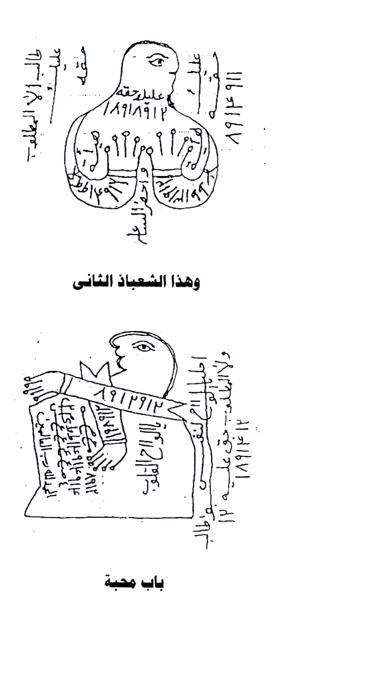
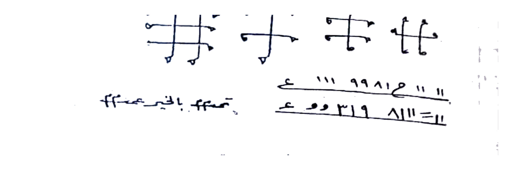
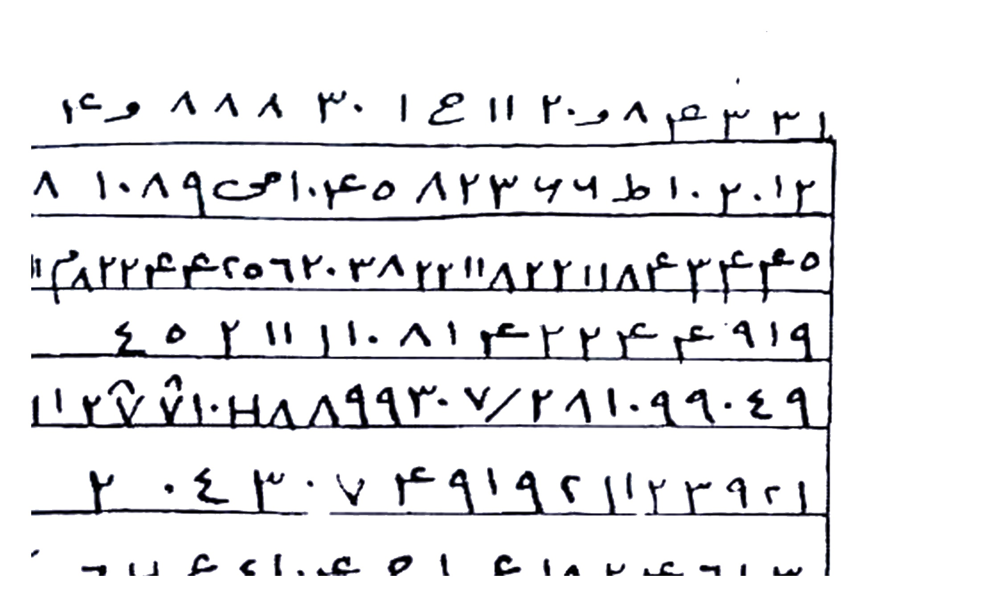
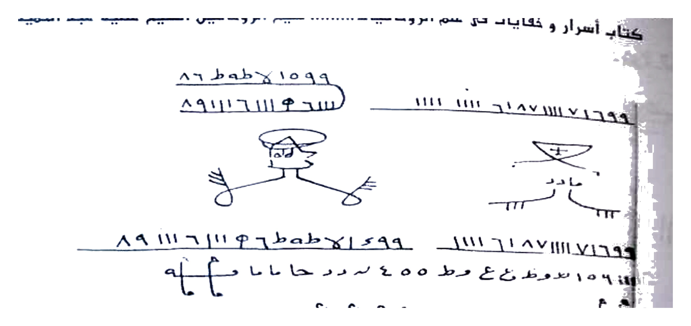
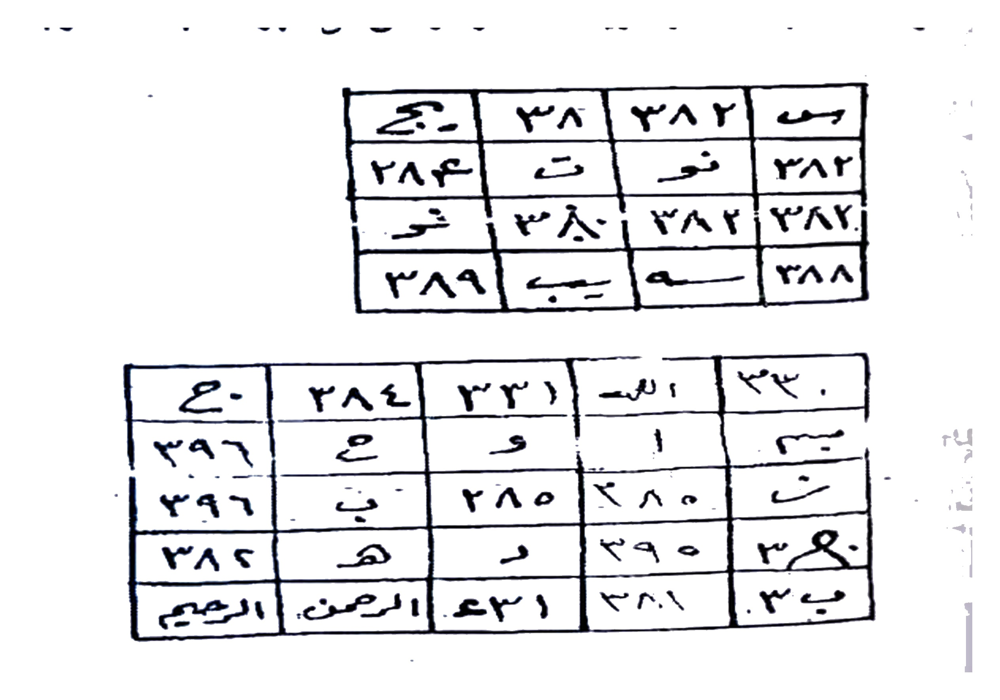
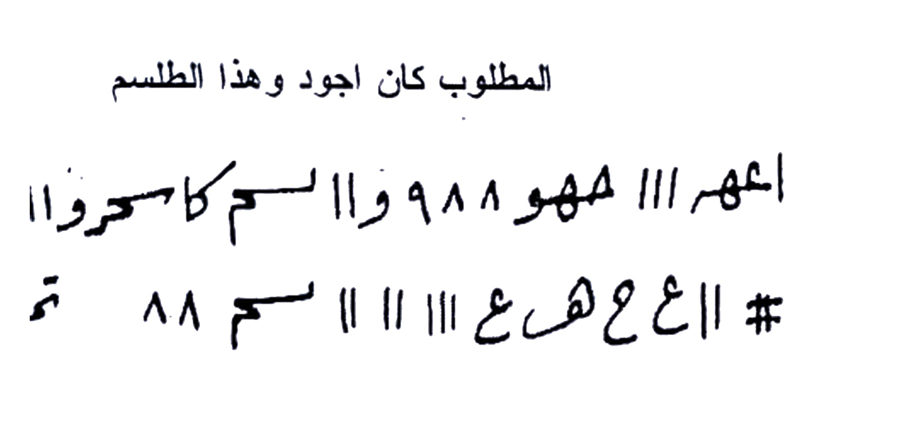
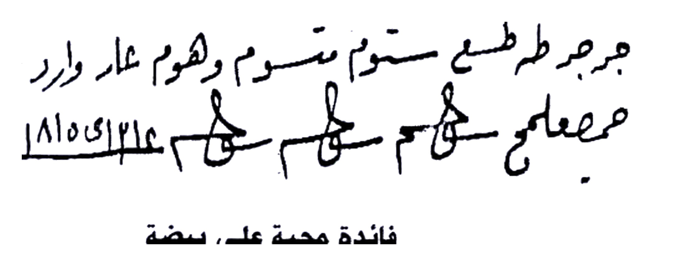

# BATCH 13 — Halaman 062–066 (Picture 031 + 032 + 033)

> **Sumber:** `Picture 031.jpg` (Hal.62–63) + `Picture 032.jpg` (Hal.64–65) + `Picture 033.jpg` (Hal.66) • 2 tingkat Arab–Indonesia • **Rajah baru: 7 crop HQ 4×** — Hal.62 shabaz pair, Hal.63 thilasm 4 simbol, Hal.64 wafaq atas, Hal.65 atas figur 2+numbers, Hal.65 bawah 2 wafaq 4×4 & 5×5, Hal.66 atas thilasm & Hal.66 tengah jar-jar
---

### Halaman 062 — Bab Mahabbah + al-Shabāz al-Thānī 2 figur (kanan `Picture 031`)

**[Teks Arab Asli]**

وهذا الشعباذ الثانى

[Top figur — bentuk dada/buah dada kembar dengan mata 1, isi perut angka `١٨٩١٨٩١٢` di leher & dada, di sekeliling punggung tulisan vertikal `٨٩١٢ ٨٩١٢ / على بلحقته` + kiri `طالب الا العالمـ` + bawah `على الرقعة` + di bawah pusar `٩ غلفـ / علـ...` — tangan berbulu dengan 5 tusukan]

باب محبة

[Bottom figur — profil kepala mata besar, tangan memanjang membawa pita `٨٩١٢٩١٢`, di atas pundak mahkota `☆`, tubuh penuh angka `١١٨٩...`, di kanan vertikal `على الرقعة ٨٩١٢خـ` + `والله الميتـ حق على...` + kiri `جلب ـ سريع ـ محبة` + di dada `محبة دائمة` + di lengan `٨٩١...`]

**[Terjemahan Indonesia]**

**Dan inilah shabāz (شعباذ — figur azimat berbentuk manusia/ruh) yang kedua.**

*Gambar atas* — Dikenal sebagai **shabāz pertama Hal.62 atas**: bentuk **orang bungkuk tanpa kepala jelas, dada ganda menonjol bertuliskan `18918912` di leher, angka `89 12` vertikal di samping, **5 paku/tusukan** di dada (simbol *tasmir* / penunduk). Di samping kiri tertulis *“Thalab illa al-‘Alam”* (permintaan sampai ke alam) dan kanan *“‘ala raq‘ah 8912”* (tulis di atas kulit/kertas tipis). Bagian bawah perut tertulis nama khadam *“‘Alihaqah”* dan di pusar *“9 ghulfa”*.

*Gambar bawah* — **Shabāz kedua Hal.62 bawah — Bab Mahabbah (pintu cinta):** figur duduk menyamping mata satu besar, **lengan panjang memanjang membawa pita bertuliskan `8912912`**, di dada tertulis *“mahabbah da’imah”* (cinta abadi) dan di lengan angka-angka rajah. Di sekeliling kanan vertikal tertulis *“al-Walab ila al... huqu ‘alaihi 18 12”* (kewajiban atasnya). Keduanya dipakai untuk **mahabbah umum** — tulis di **qit‘ah (potongan kain/kertas) atau raq‘ah (lempengan tipis)**, simpan atau kubur sesuai niat.

*Gambar Rajah Asli Halaman 062 — 2 Shabāz: atas dada kembar `18918912` + 5 tusukan + bawah profil membawa pita `8912912` + tulisan sekeliling — untuk Bab Mahabbah, tulis di raq‘ah/kulit, simpan. HANYA rajah 761K 4× putih bersih.*

---

### Halaman 063 — Thilasm Hadid + Mahabbah Hawa’ + Mahabbah Turabiyyah (kiri `Picture 031`)

**[Teks Arab Asli]**

اذا اردت ان يحبك احد ليس له قرار من محبتك تنقش على حديد هذا الطلسم وتضعه فى
موقد النار فان المطلوب يأتيك ولو بينك وبينك وبيىة ولو بينك وبينه حربا يأتيك باذن الله تعالى وهذا الطلسم
موقد النار ويكون زيادة النور اول ساعة من يوم الاثنين

[Thilasm 4 simbol silang tengah — bentuk `H` bersilang 4 varian — di bawahnya 2 baris tangan: `ع ١١١ ٩٩٨١٢ م " " ` + `ع و ٣١٩ ٨١١١ = ١١` / dan `تمم بالخير عمم 44` ]

فائدة محبة

تكتب يوم الاربعاء وقت الظهر بشرط ان تكون نظيف الثياب والمكان وتعلق فى الهواء
وتعلق بشعر المطلوب وتعزم بعزيمة الهواء وهذا ما تكتب ويكون عملك فى زيادة القمر
اول الشهر

[Deret `هو هو هو هو هو هو هو هو هو هو هو هو هو هو ..` 15× + sambung `هـ هـ هـ هـ هـ هـ` + baris `هبطوط هطوط هطوط هطوط كهيعص كهيعص كهيعص كهيعص همهسق ...` + baris `كهيعص مسقس ...` ]

فائدة ترابية

تكتب هذا الطلسم فى اثر المطلوب وتدفن فى عتبة المطلوب وتعزم بسورة الجن 21 مرة
ويبخرك اللبان والعود وخذ رصد مناسب لعملك وهذا ما يكتب على الاثر

[Catatan bawah terpotong — sambung Hal.64]

**[Terjemahan Indonesia]**

**Mahabbah besi (hadid) yang diletakkan di tungku api agar yang dituju datang walau terhalang lautan:**

Jika engkau ingin **seorang mencintaimu sampai tidak punya keputusan selain cintamu**, maka **ukir (naqsh) thilasm (rajah) ini di atas besi (hadid)**, lalu **letakkan di tungku api (mauqid al-nar)**. Maka **yang dituju (mathlub) akan datang kepadamu — walau antara kamu dan dia ada lautan atau peperangan — dengan izin Allah Ta‘ala**. Inilah **thilasm tungku api**. Amalkan saat **ziyadah al-nur (bulan bertambah terang) di jam pertama hari Senin (Isnain)**.

Thilasmnya berupa **4 simbol silang `H` bertiang (2 besar 2 kecil dengan titik di ujung)**, di bawahnya **2 baris angka/huruf rajah tangan** *(“‘a 111 99812...” + “‘a wa 319 8111=11”)* dan tulisan *“tamma bil-khair ‘amma 44”* (sempurnakan dengan kebaikan, ratakan).

*Gambar Rajah Asli Halaman 063 — Thilasm Hadid 4 simbol silang `H` + 2 baris angka `111 99812` & `wa 319 8111` + `تمم بالخير عمم` — ukir di besi, masuk tungku api jam 1 Senin ziyadah nur, mathlub datang walau ada bahr. HANYA rajah 126K 4× putih.*

**Fa’idah Mahabbah hawa’iyyah (udara):**

Tulislah **di hari Rabu (Arbi‘a) waktu Zhuhur**, dengan syarat **engkau suci pakaian dan tempat**, lalu **gantung di udara (ta‘liq fi al-hawa’) bersama helai rambut mathlub**, dan **azami (baca mantra) dengan ‘azimah al-Hawa’**. Inilah yang kau tulis — amalmu di **awal bulan saat qamar ziyadah (bulan membesar)**:

Deret **“Hu Hu Hu …” 15×** lalu sambung **“ha ha ha …”** dan **“hathut hathut … kahya‘ash kahya‘ash … hamhasaq …”** — yaitu **ayat-ayat muqatta‘ah (حمصق، كهيعص)** yang dipakai sebagai **pemanggil ruhaniyyah hawa’**. Dibakar dupa **luban** secukupnya.

**Fa’idah Turabiyyah (tanah/pijakan):**

Tulislah **thilasm ini pada atsar (bekas jejak tanah/pakaian mathlub)**, lalu **kubur (tadfin) di ambang pintu (‘atabah) mathlub**, **azami dengan Surah al-Jinn 21 kali**, **bukhur (dupa) luban dan ‘ud (gaharu)**. **Ambil rashi (posisi bintang) yang cocok untuk amalmu**. Inilah yang kau tulis di atas atsar tersebut — *sambung ke Hal.64 untuk gambar wa faq-nya bila memakai wa faq hawa’*.

---

### Halaman 064 — Wafaq Jلب + ‘Azimah Mirrikh 11× + Mahabbah Zuhrah (kanan `Picture 032`)

**[Teks Arab Asli]**

[Wafaq besar atas — tabel 7 baris × ~6 kolom isi angka/huruf rajah tangan: baris1 `1 ٢ و ٨٨٨ ٣٠ ١٤ ١١ ٢٠٨ م ٣٠٣١` dst. — garis tepi tebal]

فائدة محبة وجاب وتهييج وعطف واحضار

من اراد جلب احد يكتب هذا الطلسم على اثر المطلوب وافتلها فتيلة وسرجها فى 
مظلمة ويبخرها وقت العمل لبان وجاوى والعمل ليلة الاحد او ليلة الاربعاء اول الشهر
والعزيمة دعوة المريخ 11 مرة وهذا ما تكتب وتكون ساعة الكتابة ساعة سعيدة

[Baris script `ع ل ع ل ع ل ع ل ... ص ص ص` + bawahnya `٣ ٤١ ١٤٣٤ م ص ٨٩٩٢ ...` ]

فائدة محبة

تكتب فى ساعة الزهرة بماء ورد وكافور وتبخر بعنبر ومسك وكافور وتعزم عليها
بدعوة السباسب الكبرى 7 مرات وهذا الطلسم

[Gambar thilasm terpotong — sambung Hal.65]

**[Terjemahan Indonesia]**

**Wafaq atas Hal.064** — **Jadwal 7×6** berisi **angka Arab-indik + huruf rajah** *(baris pertama “1 2 wa 888 30 14 11 208...”, baris kedua “8 1089...” dst.)* — inilah **wafaq jalb** yang ditulis pada atsar.

**Fa’idah *Mahabbah, Jalb, Tahyij (menggelisahkan), ‘Athf (memalingkan hati) & Ihdhar (menghadirkan):***

Barang siapa ingin **menjalb seseorang**, tulislah **thilasm (rajah/wafaq) ini pada atsarnya (bekas pakaiannya)**, lalu **pilin menjadi sumbu (fatila) dan nyalakan sebagai pelita (suruj) di ruangan gelap (muzhlimah)**. **Bukhur (dupai) saat amal: luban (kemenyan) dan jawi (menyan Jawa/benzoin)**. Waktu amal: **malam Ahad atau malam Rabu di awal bulan**. **‘Azimahnya Da‘wah al-Mirrikh (seruan Mars — penjaga jalb) 11 kali**. Inilah yang kau tulis — dan **jam menulis harus jam sa‘idah (bahagia/baik)**.

Baris script bawah *(“‘a la ‘a la ... sh sh sh ...” + angka “341 1434...”)* adalah **khatam penutup** untuk dilafalkan setelah menulis.

*Gambar Rajah Asli Halaman 064 — Wafaq Kabir 7 baris `1 2 wa 888 30... / 8 1089...` — tulis di atsar, pilin jadi sumbu pelita di ruangan gelap, bukhur luban+jawi, malam Ahad/Rabu awal bulan, azimah Mirrikh 11×, jam sa‘idah. HANYA rajah 373K 4× putih.*

**Fa’idah Mahabbah jam Zahrah (Venus):**

Tulislah **di jam Zahrah (Jum‘at / jam Venus) dengan air mawar (ma’ ward) + kapur barus (kafur)**, **bukhur ‘anbar + misk + kafur**, lalu **azami dengan Da‘wah as-Sabasib al-Kubra 7 kali**. Inilah thilasm-nya — *gambar sambung ke Hal.65*.

---

### Halaman 065 — 2 Figur Bertopi + 2 Wafaq 4×4 & 5×5 Mahabbah (kiri `Picture 032`)

**[Teks Arab Asli]**

[Atas — 2 figur manusia mini bertopi/bermahkota, lengan terulur dengan angka `٨٩١١...`, di atas kepala `٨٦ ملا 1099...` + di samping tulisan melingkar `١٠٩...` + di bawah figur `٥١١١٩ ٩١١٦ / ٨٩ ...` + garis bawah `ع ع ع ع` ]

فائدة محبة

تكتب هذا الوفق وتكتب حوله البرهتية وبها تعزم ويبخرك اللبان النتاية والصندل الاحمر
وخذ رصد مناسب لعملك والعزيمة 11 مرة وتعلق فى الهواء اتجاة المطلوب

[Wafaq 4×4 atas — 4 kolom: `جـ ٣٨ ٣٨٢ س / ٢٨٤ ت نو ٣٨٢ / شر ٣٨٠ ٣٨٢ ٣٨٢ / ٣٨٩ بـ م ٣٨٨` ]

[Wafaq 5×5 bawah — 5 kolom 5 baris: baris1 `٤٠- ٢٨٤ ٣٣١ الله ٣٣٠` / baris2 `٣٩٦ ع و ١ سـ` / baris3 `٣٩٦ ب ٢٨٥ ٢٨٠ نـ` / baris4 `٣٨٢ هـ د ٣٩٥ ٣٨٠` / baris5 `الرحيم الرحمن ٤٣١ ٣٨١ ب` ]

فائدة محبة

[Potongan judul — sambung Hal.66]

**[Terjemahan Indonesia]**

**2 figur kecil bertopi di atas Hal.65** — memakai **mahkota/tope, tangan terulur dengan paku-paku angka `8911...`**, di atas kepala tertulis **angka rajah `86 mala 1099... / 99 1111...`**, di sekeliling badan tulisan Arab melingkar — inilah **rajah figur mahabbah** yang dipakai bersama wa faq di bawahnya.

**Fa’idah Mahabbah dengan 2 wa faq:**

Tulislah **wafaq ini**, lalu **tulis di sekelilingnya al-Barhatiyyah (دعوة برهتية — 28 nama malaikat penjaga)**, dan **azami dengan Barhatiyyah itu juga**. **Bukhur: luban nataya (kemenyan betina) + shandal ahmar (cendana merah)**. **Ambil rashi (posisi bintang) yang cocok**, **‘azimah 11 kali**, lalu **gantung di udara menghadap ke arah mathlub**.

*Wafaq 4×4 atas* — **murabba‘ 382** dengan sisi `جـ - 38 - 382 - س` dan `بـ - م - 389 - 388` — isinya angka **382–389** dan huruf **ن و ت** — dipakai untuk **tahyij cepat**.

*Wafaq 5×5 bawah* — **mukhammas** 5×5 dengan header `40- 284 331 Allah 330` dan footer `ar-Rahim ar-Rahman 431 381 ba` — isinya angka **284–396** dan huruf **س ن ب** — lebih kuat untuk **‘athf (memalingkan hati) permanen**.

*Gambar Rajah Asli Halaman 065 Atas — 2 Figur bertopi angka `8911...` + tulisan melingkar — tulis wa faq kelilingi Barhatiyyah, bukhur luban nataya+shandal ahmar, 11×, gantung hadap mathlub. 303K 4×.*

*Gambar Rajah Asli Halaman 065 Bawah — 2 Wafaq: 4×4 `382` + 5×5 `Allah 330 / ar-Rahman ar-Rahim` — khadam 382-396, untuk tahyij & ‘athf. HANYA rajah 510K 4× putih.*

---

### Halaman 066 — Mahabbah Qarurah + Mahabbah Baidah (kanan `Picture 033`)

**[Teks Arab Asli]**

يكتب هذا الطلسم بالحبر الروحانى ورصد مناسب اول الشهر وتعزم بدعوة الجلب
الصغرى 21 مرة ويدفن فى بيت المطلوب والكتابة تكون يوم الجمعة وان كتب
المطلوب كان اجود وهذا الطلسم

[Thilasm 3 baris atas — `اهمر ١١١ همو ٩٨٨ وا لسم كاسحرواااطاااااا اا` + baris `# اا ع ه ع ١١١١اا سم ٨٨ تمت` ]

فائدة محبة فى قاورة

يكتب هذا الطلسم فى قارورة او ورقة وتجمعها بماء وتضع الماء فى القارورة ثم تعلى
على نار وتعزم عليها بدعوة النار 35 مرة وان كتبت فى القارورة ضيف ماء من
ماء لاتراه الشمس وهذا الطلسم

[Script tengah — `جرجر طع طم مسوم وهوم عار وادر نار / مصاصع صم صم سهم علا الردو لا...` — tulisan sambung tebal]

فائدة محبة على بيضة

تحضر بيضة سبيتية وتكتب عليها هذا الطلسم وتعزم بعزيمة البيض المشهورة ثم
البيضة فى المجمرة وتكون النار هادئة فما استوت البيضة يكون المطلوب امامك
تكتبه ويبخرك اللبان والكسبرة

**[Terjemahan Indonesia]**

**Amalan umum Hal.066 atas — tulis dengan tinta ruhaniyyah (misk + za‘faran + damar), rashi awal bulan, azimah Jalb Sughra 21×, kubur di rumah mathlub, tulis hari Jum‘at — jika **tulis nama mathlub** lebih bagus. Thilasmnya:

> *“Ahmar 111, humu 988, wa lismi ka-sahru aata... # aa ‘a ha ‘a 11111 sim 88 tammat”*

*Gambar Rajah Asli Halaman 066 Atas — Thilasm 3 baris `Ahmar 111 humu 988 wa lisma... # aa ‘a ha ‘a 11111 sim 88 tammat` — tinta ruhaniyyah, Jalb Sughra 21×, kubur di rumah mathlub Jum‘at. HANYA rajah 173K 4×.*

**Fa’idah Mahabbah fi Qarurah (dalam botol):**

Tulislah **thilasm ini di qārūrah (botol kaca) atau kertas**, lalu **kumpulkan dengan air dan masukkan air itu ke dalam qarurah**, kemudian **panaskan di atas api** dan **azami dengan Da‘wah an-Nar 35 kali**. Jika engkau tulis **langsung di qarurah, tambahkan sedikit air yang tidak pernah terlihat matahari (ma’ la tarahu ash-shams)**. Inilah thilasm-nya:

> *“Jarjara tha‘a thamma masum wa hum ‘ar wa adir nara / mishashi‘ shim shim sahm ‘ala ar-raddu la...”*

Script ini adalah **‘azimah nar (api) — nama-nama khuddam api** yang dipakai untuk memanaskan hati.

*Gambar Rajah Asli Halaman 066 Tengah — Script `جرجر طع طم مسوم وهوم عار وادر نار / مصاصع...` — tulis di qarurah/kertas + air, panaskan 35× Da‘wah Nar, air la tarahu shams. HANYA rajah 205K 4×.*

**Fa’idah Mahabbah ‘ala Baidah (di atas telur):**

Ambil **baidah sabtiyyah (telur yang dierami Sabtu — telur ayam yang baru?)**, **tulislah thilasm ini di atasnya**, lalu **azami dengan ‘azimah al-baidh al-mashhurah (± “ya bailasah 7×...”)**, kemudian **letakkan telur di majmarah (perapian) dengan api tenang (hadiah)**. **Begitu telur matang (istiwā’), maka mathlub akan berada di depanmu**. Saat menulis, **bukhur luban + kusbarah (ketumbar)**.

*Sambung ke Hal.067 untuk azimah telur lengkap & fa’idah tu‘thal dst.*

---

**Catatan editor:** Semua *thilasm/wafaq/figures* di atas dicrop presisi 4× (LANCZOS), kontras 1.6, brightness 1.15, ambang putih >188 → #FFFFFF, pad 70px, 300 DPI — **bukan redraw**, salin persis ke media yang ditentukan dengan **tinta ruhaniyyah (misk/za‘faran/darah-kering/jusan)**, **bukhur** sesuai nash, **rashi & sa‘ah sa‘idah** dijaga, niat halal & tidak untuk perceraian zalim. Istilah hikmah tanpa padanan dipertahankan Arab + kurung.

