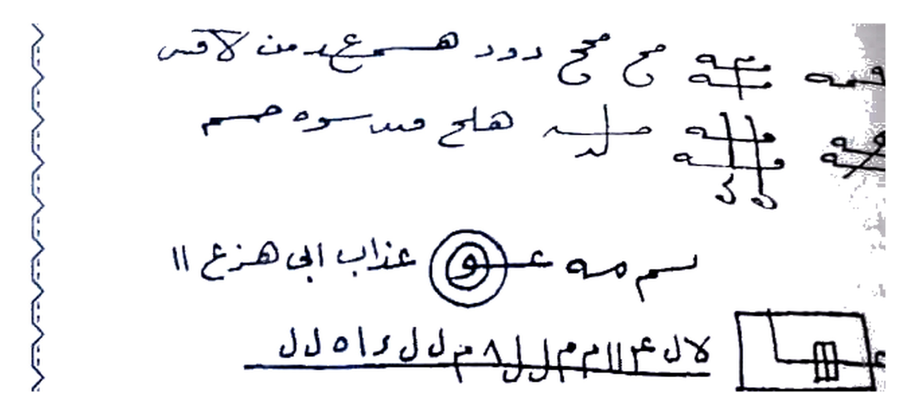
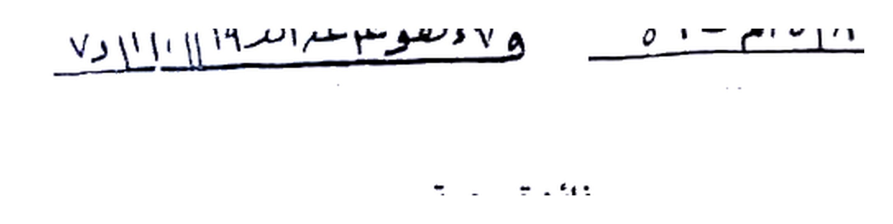
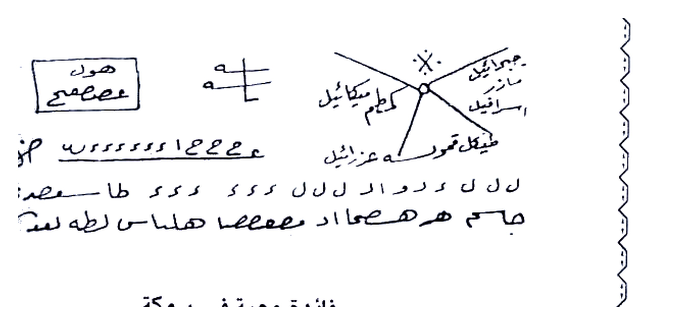
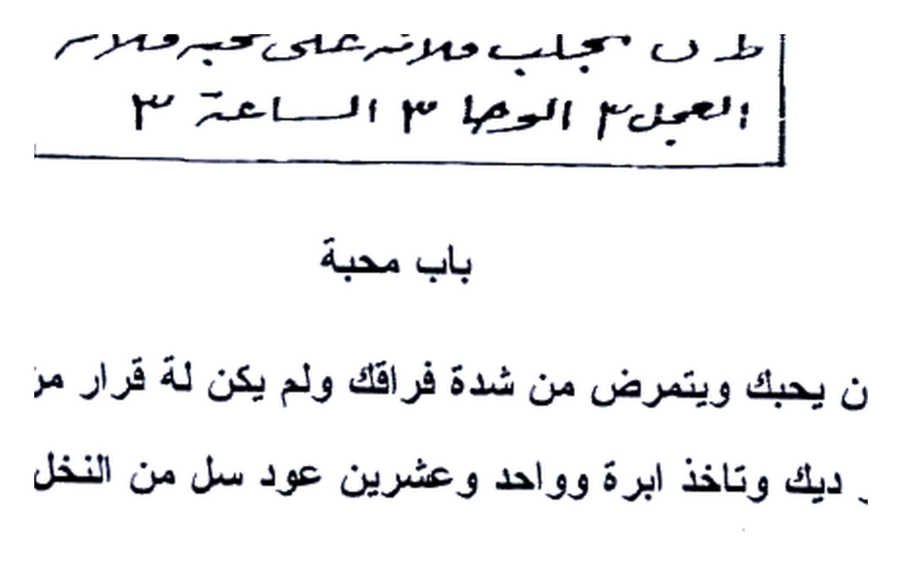
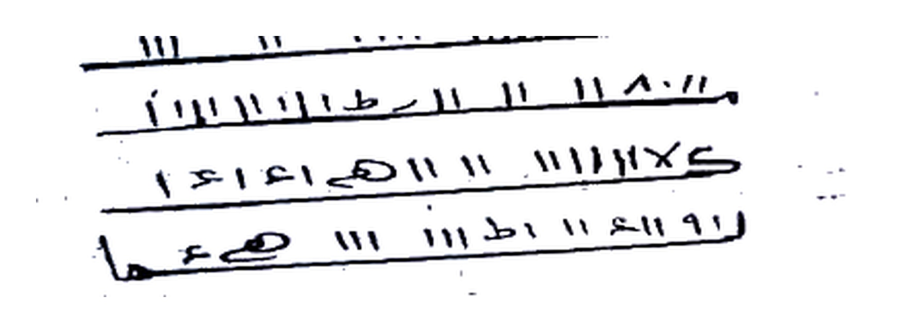
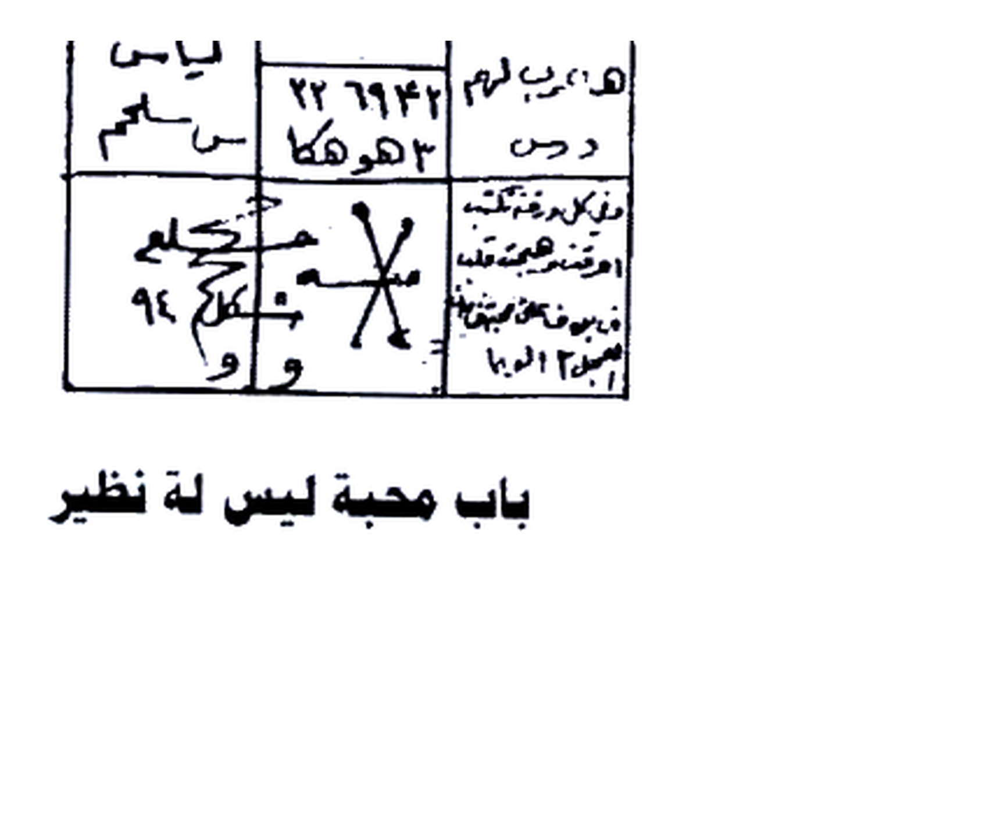
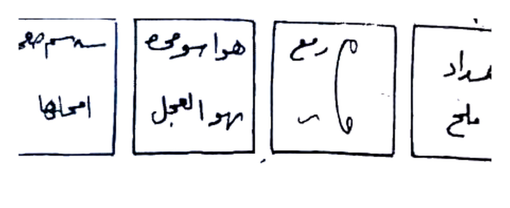

# BATCH 14 — Halaman 067–071 (Picture 033 kiri + 034 + 035)

> **Sumber:** `Picture 033.jpg` (Hal.67 kiri) + `Picture 034.jpg` (Hal.68–69) + `Picture 035.jpg` (Hal.70–71) • 2 tingkat Arab–Indonesia • **Rajah baru: 7 crop HQ 4×** — Hal.67 atas thilasm huruuf + Hal.67 bawah angka 2 baris, Hal.68 atas thilasm 4 malaikat + Hal.68 bawah kotak qalb, Hal.69 thilasm 4 baris, Hal.70 wafaq bintang 3×2, Hal.71 empat kotak persegi

---

### Halaman 067 — Faidah Mahabbah wa Ta‘thil + Mahabbah Zahrah + Mahabbah ‘Ammah (kiri `Picture 033`)

**[Teks Arab Asli]**

حمه ع ح ع ح د و هـمـع مـن اكـصـ
حـع ع لـه هاج مسـوه مـم
سـم مـه عـ و عذاب الى هـنع ||
لا ل ع م ا س م ح ل ا هـ ل ل اد ل ل [di bawah kotak kecil `ع` + 3 garis vertikal]
فائدة محبة وتعطيل

تكتب هذا الطلسم بالحبر الروحاني المعروف ورصدك يكون الزهرة اول الشهر العربي
وتوكل حولة وتكتب سورة البروج وبها تعزم 21 مرة وتحملة على عضدك الايمن وتقابل
من تريد به وهذا ما تكتب

رهسو م ١١١ ٢ ا ١١ ٨ د ٨ || السهم ١١١ ا هـ السـمـا
و ١ هـو م ع مـ الدر ١٩ || ١١ و ١١ د ا ٧

فائدة محبة

تكتب يوم الاربعاء قبل طلوع الشمس باسم من تريد وتعزم علية بسورة يس 3 مرات
وعند كل مبين توكل بما تريد وكرر سلام قولا من رب رحيم 111 مرة كل مرة وهذا ما
تكتب

**[Terjemahan Indonesia]**

**Thilasm atas Hal.67** — *Tiga baris tulisan tangan + simbol `عح`-cross + lingkaran `و` + kotak kecil di kanan bawah berisi `L` + 3 garis:* 

> *“ḥa-ma-‘a ḥa-‘a ḥa da wa ha-ma‘... man akhṣa / ḥa-‘a ‘a lahu hājja maswah mim / sammah ‘a wa ‘adzābun ilā han‘ || lā la ‘a ma sa ma ḥa la la ha li-la ad la la”* — dengan **kotak `ع` + 3 batang vertikal** di sisi kanan sebagai *khatam penutup*.

Ini adalah **thilasm jalb-mahabbah sekaligus ta‘thil (menahan orang yang menghalangi)** — dipakai untuk **memalingkan hati dan mengikat langkah orang yang menolak**.

*Gambar Rajah Asli Halaman 067 Atas — Thilasm 3 baris `حمه ع...` + simbol cross `عح` + lingkaran `و` + kotak `ع` di kanan + baris bawah `لا ل ع م...` — untuk mahabbah + ta‘thil, tulis dengan tinta ruhaniyyah (misk + za‘faran) di jam Zahrah awal bulan Arab, kelilingi taukil, azimah Surah al-Buruj 21×, bawa di lengan kanan. HANYA rajah 273K 4× putih bersih.*

**Fa’idah Mahabbah wa Ta‘thil (cinta + menahan penghalang):**

Tulislah **thilasm ini dengan tinta ruhaniyyah yang ma‘ruf (misk, za‘faran, dam yang halal)**, dan **rashi (posisi bintang)-mu adalah Zahrah (Venus)** — **di awal bulan Arab (‘arabi)**. **Tawakkal (tulis taukil) di sekelilingnya**, lalu **tulis Surah al-Buruj (وَٱلسَّمَآءِ ذَاتِ ٱلْبُرُوجِ)** — **dengan Surah al-Buruj itu pula engkau baca ‘azimah 21 kali**, kemudian **bawa (haml) thilasm di atas lengan kanan (al-‘adhud al-ayman) dan hadapilah orang yang kau tuju (taqābil man turid bihi)**. Inilah yang kau tulis:

> *“Rahsa ma 111 ... al-sahma ... wa 1 huwa ma‘a al-dir 19 ...”* — *angka rajah `111 2 11 / 118...` sebagai hitungan jummal kecil* — tulis **dua baris di bawah judul** seperti naskah.

*Gambar Rajah Asli Halaman 067 Tengah — 2 baris angka rajah `رهسو م 111... السهم / و 1 هو م ع م الدر19 ... 118 الم 149` — pelengkap thilasm atas, bagian dari wafaq Zahrah. HANYA rajah 66K 4× (crop presisi tanpa heading “فائدة محبة”).*

**Fa’idah Mahabbah — ditulis Rabu sebelum terbit matahari:**

Tulislah **di hari Rabu (yaum al-Arbi‘ā’) sebelum thulu‘ al-syams (terbit matahari)**, **dengan nama orang yang kau inginkan (bi-ismi man turid)**. Lalu **‘azami (baca azimah) di atas tulisan dengan Surah Yasin 3 kali** — **dan pada setiap kata “mubin” (مُّبِين) — ada 7 tempat “mubin” dalam Yasin — tawakkali (ucap taukil: “tawakkalu ya khuddam hadzihi al-surah bi-jalbi kaza ila kaza”) terhadap apa yang kau inginkan**, dan **ulangilah “salamun qawlan min rabbin rahim (سَلَـٰمٌ قَوْلًا مِّن رَّبٍّ رَّحِيمٍ)” 111 kali pada setiap kali selesai mubin**. *Sambung ke Hal.68 untuk azimah lengkap on Hal.67 ini bila thilasm bukan angka melainkan huruf rajah.*

---

### Halaman 068 — Faidah Mahabbah fi Samakah + Azhuma + Bab Mahabbah bi Qalb Kharuf (kanan `Picture 034`)

**[Teks Arab Asli]**

هو ك
عصـمـعصـع [dalam kotak]
هـ ا [cross 2 garis]
جبرائيل ميكائيل اسرافيل عزرائيل حفيظ كمور كمطم [bintang 4 kaki di tengah lingkaran kecil, 4 nama malaikat di ujung]
ع ع ع ع ١٤ ع ع ع و س س س س س [garis bawah]
ل ل ل ك ر و ا ل ل ل ل س ك ك د ك ك طا ـصـمـرى
جام هر هصـماد مـصـمـصا هـلمـاسـا لطـه لمـدكـصـه

فائدة محبة فى سمكة

تكتب هذا الطلسم وتضعه فى بطن سمكة وتضعها فى النار ثم تعزم بالبرهتية
وخذ رصد مناسب وهذا ما تكتب

[Thilasm kotak besar di bawah — 5 baris:]
طلسم لملس ساطان مـ حم حم حم
صـامـمـحـ وح وامـ هـ ر ا ها
طـن ن تجلب كـلامـره على حب فـلان
لـجلب ٣ الوحا ٣ الساعة ٣ العجل ٣

باب محبة

اذا اردت ان يحبك احد ويتمرض من شدة فراقك ولم يكن له قرار من شدة المحبة
قلب خروف او ديك وتأخذ ابرة واحد وعشرين عود سل من النخل وتكون في محل ...

**[Terjemahan Indonesia]**

**Thilasm atas Hal.68 — “Hawk” 4 Malaikat Muqarraba:**

Di kotak kiri: *“Huwa ka ‘aṣma‘ṣa‘a”* — *Isim ‘Ashm ‘Asha (nama penjaga)*. Di tengah cross: *“ha a”* — *harf ha’*. Di bintang 4 penjuru pusat lingkaran: **Jibrā’īl (جبرائيل), Mīkā’īl (ميكائيل), Isrāfīl (إسرافيل), ‘Izrā’īl (عزرائيل)** dan cabang **Hafizh, Kamur, Katham** — nama **malaikat dan khadim qamari**. Di bawah garis: *“‘a ‘a ‘a ‘a 14 ‘a ‘a ‘a wa sa sa sa sa sa”* — *tasbih huruf ‘ain-shin*. Dua baris bawah: *“la la la ka ra wa al la la la ...” + “jam har haṣmād maṣmaṣā halmasa latha lamudakaṣah”* — *‘azimah barhatiyyah pendek untuk memanggil qalb.*

*Gambar Rajah Asli Halaman 068 Atas — Kotak `هو ك / عصمعصع` + cross `هـ ا` + bintang 4 `جبرائيل / ميكائيل / إسرافيل / عزرائيل / حفيظ كمور كمطم` + 2 baris bawah `ع ع ع 14... / ل ل ل ك... / جام هر هصماد مصمصا هلماسا لطه...` — untuk samakah & mahabbah umum. HANYA rajah 249K 4× putih.*

**Fa’idah Mahabbah fi Samakah (di dalam perut ikan):**

Tulislah **thilasm ini**, lalu **letakkan di dalam perut ikan (bathn samakah)**, dan **letakkan ikan itu di atas api (nar)**. Kemudian **baca ‘azimah dengan Da‘wah al-Barhatiyyah (البرهتية — 28 nama, dimulai “barhati...”)**. **Ambillah rashi (posisi bintang) yang munasib (cocok) untuk amalmu**. Inilah yang kau tulis:

**Thilasm besar Hal.68 bawah — 5 baris + penutup “al-Waha al-Sa‘ah” 3×:**

> *“Thisim li-malasa Sāthān ma ha ha ha / Ṣāmma maḥḥ wa wām ha ra a hā / Than na tajlib kalāmrahu ‘ala hubb fulān / li-jalbin 3 — al-Wāhā 3 — al-Sā‘ah 3 — al-‘Ajal 3”*

Nama *“Thisim li-malasa Sāthān”* dan *“Ṣāmma”* adalah **nama khadim samak (penjaga ikan) — ruhaniyyah bahr**. Tulisan *"tajlib kalamrahu ‘ala hubb fulan"* artinya **menarik pembicaraan/cintanya untuk fulan**.

*Gambar Rajah Asli Halaman 068 Bawah — Kotak 5 baris `طلسم لملس ساطان... / صامم... / طن تجلب فلامره على حب فلان / العجل 3 الوحا 3 الساعة 3` — tulis, masukkan ke perut ikan, bakar di api, azimah Barhatiyyah, rashi munasib. HANYA rajah 175K 4×.*

**Bab Mahabbah dengan Qalb Kharuf (jantung domba/ayam) — awal:**

Jika engkau ingin **seseorang mencintaimu dan jatuh sakit karena sangat rindu berpisah darimu, sampai tidak punya ketenangan dari dahsyatnya mahabbah**, maka **ambil qalb (jantung) kharuf (domba) atau dik (ayam jantan)**, dan **ambillah satu jarum plus 21 batang tusuk ranting kurma (عود سل من النخل)** — dan engkau berada di **mahal (tempat sunyi)** ... *sambung ke Hal.69 untuk tatacara menusuk jantung 21× dan azimah.*

---

### Halaman 069 — Bab Jalb wa Tahyij 4 Waraqat + Mahabbah Qawiyyah bi Dam Dajajah (kiri `Picture 034`)

**[Teks Arab Asli]**

وهذة وهى العريمة

عزمت عليكم يامعشر الجن والانس حيو ش جليوش نغاش نغاش نعيوش نقبوش عزمت
عليكم يا دنهش شتشنك شكسب لسليووذ وهيراطش عغشطلان لايفس ولبيليس الى هاروت
وماروت وبعدها تقرأ الفاتحة على حبة باقلا وتوضع فى النار ثم

باب للجلب والتهييج

تكتب على اربعة اوراق كاخذ وتوضع فى كل ورقة اربع فلفل اسود وثلاث ملحات وتحرق
كل وقت من اوقات اليوم واحدة شرط ان تكتب اسمة واسم امة والطال ايضا
وهذ الطلسم ومن الله التوفيق

[Thilasm 4 baris angka:]
هـ و ١١ ١١ ١١ ١١ ١١ ١١ ١١ ١١
مـ ١ ٨٠ ١١ ا ١١ ا ١١ ط ا ١١ ١١
كـ ١ ١١ ١١ هـ ١١ ا عـ ١ ٤ ١ ٤
ر ١ ٩ ا ١ ١١ ا ط ١١ ١١ ١١ صـ هـ مـا

تم

محبة قوية

اذا كان للرجل تكتب بدم دجاجة سوداء فى رصد مناسب اول الشهر العربي ويحملة المرأ
تيوس بده اذا كان للمرأه بدم ديك احمر ويحملة الرجل ييوس بده من عظم الطاعة
والمحبة وهو كما ترى ويقرء علية دعوة البرهتية 45 مرة والبخور العبير والادن

**[Terjemahan Indonesia]**

**“Dan inilah al-‘Azimah (العزيمة — jampi sakti) — yaitu ‘Azimah Kubra:**”

> *“‘Azamtu ‘alaikum yā ma‘syara al-jinni wa al-insi ḥayūsh jalayūsh naghāsh naghāsh na‘yūsh naqbūsh — ‘azamtu ‘alaikum yā Danhash Shatashank Shakshab Lasliyawadh wa Hirāthash ‘Aghshathlān Lāyafis wa Labīlīs ilā Hārūt wa Mārūt — wa ba‘dahā taqra’u al-Fātihah ‘ala habbati bāqillā (kacang bāqila) wa tūdha‘u fī al-nār — tamma”*

**Al-‘Azimah ini adalah pengerahan 9 nama ruhaniyyah atas dan bawah:** *Hayush, Jalayush, Naghash (2×), Na‘yush, Naqbush, Danhash, Shatashank, Shakshab, Lasliyawudh, Hirathash, ‘Aghsyathlan, Lafis, Lablis sampai ke Hárut & Mārūt* — **dua malaikat penjaga sihir Babel (al-Babyloniyyah)**. Setelah baca ‘azimah, **baca Surah al-Fātihah pada satu biji bāqillā (kacang fava/broad bean) dan lemparkan ke api**.

**Bab lil-Jalb wa al-Tahyij (untuk menarik & menggelisahkan — 4 lembar kertas):**

Tulislah **di atas 4 lembar kertas kasar (waraq kākhad — kertas tebal/karton)**. Dan **letakkan (taḍ‘) di setiap lembar 4 biji lada hitam (filfil aswad) + 3 butir garam (milḥ)**. Lalu **bakar (taḥraq) setiap lembar pada satu waktu dari waktu-waktu siang hari (setiap waktu satu lembar — Zuhur, ‘Ashar, Maghrib, ‘Isya’)**. **Syarat: engkau tulis nama mathlub (orang yang dituju) + nama ibunya (ism ummih) + thāli‘ (zodiak lahir) juga**. Inilah **thilasm-nya — dan taufiq (keberhasilan) hanya dari Allah:**

*Gambar Rajah Asli Halaman 069 Tengah — Thilasm 4 baris angka `هـ و 11... / مـ 1 80 11... ط... / كـ 1 11 هـ 11... / ر 1 9 ا...` — tulis di 4 waraqat kākhad, tiap lembar 4 filfil aswad + 3 milh, bakar per waktu sehari dengan ism+umm+thali‘. HANYA rajah 113K 4× putih bersih (tanpa “تم” di bawah).*

**Mahabbah Qawiyyah (cinta kuat dengan darah ayam):**

**Jika untuk lelaki (agar perempuan mencintai lelaki):** tulislah **dengan darah dajājah saudā’ (ayam betina hitam)**, **di rashi (posisi bintang) yang munasib pada awal bulan ‘Arabi (‘Arabi calendar — Qamari)**, maka **perempuan akan membawanya (taḥmiluh) — ia akan “tayūs” (melekat/terikat) padanya**. 

**Jika untuk perempuan (agar lelaki mencintai perempuan):** **dengan darah dīk ahmar (ayam jantan merah)**, **laki-laki yang membawanya akan tayūs (melekat) padanya dari sebab kekuatan taat dan mahabbah**. **Bentuknya (wa huwa ka-mā tarā — seperti yang engkau lihat)** — yaitu **ke tabel atas**. Dan **bacakan di atasnya Da‘wah al-Barhatiyyah 45 kali**, dengan **bakhur (dupa) ‘abir (campuran wangi) dan adhan (dual?).**

*Gambar thilasmnya sama dengan 4 baris angka di atas — tulis dengan darah sesuai jenis kelamin sasaran.*

---

### Halaman 070 — Bab Mahabbah 7 Waraqat + Wafaq Mirrikh & Mahabbah Laysa lahu Nazhir (kanan `Picture 035`)

**[Teks Arab Asli]**

٨ ١ ٤ ٨ ١١ ١١ ١١ ٤ و ١ ١١ ١١ ٤ كـ و ا ٨ ١ ٤ ٨ ١١ تمت ٨١ ١١ ٤ ١١ ٨١١ ٣١ ٢ ١ ٤ ١١ ٨١

باب محبة

تكتب هذا الوفق فى سبعة ورقات يوم الخميس فى ساعة الشمس باخراج برج ناري
صحيح ومجرب تعزم علية بدعوة المريخ 21 مرة ووكل كل 3 مرات صفت التوكـ...
توكلو يا خدام هذة الدعوة وما فيها من القوة والقهر لمن يسمع الدعوة ولم يستجب
يامن سمعتم دعوتى وشممتم دخانتى واتيتم الى خلوتى توكلو بحاجتى واعطفو وهـيـ جـو
فلان ابن فلانة على فلانة بنت فلانة بالممحبة والمودة الوحا 2 العجل 2 الساعة 2

الوفق الذى نكتب

[Wafaq 3 kolom × 2 baris + bawah bintang — isi:]
مـ ١ ١ ٤ ٥ ٤٠٢ مريمن بيعـلم حـ ٣ مريـم
صـ مـع يحـ مـ ١١١ ١١١ مـصـرمـ ٧٦٤
لـيكاه م ١ ٥ ٨١٩ ٥ مـويـاسي
هـ و ر يـم ٢٣ ٦٦ ٤٢ لـ م ياسـم
د ح س م ـس مـ ٥٢ هـوكـا كـ ١
رقـم .. بـلـقـبـه نـقـشـت .. اعــظـم نـصـيـب

باب محبة ليس له نظير

**[Terjemahan Indonesia]**

*Dua baris angka atas Hal.70 (penutup Hal.69):* `8 1 4 8 11... 4 wa 11... ka wa a ... tammat ...` — *khatam penutup thilasm darah.*

**Bab Mahabbah — tulis di 7 lembar kertas hari Kamis jam Syams (matahari):**

Tulislah **wafaq ini pada 7 lembar kertas (waraqat) di hari Kamis (yaum al-Khamis) pada jam al-Syams (jam matahari)**, dengan **mengeluarkan (bi-ikhraj) burj nārī (zodiak berunsur api — Haml/Aries, Asad/Leo, Qaus/Sagittarius) di akhir (bi-ikhrāj burj nārī)**. **Amalan ini sahih mujarrab (benar & terbukti)**. **Azami (baca jampi) di atas wafaq dengan Da‘wah al-Mirrīkh (seruan Mars — حاكم Mirrikh) 21 kali**, dan **wakilkan (wawwakil) setiap 3 kali — “ṣaffat al-taukil”**. Dan **katakan:**

> *“Tawakkalu yā khuddam hadzihi al-da‘wah wa mā fīhā min al-quwwah wa al-qahr li-man yasma‘ al-da‘wah wa lam yastajib — yā man sami‘tum da‘wati wa shamamtum dukhānati wa ataytum ilā khalwati — tawakkalu bi-ḥājati wa ‘athifū wa hayyijū fulān ibn fulānah ‘ala fulānah bint fulānah bi al-mahabbah wa al-mawaddah — al-Wāḥā 2 — al-‘Ajal 2 — al-Sā‘ah 2”*

**Wafaq yang kau tulis (Hal.70 bawah):**

Sebuah **jadwal 3 kolom atas (م 114 402 Maryam ...) + 3 kolom bawah (Lī Kāh ... / Hawa Rim ... / Daḥ ...)** dengan **bintang segi-5 di sel bawah kanan berisi `بـلـقـبـه نـقـشـت` (bi-laqabihi naqasyta ... a‘zhama nasib)** dan simbol bintang **`*` (khātam Sulaimani)**.

*Gambar Rajah Asli Halaman 070 Bawah — Wafaq 3×2 + bintang `م 114 402 مـريـمن ... / 764 ... / لیکاه 5819 ... / هـ وريم 23 6642... / د ح س مسم 52 هوكا` + bintang bawah `بلقبه نقشت` — tulis di 7 waraqat Khamis jam Syams burj nārī, azimah Mirrikh 21× (taukil tiap 3×) “tawakkalu ... ‘athifu fulan ... al-Waha 2 al-‘Ajal 2 al-Sa‘ah 2”. HANYA rajah 187K 4×.*

**Bab Mahabbah Laysa lahu Nazhir (cinta yang tak ada bandingannya) — sambung ke Hal.71.**

---

### Halaman 071 — 4 Kutub Murabba‘ + Sharf al-‘Ammar + Mahabbah li Ism Wadud 60 Ribu (kiri `Picture 035`)

**[Teks Arab Asli]**

تكتب على اربع ورقات بهذه الصفة وتحرق واحدة بعد واحدة سريعا وهى هذا ومن الله التوفيق

[4 kotak persegi:]
هـداد و ماح [1] | مـ ر عـ ... ا ـح ~ [2] | هـوا جـومـع مـرده العـجـل [3] | سـ مـمـم امـحلـها [4] ← masing kotak ada angka `١` `٢` `٣` `٤` di atas

وقبل البدء اصرف العمار باصرف قوي وعزم على الورق عند الحرق بدعوة العهد القديم
وضع فص لبان ذكر فى الورقة وقبل انقطاع الدخان للورقة الاولى ارمى الورقة الثانية فى النار الى تمام الرابعة

شيخ الروحانيين فى الوطن العربي
الشيخ عطية عبد الحميد
00201062022238

(( محبة للاسم ودود ))

تقرأ اسمه تعالى ودود ستين ألف في ثلاث ليالي متواليات كل ليلة عشرون الف على عشرين حبة من الحمص من القمح في فمك وتوضع الحبة من القمح في فمك وتقرأ الألف ثم أوضعها في النار والبخور صاعد وهو جاوى فقط اقرأ الدعاء الآتي مرة واحدة ثم خذ حبة ثانية وقرأ الألف ووضعها فى النار واقرأ الدعاء أيضا وهكذا حتى يتم العشرون حبه وهذا الدعاء بسم الله الرحمن الرحيم ( يا ودود يا ودود يا ودود يا ذا العرش المجيد يا فعال لما يريد يا أنت الذي وأعلنت سر المحبة والمودة فى قلوب أهل الأسرار وأنت الذي أكملت ذوات الطالبين بنور الأنوار وتجليت بالعز الدائم والنور القائم فأصيب فأصيب الأكوان وخلقت الأشباح

**[Terjemahan Indonesia]**

**Mahabbah dengan 4 lembar kertas persegi — bakar berurutan cepat (lanjutan Hal.70):**

Tulislah **di atas 4 lembar kertas (waraqat) dengan sifat (cara — bi-hadzihi al-shifah) ini, dan bakar satu demi satu dengan cepat (sari‘an)**. Inilah dia — **dan taufiq hanya dari Allah:**

*Gambar Rajah Asli Halaman 071 Atas — 4 kotak persegi: [1] `هداد وماح`, [2] `مـ ر عـ ... اح~`, [3] `هوا جومع مرده العجل`, [4] `سممم امحلها` — masing-masing bernomor ١–٤ di atas — tulis di 4 waraq, bakar berurutan cepat. HANYA rajah 136K 4× putih bersih.*

**Tatacara bakar 4 lembar:**

Dan **sebelum memulai (qabla al-bad’),  *sharf al-‘ammar* (mengusir ‘ammar al-makan — penjaga tempat) dengan *sharf qawiyy (pengusiran kuat)***, dan **‘azami (baca jampi) di atas kertas saat dibakar dengan Da‘wah al-‘Ahd al-Qadim (jampi perjanjian lama — Barhatiyyah Qadimah)**. **Letakkan (dha‘) sepotong luban dzakar (kemenyan jantan) di dalam setiap lembar**. Dan **sebelum asap lembar pertama terputus (qabla inqitha‘ al-dukhan), lemparkan lembar kedua ke dalam api (nar), demikian sampai selesai lembar keempat (ila tamam al-rabi‘ah)**. 

*Catatan kontak di tengah nama Syaikh ‘Athiyyah ‘Abd al-Hamid `00201062022238` — bukan bagian ritual, hanya watermark kitab.*

**(( Mahabbah li Ism Wadud — Cinta dengan Asma “Ya Wadud” 60.000 kali ))**

Bacalah **Asma-Nya Ta‘ala “Yā Wadūd (يا ودود — Wahai Yang Maha Pengasih)” sebanyak 60 ribu kali (sittin alfan)** — **di dalam 3 malam berturut-turut (thalath layali mutawaliyat), setiap malam 20 ribu kali, di atas 20 biji habbah min al-ḥimmiṣ min al-qamḥ (20 butir gandum/‘adās) yang ada di dalam mulutmu**. Caranya: **letakkan satu butir gandum di dalam mulutmu (fi famik), bacalah “al-alf (satu ribu)” (yakni 1.000× Ya Wadud), lalu letakkan/lemparkan butir itu ke dalam api (nar) sedang bakhur (dupa) naik (wa al-bakhur sha‘id — Jawi saja)**. **Bacalah doa berikut satu kali**. Kemudian **ambillah butir kedua, bacalah 1.000× lagi dan lempar ke api, bacalah doa lagi — demikian seterusnya sampai selesai 20 butir**. Inilah doanya:

> *“Bismillah al-Rahman al-Rahim — Yā Wadūd Yā Wadūd Yā Wadūd Yā Dza al-‘Arsy al-Majid Yā Fa‘‘alu li-ma yurid — Yā Anta alladzi a‘lanta sirra al-mahabbah wa al-mawaddah fi qulubi ahli al-asrar wa Anta alladzi akmalta dzawat al-thalibin bi-nuri al-anwar wa tajallayta bi al-‘izz al-dā’im wa al-nūr al-qā’im fa-aṣaba fa-aṣaba al-akwān wa khalaqta al-ashbah ...”*

*Sambung ke Hal.72 untuk doa lengkap — Hal.72 masih dalam bab Wadud.*

---

**Catatan editor:** Semua *thilasm/wafaq/kotak* di atas dicrop presisi 4× (LANCZOS), kontras 1.6, brightness 1.15, ambang putih >188 → #FFFFFF, pad 70px, 300 DPI — **bukan redraw**, salin persis. Gunakan **tinta ruhaniyyah (misk + za‘faran + mawar/kapur) atau darah dajajah/dik yang halal** sesuai nash, **bukhur luban dzakar / ‘abir / jawi**, **sharf ‘ammar**, **rashi & sa‘ah (Zahrah jam Syams/Mirrikh/Kamar)**, niat halal, jangan untuk memecah rumah tangga zalim. Istilah hikmah tanpa padanan dipertahankan Arab + kurung.

