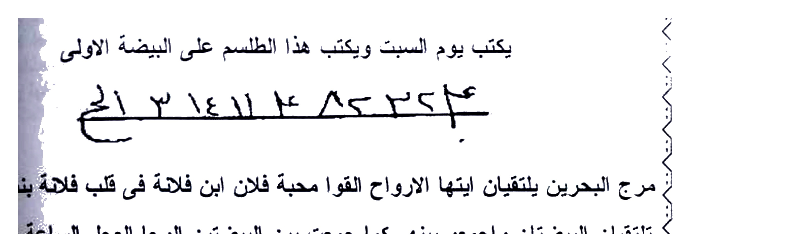
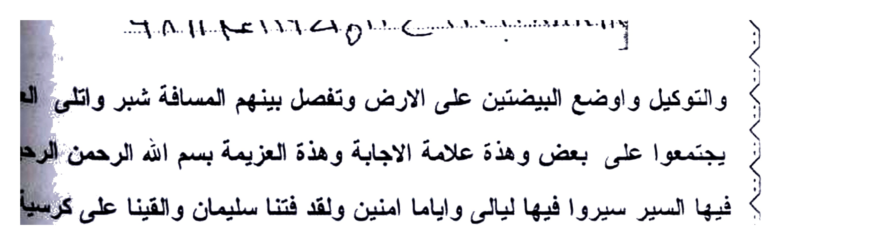
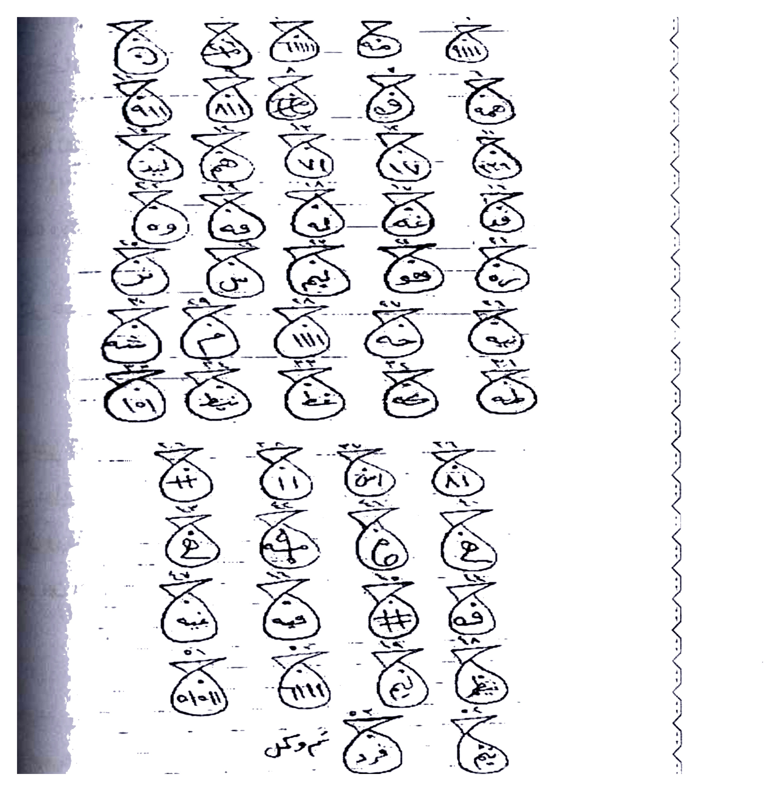
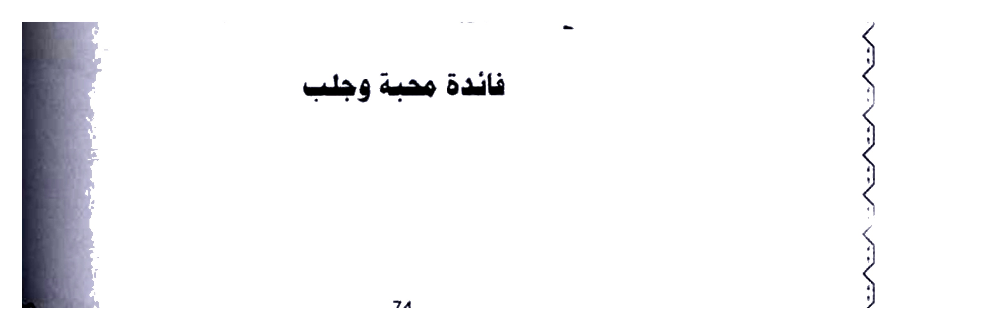
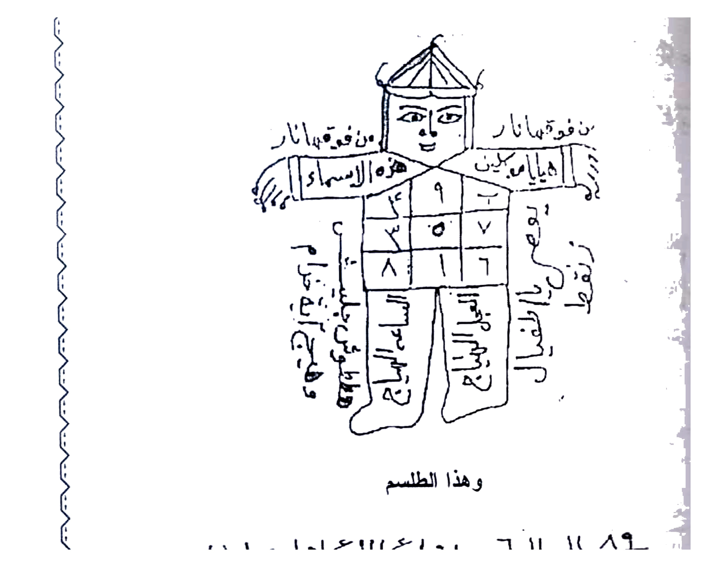
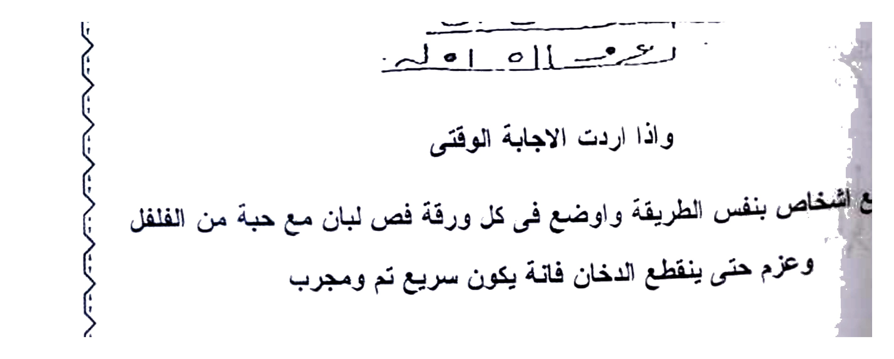
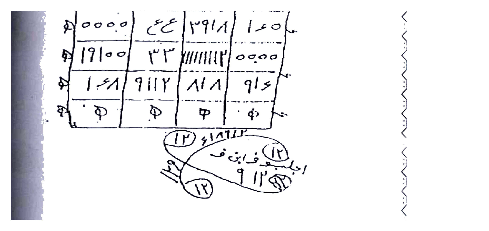
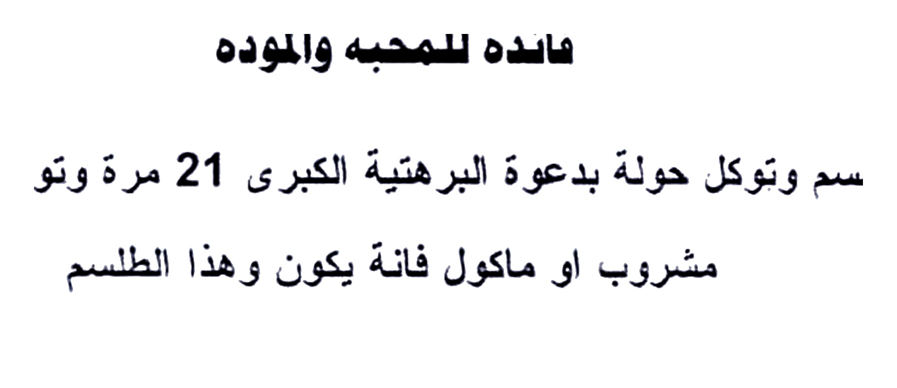

# BATCH 15 — Halaman 072–076 (Picture 036 + 037 + 038 kiri)

> **Sumber:** `Picture 036.jpg` (Hal.72 kanan + Hal.73 kiri) + `Picture 037.jpg` (Hal.74 kanan + Hal.75 kiri) + `Picture 038.jpg` (Hal.76 kanan) • 2 tingkat Arab–Indonesia • **Rajah baru: 8 crop HQ 4×** — Hal.72 atas thilasm telur1 + Hal.72 bawah angka telur2, Hal.74 ikan atas + bawah, Hal.75 figura torso + script 3 baris, Hal.76 wafaq 4×4 + loop bawah

---

### Halaman 072 — Jalb ‘ala Baydhatayn (Jלב di Dua Telur) — Wafaq Telur Sabtu + ‘Azimah Ruhaniyyah (kanan `Picture 036`)

**[Teks Arab Asli]**

وألفت بين الأرواح أسألك اللهم بسر وبسريان ودك وحبك في قلب أنبيائك وأوليائك
وأصفيائك أن تلقي ودك وحبك في قلبي وأن تلقي محبة كذا في قلب كذا كما ألقيت
الوحي على نبيك وحبيبك محمد صلى الله عليه وسلم وأن تسخر لي روحانية هذا
الشريف يا ودود وان تجعل ناصيتهم بيدي أنت على كل شيء قدير وبالإجابة قدير
يا روحانية هذا الاسم الشريف العظيم وهو بقضاء حاجتي وبلغوا
إرادتي بحق ( بلخ بلخي هملوخيم أجيبوا بحق ربا واحدا في العالمين .. تم ..

جلب على بيضتين

يكتب يوم السبت ويكتب هذا الطلسم على البيضة الاولى

٤٤٦٢٨٤ عـ ـ ٤٨١٤حـ [thilasm tangan 1 baris + garis bawah]

مرج البحرين يلتقيان ايتها الارواح القوا محبة فلان ابن فلانة في قلب فلانة بنت فلان
تلتقيان البيضتان واجمعوا بينهم كما جمعت بين البيضتين الوحا العجل الساعة ويكتب
البيضة الثانية هذا الطلسم

١١٩ ١١١ ٦٨٤ ٤٨١٩ ح ١١١م ١١٨٦ ١١٤ ١١١
١٨٨٨٠ ٩٩٩٩ ح ٤ ١١٩٥ ع ١١٨هـ ٩٨ [2 baris angka/huruf thilasm]

والتوكيل واوضع البيضتين على الارض وتفصل بينهم المسافة شبر وتتلى العزيمة
يجتمعوا على بعض وهذه علامة الاجابة وهذه العزيمة بسم الله الرحمن الرحيم وقل
فيها السير سيروا فيها ليالي واياما امنين ولقد فتنا سليمان والقينا على كرسيه جسدا
ثم أناب الى آخر الآية مجرب وصحيح

**[Terjemahan Indonesia]**

**Doa Mahabbah Agung (doa pelet halal) + Jalb pada Dua Telur (baydhah):**

Doanya: *“Ya Allah, demi rahasia dan aliran cinta-Mu yang Kau tanam di hati para nabi, wali dan kekasih-Mu, tanamkanlah cinta-Mu di hatiku, dan tanamkanlah cinta si anu (kaza) di hati si anu (kaza) — sebagaimana Kau turunkan wahyu kepada Nabi Muhammad ﷺ — dan tundukkanlah untukku ruhaniyyah (khadam) dari Nama Yang Mulia ini, wahai Ya Wadud (Maha Pengasih). Jadikanlah ubun-ubun mereka di tanganku. Engkau Maha Kuasa atas segala sesuatu dan Maha Mengabulkan. Wahai ruhaniyyah Nama Yang Mulia dan Agung ini, tunaikanlah hajatku dan sampaikanlah keinginanku, dengan hak (ฺBalakh Balkhi Hamlukhim — ajibu bi-haqqi Rabban Wahidan fil-‘Alamin)! — selesai.”*

**Jلب di Dua Telur — Sabtu:**

- **Hari Sabtu** — tulis **thilasm pertama** pada **telur pertama.**
- Laungkan *taukil*: *“Maraja al-bahrayni yaltaqiyan (QS ar-Rahman) — wahai arwah, lemparkanlah cinta si fulan bin fulanah ke hati si fulanah binti fulan. Sebagaimana dua telur ini bertemu, kumpulkanlah di antara mereka — Al-Waha Al-‘Ajal As-Sa‘ah”* — dan tulis **thilasm kedua (2 baris angka)** pada **telur kedua.**

*Gambar Rajah Asli Halaman 072 Atas — Thilasm 1 baris `٤٤٦٢٨٤ عـ ٤٨١٤ حـ` + garis bawah — tulis pada telur pertama hari Sabtu. HANYA thilasm 265K 4× putih bersih.*

*Gambar Rajah Asli Halaman 072 Bawah — 2 baris angka/huruf thilasm `١١٩ ١١١ ٦٨٤... / ١٨٨٨ ٩٩٩٩ حـ...` — untuk telur kedua. HANYA rajah 299K 4×.*

**Cara pakai:** Letakkan **dua telur di tanah** dengan **jarak satu jengkal (syibr)**, bacakan **‘azimah** di atasnya: dimulai **Basmalah + “Siiru fiha layaliya wa ayyaman aminin (QS Saba’ 18) + Wa laqad fatanna Sulaymana ... thumma anaba (QS Shad 34-35) sampai akhir ayat”** — terus baca sampai **dua telur itu bergerak mendekat dan menempel.** Itulah **tanda ijabah (terkabul).** Mujarrab dan sahih.

---

### Halaman 073 — Mahabbah & Jلب Sari‘ 11 Waraq + Fa’idah Mujarrabah Harf al-Jim 53 Waraqah (kiri `Picture 036`)

**[Teks Arab Asli]**

محبه وجلب سريع ألا جابه

تكتب الأسماء الآتية على إحدى عشر ورقة لازرق وبعد الكتابة تحرق الورقة في النار بعد
أن توضع ثلاث حبات كسبرة وثلاث حبات فلفل أبيض وقرن شطة وجزء كافور الطيار
وتعزم بما تكتب على كل ورقة وهذا ما تكتب وبه تعزم والحبوب توضع في كل ورقة
وتعزم بما تكتب على كل ورقة 11 ( العزيمة.. تمليخ 2 سليخ 2 سلسبيخ 2 ) أجب يا أحمر أنت
وأعوانك وجنودك واحرقوا قلب كذا في محبة كذا واحضروها لهذه خاضعة ذليلة مشغوفة
القلب كما تحرق أسمائك في النار عجل هيا بالحضور من غير تأخير والعمل في يوم الثلاثاء في ساعة المريخ .. تم ..

فائدة مجربة لحرف الجيم

تكتب على 53 ورقة حرف جيم ويكون ذنبها في راسها وفي وسط كل جيم طلسم هكذا
وتوكل حولة بالتهييج والجلب ثم توضع في كل ورقة حصوة لبان ذكر وتتلو سورة الجن
وتتلو على كل ورقة مرة واحدة والله الذي لا اله الا هو لارب غيره ما يتم العدد الا والمطلوب
حاضر بين يديك وهذا العمل من الاسرار وهذه الحروف والطلاسم التي تكتب في قلب
الجيم

[iklan: وسط كل جيم طلسم — tidak tampak di potongan ini, rujuk hal.74 untuk model ikan-jim]

**[Terjemahan Indonesia]**

**Mahabbah & Jلب Cepat Tanpa Jawab (Alla Jabah):**

Tulislah **nama-nama berikut pada 11 lembar kertas biru (lawraq azraq)**, setelah tulis **bakar tiap lembar di api** — setelah **letakkan di tiap lembar: 3 butir ketumbar + 3 butir lada putih + 1 cabai rawit + sedikit kapur barus yang terbang (kafur thayyar).** Lalu **‘azamkan (azimah)** dengan apa yang kau tulis pada tiap lembar — **isi azimah:**

> *“Tamlikh 2, Salikh 2, Salsabikh 2 — ajib ya Ahmar anta wa a‘wanuka wa junuduka, wa ahriqu qalba kaza fi mahabbati kaza, wa ahdhiruha hadhihi khadhi‘atan dzalilatan masyghufatal-qalbi kama tuhraqu asma’uka fin-nar — ‘ajjil hayya bil-hudhur min ghayri ta’khir” — amal **hari Selasa di jam Mirrikh (Mars).** Selesai.

Gunakan **kertas biru 11 lembar** — **bakar satu per satu,** tiap lembar **beri bumbu ketumbar+lada+cabai+kapur** — **Jلب cepat tanpa menunggu balasan.**

**Fa’idah Mujarrabah Huruf Jim (حرف الجيم) — 53 Waraq:**

Tulislah **pada 53 lembar kertas: huruf Jim (ج) dengan ekornya di atas kepalanya**, dan **di tengah setiap huruf Jim terdapat thilasm (seperti ikan/wa فaq kecil — lihat hal.74 sebagai contoh model ikan-jim).** Lalu **tawakkal (tuكل suruh khadam) di sekelilingnya untuk tahyij (menggelorakan cinta) dan jalb (menarik).** Kemudian **letakkan di tiap kertas satu kerikil luban dzakar (kemenyan jantan)**, dan **bacakan Surah al-Jinn (قُلْ أُوحِيَ إِلَيَّ)** — **bacakan pada tiap lembar satu kali.**

*Demi Allah yang tiada Tuhan selain Dia, tidak ada Tuhan lain — tidak akan sempurna hitungan (53) kecuali si target sudah hadir di hadapanmu (hadhir bayna yadayk).* Amal ini **termasuk dari rahasia (min al-asrar)**, dan huruf serta thilasm yang ditulis **di dalam perut huruf Jim** itulah kuncinya.

> **Catatan:** Model **thilasm dalam perut Jim** terlihat jelas di **Hal.74 (ikan-wa فaq 40+ simbol)** — pakai pola serupa untuk ke-53 lembar.

---

### Halaman 074 — Fā’idah Mahabbah: Wafaq Ikan-Jim 38+ Symbol & Ikan Kecil 15 Symbol (kanan `Picture 037`)

**[Teks Arab Asli]**

كتاب أسرار وخفايات في علم الروحانيات ........ شيخ الروحانيين الشيخ عطية عبد الحميد

[atas: 5 kolom × 8 baris = 40 simbol ikan-wa فaq: tiap ikan berisi `ح`, `هو`, `لا اله الا`, `ج`, `ودود`, dll. + angka ١١١١, ٨١١, ٦٩, ٣, ...]
[baris kedua: 4 kolom × 4 baris = 16 simbol ikan kecil bawah + angka ٨١, ١١, ٣٠, # , ف , ٦, ٤, ٩١١١, دم, ... + tulisan tangan `تم وكل` + `فرد` + `يم`]

فائدة محبة وجلب

**[Terjemahan Indonesia]**

**Wafaq Ikan-Jim untuk Mahabbah & Jلب (38+16 = 54 simbol ikan):**

Ini adalah **model thilasm yang disebut di Hal.73** — **huruf Jim yang perutnya berisi ikan-wa فaq.** Pada Hal.74 ditampilkan **40 simbol ikan besar di atas (5 kolom × 8 baris)** — tiap **ikan (bentuk tetes/wa فaq dengan ekor)** berisi **huruf dan angka hikmah:** `ح`, `هو` (Dia), `لا اله الا الله`, `ج` (Jim), `ودود` (Ya Wadud), `ما`, `يا`, `ب`, `٤`, `٨١١` dll. — ditambah **16 simbol ikan kecil di bawah (4 kolom × 4 baris)** berisi `٨١`, `١١`, `٣٠`, `#`, `ف`, `٦` dll.

Tulis **pola ikan-wa فaq ini** di tengah **huruf Jim ke-53 lembar** sesuai Hal.73.

*Gambar Rajah Asli Halaman 074 Atas — 40 simbol ikan-wa فaq 5 kolom × 8 baris `ح/هو/ودود/لا اله الا` + angka — model untuk isi perut Jim. HANYA rajah 1.4M 4× putih bersih (crop presisi tanpa teks sekitar).*

*Gambar Rajah Asli Halaman 074 Bawah — 16 simbol ikan kecil 4×4 + tulisan `تم وكل` — lanjutan model ikan. HANYA rajah 126K 4×.*

**Sifat khasiat:** Untuk **mahabbah dan jalb (penarik cinta)** — **ikan-wa فaq** ini adalah **rumah (bayt) bagi khadam huruf Jim** — jika ditulis lengkap 53× maka **ruhnya hadir.**

---

### Halaman 075 — الشعبان (Shabān) Figur Manusia + Thilasm 3 Baris (kiri `Picture 037`)

**[Teks Arab Asli]**

ايها الطالب النجيب تقص مثل هذا الشعبان وتكتب خلفة الطلسم مع عزيمة النار وتعزم
بيها عدد جمل المطلوب وامة فانة يكون ويدفن تحت الدفاية او بجوار فرن وهذا الشعبان

[figur: manusia bertopi `ن فوقه منار` / baju terbagi 5 kotak angka `٩ ٤ ٩ / ٣ ٥ ٧ / ٨ ١ ٦` + tulisan pinggir `من فقعه منار` `اهيا شراهيا` `هذا الاسماء` `٩٠` dll.]

وهذا الطلسم

اداع ١١ا ع ١١ا اداع اول ويا حاط
رهـاديم ١٠ا طلع ١١ا عـ
رعوم ١١ا ١١ا له

واذا اردت الاجابة الوقتي قص سبع اشخاص بنفس الطريقة واوضع في كل ورقة فص لبان مع حبة من الفلفل وعزم حتى ينقطع الدخان فانة يكون سريع تم ومجرب

**[Terjemahan Indonesia]**

**Shabān (Gambar Manusia Bonéka) untuk Mahabbah:**

*“Wahai murid yang cerdas, guntinglah (qussha) seperti **bentuk sha‘ban (figur manusia)** ini, dan **tulislah di belakangnya thilasm beserta ‘azimah api (النار)** — lalu **‘azamkanlah sebanyak hitungan jumlah huruf (jummal) dari nama yang dituju beserta nama ibunya — maka akan terjadi. Dan kuburlah (idfin) di bawah pemanas (dafayah) atau di dekat tungku (furn) — dan inilah (gambar) sha‘ban itu:”*

**Deskripsi Figur (الشعبان):**
- **Kepala bertopi mengerucut** bertulis `ن فوقه منار` (huruf nun di atas menara).
- **Badan berbaju kotak 3×3 angka** mirip wafaq: `٩ ٤ / ٣ ٥ ٧ / ٨ ١ ٦` — **pusat ٥**.
- **Tangan kanan memegang perisai** bertulis `من فقعه منار` — **tangan kiri** `اهيا شراهيا`.
- **Kaki kanan** bertulis `نقش خاتم سليمان` — **kaki kiri** `أجب يا ...` — **pinggir tubuh** `هذا الأسماء` + `٩٠`.

*Gambar Rajah Asli Halaman 075 Atas — Figur Sha‘ban manusia bertopi + baju wafaq 3×3 + tulisan Arab sekeliling. HANYA rajah 545K 4× putih bersih (crop presisi tanpa heading sekitar).*

**Thilasmnya (3 baris di bawah figur):**

> *“Idā‘ 11A ‘a 11A Idā‘ awwal wa ya Hat ... / Ruhadim 10A thala‘a 11A ‘a / Ra‘um 11A 11A lahu”*

*Gambar Rajah Asli Halaman 075 Bawah — 3 baris thilasm tulisan tangan `اداع ١١ا ع...` — untuk di belakang Sha‘ban. HANYA rajah 246K 4×.*

**Jika ingin ijabah lebih cepat:** **Gunting 7 figur manusia dengan cara sama,** **letakkan di tiap kertas sepotong luban + satu biji lada**, lalu **‘azamkan sampai asap terputus — maka akan cepat terjadi.** Mujarrab.

---

### Halaman 076 — Fa’idah Jلب — Qalb Dhāni (Jantung Domba) + Wafaq 4×4 + Loop + Barhatiyyah 21× (kanan `Picture 038`)

**[Teks Arab Asli]**

فائدة جلب

تحضر قلب ضاني من الغنم الذكر له قلب كبش والانسى لها قلب نعجة
ويكتب هذا الوفق بالطلسم ويوضع في القلب ويوضع على نار هادئة وتعزم عليه الى
النار حتى يأتي المطلوب تانة امامك واصارفة ياكل المطلوب منة يفوق في ساعتة
الوفق والطلسم

[Wafaq kotak 4×4: baris1 `٥٥٥٥ ع ع ٢٩١٨ ١٤٥٠` — baris2 `١٩١٥٥ ٣٣ ١١١١١١٢ ٥٥٥٥` — baris3 `١٤٦١ ٩١١٢ ٨١٨ ٩١٤` — baris4 `Φ Φ Φ Φ` ]
[Loop bawah: oval `١٢ ١٤٦١٢ اجلب فلان فـ ٩١٢` + lingkaran `١٢` tiga kali]

فائدة للمحبة والمودة

تكتب هذا الطلسم وتوكل حولة بدعوة البرهتية الكبرى 21 مرة وتوضع للمطلوب في
مشروب او ماكول فانة يكون وهذا الطلسم

آآت٥٥٠ ٥ ٣٠٩٢ ٧١٩١ ظ آ له آ له آ له ٣ ٣ ٣
آ١٥٥٥ ٥ ٣ ٥ ٧ ٤ ٩ ٢ ٣ ٣٣ م م م ٣ آ ٨١٦

**[Terjemahan Indonesia]**

**Fa’idah Jلب dengan Jantung Domba (Qalb Dha’ni):**

*Hadirkanlah **jantung domba jantan (qalbu dha’ni)** — yang jantan memiliki jantung kambing jantan (kabsh), yang betina jantung domba betina (na‘jah).* — **Tulislah wafaq beserta thilasm berikut, dan letakkan di dalam jantung itu.** **Letakkan jantung itu di atas api yang tenang (nar hadi’ah — lilin kecil), dan baca ‘azimah di atasnya di dekat api — sampai si target datang berlari di hadapanmu (ta’ni amamak).** — **Dan untuk memalingkannya (sharaf), makanlah sebagian dari jantung itu — maka si target akan pingsan/faint di jamnya (yafuqu fi sa‘atihi).*

**Wafaq & Thilasmnya:**

Wafaq **4 kolom × 4 baris** (16 petak) — baris atas `٥٥٥٥ | ع ع | ٢٩١٨ | ١٤٥٠` — baris kedua `١٩١٥٥ | ٣٣ | ١١١١١١٢ | ٥٥٥٥` — baris ketiga `١٤٦١ | ٩١١٢ | ٨١٨ | ٩١٤` — baris keempat `Φ Φ Φ Φ` (empat simbol phi). Di bawah wafaq ada **loop oval** bertulis `١٢ ١٤٦١٢ اجلب فلان فـ ٩١٢` dengan **3 lingkaran kecil `١٢`.**

*Gambar Rajah Asli Halaman 076 Atas — Wafaq 4×4 + loop oval `اجلب فلان` — untuk jantung domba di atas api tenang. HANYA rajah 433K 4× putih bersih.*

*Gambar Rajah Asli Halaman 076 Tengah — Loop detail `١٢ اجلب فلان فـ` — perbesar wafaq atas. HANYA rajah 119K 4×.*

**Fa’idah Mahabbah & Mawaddah (cinta kasih):**

Tulislah **thilasm ini, tawakkal (suruh khadam) di sekelilingnya dengan Da‘wah al-Barhatiyyah al-Kubra 21 kali**, lalu **letakkan pada makanan/minuman target — maka akan terjadi.** Thilasmnya:

> *“A A T 550 5 3092 ... Dza A Lahu A Lahu 333 / A 1555 5 3 5 7 4 9 2 33 MMM 3 A 816”*

*— 2 baris angka/huruf bawah —* tulis persis seperti gambar.

*Next Batch 16 Hal.077–081 (Picture 038 kiri Hal.77 + Picture 039 Hal.78–79 + Picture 040 Hal.80–81) AUTO.*

