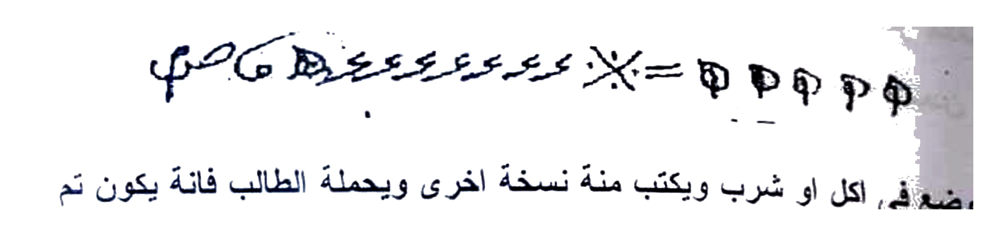
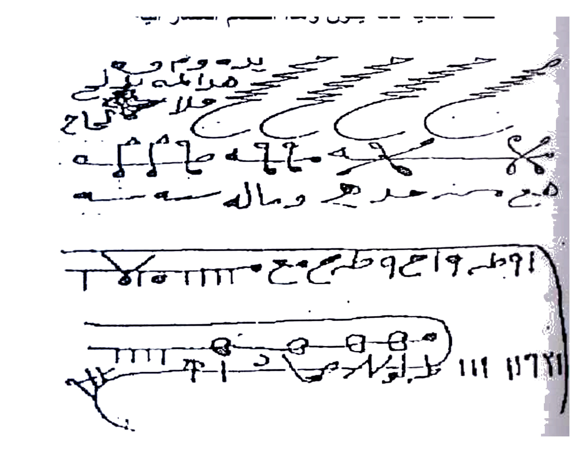
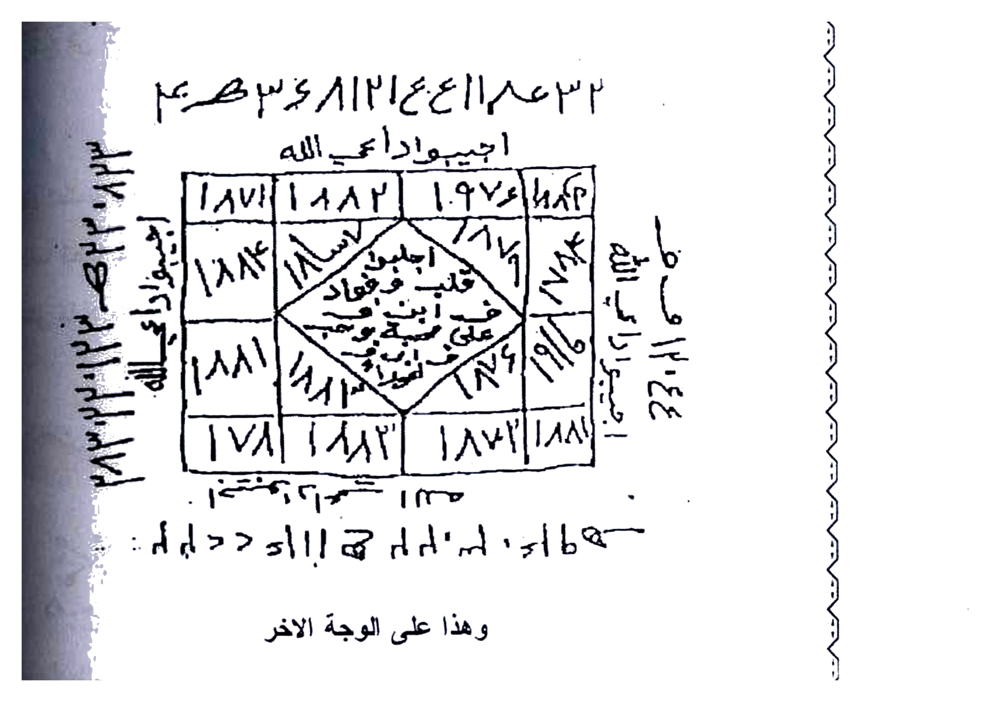
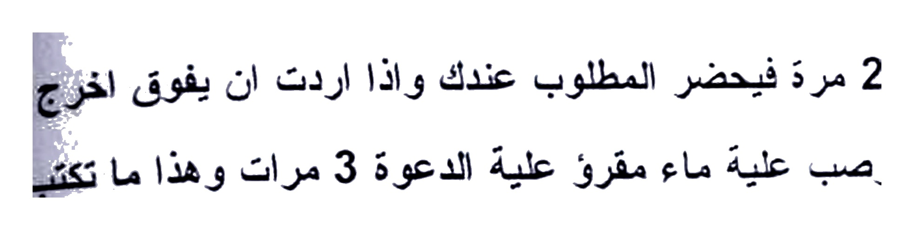
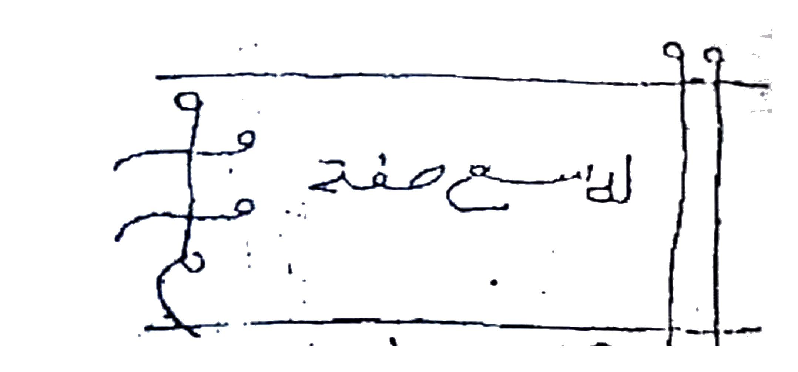
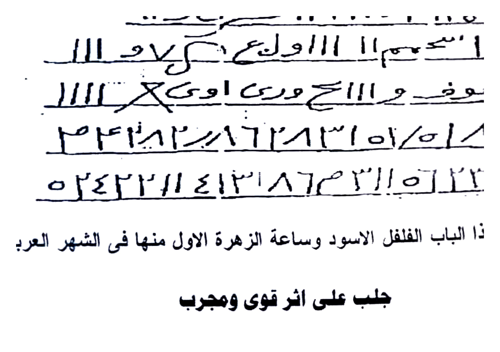
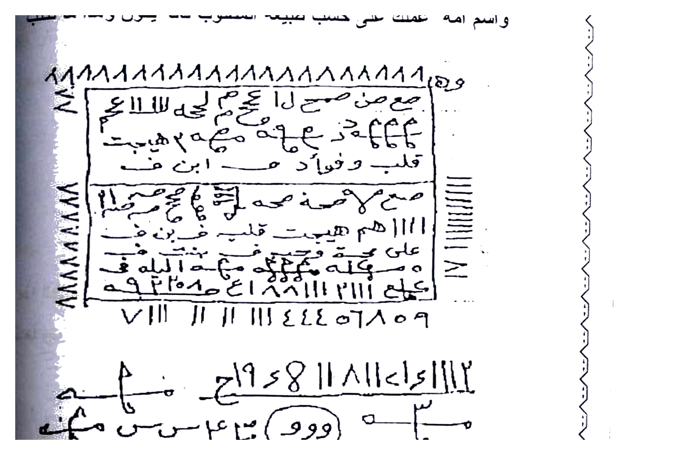
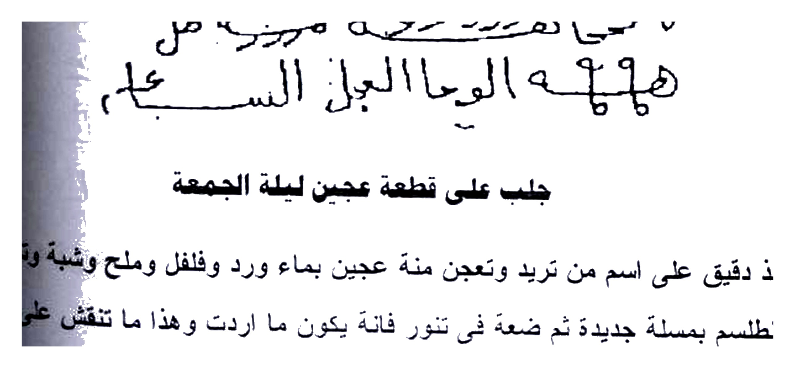
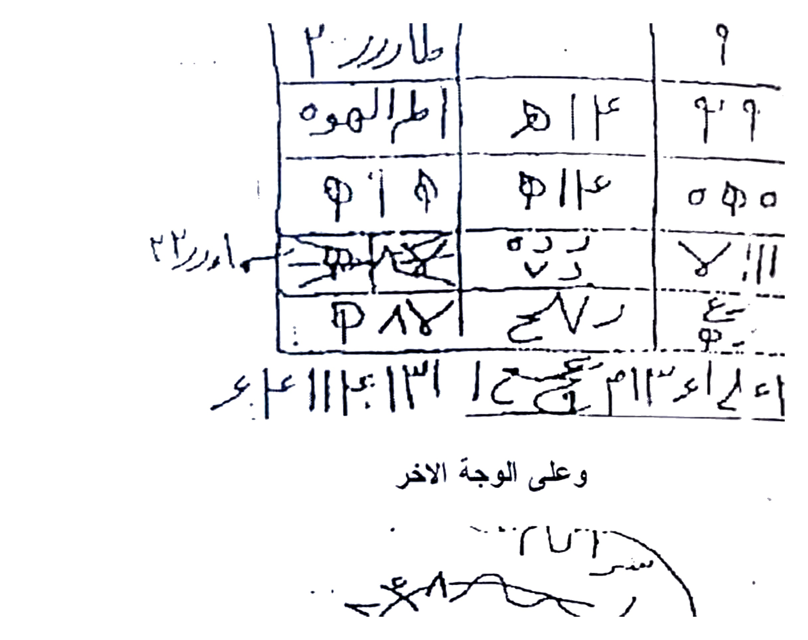
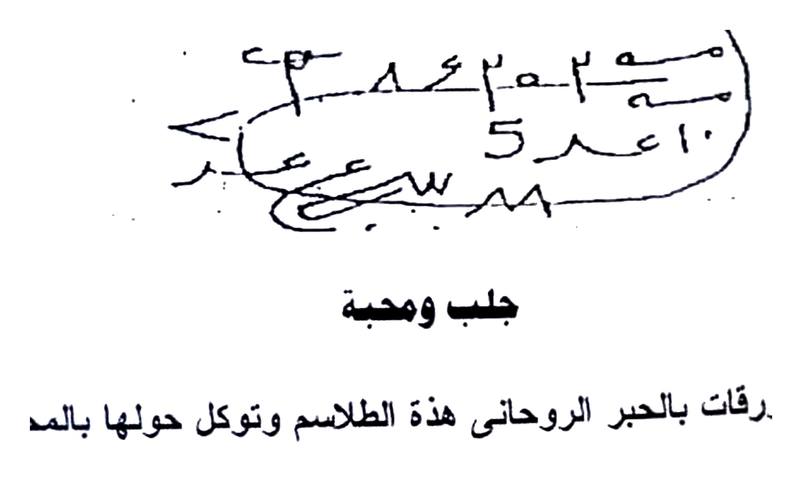

# BATCH 16 — Halaman 077–081 (Picture 038 kiri + 039 + 040)

> **Sumber:** `Picture 038.jpg` (Hal.77 kiri) + `Picture 039.jpg` (Hal.78 kanan + Hal.79 kiri) + `Picture 040.jpg` (Hal.80 kanan + Hal.81 kiri) • 2 tingkat Arab–Indonesia • **Rajah baru: 9 crop HQ 4×** — Hal.77 atas thilasm + Hal.77 bawah script 2 baris, Hal.78 wafaq diamond + script, Hal.79 atas thilasm + Hal.79 bawah 5 baris, Hal.80 atas box + Hal.80 bawah script, Hal.81 atas wafaq + Hal.81 bawah ovals

---

### Halaman 077 — Thilasm Jalil & Mahabbah Dam Hamamah (kiri `Picture 038`)

**[Teks Arab Asli]**

توكلو وافعلو ما امرتكم بة بحق هذا الطلسم الجليل واحرق قلب فلان بالمحبة القاطعة الى
فلان بحق وما تلوتة عليكم وبحق هذا الطلسم

ΦΦΦΦ = ط ص ط ص مع ع مع ع ص م ح ص مع ع م ص صص [1 baris thilasm atas]

ويوضع فى اكل او شرب ويكتب منة نسخة اخرى ويحملة الطالب فانة يكون تم

فائدة للمحبة والتطهيج

يكتب هذا الطلسم بدم حمامة بيضاء على اثر المطلوب ويبخر وتعزم بقسم الشمهورشى
وهو يكتبنيا ايضا بقسم الاقسام وتعلق هذا الاثر في الهواء اتجاء شرق فان لم يتوفر الاثر
يكتب على كاغد مصبوغ اصفر ويكتب بالزعفران ويبخر بالفلفل والشبة اليمنى ويدفن
تحت الدفاية فانة يكون وهذا الطلسم المشار الية

[scribble 3 baris melengkung + simbol `×` ~ `هـ ٧`]

طه طسم ١٩ ع ٩ طسم ح ٥١١١ ح مـ ـ ٩٥١١٩
١١١ ١١٦٧١ طـ ـ حـ ـ ط ١١١١٢ ١١٣ ١١١ ٨٢ [2 baris bawah + oval]

**[Terjemahan Indonesia]**

**Thilasm Jalil (Agung) — Mahabbah Qathi‘ah:**

*“Wakilkan, laksanakan apa yang kuperintahkan dengan hak thilasm yang agung ini, dan bakar hati si anu dengan cinta yang memutus kepada si anu, dengan hak apa yang telah kubacakan atas kalian dan hak thilasm ini.”*

Thilasmnya: `ΦΦΦΦ = ط ص ط ص...` (lihat Rajah atas — 1 baris dengan `=×`).

**Cara pakai:** Letakkan pada **makanan/minuman**, tulis **salinan kedua dan dibawa thalib — maka jadi.**

**Fa’idah Mahabbah & Tahyij dengan Darah Merpati Putih:**

Tulislah **thilasm ini dengan darah merpati putih (dam hamamah baydha’) pada atsar (bekas pakaian/rambut) si target**, **asapi dan baca qasam Syamhurisyi (Syamhurisy) — juga ditulis dengan Qasam al-Aqsam — lalu gantung atsar itu di udara menghadap timur.**

*Jika atsar tidak ada,* tulislah **pada kertas yang dicelup kuning, tulis dengan za‘faran (safron), asapi dengan lada dan tawas Yaman — lalu kubur di bawah penghangat (dafayah) — maka jadi.** Thilasm yang dimaksud (lihat Rajah bawah — 3 baris melengkung + 2 baris angka).

*Gambar Rajah Asli Halaman 077 Atas — Thilasm `ΦΦΦΦ = ط ص...` — untuk mahabbah qathi‘ah makanan/minuman. 164K 4× putih.*

*Gambar Rajah Asli Halaman 077 Bawah — 3 baris scribble + 2 baris `طه طسم 19 ع 9... / 111 11671` — untuk hamamah Yaman dafayah. 547K 4×.*

---

### Halaman 078 — Jalb & Hudhur ‘ala Ma‘dan (Logam) — Da‘wah Mirrikh 21× (kanan `Picture 039`)

**[Teks Arab Asli]**

فائدة جلب وحضور على معدن

تكتب هذا الطلسم على وجهة والوفق والتوكيل على الاخرى وتوضعة فى نار هادئة وتوكل
بدعوة المريخ 21 مرة فيحضر المطلوب عندك واذا اردت ان يفوق ان يفوق اخرج المعدن من
وصب علية ماء مقروء علية الدعوة 3 مرات وهذا ما تكتب

٣٢ م ع ٣٣ ١١٤ ع ٤ ١٢١٨ ع ٣ هـ ط ع م
اجيبو وداعي الله

[wafaq 4×4 besar dengan diamond tengah: sudut `١٨٧١ ١٨٨٢ ١٩٧٤ ١٨٤٣` + tengah `قلب فواد على حب ... قلب فواد` + tulisan keliling `هذا على الوجه الاخر` + sisi `يا حي يا قيوم` `٣٣ ١١` + bawah `١٧٨١ ١٨٨٣ ١٨٧١ ١٨٨١` + loop `بخ ٣... اجلب...`]

وهذا على الوجة الاخر

[loop bawah + 2 baris `اجلب فلان ...`]

**[Terjemahan Indonesia]**

**Jلب & Kehadiran di atas Logam (Ma‘dan):**

Tulislah **thilasm ini pada satu sisi logam, dan wafaq + tawkil pada sisi lain — letakkan di api tenang (nar hadi’ah) dan baca Da‘wah al-Mirrikh (Mars) 21 kali — maka si target akan hadir di sisimu.**

*Jika ingin sihirnya hilang (yafiqu), keluarkan logam dari api dan tuangkan air yang telah dibacakan doa 3 kali.*

Thilasmnya: `٣٢ م ع ٣٣ ١١٤...` (baris angka atas). Kemudian **wafaq persegi 4×4 besar dengan diamond (belah ketupat) di tengah** berisi `١٨٧١ ١٨٨٢ ١٩٧٤...` di sudut, **tengah diamond bertulis** `اجيبو وداعي الله قلب فواد على حب ...` (lihat Rajah). Di sisi tertulis `يا حي يا قيوم` + `وهذا على الوجه الآخر` (balik logam).

*Gambar Rajah Asli Halaman 078 — Wafaq 4×4 + diamond `قلب فواد` + angka `١٨٧١ ١٨٨٢ ١٩٧٤ ...` — untuk logam di api tenang Mirrikh 21×. 837K 4× putih bersih.*

*Gambar Rajah Asli Halaman 078 Atas — 1 baris `٣٢ م ع ٣٣ ١١٤...` — thilasm atas wafaq. 113K 4×.*

*Gambar Rajah Asli Halaman 078 Bawah — Loop `بخ ٣...` + `اجلب فلان` — sisi balik logam. 36K 4×.*

---

### Halaman 079 — Jalb ‘ala Sham‘ah Iskandaraniyyah — ‘Ifrit 21× (kiri `Picture 039`)

**[Teks Arab Asli]**

للمسع صحة
٨ وو / ٥٥١ ٠٥ طم لام [thilasm 1 baris dalam kotak]

جلب على شمعة اسكندرانى

يكتب هذا الطلسم على اثر المطلوب ونكتية ايضا على الشمعة وتجعل الاثر فتيلة للشمعة
وتوقدها وتعزم عدد اسم المطلوب واسم امه بالجمل فاتة غاية العزيمة هذة الاية قال
عفريت من الجن الى اخرها وهذا الطلسم المشار الية

١٦ ١٨م٩١ ١١٨ س ك / ن و ١١ ... ١١ اا سع ١١ اا وم ك ١١١ ... عطوف و رى اوى ١١١ ... ٢٤٤ ١٢ س ٦١٢ ٣١ ٥١٨ ١٢ / ٥٤٤ ٢١١ ٤١٣ ٨٦ ٣١١ ٥ ٣٣١ [5 baris angka bawah]

وبخورك فى هذا الباب الفلفل الاسود وساعة الزهرة الاول منها فى الشهر العربى تم

جلب على اثر قوى مجرب

**[Terjemahan Indonesia]**

**Jلب di Lilin Iskandariah:**

Thilasm atas dalam kotak: `٨ وو / ٥٥١ ٠٥ طم... للم سع صحة` (lihat Rajah atas).

Tulislah **thilasm ini pada atsar target, ukir juga pada lilin (sham‘ah Iskandariyyah), jadikan atsar sebagai sumbu lilin — nyalakan dan baca azimah sebanyak hitungan jummal nama + ibu target — puncaknya adalah ayat** `قَالَ عِفْرِيتٌ مِّنَ الْجِنِّ أَنَا آتِيكَ بِهِ قَبْلَ أَن تَقُومَ مِن مَّقَامِكَ...` (QS Naml 39) **sampai akhir.**

Thilasmnya (5 baris angka): `١٦ ١٨م٩١ ١١٨... / ...عطوف و رى اوى... / ٢٤٤ ١٢...` — tulis persis.

Bukhur: **lada hitam**, **jam Zuhrah pertama bulan Arab.** Selesai. **Jلب atsar kuat mujarrab.**

*Gambar Rajah Asli Halaman 079 Atas — Kotak `للمسع صحة ٨ وو / ٥٥١ ٠٥ طم لام` — untuk sham‘ah Iskandariyyah. 147K 4×.*

*Gambar Rajah Asli Halaman 079 Bawah — 5 baris `١٦ ١٨م٩١ ١١٨... / عطوف... / ٢٤٤ ١٢...` — thilasm lilin. 393K 4×.*

---

### Halaman 080 — Jalb ‘ala Athar: Buruj Haraq + ‘Ajinah Jum‘ah — Hibr Ruhaniyyah (kanan `Picture 040`)

**[Teks Arab Asli]**

يكتب على الاثر هذة الطلسم وحولة سورة البروج الى حريق وبه تعزم عدد جمل المطلوب
واسم امه عملك على حسب طبيعة المطلوب فانة يكون وهذا ما تكتب

١١١١١١١١١١١١١١١١١١١١١١١١١١ [baris angka atas: `١١١١...١٠`]

ص ح ص م ا ع ص م ع ل ح ي ل مـ ١١١١ ع م [baris 1: `ص ح ص م ا ع... / ح ي ل...`]
ع ع مـ ٦٦٤ م ع مـ ٦٦٤ ز ح مـ ٢ هـ بيت [baris 2: `ع ع مـ ٦٦٤... / هـ بيت`]
قلب وفؤاد م ابن ف [baris 3: `قلب وفؤاد م ابن ف`]
ص ح ص مـ صـ ح صـ م ع صـ م ع ل ح ي [baris 4: `ص ح ص مـ...`]
١١١١ هم هيبت قلب فى ر ف [baris 5: `١١١١ هم هيبت...`]
على حجة وتوفيق مـ ـع الله قه [baris 6: `على حجة وتوفيق...`]
اعتله اع ١٨١١١ ٢١١١ عـ هـ هـ هـ [baris 7: `اعتله اع ١٨١١١...`]
٧١١١ ١١ ١١ ١١١٤٤٤ ٥٦٨٥٩ [baris 8: `٧١١١...٥٦٨٥٩`]

٢ ١١١٢ وا ١١٨١١ ٤٩ ٦١١ حـ مـ هـ [baris bawah 1: `٢ ١١١٢ وا... حـ مـ`]
س وو ١٤ ع س م ٣٨ مـ ـ مه [baris 2: `س وو ١٤... مه`]
٧ لمسا هورد عمره مرزه ط ل [baris 3: `٧ لمسا هورد... ط ل`]
هلل ه الوحا العجل الساع [baris 4: `هلل ه الوحا العجل الساع`]

جلب على قطعة عجين ليلة الجمعة

تاخذ دقيق على اسم من تريد وتعجن منة عجين بماء ورد وفلفل وملح وشية وتنقش
الطلسم بمسلة جديدة ثم ضعة فى تنور فانة يكون ما اردت وهذا ما تنقش على العجين

الاول

[bersambung Hal.81 table atas]

**[Terjemahan Indonesia]**

**Jلب di Bekas: Buruj sampai “Hariq (Terbakar)” + Adonan Malam Jum‘at:**

Tulislah **pada atsar: thilasm ini + kelilingnya Surah al-Buruj (وَالسَّمَاءِ ذَاتِ الْبُرُوجِ... حَرِيقِ) — baca azimah sejumlah jummal nama + ibu — amalmu disesuaikan tabi‘at target (nari/turabi/hawa’i/ma’i) — maka jadi.**

Isi thilasm (box 8 baris): `ص ح ص م ا ع... / ع ع مـ ٦٦٤... / قلب وفؤاد... / ١١١١ هم هيبت... / على حجة وتوفيق... / اعتله اع ١٨١١... / ٧١١١...` + **1 baris angka atas `١١١١...`** (lihat Rajah atas).

Baris bawah (4 baris): `٢ ١١١٢ وا... / س وو ١٤... / ٧ لمسا هورد... / هلل ه الوحا العجل...` (lihat Rajah bawah).

**Jلب di Adonan Tepung Malam Jum‘at:**

Ambillah **tepung atas nama yang dituju, uleni jadi adonan dengan air mawar + lada + garam + shayyah (minyak samin) — ukir thilasm dengan paku baru — letakkan di tungku pemanggang (tannur) — maka akan jadi apa yang kau inginkan.** Dan inilah **ukiran pada adonan pertama** — bersambung di Hal.81 tabel atas.

*Gambar Rajah Asli Halaman 080 Atas — Box 8 baris `ص ح ص م... / ع ع مـ ٦٦٤... / قلب وفؤاد... / ١١١١ هم هيبت...` + angka `١١١١...` — untuk atsar + Buruj hariq. 838K 4× putih.*

*Gambar Rajah Asli Halaman 080 Bawah — 4 baris `٢ ١١١٢ وا ١١٨... / س وو ١٤... / لمسا هورد... / الوحا العجل` — lanjutan thilasm atsar. 323K 4×.*

---

### Halaman 081 — Wafaq ‘Ajinah + 2 Ovals + 7 Waraq Yasin — Hibr Ruhaniyyah (kiri `Picture 040`)

**[Teks Arab Asli]**

طارر٢ | | ٩
اطلاموه | ٥١٤ | ٢٩
٩١ ٩ | ٩١١٤ | ٥ ٩٥
امرر٢ | خ | لا ١١١
٨٧ ٩ | ع ٧ ر | |
٤٣ ١٣م ١١٤ ١٣ م ١١١ ع ٤٣ [baris bawah angka]

وعلى الوجة الاخر

[2 ovals scribble: oval atas `٢٨٦... سطر... ٨٥٠` + oval bawah `م ٨٤ ٢٥٢٠ مـ ٥ ٨٠ ١٠ عدد ...`]

جلب ومحبة

يكتب على سبع ورقات بالحبر الروحانى هذة الطلاسم وتوكل حولها بالمحبة فانة يكون
وتكون ساعة سعيدة وتعزم عليها بسورة يس 21 مرة وعند كل مبين توكل وبخورك كل
ذى رائحة طيبة ورصد مناسب

ذى رائحة طيبة ورصد مناسب

**[Terjemahan Indonesia]**

**Lanjutan ‘Ajinah (Adonan) — Hal.80-81:**

Tabel wafaq **3 kolom × 5 baris** di atas: `طارر٢ | ٩ / اطلاموه | ٥١٤ | ٢٩ / ٩١ ٩ | ٩١١٤ |...` + baris angka bawah `٤٣ ١٣م ١١٤...` (lihat Rajah atas) — **ukiran pada adonan malam Jum‘at yang dimasukkan tannur.**

**Sisi balik (وعلى الوجه الآخر):** **2 oval scribble** berisi `٢٨٦...` + `م ٨٤ ٢٥٢٠ مـ... ١٠ عدد` (lihat Rajah bawah) — juga untuk adonan.

**Jلب & Mahabbah 7 Waraq — Hibr Ruhaniyyah:**

Tulislah **pada 7 lembar kertas dengan tinta ruhaniyyah (hibr ruhaniyyah — za‘faran + misk): thalasim ini, tawakkal (suruh khadam) di sekelilingnya dengan mahabbah — maka akan jadi.** **Waktunya jam yang bahagia (sa‘ah sa‘idah), baca azimah dengan Surah Yasin 21 kali — pada setiap “mubin (مُبِين)” (7 tempat dalam Yasin) baca tawkil — bukhur tiap yang berwangi (dza ra'ihah thayyibah) dan rashi yang cocok (rashad munasib).**

*Memakai wangi dan rashi yang harum — cocok untuk cinta.*

*Gambar Rajah Asli Halaman 081 Atas — Tabel `طارر٢ ٩ / اطلاموه ٥١٤ ٢٩ / ٩١٩ ٩١١٤ ٥٩٥ ...` + angka `٤٣ ١٣م ١١٤...` — untuk ‘ajinah Jum‘at tannur. 441K 4× putih.*

*Gambar Rajah Asli Halaman 081 Bawah — 2 oval `٢٨٦ سطر ٨٥٠... / م ٨٤ ٢٥٢٠ مـ...` — sisi balik ‘ajinah. 178K 4×.*

*Next Batch 17 Hal.082–086 (Picture 041 Hal.82–83 + 042 Hal.84–85 + 043 Hal.86) AUTO 1 menit.*

