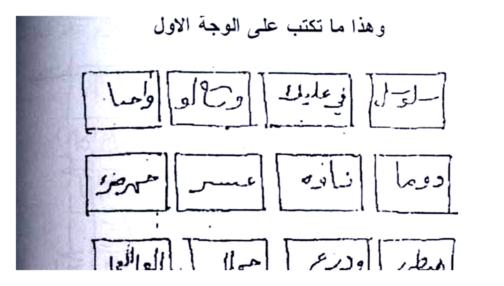
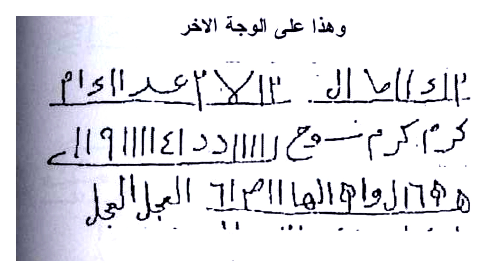
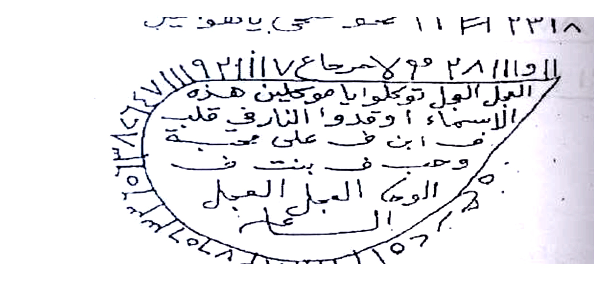
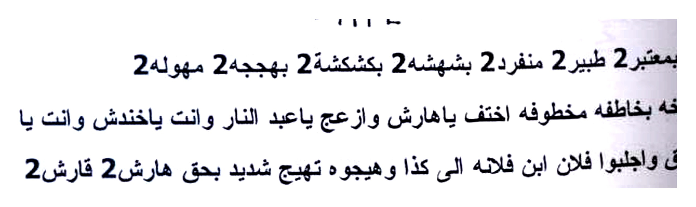
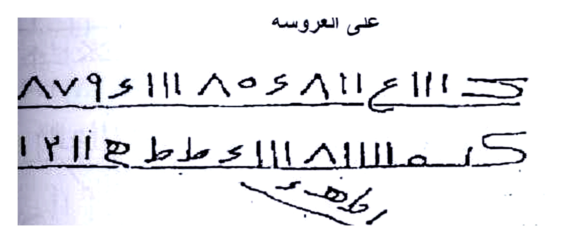
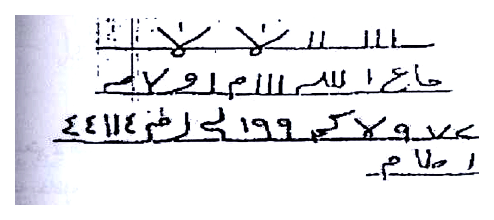
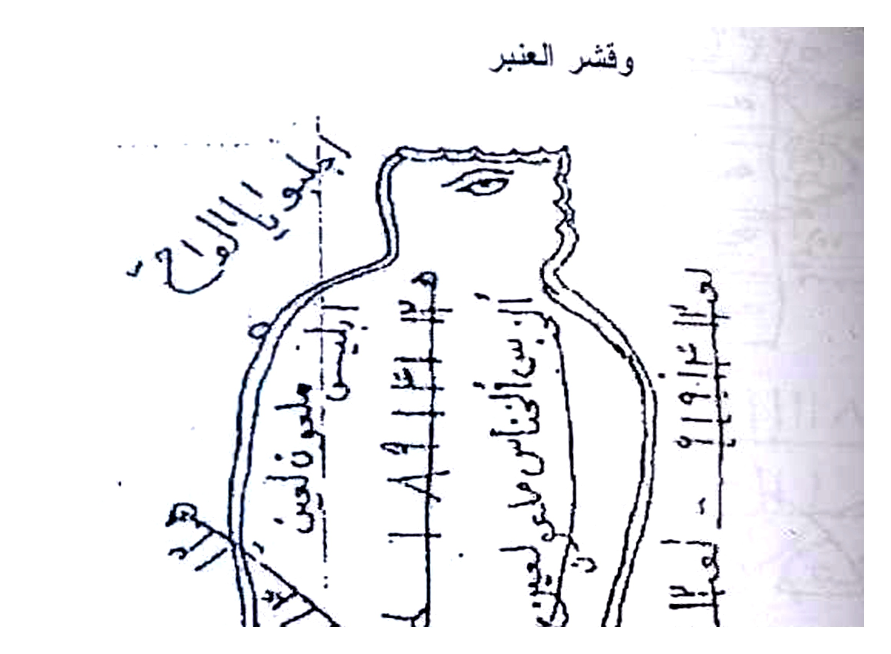
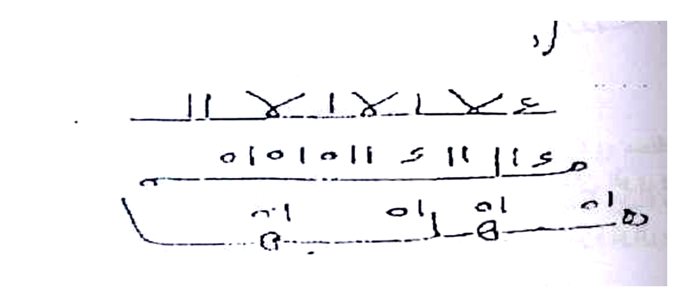
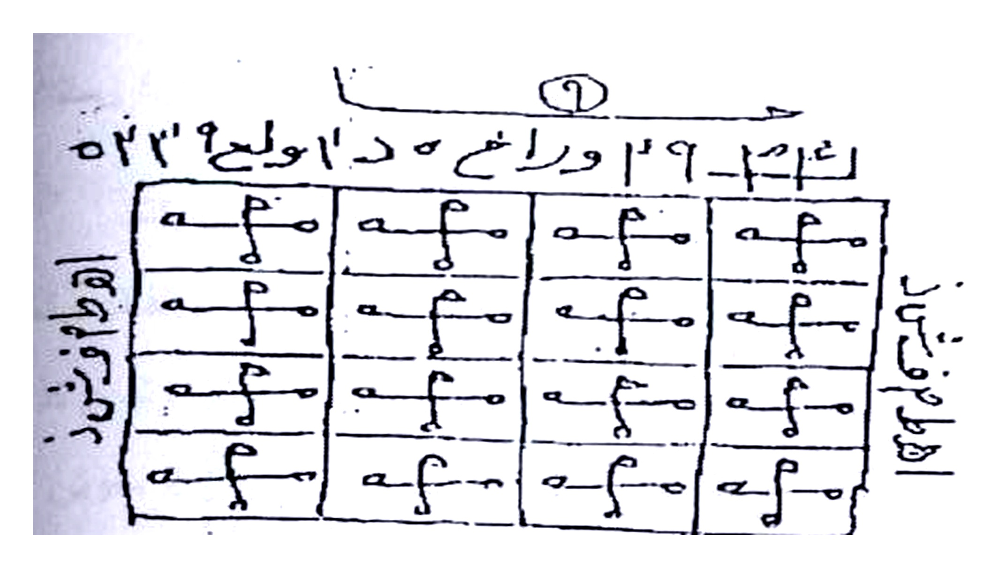
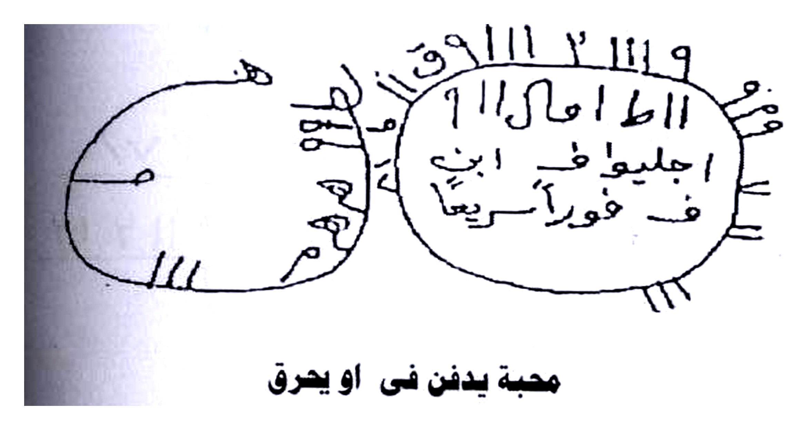

# BATCH 17 — Halaman 082–086 (Picture 041 + 042 + 043 kanan)

> **Sumber:** `Picture 041.jpg` (Hal.82 kanan + Hal.83 kiri) + `Picture 042.jpg` (Hal.84 kanan + Hal.85 kiri) + `Picture 043.jpg` (Hal.86 kanan) • 2 tingkat Arab–Indonesia • **Rajah baru: 10 crop HQ 4×** — Hal.82 atas 12 kotak + bawah 3 baris, Hal.83 atas oval + bawah 3 baris, Hal.84 atas 2 baris + bawah block, Hal.85 figur + script, Hal.86 atas grid + bawah 2 oval

---

### Halaman 082 — Mahabbah 12 Kotak & 3 Baris — Wajah Awwal (kanan `Picture 041`)

**[Teks Arab Asli]**

وهذا ما تكتب على الوجة الاول

سرور في عليك وتاو واما
دوما نزايه عمسر همررو
هطر ودريع هملا الجوالبل

وهذا على الوجة الاخر

٢ ١٢ ال١٣ ٢عد ١١ام
كرم كرم سـ ـمع ١١١ دد ١١١١٤ ١١٩
هـ ٦٤ه والهـا ١١٣م العجل العجل

(( محبه وجلب ))

إذا أردت العمل به فاكتب الاسماء الآتية على اثر المطلوب ويكون عملك يوم الجمعة
محل خالى من الناس على طهارة كامله واعمل الاثر فتيلة وأوقده في زيت مثل
واتلى عليه السورة الف واثنين مرة وكل مائه
تقول توكل يا عبد الرحمن ويا عبد الواحد ويا عبد الصمد بجلب كذا وكذا وأيضا
بعد الا ثنين بحق ما تعتقذونه من هذه السورة الشريفة العظيمة فصما ثم العدد الى

**[Terjemahan Indonesia]**

**2 sisi kertas (Wajh Awwal & Akhir) — 12 kotak + 3 baris angka:**

*Sisi pertama* 12 kotak: `سرور في عليك / تاو واما / دوما نزاية عمسر همررو / هطر ودريع هملا الجوالبل` — *sisi lain* 3 baris: `٢ ١٢ ال... ٢عد / كرم كرم سمع... ١١١١٤ ١١٩ / هـ ٦٤ه والها... العجل العجل` (lihat Rajah).

**Mahabbah & Jalb Jum‘at:**

Tulislah **asma berikut pada atsar**, **kerja hari Jum‘at di tempat sepi suci** — **jadikan atsar sumbu, nyalakan di minyak** — baca **Surah (Al-Fatihah?/Yasin?) 1002× (1000+2) tiap 100 tawkil:** *“Tawakal ya ‘Abd ar-Rahman, ya ‘Abd al-Wahid, ya ‘Abd as-Shamad bi-jalbi kaza...”* hingga genap 1002.

*Gambar Rajah Asli Halaman 082 Atas — 12 kotak `سرور وز ...` — wajah awwal Jum‘at. 303K 4× putih.*

*Gambar Rajah Asli Halaman 082 Bawah — 3 baris `٢ ١٢ ال... / كرم كرم... / هـ ٦٤ه...` — wajah akhir. 292K 4×.*

---

### Halaman 083 — Mahabbah Shurb (Minuman) & Oval Muqla + Tahyij Harsy (kiri `Picture 041`)

**[Teks Arab Asli]**

والمطلوب حاضر بين يديك وهذا ما تكتب على اثر المطلوب (( مطمطمش 2 قطش 2
مطوش 2 عليوش 2 هلهيوش 2 )) توكل يا عبد الرحمن ويا عبد الواحد
ويا عبد الصمد بجلب كذا وكذا وكذا الوحا العجل الساعة ..

فائدة محبة شرب

اكتب هذه الاسماء فى ورقة وتمحى فى ماء وتسقى للمطلوب وهذه ماتكتبه

٩ و س ٣ه و ا و صح
٣٨ ع ه و ف هـ ٩ ه صـ
٨ ٢٣١٨ م ح صـ ٢٢ صـ مـ حـ مـ يـل

[oval besar: `٢١١٧ع ٩٢١١١ سـ حـ مـ ٩ ٢٨ ١١ا ... العجل الجل توكلو يا موكلين هزه الاسماء وقدوا` + pinggir `ف بنت على طب ... وصبح بنت على ...` + bawah `الوسطى الدبل العمل`]

بمعتبر 2 طير 2 منفرد 2 بشهشه 2 بكشكشه 2 بهججه 2 مهوله 2
تاجته منوخه بخاطفه مخطوفه اختفت ياها رش وازعج ياعبد النار وانت ياخدتش وانت يا
برع وبابريق واجلبوا فلان ابن فلانه الى كذا وهيجوه تهييج شديد بحق هارش 2 فارش 2
هيا اجيبو واجلبوا وهيجو قلب كذا بن كذا الوحا العجل الساعة البخور سنبل + قشر
ليمون + لبان العمل يوم الثلاثاء ساعة الزهرة اول الشهر العربي

**[Terjemahan Indonesia]**

**Sambungan Jum‘at (atas):** *“...hadir di hadapanmu — tulis pada atsar: Mathmathasy 2 Qathasy 2 Mathush 2 ‘Alyush 2 Halhayush 2 — tawakal ya ‘Abd Rahman... Ya ‘Abd Shamad bi-jalbi kaza... Al-Waha...”*

**Fa’idah Mahabbah Shurb (diminum):**

Tulislah **asma ini di kertas, hapus di air, beri minum target — tulis:**

`٩ و س ٣ه... / ٣٨ ع ه ... / ٨ ٢٣١٨ م ح...` + **oval besar** tengah berisi `٢١١٧ع ٩٢١١١ ... العجل الجل توكلو يا موكلين... وقدوا ...` keliling `ف بنت على طب...` (lihat Rajah).

Kemudian **tahyij:** `Bimu‘tabar 2 Thair 2 Munfarid 2 Bisya... Bakasy... Bahjah... Mahulah... Tajatahu... ya ‘Abd an-Nar... bi-haqqi Harisy 2 Farisy 2 — hayya ajibu... Qalb kaza...` **Bukhur sanbul + kulit limun + luban — Selasa jam Zuhrah awal bulan Arab.**

*Gambar Rajah Asli Halaman 083 Atas — Oval `٢١١٧ع ٩... / العجل الجل توكلو...` + 3 baris `٩ و س...` — untuk shurb diminum. 338K 4×.*

*Gambar Rajah Asli Halaman 083 Bawah — Oval kecil + 2 baris `بمعتبر 2 طير... / هيا اجيبو...` — tahyij Harisy. 206K 4×.*

---

### Halaman 084 — Mahabbah ‘Alā ‘Arūsah min Kaghad + Khadam Harf & Yasin (kanan `Picture 042`)

**[Teks Arab Asli]**

محبة وجلب

تعمل عروسة من كاغد وتكتب الطلسم على الصورة والتوكيل يكتب
وكل بجلب كذا الى كذا وتعلق فى الهواء والبخور اللبان والجاوى والفلفل والصندل الذ
به بالاحرف النارية تقول توكلو يا خدام هذه الاحرف اطمفشذ بجلب وتهييج كذا الى كذا
ر من الجن وتوكل خدام السورة وتريد هذه الاسماء هميساء بطلياش 2 معوش 2 الوحا
هذه الاسماء واحرقو قلب وفؤاد وجميع جوارح كذا فى محبة وعشق وطاعة كذا وهذا ما يد
على العروسة

٨٧٩٤١١١ ٨٥٦٨١١ ٤١١١ ك
كمه ٨١١ اا ٤ ك طط ك ٢١ ٢١١ هـ ٢١

اطهـ

١١١١ لا لا لا
حاح ا لله ١١١١ ام ا و ح
٤٤١١٤ ضم لى ١٩٩ كم و ل و
١ حلام

جلب على عروسة من كاغد

تقص شخص من كاغد اصفر وترسم الشعباذ علية من وجه والوجه الاخر الطلسم
و...م ب سور الناس 1000 مرة الف مرة وعلق الشخص فى سبية وقت العمل وصرف عنه

**[Terjemahan Indonesia]**

**Boneka Pengantin Kertas (’Arūsah):**

Buat **boneka dari kertas, tulis thilasm di gambar, tawkil di sekeliling — gantung di udara — luban jawi lada sandal.** Dengan **huruf-huruf berapi (ahruf nariyyah):** *“Tawakalu ya khuddam hathihi al-ahruf Athmafsyadz bi-jalbi...”* + **ismu:** `Hamisa’ Bathalyasy 2 Ma‘ush 2` + **wakkil khadam surah 1000×** — *“Ahriqu qalba...”* untuk `’Arūsah` (lihat Rajah).

Thilasm `’Arūsah`:

- Atas: `٨٧٩٤١١١ ٨٥٦٨١١ ٤١١١ ك / كمه ٨١١... ٢١` + `اطهـ`
- Bawah: `١١١١ لا لا لا / حاح... / ٤٤١١٤ ضم... / ١ حلام` (lihat Rajah).

**Jلب ‘Alā ‘Arūsah Kertas Kuning:**

Potong **tokoh kertas kuning, gambar shabaz di satu sisi, thilasm sisi balik — baca Surah an-Nas 1000× gantung di gantungan** — sharaf saat amal.

*Gambar Rajah Asli Halaman 084 Atas — 2 baris `٨٧٩٤١١١ ٨٥٦... / كمه ٨١١...` + `اطهـ` — ’arūsah huruf nariyyah. 217K 4×.*

*Gambar Rajah Asli Halaman 084 Bawah — 3 baris `١١١١ لا... / حاح... / ٤٤١١٤ ضم...` — lanjutan ’arūsah. 239K 4×.*

---

### Halaman 085 — Sha‘bān Figur Manusia Mata + Na‘l Hadid & Ta‘ah (kiri `Picture 042`)

**[Teks Arab Asli]**

ما اردت ولا تنس الرصد المناسب وهذا الشعباذ والطلسم والبخور اللبان والفلقل والجاوى
وقشر العنبر

[figur manusia mata satu, tulisan keliling `اجلب يا الروح` `فلان بن فلان` `السحر الاسود` `الى محبة` dll. + tengah `١١١` vertikal + angka]

٤ ع ١١ ع ١١ لا لا ع
٥١٥١١ ٤ ١١ ١٤ ع
هـ اه ٠١ اه ٠١
[2 baris oval bawah]

جلب وطاعة

يكتب على نعل حديد يكتب الوفق على اتجاة والطلسم على اتجاة وعزم علية بعزيمة النار
خرباللبان والمسك والعنبر وتضع النعل بعد عمل الدفاية ويكون قوى ووقتى لصاحب
الطبع النارى فانة ينفذ فى وقته والعزيمة تتلو 49 مرة وهذا الوفق والطلسم

**[Terjemahan Indonesia]**

**Sambungan ’Arūsah + Sha‘bān Figur Mata Satu:**

Rashi cocok + sha‘ban + thilasm + luban lada jawi qishr ‘anbar — figur **manusia bermata satu** di atas (lihat Rajah — tulisan `اجلب يا الروح... Sihir Aswad`) — tengah vertikal angka `٤ ع ١١ ع...` — bawah 2 oval `٥١٥١١... / هـ اه...` (lihat Rajah).

**Jلب & Tha‘ah Na‘l Hadid (Sandal Besi):**

Tulislah **wafaq di satu sisi sandal besi, thilasm sisi lain — baca ‘azimah api (Nar) dengan luban misk ‘anbar — letakkan sandal setelah dafayah — kuat & cepat untuk tabi‘at nariyyah (berapi) — baca 49× — wafaq+thilasm sama di atas.**

*Untuk tabi‘at api — langsung tembus seketika.*

*Gambar Rajah Asli Halaman 085 Atas — Figur manusia mata satu + tulisan `اجلب...` + angka vertikal `٤ ع ١١...` — sha‘bān nariyyah. 381K 4×.*

*Gambar Rajah Asli Halaman 085 Bawah — 2 baris `٤ ع ١١ ع... / هـ اه...` — wafaq na‘l hadid. 151K 4×.*

---

### Halaman 086 — Mahabbah Dafn/Haraq — Wafaq 4×4 & 2 Oval Jلب (kanan `Picture 043`)

**[Teks Arab Asli]**

١٤ م ٢٩ وراخ هـ ٥ ا ولع ٥٢٣ [angka atas]
م م م م | م م م م | م م م م | م م م م [grid 4×4 semua `م` berulang] + pinggir `ولقد خلقنا ...` + bawah `و على الوجه الاخر`
٩ و ١١١٢ ١١١٩ و ٩ ١١١٢ ١١١٩ و [angka bawah keliling oval]
الا ما الا ١١١٩
اجليف ف ابن ف فو اريـعـا [oval kanan `اجليف ف ابن... فواريعا`] + oval kiri `م ١١١` kosong

محبة يدفن فى او يحرق

يكتب هذا الطلسم ويدفن فى مكان المطلوب او يحرق وان كان الدفن اقوى ويكون
للمطلوب وتوكل حول وتعزم بسورة الجن 11 مرة او 21 مرة وكل مرة توكل بما تريد
تهييج وجلب المحبة كذا الى كذا والبخور لبان فقط وهذا الطلسم

ولا تنسنا من دعائكم الفقير الى الله

شيخ الروحانيين الشيخ عطية عبد الحميد

ولا تبخل علينا بقرائة الفاتحة

**[Terjemahan Indonesia]**

**Mahabbah Dikubur atau Dibakar — Wafaq `م` 4×4 + 2 Oval:**

Atas angka `١٤ م ٢٩...` — grid **4×4 semua huruf `م` berulang** (16 kotak) — pinggir tertulis `ولقد خلقنا...` (lihat Rajah atas). Bawah 2 oval: kanan berisi `اجليف ف ابن ف فواريعا` + kiri `م ١١١` kosong + keliling angka `٩ و ١١١٢ ١١١٩ و...` + `الا ما الا ١١١٩` (lihat Rajah bawah).

**Cara:** **Tulis thilasm ini, kubur di tempat target atau bakar — kubur lebih kuat — tawakkal keliling, baca Surah al-Jinn 11× atau 21× tiap kali tawkil apa yang kau mau — tahyij jalb.**

*“Jangan lupakan kami doa si faqir... Syaikh Athiyah... jangan pelit baca Fatihah”*

*Gambar Rajah Asli Halaman 086 Atas — Grid 4×4 `م` + angka `١٤ م ٢٩...` — untuk dafn/haraq Jinn 11/21x. 341K 4× putih.*

*Gambar Rajah Asli Halaman 086 Bawah — 2 oval `اجليف ف... / م ١١١` + keliling `٩ و ١١١٢...` — lanjutan. 294K 4×.*

*Next Batch 18 Hal.087–091 (Picture 043 kiri Hal87 + 044 Hal88-89 + 045 Hal90-91) AUTO 1 menit.*

