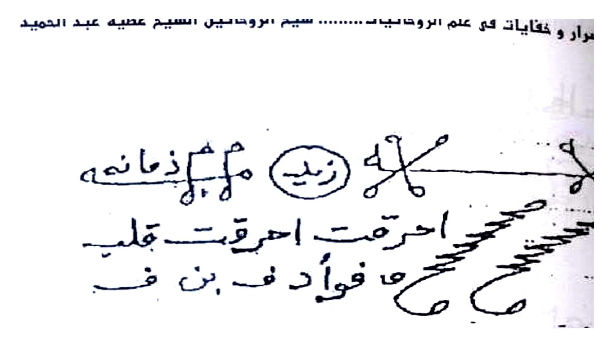
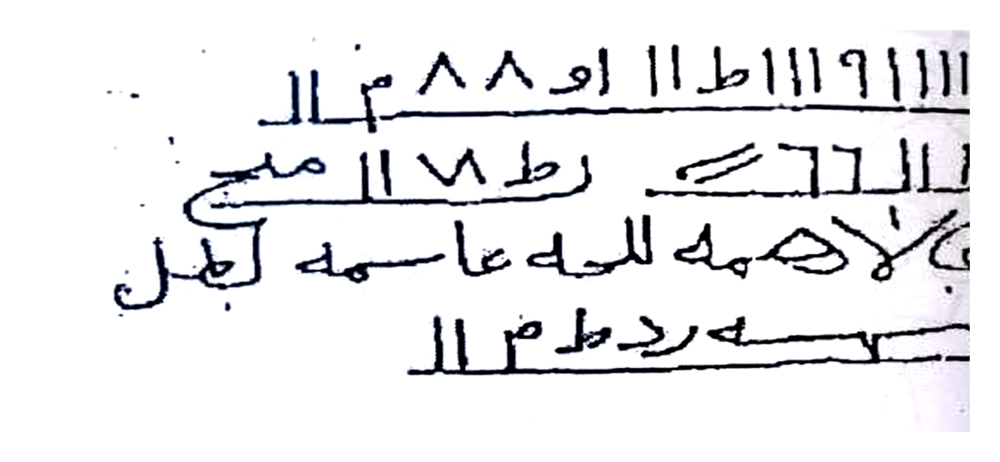
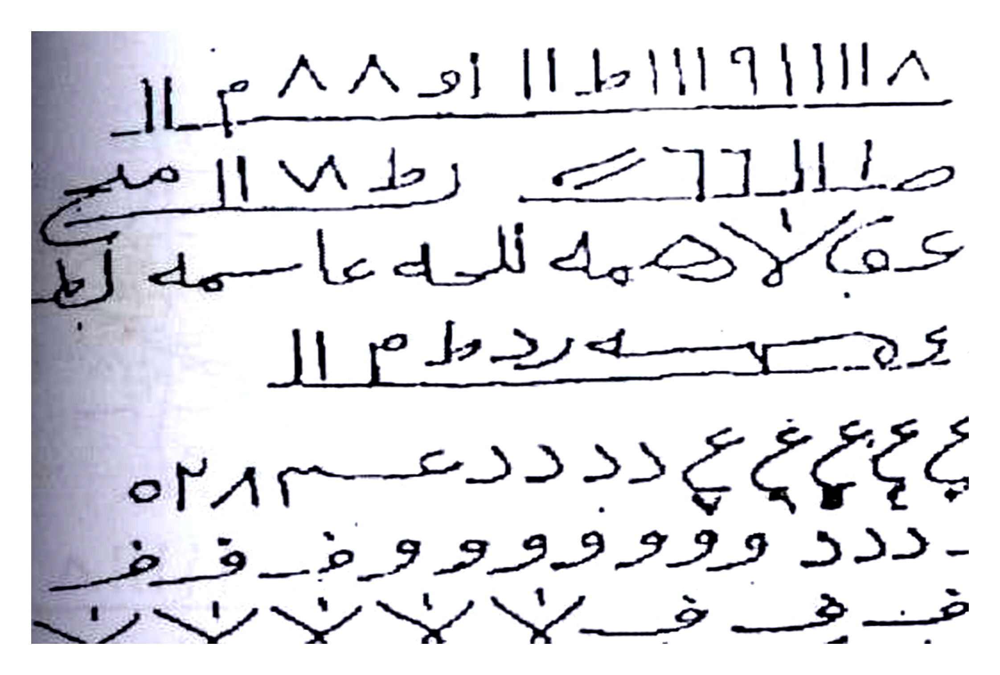
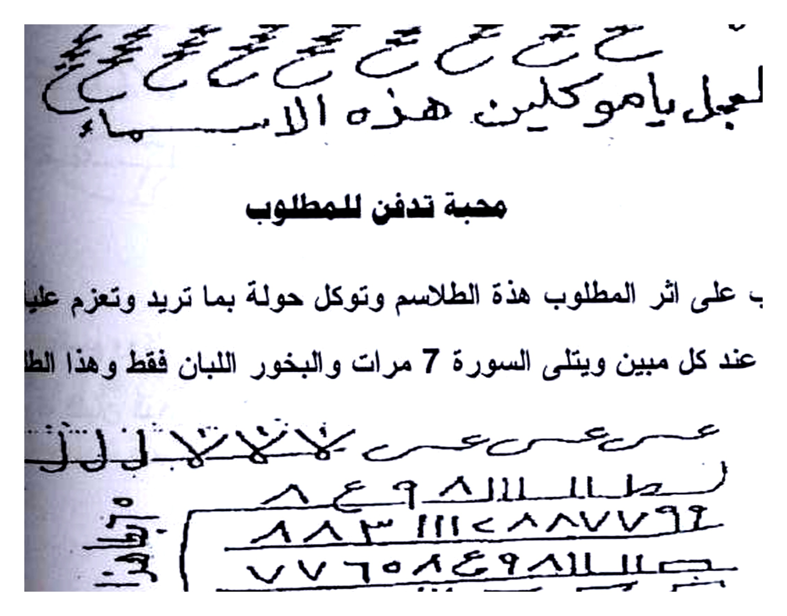
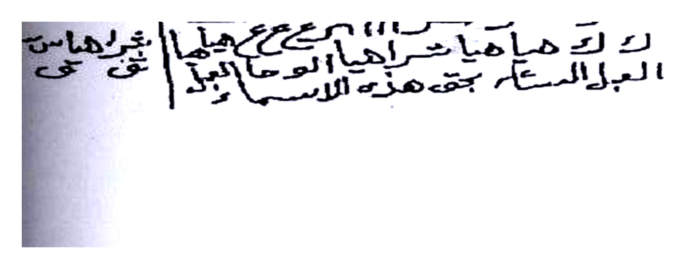
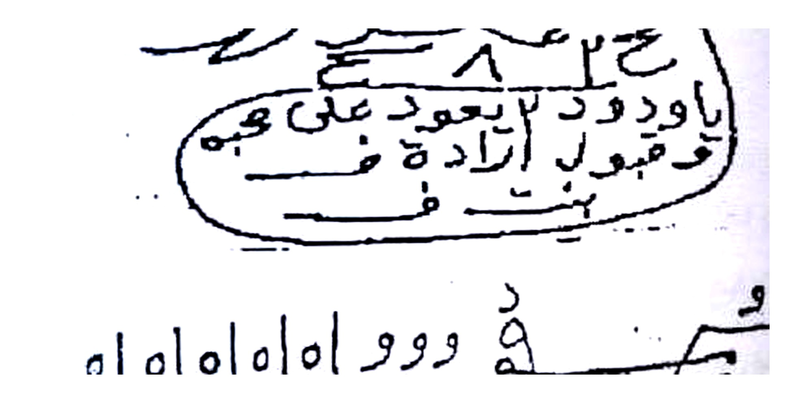
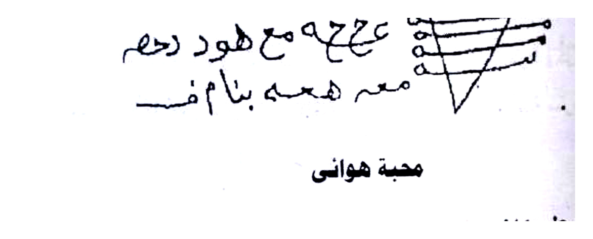
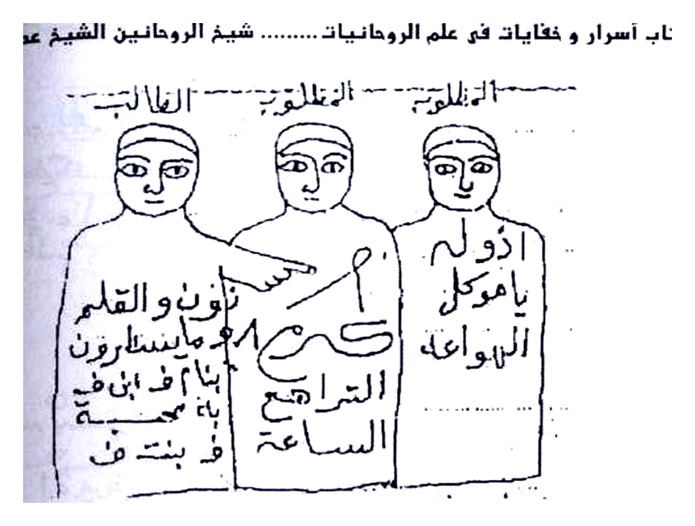
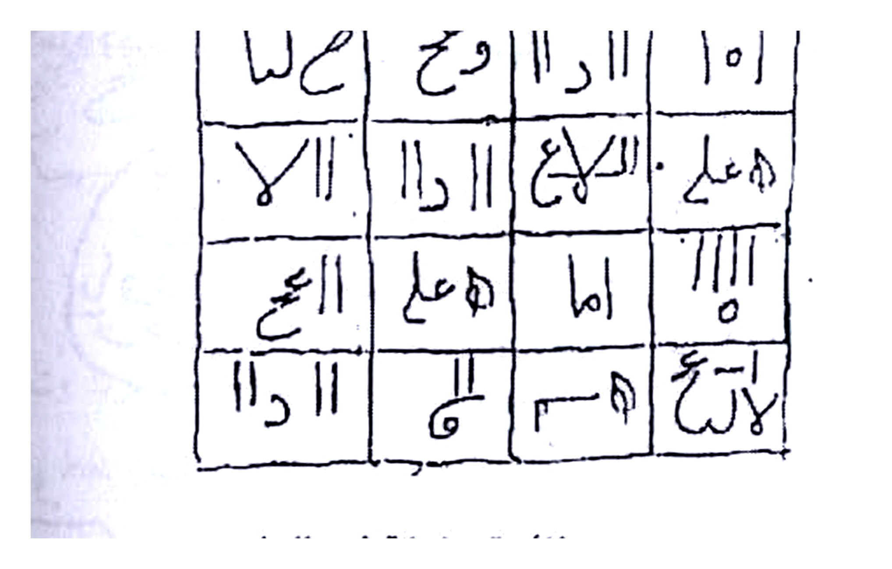
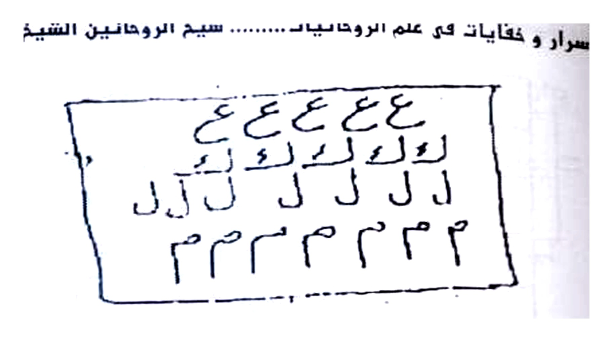

# BATCH 18 — Halaman 087–091 (Picture 043 kiri + 044 + 045)

> **Sumber:** `Picture 043.jpg` (Hal.87 kiri) + `Picture 044.jpg` (Hal.88 kanan + Hal.89 kiri) + `Picture 045.jpg` (Hal.90 kanan + Hal.91 kiri) • 2 tingkat Arab–Indonesia • **Rajah baru: 10 crop HQ 4×** — Hal.87 atas thilasm + bawah numbers, Hal.88 atas nums + tengah ع ع + bawah oval, Hal.89 atas oval + bawah V, Hal.90 3 figur + wafaq, Hal.91 top box

---

### Halaman 087 — Mahabbah fi Akli aw Shurb + Dafn/Haraq Buruj (kiri `Picture 043`)

**[Teks Arab Asli]**

زيد (مهم زه مانه موه ر زمانه)
احرقت احرقت قلب فؤاد بن ف
٨ ٨ او ١١ ط ١١١٩ ١١١١٨ ر ٨ مـ ـ ٨٨
صلال٦٦ ك ط ١٧ رط ١١ ٧ مح
عفي الاحمه للسه عاسمه الجل
عـ مـ سه رد طـ مـ لا

محبة فى اكل او شرب

يكتب هذا الطلسم ووكل حولة بما تريد وعزم علية بسورة البروج الى الحريق 21 مرة
وبخورك اللبان الذكر والجاوى ورصد فلك مناسب وهذا ما تكتب

**[Terjemahan Indonesia]**

**Thilasm `زيد` (lihat Rajah atas — `زيد` lingkaran + `احرقت احرقت قلب فؤاد بن ف` + zigzag)** + 2 baris angka `٨٨او ١١م... / صلال٦٦...` — untuk **mahabbah dimakan/diminum:** tulis thilasm + tawkil + azam Buruj sampai `حريق (حريق)` 21× luban jawi rashad falak.

Mahabbah dafn/haraq sebelumnya di Hal86 dilanjutkan 87 awal makanan.

*Gambar Rajah Asli Halaman 087 Atas — `زيد مهم زه... احرقت قلب فؤاد` + garis zigzag — untuk akli/shurb. 261K 4×.*

*Gambar Rajah Asli Halaman 087 Bawah — 2 baris `٨٨او ١١ط... / صلال٦٦ ك...` — pelengkap thilasm atas. 240K 4×.*

---

### Halaman 088 — Mahabbah Tadfin + ‘Ayi & Hajat Buruj Yasin 7× (kanan `Picture 044`)

**[Teks Arab Asli]**

٨ ٨ او ١١ ط ١١١٩ ١١١١٨
صلال٦٦ ك رط ١١ ٧ مح
عفي الاحمه للسه عاسمه الجل
عـ مـ سه رد طـ مـ لا

٥٢١ م ع د د د ع ع ع ع ع ع ٤
آلباب دد وو وو وو و فـ ـض
فـ فـ ش لـ لـ لـ نـ لـ لـ لـ نـ ـخـ
لا يـ فـ ش يـ حـ يـ فـ عـ جـ عـ جـ
العجل العجل ياموكلين هذه الاسماء

محبة تدفن للمطلوب

تكتب على اثر المطلوب هذة الطلاسم وتوكل حولة بما تريد وتعزم علية بسورة
والتوكيل عند كل مبين ويتلى السورة 7 مرات والبخور اللبان فقط وهذا الطلسم

ع ص ع ص ع ص ع ص ع ص
طا ١١ ٨ ٩ ٨ ٨ ٧ ٩٢
٧٦٥٨٤٩ ١١ ٧٧٦٥٨٤٩ ٨٨٣
ك حام يا ها ر ا يا ها ر ا ... العجل الساعة تحت هذه الاسماء

**[Terjemahan Indonesia]**

**Mahabbah ditanam untuk target:** tulis pada **atsar** thalasim atas `٨٨او...` + `صلال٦٦...` + bawah `ع ص... / طا...` — tawkil + **surah (Yasin) 7× ditiap mubin + luban saja** (lihat Rajah bawah).

Tengah block `٥٢١ م ع د د... / آلباب دد... / فـ فـ ش... / لا يـ فـ... / العجل يا موكلين` (lihat Rajah tengah — `ع ع...` besar) — azam hajat besar.

*Gambar Rajah Asli Halaman 088 Atas — 2 baris `٨٨او... / صلال...` — lanjutan Hal87. 415K 4×.*

*Gambar Rajah Asli Halaman 088 Tengah — Block `ع ع ع ع... ٥٢١ / آلباب دد... / فـ فـ...` — untuk dafn Yasin 7×. 507K 4×.*

*Gambar Rajah Asli Halaman 088 Bawah — Block `ع ص ع... / طا ١١٨... / ٧٦٥...` — pelengkap. 173K 4×.*

---

### Halaman 089 — Mahabbah Zawjain Bismār/Rashāsh + Hawā’i Zafaran (kiri `Picture 044`)

**[Teks Arab Asli]**

عبد الله ١١ الله ١١ الله
١١١ ٤٥ الله مرام له قصة ٨ ١١١ هـ  اشوا قصة له مرام الله ٤٥ ١١١
ع ع ع محج محج عباس سـ سـ
على عاعة عبد المسلم السلم الجمل الى
الى ٣ هـ هيا

محبة بين الزوجين

يكتب هذا الطلسم بمسمار او مسلة على قطعة رصاص صياد وبعد الكتابة تبخر باللبان
وتعزم بالبرهتية 21 مرة والتوكيل كل مرة ووكل خادم اليوم العلوى والارضى ثم ترمى
الرصاص فى ماء يجرى وخذا لعملك رصد مناسب وهذا الطلسم

[oval besar: `هيجت فر بنت ... ياودود ٢ يععود على عبه / قبول ارادة ض... ف بنت ... / الوسط الدبل العمل`]

٥١٥١١٥١ وو د ٠١٥١٥١٥١
ع ع ح هود رحم
معر همه بنام فـ

محبة هوائى

يكتب هذا الطلسم على كاغد مصبوغ زعفران ويبخر باللبان والمسك وتعزم بسورة ن
والقلم 21 مرة ويعلق فى الهواء فانة الهواء غاية وهذا الطلسم

**[Terjemahan Indonesia]**

**Mahabbah zawjain paku/rashash:** tulis dengan **paku/jarum pada timah nelayan (rashash shiyad)** setelah asapi luban **Barhatiyyah 21×** tiap tawkil `wakkil khadim yawm ‘ulwi/ardhi` lalu **lempar timah ke air mengalir** — rashad falak (lihat Rajah oval `هيجت... ياودود... قبول ارادة...` + bawah `٥١٥...` V).

**Mahabbah hawa’i:** kertas **celup zafaran, asapi luban misk, baca Surah Nun wal-Qalam 21× gantung di angin** — puncak hawa.

*Gambar Rajah Asli Halaman 089 Atas — Oval `هيجت فر... ياودود ٢ / قبول ارادة...` — untuk timah rashash hawa. 209K 4×.*

*Gambar Rajah Asli Halaman 089 Bawah — V `٥١٥... وود... / ع ع ح هود...` — hawa’i Nun 21×. 149K 4×.*

---

### Halaman 090 — Jalb Jaleelah 3 Figur + Wafaq 4×4 + Zaytun 21 (kanan `Picture 045`)

**[Teks Arab Asli]**

--- الفالنج --- المظلوم --- الغالب ---
[3 figur berdiri: kiri `نازون والقلم` + tengah `٥ الترامع...` + kanan `أدول ياموكل الهنواعه` ]

[Wafaq 4×4: `١٥١ ا را وع ١٠١ / ٥٥٠١ اللا ع ١١ وا ٧١١ / ٣١٠٠١ ا ام ١١١٠ / ا د ١١ الم ١١` + grid]

فائدة جليلة فى الجلب

تكتب هذا الخاتم على 21 ورقة زيتون وانت جالس امام المجمرة وكل ورقة بعد
ة ترميها فى النار ومعها فص لبان ذكر وفلفلة واحدة بعد الاخرى فانة سريع الاجابة و
يكتب على الورقة

**[Terjemahan Indonesia]**

**Fā’idah jalīlah jalb:** 3 figur `نازون والقلم... الترامع... أدول...` atas + wafaq 4×4 `١٥١ ا را...`/`٥٥٠١...`/`٣١٠٠١...` bawah (lihat Rajah). Tulis **wafaq ini pada 21 daun zaitun sambil duduk depan perapian — lempar tiap daun + 1 luban + 1 lada 1-1 — cepat.**

*Gambar Rajah Asli Halaman 090 Atas — 3 figur `نازون... / الترامع... / أدول...` — untuk jalb jalilah. 411K 4×.*

*Gambar Rajah Asli Halaman 090 Bawah — Wafaq 4×4 `١٥١ ا را وع...` — 21 zaytun nar. 282K 4×.*

---

### Halaman 091 — Hibr Ruhani Mu‘tabar Box + ‘Azimah Harisy & Fā’idah ‘Aẓīm (kiri `Picture 045`)

**[Teks Arab Asli]**

ع ع ع ع
لع لم لم لم ل ك ل ل ل
ل ل ل ل ل ل ل ل
٣٣٣٣٣٣٣

وهذا ما تعزم بية فانة يكون ما اردت

يطشر 3 بابطوش 3 ياشخطوش 3 يا خلطاوش 3 ياسلبطاوش 3 اهدي طوش 3
٣ ب اطلوث 3 بجهر ب 3 توكلوا ياخدام هذه الاسماء واحرقو وهيجو قلب وفؤاد كذا على
تايقي هاروت وماروت وما هب وما دب وما تحت نور الشمس والقمر اجلبو كذا الى كذا
بحق ما فى هذا الخاتم من اسرار ويكتب على ظهر الورقة اهطمفشذ تم

فائدة محبة عظيم وجلب

يكتب هذا الوفق ويعلق فى عضدك الايمن ثم تكتب وتدفن تحت عتبة المطلوب عزمت
بان والشياطين والتوابع والبواطن وانت يا ابا مره وانت يا عبد الرحمن وياميمون اقسمت
عبكم وحرمكم وبحق جبرائيل وميكائيل واسرافيل وعزرائيل ان تجيبوا دعوتى والا يرسل
لموكل بالرد العاصف والريح العاصف وزلزل الارض الا تعلو على واتونى مسلمين اما م
حية وعشق وطاعة كذا بحق هذه الاسماء مسا مسا سنار بالله العجل العجل الوحا الساعة

شيخ الروحانيين فى الوطن العربى
الشيخ عطية عبد الحميد
00201062022238

**[Terjemahan Indonesia]**

**Box hibr ruhani:** `ع ع ع ع / لع لم... / ٣٣٣٣` (Rajah) — azam `Yathshar 3 Biyabthush 3 Yasykhthush 3... Bajahra 3` — tawkil `ahriqu hayyiju... bi-haqqi Harut Marut...` tulis belakang kertas `Ahtamfashadz`.

**Fā’idah ‘azimah 3:** wafaq gantung lengan kanan + tanam bawah ‘atabah, azam jin syayathin tawabi‘ bawatin ya Aba Murrah ‘Abd Rahman Maimun + Jibrail... — `Muakkal bir-Radd ‘Asif... Atuni muslimin...` — habat ‘asyiq tha‘ah `Masa Masa Sanar... Al-‘Ajal...` — Athiyah `00201062022238`.

*Gambar Rajah Asli Halaman 091 Atas — Box `ع ع ع ع / لع لم... / ٣٣٣٣` — hibr mu‘tabar. 170K 4×.*

*Next Batch 19 Hal.092–096 (Picture 046 Hal92-93 + 047 Hal94-95 + 048 Hal96) AUTO.*

