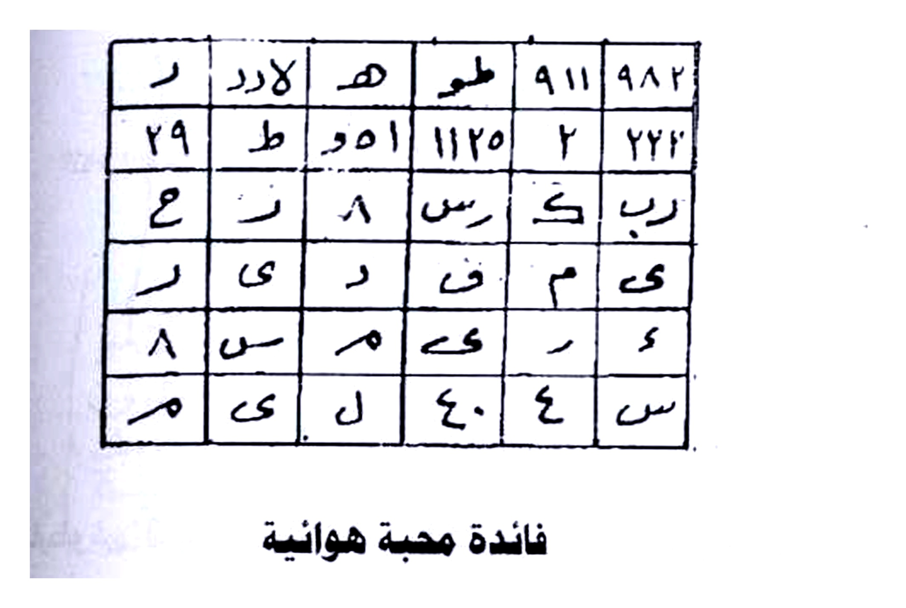
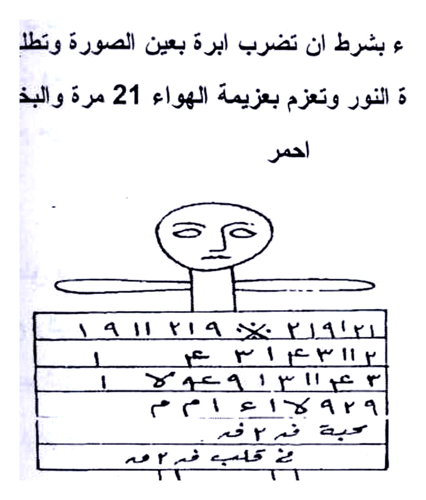
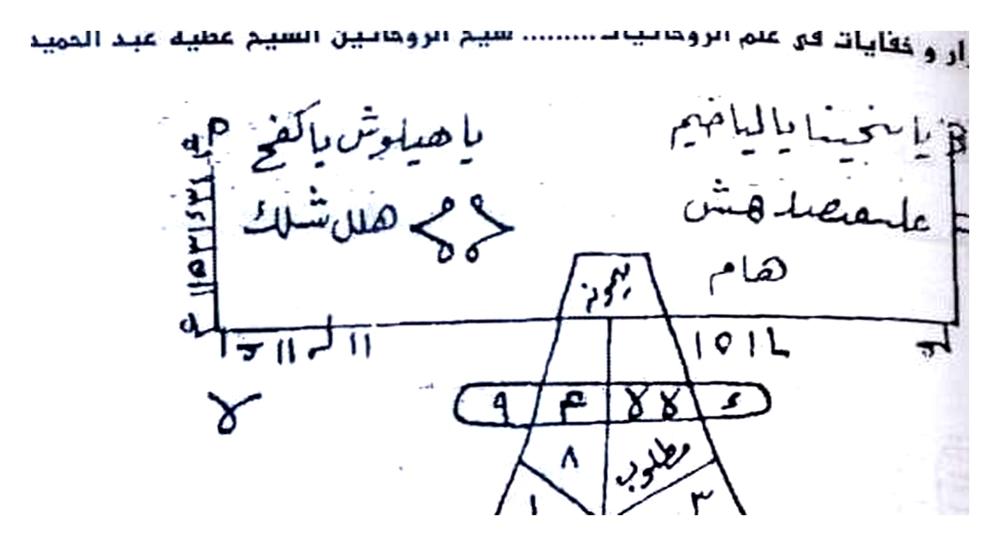
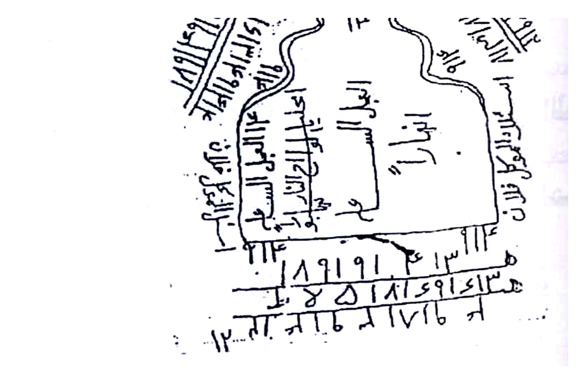
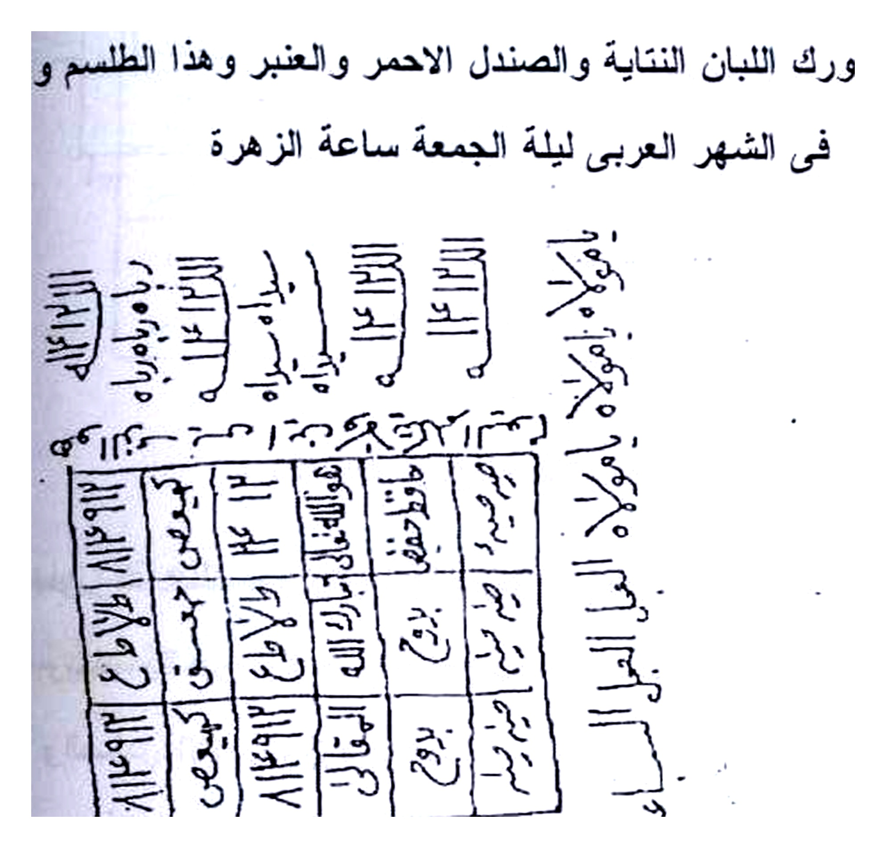

# BATCH 19 — Halaman 092–096 (Picture 046 + 047 + 048)

> **Sumber:** `Picture 046.jpg` (Hal.92 kanan + Hal.93 kiri) + `Picture 047.jpg` (Hal.94 kanan + Hal.95 kiri) + `Picture 048.jpg` (Hal.96 kanan) • 2 tingkat Arab–Indonesia • **Rajah baru: 7 crop HQ 4×** — Hal.92 atas grid + bawah figur, Hal.93 atas mizan + bawah torso, Hal.94 grid, Hal.96 atas 2 baris + bawah

---

### Halaman 092 — Fā’idah Mahabbah Hawā’iyyah — Hajar Ahmar + Figur Horizontal (kanan `Picture 046`)

**[Teks Arab Asli]**

ر لرد ٨ هـ طو ٩١١ ٩٨٢
٢٩ ط ٥٠١ ١١٢٥ ٢ ٢٢٢
ع ر ٨ رس ك ب رب
ر ى د ف م ى
٨ س م كى ر ٤
م ى ل ٤٠ ٤ س

فائدة محبة هوانية

تكتب وتعلق فى الهواء بشرط ان تضرب ابرة بعيون الصورة وتطلع منها وتعلق فى
بت ل فى ساعة سعيدة فى زيادة النور وتعزم بعزيمة الهواء 21 مرة والبخور لبان تتاية و
احمر

[figur horizontal: `١٩١١ ٢١٩ × ٢١٩١٢١ / ١ م ٣١٤٣١١٢ / ١ خ ه ٩١٣١١ ع ٣ / م م ٤١٦ ٩٢٩ / حبية فم فقـه / بن قليمه فم ٣مه`]

ثم علقة ويكون افضل لو علق اتجاة شرق ثم تكتب فى كاغد هذا الطلسم وتحملة معك
يكون ما اردت ولا تنس الرصد مناسب

**[Terjemahan Indonesia]**

**Grid 6×6 `ر لرد...` atas** + **figur horizontal baris 6** `١٩١١ ٢١٩...` bawah (lihat Rajah). **Mahabbah hawa’iyyah:** tulis gantung di udara — **tusuk jarum di mata gambar lalu cabut, gantung** — **saat bulan bertambah cahaya (ziyadah nur) jam sa‘idah** — **azimah Hawa 21× luban nathiyah merah.**

Gantung timur lebih utama — tulis di kertas lain bawa bersama — rashad.

*Gambar Rajah Asli Halaman 092 Atas — Grid `ر لرد ...` 6×6 — hawa’iyyah jarum mata. 324K 4×.*

*Gambar Rajah Asli Halaman 092 Bawah — Figur horizontal `١٩١١ ٢١٩...` 6 baris — lanjutan hawa. 292K 4×.*

---

### Halaman 093 — Fā’idah Tarsh — Mizan Ahmar + Figur Torso (kiri `Picture 046`)

**[Teks Arab Asli]**

يا سخينا بالبا قليم
يا هيلوش يا كنغ هـام
١١ ل ه ١١ هـام طلو ب
٣ م ٢ و پ ٨ م ٩ لا
علم مصه فهش
هام
[segitiga mizan `١ / ٨ / طلو ب ٣ / ٩ م ٤٨`]

فائدة محبة ترش للمعمول لة

تكتب البرهتية حول هذا الطلسم وتوكل بيها وترش فى طريق المعمول لة يكون فانة يكون ما
الطلسم والمطلوب ويكتب بالحبر الروحانى وتعزم 45 مرة والبخور المسك وقشر العنبر
والصندل الاحمر والرصد المناسب لعملك

[figur torso: `١١٤ ...` tengah `يا ودود` keliling `هذا الطلسم على قلب ...` + bawah angka `١٩١٩١ ٤ ١٣ ١١٤ / ٨ ٥١٨١ و٩١اكسا ...`]

فائدة محبة شرب

**[Terjemahan Indonesia]**

**Mizan segitiga atas** `يا سخينا بالبا... ١١ ل ه...` — **Mahabbah tarsh (disiram di jalan):** tulis **Barhatiyyah keliling thilasm, tawkil, siram di jalan target — hibr ruhaniyyah, azam 45× misk qishr ‘anbar sandal ahmar rashad.**

**Figur torso bawah** bertulis `يا ودود ... هذا الطلسم على قلب ...` + angka `١٩١٩١...` — untuk **mahabbah shurb** selanjutnya.

*Gambar Rajah Asli Halaman 093 Atas — Mizan segitiga `يا سخينا... / ١١ ل ه...` — untuk tarsh jalan. 266K 4×.*

*Gambar Rajah Asli Halaman 093 Bawah — Figur torso `يا ودود...` + angka `١٩١٩١...` — torso mahabbah. 369K 4×.*

---

### Halaman 094 — Mahabbah Ṭabaq Ṣīnī + Surah Ya Sin 7× + Wafaq Sulaimani (kanan `Picture 047`)

**[Teks Arab Asli]**

يكتب هذا الطلسم فى طبق صينى بدون بلل وتكتب صورة يس حول الطلسم وتوكل
حبة فانة يكون وبخورك اللبان النباتة والصندل الاحمر والعنبر وهذا الطلسم وعملك اول خميس
فى الشهر العربى ليلة الجمعة ساعة الزهرة

[grid besar 6×6: tengah `لا اله الا انت الغفور الرحيم / سبحانك يا لا اله الا انت ...` keliling `يا حي يا قيوم` + angka `٩١ ...`]

ولا تنسنا من دعائكم الفقير الى الله

شيخ الروحانيين الشيخ عطية عبد الحميد

ولا تبخل بقراءة الفاتحة

**[Terjemahan Indonesia]**

**Piring Cina (ṭabaq ṣīnī) tanpa basah:** tulis **thilasm di piring, kelilingi Surah Ya Sin, tawkil — pakai, luban nabatah sandal ahmar ‘anbar — Kamis pertama Jum‘at malam Zuhrah** (lihat Rajah grid `لا اله الا انت الغفور...`).

Doa faqir & Fatihah Athiyah.

*Gambar Rajah Asli Halaman 094 — Grid `لا اله الا انت الغفور الرحيم...` — untuk ṭabaq Ya Sin Zuhrah. 524K 4×.*

---

### Halaman 095 — Al-Faṣl ats-Tsānī — Daftar 12 Kitab — Muqaddimah Da‘wah Jami‘ah (kiri `Picture 047`)

**[Teks Arab Asli]**

الفصل الثانى
فى الدعوة الجامعة وبعض من التصاريف وكيفيه العمل بيها
من اصدارات شيخ الروحانيين الشيخ عطية عبد الحميد فى المكتبات
مجلة السهم الصائب ... كتاب الابراج ... كتاب عجائب ... كتاب الصولجان ... كتاب زجرات ميططرون ... كتاب تصريف دعوة البرهتية ... كتاب حكمة الحكماء ... كتاب الاستدلال ... كتاب سر الاسرار ... كتاب أسرار و خفايات ...

**[Terjemahan Indonesia]**

**Pasal Kedua: DA‘WAH JAMI‘AH & TASHARIF + Cara Amalnya** — daftar 12 karya Athiyah (Saham Sha’ib, Da‘awat, Abraj, ‘Aja’ib, Shaulajan, Zajrat Mithathrun, Tashrif Barhatiyyah, Hikmah, Istidlal, Sirr al-Asrar, Asrar wa Khofayyat). **Tidak ada Rajah di hal ini.**

---

### Halaman 096 — Tasarruf 1–2: Baydhah Harir + Athar Nar Hadi’ah 3× (kanan `Picture 048`)

**[Teks Arab Asli]**

التصريف الاول
فى المحبة والتهييج اكتب الطلاسم الآتية على بيضة بنت
يومها واجعلها فى النار ويخرها يخور الخير واتل الدعوة ٣ مرات
والرجر مرة واحدة وهذا هو الطلسم:

٦٨١٨١ ٧٩١١ X له ى ١١١٩ X ٨
الباقي دام ل ه  اع اع اع هد اف اف ا
ن ا ما م هيجوا واجلبوا باخدام هذه الاسماء
كذا الى كذا بارك الله فيكم وعليكم

التصريف الثانى
للمحبة اكتب هذا الطلسم على اثر المطلوب واجعله في نار
هادية واتل الدعوة ٣ مرات والرجر مرة واحدة وهذا هو الطلسم.

د ك و هى ١١١٩٩/ هسا
هيجوا واجلبوا كذا الى محبة كذا الوحا العجل ٢ الساعة ٢
بارك الله فيكم وعليكم.

التصريف الثالث
لجلب السحر إذا أردت أن تجلب السحر من أي مكان أو
أي بلد اكتب الطلسم الآتي في إناء مدهون وغطية بأثر المسحور
ويوضع يده على الغطاء واتل الدعوة ٧ مرات والزجر مرة وأمر
المسحور برفع الغطاء يجد السحر داخل الإناء وبخور الخير شمال
وهذا هو الطلسم.

خده بمن فك ملو خالة قومه

**[Terjemahan Indonesia]**

**Tashrif Awwal:** tulis **pada telur bint yaumiha (hari muncul), taruh di api — bukhur khair, baca da‘wah 3× + zajr 1×** — thilasm `٦٨١٨١ ٧٩... / الباقي دام ل... / هيجوا...`

**Tashrif Thani:** pada **atsar taruh di api tenang (nar hadi’ah) da‘wah 3× zajr 1×** — `د ك و هى... / هيجوا... Al-Waha 2...`

**Tashrif Tsalits:** **tarik sihir dari mana saja:** tulis di **bejana berminyak tutup dengan atsar, tangan di atas tutup, baca 7× zajr 1×, suruh buka — sihir di dalam — bukhur khair syimal** — `خده بمن فك...`

*Gambar Rajah Asli Halaman 096 Atas — `٦٨١٨١ ٧٩١١... / الباقي دام...` — Tashrif Awwal baydhah nar. 215K 4×.*

*Gambar Rajah Asli Halaman 096 Bawah — `د ك و هى ١١١٩٩...` — Tashrif Thani athar. 150K 4×.*

*Next Batch 20 Hal.097–101 (Picture 048 kiri Hal97 + 049 Hal98-99 + 050 Hal100-101) AUTO.*

