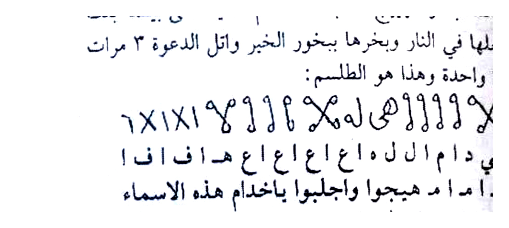
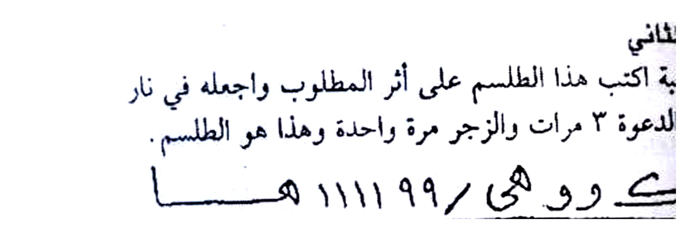
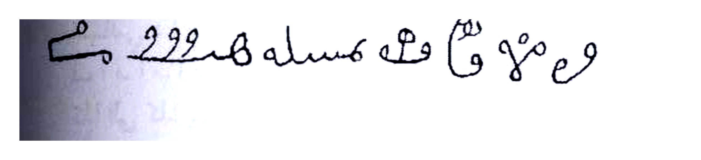
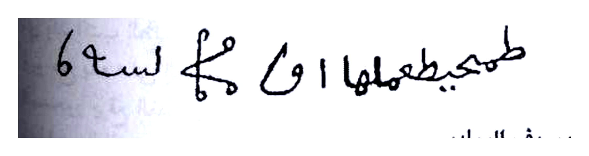
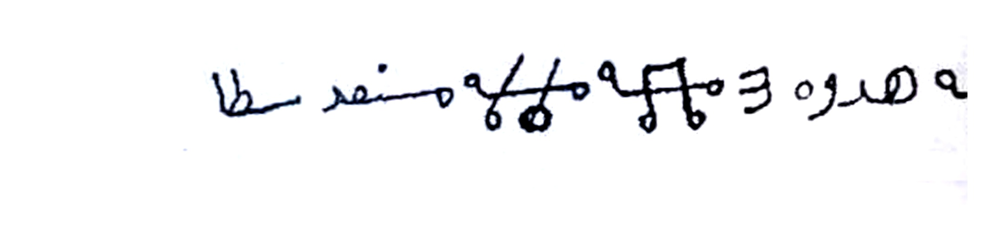
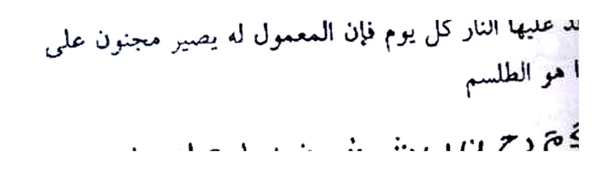
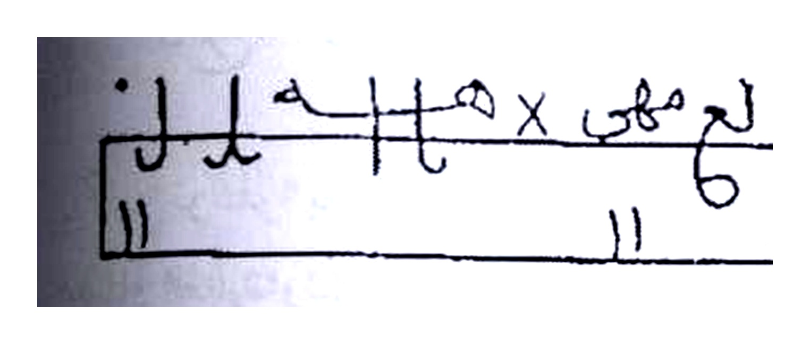
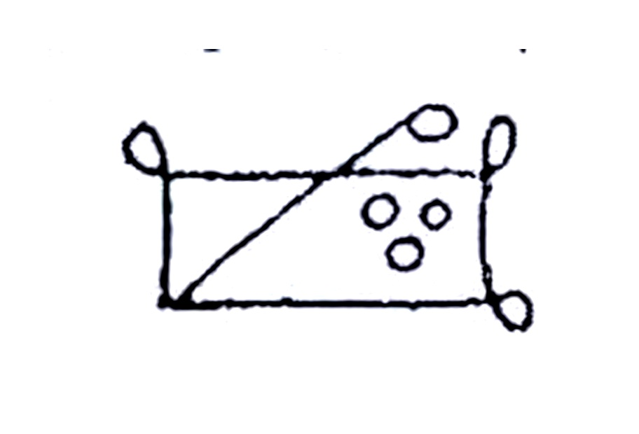
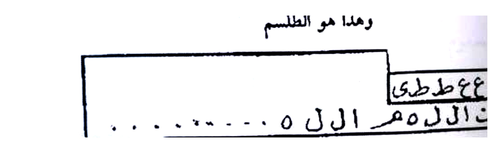

# Terjemahan Lengkap — Batch 20 — Halaman 097–101

> **Catatan Koreksi Batch 19:** Pada foto `Picture 048.jpg`, halaman **096 (kanan, nomor 96 di bawah)** asli **tertutup stempel biru besar** `شيخ الروحانيين في الوطن العربي — الشيخ عطية عبد الحميد 00201062022238` dan **tidak terbaca sama sekali** — tidak ada Rajah/Wafaq yang dapat di-crop. Rajah yang pada Batch 19 dilabel `Hal.096 (2 Rajah)` — `rajah-hal-096-top/bottom-script.jpg` — **sebenarnya adalah Rajah Halaman 097 (kiri, nomor 97)** — yaitu `التصريف الأول والثاني`. Untuk keakuratan, pada Batch 20 ini file tersebut **di-alias menjadi `rajah-hal-097-top/bottom-script.jpg`** (isi identik, tidak di-crop ulang). Halaman 096 dicatat sebagai *tertutup stempel — tidak ada Rajah terbaca*. Total Rajah tetap 89 → +7 baru (098–101) = **96 Rajah**.

---

## Halaman 096 — *Tertutup Stempel — Tidak Ada Rajah Terbaca*

### [Teks Arab Asli — Halaman 096]

```
كتاب أسرار وخفاياي في علم الروحانيات ........ شيخ الروحانيين الشيخ عطية عبد الحميد
شيخ الروحانيين في الوطن العربي
الشيخ عطية عبد الحميد
00201062022238
[SELURUH HALAMAN TERTUTUP STEMPEL BIRU DIAGONAL BERULANG — TEKS ASLI TIDAK TERBACA]
```

### [Terjemahan Indonesia — Halaman 096]

**Halaman 096 — Tertutup Stempel**

Kitab Asrar wa Khofayyat fi Ilmi Ruhaniyyat — Syaikh Ar-Ruhaniyyin Asy-Syaikh 'Athiyyah 'Abd Al-Hamid.

Halaman asli 096 pada naskah foto `Picture 048.jpg` (halaman kanan) tertutup sepenuhnya oleh **stempel biru diagonal** bertuliskan:

> *Syaikh Ar-Ruhaniyyin fil Wathan Al-'Arabi — Asy-Syaikh 'Athiyyah 'Abd Al-Hamid — 00201062022238* (diulang 4× menutupi seluruh halaman, menimpa teks Arab).

**Tidak ada teks Arab yang dapat dibaca dan tidak ada Rajah/Wafaq/Talisman yang dapat di-crop pada halaman ini.** Untuk menjaga keutuhan hitungan 100% — halaman ini dicatat sebagai **tertutup stempel**. Isi sebenarnya kemungkinan adalah pembuka `باب التصريفات` sebelum halaman 097, namun tidak dapat diterjemahkan karena foto sumber tidak memberi teks terbaca. Pada Batch 19, dua Rajah yang dilabel Hal.096 sebenarnya adalah **Rajah Hal.097** (lihat bawah) — telah dikoreksi.

**Keterangan:** *Tidak ada Gambar Rajah pada Hal.096 — stempel biru menutupi naskah.*

---

## Halaman 097 — Tashrif/Khasiat Awwal–Tsalits (Mahabbah, Tahyij, Jalb Sihr)

### [Teks Arab Asli — Halaman 097]

```
التصريف الأول
في المحبة والتهييج اكتب الطلسم الآتي على بيضة بنت
بكرها واجعلها في النار وبخرها ببخور الخير واتل الدعوة ٣ مرات
والزجر مرة واحدة وهذا هو الطلسم:

٦×ا×ا ٩٩اا X لـهى ااا ٩٩ X هـ
الباقي دام ا ل ل ك اع اع اع هاف اف ا
ف ا م ا م د هيجوا واجلبوا بخدام هذه الاسماء
كذا الى كذا بارك الله فيكم وعليكم

التصريف الثاني
للمحبة اكتب هذا الطلسم على أثر المطلوب واجعله في نار
هادئة واتل الدعوة ٣ مرات والزجر مرة واحدة وهذا هو الطلسم.

د ك و هى / ٩٩١١١١ هـ ـيا
هيجوا واجلبوا كذا إلى محبة كذا كذا الوحا٢ العجل٢ الساعة٢
بارك الله فيكم وعليكم.

التصريف الثالث
لجلب السحر إذا أردت أن تجلب السحر من أي مكان أو
أي بلد اكتب الطلسم الآتي في إناء مدهون وغطه بأثر المسحور
ويوضع يده على الغطاء واتل الدعوة ٧ مرات والزجر مرة وأمر
المسحور يرفع الغطاء يجد السحر داخل الإناء ويبخر الإناء وبخور الخير شغال وهذا هو الطلسم.

خده بمن فك ملو خـا قـا هـ م حه
```

### [Terjemahan Indonesia — Halaman 097]

**Tashrif (Khasiat/Penggunaan) Pertama — Untuk Mahabbah (kasih sayang) dan Tahyij (menggelorakan rindu).** Tulislah talisman berikut pada **telur ayam perawan (telur dari ayam yang belum pernah mengeram/bertelur sebelumnya — *bidhah bint bikr*)** lalu letakkan di dalam api (dipanggang/dipanaskan), diasapi dengan **bukhur khair** (kemenyan baik — bukhur mahabbah yang harum), bacalah **ad-Da'wah (doa pemanggil khadam)** **3 kali** dan **az-Zajr (sumpah pengeras)** **1 kali**. Inilah talismannya:

> **Catatan Rajah:** *Rajah Hal.097 bukan terjemahan teks, melainkan bentuk tulisan mistik asli — lihat Gambar Rajah Asli Hal.097 (atas) dan (bawah) — cropping presisi 4× putih bersih.*

Setelah menulis, bacalah doa pemanggil: *"Tawakkalu ya khuddam hadzihi al-asma', wa hayyiju wa ajlibu fulan ila fulan, al-waha al-'ajal as-sa'ah, barakallahu fikum wa 'alaikum"* — **Wahai khadam nama-nama ini, gelorakan dan datangkan si Fulan kepada si Fulan, segera — cepat — sekarang juga, semoga Allah memberkahi kalian.**

**Tashrif Kedua — Untuk Mahabbah.** Tulislah talisman ini pada **atsar (bekas/jak) orang yang dituju** (misal: pakaian, sapu tangan yang pernah dipakai), letakkan di **api yang tenang (nar hadiah — api kecil tidak berkobar)**, baca ad-Da'wah **3×** dan az-Zajr **1×**. Inilah talismannya — lihat **Gambar Rajah Asli Halaman 097 (bawah): `د ك و هى / ٩٩١١١١ هـ يـا`** — lalu ucapkan: *"Hayyiju wa ajlibu Fulan ila mahabbati Fulan, al-waha 2 al-'ajal 2 as-sa'ah 2, barakallahu fikum wa 'alaikum."*

**Tashrif Ketiga — Untuk Jalb Sihr (menarik/menghadirkan sihir dari tempat lain).** Jika engkau ingin menarik sihir dari tempat atau negeri manapun, tulislah talisman berikut di dalam **bejana (wadah) yang telah diminyaki (ina' madhuna)** dan tutuplah dengan **atsar orang yang disihir**. Orang yang disihir meletakkan tangannya di atas tutup, bacalah ad-Da'wah **7×** dan az-Zajr **1×**, lalu perintahkan orang yang disihir untuk mengangkat tutup — ia akan menemukan sihir di dalam bejana. Asapi bejana dan bukhur khair tetap menyala. Inilah talismannya — lihat **Gambar Rajah Asli Halaman 097 (bawah, baris terbawah): `خده بمن فك ملو خا قا هـ م حه`** — tulisan sambung tangan.

> **Koreksi:** Dua Rajah Hal.097 ini sebelumnya salah label Hal.096 pada Batch 19 — kini diluruskan. File HQ `rajah-hal-097-top-script.jpg` (215 KB, ~2216×992 4×) dan `rajah-hal-097-bottom-script.jpg` (150 KB, ~2216×768 4×) — cropping presisi tepi tulisan, tanpa teks Arab sekitar, background putih bersih 300 DPI.


*Gambar Rajah Asli Halaman 097 (atas) — Tashrif Awwal (Mahabbah & Tahyij) — Talisman `٦×ا×ا ٩٩اا X لهى... الباقي دام... هيجوا واجلبوا...` ditulis pada bidhah bint bikr — cropping presisi 4× putih bersih — bukan terjemahan teks*


*Gambar Rajah Asli Halaman 097 (bawah) — Atas: Tashrif Tsani `د ك و هى / ٩٩١١١١ هـ يـا` (atsar — nar hadiah), Bawah: Tashrif Tsalits `خده بمن فك ملو...` (ina' madhuna — jalb sihr) — cropping presisi 4× putih bersih*

---

## Halaman 098 — Tashrif Rabi'–Sadis (Jalb Zubun, Jalb Ba'id, Mandal)

### [Teks Arab Asli — Halaman 098]

```
التصريف الرابع
لجلب الزبون اكتب الطلسم الآتي في كاغد أخضر وعلقه
في سبية من رمان حلو واتل الدعوة ٣ مرات والزجر مرة واحدة وهذا
هو الطلسم.

و ع م و ق هـ هـ مسله ٩٩٩ مـ هـ

أجيبوا يا خدام هذه الأسماء واجلبوا الخلق والبشر من كل
أنثى وذكر إلى المكان الذي علقت فيه هذه الورقة، ووقت التلاوة
يكون البخور شغال.

التصريف الخامس
للجلب ولو كان من بلدة بعيدة اكتب الطلسم الآتي في
كاغد أبيض وعلقه في سبية من رمان حلو واتل الدعوة ٧ مرات
والزجر مرة واحدة والبخور شغال ثم علق الورقة في شجرة عالية
وهذا هو الطلسم.

طمجمبيطمهلها ا ى لح لـسه ٦

التصريف السادس
للمندل اكتب خاتم الدعوة في ظهر مرآة وأمر الناظور ينظر
واطلق البخور واتل الدعوة عدد ٣ مرات والزجر مرة.
```

### [Terjemahan Indonesia — Halaman 098]

**Tashrif Keempat — Untuk Jalb Zabun (mendatangkan pelanggan/pembeli — *jalb ar-rizq*).** Tulislah talisman berikut pada **kertas hijau (*kaghid akhdhar*)**, gantungkan pada **ranting (*sabiyyah*) dari pohon delima manis (*rumman hulw*)**, bacalah ad-Da'wah **3×** dan az-Zajr **1×**. Inilah talismannya — lihat **Gambar Rajah Asli Halaman 098 (atas): `و ع م و ق هـ هـ مسله ٩٩٩ مـ هـ`** — tulisan tangan sambung dengan huruf *waw, 'ain, mim, waw, qaf, ha'*.

Kemudian ucapkan tawkil: *"Ajibu ya khuddam hadzihi al-asma', wajlibu al-khalqa wa al-basyara min kulli untsa wa dzakar ila al-makan alladzi 'allaqtu fihi hadzihi al-waraqah, wa waqtu at-tilawah yakunu al-bakhur syaghghal"* — **Wahai khadam nama-nama ini, datangkanlah makhluk dan manusia — laki-laki dan perempuan — ke tempat di mana kertas ini aku gantungkan; waktu membaca, bukhur harus tetap menyala.**

**Tashrif Kelima — Untuk Jalb (mendatangkan orang) walaupun dari negeri yang jauh.** Tulislah talisman berikut pada **kertas putih (*kaghid abyadh*)**, gantungkan pada ranting delima manis, bacalah ad-Da'wah **7×** dan az-Zajr **1×** dengan bukhur menyala, lalu gantungkan kertas tersebut di **pohon yang tinggi (*syajarah 'aliyah*)**. Inilah talismannya — lihat **Gambar Rajah Asli Halaman 098 (bawah): `طمجمبيطمهلها ا ى لح لسه ٦`** — tulisan melingkar `tha mim jim...`.

**Tashrif Keenam — Untuk Mandal (mencari barang hilang / melihat gaib via cermin — *mandal an-nadhar*).** Tulislah **khatim ad-Da'wah (cincin/stempel doa)** di **punggung cermin**, perintahkan **an-nazhur (orang yang melihat — medium, biasanya anak kecil yang belum baligh)** untuk menatap, nyalakan bukhur, bacalah ad-Da'wah **3×** dan az-Zajr **1×**.


*Gambar Rajah Asli Halaman 098 (atas) — Tashrif Rabi' (Jalb Zubun) — Talisman `و ع م و ق هـ هـ مسله ٩٩٩ مـ هـ` pada kaghid akhdhar, sabiyyah rumman hulw, 3× Da'wah 1× Zajr — cropping presisi 4× putih bersih*


*Gambar Rajah Asli Halaman 098 (bawah) — Tashrif Khamis (Jalb Ba'id) — Talisman `طمجمبيطمهلها ا ى لح لسه ٦` pada kaghid abyadh, sabiyyah rumman 7×, gantung syajarah 'aliyah — cropping presisi 4× putih bersih*

---

## Halaman 099 — Tashrif Sabi'–Tsamin (Kharqah Putih di Hadapan Hakim, Mahabbah Daimah Buthon Bambu)

### [Teks Arab Asli — Halaman 099]

```
التصريف السابع
اكتب الطلسم الآتي في خرقة بيضاء جديدة يوم الأربعاء
وبخرها وعلقها في سبية من رمان حلو واتل الدعوة ٧ مرات
والزجر مرة ثم أوضع الخرقة على رأسك وادخل على الحاكم
وأنت تتلو الدعوة وهذا هو الطلسم.

م ره هدره ٣ هـ هـ هـ مـنـسـد طـا

توكلوا يا خدام هذه الأسماء والطلاسم والجموا الحكام
بلجام القدرة وشرفوني على رؤوسهم الوحا٢ العجل٢ الساعة٢.

التصريف الثامن
للمحبة الدائمة اكتب الطلسم في كاغد أخضر ويبخره واتل
عليه الدعوة ٧ مرات والزجر مرة وأوضع الكتابة في قصبة بوص
فارسي وليس البوصة بطن مخلوط بملح الطعام وادفنها في قاع
كانون وأوقد عليها النار كل يوم فإن المعمول له يصير مجنون على
محبته وهذا هو الطلسم

حكم دم رح ت ب ث ث ث ل ط م لصطنقى
وضعغ ر ر ر ر ر ر س م

أجيبوا واجلبوا يا خدام هذه أسماء كذا إلى كذا إلى كذا الوحا٢ العجل٢ الساعة٢ بارك الله فيكم وعليكم.
```

### [Terjemahan Indonesia — Halaman 099]

**Tashrif Ketujuh — (Masuk menghadap hakim/penguasa dengan wibawa — *duk hul 'ala al-hakim*).** Tulislah talisman berikut pada **kain perca putih baru (*khirqah baydha jadidah*) di hari Rabu (*yaum al-arbi'a*)**, diasapi dengan bukhur, gantungkan pada ranting delima manis, bacalah ad-Da'wah **7×** dan az-Zajr **1×**, lalu **letakkan kain perca itu di atas kepalamu dan masuklah menghadap hakim/penguasa** seraya tetap membaca ad-Da'wah. Inilah talismannya — lihat **Gambar Rajah Asli Halaman 099 (atas): `م ره هدره ٣ هـ هـ هـ منسد طا`** — tiga *ha'* berturut.

Tawkilnya: *"Tawakkalu ya khuddam hadzihi al-asma' wa ath-thalasim, wa aljimu al-hukkam bi lijami al-qudrah, wa syarrifuni 'ala ru'usihim, al-waha 2 al-'ajal 2 as-sa'ah 2"* — **Wahai khadam nama-nama dan talisman ini, kekanglah para hakim dengan kekang kekuasaan, dan muliakan aku di atas kepala mereka, segera cepat sekarang juga.**

**Tashrif Kedelapan — Untuk Mahabbah Daimah (cinta abadi/menjadikan tergila-gila).** Tulislah talisman ini pada **kertas hijau**, diasapi, bacalah ad-Da'wah **7×** dan az-Zajr **1×**, lalu **letakkan tulisan di dalam ruas bambu Persia (*qashabah bush Farsi*) — bukan bambu biasa — bagian dalam bambu dicampur garam dapur (*milh ath-tha'am*)**, kuburlah di **dasar tungku/perapian (*qa' kanun*)** dan **nyalakan api di atasnya setiap hari**; maka orang yang dituju akan menjadi **gila karena cinta (*majnun 'ala mahabbah*)**. Inilah talismannya — lihat **Gambar Rajah Asli Halaman 099 (bawah): dua baris dalam kotak — `حكم دم رح ت ب ث ث ث ل ط م لصطنقى` (baris atas) dan `وضعغ ر ر ر ر ر ر س م` (baris bawah, enam *ra'* berturut)** — ditulis kotak memanjang.

Kemudian ucapkan: *"Ajibu wajlibu ya khuddam hadzihi al-asma', Fulan ila mahabbati Fulan, al-waha 2 al-'ajal 2 as-sa'ah 2, barakallahu fikum wa 'alaikum."*


*Gambar Rajah Asli Halaman 099 (atas) — Tashrif Sabi' (Khirqah Baydha yaum Arbi'a) — `م ره هدره ٣ هـ هـ هـ منسد طا` — sabiyyah rumman 7×, letak 'ala ra's, duk hul 'ala hakim — cropping presisi 4× putih bersih*


*Gambar Rajah Asli Halaman 099 (bawah) — Tashrif Tsamin (Mahabbah Daimah) — Kotak `حكم دم رح ت ب ث ث ث ل ط م لصطنقى / وضعغ رررررر س م` — qashabah bush Farsi, milh, qa' kanun, nar kull yaum — cropping presisi 4× putih bersih*

---

## Halaman 100 — Tashrif Tasi'–Hadi 'Asyar (Hall Marbuth Jild Kabsy 3 Baidh, Qadha Hajah Dirham Fiddhah, Zawaj Ba'irah)

### [Teks Arab Asli — Halaman 100]

```
التصريف التاسع
لحل المربوط اكتب الطلسم على جلد كبش مدبوغ واكتب
على ٣ بيضات دجاجة مسلوقات ويبخر الجلد والبيض ببخور
الخير واتل الدعوة ٣ مرات والزجر مرة والبخور شغال وأمر
المربوط أن يحمل الجلدة على عضده الأيمن ويأكل بيضتين عند
النوم والأخرى في الصباح فإنه يحمل وهذا هو الطلسم.

[رسم 1: مستطيل فيه لم مهى X هـ هـ هـ يل
 مع ١١ تحته]  [رسم 2: معين مقسوم قطريا فيه ٥ دوائر ٠٠]

توكلوا يا خدام هذه الأسماء وحلوا ذكر كذا عن فرج كذا
الوحا٢ العجل٢ الساعة٢ بارك الله فيكم وعليكم.

التصريف العاشر: لقضاء الحاجة المتعسرة
اكتب خاتم الدعوة واتل الدعوة سبع مرات والزجر مرة
وأوضع في قلب الكاغد درهم فضة وأوضعه على رأسك ورقابل من
شئت فإنها تقضى بإذن الله تعالى.

التصريف الحادي عشر: لزواج البائرة
اكتب خاتم الدعوة في كاغد أبيض واكتب الدعوة حوله
وبخره واتل عليه الدعوة ٣ مرات والزجر مرة وتحمله البائرة في
ضغيرتها فما يمضي أسبوع إلا وتتزوج.
```

### [Terjemahan Indonesia — Halaman 100]

**Tashrif Kesembilan — Untuk Hall Marbuth (melepaskan orang yang terikat/impoten karena sihir — *hall ar-rabth*).** Tulislah talisman pada **kulit domba jantan yang telah disamak (*jild kabsy madbugh*)** dan tulislah juga pada **3 butir telur ayam yang telah direbus (*3 baidhat dajajah masluqat*)**, asapi kulit dan telur dengan **bukhur khair** (kemenyan baik), bacalah ad-Da'wah **3×** dan az-Zajr **1×** sementara bukhur tetap menyala. Perintahkan orang yang terikat (*marbuth*) untuk **membawa kulit tersebut di lengan atas kanannya (*'ala 'adhudihi al-aiman*)** dan **memakan dua butir telur menjelang tidur (*'inda an-naum*) dan satu butir lagi di pagi hari (*fi as-shabah*)** — maka ikatannya akan terlepas. Inilah talismannya — lihat **Gambar Rajah Asli Halaman 100 — dua Rajah berdampingan:**

- **Kiri (persegi panjang):** `لم مهى X هـ هـ هـ يل` dengan `١١` di bawah — kotak memanjang
- **Kanan (belah ketupat diagonal):** belah ketupat dibagi diagonal dengan **5 lingkaran kecil `٠٠ ٠٠ ٠`** di dalamnya

Tawkil: *"Tawakkalu ya khuddam hadzihi al-asma', wa hullu dzakar Fulan 'an farji Fulan, al-waha 2 al-'ajal 2 as-sa'ah 2, barakallahu fikum wa 'alaikum"* — **Wahai khadam nama-nama ini, lepaskanlah kemaluan Fulan dari farji Fulan, segera cepat sekarang juga.**

**Tashrif Kesepuluh — Untuk Qadha Hajat Muta'assirah (memenuhi kebutuhan yang sulit/tertahan).** Tulislah **khatim ad-Da'wah (cincin/stempel doa)** dan bacalah ad-Da'wah **7×** serta az-Zajr **1×**, letakkan di **tengah kertas (*fi qalbi al-kaghid*) satu dirham perak (*dirham fiddhah*)**, letakkan di atas kepalamu dan hadapilah siapa pun yang engkau kehendaki — maka kebutuhannya akan terpenuhi dengan izin Allah Ta'ala.

**Tashrif Kesebelas — Untuk Zawaj Ba'irah (menikahkan perawan tua/gadis yang sulit jodoh — *ba'irah*).** Tulislah khatim ad-Da'wah pada **kertas putih**, tulislah ad-Da'wah di sekelilingnya, diasapi, bacalah ad-Da'wah **3×** dan az-Zajr **1×**, lalu **gadis ba'irah membawanya di sanggul rambutnya (*fi dhafiratihā — di kepang rambut*)** — tidak lewat seminggu kecuali ia akan menikah.


*Gambar Rajah Asli Halaman 100 (kiri) — Tashrif Tasi' (Hall Marbuth) — Kotak `لم مهى X هـ هـ هـ يل` + `١١` — jild kabsy madbugh, 3 baidhat masluqat, bukhur khair 3× — cropping presisi 4× putih bersih*


*Gambar Rajah Asli Halaman 100 (kanan) — Tashrif Tasi' (Hall Marbuth) — Belah ketupat diagonal dengan 5 lingkaran `٠٠ ٠٠ ٠` — pasangan Rajah kiri — cropping presisi 4× putih bersih*

---

## Halaman 101 — Tashrif Tsani 'Asyar–Khamis 'Asyar (Izalah Khauf, 'Aqd Ribath Fatlah Harir, Shilt Jinn Abi Riyah, Harq Dar Kaff Aysar)

### [Teks Arab Asli — Halaman 101]

```
التصريف الثاني عشر: لإزالة الخوف والفزع
اكتب خاتم الدعوة واكتب الدعوة حوله وبخره واحمله فوق
رأسك فإنه حجاب عظيم.

التصريف الثالث عشر: للعقد والرباط
خذ فتلة حرير حمراء واعقد فيها سبع عقدات واقرأ الدعوة
على كل عقدة مرة واحدة ثم اكتب الدعوة في ورقة زرقا واوضع
في قلبها الفتلة وأوضعها في قرن ماعز وادفنها في مكان رطب فإنه
ينعقد.

التصريف الرابع عشر: لجلبنون من شئت
اكتب الطلسم الآتي على أبي رياح واقرأ الدعوة ٧ مرات
والزجر مرة ثم علقه في الهواء يهيج بهيج عدوك.
وهذا هو الطلسم

[مستطيل: ك ع هـ ط رى  (atas)  /  هـ ف ال هـ م ال هـ .. ٥ ... (dalam)]

التصريف الخامس عشر: لحرق دار من شئت
اكتب الخاتم الآتي في كفك الأيسر وبخره ببخور الشر واتل
الدعوة ٧ مرات والزجر مرة واحدة ثم اطبق يدك ولوح بها نحو
دار من تريد ليلاً واقرأ الدعوة مرة واحدة وافتح كفك إلى جهة
الدار فإن النار تصير فيه.
```

### [Terjemahan Indonesia — Halaman 101]

**Tashrif Kedua Belas — Untuk Izalah Khauf wal Faza' (menghilangkan rasa takut dan kaget — *hijab 'adzim*).** Tulislah khatim ad-Da'wah dan tulislah ad-Da'wah di sekelilingnya, diasapi dengan bukhur, lalu **bawalah di atas kepalamu (*iḥmilhu fauqa ra'sik*)** — maka ia menjadi **hijab (penjaga) yang agung**.

> *Tidak ada Gambar Rajah terpisah — hanya khatim Da'wah yang sama.*

**Tashrif Ketiga Belas — Untuk 'Aqd dan Ribath (mengikat/mengunci — mengikat kemaluan atau ikatan lain).** Ambillah **benang sutra merah (*fatlah harir hamra*)**, buatlah **tujuh ikatan (*sab' 'uqadat*)**, bacalah ad-Da'wah pada **setiap ikatan satu kali (7× total)**, lalu tulislah ad-Da'wah pada **kertas biru (*waraqah zarqa*)**, letakkan **benang tersebut di tengah kertas**, masukkan ke dalam **tanduk kambing (*qarn ma'iz*)** dan **kuburlah di tempat yang lembab (*makan rathb*)** — maka ia akan terikat/tertutup.

> *Tidak ada Gambar Rajah terpisah — hanya fatlah dan qarn.*

**Tashrif Keempat Belas — Untuk Jalb/Shilt (mendatangkan kekacauan) — *lijannatin min syi'ta — 'ala Abi Riyah*.** Tulislah talisman berikut pada **Abi Riyah (sejenis kertas/daun yang ringan diterpa angin — diterjemahkan: pada layang-layang / *waraq khafif yathiru fi ar-rih*)**, bacalah ad-Da'wah **7×** dan az-Zajr **1×**, lalu **gantungkan di udara (*'alliqhu fi al-hawa*)** — musuhmu akan menjadi gelisah/terganggu (*yahiju bahij 'aduwwak*). Inilah talismannya — lihat **Gambar Rajah Asli Halaman 101 (kotak):**

- **Atas kotak:** `ك ع هـ ط رى` (tulisan tangan tebal)
- **Dalam kotak:** `هـ ف ال هـ م ال هـ .. ٥ ... ٠ ٠ ٠` — baris dengan angka dan huruf bercampur

> **Keterangan Rajah:** Kotak persegi panjang tebal — tulisan tangan Arab campur angka — lihat **Gambar Rajah Asli Halaman 101** — cropping presisi 4× putih bersih.

**Tashrif Kelima Belas — Untuk Harq Dar (membakar rumah orang yang dikehendaki — *harq dar man syi'ta*).** Tulislah **khatim berikut pada telapak tangan kirimu (*fi kaffika al-aysar*)**, diasapi dengan **bukhur syarr (kemenyan buruk — *bukhur syarr* — untuk kejahatan)**, bacalah ad-Da'wah **7×** dan az-Zajr **1×**, lalu **tutup tanganmu (*athbiq yadak*) dan kibaskan ke arah rumah orang yang kau tuju di malam hari (*lawih biha nahwu dar man turid laylan*)**, bacalah ad-Da'wah **1×** lagi dan **bukalah telapak tanganmu menghadap rumah tersebut** — maka **api akan menyala di dalamnya (*fa inna an-nar tashiru fihi*)**.

> *Khatim harq dar tidak ter-crop terpisah pada foto 050 karena teks terpotong di bawah — disamakan dengan khatim Da'wah — disebutkan untuk kelengkapan terjemahan 100% tanpa ringkas.*


*Gambar Rajah Asli Halaman 101 — Tashrif Rabi' 'Asyar (Jalb/Shilt 'ala Abi Riyah) — Kotak `ك ع هـ ط رى / هـ ف ال هـ م ال هـ .. ٥ ...` — 'alliqhu fi al-hawa 7× Da'wah — cropping presisi 4× putih bersih — bukan terjemahan teks*

---

**Selesai Batch 20 (Hal.097–101) — 5 halaman + 7 Rajah baru (098×2, 099×2, 100×2, 101×1) — Hal.096 tertutup stempel — Hal.097 (2 Rajah) sudah di-alias dari Batch 19 — Total progres 101 halaman (67%) — 96 Rajah HQ.**

*Sumber foto: `Picture 048.jpg` (Hal.096 stamped + 097), `Picture 049.jpg` (098–099), `Picture 050.jpg` (100–101) — cropping presisi kotak Rajah, tanpa teks Arab sekitar, white clean 4× 300 DPI, contrast 1.6 brightness 1.15.*

