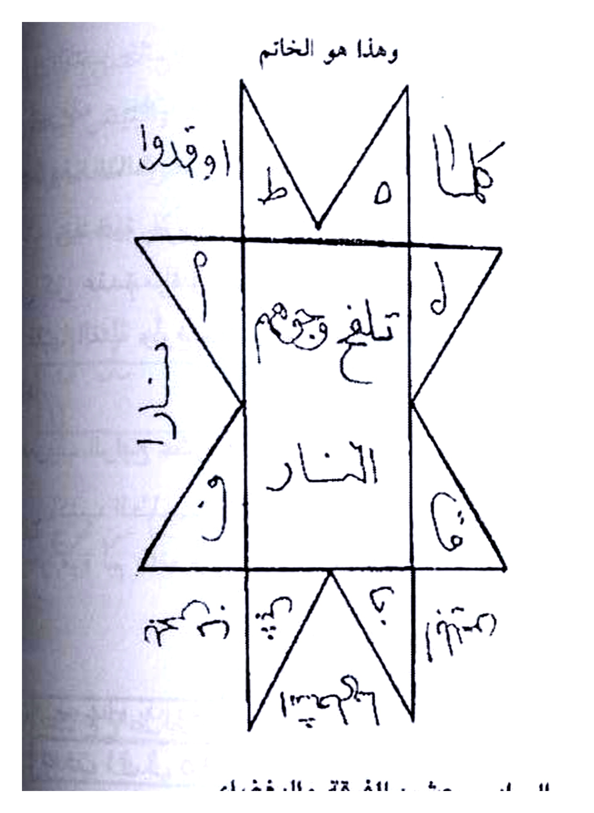
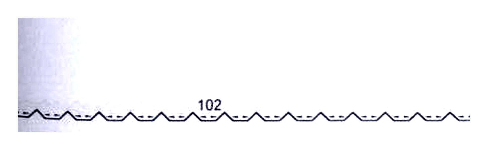

# Terjemahan Lengkap — Batch 21 — Halaman 102–106

---

## Halaman 102 — Tashrif Sadis 'Asyar (Furqah & Baghdha') + Khatam Bintang 8 & Arqam

### [Teks Arab Asli — Halaman 102]

```
وهذا هو الخاتم

[نجم ثماني مركب — قلب مستطيل في الوسط كتب فيه:
تلغغ وجهم — النار
وحول النجم مثلثات كتب فيها:
أعلى: كلاما — ط — ه — اوقدوا
يمين فوق: ل — ٩ — ٦ — د
يمين وسط: ل — ار — ق
يمين تحت: و — ٦ — ج
تحت: ٣٣ — ١٣٧ — ع — خ — ح
يسار تحت: و — ٩ — ح — خ — م — ق
يسار فوق: ح — م — ٣١ — ٢ — حكم]

التصريف السادس عشر: للفرقة والبغضاء
اكتب الطلسم الآتي يوم السبت على شقفة ويخرها ويبخرها ببخور
الشر واتل الدعوة عليها ٣ مرات والزجر مرة وادفنها أو رشها في
المكان فإنهم يفترقوا في الحال.

٩ ١١ ٩٩ ١ ٦١٩ ٩ ٨ ٦١٩ ٩
___________________________________
ط ١١٩ ١١٩ ١ ٩١ ١٩ ١١٩ ١١٩ ١ ١١ ٩ ١٦
عجلوا بالفراق
```

### [Terjemahan Indonesia — Halaman 102]

**Dan inilah Khatam (Cincin/Stempel)-nya** — lihat **Gambar Rajah Asli Halaman 102 (atas) — Khatam Bintang 8 (Najm Tsamani)**:

> **Keterangan Rajah:** Khatam berbentuk **bintang delapan bersusun** (dua persegi bertumpuk membentuk bintang) — di **jantung (mustathil di tengah)** tertulis `تلغغ وجمهم — النار (Talagha wa Jaham — An-Nar)` — di **segitiga-segitiga sekeliling** tertulis huruf dan angka terpisah: atas `كلاما ط هـ اوقدوا`, kanan atas `ل ٩ ٦ د`, kanan tengah `ل ار ق`, kanan bawah `و ٦ ج`, bawah `٣٣ ١٣٧ ع خ ح`, kiri bawah `و ٩ ح خ م ق` dan seterusnya — **cropping presisi 4× putih bersih** — lihat Gambar.

**Tashrif (Khasiat) Keenam Belas — Untuk Furqah (perceraian/perpecahan) dan Baghdha' (kebencian — *tafriq*).** Tulislah talisman berikut **pada hari Sabtu (*yaum As-Sabt*) di atas pecahan tembikar (*shaqfah*)**, panggang/bakar pecahan tersebut dan **asapi dengan bukhur syarr (kemenyan buruk — *bukhur untuk kejahatan/perpecahan — berlawanan dengan bukhur khair*)**, bacalah **ad-Da'wah 3 kali** dan **az-Zajr 1 kali**, lalu **kuburlah pecahan itu atau taburkan (percikkan) di tempat (orang-orang yang dituju)** — maka **mereka akan berpisah/benci seketika (*fa innahum yaftariqu fil hal*).**

Inilah talisman angka (lihat **Gambar Rajah Asli Halaman 102 (bawah) — Angka Furqah**):

> Baris atas: `٩ ١١ ٩٩ ١ ٦١٩ ٩ ٨ ٦١٩ ٩` — garis pemisah — baris bawah: `ط ١١٩ ١١٩ ١ ٩١ ١٩ ١١٩ ١١٩ ١ ١١ ٩ ١٦` — di bawah garis tertulis **`عجلوا بالفراق — Segerakanlah perceraian/perpecahan!`**

Waktu: Yaum Sabt — Bukhur: bukhur syarr — Qira'ah: 3× Da'wah + 1× Zajr — Media: shaqfah → dafn atau rasy.


*Gambar Rajah Asli Halaman 102 (atas) — Khatam Bintang 8 (Najm Tsamani) — Jantung `تلغغ وجمهم — النار` + huruf hijaiyah & angka sekeliling `كلاما ط هـ اوقدوا / ل ٩ ٦ د / ٣٣ ١٣٧` — untuk Tashrif Sadis 'Asyar Furqah/Baghdha' — yaum Sabt shaqfah bukhur syarr 3× — cropping presisi 4× putih bersih*


*Gambar Rajah Asli Halaman 102 (bawah) — Angka Furqah — `٩ ١١ ٩٩ ١ ٦١٩ ... / ط ١١٩ ١١٩ ... ١٦` + `عجلوا بالفراق` — daftar angka di shaqfah yaum Sabt — cropping presisi 4× putih bersih*

---

## Halaman 103 — Tashrif Sabi' 'Asyar (Hifz Dhar /Kanz) + Ta'thirat Miyah & Zayt

### [Teks Arab Asli — Halaman 103]

```
توكلوا يا خدام هذا الطلسم وفرقوا بين كذا وكذا الوحا٢ العجل٢ الساعة٢.
التصريف السابع عشر
من رسم الطلسم الآتي في خرقة زرقاء والقمر في برج مائي
ويبخره بالسندروس واتل عليه الدعوة ٧ مرات والزجر مرة وادفنه
في وسط مدينة أو دار فإنه لا يدخلها لص سارق ولا حيوان مؤذي
مثل الحيات والعقارب والسباع والصباح والفئران والوزغ ولا
يدخلها شيطان ولا تحرق ولا تهدم ولا يدخلها طاعون.
وإذا كتبت هذا الطلسم في إناء ومحي بماء البحر ورشته
في المكان الذي تشعل فيه النار فإنها تخمد لوقتها وتطفئ.
وإذا كتبته في إناء ومحوته بماء عذب وزيت طيب وسقيته
للمسموم والمحموم والمريض فإنه يبرأ لوقته بإذن الله تعالى.
وإذا كتبته في لوح من الرصاص ووضعته في المكان المتهم
بالخبية والكنز وتلوت عليه الدعوة ٧ مرات والزجر مرة ويبخرت
بالسندروس فإن الأرصاد تهرب وتنشق الأرض وينفتح باب الكنز
ولا يقل حتى تبطل تبخر البخور.
وهذا هو
فل ح مـهو ا و٩ ٧ و٩ا و ٩و٦
```

### [Terjemahan Indonesia — Halaman 103]

**Tawkil Tashrif 16:** *"Tawakkalu ya khuddam hadza at-thilasm, wa farriqu baina Fulan wa Fulan, al-waha 2 al-'ajal 2 as-sa'ah 2"* — **Wahai khadam talisman ini, pisahkanlah antara si Fulan dan si Fulan, segera cepat sekarang juga.**

**Tashrif Ketujuh Belas — Untuk Hifz (penjagaan) dari Pencuri, Hewan Buas, Setan, Kebakaran, Roboh, Tha'un & untuk Kanz (harta terpendam) — *manfa'at 'ammah*.**

Jika engkau **menggambar talisman berikut pada kain perca biru (*khirqah zarqa*) sedangkan bulan (*qamar*) berada di **buruj ma'i (zodiak berelemen air — *Sarathan / 'Aqrab / Hut*)**, diasapi dengan **sandarūs (lem damar sandarac — *sandarūs*)**, bacalah **ad-Da'wah 7×** dan **az-Zajr 1×**, lalu **kuburlah di tengah kota atau rumah** — maka **tidak akan memasukinya pencuri (*liss sariq*), hewan berbisa/buas seperti ular (*hayyat*), kalajengking (*'aqarib*), binatang buas (*siba'*), burung pembawa sial (*shabah*), tikus (*fi'ran*), cicak/cecak (*wazagh*), tidak pula setan (*syaithan*), tidak akan terbakar, tidak roboh, dan tidak dimasuki wabah tha'un (*tha'un — wabah sampar*).**

**Khasiat turunan (dengan talisman yang sama):**
1.  **Pemadam Api:** Jika engkau tulis talisman ini di **bejana (*ina'*)**, lalu **hapus dengan air laut (*ma' bahr*)** dan **percikkan di tempat yang menyala api** — maka **api akan padam seketika (*takhmud li-waqtiha wa tuthfa*)**.
2.  **Penawar Racun & Demam:** Jika engkau tulis di bejana, **hapus dengan air tawar (*ma' 'adzb*) dan minyak yang harum (*zayt thayyib*)**, lalu **beri minum kepada orang yang keracunan (*masmum*), demam (*mahmum*), atau sakit (*maridh*)** — maka **ia akan sembuh seketika dengan izin Allah Ta'ala (*yabra' li-waqtihi bi-idzni Allah*).**
3.  **Pembuka Kanz (harta terpendam dijaga khadam/rasad):** Jika engkau tulis pada **lempengan timbal (*lauh min ar-rashash*)** dan **letakkan di tempat yang dicurigai ada khabi'ah/kanz (harta terpendam)**, bacalah **ad-Da'wah 7×** dan **az-Zajr 1×** sambil **diasapi sandarūs** — maka **para penjaga (arshad — khadam penjaga kanz) akan lari, bumi terbelah, dan pintu kanz terbuka — dan tidak akan tertutup sampai engkau hentikan asap bukhur.**

**Dan inilah (talismannya)** — lihat **Gambar Rajah Asli Halaman 103 (bawah):**

> `فل ح مـهو ا و٩ ٧ و٩ا و ٩و٦` — satu baris tulisan tangan sambung berhimpit dengan angka `٧ و٩` — **cropping presisi 4× putih bersih** — untuk khirqah zarqa qamar buruj ma'i 7×.


*Gambar Rajah Asli Halaman 103 — Tashrif Sabi' 'Asyar (Hifz — Kanz) — `فل ح مـهو ا و٩ ٧ و٩ا و ٩و٦` — khirqah zarqa qamar buruj ma'i sandarus 7× — hifz liss hayyat tha'un + ithfa nar + ibtila hamm + fath kanz — cropping presisi 4× putih bersih*

---

## Halaman 104 — Tashrif Tsamin 'Asyar (Jalb Ba'id/Mahabbah 'Ammah) — Bathlimus

### [Teks Arab Asli — Halaman 104]

```
توكلوا يا خدام هذا الطلسم بكذا وكذا وإن الطلسم المذكور
هو من الحكيم بطليموس.
التصريف الثامن عشر
إذا أردت جلب من أي بلاد بعيدة أو قريبة سواء كان ذكراً
أو أنثى تكتب الطلسم المذكور في التصريف الرابع في قطعة من
النحاس الأصفر والقمر في برج ناري ثم تطلق البخور الجاوي
والسندروس وتتلو الدعوة ٧ مرات والزجر مرة وأنت رامي
النحاسة في النار فما تكمل العدد حتى يحضر المطلوب حتى يحضر المطلوب أمام طالبه
خاضعاً تائهاً ولا يقدر على فراقه ساعة واحدة ويأتي إلى طالبه
محمولاً ولو كان بالمشرق وطالبه بالمغرب وهذا من العجائب.
وإذا كتبت الطلسم المذكور في جلدة حمراء والقمر
والشمس في برج هوائي ويبخره بما تقدم وتتلو عليه الدعوة ٧
مرات والزجر مرة وحمله الطالب فكل من رآه أحبه ومال إليه
بالكلية وإذا أشار بيده على أحد تبعه ومشى خلفه تائهاً مجنوناً
وكل من كلمه من الناس أحبه ومال إليه على الدوام وذلك الطلسم
هو عن الحكيم بطليموس أيضاً.
التصريف التاسع عشر
وهو خاص بالطلسم المذكور في التصريف الخامس وهو
لجلب الحمام وسائر أنواع الطيور وجلب الوحوش وكل شيء
أردته وهذا الطلسم يستعمله رهبان الديور والقساوسة وهو
```

### [Terjemahan Indonesia — Halaman 104]

...*lanjutan tawkil Hal.103:* *"Tawakkalu ya khuddam hadza at-thilasm bi-kaza wa kaza, wa inna at-thilasm al-madzkur huwa min Al-Hakim Bathlimus (Bathlamyus/Ptolemy — ahli hikmah Yunani)"* — **Talisman tersebut berasal dari Al-Hakim Bathlimus.**

**Tashrif Kedelapan Belas — Untuk Jalb (mendatangkan) orang dari negeri jauh/dekat — laki-laki atau perempuan — *'ajibah*.**

Jika engkau ingin **mendatangkan seseorang dari negeri mana pun — jauh atau dekat — laki-laki atau perempuan**, tulislah **talisman yang telah disebutkan pada Tashrif Keempat** (yaitu talisman Jalb pada Hal.098 `و ع م و ق ...` / `طمجم...` — bukan talisman baru) pada **keping kuningan kuning (*qith'ah min an-nuhas al-ashfar*) sedangkan bulan (*qamar*) berada di **buruj nari (zodiak api — *Haml / Asad / Qaus*)**, lalu **lepaskan asap bukhur jawi dan sandarūs**, bacalah **ad-Da'wah 7×** dan **az-Zajr 1×** **seraya engkau melemparkan keping kuningan itu ke dalam api (*wa anta rami an-nuhasah fi an-nar*)** — maka **belum pun engkau sempurnakan hitungan, orang yang dituju akan hadir di hadapan pencarinya dalam keadaan tunduk kebingungan (*khadi'an ta'ihan*), tidak mampu berpisah satu jam pun, dan akan datang terangkut (seolah digotong) — walaupun ia di Timur dan pencarinya di Barat — dan ini termasuk keajaiban (*hadza min al-'aja'ib*).**

**Khasiat kedua (talisman sama, media berbeda — *mahabbah 'ammah*):** Jika engkau tulis talisman yang disebutkan itu pada **kulit (jild) berwarna merah (*jildah hamra*) sedangkan bulan dan matahari (*qamar wa syams*) berada di **buruj hawa'i (udara — *Jauza / Mizan / Dalu*)**, diasapi dengan bahan yang telah disebutkan, bacalah **ad-Da'wah 7×** dan **az-Zajr 1×**, lalu **dibawa oleh penuntut (thalib)** — maka **setiap orang yang melihatnya akan mencintainya dan condong sepenuhnya kepadanya, jika ia memberi isyarat dengan tangannya kepada seseorang, orang itu akan mengikutinya berjalan di belakangnya dalam keadaan bingung tergila-gila (*ta'ihan majnunan*), dan setiap orang yang diajak bicara akan mencintainya dan condong kepadanya selamanya.** Talisman ini juga **dari Al-Hakim Bathlimus.**

**Tashrif Kesembilan Belas — Khusus untuk talisman yang disebutkan pada Tashrif Kelima** (yaitu `طمجمبيطمهلها` pada Hal.098) — **untuk Jalb Burung Merpati, segala jenis burung, dan binatang buas — serta segala sesuatu yang engkau kehendaki.** Talisman ini **digunakan oleh para rahib biara (*ruhban ad-diyur*) dan pendeta (*qasawisah*)** — (lanjut Hal.105)

> **Catatan Rajah:** *Tidak ada Rajah baru yang di-crop pada Hal.104 — talisman yang dimaksud adalah talisman Tashrif 4 & 5 yang telah di-crop pada Hal.102–098 (`و ع م و ق` / `طمجم...`). Pada naskah hanya disebut `الطلسم المذكور في التصريف الرابع/الخامس`.*

---

## Halaman 105 — Jalb Thayr/Wahsy & Ta'thirat Jild Hamam/Saqr/Samak

### [Teks Arab Asli — Halaman 105]

```
تكتب الطلسم المذكور على جلد حمام يكون مدبوغاً والقمر في برج هوائي والشمس
في برج ناري وتبخره بالعود القاقلي والكافور وتتلو عليه الدعوة ٧ مرات والزجر مرة
وتدفن هذا الجلد في البرج فإن الحمام يجتمع عليه من يومها كالجرد المنتشر ولم
يزل يزدحم على ذلك البرج على الدوام ما دام الجلد مدفونا فيه.
وإذا كتبت الطلسم المذكور على جلد صقر بالرصد المذكور
والبخور المذكور وتتلو عليه الدعوة ٧ مرات والزجر مرة ثم
وضعته في رأسك وخرجت إلى الخلاء وتلوت الدعوة ثلاث مرات
ونشورت إلى الهواء فإن جميع أصناف الطيور تنزل أمامك لا عدد
لها فخذ منها ما أردت واترك ما أردت.
وإذا كتبت الطلسم المذكور على جلد سمك بالرصد المذكور
والبخور المذكور والتلاوة المذكور كما تقدم وربطت هذا الجلد
في حبل الشبكة من الأعلى فإن السمك يجتمع عليها من كل فج
عميق فيأخذ منه ما أراد.
التصريف العشرون
للمحبة الدائمة التي لا يضعف ناموسها إلى يوم القيامة وهو
منقول عن يوسع السيطي عليه السلام وهو أن تكتب الطلسم
المذكور في التصريف الثامن من لوح من النحاس الأصفر والشمس
في برج ناري والقمر في برج هوائي وتبخره بالعود والجاوي
واللبان الذكر وتتلو عليه الدعوة ٧ مرات والزجر مرة
```

### [Terjemahan Indonesia — Halaman 105]

**Lanjutan Tashrif 19 — Jalb Thayr/Wahsy:**

Tulislah talisman yang disebutkan pada **kulit burung merpati yang telah disamak (*jild hamam madbugh*) sedangkan bulan di buruj hawa'i dan matahari di buruj nari**, diasapi dengan **'ud qaquli (gaharu qaquli) dan kapur barus (*kafur*)**, bacalah **ad-Da'wah 7×** dan **az-Zajr 1×**, lalu **kuburlah kulit ini di dalam menara/buruj (tempat merpati)** — maka **burung merpati akan berkumpul di atasnya sejak hari itu seperti belalang yang menyebar (*ka-al-jarad al-muntasir*), dan senantiasa berdesakan di atas menara itu selamanya selama kulit masih terpendam di dalamnya.**

Jika engkau tulis talisman yang disebutkan pada **kulit burung elang/saqr (*jild saqr*) dengan rashi dan bukhur yang sama**, bacalah **7× + 1×**, lalu **letakkan di atas kepalamu (*wadha'tahu fi ra'sik*)** dan **keluarlah ke tanah lapang (*khala'*)**, bacalah **ad-Da'wah 3×** dan **kibaskan ke udara (*nasyarta ila al-hawa*)** — maka **semua jenis burung akan turun di hadapanmu tanpa terhitung jumlahnya — ambillah sekehendakmu dan tinggalkan sekehendakmu.**

Jika engkau tulis talisman tersebut pada **kulit ikan (*jild samak*) dengan rashi, bukhur, dan tilawah yang sama seperti di atas**, lalu **ikat kulit ini pada tali jaring dari bagian atas (*fi habli asy-syabakah min al-a'la*)** — maka **ikan akan berkumpul padanya dari setiap celah yang dalam (*min kulli fajjin 'amiq*) — ambillah sekehendakmu.**

**Tashrif Kedua Puluh — Untuk Mahabbah Daimah (cinta abadi) yang tidak melemah wibawanya sampai hari kiamat — *manqul 'an Yusha' As-Sayyithi 'alaihis salam (diriwayatkan dari Yusha' bin Nun / Yosua)*.**

Yaitu engkau **menulis talisman yang disebutkan pada Tashrif Kedelapan** (yaitu `و ع م و ق ...` dalam versi qith'ah nuhas) **pada lempengan kuningan kuning sedangkan matahari di buruj nari dan bulan di buruj hawa'i**, diasapi dengan **'ud, jawi, luban dzakar**, bacalah **ad-Da'wah 7×** dan **az-Zajr 1×** — (lanjut Hal.106)

> **Catatan Rajah:** *Hal.105 tidak ada Rajah baru — talisman yang dimaksud adalah talisman Hal.102 (nuhaasi) dan Hal.098 — mengulang media jild hamam/saqr/samak.*

---

## Halaman 106 — Tsamin 'Isyrin Lanjutan + Tashrif Hadi 'Isyrin (Hermes) — Qubul & Rizq

### [Teks Arab Asli — Halaman 106]

```
ويخيط عليه جلد أحمر ويحمله الطالب فإن المعمول له يصير
مجنوناً على الدوام من شدة المحبة ولا يقدر على فراقه طرفة
عين.
وإذا أردت جلب الخضرة ارم النحاسة في النار واتل
الدعوة ٣ مرات والزجر مرة فإن المعمول له يأتي له في الحضرة
لطالبه تائها لا يدري أين هو.
التصريف الحادي والعشرون
وهو عن هرمس الهرامسة وهو من العجائب لجلب المحبة
والقبول ونفاذ الكلمة على سائر المخلوقات وللطلسم الآتي
خواص نذكرها إن شاء الله تعالى وهو أن تكتب الطلسم على قطعة
حرير بين الحمرة والصفرة ويكون القمر والشمس في برج هوائي
وتبخره بالعود واللبان الذكر وتتلو عليه ٧ مرات والزجر مرة
وتخيط عليه جلد طاهر مدبوغ ويحمله الطالب على عضده الأيسر
فإن الأرزاق تتراكم عليه من غير سبب ولا تعب ولا يرى عمره
أبداً.
وإذا أردت ذلك وحملته ورأوك السلاطين والملوك عظموا
وقربوك منهم وتكون كلمتك نافذة على كل مخلوق وإذا قلت
كلاماً لا يستمعون غيره ولو جاء عليك ألف شاهد وترى من
التسهيل والفرج والأمور والبشر من كل جانب ولا يقربك حيران
مؤذي ولا حشرات وتهيبك الإنس والجن والسباع الضارة وانطلق
```

### [Terjemahan Indonesia — Halaman 106]

**Lanjutan Tashrif 20** — ...**lalu jahitkan di atasnya kulit merah (*jild ahmar*) dan bawalah oleh penuntut** — maka **orang yang dituju akan menjadi gila selamanya karena sangat cinta dan tidak mampu berpisah sekejap mata pun (*la yaqdiru 'ala firaqihi tharfata 'ain*).**

**Khasiat Jalb Khadhrah (sayuran/hijauan?):** Jika engkau ingin **mendatangkan khadhrah (hijauan/tumbuhan?)**, **lemparkan keping tembaga itu ke dalam api** dan bacalah **ad-Da'wah 3×** dan **az-Zajr 1×** — maka **orang yang dituju akan datang ke hadapan pencarinya dalam keadaan bingung tidak tahu di mana ia (*ta'ihan la yadri ayna huwa*).**

**Tashrif Kedua Puluh Satu — Dari Hermes Al-Haramisah (Hermes Trismegistus — *Harmas*) — Termasuk Keajaiban untuk Jalb Mahabbah, Qubul (diterima), dan Nafadz Kalimah (perkataan didengar) atas seluruh makhluk.**

Untuk talisman berikut — **akan disebutkan khasiatnya insya Allah — yaitu engkau menulis talisman pada sepotong sutra (*qith'ah harir*) yang berwarna **antara merah dan kuning (*baina al-humrah wa ash-shufrah*)** sedangkan **bulan dan matahari berada di buruj hawa'i**, diasapi dengan **'ud dan luban dzakar**, bacalah **7×** dan **az-Zajr 1×**, lalu **jahitkan di atasnya kulit yang suci yang telah disamak (*jild thahir madbugh*)** dan **bawalah oleh penuntut pada lengan atas kirinya (*'ala 'adhudihi al-aysar*)** — maka **rezeki akan bertumpuk kepadanya tanpa sebab dan tanpa lelah, dan selamanya tidak akan terlihat tua (*wa la yura 'umruhu abadan — awet muda*).**

Jika engkau menghendaki demikian dan membawanya, lalu **para sultan dan raja melihatmu, mereka akan mengagungkanmu dan mendekatkanmu**, **perkataanmu akan didengar oleh setiap makhluk, jika engkau berkata suatu perkataan, mereka tidak akan mendengarkan selain perkataanmu walaupun datang seribu saksi yang menentangmu**, engkau akan melihat **kemudahan, kelapangan, urusan-urusan, dan kabar gembira dari segala penjuru**, **tidak akan mendekatimu hewan berbisa yang mengganggu maupun serangga, dan engkau akan ditakuti oleh manusia, jin, dan binatang buas yang berbahaya — pergilah (*wanthaliq*)** — (lanjut Hal.107 khasiat rizq, qulub qasiah dll.)

> **Catatan Rajah:** *Hal.106 tidak ada Rajah baru — talisman yang dimaksud adalah talisman Hadi 'Isyrin yang akan di-crop pada Hal.107 (`فترع يو...`) — lihat Batch 22.*

---

**Selesai Batch 21 (Hal.102–106) — 5 halaman + 3 Rajah baru (102 star 472K + 102 numbers 66K + 103 script 32K) — Hal.104–106 mengulang talisman Tashrif 4/5/8 yang telah di-crop — Total progres 106 halaman (70%) — 99 Rajah HQ.**

*Sumber foto: `Picture 051.jpg` (102–103), `Picture 052.jpg` (104–105), `Picture 053.jpg` (106) — cropping presisi kotak Rajah, tanpa teks Arab sekitar, white clean 4× 300 DPI, contrast 1.6 brightness 1.15.*

