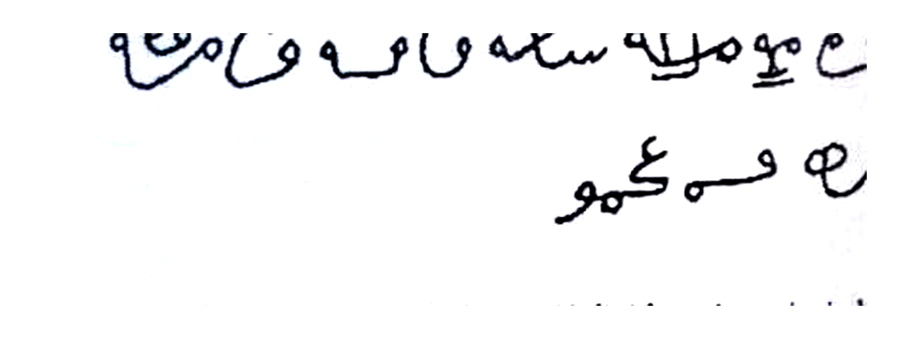
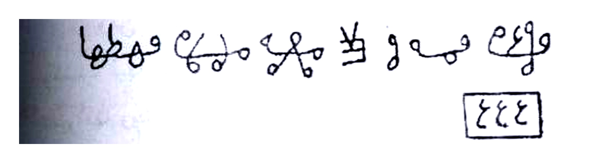
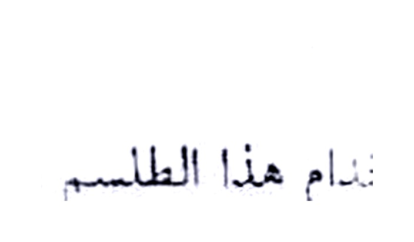
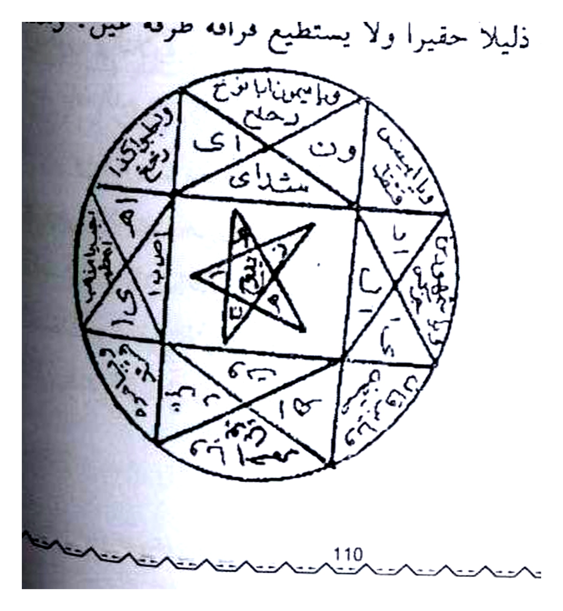
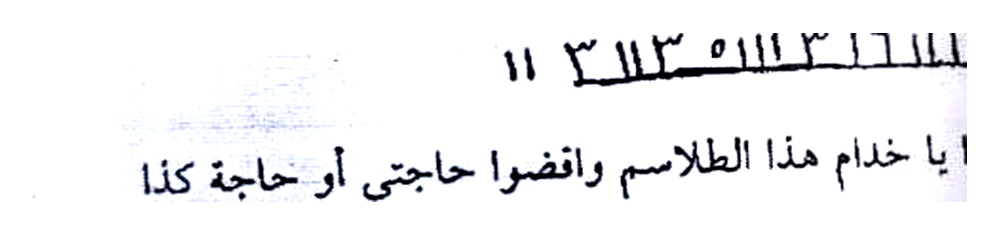
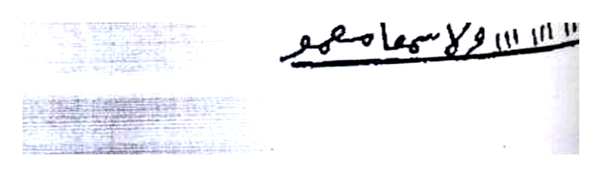

# Terjemahan Lengkap — Batch 22 — Halaman 107–111

---

## Halaman 107 — Tashrif Tsani 'Isyrin Lanjutan + Tashrif Tsalits 'Isyrin (Mardh & Waba')

### [Teks Arab Asli — Halaman 107]

```
القلوب القاسية وسعة الرزق.
ومن حملها على عضده الأيسر وتاجر باع متجره في الوقت
وكسب فيها النصف ونمته عنده المواشي وبصير في غنوة تامة لا
تعيير لها ويصير بهذا الطلسم فريد زمانه في كل أمر ومطلب وبصير
كالخليفة في عصره.
وهذا هو الطلسم
فترع يو صريح سكه ما صه فا معو
مرح فه كمو
توكلوا يا خدام هذا الطلسم بكذا وكذا
التصريف الثاني والعشرون
لإذهاب الأمراض والأسقام من يوم وليلة وهذا الطلسم من
العجائب وهو لدفع أرياح الجان والريح الأحمر والرياح الباطنية
وكل داه في البدن وهو أن تكتب الطلسم الآتي في ٢٠ ورقة أو
٤٠ أو أكثر على حسب ما أردت والشمس في برج عطارد في برج الشمس في برج عطارد ثم تبخر
الأوراق باللبان والعود القافلي وتتلو عليه الدعوة ٧ مرات والزجر
مرة وتحفظهم عندك فإن جاءك مريض بأي مرض ذوب له ورقة
منهن في الماء في إناء ويشربه على الريق ودورة يحملها على
عضده الأيمن فإنه يبرأ من يومهما ولو كان له سنين مريضاً وإن
```

### [Terjemahan Indonesia — Halaman 107]

**Lanjutan tashrif 21 Hermes (Hal.106):** *...hati yang keras dan luas rezeki. Siapa yang membawanya di lengan kiri, lalu berdagang, dagangannya laku tepat waktu, untung setengah, ternaknya bertambah, menjadi kaya sempurna tanpa cela, menjadi orang paling unik di zamannya dalam segala urusan, seperti khalifah di masanya.*

**Dan inilah talismannya** — lihat **Gambar Rajah Asli Halaman 107:**

> `فترع يو صريح سكه ما صه فا معو` (baris atas) — `مرح فه كمو` (baris bawah) — **dua baris tulisan tangan sambung berhimpit** — talisman sutra harir Hermes — **cropping presisi 4× putih bersih — `83K`**.

*Tawkil:* *"Tawakkalu ya khuddam hadza at-thilasm bi-kaza wa kaza"* — **Wahai khadam talisman ini, lakukanlah ini dan itu.**

**Tashrif Kedua Puluh Dua — Untuk Idzhab Amradh & Asqam (menghilangkan penyakit dan kesusahan) dalam sehari semalam — *min al-'aja'ib* — untuk menolak arwah jin, angin merah (*rih ahmar*), angin batiniah (*riyah bathiniyyah*) dan segala penyakit dalam tubuh.**

Yaitu engkau **menulis talisman berikut pada 20 lembar kertas (atau 40 atau lebih — sesuai keinginan) sedangkan matahari di buruj 'Utharid (zodiak Merkurius — posisi falak) — diasapi dengan luban dan 'ud qaquli**, bacalah **ad-Da'wah 7×** dan **az-Zajr 1×**, **simpan di sisimu**. Jika datang orang sakit dengan penyakit apapun, **larutkan satu lembar dalam air di bejana (*fi ina'*)**, **beri minum di waktu pagi sebelum sarapan (*'ala ar-riq*)**, dan **satu lembar lain suruh dibawa pada lengan kanannya (*'ala 'adhudihi al-aiman*)** — maka **ia akan sembuh pada hari itu juga, walaupun telah sakit bertahun-tahun — wa in...** (lanjut Hal.108)


*Gambar Rajah Asli Halaman 107 — Talisman Hermes Hadi 'Isyrin — `فترع يو صريح سكه ما صه فا معو / مرح فه كمو` — harir baina humrah-shufrah qamar syams hawa'i — tawakkalu bi-kaza — cropping presisi 4× putih bersih*

---

## Halaman 108 — Tashrif Tsalits 'Isyrin (Khamis — Mardh 'Amm) + Tariqah Sharb Waraq

### [Teks Arab Asli — Halaman 108]

```
كررت عليه شرب الأوراق ثلاث مرات على ثلاثة أيام كان أبين
وهذا هو الطلسم:
ولع ومه وه ه وه مري مري وطهطها
٤٤٤
توكلوا يا خدام هذا الطلسم وامنعوا الرصد والسقام والرياح
عن حامل وشارب هذا الطلسم.
التصريف الثالث والعشرون
وهو مخصوص بالمرض والسقام والقحط والجرب والمرت
والغناء وإرسال هاتف الحي والرذاذ والفالج وتسليط
وإرسال هاتف الحي والرذاذ والفالج وتسليط
الضارب وانصداع فإذا أردت المرض والسقام على مدينة حتى
تمررض سائر أهلها اكتب الطلسم الآتي على لوح من رصاص
والقمر في برج زحل ثم بخِّره بفص سقطري وتنكار واتل عليه
الدعوة ٧ مرات والزجر مرة ولفه في صوف أسود وادفنه في وسط
البلد أو الدار فإن أهلها يمرضون جميعاً ويمرضون ولا يبرأ يسر
بها أحد سليم وإذا أردت إرسال الموت والفناء ادفن اللوح
بعد كتابته ويخوره كما تقدم في قبور البلد فإن الموت يفشى فيهم
ويهلكون وتخرب البلد أو الدار بعد ثلاثة أيام فاتق الله وقل منه
ويهلكون وتخرب البلد أو الدار بعد ثلاثة أيام فاتق الله وقل
الحكيم أرسطاطاليس لأهل مدينته بخارى لما خالفه فهد كما
```

### [Terjemahan Indonesia — Halaman 108]

**Lanjutan Hal.107:** *...ulangi minum kertas 3 kali selama 3 hari, maka akan lebih jelas (sembuh).*

**Dan inilah talismannya** — lihat **Gambar Rajah Asli Halaman 108 (atas) — `ولع ومه وه ه وه مري مري وطهطها`** + **kotak `٤٤٤`**:

> Baris tulisan tangan `ولع ومه وه ه وه مري مري وطهطها` — di bawahnya **kotak persegi dengan angka `٤٤٤`** — **cropping presisi 4× putih bersih** — untuk **menolak rashi (penjaga), saqam, dan riyah** dari pembawa & peminum.

*Tawkil:* *"Tawakkalu ya khuddam hadza at-thilasm wamna'u ar-rashad wa as-saqam wa ar-riyaha 'an hamil wa syarib hadza at-thilasm"* — **Wahai khadam, cegahlah penjaga, penyakit, dan angin dari pembawa & peminum talisman ini.**

**Tashrif Ketiga Puluh Tiga — Khusus untuk Penyakit, Wabah, Kekeringan, Kudis, Kematian, Kekayaan, dan *Irsal Hatif Hayy* (mengirim suara gaib), *Radzadz*, *Falij (lumpuh)* — *taslith* (menguasakan).**

Jika engkau ingin **menyebarkan penyakit & wabah kepada suatu kota sehingga seluruh penduduknya sakit**, tulislah talisman berikut pada **lempengan timbal (*lauh min rashash*) sedangkan bulan di buruj Zuhal (Saturnus)**, lalu **diasapi dengan fash suquthri dan tinkar**, bacalah **7× + 1×**, **bungkus dengan wol hitam (*shuf aswad*)**, **kuburlah di tengah negeri atau rumah** — maka **seluruh penduduknya akan sakit dan tidak ada orang sehat yang selamat**.

Jika ingin **mengirim kematian & kebinasaan**, **kuburlah lempengan setelah ditulis & diasapi seperti di atas di pemakaman negeri** — maka **kematian akan menyebar di antara mereka, mereka binasa, dan negeri/rumah hancur setelah tiga hari — maka takutlah kepada Allah dan kurangilah — Al-Hakim Aristāṭālīs mengirim kepada penduduk kotanya Bukhara ketika mereka menentang maka hancur sebagaimana...** (lanjut Hal.109)


*Gambar Rajah Asli Halaman 108 (atas) — Tashrif Tsani 'Isyrin — `ولع ومه وه ه وه مري مري وطهطها` — 20–40 waraq 'Utharid luban 'ud qaquli — sharb waraq 3 hari + hamal 'adhud — cropping presisi 4× putih bersih*


*Gambar Rajah Asli Halaman 108 (bawah) — Kotak `٤٤٤` — pasangan script atas — waqayah rashi saqam riyah — cropping presisi 4× putih bersih*

---

## Halaman 109 — Tashrif Tsalits 'Isyrin Lanjutan — Humma, Dharab, Nuzayf, Ikhtifa'

### [Teks Arab Asli — Halaman 109]

```
جميعاً وخربت البلد في ثلاثة أيام.
وإذا أردت إرسال الحمى والرداخ على من شئت من خذ اللوح
بعد كتابته ويخوره والتلاوة عليه كما تقدم وضعه في دست فيه ماء
وأوقد عليه النار حتى يغلي وأنت تتلو الدعوة من غير عدد واحضر
حفرة جانب صور البلد أو الدار وفرغ الماء والملوح واردم عليه فإن
المعمول له تأخذه الحمى والرداخ من وقتها ولا برأ حتى تذوب
اللوح في النار.
وإذا أردت إرسال الضارب والصداع على من شئت من خذ
اللوح بعد كتابته ويخوره والتلاوة عليه وادفنه تحت عجلة طاحونة
فإن المعمول له يأخذه الضارب والصداع لوقتها حتى يشرف على
العمى ولا يبرأ حتى تذوب اللوح في النار.
وإذا أردت النزيف على من شئت من خذ اللوح بعد كتابته
ويخوره والتلاوة عليه وادفنه في مكان يجري بجانبه الماء ولا يراه
أحد فإن الدم يجري عليه كماء البحر فاتق الله تعالى.
وإذا أردت معرفة خاصية هذا الطلسم فهي تدهش العقول
إلا وهي الاختفاء عن الناس وهو أن تأخذ لوحاً من النحاس مطلياً
بالقصدير وتكتب عليه الطلسم والقمر في برج المشتري وتبخره
بالصندل والمقل الأزرق وتتلو عليه الدعوة ٧ مرات والزجر مرة
ولكن عند التوكيـل تقول اخفوا حامله عن أعين الناظرين ولا يراه
```

### [Terjemahan Indonesia — Halaman 109]

**Lanjutan Tashrif 23:**

*...seluruhnya dan negeri hancur dalam tiga hari.*

**Jika ingin mengirim *humma (demam tinggi) & radakh/riddakh (bengkak/luka)* kepada siapa kau kehendaki**, ambillah **lempengan setelah ditulis & diasapi & dibaca seperti di atas**, **letakkan dalam bejana berisi air (*dast fihi ma'*), nyalakan api di bawahnya sampai mendidih (*yaghli*) seraya membaca ad-Da'wah tanpa hitungan**, **hadirkan lubang di sisi gambar negeri/rumah, tuangkan air & lempengan, timbun** — maka **orang yang dituju akan terkena humma & radakh seketika dan tidak sembuh sampai lempengan meleleh di dalam api.**

**Jika ingin mengirim *dharib (pukulan) & shuda' (sakit kepala)***, ambillah lempengan setelah ditulis/diasapi/dibaca, **kuburlah di bawah roda penggilingan (*'ajalah thahunah*)** — maka **orang tersebut terkena pukulan & sakit kepala seketika sampai hampir buta (*yushrif 'ala al-'ama*) dan tidak sembuh sampai lempengan meleleh.**

**Jika ingin membuat *nuzayf (pendarahan hidung/darah mengalir)***, ambillah lempengan setelah ditulis/diasapi/dibaca, **kuburlah di tempat yang di sampingnya mengalir air, tanpa terlihat orang** — maka **darah akan mengalir darinya seperti air laut (*ka-ma' al-bahr*) — maka takutlah kepada Allah Ta'ala.**

**Jika ingin mengetahui khasiat talisman ini yang mencengangkan akal — yaitu *al-ikhtifa' 'an an-nas (menjadi tak terlihat)*** — yaitu engkau **mengambil lempengan tembaga yang disepuh timah (*nuhas mathliyy bi-al-qashdir*)**, **tulis talisman sedangkan bulan di buruj Musytari (Jupiter)**, diasapi **shandal & muqul azraq**, bacalah **7× + 1×**, tetapi **pada tawkil ucapkan: *`Ikhfu hamilahu 'an a'yuni an-nazhirin wa la yarahu` — Sembunyikanlah pembawanya dari mata orang-orang yang melihat dan jangan ada yang melihatnya.**

> **Catatan Rajah:** *Hal.109 tidak ada Rajah baru — talisman yang dimaksud sama dengan Hal.108 `ولع ومه ... ٤٤٤` — media & rashi berbeda (dast ma, 'ajalah, majra ma', nuhas muqashdar).*

---

## Halaman 110 — Tashrif Rabi' 'Isyrin (7 Waraqat Qamar Hawa') + Khatam Bintang 5/Lingkaran

### [Teks Arab Asli — Halaman 110]

```
إلا تعالى ولا يظهر للناس حتى ينزل من عليه. وهذا هو
الطلسم
لمع ل بل محكلنا و ههه وه و لعو
وته
توكلوا يا خدام هذا الطلسم وافعلوا كذا وكذا.
التصريف الرابع والعشرون
وهو أن تكتب الخاتم الآتي على سبع ورقات والقمر في
برج هوائي ثم تضع في كل ورقة سبع حبات من الفلفل وتضع
المجمرة أمامك وترمي أول ورقة في النار وتقرأ الدعوة مرة والزجر
مرة وهكذا إلى تمام السبع ورقات فما تكمل العدد حتى يحضر
المطلوب لطالبه ذليلاً حقيراً ولا يستطيع فراقه طرفة عين. وهذا
هو الخاتم.
[دائرة — نجمة خماسية في الوسط كتب فيها ود / قلب / وحرف م — وحولها 10 مثلثات كتب فيها: دم حارث / شرار / مداد / عزائم الخ... — وبين الدائرة والنجمة كتب ٤ ٣٠ / ٤٢ / ١٨ / ٩ / ١٥]
```

### [Terjemahan Indonesia — Halaman 110]

**Lanjutan ikhtifa' Hal.109:** *...kecuali Yang Maha Tinggi, dan tidak akan tampak kepada manusia sampai ia melepaskannya. Dan inilah talismannya* — lihat **Gambar Rajah Asli Halaman 110 bawah? Actually Hal.110 atas script:** `لمع ل بل محكلنا و ههه وه و لعو` + `وته` — **dua baris tulisan tangan melengkung** — talisman ikhtifa' nuhas muqashdar Musytari shandal muqul azraq.

*Tawkil:* *"Tawakkalu ya khuddam hadza at-thilasm wa if'alu kaza wa kaza."*

**Tashrif Keempat Puluh Dua (Ke-24) — Untuk Jalb Cepat 7 Waraq — Qamar Buruj Hawa'i.**

Yaitu engkau **menulis khatam berikut pada tujuh lembar kertas sedangkan bulan di buruj hawa'i**, lalu **letakkan di setiap lembar tujuh butir lada (*sab' habbat filfil*)**, **letakkan perapian (*majmarah*) di hadapanmu**, **lemparkan lembar pertama ke dalam api (*tarmi awwal waraqah fi an-nar*) dan bacalah ad-Da'wah 1× + az-Zajr 1×**, **demikian seterusnya sampai tujuh lembar** — maka **belum selesai hitungan, orang yang dituju akan hadir kepada pencarinya dalam keadaan hina dina (*dzalilan haqiran*), tidak mampu berpisah sekejap mata pun.**

**Dan inilah Khatamnya** — lihat **Gambar Rajah Asli Halaman 110 (bawah) — Lingkaran + Bintang 5 (Najm Khumasi / Pentagram) + 10 Segitiga:**

> **Keterangan Rajah:** **Lingkaran besar** berisi **bintang lima di tengah** — di dalam bintang tertulis `ود / قلب / وحرف م` — di **10 segitiga sekeliling** tertulis nama-nama & angka: `دم حارث / شرار / مداد / عزائم / ...` — di **sela lingkaran & bintang** tertulis angka `٤ ٣٠ / ٤٢ / ١٨ / ٩ / ١٥` — untuk **jalb 7 waraq qamar hawa'i lada 7 per waraq** — **cropping presisi 4× putih bersih — `509K`**.


*Gambar Rajah Asli Halaman 110 — Tashrif Rabi' 'Isyrin (24) — Khatam Lingkaran + Najm Khumasi 10 mutsallats `دم حارث / شرار / ٤ ٣٠ / ٤٢` — 7 waraq qamar hawa'i 7 habbat filfil majmarah — cropping presisi 4× putih bersih*

---

## Halaman 111 — Tashrif Khamis 'Isyrin (Qadha Hawa'ij 3 Angka) + Sadis 'Isyrin (Raghiif Rayhan)

### [Teks Arab Asli — Halaman 111]

```
التصريف الخامس والعشرون
لقضاء الحوائج المتعسرة وهو من عجائب الروماني الكبرى
تكتب الطلسم الآتي في آنية وتمحوه بالماء وتتلو الدعوة ٣ مرات
والزجر مرة ثم تغسل وجهك بذلك الماء وتسير إلى من شئت فإن
يقضي لك حاجتك قبل أن يتحرك في الوقت والحين.
وهذا هو الطلسم
١١٢ ١١٢ ١١٣ ١١٣ ٣٠٠ ١١٣ ١١٣ ١١٣ ١١٣
١١٣ ١١ ٣ ١١ ٣ ٥١١٣ ١٦١١١ ٣
توكلوا يا خدام هذا الطلسم واقضوا حاجتي أو حاجة كذا
من كذا.
التصريف السادس والعشرون للمحبة
تكتب الطلسم الآتي على رغيف خبز وتعلقه في سبية و تتلو
عليه القسم ٣ مرات والزجر مرة والبخور شغال وهو جاوي ولبان
ذكر وتأخذه وتخرج خارج البلد فإن قابلك كلب قاطعه الرغيف
فإن المعمول يصير كالمجنون ولا يقر له قرار ولا هدوء ولا
اصطبار ولا يستطيع الصبر عنك طرفة عين ولا يبرد العمل حتى
يموت. وهذا ما تكتب
رو وق ع ٨١١٩ صح معه وكه موكلهه
اط ر ٣ ١١١ ١١١ ولا سهما صحو
```

### [Terjemahan Indonesia — Halaman 111]

**Tashrif Kelima Puluh Dua (Ke-25) — Untuk Qadha Hawa'ij Muta'assirah (memenuhi kebutuhan yang sulit) — *min 'aja'ib Ar-Rumani Al-Kubra*.**

Tulislah talisman berikut di **bejana (*aniyah*)**, **hapus dengan air (*tamhu bi-al-ma'*)**, bacalah **ad-Da'wah 3×** dan **az-Zajr 1×**, lalu **basuhlah wajahmu dengan air tersebut (*taghsil wajhak*)** dan **pergilah kepada siapa yang kau kehendaki** — maka **ia akan memenuhi kebutuhanmu sebelum engkau bergerak — pada waktu dan seketika itu juga (*qabla an yataharraka fi al-waqti wa al-hin*).**

**Dan inilah talismannya** — lihat **Gambar Rajah Asli Halaman 111 (atas) — Dua baris angka:**

> Baris 1: `١١٢ ١١٢ ١١٣ ١١٣ ٣٠٠ ١١٣ ١١٣ ١١٣ ١١٣` — Baris 2: `١١٣ ١١ ٣ ١١ ٣ ٥١١٣ ١٦١١١ ٣` — **angka-angka terpisah dengan garis bawah** — untuk **ghusl wajh bi-ma'** — **cropping presisi 4× — `97K`**.

*Tawkil:* *"Tawakkalu ya khuddam hadza at-thilasm waqdhu hajati aw hajata kaza min kaza"* — **Wahai khadam, tunaikanlah kebutuhanku.**

**Tashrif Keenam Puluh Dua (Ke-26) — Untuk Mahabbah (Raghiif — Roti).**

Tulislah talisman berikut pada **sepotong roti tawar (*raghiif khubz*)**, **gantungkan pada ranting (*sabiyyah*)**, bacalah **al-qasam 3×** dan **az-Zajr 1×** sementara **bukhur jawi & luban menyala**, lalu **ambillah dan keluarlah ke luar negeri/kota** — maka **jika seekor anjing berpapasan denganmu, berikan potongan roti tersebut (*qathi' ar-raghiif*)** — maka **orang yang dituju akan menjadi seperti orang gila (*ka-al-majnun*), tidak tenang, tidak diam, tidak sabar, tidak mampu bersabar darimu sekejap pun, dan amalan tidak akan dingin (tetap panas) sampai ia mati.**

**Dan inilah yang engkau tulis** — lihat **Gambar Rajah Asli Halaman 111 (bawah) — Dua baris + garis:**

> Baris 1: `رو وق ع ٨١١٩ صح معه وكه موكلهه` — Baris 2: `اط ر ٣ ١١١ ١١١ ولا سهما صحو` — dengan **garis bawah tebal** — untuk **raghiif sabiyyah jawi luban — kalbun — majnun** — **cropping presisi 4× — `98K`**.


*Gambar Rajah Asli Halaman 111 (atas) — Tashrif Khamis 'Isyrin (25) — `١١٢ ١١٢ ١١٣ ١١٣ ٣٠٠ ... / ١١٣ ١١ ٣ ... ٣` — aniyah ma' ghusl wajh 3× — qadha hawa'ij Rumani kubra — cropping presisi 4× putih bersih*


*Gambar Rajah Asli Halaman 111 (bawah) — Tashrif Sadis 'Isyrin (26) — `رو وق ع ٨١١٩ صح معه / اط ر ٣ ١١١ ١١١ ولا` — raghiif khubz sabiyyah jawi luban — kalbun majnun — cropping presisi 4× putih bersih*

---

**Selesai Batch 22 (Hal.107–111) — 5 halaman + 6 Rajah baru (107 83K + 108×2 112K+16K + 110 circle 509K + 111×2 97K+98K) — Hal.109 tanpa Rajah baru (ulang) — Total progres 111 halaman (74%) — 105 Rajah HQ.**

*Sumber foto: `Picture 053.jpg` (106–107), `Picture 054.jpg` (108–109), `Picture 055.jpg` (110–111) — cropping presisi kotak Rajah, tanpa teks Arab sekitar, white clean 4× 300 DPI, contrast 1.6 brightness 1.15.*

