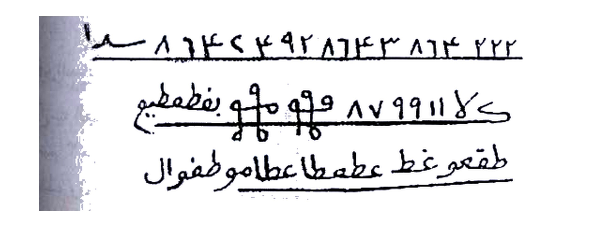
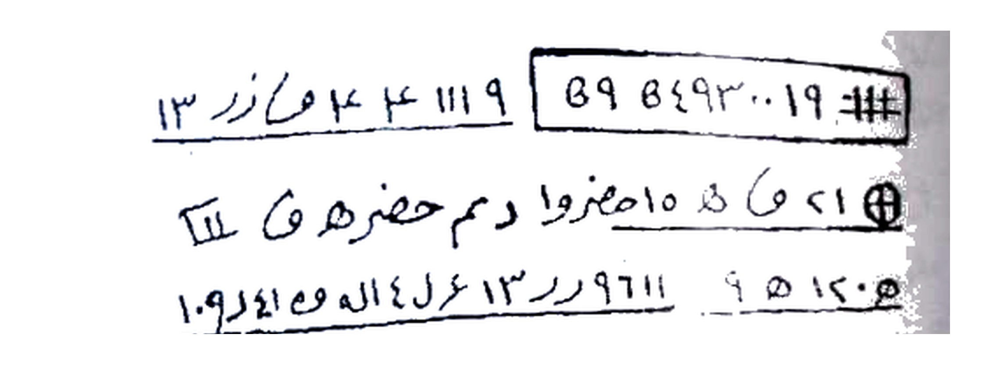
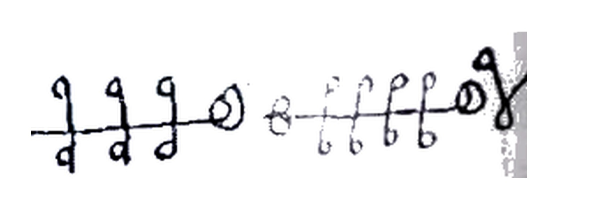
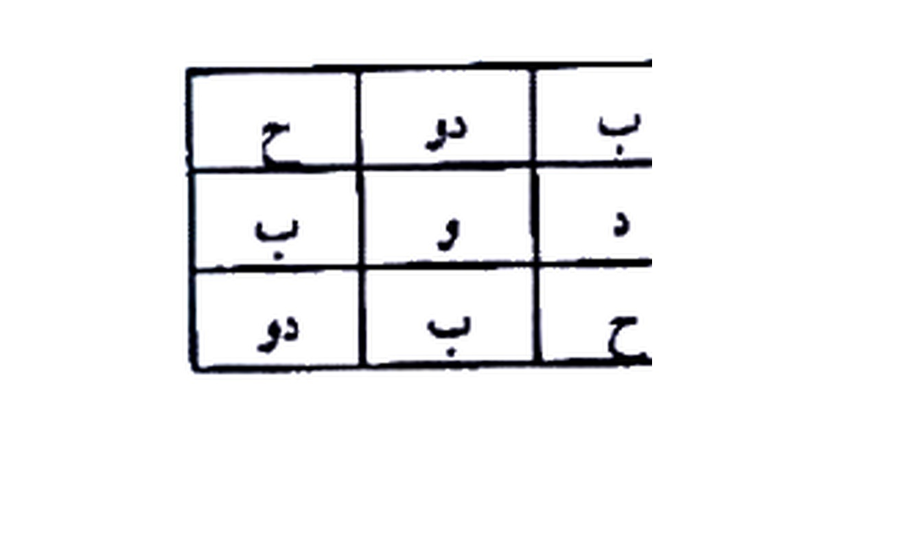
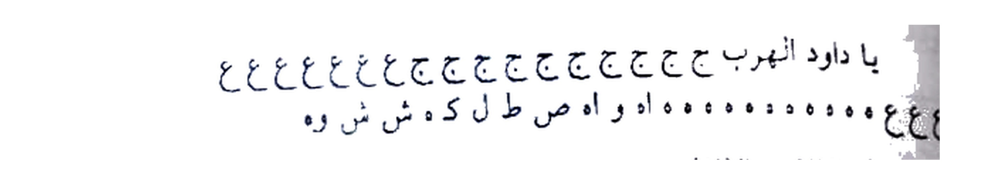
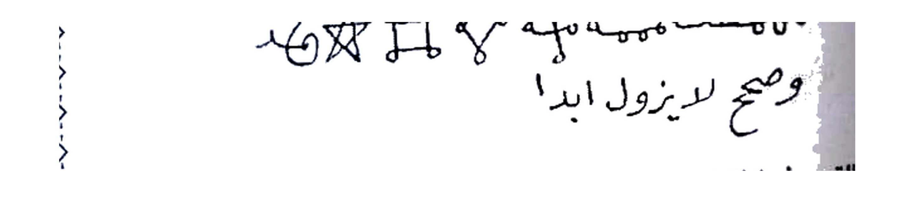
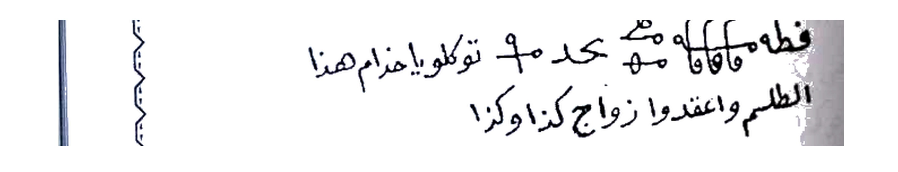
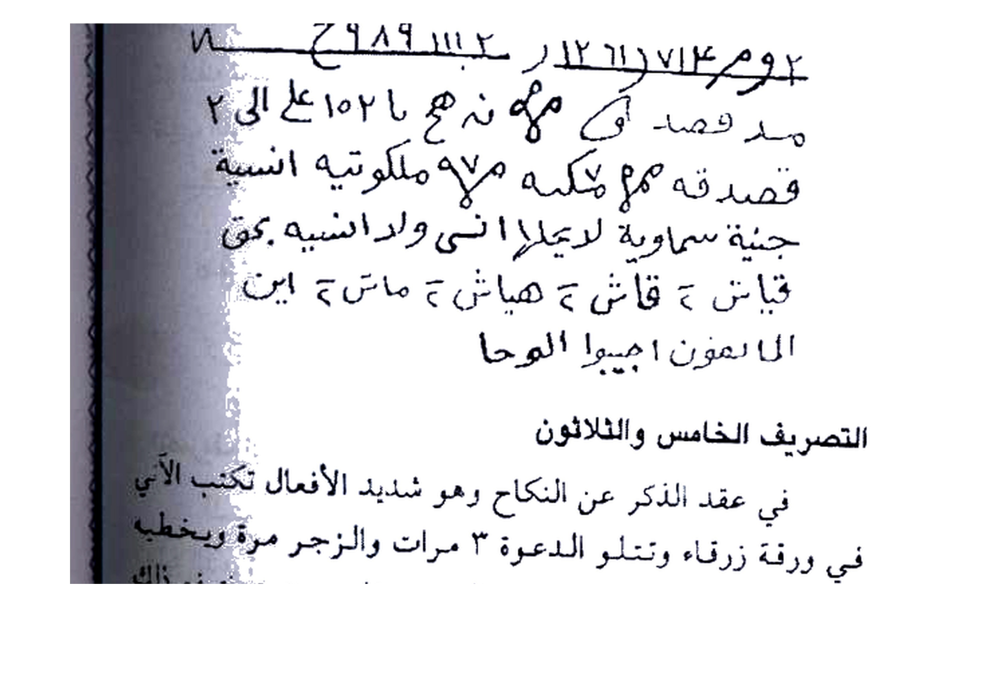
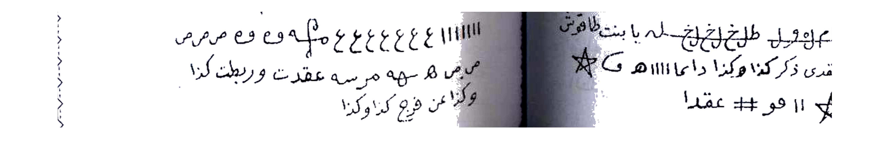

# Terjemahan Lengkap — Batch 23 — Halaman 112–116

---

## Halaman 112 — Tashrif Sabi' 'Isyrin (27) Mahabbah Da'imah Zaujain + Tashrif Tsamin 'Isyrin (28) Jalb Waqti Sham'ah — Picture 056 kanan

### [Teks Arab Asli — Halaman 112]

```
بحق هذه الأحرف والأسماء العظام أن تجلبوا وتهيجوا كذا
بني كذا وكذا.

التصريف السابع والعشرون
للمحبة الدائمة بين المرأة وزوجها وهو من العجائب الكبرى
تكتب الطلسم الآتي في آنية وتذيبه بماء وتقرأ عليه القسم ثلاث
مرات والزجر مرة والبخور شغال وهو جاوى ولبان ذكر وترشه في
طريق المطلوب فعندما خطاه اشتعلت نار المحبة في فؤاده ولا
يستطيع الفراق طرفة عين ويجب في ذلك تجديد العمل في كل
شهر.

وهذا ما تكتب
٢٢٢ ٤ ٨٦٣ ٨٦٢٤٩ ٢٤١٦٨ سد ا
لا ٨٧ ٩٩١١ ك و و و و و و و و و و بفطمطيم
طقعوع غط عطعا عطاما وطفوال
الوحا الوحا العجل العجل الساعة الساعة.

التصريف الثامن والعشرون
للجلب الوقتي وهو من العجائب الكبرى تكتبـه على شمعة
اسكندراني وتوقدها والبخور عمال وهو جاوى ولبان ذكر وتتلو
```

> **Catatan Rajah Hal.112:** Tiga baris tulisan tangan bergaris bawah — baris 1: `٢٢٢ ٤ ٨٦٣ ٨٦٢٤٩ ٢٤١٦٨ سد ا` — baris 2: `لا ٨٧ ٩٩١١ ... و و و و بفطمطيم` dengan simbol loop `فطمطيم` — baris 3: `طقعوع غط عطعا عطاما وطفوال` — semua dengan garis bawah — untuk Tashrif 27 Mahabbah Da'imah.

### [Terjemahan Indonesia — Halaman 112]

**Tawkil (taukil — penugasan khadam) sebelumnya (lanjutan Hal.111):** *"...dengan hak huruf-huruf dan nama-nama agung ini agar kalian mendatangkan (tajlibu) dan membangkitkan gairah (tuhayyiju) si fulan bin fulanah terhadap si fulanah binti fulanah — sebut namanya."*

**Tashrif Ketujuh Puluh Dua (Ke-27) — Untuk Mahabbah Da'imah (kasih sayang yang langgeng) antara seorang wanita dan suaminya — *wa huwa min al-'aja'ib al-kubra* (termasuk keajaiban yang sangat besar).**

Caranya: **tulislah talisman berikut di dalam bejana (*aniyah*)**, **hapus tulisan itu dengan air (*tudzibuhu bi-ma'*)**, **bacalah al-qasam (sumpah) 3 kali dan az-zajr (hardikan) 1 kali**, sementara **bukhur (dupa) tetap menyala — yaitu jawi dan luban dhakar (kemenyan laki-laki)**. Kemudian **percikkan air itu di jalan yang dilalui orang yang dituju (*turusysyuhu fi thariq al-mathlub*)**. Maka **ketika ia melangkahkan kakinya di atas percikan itu, menyalalah api cinta di hatinya (*isyta'alat nar al-mahabbah fi fu'adihi*)**, **ia tidak mampu berpisah sekejap mata pun (*la yastathi' al-firaq tharfata 'ain*)**, dan **wajib memperbarui amalan ini setiap bulan (*tajdid al-'amal fi kulli syahr*)**.

**Dan inilah yang engkau tulis** — lihat **Gambar Rajah Asli Halaman 112 (3 baris):**

> **Baris 1:** `٢٢٢ ٤ ٨٦٣ ٨٦٢٤٩ ٢٤١٦٨ سد ا` — **angka `٢٢٢` berulang, `٤`, `٨٦٣` dll dengan tanda `سد ا` di ujung** — garis bawah tebal.
> **Baris 2:** `لا ٨٧ ٩٩١١ ... و و و و بفطمطيم` — **angka `لا ٨٧ ٩٩١١` + rangkaian loop `و و و و` + kata kunci `بفطمطيم` (Bithamthamim — nama khadam)** — garis bawah.
> **Baris 3:** `طقعوع غط عطعا عطاما وطفوال` — **kata `طقعوع غط عطعا عطاما وطفوال` (Thaq'u ghatha atha'a athama wa thafwal — asma' ruhaniyyah)** — garis bawah.
> **Cropping presisi 4× putih bersih — `254K` — tanpa teks cetak `وهذا ما تكتب` atau `الوحا...` — hanya raj ah handwritten.**

*Tawkil di bawah raj ah:* *"Al-Waha Al-Waha Al-'Ajal Al-'Ajal As-Sa'ah As-Sa'ah"* — **Segeralah, segerakanlah, waktunya sekarang!**

**Tashrif Kedelapan Puluh Dua (Ke-28) — Untuk Jalb Waqti (mendatangkan yang bersifat sementara) — juga *min al-'aja'ib al-kubra*.**

Tulislah talisman ini **pada lilin Iskandarani (*sham'ah Iskandaraniyyah* — lilin ala Alexandria)** dan **nyalakan lilin itu**, sementara **bukhur tetap menyala — yaitu 'ammal (kemenyan 'ammal), jawi, dan luban dhakar**. Lalu **bacalah...** (lanjutan Hal.113: ...ad-da'wah 3x + zajr 1x, maka sebelum sempurna bilangan, orang yang dituju hadir dalam keadaan bingung (*hayran*)).


*Gambar Rajah Asli Halaman 112 — Tashrif Sabi' 'Isyrin (27) — `٢٢٢ ٤ ٨٦٣ ٨٦٢٤٩ ٢٤١٦٨ / لا ٨٧ ٩٩١١ بفطمطيم / طقعوع غط عطعا` — aniyah ma' rashsh thariq jawi luban dhakar 3× + 1× tajdid syahr — cropping presisi 4× putih bersih 300 DPI*

---

## Halaman 113 — Lanjutan Tashrif 28 + Tashrif Tasi' 'Isyrin (29) Mahabbah Sari'ah Nar Jum'ah + Khatam Loop — Picture 056 kiri

### [Teks Arab Asli — Halaman 113]

```
الدعوة ٣ مرات والزجر مرة فما تكمل العدد إلا وقد حضر
المطلوب حيرانا.
وهذا ما تكتب
# ١٩٠٠٣٤٩٨٩ ٨٩  ٩ ١١١ ٤ ٤ ١١١٩
١٢ ١٤ ق هـ ٥ اهمروا دم حفره ق هـ III
٩ ٥ ١٤٠٥  ٩ ٦١١١ ر ٣ ١٣ ع٤ ل اله وع ١٠٩ ا و
توكلوا يا خدام هذه الأحرف والطلاسم واجلبوا كذا إلى كذا
هذه الساعة.
التصريف التاسع والعشرون
للمحبة السريعة والجلب الوقتي تكتب الطلسم الآتي في
ورقة وتحملها الورقة لبان ذكر وترميها في النار ليلة الجمعة وتتلو
عليها الدعوة ٣ مرات والزجر مرة فما يتم حرق الورقة إلا ويحضر
المطلوب تائها لا يدري أين هو. وهذا هو الطلسم
م هـ ١١١١ هـ ١١١١ هـ ٥ و و و و و مه
٥ هـ ٨ ٦٦٦٦ هـ ١١١١ هـ ١١١١
[table 3x3 :]
| ح | دو | ب |
| ب | و | د |
| دو | ب | ح |
وتكتب هذا الخاتم وحوله التوكيل
توكلوا يا خدام هذه الطلاسم واجلبوا كذا إلى كذا.
```

> **Catatan Rajah Hal.113:** Dua kelompok — (atas) 3 baris angka ` # ١٩٠٠٣٤٩٨٩ ٨٩ / ١٢ ق هـ ٥ ... دم حفره / ٩ ٥ ١٤٠٥ ... ١٠٩ ا و` dengan kotak `# ١٩٠٠٣٤٩٨٩ ٨٩` dan simbol `⊕` — (bawah) loops `م هـ ١١١١ هـ ... مه` + tabel 3×3 `ح | دو | ب / ب | و | د / دو | ب | ح`.

### [Terjemahan Indonesia — Halaman 113]

**Lanjutan Tashrif 28 (Hal.112):** *...bacalah ad-da'wah 3 kali dan az-zajr 1 kali, maka tidaklah sempurna bilangan itu kecuali orang yang dituju telah hadir dalam keadaan bingung (hairan) — tidak tahu ke mana harus pergi.*

**Dan inilah yang engkau tulis (Tashrif 28 — Jalb Waqti Sham'ah Iskandarani)** — lihat **Gambar Rajah Asli Halaman 113 (atas):**

> **Baris 1:** `# ١٩٠٠٣٤٩٨٩ ٨٩` di dalam **kotak persegi** + `٩ ١١١ ٤ ٤ ع ١٤ رز ما ز` di kiri kotak — **garis bawah**.
> **Baris 2:** `⊕ ٢١ ق هـ ٥ اهمروا دم حفره ق هـ III` — **simbol salib melingkar `⊕` + `٢١ ق هـ ٥ ... دم حفره`** — garis bawah.
> **Baris 3:** `٩ ٥ ١٤٠٥ ٩ ٦١١١ ر ٣ ١٣ ع٤ل اله وع ١٠٩ ا و` — **rangkaian angka `٩ ٥ ١٤٠٥` dan `٩ ٦١١١ ر ٣ ١٣` + `اله وع`** — garis bawah.
> **Cropping presisi 4× — `191K` — hanya handwritten, tanpa `وهذا ما تكتب` atau tawkil cetak.**

*Tawkil 28:* *"Tawakkalu ya khuddam hadzihi al-ahruf wa ath-thalasim wa ajlibu kaza ila kaza hadzihi as-sa'ah"* — **Wahai khadam huruf-huruf dan talisman ini, datangkanlah si A kepada si B sekarang juga.**

**Tashrif Kesembilan Puluh Dua (Ke-29) — Untuk Mahabbah Sari'ah (kasih sayang cepat) dan Jalb Waqti.**

Tulislah **talisman berikut pada selembar kertas (*waraqah*)**, **beri luban dhakar pada kertas itu**, **lemparkan ke dalam api pada malam Jum'at (*turmiha fi an-nar laylat al-jumu'ah*)** dan **bacalah di atasnya ad-da'wah 3 kali + az-zajr 1 kali**. Maka **tidaklah sempurna kertas itu terbakar kecuali orang yang dituju hadir dalam keadaan linglung (*ta'ihan la yadri aina huwa* — bingung tidak tahu di mana ia berada).**

**Dan inilah talismannya** — lihat **Gambar Rajah Asli Halaman 113 (tengah & bawah):**

> **Rajah Tengah — Loops:** `م هـ ١١١١ هـ ١١١١ هـ ٥ ... مه` — dua segmen: kanan `مه ١١١١ هـ ١١١١ هـ` dengan **5 loop kecil di bawah garis**, kiri `٥ هـ ٨ ٦٦٦٦ هـ ١١١١` — **simbol `ع` kecil di ujung garis** — **cropping 4× — `60K` — khusus loops.**

> **Rajah Bawah — Tabel Khatam 3×3:** Tabel kotak **3 baris × 3 kolom**:
> - Baris 1: `ح | دو | ب`
> - Baris 2: `ب | و | د`
> - Baris 3: `دو | ب | ح`
>  **Huruf bermakna** — `ح = ha'`, `دو = duw`, `ب = ba'`, `و = waw`, `د = dal` — susunan wafaq huruf untuk mahabbah sari'ah — **cropping 4× — `77K` — tabel saja tanpa tawkil cetak di kanan.**

*Tawkil Khatam 29 (tertulis di sekeliling tabel):* *"Wa tuktaba hadza al-khatim wa haulahu at-tawkil — Tawakkalu ya khuddam hadzihi ath-thalasim wa ajlibu kaza ila kaza"* — **Tulis khatam ini dan di sekelilingnya tulis tawkil: Wahai khadam talisman ini...**


*Gambar Rajah Asli Halaman 113 (atas) — Tashrif Tsamin 'Isyrin (28) — ` # ١٩٠٠٣٤٩٨٩ ٨٩ / ٢١ ق هـ ٥ اهمروا دم حفره / ٩ ٥ ١٤٠٥ ٩ ٦١١١ ر ٣` — sham'ah Iskandarani jawi luban dhakar — cropping presisi 4× putih bersih*


*Gambar Rajah Asli Halaman 113 (tengah) — Tashrif Tasi' 'Isyrin (29) — Loops `م هـ ١١١١ هـ / ٥ هـ ٨ ٦٦٦٦` — waraqah luban dhakar nar laylat jumu'ah — cropping presisi 4×*


*Gambar Rajah Asli Halaman 113 (bawah) — Tashrif 29 Khatam Tabel — `ح | دو | ب / ب | و | د / دو | ب | ح` — khatam wa haulahu tawkil — cropping presisi 4× putih bersih*

---

## Halaman 114 — Tashrif Tsalatsun (30) Maqah Rajul 'an Zawaj & Zina + Tashrif Hadi Tsalatsun (31) Maqah Mar'ah Baydhah Qabr — Picture 057 kanan

### [Teks Arab Asli — Halaman 114]

```
التصريف الثلاثون
لماقة الرجل عن الزواج وهنوطه عن الزنى والحرام تكتب
الطلسم الآتي على شيء من أثره وتعلق الأثر في السبية أغلى بخور
المفقل والحنتـيت وتتلو الدعوة ٣ مرات والزجر مرة ثم تضع الأثر
في زجاجة صغيرة وتسد عليها بزفت وادفنها في بيت المطلوب فإن
كنت موكلاً بالمنع عن الزنى فإنه لا يزني أبداً ويمنع عن اتباع
شهوات وإن كنت موكلاً بالاثنين فلا مانع .
وهذا هو الطلسم
ولولوا رادو الموج لدبموا لم عرة وق ي كاق عيوا
مع القاعمين ثقف ١١١ م # ١١١٦ هـ ١١١١ # ١١١٦ مرانع ما
ن ع ي من ع كذا وكذا
عن الزواج أو الزنا
والحرام
صمد لا ومو هي حه
ميع دع والاسمها
مرانع ☆ مرانع
التصريف الحادي والثلاثون
لماقة المرأة عن الزواج والحرام كذلك تكتب الطلسم الآتي
على بيضة بنت يومها ويكون ذلك يوم الخميس وتطلق البخور مقل
وحنتـيت وتتلو القسم ٣ مرات والزجر مرة ثم تدفنها في قبر لا يزار
فإن المعمول له لا يتزوج أبداً وإن دامت البيضة مدفونة بذلك القبر
٩٠ صباحاً فإنه ينعقد بالكلية ولا يتزوج إلى يوم القيامة.
```

> **Catatan Rajah Hal.114:** Dua kelompok — (atas) 2 baris `ولولوا رادو الموج ... / مع القاعمين ثقف ١١١ م # ١١١٦ ... مرانع ☆ ما` — (bawah) kotak `صمد لا ومو هي حه / ميع دع والاسمها / مرانع ☆ مرانع` + di kanan `ن ع ي من ع كذا وكذا عن الزواج أو الزنا والحرام`.

### [Terjemahan Indonesia — Halaman 114]

**Tashrif Ketiga Puluh (30) — Untuk Maqah (menahan/menghalangi) seorang laki-laki dari pernikahan dan menjatuhkannya dari zina & haram (artinya: membuatnya tidak mampu menikah dan tidak mampu berzina — penghalang syahwat).**

Tulislah **talisman berikut pada sesuatu dari atsarnya (bekasnya — atsar: baju, rambut, kuku, dll)**, **gantungkan atsar itu pada ranting/subiyyah (cabang)**, **dupa terbaik adalah muqul (kemenyan muqul) dan hantit (asafoetida — getah ferula)**. **Bacalah ad-da'wah 3 kali + az-zajr 1 kali**, lalu **letakkan atsar tersebut di dalam botol kecil (*zujajah shaghirah*)**, **tutup rapat dengan aspal/ter (*bizift*)**, dan **kuburlah di rumah orang yang dituju (*adfinha fi bait al-mathlub*)**. Maka **jika engkau mewakilkan (muwakkal) untuk mencegah zina, ia tidak akan berzina selamanya (*la yazni abadan wa yamna' 'an ittiba' syahawat*)**; **jika engkau mewakilkan untuk kedua-duanya (nikah & zina), maka ia terhalang total — tidak menikah dan tidak berzina — maka lakukan sesuai tujuan.**

**Dan inilah talismannya** — lihat **Gambar Rajah Asli Halaman 114:**

> **Rajah Atas — 2 Baris:** Baris 1 `ولولوا رادو الموج لدبموا لم عرة وق ي كاق عيوا` — susunan huruf terbalik/acak `ولولوا... ي كاق عيوا` — Baris 2 `مع القاعدين ثقف ١١١ م # ١١١٦ هـ ١١١١ # ١١١٦ مرانع ☆ ما` — angka `مع القاعدين ثقف ١١١ م # ١١١٦` + bintang `☆` + `مرانع` (Mara'ini?) — **cropping 4× — `163K` — hanya handwritten, tanpa `وهذا هو الطلسم`.**

> **Rajah Bawah — Kotak + Tawkil Kanan:** Di **kiri kotak**: `صمد لا ومو هي حه` (baris atas) — `ميع دع والاسمها` (tengah) — `مرانع ☆ مرانع` (bawah dengan bintang di tengah) — **kotak persegi tebal**. Di **kanan kotak**: tulisan tangan `ن ع ي من ع كذا وكذا عن الزواج أو الزنا والحرام` — tawkil penghalang — **cropping 4× — `119K` — kotak + tawkil kanan sebagai satu Rajah bawah.**

*Tawkil di kanan kotak:* *"Na' yi min 'ain kaza wa kaza 'an az-zawaj aw az-zina wa al-haram"* — **Cegahlah si A dari pernikahan atau zina dan haram.**

**Tashrif Kesebelas dari Tiga Puluh (Ke-31) — Untuk Maqah (menahan) seorang wanita dari pernikahan & haram — sama metodenya.**

Tulislah talisman berikut **pada telur ayam yang baru bertelur pada harinya (*baydhah bint yawmiha* — telur yang dikeluarkan pada hari itu juga)**, dan **kerjakan pada hari Kamis (*yawm al-khamis*)**. Lepaskan **bukhur muqul + hantit**, **bacalah al-qasam 3 kali + az-zajr 1 kali**, lalu **kuburlah telur itu di dalam kubur yang tidak pernah diziarahi orang (*qabr la yuzar*)**. Maka **orang yang dituju (wanita) tidak akan menikah selamanya (*la tatazawwaj abadan*)**; **jika telur itu tetap terkubur di kubur tersebut selama 90 pagi (*90 shubahan*), maka ia akan terikat total (*yan'aqid bil-kulliyyah*) dan tidak akan menikah sampai hari kiamat.**

> **Rajah Tashrif 31** ada di **Halaman 115 atas — `يا داود انهر ب ج ج ...` — lihat Hal.115.**

---

## Halaman 115 — Rajah Tashrif 31 (Baydhah) + Tashrif Tsani Tsalatsun (32) Lauh Asrub + Tashrif Tsalits Tsalatsun (33) Kaghadi — Picture 057 kiri

### [Teks Arab Asli — Halaman 115]

```
وهذا ما تكتب
يا داود انهر ب ج ح ج ج ح ح ج ج ج ج ج ج ج ح ح ج غ ع ع ع ع ع
ع ع ع ع ع ع ععع ع ع ععع و اه ص ط ل ك ش ش وه
التصريف الثاني والثلاثون
للمنع عن الزواج أيضاً تكتبـه في لوح أسرب وتعلقه في سبية
على بخور المفقل والحنتـيت وتتلو عليه الدعوة ٣ مرات والزجر مرة
ثم ادفنه تحت عتبة من تروم عقده عن الزواج فإنه لا يتزوج أبداً حتى
تذيب اللوح الرصاص فاتق الله ولا تعمله إلا لمستحقـه.
وهذا ما تكتب
مه مطعمه مه مه مه و مه و مه و مه و مه و مه
و ي س و س و و و و و و و و
وصح لا يزول أبدا
التصريف الثالث والثلاثون
للمنع عن الزواج أيضاً تكتب الطلسم الآتي في كاغد وتتلو
عليه الدعوة ٣ مرات والزجر مرة والبخور مقل وحنتـيت وتحملها
المرأة معها فإن الرجل لا يتزوج عبيها ما دامت حاملة للورقة.
وهذا الطلسم
فطه مه فاقا مه مه محد ٥هـ مه و مه
توكلوا يا خدام هذا الطلسم واعقدوا زواج كذا وكذا!
```

> **Catatan Rajah Hal.115:** Tiga Rajah — (atas) 2 baris `يا داود انهر ب ج ح ... غ ع ... / ع ع ... و اه ص ط ل ك ش ش وه` — (tengah) `مه مطعمه مه ... ☆ مربع ... وصح لا يزول أبدا` — (bawah) `فطه مه فاقا ... محد ٥هـ ... توكلوا ... واعقدوا زواج كذا وكذا`.

### [Terjemahan Indonesia — Halaman 115]

**Dan inilah yang engkau tulis (Rajah Tashrif 31 — Maqah Mar'ah Baydhah Qabr)** — lihat **Gambar Rajah Asli Halaman 115 (atas):**

> **Rajah Atas — 2 Baris `يا داود`:** Baris 1 `يا داود انهر ب ج ح ج ج ح ح ج ج ج ج ج ج ج ح ح ج غ ع ع ع ع ع` — diawali `يا داود انهر ب` lalu rangkaian `ج ح` berulang ~14 kali + `غ ع` berulang — Baris 2 `ع ع ع ع ع ع ععع ع ع ععع و اه ص ط ل ك ش ش وه` — `ع` berulang + `و اه ص ط ل ك ش ش وه` di ujung — **asma' khusus Nabi Dawud untuk maqah** — **cropping 4× — `110K`.**

**Tashrif Kedua dari Tiga Puluh (Ke-32) — Untuk Mencegah Pernikahan juga.**

Tulislah **juga di papan timah hitam campuran (lauh asrub — timah bercampur timah hitam?)**, **gantungkan pada ranting (sabiyyah)** di atas **bukhur muqul + hantit**, **bacalah ad-da'wah 3× + az-zajr 1×**, lalu **kuburlah di bawah ambang pintu (*'atabah*) orang yang ingin kau ikat (halangi) dari pernikahan** — maka **ia tidak akan menikah selamanya (*la yatazawwaj abadan*) sampai engkau melelehkan papan timah itu (*hatta tudzib al-lauh ar-rashash*) — maka takutlah kepada Allah dan jangan kerjakan kecuali untuk orang yang berhak (*illa li-mustahiqqihi*).**

**Dan inilah yang engkau tulis (Tashrif 32)** — lihat **Gambar Rajah Asli Halaman 115 (tengah):**

> **Rajah Tengah — `مه مطعمه` + Khatam:** Baris 1 `مه مطعمه مه مه مه و مه و مه ...` — rangkaian `مه` berulang dengan simbol loop kait di atas dan bawah — di tengah ada **kotak kecil + bintang `☆`** — Baris 2 `وصح لا يزول أبدا` — **tulisan `وصح لا يزول أبدا` (dan tulisan tidak akan hilang selamanya)** menunjukkan kekekalan ikatan — **cropping 4× — `118K`.**

**Tashrif Ketiga dari Tiga Puluh (Ke-33) — Untuk Mencegah Pernikahan juga.**

Tulislah **talisman berikut pada kertas kaghadi (kertas tebal)**, **bacalah ad-da'wah 3× + az-zajr 1×**, **bukhur muqul + hantit**, dan **suruh wanita itu membawanya bersamanya (*tahmiluha al-mar'ah ma'aha*)** — maka **lelaki itu tidak akan menikahi wanita lain selain dia selama wanita itu membawa kertas itu (*fa inna ar-rajul la yatazawwaj gahairaha ma damat hamilah lil-waraqah*).**

**Dan inilah talismannya (Tashrif 33)** — lihat **Gambar Rajah Asli Halaman 115 (bawah):**

> **Rajah Bawah — `فطه مه فاقا` + Tawkil:** Baris 1 `فطه مه فاقا مه مه محد ٥هـ مه و مه` — loop `فطه` dengan kait `هـ` berulang + `محد ٥هـ` — Baris 2 `توكلوا يا خدام هذا الطلسم واعقدوا زواج كذا وكذا` — **tawkil langsung di bawah raj ah: Wahai khadam talisman ini, ikatlah pernikahan si A dengan si B** — **cropping 4× — `162K`.**


*Gambar Rajah Asli Halaman 115 (atas) — Tashrif 31 Baydhah Qabr Kamis — `يا داود انهر ب ج ح ... / ع ... و اه ص ط` — baydhah bint yawmiha qabr la yuzar 90 shubuh — cropping presisi 4× putih bersih*


*Gambar Rajah Asli Halaman 115 (tengah) — Tashrif 32 Lauh Asrub 'Atabah — `مه مطعمه مه ... ☆ ... وصح لا يزول أبدا` — lauh asrub sabiyyah muqul hantit — cropping presisi 4×*


*Gambar Rajah Asli Halaman 115 (bawah) — Tashrif 33 Kaghadi — `فطه مه فاقا ... محد ٥هـ ... توكلوا ... واعقدوا زواج كذا وكذا` — muqul hantit hamilah waraqah — cropping presisi 4×*

---

## Halaman 116 — Tashrif Rabi' Tsalatsun (34) Anbubah Qashab + Tashrif Khamis Tsalatsun (35) 'Aqd Dzakar Zaraqā' — Picture 058 kanan

### [Teks Arab Asli — Halaman 116]

```
توكلوا يا خدام هذا الطلسم واعقدوا زواج كذا وكذا . واعقدوا

التصريف الرابع والثلاثون
للمنع عن الزواج تكتب الطلسم الآتي في ورقة يوم السبت
أو أي يوم كان منحوسا ثم تضع الورقة في أنبوبة قصب فارسي
وتدفنها في بيت مظلم بعد البخور كما تقدم قبله والقراءة ٣ مرات
والزجر مرة فإنه لا يتزوج ما دامت الأنبوبة مدفونة وهو هذا
٢ ح ٩٨٩ ١١١٢ ١٢ ر ١٢ ١٣ ر ٦١ ٧١٤ يومر ١٢
مد قصدـ آي نذهج با ١٥٢ عل على الى ٢
قصدقه م م ملكوتيه انسيه
جنية سماوية لديملا انسى ولد انسيه بق
قياش ح قاش ح هياش ح ماتش ح اين
الا عفون اجيبوا الوحا
التصريف الخامس والثلاثون
في عقد الذكر عن النكاح وهو شديد الأفعال تكتب الآتي
في ورقة زرقاء وتتلو الدعوة ٣ مرات والزجر مرة ويخطط
المطلوب فإنه ينعقد في الحين والبخور مقل وحنتـيت فترفع ذاك
عندك فإنه لا ينحل حتى تحرق الكاغد وهو هذا.
طعم ع فرح طلخ لخ لخ لخ له يا بنت طاوش
اعقدى ذكر كذا وكذا دايما ١١١١ هـ ☆
١١ هو فو # عقدا ☆
```

> **Catatan Rajah Hal.116:** Dua Rajah — (atas) 6 baris `٢ ح ٩٨٩ ١١١٢ ... يومر ١٢ / مد قصد ... ١٥٢ / قصدقه م م ملكوتيه انسيه / جنية سماوية ... / قياش ح قاش ح ... / الا عفون اجيبوا الوحا` — (bawah) 3 baris `طعم ع فرح طلخ لخ لخ ... يا بنت طاوش / اعقدى ذكر كذا وكذا دايما ١١١١ هـ ☆ / ١١ هو فو # عقدا ☆` dengan bintang di awal & akhir.

### [Terjemahan Indonesia — Halaman 116]

**Lanjutan tawkil Tashrif 33 (Hal.115):** *"Tawakkalu ya khuddam hadza ath-thilasm wa i'qidu zawaj kaza wa kaza"* — **Wahai khadam talisman ini, ikatlah pernikahan si A (agar tidak bisa menikah kecuali dengan ...).**

**Tashrif Keempat dari Tiga Puluh (Ke-34) — Untuk Mencegah Pernikahan.**

Tulislah **talisman berikut pada selembar kertas pada hari Sabtu (*yawm as-sabt*)** — atau hari apapun yang **sial/naas (*manhus*)** — lalu **letakkan kertas itu di dalam tabung buluh Persia (*anbubah qashab Farisi* — pipa bambu ala Persia)**, dan **kuburlah di dalam rumah yang gelap (*bait muzhlim*) setelah melakukan pembakaran bukhur seperti sebelumnya dan pembacaan 3 kali + zajr 1 kali**. Maka **ia tidak akan menikah selama tabung itu tetap terkubur (*ma damat al-unbubah madfunah*)** — dan **inilah talismannya:**

> **Rajah Atas Hal.116 — `يومر ١٢` + Asma' Malakut — 6 baris:**
> - Baris 1: `٢ ح ٩٨٩ ١١١٢ ١٢ ر ١٢ ١٣ ر ٦١ ٧١٤ يومر ١٢` — angka `٢ ح ٩٨٩ ١١١٢` + `يومر ١٢` (Yaumur) — garis bawah.
> - Baris 2: `مد قصدـ آي نذهج با ١٥٢ عل على الى ٢` — `مد قصد` + loop `آي نذهج با ١٥٢` — 
> - Baris 3: `قصدقه م م ملكوتيه انسيه` — `قصدقه م م ملكوتيه انسيه` (malakutiyah insiyah — kerajaan ruh & manusia).
> - Baris 4: `جنية سماوية لديملا انسى ولد انسيه بق` — `jinnīyah samāwiyyah li-Daymala insā ...` — jin perempuan langit.
> - Baris 5: `قياش ح قاش ح هياش ح ماتش ح اين` — rangkaian `Qayash ha Qash ha Hayash ha ...`
> - Baris 6: `الا عفون اجيبوا الوحا` — `Ala 'afun ajibu al-waha` — **panggilan khadam**.
> **Cropping presisi 4× — `622K` — 6 baris penuh handwritten.**

**Tashrif Kelima dari Tiga Puluh (Ke-35) — Dalam hal 'Aqd Dzakar 'an Nikah (mengikat alat kelamin laki-laki agar tidak mampu berhubungan seksual — impoten ritual) — *wa huwa syadid al-af'al* (sangat keras pengaruhnya — keras & berbahaya).**

Tulislah **talisman berikut pada kertas biru (*waraqah zarqa'*)**, **bacalah ad-da'wah 3× + az-zajr 1×**, dan **seseorang melangkahi (yukhaththith — melewati garis) orang yang dituju** — maka **ia akan terikat seketika itu juga (*yan'aqid fil-hin*)**, **bukhur muqul + hantit**, lalu **angkatlah (simpanlah) kertas itu di sisimu** — maka **ia tidak akan terlepas (tidak akan sembuh) sampai engkau membakar kertas kaghadi itu (*hatta tuhriq al-kaghadi*)** — dan **inilah dia:**

> **Rajah Bawah Hal.116 — `طعم ع فرح ...` — 3 baris + 2 bintang:**
> - Baris 1: `طعم ع فرح طلخ لخ لخ لخ له يا بنت طاوش` — diawali `طعم ع فرح طلخ` dengan pengulangan `لخ` 4× + `يا بنت طاوش` (wahai putri Thawash — nama jin perempuan).
> - Baris 2: `اعقدى ذكر كذا وكذا دايما ١١١١ هـ ☆` — `I'qidi dzakar kaza wa kaza da'iman 1111 ha` dengan **bintang `☆` di kanan**.
> - Baris 3: `١١ هو فو # عقدا ☆` — `11 huwa faw # 'uqda` dengan **bintang `☆` di kanan bawah**.
> **Cropping presisi 4× — `363K` — 3 baris + 2 bintang, tanpa header cetak `عندك فإنه لا ينحل...`.**


*Gambar Rajah Asli Halaman 116 (atas) — Tashrif Rabi' Tsalatsun (34) — `٢ ح ٩٨٩ ١١١٢ يومر ١٢ / مد قصد ... / قصدقه ملكوتيه / جنية سماوية / قياش ح قاش ح / الا عفون الوحا` — waraqah anbubah qashab Farisi bait muzhlim Sabt manh us 3× — cropping presisi 4× putih bersih 300 DPI*


*Gambar Rajah Asli Halaman 116 (bawah) — Tashrif Khamis Tsalatsun (35) — `طعم ع فرح طلخ لخ لخ يا بنت طاوش / اعقدى ذكر كذا ١١١١ هـ ☆ / ١١ هو فو # عقدا ☆` — waraqah zarqa' yukhatht hat muqul hantit — cropping presisi 4× putih bersih*

---

**Selesai Batch 23 (Hal.112–116) — 5 halaman + 11 Rajah baru (112 254K + 113 191K+60K+77K + 114 163K+119K + 115 110K+118K+162K + 116 622K+363K) — Total progres 116 halaman (77%) — 116 Rajah HQ.**

*Sumber foto: `Picture 056.jpg` (112–113), `Picture 057.jpg` (114–115), `Picture 058.jpg` (116–117 kanan) — cropping presisi kotak Rajah, tanpa teks Arab sekitar, white clean 4× 300 DPI, contrast 1.6 brightness 1.15.*

