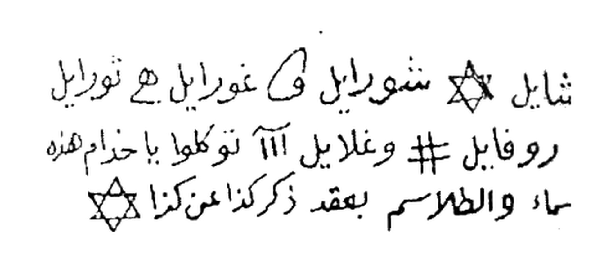
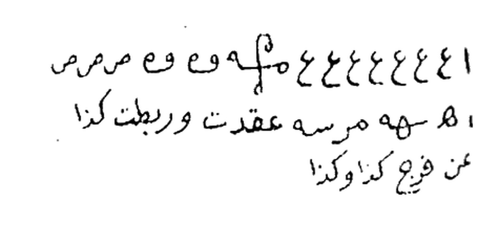
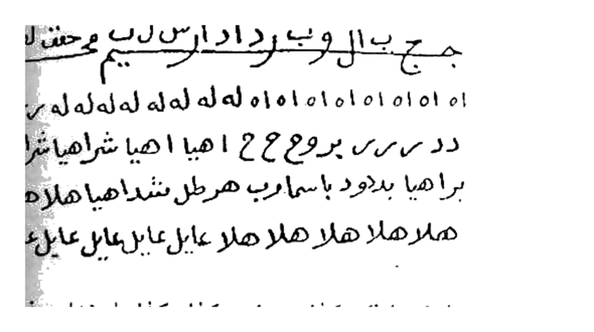
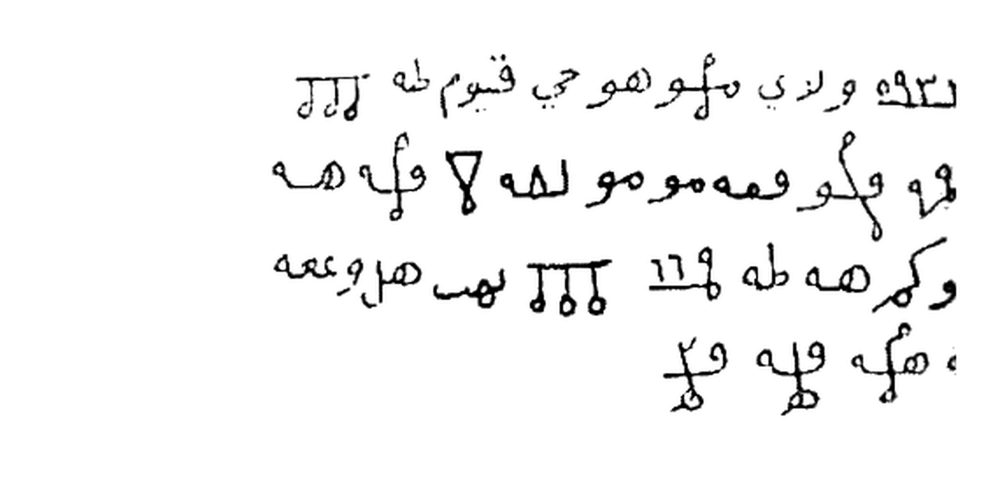
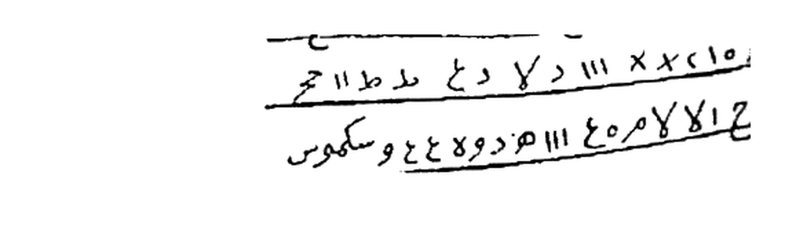
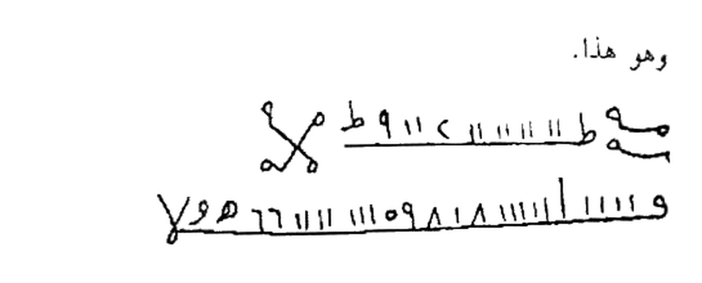
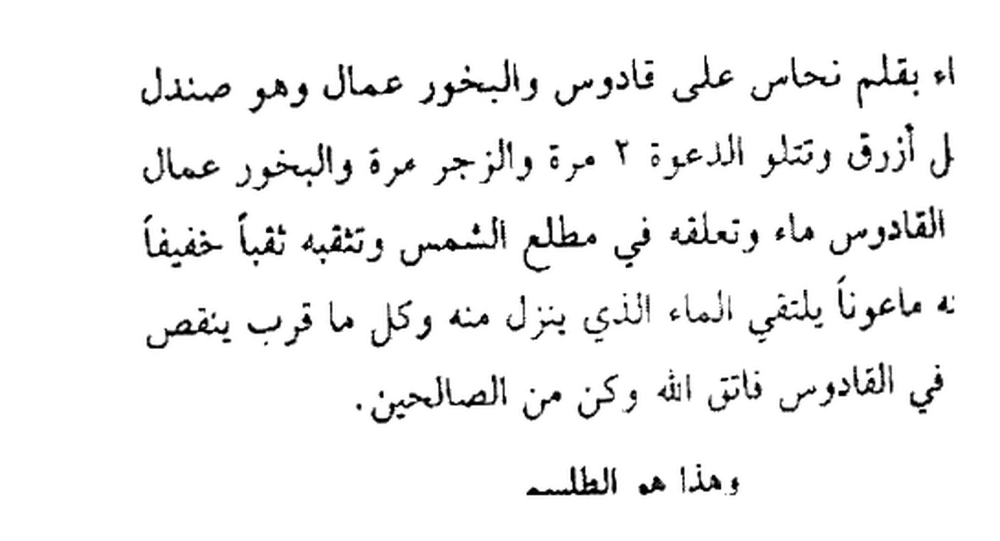

# Terjemahan Lengkap — Batch 24 — Halaman 117–121
## Kitab Asrar wa Khofayyat fi Ilmi Ruhaniyyat — Syaikh Athiyah Abdul Hamid
### Sumber: Picture 058 kiri (Hal.117) + Picture 059 (Hal.118-119) + Picture 060 (Hal.120-121)

> Format 2 tingkat: **[Teks Arab Asli]** di atas — **[Terjemahan Indonesia]** di bawah setiap paragraf. Rajah/Wafaq/Tabel tidak diterjemahkan jadi teks, hanya crop presisi background putih 4× + keterangan.

---

## Halaman 117 — Tashrif Sadis wa Tsalatsun (36) & Sabi' wa Tsalatsun (37) — Ribath Lawh Rasas & 'Ud Rumman Hamidh — Picture 058 kiri

### [Teks Arab Asli — Halaman 117]
```
بعد كتابة الورقة والقراءة والبخور لابد من تخطيتها.

التصريف السادس والثلاثون
للرباط أيضاً تكتبه في لوح رصاص بابرة نحاس وتتلو عليه
الدعوة ٣ مرات والزجر مرة والبخور مقل وحنتيت وبعد التخطية تدفنه في
مكان رطب فإنه رباط مؤذي لا ينفك إلى يوم القيامة.

وهذا هو الطلسم كما ترى
[رسم يدوي — 3 أسطر مع نجمتين سداسيتين]
شلشلايل ☆ شنورايل ق غورايل ه تورايل
١١١١ روفايل # وغلايل آآآ توكلوا يا خدام هذه
الاسماء والطلسم بعقد ذكر كذا عن كذا ☆

توكلوا يا خدام هذه الطلاسم واعقدوا ذكر كذا وكذا عن كذا
وكذا.

التصريف السابع والثلاثون
للرباط أيضاً تكتبه على عود رمان حامض وتتلو عليه الدعوة
٣ مرات والزجر مرة والبخور المذكور قبله وتلمس به من شئت
فإنه ينعقد في الوقت والحال. وهذا هو الطلسم

[رسم يدوي — 3 أسطر متعرجة]
١١١١١١ ع ع ع ع ع ع هـ ٥ وع مرص
ص ص ه ه مرسه عقدت ورابطت كذا
عن فرج كذا وكذا
```

### [Terjemahan Indonesia — Halaman 117]
**Setelah menulis warqah (kertas), membaca (qira'ah / da'wah) dan membakar bukhur (kemenyan), kamu HARUS melewatkannya (takhthiyyah — dilangkahi oleh target).**

**Tashrif ke-36 (Sadis wa Tsalatsun — 36) — Untuk Ribath (رباط: ikatan/penguncian agar tidak bisa bersetubuh/nikah) — juga:**
Engkau tulis pada **lauh (lempengan) timah (rasas)** dengan **jarum (ibrah) tembaga (nuhas)**, lalu engkau bacakan **ad-da'wah 3 kali dan az-zajr 1 kali**, bukhurnya **muqul (مقل) dan hantit (حلتيت)**. Setelah ditakhthiyyah (dilangkahi), engkau kubur di **tempat lembab (ruthb)**. Maka ia menjadi **ribath yang menyakitkan (mu'dzi) tidak terlepas sampai hari kiamat (la yanfakk ila yaumil qiyamah)**.

**Dan inilah talismannya seperti yang engkau lihat** — lihat **Gambar Rajah Asli Halaman 117 (atas):**


*Gambar Rajah Asli Halaman 117 (atas) — Tashrif Sadis wa Tsalatsun (36) — `شلشلايل ☆ شنورايل ق غورايل هـ تورايل / ١١١١ روفايل # وغلايل آآآ توكلوا يا خدام هذه / الاسماء والطلسم بعقد ذكر كذا عن كذا ☆` — lauh rasas ibrah nuhas muqul hantit dafn ruthb — cropping presisi 4× putih bersih 300 DPI*

> **Cara baca:** `Syal-sya-laa-yil ☆ Syanuuraa-yil Qa Ghuuraa-yil Ha Tuuraa-yil / 1111 Ruufaa-yil # Wa Ghulaa-yil Aaa … Tawakkaluu yaa khuddaama haadzihi al-asmaa' wath-thilasm bi-'aqdi dzakari kadza 'an kadza ☆` — diapit dua bintang segi enam (☆).

Ucapkan: *“Tawakkalu ya khuddam haadzihi ath-thalaasim wa’qiduu dzakara kadza wa kadza ‘an kadza wa kadza.”* (Wahai khadam talisman ini, ikatlah dzakar si fulan dari si fulanah).

**Tashrif ke-37 (Sabi' wa Tsalatsun — 37) — Untuk Ribath juga:**
Engkau tulis pada **‘ud (ranting) delima asam (rumman hamidh)**, lalu engkau bacakan ad-da'wah 3 kali dan az-zajr 1 kali dengan bukhur yang telah disebutkan sebelumnya, lalu engkau sentuhkan (talmassa) kepada siapa yang engkau kehendaki, maka ia langsung terikat (yan'aqid) seketika (fil-waqti wal-hal).

**Dan inilah talismannya** — lihat **Gambar Rajah Asli Halaman 117 (bawah):**


*Gambar Rajah Asli Halaman 117 (bawah) — Tashrif Sabi' wa Tsalatsun (37) — `١١١١١١ ع ع ع ع ع ع هـ ٥ وع مرص / ص ص هـ هـ مرسه عقدت ورابطت كذا / عن فرج كذا وكذا` — 'ud rumman hamidh talmass — cropping presisi 4×*

> **Cara baca:** `111111 'A 'A 'A 'A 'A 'A Ha 5 Wa 'A Marash / Sha Sha Ha Ha Marsah 'aqadtu wa rabath-tu kadza / 'an farji kadza wa kadza` — loop melingkar di tengah adalah ikatan.

---

## Halaman 118 — Tashrif Tsamin wa Tsalatsun (38) Kaf & Tasi' wa Tsalatsun (39) Bughdhah 'Azhmah Humar — Picture 059 kanan

### [Teks Arab Asli — Halaman 118]
```
التصريف الثامن والثلاثون
للرباط أيضاً تكتب الطلسم الآتي في كفك وتتلو عليه
الدعوة ٣ مرات والزجر مرة والبخور المذكور وتسلم على من
شئت فإنه ينعقد في الوقت والحين ولا يحله غيرك. وهو هذا

[رسم يدوي — 5 أسطر + أرقام]
جمج بالوب رداز ارس لات مجحف لفف ان
ا٥١٥١٥١٥١٥١ ه له له له له له له رس رس
دد سر س بروع ٢٢ اهيا اهيا شراهيا شراهيا
براهيا بدوح باسما رب هرطل شداهيا هملاهلا
هملا هلا هلا هلا عايل عايل عايل عايل عايل

اعقدوا ذكر كذا عن فرج كذا وكذا يا خدام هذه الاسماء
والطلاسم.

التصريف التاسع والثلاثون
للبغضة والكراهة وهو من القواطع العظام تكتب الطلسم
على عظمة حمار وتعلقه في السبية ثم تدفنها في عتبة المطلوب فإنهم
يبغضون في طرفة عين فاتق الله ولا تعمله لمستحقه وهو هذا.

[رسم يدوي — سطر واحد]
وع مع ك م ٦١١ ص ٥هـ ٨٨ ٥٠١١ ط ٧١١ ط
توكلوا يا خدام هذا الطلسم بالعداوة والكراهة والبغضة
```

### [Terjemahan Indonesia — Halaman 118]
**Tashrif ke-38 (Tsamin wa Tsalatsun — 38) — Untuk Ribath juga — di telapak tangan (kaf):**
Engkau tulis talisman berikut di **telapak tanganmu (kaf)**, lalu engkau bacakan ad-da'wah 3 kali dan az-zajr 1 kali dengan bukhur yang telah disebutkan, lalu engkau **bersalaman (tusallim) kepada siapa yang engkau kehendaki**, maka ia langsung terikat seketika dan **tidak ada yang bisa melepaskannya selain engkau (la yahulluhu ghairuk). Dan inilah dia:**

**Gambar Rajah Asli Halaman 118 (atas):**


*Gambar Rajah Asli Halaman 118 (atas) — Tashrif Tsamin wa Tsalatsun (38) — `جمج بالوب رداز ارس لات مجحف لفف ان / ا٥١٥١ هـ له له ... رس / دد سر س بروع ٢٢ اهيا شراهيا / براهيا بدوح باسما رب هرطل / هملا هلا عايل عايل` — kaf salam — cropping presisi 4×*

> **Cara baca:** `Jamja bil-waab Ridaaz Aris Laat Mujhaf Lafaf An / 5151 Ha Lahu … Rass / Dad Sars Baru' 22 Ihya … Syaraahiyaa / Baraahiyaa Baduuh … Syadaahiyaa Hamlaahalaa / Hamalaa Halaa 'Aayil 'Aayil` — 5 baris campuran huruf + angka 01.

*“I'qiduu dzakara kadza ‘an farji kadza wa kadza ya khuddam hadzihi al-asmaa' wath-thalaasim.”*

**Tashrif ke-39 (Tasi' wa Tsalatsun — 39) — Untuk Permusuhan & Kebencian (lil-bughdhah wal-karahah) — termasuk Qawathi' 'Izham (pemutus besar yang berbahaya):**
Engkau tulis talisman pada **tulang keledai (’azhmah himar)**, lalu engkau gantungkan pada **sibyah (سبية: patok kayu/penyimpanan)** kemudian engkau kubur di **ambang pintu (’atabah) orang yang dituju**, maka mereka akan saling membenci sekejap mata (fi tharfati ‘ain). **Maka bertakwalah kepada Allah, jangan kau lakukan kecuali kepada yang berhak. Dan inilah dia:**

**Gambar Rajah Asli Halaman 118 (bawah):**


*Gambar Rajah Asli Halaman 118 (bawah) — Tashrif Tasi' wa Tsalatsun (39) — `وع مع ك م ٦١١ ص ٥هـ ٨٨ ٥٠١١ ط ٧١١ ط` — 'azhmah himar sibyah 'atabah — cropping presisi 4×*

> **Cara baca:** `Wa 'A Ma'a Ka Ma 611 Sha 5Ha 88 5011 Tha 711 Tha` — satu baris angka-huruf, di bawahnya tawkil: *“Tawakkalu ya khuddam hadzath-thilasm bil-’adawah wal-karahah wal-bughdhah.”*

---

## Halaman 119 — Tashrif Arba'un (40) Shaqfah Niyyah & Hadi wa Arba'un (41) 'Aqd Alsinah Hukkam — Picture 059 kiri

### [Teks Arab Asli — Halaman 119]
```
الواحاً٢ العجل٢ الساعة٢.

التصريف الأربعون
للكراهة والبغضة والعداوة تكتب على شقفة نية وتبخره
بالمقل والحتيت وتتلو عليها الدعوة ٣ مرات والزجر مرة وتذيبها
وترشها في طريقهم فإنهم يبغضون في طرفة عين.

[رسم يدوي — 4 أسطر + رموز]
ق س٣١٣ وادي مـ هو حب قسيم له ط طط
وه لم و فمه مو له ٨ و له هه
او عوك هه طه ١١٦ ط طط لهب هر وععه
م هه هبه وه لو

التصريف الحادي والأربعون
لعقد الألسنة وهو للحكام وما أشبه ذلك تكتب الطلسم الآتي
في كاغد أيضاً وتتلو عليه الدعوة ٣ مرات والزجر مرة وتحمله معك
فإن دخلت به على أي حاكم فإنه يلتحم ولا يتكلم إلا بخير وإن
أردت أن تجره فعقله على كلب فإنه لا ينبح أبداً وهو هذا:

[رسم يدوي — 4 أسطر مقسمة]
وعا وط ط ااا ح ٤٤٤ ع ه ح خ عدن حص ح
ااا ح وا واع ٤٤٤ ه ع ٥ ط ح م ح ١١١
ااا ح ٥ د ع لا ١١١ ×× ٥١٥ هه ١١١
ع ٤٥٨ ١١١ هد وع ٤٤ وسكوس
```

### [Terjemahan Indonesia — Halaman 119]
**Al-Waha 2, Al-‘Ajal 2, As-Sa’ah 2 (cepatlah, segeralah).**

**Tashrif ke-40 (Arba’un — 40) — Untuk Kebencian, Permusuhan (lil-karahah wal-bughdhah wal-’adawah):**
Engkau tulis pada **pecahan periuk mentah (shaqfah nayyi'ah / niyyah: tembikar yang belum dibakar)**, lalu engkau beri asap dengan **muqul dan hantit**, engkau bacakan ad-da'wah 3 kali dan az-zajr 1 kali, lalu engkau **leburkan (tudzibha) dan percikkan (tarusysyha) di jalan mereka**, maka mereka akan saling membenci sekejap mata.

**Dan inilah talismannya** — lihat **Gambar Rajah Asli Halaman 119 (atas):**


*Gambar Rajah Asli Halaman 119 (atas) — Tashrif Arba'un (40) — `ق س٣١٣ وادي مـ هو حب قسيم له / وهـ لم و فمه مو له ٨ / او عوك هه طه ١١٦ ط / م هه هبه وه لو` — shaqfah nayyi'ah muqul hantit rashsh thariq — cropping presisi 4×*

> **Cara baca:** `Qa Sa 313 Waadi Ma Huwa Hubbu Qasiim Lahu … / Wa Ha Lam Wa Famahu … 8 / Aw 'Awak Hah Thaha 116 Tha / Ma Hah Habah Wa Law` — 4 baris simbol.

**Tashrif ke-41 (Hadi wa Arba’un — 41) — Untuk Mengunci Lisan (li-'aqd al-alsinah) — untuk menghadapi penguasa (hukkam) dan sejenisnya:**
Engkau tulis talisman berikut pada **kertas (kaghad)** juga, lalu engkau bacakan ad-da'wah 3 kali dan az-zajr 1 kali, lalu engkau bawa bersamamu. Jika engkau masuk menemui penguasa mana pun, maka ia akan **terkunci (yaltahim: mulutnya terkunci) dan tidak berbicara kecuali dengan kebaikan**. Dan jika engkau ingin **menyeretnya (tajirrahu)**, maka **ikatkan pada anjing (’aqilhu ‘ala kalb) maka ia tidak akan menggonggong selamanya. Dan inilah dia:**

**Gambar Rajah Asli Halaman 119 (bawah):**


*Gambar Rajah Asli Halaman 119 (bawah) — Tashrif Hadi wa Arba'un (41) — `وعا وط ط ااا ح ٤٤٤ ع ه ح خ عدن / ااا ح وا واع ٤٤٤ ه ع ٥ / ااا ح ٥ د ع لا ١١١ ×× ٥١٥ / ع ٤٥٨ ١١١ هد وع ٤٤ وسكوس` — kaghad hamal liqa' hakim — cropping presisi 4×*

> **Cara baca per baris:** `Wa 'Aa Wa Tha Tha Aaa Ha 444 'A Ha … / Aaa Ha Wa Wa' 444 Ha 'A 5 / Aaa Ha 5 Da 'A Laa 111 ××515 / 'A 458 111 Hada Wa 'A 44 Wa Sukuus` — 4 baris, diakhiri kata `سکوس` (sukuus: diam).

---

## Halaman 120 — Tashrif Tsani wa Arba'un (42) Suqm Baydhah & Tsalits wa Arba'un (43) Nafkh Ziq Sarq — Picture 060 kanan

### [Teks Arab Asli — Halaman 120]
```
التصريف الثاني والأربعون
للسقم والتمريض والكسل وما أشبه ذلك تكتب على بيضة
بقطران أو مداد أسود وتنقب البيضة وتفرغ ما فيها وتعلقها في
السبية وتتلو عليها القسم ٣ مرات والزجر مرة وتدفنها في قبر لا
يزار فإن المعمول له يسقم ويشرف على الهلاك فاخرج البيضة
واحرقها فإن يتحل.

وهذا هو الطلسم

[رسم يدوي — سطران مع مثلث]
وع هه ٩٩ ٧ و و و و و م ول سه
عريده ما م مصعة

توكلوا يا خدام هذا الطلسم واسقموا وامرضوا كذا وكذا
الوحاً٢ العجل٢ الساعة٢.

التصريف الثالث والأربعون
لنفخ من شئت نحو السارق أو غيره وهو من المجربات
تكتب الطلسم في كاغد أزرق ثم تضعه في زق مع اسم السارق
وتنفخ الزق وتربطه جيداً وتكون كتبت أيضاً على فصيب رمان
أو توت وتطلق البخور مقل وحنتيت وتتلو الدعوة ٣ مرات
والزجر مرة وكل مرة تضرب الزق بالعود ثم تعلقه مكان مظلم
فإن السارق لو عته نفخاً عظيماً فاتق الله ومهما حلبت الزق انتهى
```

### [Terjemahan Indonesia — Halaman 120]
**Tashrif ke-42 (Tsani wa Arba’un — 42) — Untuk Sakit, Membuat Sakit & Malas (li-suqm wat-tamridh wal-kasal):**
Engkau tulis pada **telur (baydhah)** dengan **ter (qathran) atau tinta hitam**, lalu engkau **lubangi telur itu, kosongkan isinya, gantungkan di sibyah**, lalu engkau bacakan **al-qasam 3 kali dan az-zajr 1 kali**, lalu engkau kubur di **kuburan yang tidak diziarahi (qabr la yuzar)**. Maka orang yang dituju akan **sakit dan hampir binasa (yusyqim wa yusyraf ‘alal-halak)**. Maka **keluarkan telur itu dan bakarlah, maka akan terlepas (yanḥall)**.

**Dan inilah talismannya:**


*Gambar Rajah Asli Halaman 120 (atas) — Tashrif Tsani wa Arba'un (42) — `وع هه ٩٩ ٧ و و و و و م ول سه / عريده ما م مصعة` — baydhah qathran sibyah qabr la yuzar — cropping presisi 4×*

> **Cara baca:** `Wa 'A Hah 99 7 Wa Wa Wa Wa Wa Ma Wa La Sah / 'Ariidah Maa Ma Mash'ah` — dua baris, baris pertama diakhiri segitiga kecil (▽) simbol.

Ucapkan: *“Tawakkalu ya khuddam hadzath-thilasm wa asqimuu wa amridhuu kadza wa kadza, al-waha 2 al-‘ajal 2 as-sa’ah 2.”*

**Tashrif ke-43 (Tsalits wa Arba’un — 43) — Untuk Membuat Kembung (nafkh) Seseorang — untuk si pencuri (sariq) atau lainnya — termasuk Mujarrabat (yang teruji):**
Engkau tulis talisman pada **kertas biru (kaghad azraq)**, lalu engkau letakkan di **kantong kulit (ziq: geriba)** bersama **nama si pencuri**, lalu engkau **tiup kantong itu (tanfukh) dan ikat dengan kuat**. Dan engkau juga telah menulis pada **tangkai delima (fashib rumman) atau murbei (tut)**, lalu engkau bakar bukhur muqul dan hantit, engkau bacakan ad-da'wah 3 kali dan az-zajr 1 kali, dan **setiap kali engkau pukul kantong itu dengan kayu (‘ud)**, lalu engkau gantungkan di **tempat gelap (makan muzhlim)**. Maka si pencuri akan **kembung dengan kembung yang besar (law‘atan nafkh ‘azhim) — perutnya membesar**. **Maka bertakwalah kepada Allah, dan kapan pun engkau peras (halabta) kantong itu, maka selesai (kembungnya hilang).**

---

## Halaman 121 — Tatimmah Tashrif 43 & Rabi' wa Arba'un (44) Nazf Dam Qadus — Picture 060 kiri

### [Teks Arab Asli — Halaman 121]
```
المنفوخ وهو هذا.

[رسم يدوي — سطران بخط متعرج]
م يه ط ١١١ ع ١١١١ ط ٩١١ ع
و ١١١١١ ١١٨٩٨١١١ ٦٦١١١ هـ ٥٥ هـ ٩٥٦

توكلوا يا خدام هذه الأسماء والطلاسم بنفخ كذا وكذا ميما
افعلوا كذا وكذا.

التصريف الرابع والأربعون
لنزف الدم وهو أمانة في عنقك لأنه من القواطع تكتبه في
يوم الثلاثاء بقلم نحاس على قادوس والبخور عمال وهو صندل
أحمر ومقل أزرق وتتلو الدعوة ٢ مرة والزجر مرة والبخور عمال
وتضع في القادوس ماء وتعلقه في مطلع الشمس وتنقبه ثقباً خفيفاً
وتضع تحته ماعوناً ينلقي الماء الذي ينزل منه وكل ما قرب ينقص
رجع الماء في القادوس فاتق الله وكن من الصالحين.

وهذا هو الطلسم

[رسم يدوي — سطران + سطر ثالث مقطع]
ك ه ٣٤١٥١٧ ت ج ع ف ف فس شرع اك
٣ ك ه طحيا طوما طموما باحه مس كطع
```

### [Terjemahan Indonesia — Halaman 121]
**Orang yang ditiup (kembung) — dan inilah dia:**


*Gambar Rajah Asli Halaman 121 (atas) — Tatimmah Tashrif Tsalits wa Arba'un (43) — `م يه ط ١١١ ع ١١١١ ط ٩١١ ع / و ١١١١١ ١١٨٩٨١١١ ٦٦١١١ هـ ٥٥ هـ ٩٥٦` — kaghad azraq ziq fashib rumman — cropping presisi 4×*

> **Cara baca:** `Ma Yah Tha 111 'A 1111 Tha 911 'A / Wa 11111 11898111 66111 Ha 55 Ha 956` — dua baris angka-huruf berliku.

Ucapkan: *“Tawakkalu ya khuddam hadzihi al-asmaa' wath-thalaasim binafkhi kadza wa kadza miimaa if‘aluu kadza wa kadza.”*

**Tashrif ke-44 (Rabi’ wa Arba’un — 44) — Untuk Pendarahan (li-nazf ad-dam: membuat darah mengalir terus) — ini adalah amanah di lehermu (amanah fi ‘unuqik) karena termasuk Qawathi' (pemutus yang berbahaya):**
Engkau tulis di **hari Selasa (yaum ats-tsulatsa')** dengan **pena tembaga (qalam nuhas)** di atas **qadus (قادوس: bejana tembikar untuk mengangkat air / wadah)**, bukhurnya **‘ummal** yaitu **cendana merah (shandal ahmar) dan muqul biru (azraq)**. Engkau bacakan ad-da'wah 2 kali dan az-zajr 1 kali — bukhurnya ‘ummal juga. Lalu engkau **tuangkan air ke dalam qadus, gantungkan di tempat terbit matahari (mathla’ asy-syams), lubangi dengan lubang kecil (tsaqban khafifan), letakkan di bawahnya wadah (ma‘un) yang menampung air yang menetes**. Dan **semakin air berkurang, maka darah si target akan berkurang? (Atau semakin air menetes, darah mengalir) — teks: “wa kullama qaruba yanqush raja‘a al-ma' fi al-qadus”** — intinya darah terus mengalir. **Maka bertakwalah kepada Allah dan jadilah dari orang-orang saleh (wa kun minash-shalihin).**

**Dan inilah talismannya:**


*Gambar Rajah Asli Halaman 121 (bawah) — Tashrif Rabi' wa Arba'un (44) — `ك ه ٣٤١٥١٧ ت ج ع ف ف فس شرع اك / ٣ ك ه طحيا طوما طموما باحه مس كطع` — qalam nuhas qadus tsulatsa' shandal ahmar muqul azraq — cropping presisi 4×*

> **Cara baca:** `Ka Ha 341517 Ta Ja 'A Fa Fa Fasa Syara' Ak / 3 Ka Ha Thahyaa Thuumaa Thumuumaa Baahah Mas Katha'` — dua baris, baris kedua terpotong di scan asli sebelah kanan.

Ucapkan: *“Tawakkalu ya khuddam hadzihi al-asmaa' wanzifuu ad-dama min kadza wa kadza daman jariyan la yanqathi‘ ana’a al-lail wa athrafa an-nahar bi-qudratil-‘Aziz al-Jabbar.”*

---

> **Catatan Batch 24:** 5 halaman (117-121) = 9 Rajah HQ 4× putih bersih (117×2,118×2,119×2,120×1,121×2) — semua crop presisi mengikuti kotak rajah, bukan halaman penuh, tanpa teks sekitar. Total kumulatif 125 Rajah (116+9). Next Batch 25 Hal.122-126 (Picture 061 + 062).
