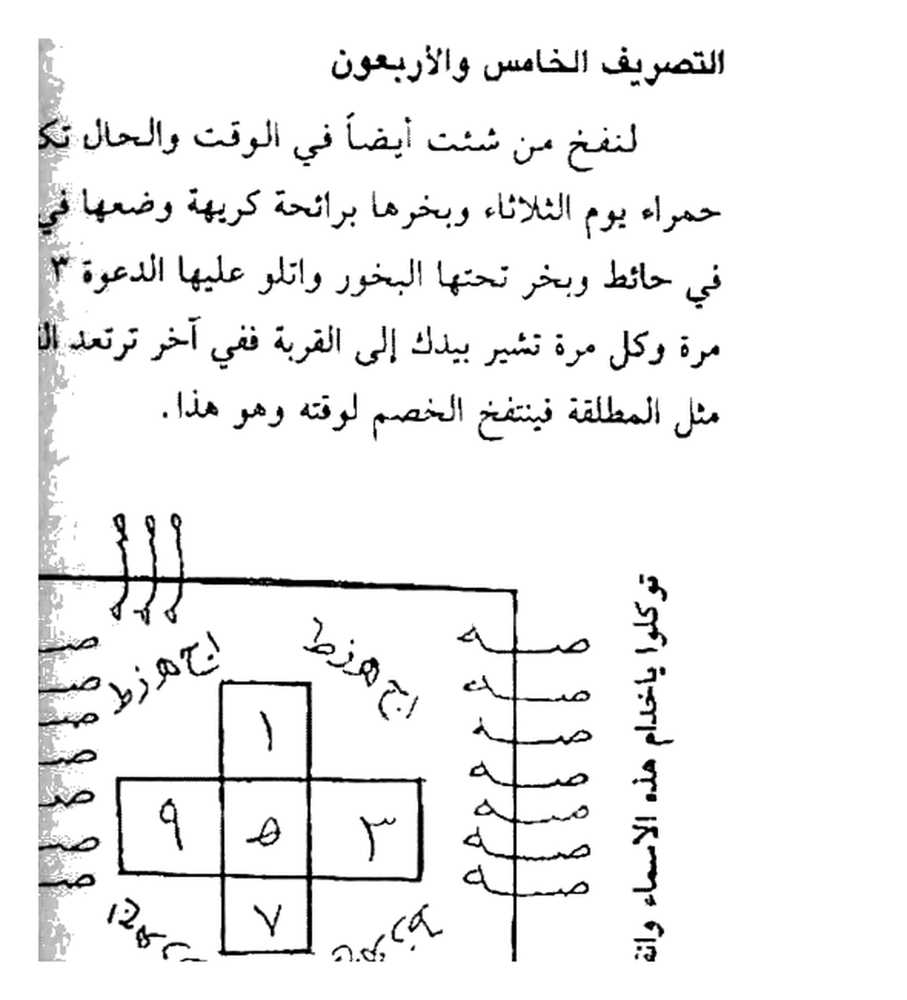
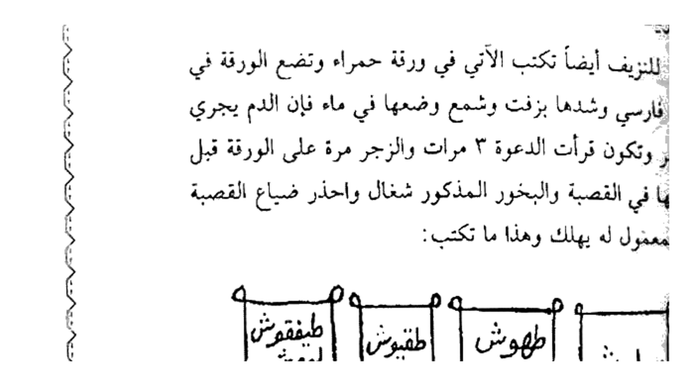
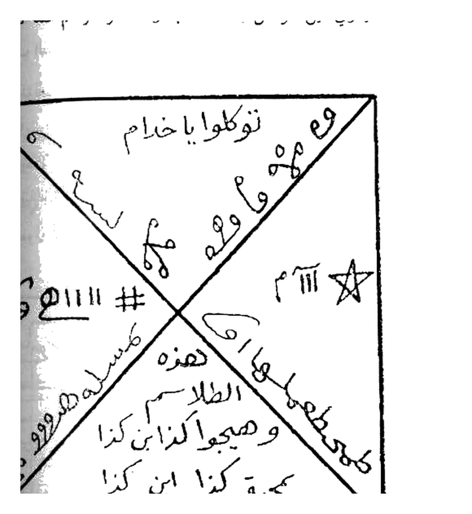
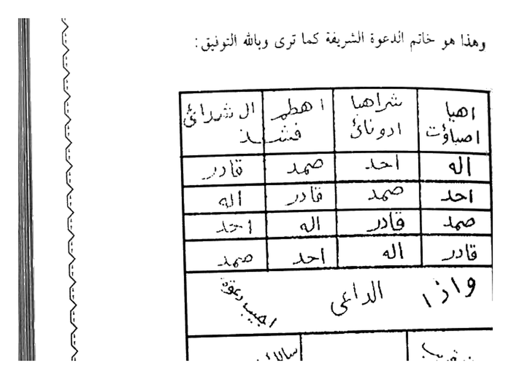

# Terjemahan Lengkap — Batch 25 — Halaman 122–126
## Kitab Asrar wa Khofayyat fi Ilmi Ruhaniyyat — Syaikh Athiyah Abdul Hamid
### Sumber: Picture 061 (Hal.122-123) + Picture 062 (Hal.124-125) + Picture 063 (Hal.126)

> Format 2 tingkat: **[Teks Arab Asli]** di atas — **[Terjemahan Indonesia]** di bawah. Rajah crop presisi 4× putih bersih.

---

## Halaman 122 — Tashrif Khamis wa Arba'un (45) Nafkh Waraqah Hamra' — Picture 061 kanan

### [Teks Arab Asli — Halaman 122]
```
وفجرنا الأرض عيوناً فالتقى الماء على أمر قد قدر قد قدر وحملناه على
ذات ألواح ودسر تجري بأعيننا.

التصريف الخامس والأربعون
لنفخ من شئت أيضاً في الوقت والحال تكتبه في ورقة
حمراء يوم الثلاثاء وتبخرها برائحة كريهة وتضعها في قرية وعلقها
في حائط ويبخر تحتها البخور وتتلو عليها الدعوة ٣ مرات والزجر
مرة وكل مرة تشير بيدك إلى القرية ففي آخر ترتعد القرية وتتمخض
مثل المطلقة فتنفتخ الخصم لوفته وهو هذا.

[مربع كبير 33×33 مع صليب داخلي أرقام 1-9-5-3-7 وطلاسم جانبية + هـ ص هـ ص ... + توكلوا يا خدام هذه الاسماء وانفخوا كذا وانزووا]
```

### [Terjemahan Indonesia — Halaman 122]
**“Dan Kami pancarkan bumi menjadi mata-mata air, maka bertemulah air atas urusan yang telah ditakdirkan, dan Kami bawa di atas (bahtera) yang berpapankan dan berpaku, berlayar dengan pengawasan Kami.”**

**Tashrif ke-45 (Khamis wa Arba’un — 45) — Untuk Membuat Kembung (nafkh) Seseorang — juga seketika:**
Tulis pada **kertas merah (waraqah hamra’)** pada **hari Selasa (yaum ats-tsulatsa’)**, beri asap dengan **bau busuk (raiḥah karihah)**, letakkan di **bejana (qaryah/qirbah?)**, gantung di **dinding (ḥā’ith)**, bakar bukhur di bawahnya, bacakan ad-da’wah 3 kali dan az-zajr 1 kali, dan **setiap kali engkau isyaratkan tangan ke bejana, maka di akhirnya bejana akan bergetar (tarta‘idu) dan menggeliat seperti wanita yang hendak melahirkan (mukhadhah), maka musuh akan kembung pada waktunya. Dan inilah dia:**


*Gambar Rajah Asli Halaman 122 — Tashrif Khamis wa Arba'un (45) — مربع besar 33×33 cm, salib tengah angka `١ ٩ ٥ ٣ ٧`, sekeliling `هـ ص هـ ص ...` + `توكلوا يا خدام هذه الاسماء وانفخوا كذا` + loops ٥ di 4 sisi + `١٢ جـ ب` — cropping presisi 4× 494K*

> **Cara baca:** Tengah `1` atas, `9` kiri, `5` tengah, `3` kanan, `7` bawah — dikelilingi `هـ ص` berulang dan `يا خدام` di sisi kanan vertikal.

---

## Halaman 123 — Tashrif Sadis (46) Tanzif Qassah Farsi & Sabi' (47) Rasm Qamar Qaws — Picture 061 kiri

### [Teks Arab Asli — Halaman 123]
```
كذا ماء جارياً لا ينقطع أبداً آناء الليل وأطراف النهار فالتقى
الماء على أمر قد قدر إلى قوله بأعيننا الوحا٢ العجل٢ الساعة٢.

التصريف السادس والأربعون
للنزيف أيضاً تكتبه الآتي في ورقة حمراء وتضع الورقة في
قصة فارسي وشهدها بزفت وشمع وضعهما في ماء فإن الدم يجري
كالبحر وتكفون قرأت الدعوة ٣ مرات والزجر مرة على الورقة قبل
وضعها في القصعة والبخور المذكور شغال واحذر ضياع القصعة
فإن المعمول له يهلك له يهلك: وهذا ما تكتب:

[4 مربعات صغيرة متوازية]
سليبوش | طهوش ربيوش | طفقوش طقطقو | طفقطوش ليوش فروش

توكلوا يا خدام هذه الأسماء وانزفوا دم كذا وكذا الوحا
العجل الساعة.

التصريف السابع والأربعون
اكتب الرسم الآتي في ورقة بيضاء والقمر في برج القوس
مطلقاً ساعة الزهرة من أي يوم ثم علقه في السبية واتل عليه
الدعوة ٣ مرات والزجر مرة وهو عود وجاوي ثم علق الورقة
```

### [Terjemahan Indonesia — Halaman 123]
**…seperti air yang mengalir tidak terputus sepanjang malam dan ujung siang hingga “…atas urusan yang telah ditakdirkan…” hingga “…dengan pengawasan Kami, al-waha 2 al-‘ajal 2 as-sa‘ah 2.”**

**Tashrif ke-46 (Sadis wa Arba’un — 46) — Untuk Pendarahan (tanzif/nazf) juga:**
Tulis yang berikut pada **kertas merah**, letakkan kertas di **mangkuk Persia (qassah farsi)**, tutup dengan **aspal (zift) dan lilin (syam’)** , letakkan keduanya di air, maka **darah akan mengalir seperti lautan (kal-bahr)**. Dan engkau telah membaca ad-da’wah 3 kali dan az-zajr 1 kali di atas kertas sebelum meletakkannya di mangkuk, bukhurnya yang telah disebutkan menyala, dan **hati-hati jangan sampai mangkuknya hilang, maka orang yang dituju akan binasa. Dan inilah yang engkau tulis:**


*Gambar Rajah Asli Halaman 123 — Tashrif Sadis wa Arba'un (46) — 4 kotak: `سليبوش | طهوش ربيوش | طفقوش طقطقو | طفقطوش ليوش فروش` — tanzif qassah farsi — 343K 4×*

Ucapkan: *“Tawakkalu ya khuddam hadzihi al-asmaa’ wanzifuu dama kadza wa kadza, al-waha al-‘ajal as-sa‘ah.”*

**Tashrif ke-47 (Sabi’ wa Arba’un — 47):**
Tulis gambar (rasm) berikut pada **kertas putih**, saat **bulan berada di rasi Sagitarius (burj al-qaws)** secara mutlak pada **jam Venus (sa’ah az-Zuhrah)** di hari apa pun, lalu gantungkan di sibyah, bacakan ad-da’wah 3 kali dan az-zajr 1 kali — bukhurnya kayu (عود) dan jawi, lalu gantungkan kertas.

---

## Halaman 124 — Tatimmah 47 & X-Kabir Tawakkala — Picture 062 kanan

### [Teks Arab Asli — Halaman 124]
```
في شجرة عالية اتل فإن المعمول له يأتي مجنوناً لطائبة مسحوراً
لا يدري أين هو من شدة المحبة وهذا هو الرسم كما ترى:

[مربع كبير مقسوم X قطري]
توكلوا يا خدام # ٦هـ١١١ و م هـ و هـ هـ وه
طمحطمهيا هااا الطلسم و هيجوا كذا ابن كذا
بمحبة كذا ابن كذا # ٦هـ١١١ م هـ و هـ
ص هـ ص هـ ص هـ ...

وهذا بخور الخير هو جاري وعود هندي ومسكى ولبان
ذكر وعود قلقلي وبخور الشر صبر ومر ومقل أزرق ونتر وصل.
```

### [Terjemahan Indonesia — Halaman 124]
**…pada pohon tinggi, bacakan, maka orang yang dituju akan datang gila, linglung, tersihir, tidak tahu di mana ia berada karena dahsyatnya mahabbah. Dan inilah gambarnya seperti yang engkau lihat:**


*Gambar Rajah Asli Halaman 124 — Tatimmah Tashrif Sabi' wa Arba'un (47) — مربع X `توكلوا يا خدام # ٦هـ١١١ و م هـ` diagonal `طمحطمهيا` + `بمحبة كذا ابن كذا` + `ص هـ ص هـ ص هـ` sisi — 468K 4×*

**Dan bukhur kebaikannya adalah jawi, oud hindi, misik, luban dzakar, oud qalqi — dan bukhur keburukannya adalah shabr, mur, muqul azraq, nitr, bصل.**

---

## Halaman 125 — Khatam Da'wah Syarifah & Israf + Table — Picture 062 kiri

### [Teks Arab Asli — Halaman 125]
```
وهذا هو خاتم الدعوة الشريفة كما ترى وبإله التوفيق:

[جدول 7 أسطر × 4 أعمدة]
اهيا | شراهيا | اهطم | ال شرا ئي نز
اله | احد | صمد | قادر
اله | صمد | قادر | احد
احمد | قادر | اله | اله
قادر | اله | احد | صمد
وازا الدامى | مجيب عفوقه
فاني قريب | ازا دعاني | سالك عبادي عني

إصراف الدعوة بعد الأعمال تقول:
بسم الله الرحمن الرحيم
انصرفوا مأجورين أيتها الملوك الكرام بارك الله فيكم
وعليكم بحق اهيا شراهيا ادوناي اصباؤت ال شداي بخ
انصرفوا بحق قل هو الله احد الله الصمد لم يلد ولم يولد ولم يكن
له كفواً أحد انصرفوا بارك الله فيكم وعليكم وصلى الله على سيدنا
محمد وعلى آله وصحبه وسلم.
```

### [Terjemahan Indonesia — Halaman 125]
**Dan inilah khatam (penutup/stempel) dari ad-da‘wah yang mulia seperti yang engkau lihat — wa billahit-taufiq (dan dengan Allah pertolongan):**


*Gambar Rajah Asli Halaman 125 — Khatam Da'wah Syarifah — tabel 7×4: `اهيا شراهيا اهطم ال شرائي / اله احد صمد قادر / ... / وازا الدامي مجيب عفوقه / فاني قريب ازا دعاني سالك عبادي عني` — 489K 4×*

> **Cara baca tabel:** Baris 1 `اهيا شراهيا اهطم ال شرائي نز`, baris 2 `اله احد صمد قادر`, dst hingga baris 7 `سائلك عبادي عني`.

**Ishraf (pengusiran) ad-da’wah setelah amalan, engkau ucapkan:**
*Bismillahirrahmanirrahim, insyarifuu ma’juurin ayyatuhal-muluk al-kiram, baarakallahu fiikum wa ‘alaikum bihaqqi Ahyaa Syaraahiyaa Adunaay Ashbaawut Al Syaddaay Bakh… insyarifuu bihaqqi Qul Huwallahu Ahad…* (hingga shalawat).

---

## Halaman 126 — Da'wah Syarifah Kamilah — Picture 063 kanan

### [Teks Arab Asli — Halaman 126]
```
وهذه هي الدعوة الشريفة
كما ترى إن شاء الله تعالى والله الموفق للصواب

بسم الله الرحمن الرحيم
بسم الله المنعوت بالجلال والكبرياء المتقدس عن الشبيه
بمخلوقاته بسم الله رب الآخرة والأولى رب العباد المنزه عن
الأضداد والأنداد والصاحبة والأولاد خالق الأشباح والأرواح بسم
الله ذي البطش الشديد والقوة المتين الذي قامت بأمره السموات
والأرض يسبح الرعد بحمده والملائكة من خيفته باختلاف اللغات
والأصوات بسم الله الذي خلق السموات بقدرته ومدحا الأرض
بإرادته ومشيئته وأدار النجوم في الأفلاك بحكمته وفجر البحار
وسخرها لبرينه واستوى على جميع ما كونه من الأشياء بفهره
وقدرته أزلي الأزل ومعلل العلل كان وجوده قبل الأزمان الغابرة
والدهور الداهرة القدوس الظاهر العلي المتعال القاهر تعاليت يا
محيط واحتجبت بقدوس الأنوار اللاهوتية والعظمة الأزلية الخفية
عن إدراك فهم البرية الثاقبة في عقول ذوي الأذهان الصافية الركيزة
يا باريء، تعالى مجدك وتقدست أسماؤك وعظم ولاؤك وكبرياؤك
```

### [Terjemahan Indonesia — Halaman 126]
**Dan inilah ad-da‘wah yang mulia seperti yang engkau lihat, insya Allah ta‘ala, wallahul-muwaffiq lish-shawab (dan Allah yang memberi taufik kepada kebenaran):**

*Bismillahirrahmanirrahim…*

*Bismillah al-man‘ut bil-jalal wal-kibriya’ al-mutaqaddas ‘an asy-syabiih…* (Dzat yang disifati keagungan dan kebesaran, Maha Suci dari penyerupaan dengan makhluk, Tuhan akhirat dan awal, Tuhan hamba-hamba yang disucikan dari lawan dan sekutu, Pencipta jasad dan ruh, Pemilik genggaman keras dan kekuatan kokoh yang dengan perintah-Nya tegak langit dan bumi, guruh bertasbih memuji-Nya… yang menciptakan langit dengan kuasa-Nya, membentangkan bumi dengan kehendak-Nya, mengedarkan bintang di orbit dengan hikmah-Nya, memancarkan lautan… Yang azali, penyebab segala sebab, keberadaan-Nya sebelum zaman… Yang Maha Suci, Maha Zhahir, Maha Tinggi… Wahai Pencipta, Maha Tinggi kemuliaan-Mu, Maha Suci nama-nama-Mu…)

*Catatan: halaman ini murni doa panjang, tidak ada Rajah.*

---

> **Catatan Batch 25:** 5 halaman (122-126) = 4 Rajah HQ 4× (122 494K +123 343K +124 468K +125 489K) + 1 hal Dua tanpa Rajah. Total kumulatif 129 Rajah (125+4). Next Batch 26 Hal.127-131 (Picture 063 kiri + 064 + 065).
