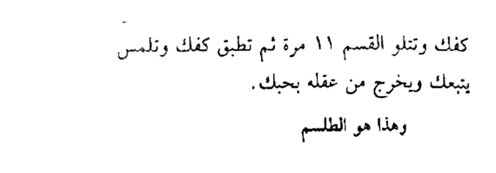
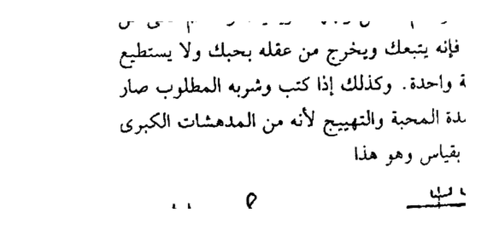
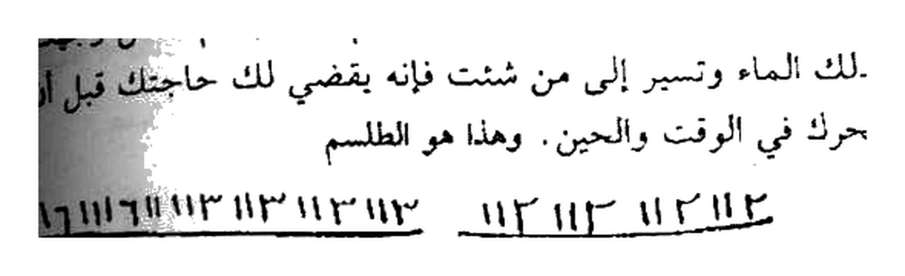
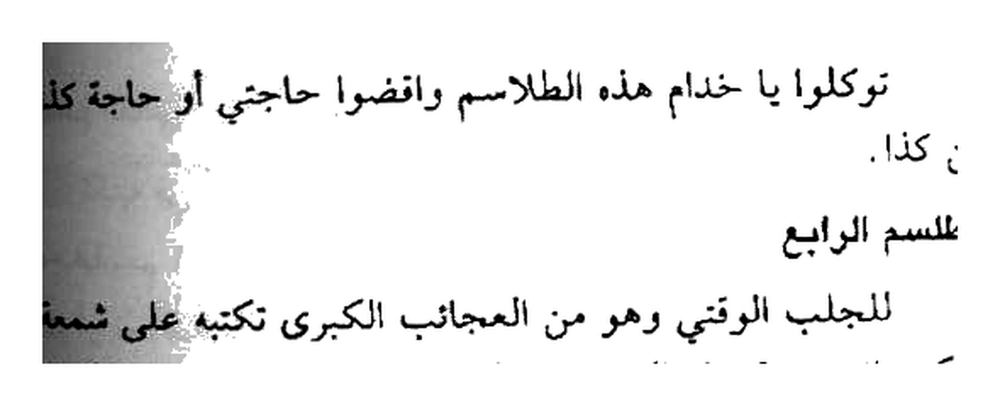
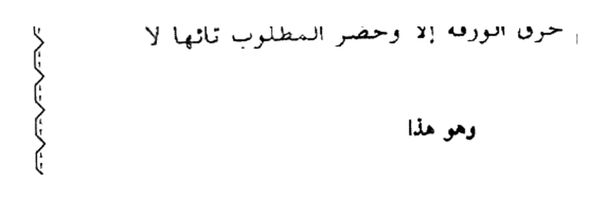
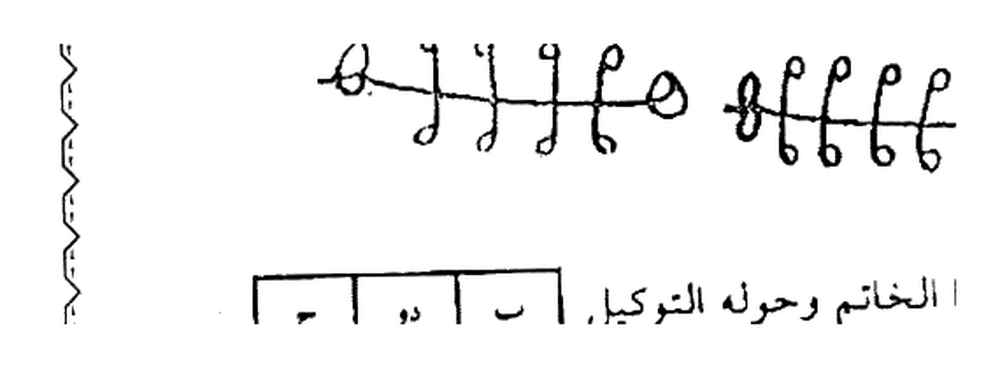
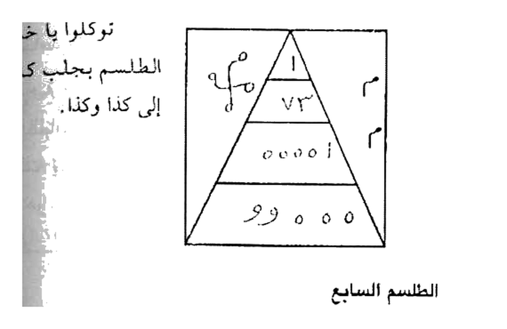
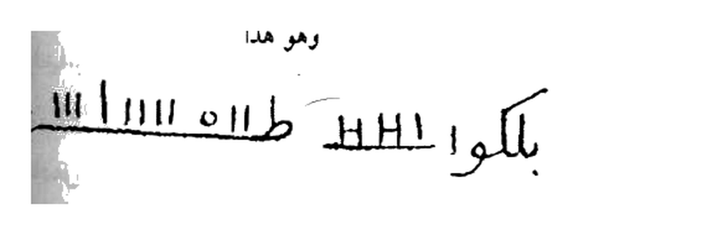

# Terjemahan Lengkap — Batch 31 — Halaman 150–154
## Kitab Asrar wa Khofayyat — Fashal Tsalis — Syaikh Athiyah
### Sumber: Picture 076 (150-151) + Picture 077 (152-153) + Picture 078 kanan (154)

> Format 2 tingkat: **[Teks Arab Asli]** di atas — **[Terjemahan Indonesia]** di bawah. Rajah crop presisi 4×.

---

## Halaman 150 — Fashal Tsalis Muqaddimah — Picture 076 kanan

### [Teks Arab Asli — Halaman 150]
```
الفصل الثالث
فى الدعوة الاولى من دعوات الطلاسم
وهم اربعون طلسما من المجربات العظام
لان هذه الطلاسم منتخبة من افخر العلوم التى لا تخيب ابدا
ولا يضعف ناموسها على الدوم ولكل قسم منهم دعوة خاصة به
وهذه الدعوة هي الاولى لها عشرة طلاسم
من اصدارات شيخ الروحانيين الشيخ عطية عبد الحميد في المكتبات
... (daftar kitab) ...
شيخ الروحانيين فى الوطن العربى
الشيخ عطية عبد الحميد
00201062022238
```

### [Terjemahan Indonesia — Halaman 150]
**FASHAL KETIGA — TENTANG DA’WAH PERTAMA DARI DA’WAT-Da’WAT TILASIM — jumlahnya 40 tilsam termasuk Mujarrabat ‘Izham (yang teruji agung).** Tilasam-tilasam ini dipilih dari ilmu paling mulia yang tidak pernah gagal, tidak melemah… setiap qasam memiliki da’wah khusus. **Da’wah pertama ini memiliki 10 tilasam.**

*Tidak ada Rajah di hal.150 — hanya muqaddimah + daftar terbitan.*

---

## Halaman 151 — Tilasm Awwal & Tsani — Picture 076 kiri

### [Teks Arab Asli — Halaman 151]
```
الطلسم الاول
وهو من العجائب الكبرى للمحبة والجلب الوقتي نكتبه في
كف يدك اليمنى بيدك اليسرى بزعفران ونطلق البخور وهو جاوي
ولبان ذكر تحت كفك وتتلو القسم 11 مرة ثم تطبق كفك وتلمس
به من شئت فإنه يتبعك ويخرج من عقله بحبك.
وهذا هو الطلسم
٨٨٣٧٩١١١٩٧٣ م ط ط١١٩ ١١١١
٩١ ١١١ ١١١ ٩١١٩ ٩ ١١١ ٩١١٩ ٩١
الطلسم الثاني
نكتبه في آنية بزعفران وماء ورد وذيبها برطل ماء وتتلو على
الماء القسم 11 مرة ثم تغسل وجهك ويديك وتسلم على من
شئت أو تخاطبه فإنه يتبعك ويخرج من عقله بحبك ولا يستطيع
الصبر عنك ساعة واحدة. وكذلك إذا كتب وشربه المطلوب صار
كالمجنون من شدة المحبة والتهييج لأنه من المدهمشات الكبرى
التي لا يتمثل لها بقياس وهو هذا
# م ووو هـ ل م
ع ع هـ و # 
```

### [Terjemahan Indonesia — Halaman 151]
**Tilasm 1 — termasuk ‘Aja’ib Kubra untuk Mahabbah & Jalb Waqti (seketika):** Tulis di **telapak tangan kananmu dengan tangan kirimu memakai za’faran**, bakar bukhur **jawi & luban dzakar** di bawah telapak, bacakan **al-qasam 11 kali**, lalu **katupkan telapak dan sentuhkan kepada siapa yang engkau kehendaki**, maka ia akan mengikutimu dan keluar dari akalnya karena cintamu.


*151 Atas — `٨٨٣٧٩١١١٩٧٣ م ط ط١١٩ ١١١١ / ٩١ ١١١ ...` — kaf yumna za'faran 11× — 89K 4×*

**Tilasm 2 — tulis di bejana (aniyah) dengan za’faran & air mawar, larutkan dengan 1 rathl air, bacakan 11×, cuci muka & tangan, salam kepada siapa saja — ia akan mengikuti, tidak sabar sesaat.**


*151 Bawah — ` # م ووو هـ ل م / ع ع هـ و #` + tabel 3×3 — aniyah za'faran — 165K 4×*

---

## Halaman 152 — Tilasm Tsalits & Rabi' — Picture 077 kanan

### [Teks Arab Asli — Halaman 152]
```
الطلسم الثالث
لقضاء الحوائج المتعسرة وهو من عجائب الروماني الكبرى
تكتبة في آنية وتمحوه بالماء وتتلو القسم 11 مرة ثم تغسل وجهك
بذلك الماء وتسير إلى من شئت فإنه يقضي لك حاجتك قبل أن
يتحرك في الوقت والحين. وهذا هو الطلسم
ا٢ر١١٤ ١١٣ ١١٣ ١١٣ اا ١١٣ ١١٣ ١١٣ ١٦٦٦١١٣
الب٣١٦٥٠ ١١١٣ ١٦ ١١١٦١١
الطلسم الرابع
للجلب الوقتي وهو من العجائب الكبرى نكتبه على شمعة
اسكندراني وتوقدها والبخور عمال واتلو القسم 11 مرة فما تكمل
العدد إلا وقد حضر المطلوب حيراًنا تائهاً وهو هذا.
١٣و ز١٤ ٤م ١١١٩ ## ٨٩٤٤٩٣٠٠١٩
... 
```

### [Terjemahan Indonesia — Halaman 152]
**Tilasm 3 — untuk Qadha’ Hawa’ij (memenuhi kebutuhan sulit) — ‘Aja’ib Rumani Kubra:** Tulis di aniyah, hapus dengan air, baca 11×, cuci muka, datangi siapa saja — hajatmu tertunaikan sebelum bergerak.


*152 Atas — `ا٢ر١١٤ ١١٣ ١١٣ ١١٣ / الب٣١٦٥٠ ١١١٣ ١٦ ١١١٦١١` — aniyah — 161K*

**Tilasm 4 — Jalb Waqti Shama’ Iskandarani — 11× hadir hayran.**


*152 Tengah — `١٣و ز١٤ ٤م ١١١٩ ## ٨٩٤٤٩٣٠٠١٩ / ...` — shama Iskandarani — 159K*

---

## Halaman 153 — Tilasm Khamis & Sadis — Picture 077 kiri

### [Teks Arab Asli — Halaman 153]
```
توكلوا يا خدام هذه الطلاسم واقضوا حاجتي أو حاجة كذا من كذا.
الطلسم الخامس
للمحبة السريعة والجلب الوقتي نكتبه في ورقة وتمالأ
الورقة من اللبان الذكر وترميها في النار ليلة الجمعة وتتلو القسم
11 مرة فما يتم حرق الورقة إلا وحضر المطلوب تائهاً لا
يدري أين هو.
وهو هذا
ه٨ ٨٨٨٨٥ و ه٨ ه٨ ه٨ ٤٤٥
وتكتب هذا الخاتم وحوله التوكيل
| ب | دو | ح |
| ح | دو | ع |
| دو | ب | ع |
تقول توكلوا يا خدام هذه الطلاسم واجلبوا كذا وكذا إلى كذا وكذا.
الطلسم السادس
للجلب الوقتي أيضاً نكتبه في سبع ورقات وتضع في كل
ورقة حصوة لبان ذكر وترمي واحدة بعد واحدة في النار وتقرأ
القسم على كل ورقة 3 مرات فما يتم حرق الورقة إلا والمطلوب
قد حضر ذليلاً.
```

### [Terjemahan Indonesia — Halaman 153]
**Tilasm 5 — Mahabbah Sari’ah lilin Jum’ah — waraqah luban dzakar nar Jum’ah.**


*153 Atas — `ه٨ ٨٨٨٨٥ و ه٨ ه٨ ه٨ ٤٤٥` — Jum'ah — 67K*

**Khatam untuk Tilasm 5:**


*153 Tengah — `ب دو ح / ح دو ع / دو ب ع` — 127K*

**Tilasm 6 — 7 waraqah + haswah luban — 3× tiap waraqah.**

---

## Halaman 154 — Tilasm Sabi' & Tsamin — Picture 078 kanan

### [Teks Arab Asli — Halaman 154]
```
وهذا هو الطلسم
توكلوا يا خدام هذا
الطلسم بحلب كذا وكذا
إلى كذا وكذا.
الطلسم السابع
للجلب والمحبة أيضاً التبعية نكتبه في كفك وتطلق البخور
من تحت كفك وتتلو القسم 11 مرة وتطبق كفك وتلمس به من
شئت فإنه يتبعك.
وهو هذا
بلكوا ١١١١ طااا ١١١١ س
الطلسم الثامن
للمحبة أيضاً نكتبه في كاغد في ساعة سعيدة من أي يوم
وتعلقه في سبية وتتلو عليه القسم 11 مرة وتحمله وتخاطب من
شئت فإنه يهيج لوفته وساعته ويصبح في غرام عظيم ولا يستطيع
الصبر عنك ساعة واحدة.
```

### [Terjemahan Indonesia — Halaman 154]
**Tilasm 7 — Jalb Mahabbah Tabi’iyah — kaf — 11×,**


*154 Pyramid — segitiga `١ / ٧٣ / ٠٠٠٠١ / ٩٠٠٠` + `ت وك ل وا` — kaf — 210K*

**Tilasm 8 — Mahabbah Sa’ah Sa’idah — kaghad sibyah — 11× hayaj.**


*154 Bawah — `بلكوا ١١١١ طااا ١١١١ س` — kaghad — 91K*

---

> **Catatan Batch 31:** 5 hal (150-154) = **8 Rajah HQ 4×** (151×2 +152×2 +153×2 +154×2) — Fashal Tsalis baru mulai 40 tilsam — Total kumulatif **137 Rajah** (129+8). Next Batch32 Hal155-159.
