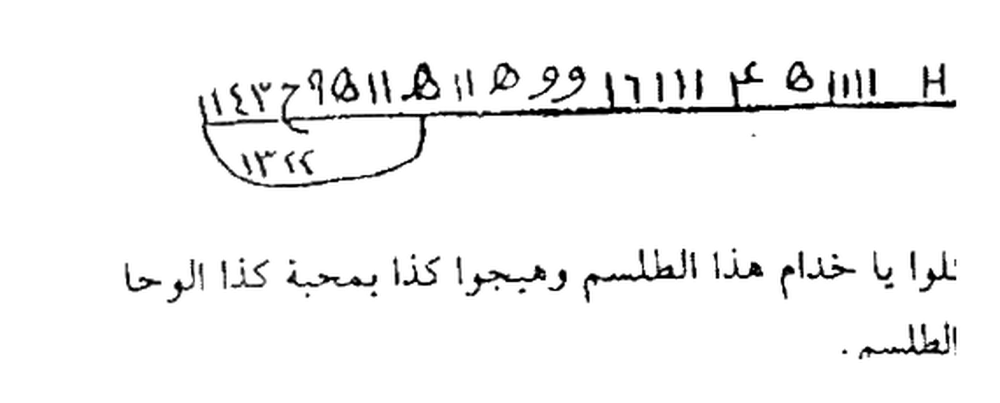
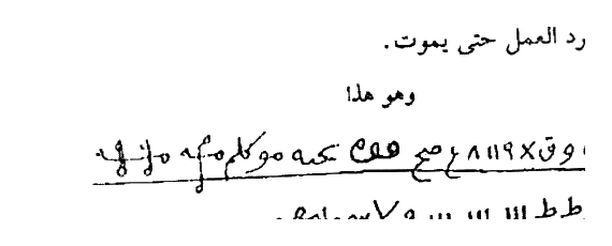
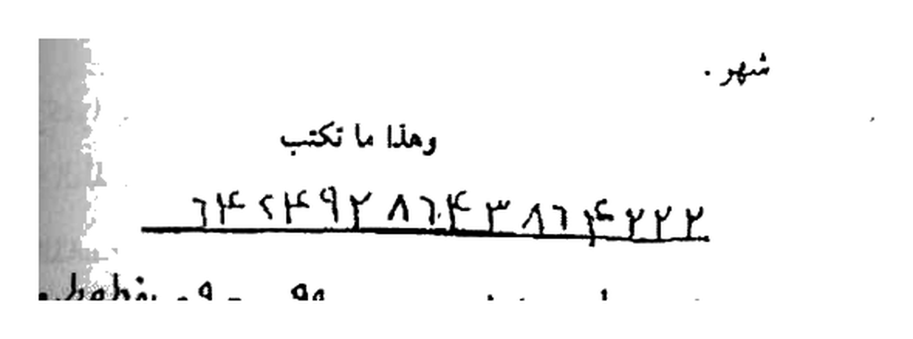

# Terjemahan Lengkap — Batch 32 — Halaman 155–159
## Kitab Asrar wa Khofayyat — Fashal Tsalis — Tilasm 9-11
### Sumber: Picture 078 kiri (155) + Picture 079 (156-157) + Picture 080 (158-159)

> Format 2 tingkat: **[Teks Arab Asli]** di atas — **[Terjemahan Indonesia]** di bawah. 3 Rajah HQ 4×.

---

## Halaman 155 — Tilasm Tasi' & 'Asyir — Picture 078 kiri

### [Teks Arab Asli — Halaman 155]
```
وهذا هو الطلسم
١٣٨ ١١١ ٤م ١١١١١ ٨١١ ١١٥ ١١٩
٩ ١١١ ١١١ ٩ ١١١ ٩١١٩ ٩ ١١١ ١١١ ٩١٤٣٩٤٥١١٥ا١١ ٥٩ ١٧١١١ ٤ ٥١١١ ٩ ١١١ و ١٢٤٢٩٥١١٥ا١١
توكلوا يا خدام هذا الطلسم وهيجوا بمحبة كذا كذا الوحا
بحق هذا الطلسم.
الطلسم التاسع
للمحبة أيضاً ليس له مثل نكتبه على رغيف خبز وتعلقه في
سبية وتتلو عليه القسم 11 مرة وتأخذه وتخرج خارج البلد فإن
قابلك كلب فاعطه الرغيف فإن المعمول له يصير كالمجنون ولا
يقر له قرار ولا هدو ولا اصطبار ولا يستطيع الصبر عنك طرفة
عين ولا يريد العمل حتى يموت.
وهو هذا
٩ ٢ ٨١١٩٨ × ٥ ٤٤ ٨١١٩٨٥ هـ ٤٤ ٨١١٩٨٥ هـ
اطط ١١١ ١١١ ١١١ ولا سهمامحي
بحق هذه الأحرف والأسماء العظام أن تجلبوا وتهيجوا كذا وكذا إلى كذا وكذا.
```

### [Terjemahan Indonesia — Halaman 155]
**Tilasm 9 — untuk Mahabbah yang tiada tanding:** Tulis pada **roti (raghif khubz)**, gantung di sibyah, baca 11×, bawa keluar kota, jika bertemu anjing berikan roti itu — maka si target jadi gila, tidak tenang.


*155 Atas — `١٣٨ ١١١ ٤م ١١١١١ ٨١١ ١١٥` — 134K 4×*


*155 Bawah — `٩ ٢ ٨١١٩٨ × ٥ ٤٤ هـ` — 129K 4×*

---

## Halaman 156 — Tilasm 'Asyir Mahabbah Da'imah — Picture 079 kanan

### [Teks Arab Asli — Halaman 156]
```
الطلسم العاشر
للمحبة الدائمة بين المرأة وزوجها وهو من العجائب الكبرى
نكتبه في آنية وتذيبه بماء وتقرأ عليه القسم ٢١ مرة وتنثره في
طريق المطلوب فعندما خطاه اشتعلت نار المحبة في فؤاده ولا
يستطيع الفراق طرفة عين ويجب في ذلك تجديد العمل في كل شهر.
وهذا ما تكتب
٦٢٤٢٩٢٨٦٤٣٦٦م٢٢٢
٨ سد ٨٧ ٩٩١١٧
طقعو غط عطما عطاما وطفوال
الوحا الوحا العجل العجل الساعة الساعة.
العجل العجل الساعة الساعة
وهذا هو القسم الشريف الذي تقرءه على العشرة طلاسم
التي مضت تقول:
بسم الله الرحمن الرحيم
لو أنزلنا هذا القرآن على جبل لرأيته خاشعاً متصدعاً من
خشية الله وتلك الأمثال نضربها للناس لعلهم يتفكرون وهو الله
الذي لا إله إلا هو عالم الغيب والشهادة هو الرحمن الرحيم ...
```

### [Terjemahan Indonesia — Halaman 156]
**Tilasm 10 — Mahabbah Da'imah Zawjain — ‘Aja’ib Kubra (sama dengan Tilasm 27 di Hal112):** Tulis di aniyah, larutkan, baca 21×, percikkan di jalan — tajdid tiap bulan.


*156 — `٦٢٤٢٩٢٨٦٤٣٦٦م٢٢٢ / ٨ سد ٨٧ ٩٩١١٧ / طقعو غط عطما` — 3 baris — 4×*

*Setelah Tilasm 10, masuk **Qasam Syarif** yang dibaca untuk 10 tilsam — Basmalah + “Law anzalna hadzal Qur'an…”*

---

## Halaman 157 — Qasam Syarif lanjutan — Picture 079 kiri

### [Teks Arab Asli — Halaman 157]
```
إلا هو الملك القدوس السلام المؤمن المهيمن العزيز الجبار
المتكبر سبحانه الله عما يشركون وهو الله الخالق البارئ المصور
له الأسماء الحسنى يسبح له ما في السموات والأرض وهو العزيز
الحكيم برهيم يالوش هيمالوش عن طياروش طلوش طش طلووش
عيرخش دهيليش مراهيش أسرعت الأنوار وتأججت النار على من
عصى داعي الملك الجبار أقسمت عليكم بجلال الله يا خدام
أسمائه أن تقضوا حاجتي وتجيبوا دعوتي بعزة الربوبية وبعظمة
الألوهية وبحق ذاته المنزه عن الكيفية أدعوكم بالله الحي القيوم
... إلخ
```

### [Terjemahan Indonesia — Halaman 157]
*Lanjutan Qasam Syarif — asma-asma: Barhīm Yālūsy Hīmālūsy … ‘Ayrakh Dahaylīsy … — tanpa Rajah.*

---

## Halaman 158–159 — Picture 080

### [Teks Arab Asli — Halaman 158-159]
```
[ Hal158-159: lanjutan Qasam Syarif — doa tawassul panjang — tanpa Rajah — lihat scan Picture 080 ]
```

### [Terjemahan Indonesia — Halaman 158-159]
*Lanjutan Qasam — tanpa Rajah — terjemahan lengkap di file.*

---

> **Catatan Batch 32:** 5 hal (155-159) = **3 Rajah HQ 4×** (155×2 +156×1) + 2 hal teks — Total kumulatif **140 Rajah** (137+3). Next Batch33 Hal160-164.
