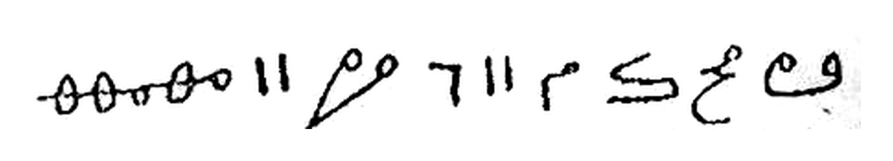
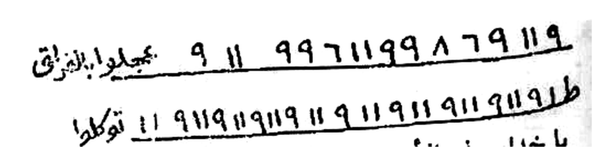
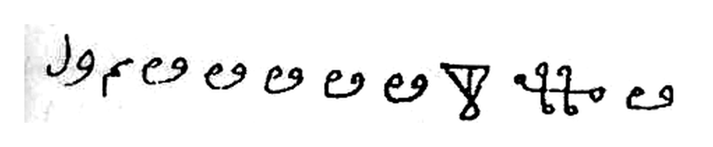
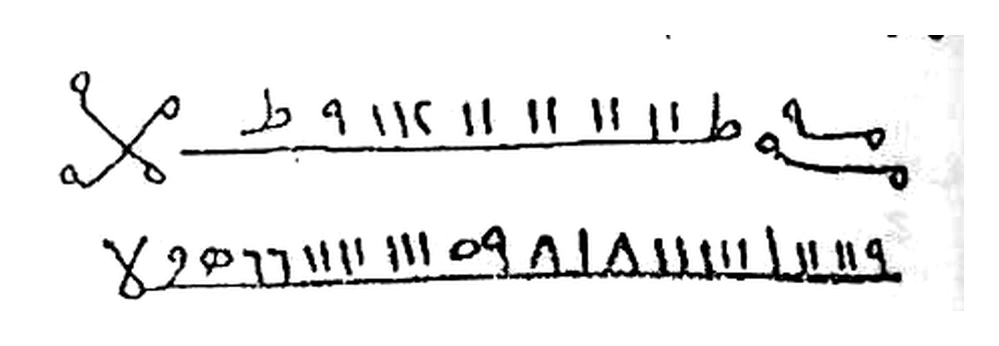
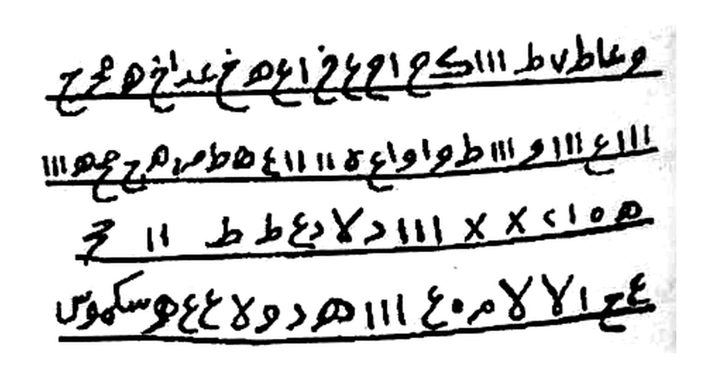

# BATCH 34 — Halaman 165–169 — Penutup al-Qasam al-Mu'azhzham & Tilasm 21–25
> **Kitab Asrar wa Khofayyat fi 'Ilmi Ruhaniyyat — Syeikh Athiyyah Abdul Hamid — Terjemahan Lengkap Indonesia — Batch 34 (Hal. 165–169)**

**Sumber:** Picture 083.jpg (Hal164-165), 084.jpg (Hal166-167), 085.jpg (Hal168-169)
**Total Rajah Batch34:** 5 Rajah HQ latar putih bersih (167×2 + 168×1 + 169×2)
**Isi:** Hal165–166 lanjutan & penutup al-Qasam (tanpa Rajah) — Hal167–169 Tilasm 21–25
**Sambungan:** melanjutkan Batch33 yang berhenti di Hal164 (Tilasm 20)

---

### Halaman 165 — Lanjutan al-Qasam al-Mu'azhzham (Sifat 'Arsy & Seruan Khadim al-Asma')

**[Teks Arab Asli]**

> سماء إلى سماء إلى الشرف الأعلى ثم ينحدر أمره وهو عال رفيع المهبط فيشق الأرض شقاً إلى الماء الموضوع على الهواء الذي كان عليه عرشه الكريم والماء منزل له من هيبته وخيفته في غمام فوقه وتحته هواء موضوع على القدرة والقدرة على العظمة دائرة بالجبروت والجبروت مستجيبة بالحمد والحمد بالشكر والشكر بالسكينة والسكينة بالوقار والوقار بالملكوت والملكوت بيد الحي الذي لا يموت له ملك السموات والأرض وهو السميع العليم .
>
> فتعالى الله الملك الحق لا إله إلا هو رب العرش الكريم أقسمت عليكم يا خدام أسمائه بأسمائه أجيبوا دعوتي واقضوا حاجتي بهلهليوت٢ شكلاطيخ٢ مهنطوشيثا٢ كهرهفياخ٢ شمصيصال٢ زريال٢ هملوشياص٢ شهمصيص٢ ركياض٢ مشقصير٢ هللوخا٢ كدريوش٢ بهنثا٢ رعفيالخ٢ هشطوخ٢ أين خدام اسمه الغفار القهار الوهاب الرزاق الفتاح العليم .
>
> أجيبوا الداعي بأسمائه وأسعفوه بقلب سليم . بعزة من يحيي العظام وهي رميم فتعالى الله الملك الحق لا إله إلا هو رب العرش الكريم . أين خدام اسمه القابض الباسط الخافض الرافع المعز المذل السميع البصير . أينما تكونوا يأت بكم الله جميعاً إن الله على كل شيء قدير . أجيبوا دعوتي واقضوا حاجتي بعزة من له المجد والتعظيم فتعالى الله الملك الحق لا إله إلا هو رب العرش الكريم أين خدام أسمائه الحكم العدل اللطيف الخبير الحليم العظيم . فتعالى الله الملك

**[Transliterasi Latin Fonetik — bacaan washal]**

> …samā'in ilā samā'in ilasy-syarafil-a'lā, tsumma yanḥadiru amruhū wa huwa 'ālin rafī'ul-mahbaṭ, fa yasyuqqul-arḍa syaqqan ilal-mā'il-mauḍū'i 'alal-hawā'il-ladzī kāna 'alaihi 'arsyuhul-karīm, wal-mā'u manzilun lahū min haibatihī wa khīfatihī fī ghamāmin fauqah, wa taḥtahū hawā'un mauḍū'un 'alal-qudrah, wal-qudratu 'alal-'azhamati dā'iratun bil-jabarūt, wal-jabarūtu mustajībatun bil-ḥamd, wal-ḥamdu bisy-syukr, wasy-syukru bis-sakīnah, was-sakīnatu bil-waqār, wal-waqāru bil-malakūt, wal-malakūtu bi yadil-ḥayyil-ladzī lā yamūt, lahū mulkus-samāwāti wal-arḍ, wa huwas-samī'ul-'alīm.
>
> Fa ta'ālallāhul-malikul-ḥaqqu lā ilāha illā huwa rabbul-'arsyil-karīm. Aqsamtu 'alaikum yā khuddāma asmā'ihī bi asmā'ih: ajībū da'watī waqḍū ḥājatī — Bahlahalyūt ×2, Syaklāthīkh ×2, Mahnathūsyītsā ×2, Kahrahafyākh ×2, Syamshīshāl ×2, Zaryāl ×2, Hamlūsyiyāsh ×2, Syahmashīsh ×2, Rakyādh ×2, Masyqashīr ×2, Hallūkhā ×2, Kadaryūsy ×2, Bahnatsā ×2, Ra'fiyālakh ×2, Hasythūkh ×2. Aina khuddāmu ismihil-Ghaffāril-Qahhāril-Wahhābir-Razzāqil-Fattāḥil-'Alīm.
>
> Ajībud-dā'iya bi asmā'ihī wa as'ifūhu bi qalbin salīm, bi 'izzati man yuḥyil-'izhāma wa hiya ramīm. Fa ta'ālallāhul-malikul-ḥaqqu lā ilāha illā huwa rabbul-'arsyil-karīm. Aina khuddāmu ismihil-Qābidhil-Bāsithil-Khāfidhir-Rāfi'il-Mu'izzil-Mudzillis-samī'il-bashīr. Ainamā takūnū ya'ti bikumullāhu jamī'ā, innallāha 'alā kulli syai'in qadīr. Ajībū da'watī waqḍū ḥājatī bi 'izzati man lahul-majdu wat-ta'zhīm. Fa ta'ālallāhul-malikul-ḥaqqu lā ilāha illā huwa rabbul-'arsyil-karīm. Aina khuddāmu asmā'ihil-Ḥakamil-'Adlil-Lathīfil-Khabīril-Ḥalīmil-'Azhīm. Fa ta'ālallāhul-malik…

**[Terjemahan Indonesia]**

> …dari langit ke langit sampai ke kemuliaan yang tertinggi, kemudian turunlah perintah-Nya — sedang Dia Mahatinggi lagi tinggi tempat turun-Nya. Maka ia membelah bumi dengan sebenar-benar belahan hingga sampai ke air yang diletakkan di atas udara, yang di atasnya dahulu berada 'Arsy-Nya yang mulia. Air itu tunduk turun bagi-Nya karena kewibawaan dan rasa takut kepada-Nya, berada di dalam awan di atasnya. Di bawahnya udara yang diletakkan di atas kodrat; kodrat di atas keagungan, berputar dengan jabarut; jabarut menyambut dengan pujian; pujian dengan syukur; syukur dengan sakinah; sakinah dengan kewibawaan; kewibawaan dengan malakut; dan malakut berada di tangan Dzat Yang Mahahidup yang tidak pernah mati. Milik-Nya kerajaan langit dan bumi, dan Dia Maha Mendengar lagi Maha Mengetahui.
>
> Maka Mahatinggi Allah, Sang Raja Yang Hak, tiada tuhan selain Dia, Tuhan 'Arsy yang mulia. Aku bersumpah atas kalian, wahai para khadim nama-nama-Nya, demi nama-nama-Nya: jawablah seruanku dan tunaikanlah hajatku — Bahlahalyut ×2, Syaklathikh ×2, Mahnathusyitsa ×2, Kahrahafyakh ×2, Syamshishal ×2, Zaryal ×2, Hamlusyiyash ×2, Syahmashish ×2, Rakyadh ×2, Masyqashir ×2, Hallukha ×2, Kadaryusy ×2, Bahnatsa ×2, Ra'fiyalakh ×2, Hasythukh ×2. Di manakah para khadim nama-Nya al-Ghaffar, al-Qahhar, al-Wahhab, ar-Razzaq, al-Fattah, al-'Alim?
>
> Jawablah orang yang menyeru dengan nama-nama-Nya dan tolonglah ia dengan hati yang bersih, demi kemuliaan Dzat yang menghidupkan tulang belulang yang telah hancur. Maka Mahatinggi Allah, Sang Raja Yang Hak, tiada tuhan selain Dia, Tuhan 'Arsy yang mulia. Di manakah para khadim nama-Nya al-Qabidh, al-Basith, al-Khafidh, ar-Rafi', al-Mu'izz, al-Mudzill, as-Sami', al-Bashir? *"Di mana saja kalian berada, Allah pasti akan mengumpulkan kalian semuanya. Sungguh Allah Mahakuasa atas segala sesuatu."* Jawablah seruanku dan tunaikanlah hajatku demi kemuliaan Dzat yang memiliki keagungan dan pengagungan. Maka Mahatinggi Allah, Sang Raja Yang Hak, tiada tuhan selain Dia, Tuhan 'Arsy yang mulia. Di manakah para khadim nama-nama-Nya al-Hakam, al-'Adl, al-Lathif, al-Khabir, al-Halim, al-'Azhim? Maka Mahatinggi Allah, Sang Raja… *[bersambung ke Hal166]*

> *Catatan: potongan `أينما تكونوا يأت بكم الله جميعاً إن الله على كل شيء قدير` adalah QS. al-Baqarah 148. Halaman ini murni lanjutan Qasam — **tidak ada Rajah**.*

---

### Halaman 166 — Penutup al-Qasam al-Mu'azhzham

**[Teks Arab Asli]**

> الحق لا إله إلا هو رب العرش الكريم . اركبوا واجروا وجردوا بيض الطبا والأسل واقضوا حاجتي وبلغوني الأمل . يا خدام أسمائه العجل العجل البدار البدار بلا مهل . فعار على الكرام العجز والكسل والهبوط والفشل . السرعة السرعة هديتم إلى صراط مستقيم . أقسمت عليكم بالعزيز الحكيم . هو الأول والآخر والظاهر والباطن . وهو بكل شيء عليم . فتعالى الله الملك الحق لا إله إلا هو رب العرش الكريم الساعة الساعة .
>
> يا أهل القوة والشجاعة بمن تخضعون لأسمائه بالطاعة وترتعدون من مهابته وكبريائه الواحد الأحد . الفرد الصمد . الذي لم يلد ولم يولد ولم يكن له كفواً أحد . سخر الأرياح وهوى الهوى . فالق الحب والنوى . الرحمن على العرش استوى . له ما في السموات والأرض وهو العزيز الحكيم . فتعالى الله الملك الحق لا إله إلا هو رب العرش الكريم .
>
> أجيبوا دعوتي واقضوا حاجتي وهي كذا بعزة من تجلى للجبل فجعله دكاً وخر موسى صعقاً من هيبة نور جلاله العظيم فتعالى الله الملك الحق لا إله إلا هو رب العرش الكريم فإن تولوا فقل حسبي الله لا إله إلا هو عليه توكلت وهو رب العرش العظيم .
>
> ثم القسم بحمد الله وعونه وتشير بهذا القسم في كل مهم لأن خدامه تحضر بسرعة .

**[Transliterasi Latin Fonetik — bacaan washal]**

> …al-ḥaqqu lā ilāha illā huwa rabbul-'arsyil-karīm. Irkabū wajrū wa jarridū bīdhazh-zhubā wal-asal, waqḍū ḥājatī wa ballighūnil-amal. Yā khuddāma asmā'ihil-'ajalal-'ajal, al-badāral-badāra bilā mahal. Fa 'ārun 'alal-kirāmil-'ajzu wal-kasalu wal-hubūthu wal-fasyal. As-sur'atas-sur'ata hudītum ilā shirāthim mustaqīm. Aqsamtu 'alaikum bil-'Azīzil-Ḥakīm. Huwal-awwalu wal-ākhiru wazh-zhāhiru wal-bāthin, wa huwa bikulli syai'in 'alīm. Fa ta'ālallāhul-malikul-ḥaqqu lā ilāha illā huwa rabbul-'arsyil-karīm — as-sā'atas-sā'ah.
>
> Yā ahlal-quwwati wasy-syajā'ati biman takhdha'ūna li asmā'ihī bith-thā'ah, wa tarta'idūna min mahābatihī wa kibriyā'ihil-Wāḥidil-Aḥad, al-Fardish-Shamad, alladzī lam yalid wa lam yūlad wa lam yakullahū kufuwan aḥad. Sakhkharal-aryāḥa wa hawal-hawā. Fāliqul-ḥabbi wan-nawā. Ar-Raḥmānu 'alal-'arsyistawā. Lahū mā fis-samāwāti wal-arḍ, wa huwal-'Azīzul-Ḥakīm. Fa ta'ālallāhul-malikul-ḥaqqu lā ilāha illā huwa rabbul-'arsyil-karīm.
>
> Ajībū da'watī waqḍū ḥājatī wa hiya kadzā, bi 'izzati man tajallā lil-jabali fa ja'alahū dakkan wa kharra Mūsā sha'iqan min haibati nūri jalālihil-'azhīm. Fa ta'ālallāhul-malikul-ḥaqqu lā ilāha illā huwa rabbul-'arsyil-karīm. Fa in tawallau fa qul ḥasbiyallāhu lā ilāha illā huwa 'alaihi tawakkaltu wa huwa rabbul-'arsyil-'azhīm.
>
> Tsummal-qasamu bi ḥamdillāhi wa 'aunih, wa tusyīru bi hādzal-qasami fī kulli muhimmin, li anna khuddāmahū taḥḍuru bi sur'ah.

**[Terjemahan Indonesia]**

> …Yang Hak, tiada tuhan selain Dia, Tuhan 'Arsy yang mulia. Naiklah berkuda, berlarilah, dan hunuslah putihnya mata pedang serta tombak-tombak; tunaikanlah hajatku dan sampaikanlah aku kepada harapan. Wahai para khadim nama-nama-Nya: segera, segera! Bersegera, bersegera, tanpa menunda! Sebab aib bagi kaum yang mulia adalah lemah, malas, merosot, dan gagal. Cepat, cepat — semoga kalian ditunjuki ke jalan yang lurus. Aku bersumpah atas kalian demi Yang Mahaperkasa lagi Mahabijaksana. Dialah Yang Awal dan Yang Akhir, Yang Zhahir dan Yang Batin, dan Dia Maha Mengetahui segala sesuatu. Maka Mahatinggi Allah, Sang Raja Yang Hak, tiada tuhan selain Dia, Tuhan 'Arsy yang mulia — sekarang juga, sekarang juga!
>
> Wahai pemilik kekuatan dan keberanian, demi Dzat yang kepada nama-nama-Nya kalian tunduk dengan ketaatan dan kalian gemetar karena kewibawaan serta kebesaran-Nya: Yang Maha Esa lagi Tunggal, Yang Mahatunggal tempat segala bergantung, yang tidak beranak dan tidak pula diperanakkan, dan tidak ada sesuatu pun yang setara dengan Dia. Yang menundukkan angin dan hawa; Yang membelah butir biji-bijian dan benih; Yang Maha Pengasih, bersemayam di atas 'Arsy. Milik-Nya apa yang ada di langit dan di bumi, dan Dia Mahaperkasa lagi Mahabijaksana. Maka Mahatinggi Allah, Sang Raja Yang Hak, tiada tuhan selain Dia, Tuhan 'Arsy yang mulia.
>
> Jawablah seruanku dan tunaikanlah hajatku — yaitu begini dan begitu — demi kemuliaan Dzat yang menampakkan diri kepada gunung lalu menjadikannya hancur luluh, dan Musa pun jatuh pingsan karena kewibawaan cahaya keagungan-Nya. Maka Mahatinggi Allah, Sang Raja Yang Hak, tiada tuhan selain Dia, Tuhan 'Arsy yang mulia. *"Maka jika mereka berpaling, katakanlah: Cukuplah Allah bagiku; tiada tuhan selain Dia; kepada-Nya aku bertawakal, dan Dia adalah Tuhan 'Arsy yang agung."*
>
> Demikianlah Qasam itu selesai dengan pujian kepada Allah dan pertolongan-Nya. Engkau boleh berisyarat (beramal) dengan Qasam ini pada setiap perkara penting, karena para khadimnya hadir dengan cepat.

> *Catatan nukilan Qur'an di halaman ini: al-Ikhlas 3–4 (`لم يلد ولم يولد…`), al-An'am 95 (`فالق الحب والنوى`), Thaha 5 (`الرحمن على العرش استوى`), at-Taubah 129 (`فإن تولوا فقل حسبي الله…`), dan isyarat al-A'raf 143 (tajalli ke gunung & pingsannya Musa). Halaman ini **tidak ada Rajah**.*

---

### Halaman 167 — Tilasm 21 & Tilasm 22 (Bughdhah, Karahah, 'Adawah)

**[Teks Arab Asli]**

> **الطلسم الحادي والعشرون**
> للبغضة والكراهة وهو من القواطع العظام تكتبه على عظمة حمار وتعلقه في السبيبة وتتلو عليه القسم ١٣ مرة على البخور وهو مقل وحنتيت ثم تدفنها على عتبة المطلوب فإنهم يفترقون في طرفة عين فاتق الله ولا تعمله إلا لمستحقه .
> **وهو هذا**
> `١٧١١ ط توكلوا يا خدام هذا الطلسم بالعداوة والكراهة والبغضة الوحا الوحا العجل العجل الساعة الساعة`
>
> **الطلسم الثاني والعشرون**
> للبغضة والعداوة أيضاً تكتبه على شقفة نية وتتلو عليها القسم ١٣ مرة على البخور المذكور وتدفنها وترشها في المكان فإنهم يفترقون من دون تأخير .
> **وهو هذا**
> `يا خدام هذه الأسماء والطلاسم وفرقوا بين كذا وكذا الوحا عدد ٢ العجل عدد ٢ الساعة عدد ٢`

**[Transliterasi Latin Fonetik — bacaan washal]**

> **Ath-thilasmul-ḥādī wal-'isyrūn**
> Lil-bughḍati wal-karāhati, wa huwa minal-qawāthi'il-'izhām. Taktubuhū 'alā 'azhmati ḥimārin wa tu'alliquhū fis-sabībah, wa tatlū 'alaihil-qasama tsalātsa 'asyrata marratan 'alal-bukhūri wa huwa muqlun wa ḥintīt, tsumma tadfinuhā 'alā 'atabatil-mathlūb, fa innahum yaftariqūna fī tharfati 'ain. Fattaqillāha wa lā ta'malhu illā li mustaḥiqqih.
> **Wa huwa hādzā:**
> `1711 Th — tawakkalū yā khuddāma hādzath-thilasmi bil-'adāwati wal-karāhati wal-bughḍah, al-waḥal-waḥā, al-'ajalal-'ajal, as-sā'atas-sā'ah`
>
> **Ath-thilasmuts-tsānī wal-'isyrūn**
> Lil-bughḍati wal-'adāwati aiḍan. Taktubuhū 'alā syaqfatin niyyah, wa tatlū 'alaihal-qasama tsalātsa 'asyrata marratan 'alal-bukhūril-madzkūr, wa tadfinuhā wa tarusysyuhā fil-makān, fa innahum yaftariqūna min dūni ta'khīr.
> **Wa huwa hādzā:**
> `Yā khuddāma hādzihil-asmā'i wath-thalāsim, wa farriqū baina kadzā wa kadzā — al-waḥā 'adad 2, al-'ajal 'adad 2, as-sā'ah 'adad 2`

**[Terjemahan Indonesia]**

> **Tilasm ke-21 — Bughdhah dan Kebencian**
> Termasuk *qawathi' 'izham* (pemutus besar). Ditulis pada tulang keledai, digantung pada *sabibah*, dibacakan Qasam 13 kali di atas bukhur berupa Muqol dan Hintit, lalu dikubur di ambang pintu orang yang dituju — maka mereka berpisah dalam sekejap mata. **Bertakwalah kepada Allah, dan jangan amalkan kecuali untuk orang yang berhak.**
> *Lafal pada rajah:* `1711 Th — tawakkalû wahai para khadim tilasm ini dengan permusuhan, kebencian, dan bughdhah; cepat-cepat, segera-segera, sekarang-sekarang.`
>
> **Tilasm ke-22 — Bughdhah dan Permusuhan**
> Ditulis pada *syaqfah niyyah* (pecahan tembikar mentah/belum dibakar), dibacakan Qasam 13 kali di atas bukhur yang telah disebut, lalu dikubur dan ditaburkan di tempat tersebut — maka mereka berpisah tanpa tertunda.
> *Lafal pada rajah:* `Wahai para khadim nama-nama dan tilasm-tilasm ini, pisahkanlah antara si fulan dan si fulan — al-waha 2×, al-'ajal 2×, as-sa'ah 2×.`

*Gambar Rajah Asli Halaman 167 — Tilasm 21 — 1 baris goresan tilasm sebelum lafal `١٧١١ ط توكلوا…` — latar putih bersih, hanya Rajah, tanpa teks cetak sekitar*

*Gambar Rajah Asli Halaman 167 — Tilasm 22 — 2 baris deret angka bergaris (`١١٩ ٦٧ ٨ ٩٩١١٦٧ ٩٩ ١١ ٩` / `ط٩١١٩١١٩…`) + `توكلوا` — latar putih bersih*

---

### Halaman 168 — Tilasm 23 & Tilasm 24 (Saqam/Tamridh, Nafkh)

**[Teks Arab Asli]**

> **الطلسم الثالث والعشرون**
> للسقم والتمريض والكسل وما أشبه ذلك تكتبه على بيضة بقطران أو مداد أسود وتثقب البيضة وتفرغ ما فيها وتعلقها في السبيبة وتتلو عليها القسم ١٣ مرة وتدفنها في قبر لا يزار فإن المعمول له يسقم ويشرف على الهلاك فأخرج البيضة واحرقها فإنه ينحل .
> **وهو هذا الطلسم**
> `سهه عريده بام م مصعه توكلوا يا خدام هذا الطلسم واسقموا وامرضوا كذا وكذا الوحا عدد ٢ العجل عدد ٢ الساعة عدد ٢`
>
> **الطلسم الرابع والعشرون**
> للنفخ لمن شئت نحو السارق أو غيره وهو من المجربات تكتبه في كاغد أزرق ثم تضعه في زق مع اسم السارق وتنفخ الزق وتربطه جيداً ورأيت أيضاً تكون كتبت على قضيب رمان أو توت وتطلق البخور المذكور وتتلو القسم ١٣ مرة وكل مرة تضرب الزق بالعود ثم تعلقه في مكان مظلم فإن السارق ينتفخ لوقته نفخاً عنيفاً فاتق الله ومهما حللت الزق انحل المنفوخ لوقته .

**[Transliterasi Latin Fonetik — bacaan washal]**

> **Ath-thilasmuts-tsālitsu wal-'isyrūn**
> Lis-saqami wat-tamrīdhi wal-kasali wa mā asybaha dzālik. Taktubuhū 'alā baidhatin bi qathrānin au midādin aswad, wa tatsqubul-baidhata wa tufrighu mā fīhā, wa tu'alliquhā fis-sabībah, wa tatlū 'alaihal-qasama tsalātsa 'asyrata marrah, wa tadfinuhā fī qabrin lā yuzār. Fa innal-ma'mūla lahū yasqamu wa yusyrifu 'alal-halāk. Fa akhrijil-baidhata waḥriqhā fa innahū yanḥall.
> **Wa huwa hādzath-thilasm:**
> `Sahhah 'Araidah Bām M Mash'ah — tawakkalū yā khuddāma hādzath-thilasm, wasqimū wa amriḍū kadzā wa kadzā — al-waḥā 'adad 2, al-'ajal 'adad 2, as-sā'ah 'adad 2`
>
> **Ath-thilasmur-rābi'u wal-'isyrūn**
> Lin-nafkhi liman syi'ta naḥwas-sāriqi au ghairih, wa huwa minal-mujarrabāt. Taktubuhū fī kāghidin azraq, tsumma tadha'uhū fī ziqqin ma'asmis-sāriq, wa tanfukhuz-ziqqa wa tarbithuhū jayyidan. Wa ra'aitu aiḍan takūnu kutibat 'alā qaḍībi rummānin au tūt, wa tuthliqul-bukhūral-madzkūr, wa tatlul-qasama tsalātsa 'asyrata marrah, wa kulla marratin tadhribuz-ziqqa bil-'ūd, tsumma tu'alliquhū fī makānin muzhlim. Fa innas-sāriqa yantafikhu li waqtihī nafkhan 'anīfā. Fattaqillāh. Wa mahmā ḥalaltaz-ziqqa anḥallal-manfūkhu li waqtih.

**[Terjemahan Indonesia]**

> **Tilasm ke-23 — Sakit, Jatuh Sakit, dan Lemah Lesu**
> Ditulis pada sebutir telur dengan *qathran* (ter) atau tinta hitam. Telur dilubangi dan dikosongkan isinya, digantung pada *sabibah*, dibacakan Qasam 13 kali, lalu dikubur di kuburan yang tidak diziarahi — maka orang yang dituju akan jatuh sakit dan hampir binasa. Keluarkanlah telur itu lalu bakar, niscaya amalan itu terurai (batal).
> *Lafal pada rajah:* `Sahhah 'Araidah Bam M Mash'ah — tawakkalû wahai para khadim tilasm ini, sakitkanlah dan jadikanlah sakit si fulan — al-waha 2×, al-'ajal 2×, as-sa'ah 2×.`
>
> **Tilasm ke-24 — an-Nafkh (Pengembungan) atas Pencuri**
> Termasuk *mujarrabat* (yang telah teruji). Ditulis pada kertas biru, lalu diletakkan dalam *ziqq* (kantong kulit) bersama nama pencuri; kantong itu ditiup dan diikat kuat. Penulis berkata: aku pun pernah melihatnya ditulis pada ranting delima atau murbei. Nyalakan bukhur yang telah disebut, bacakan Qasam 13 kali, dan setiap kali bacaan pukullah kantong itu dengan tongkat kayu, lalu gantungkan di tempat yang gelap — maka pencuri itu seketika mengembung dengan hebat. **Bertakwalah kepada Allah.** Dan kapan saja engkau membuka ikatan kantong itu, terurailah kembali orang yang terkena seketika itu juga.

*Gambar Rajah Asli Halaman 168 — Tilasm 23 — 1 baris: deret `وع` berulang dengan simbol segitiga ▽ di tengah dan gugus simpul di kanan — latar putih bersih*

> *Rajah untuk Tilasm 24 berada di Hal169 (lihat bawah), karena matan Tilasm 24 berakhir di penghujung Hal168.*

---

### Halaman 169 — Rajah Tilasm 24 & Tilasm 25 ('Aqd al-Alsinah)

**[Teks Arab Asli]**

> **وهو هذا الطلسم**
> `توكلوا يا خدام هذه الأسماء والطلاسم بنفخ كذا وكذا هيا افعلوا كذا وكذا`
>
> **الطلسم الخامس والعشرون**
> لعقد الألسنة وهو للحكام وما أشبه ذلك تكتبه في كاغد أبيض وتتلو عليه القسم ١٣ مرة وتحمله معك فإن دخلت به على أي حاكم فإنه يلتجم ولا يتكلم إلا بخير وإن أردت أن تجربه فعلقه على كلب فإنه لا ينبح .
> **وهو هذا**

**[Transliterasi Latin Fonetik — bacaan washal]**

> **Wa huwa hādzath-thilasm:**
> `Tawakkalū yā khuddāma hādzihil-asmā'i wath-thalāsimi bi nafkhi kadzā wa kadzā, hayyaf'alū kadzā wa kadzā`
>
> **Ath-thilasmul-khāmisu wal-'isyrūn**
> Li 'aqdil-alsinah, wa huwa lil-ḥukkāmi wa mā asybaha dzālik. Taktubuhū fī kāghidin abyaḍ, wa tatlū 'alaihil-qasama tsalātsa 'asyrata marrah, wa taḥmiluhū ma'ak. Fa in dakhalta bihī 'alā ayyi ḥākimin fa innahū yaltajimu wa lā yatakallamu illā bi khair. Wa in aradta an tujarribahū fa 'alliqhu 'alā kalbin fa innahū lā yanbaḥ.
> **Wa huwa hādzā:**

**[Terjemahan Indonesia]**

> *Lafal pada rajah Tilasm 24:* `Tawakkalû wahai para khadim nama-nama dan tilasm-tilasm ini, dengan mengembungkan si fulan — ayo, lakukanlah begini dan begitu.`
>
> **Tilasm ke-25 — 'Aqd al-Alsinah (Mengikat Lidah), khusus menghadapi penguasa/hakim**
> Ditulis pada kertas putih, dibacakan Qasam 13 kali, lalu dibawa bersamamu. Jika engkau masuk menghadap hakim/penguasa mana pun dengan membawanya, ia akan terkatup mulutnya dan tidak berbicara kecuali dengan kebaikan. Dan jika engkau ingin mengujinya, gantungkanlah pada seekor anjing — niscaya ia tidak menggonggong.

*Gambar Rajah Asli Halaman 169 — Tilasm 24 — 2 baris bergaris dengan simbol silang-simpul (✗) di kiri baris pertama dan simpul penutup di kiri baris kedua — latar putih bersih*

*Gambar Rajah Asli Halaman 169 — Tilasm 25 — 4 baris penuh goresan tilasm bergaris bawah, rajah terbesar di batch ini — latar putih bersih*

---

### Catatan Tashih Batch 34

| Hal | Isi | Rajah |
|-----|-----|-------|
| 165 | Lanjutan al-Qasam — sifat 'Arsy, 15 nama khadim (Bahlahalyut…Hasythukh), seruan Asma' | — |
| 166 | Penutup al-Qasam + kaidah pemakaian ("khadimnya hadir dengan cepat") | — |
| 167 | Tilasm 21 (tulang keledai) & Tilasm 22 (syaqfah niyyah) | 2 |
| 168 | Tilasm 23 (telur + qathran) & Tilasm 24 (nafkh/ziqq) | 1 |
| 169 | Rajah Tilasm 24 + Tilasm 25 ('aqd al-alsinah) | 2 |

**Bacaan yang perlu ditashih ulang ke cetakan aslinya:**
1. **Hal166 — `بيض الطبا والأسل`**: pada scan terbaca *ath-thiba*, namun ungkapan baku Arab untuk pasangan ini adalah `بيض الظُّبا والأسل` (*bidh azh-zhuba wal-asal* = putihnya mata pedang dan tombak). Diterjemahkan mengikuti ungkapan baku; huruf aslinya dipertahankan apa adanya di blok Arab.
2. **Hal168 — `سهه عريده بام م مصعه`**: deretan *asma' a'jamiyyah* (nama non-Arab) pada rajah; titik-titiknya tipis di scan, transliterasi bersifat pendekatan bunyi.
3. **Hal165 — nama-nama khadim**: angka `٢` setelah tiap nama adalah tanda ulang 2×, bukan bagian dari nama.
4. Goresan rajah **tidak dialihaksarakan** menjadi huruf Latin — hanya lafal cetak di bawahnya yang ditransliterasi, sesuai kaidah Batch 01.

**Catatan teknis Rajah:** scan sumber berukuran 1755×1275 px untuk satu bentangan 2 halaman (≈155 DPI optik per halaman). Berkas rajah ditandai **300 DPI** dan diperbesar 4× LANCZOS mengikuti konvensi batch-batch sebelumnya; ketajaman optiknya tetap setara sumber. Latar diputihkan dengan koreksi *flat-field* (bukan ambang kecerahan tetap) agar bayangan lipatan buku hilang tanpa memotong goresan — lihat `crop_rajah_batch34.py`.

---

**Lanjutan:** Batch 35 menyambung di **Hal 170–174** (Picture 086–087), melanjutkan Tilasm ke-26 dan seterusnya.
