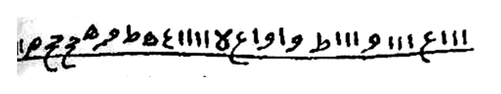
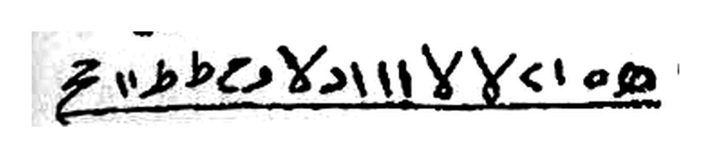
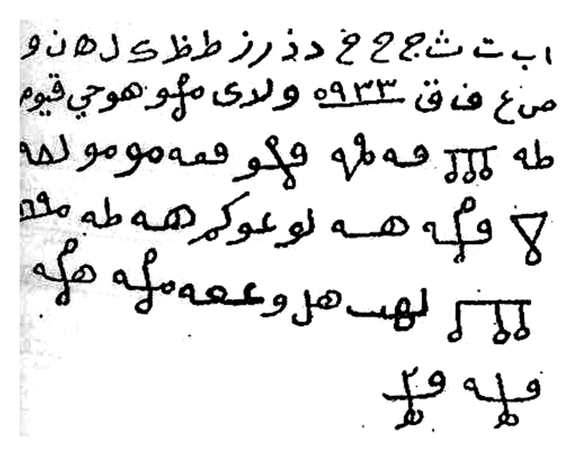
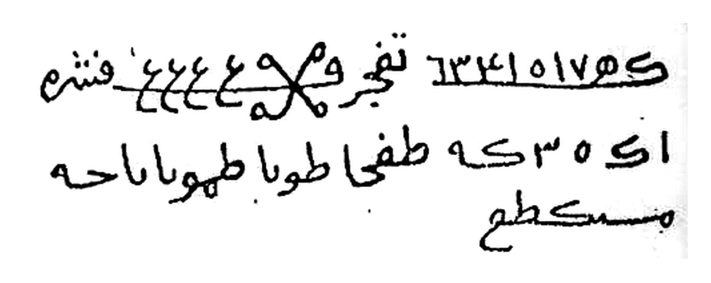
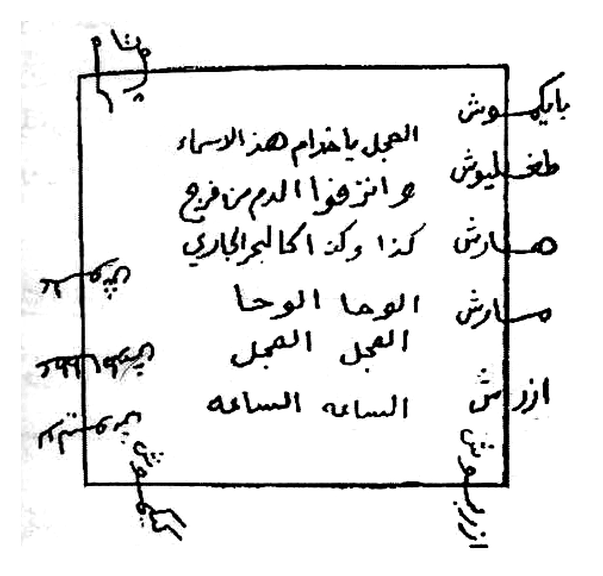
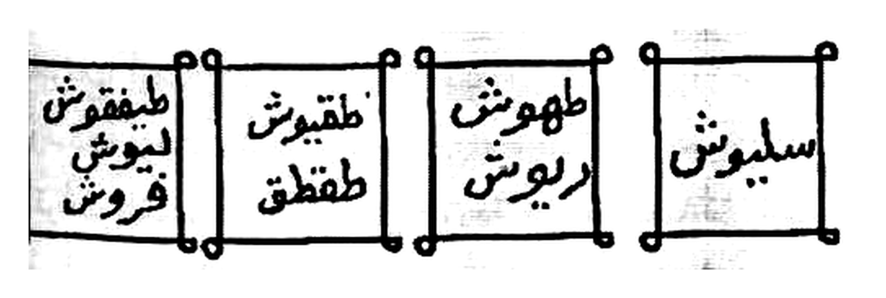
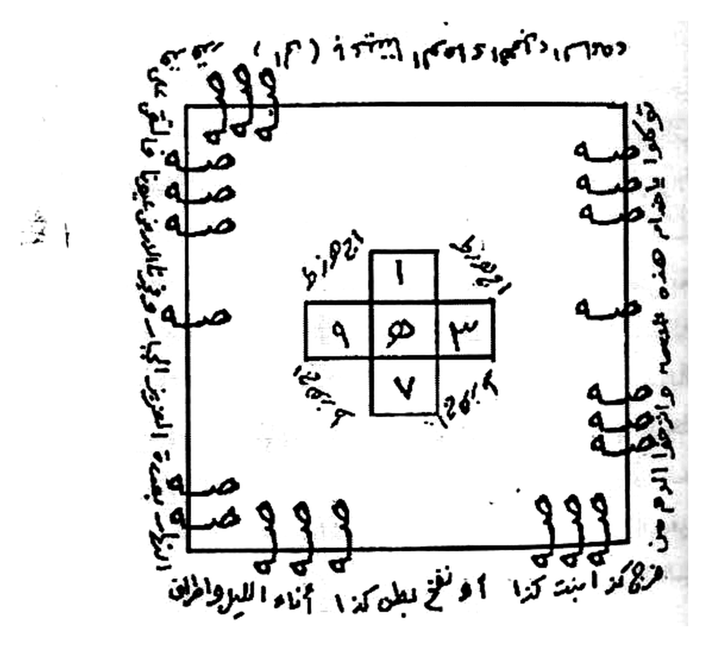

# BATCH 35 — Halaman 170–174 — Tilasm 26–30 & Pembuka al-Qasam ats-Tsalits
> **Kitab Asrar wa Khofayyat fi 'Ilmi Ruhaniyyat — Syeikh Athiyyah Abdul Hamid — Terjemahan Lengkap Indonesia — Batch 35 (Hal. 170–174)**

**Sumber:** Picture 086.jpg (Hal170-171), 087.jpg (Hal172-173), 088.jpg (Hal174-175)
**Total Rajah Batch35:** 7 Rajah HQ latar putih bersih (170×3 + 171×1 + 172×2 + 173×1 + 174×0)
**Isi:** Hal170 varian naskah Tilasm 25 & Tilasm 26 — Hal171–173 Tilasm 27–30 (bab nazf ad-dam & nafkh) — Hal174 pembuka al-Qasam ats-Tsalits (tanpa Rajah)
**Sambungan:** melanjutkan Batch34 yang berhenti di Hal169 (Tilasm 25)

---

### Halaman 170 — Varian Naskah Tilasm 25 & Tilasm 26 (Karahah, Bughdhah, 'Adawah)

**[Teks Arab Asli]**

> وفي نسخة هكذا بالسطر الثاني
>
> ❲ رسم الطلسم — السطر الثاني ❳
>
> والثالث هكذا ❲ رسم الطلسم — السطر الثالث ❳
>
> وبقية الطلسم كما تقدم في الأول والآخر
>
> **الطلسم السادس والعشرون**
>
> للكرامة والبغضة والعداوة تكتبه على شقفة نية وتبخره بالبخور المذكور وتتلو عليه القسم ١٣ مرة وتذيبها وترشها في طريقهم فإنهم يفترقون في طرفة عين .
>
> وهو هذا الطلسم
>
> ❲ رسم الطلسم — ست أسطر ❳

**[Transliterasi Latin Fonetik — bacaan washal]**

> Wa fī nuskhatin hākadzā bis-saṭhrits-tsānī ❲ rasmuth-thilasm ❳. Wats-tsālitsu hākadzā ❲ rasmuth-thilasm ❳. Wa baqiyyatuth-thilasmi kamā taqaddama fil-awwali wal-ākhir.
>
> **Aṭh-Ṭhilasmus-sādisu wal-'isyrūn.**
>
> Lil-karāhati wal-bughḍhati wal-'adāwah: taktubuhū 'alā syaqfatin niyyah, wa tubakhkhiruhū bil-bakhūril-madzkūr, wa tatlū 'alaihil-qasama tsalātsa 'asyrata marrah, wa tudzībuhā wa tarusysyuhā fī ṭharīqihim, fa innahum yaftariqūna fī ṭharfati 'ain.
>
> Wa huwa hādzath-thilasm ❲ rasmuth-thilasm ❳.

**[Terjemahan Indonesia]**

> Dan dalam satu naskah lain, baris keduanya tertulis demikian ❲ gambar rajah ❳. Adapun baris ketiganya demikian ❲ gambar rajah ❳. Sedangkan sisa tilasmnya sama seperti yang telah lewat, baik bagian awal maupun bagian akhirnya.
>
> **Tilasm Kedua Puluh Enam**
>
> Untuk kebencian, kemurkaan, dan permusuhan: engkau menuliskannya pada pecahan tembikar yang masih mentah, mengasapinya dengan dupa yang telah disebutkan, dan membacakan al-Qasam atasnya tiga belas kali. Kemudian engkau larutkan pecahan itu dan engkau percikkan di jalan yang biasa mereka lalui — niscaya mereka akan berpisah dalam sekejap mata.
>
> Dan inilah tilasmnya ❲ gambar rajah ❳.

*Gambar Rajah Asli Halaman 170 — varian naskah lain untuk **baris kedua** Tilasm 25 — satu baris goresan bergaris bawah penuh — latar putih bersih*

*Gambar Rajah Asli Halaman 170 — varian naskah lain untuk **baris ketiga** Tilasm 25 — teks cetak `والثالث هكذا` di kanannya sengaja tidak ikut dipotong agar yang tampil murni goresan rajah — latar putih bersih*

*Gambar Rajah Asli Halaman 170 — Tilasm 26 — enam baris: dua baris teratas deretan huruf muqaththa'ah dan angka `٩٣٣`, empat baris berikutnya goresan tilasm dengan simbol segitiga terbalik (▽) dan dua simbol "sisir" bergigi tiga — latar putih bersih*

---

### Halaman 171 — Tilasm 27 (Nazf ad-Dam) & Awal Tilasm 28

**[Teks Arab Asli]**

> **الطلسم السابع والعشرون**
>
> لنزف الدم وهو أمانة في عنقك لأنه من القواطع تكتبه في يوم الثلاثاء بقلم نحاس على قادوس والبخور عمال وتحط في القادوس ماء وتعلقه في مطلع الشمس وتثقبه ثقباً خفيفاً وتضع تحته ماعوناً يلتقي الماء الذي ينزل منه وكل ما قرب ينقص رجع الماء في القادوس فاتق الله وكن من الصالحين .
>
> وهذا هو الطلسم
>
> ❲ رسم الطلسم — ثلاثة أسطر ❳
>
> توكلوا يا خدام هذه الأسماء وانزفوا الدم من كذا وكذا دماً جارياً لا ينقطع آناء الليل وأطراف النهار بقدرة العزيز الجبار . وفجرنا الأرض عيوناً فالتقى الماء على أمر قد قدر . وحملناه على ذات ألواح ودسر . تجري بأعيننا .
>
> **الطلسم الثامن والعشرون**
>
> للنزيف أيضاً تكتبه في ورقة حمراء وتضع الورقة في قصبة فارسي وسدها بزفت وشمع وضعها في ماء فإن الدم يجري كالبحر وتكون قرأت القسم ١٣ مرة على الورقة قبل وضعها في القصبة والبخور المذكور شغال واحذر من ضياع القصبة بالعمل فإن

**[Transliterasi Latin Fonetik — bacaan washal]**

> **Aṭh-Ṭhilasmus-sābi'u wal-'isyrūn.**
>
> Li nazfid-dam — wa huwa amānatun fī 'unuqika li annahū minal-qawāthi' — taktubuhū fī yaumits-tsulātsā'i bi qalami nuḥāsin 'alā qādūs, wal-bakhūru 'ammāl. Wa taḥuththu fil-qādūsi mā'an wa tu'alliquhū fī maṭhla'isy-syams, wa tatsquhubū tsaqban khafīfan, wa taḍha'u taḥtahū mā'ūnan yaltaqil-mā'al-ladzī yanzilu minh. Wa kullamā qaruba yanquṣhu rajji'il-mā'a fil-qādūs. Fattaqillāha wa kun minash-shāliḥīn.
>
> Wa hādzā huwath-thilasm ❲ rasmuth-thilasm ❳.
>
> Tawakkalū yā khuddāma hādzihil-asmā'i wanzifud-dama min kadzā wa kadzā, daman jāriyan lā yanqaṭhi'u ānā'al-laili wa aṭhrāfan-nahār, bi qudratil-'Azīzil-Jabbār. *Wa fajjarnal-arḍha 'uyūnan faltaqal-mā'u 'alā amrin qad qudir. Wa ḥamalnāhu 'alā dzāti alwāḥin wa dusur. Tajrī bi a'yuninā.*
>
> **Aṭh-Ṭhilasmuts-tsāminu wal-'isyrūn.**
>
> Lin-nazīfi aiḍhan: taktubuhū fī waraqatin ḥamrā', wa taḍha'ul-waraqata fī qaṣhabatin fārisī, wa suddahā bi ziftin wa syam'in, wa ḍha'hā fī mā' — fa innad-dama yajrī kal-baḥr. Wa takūna qara'tal-qasama tsalātsa 'asyrata marratan 'alal-waraqati qabla waḍh'ihā fil-qaṣhabah, wal-bakhūrul-madzkūru syaghghāl. Waḥdzar min ḍhayā'il-qaṣhabati bil-'amali fa inna…

**[Terjemahan Indonesia]**

> **Tilasm Kedua Puluh Tujuh**
>
> Untuk menumpahkan darah — dan ia adalah amanat di lehermu, sebab termasuk golongan *al-qawathi'* (amalan pemutus yang berbahaya). Engkau menuliskannya pada hari Selasa dengan pena tembaga di atas sebuah **qadus** (kendi tanah bergayung), sementara dupa terus menyala. Lalu engkau tuangkan air ke dalam qadus itu, menggantungkannya menghadap tempat terbitnya matahari, melubanginya dengan lubang halus, dan meletakkan sebuah wadah di bawahnya untuk menampung air yang menetes darinya. Setiap kali airnya hampir habis, kembalikanlah air itu ke dalam qadus. Maka bertakwalah kepada Allah dan jadilah engkau termasuk orang-orang yang saleh.
>
> Dan inilah tilasmnya ❲ gambar rajah ❳.
>
> *Lafalnya:* Bertawakallah wahai para khadim nama-nama ini, dan tumpahkanlah darah dari si Fulan bin Fulanah — darah yang mengalir tiada henti di sepanjang malam dan di ujung-ujung siang, dengan kodrat Dzat Yang Mahaperkasa lagi Mahaberkuasa. *"Dan Kami jadikan bumi memancarkan mata air-mata air, maka bertemulah air-air itu untuk suatu urusan yang sungguh telah ditetapkan. Dan Kami angkut dia ke atas (bahtera) yang terbuat dari papan dan pasak. Yang berlayar dengan pengawasan Kami."*
>
> **Tilasm Kedua Puluh Delapan**
>
> Untuk pendarahan juga: engkau menuliskannya pada selembar kertas merah, lalu kertas itu engkau masukkan ke dalam sebuah **buluh Persia**, engkau sumbat dengan ter dan lilin, kemudian engkau letakkan di dalam air — maka darah akan mengalir bagaikan lautan. Dan hendaklah engkau telah membacakan al-Qasam tiga belas kali atas kertas itu sebelum memasukkannya ke dalam buluh, sedang dupa yang telah disebutkan terus bekerja. Berhati-hatilah jangan sampai buluh itu hilang selama amalan berlangsung, sebab… *[bersambung ke Hal172]*

*Gambar Rajah Asli Halaman 171 — Tilasm 27 — tiga baris: baris pertama diawali deret angka ber-garis bawah lalu goresan bersimbol silang-simpul (✗), baris kedua deret huruf muqaththa'ah, baris ketiga satu kata penutup pendek — latar putih bersih*

---

### Halaman 172 — Rajah Tilasm 28 & Tilasm 29 (Nazif)

**[Teks Arab Asli]**

> المعمول له يهلك .
>
> وهذا هو الطلسم
>
> ❲ رسم الطلسم — إطار مربع ❳
> العمود الأيمن : بايكموش ، طغليوش ، صارش ، مارش ، ازراش
> داخل الإطار : العجل يا خدام هذه الأسماء وانزفوا الدم من فرج كذا وكذا كالبحر الجاري ، الوحا الوحا ، العجل العجل ، الساعة الساعة
>
> **الطلسم التاسع والعشرون**
>
> للنزيف أيضاً تفعل به كما تقدم بالتصريف الذي قبله .
>
> وهو هذا
>
> ❲ رسم الطلسم — أربعة مربعات ❳
> سليموش ❘ طهوش ديوش ❘ طقيوش طقطق ❘ طيفقوش ليوش فروش

**[Transliterasi Latin Fonetik — bacaan washal]**

> …al-ma'mūlu lahū yahlik.
>
> Wa hādzā huwath-thilasm ❲ rasmuth-thilasm ❳:
> *Al-'amūdul-aiman:* Bāyikamūsy, Thaghliyūsy, Shārasy, Mārasy, Azrāsy.
> *Dākhilal-iṭhār:* Al-'ajala yā khuddāma hādzihil-asmā'i wanzifud-dama min farji kadzā wa kadzā kal-baḥril-jārī, al-waḥal-waḥā, al-'ajalal-'ajal, as-sā'atas-sā'ah.
>
> **Aṭh-Ṭhilasmut-tāsi'u wal-'isyrūn.**
>
> Lin-nazīfi aiḍhan: taf'alu bihī kamā taqaddama bit-taṣhrīfil-ladzī qablah.
>
> Wa huwa hādzā ❲ rasmuth-thilasm ❳: Salīmūsy ❘ Thahūsy Dayūsy ❘ Thaqiyūsy Thaqthaq ❘ Thayfaqūsy Layūsy Farūsy.

**[Terjemahan Indonesia]**

> …orang yang diamalkan terhadapnya itu akan binasa.
>
> Dan inilah tilasmnya ❲ gambar rajah ❳:
> *Kolom kanan:* Bayikamusy, Thaghliyusy, Sharasy, Marasy, Azrasy.
> *Di dalam bingkai:* Segeralah, wahai para khadim nama-nama ini! Tumpahkanlah darah dari rahim si Fulanah binti Fulanah bagaikan lautan yang mengalir — cepat, cepat! Segera, segera! Saat ini juga, saat ini juga!
>
> **Tilasm Kedua Puluh Sembilan**
>
> Untuk pendarahan juga: engkau memperlakukannya sebagaimana yang telah lewat, dengan tata cara pengamalan yang sama seperti sebelumnya.
>
> Dan inilah ia ❲ gambar rajah ❳: Salimusy ❘ Thahusy Dayusy ❘ Thaqiyusy Thaqthaq ❘ Thayfaqusy Layusy Farusy.

*Gambar Rajah Asli Halaman 172 — Tilasm 28 — rajah berbingkai persegi: lima nama 'ajamiyyah tersusun menurun menembus sisi kanan bingkai, lafal seruan enam baris di tengah, serta goresan-goresan penjuru di luar keempat sudut bingkai — rajah berbingkai pertama di batch ini — latar putih bersih*

*Gambar Rajah Asli Halaman 172 — Tilasm 29 — empat kotak bersebelahan bersudut bulat, masing-masing memuat satu sampai tiga nama 'ajamiyyah, dibaca dari kanan ke kiri — latar putih bersih*

---

### Halaman 173 — Lafal Tilasm 29 & Tilasm 30 (Nafkh)

**[Teks Arab Asli]**

> توكلوا يا خدام هذه الأسماء وانزفوا كذا وكذا الوحا العجل الساعة .
>
> **الطلسم الثلاثون**
>
> لنفخ من شئت في الوقت والحال تكتبه في ورقة حمراء يوم الثلاثاء وبخرها برائحة كريهة وضعها في قربة وعلقها في حائط وبخر تحتها البخور واتل عليها القسم ١٣ مرة وكل مرة تشير بيدك إلى القربة في آخر مرة ترتعد القربة وتتمخض مثل المطلقة فينتفخ الخصم .
>
> وهو هذا الطلسم
>
> ❲ رسم الطلسم — إطار مربع ❳
> على الأضلاع : صه صه صه … و و و
> الوفق الأوسط : ١ / ٩ ٥ ٣ / ٧
> الهامش : توكلوا يا خدام هذه الأسماء وانزفوا الدم من فرج كذا ابنت كذا أو نفخ بطن كذا آناء الليل وأطراف النهار

**[Transliterasi Latin Fonetik — bacaan washal]**

> Tawakkalū yā khuddāma hādzihil-asmā'i wanzifū kadzā wa kadzā, al-waḥal-'ajalas-sā'ah.
>
> **Aṭh-Ṭhilasmuts-tsalātsūn.**
>
> Li nafkhi man syi'ta fil-waqti wal-ḥāl: taktubuhū fī waraqatin ḥamrā'a yaumats-tsulātsā', wa bakhkhirhā bi rā'iḥatin karīhah, wa ḍha'hā fī qirbatin wa 'alliqhā fī ḥā'iṭh, wa bakhkhir taḥtahal-bakhūr, watlu 'alaihal-qasama tsalātsa 'asyrata marrah, wa kulla marratin tusyīru bi yadika ilal-qirbah. Fī ākhiri marratin tarta'idul-qirbatu wa tatamakhkhaḍhu mitslal-muṭhallaqah, fa yantafikhul-khaṣhm.
>
> Wa huwa hādzath-thilasm ❲ rasmuth-thilasm ❳:
> *'Alal-aḍhlā':* Shah shah shah … wa wa wa.
> *Al-wafqul-ausaṭh:* 1 / 9 5 3 / 7.
> *Al-hāmisy:* Tawakkalū yā khuddāma hādzihil-asmā'i wanzifud-dama min farji kadzā ibnati kadzā au nafkhi baṭhni kadzā, ānā'al-laili wa aṭhrāfan-nahār.

**[Terjemahan Indonesia]**

> *Lafal rajah sebelumnya:* Bertawakallah wahai para khadim nama-nama ini, dan tumpahkanlah darah si Fulan bin Fulanah — cepat, segera, saat ini juga!
>
> **Tilasm Ketiga Puluh**
>
> Untuk membuat perut siapa pun yang engkau kehendaki menjadi kembung seketika itu juga: engkau menuliskannya pada selembar kertas merah di hari Selasa, lalu engkau asapi dengan bau yang busuk, engkau masukkan ke dalam sebuah **qirbah** (kantong kulit air), dan engkau gantungkan pada dinding. Asapilah dupa di bawahnya, lalu bacakanlah al-Qasam atasnya tiga belas kali; setiap kali membaca, engkau tunjuk kantong itu dengan tanganmu. Pada bacaan yang terakhir, kantong itu akan bergetar dan mengejan bagaikan perempuan yang akan melahirkan — maka perut lawanmu pun mengembung.
>
> Dan inilah tilasmnya ❲ gambar rajah ❳:
> *Pada keempat sisi:* "shah, shah, shah… wa, wa, wa".
> *Wafaq di tengah:* 1 / 9 — 5 — 3 / 7.
> *Pada tepi luar:* Bertawakallah wahai para khadim nama-nama ini, dan tumpahkanlah darah dari rahim si Fulanah binti Fulanah, atau kembungkanlah perut si Fulan, di sepanjang malam dan di ujung-ujung siang.

*Gambar Rajah Asli Halaman 173 — Tilasm 30 — rajah berbingkai persegi terbesar di batch ini: lafal `صه` berulang menurun di sisi kiri dan kanan, huruf `و` berulang di sisi atas dan bawah, wafaq salib berisi angka `١` di atas — `٩ ٥ ٣` di tengah — `٧` di bawah, serta tulisan tepi mengelilingi keempat sisi bingkai — latar putih bersih*

---

### Halaman 174 — Pembuka al-Qasam ats-Tsalits (Khusus Sepuluh Tilasm Terakhir)

**[Teks Arab Asli]**

> وهذا هو القسم الثالث الخاص بالعشرة طلاسم المذكورة تقول :
>
> بسم الله الرحمن الرحيم
>
> الحمد لله الذي أنشأ الموجودات بقدرته من العدم إلى الوجود . وسيعيدها بحكمته من الحياة إلى اللحود . وسيبعثها بإرادته لليوم الموعود . لا إله إلا هو الملك الحق المبين الذي حكم على كل شيء بما سبق في علم غيبه وأزليته وجميع ما في الكائنات جميعها في قبضته ويسبح الرعد بحمده والملائكة من خيفته . أنزل الوحي على المرسلين وعلى من يشاء من عباده المصطفين . لا إله إلا هو الملك الحق المبين الغفور الشكور العلي الكبير الحفيظ المقيت الحسيب الجليل الكريم الرقيب المجيب الواسع الحكيم الودود المجيد الباعث الشهيد الحق الوكيل القوي المتين الولي الحميد المحصي المبدئ المعيد . ألا له الخلق والأمر تبارك الله رب العالمين .
>
> لا إله إلا هو الملك الحق المبين . أقسمت عليكم يا خدام أسمائه بأسمائه لجر مقامي واقضوا حاجتي بحق سلطيهيتالخ سمهيسهيالخ صيجقالخ سحملهوخ صفعجيثا شمشهالخ شمهليخا هطمهيلا شرهيثا هيوت القدوس المتعال طيفويالخ شمليخالخ هسكمالخ بطاعة أسماء الله اللاهوتية الطاعة .
>
> يا خدام أسمائه بحق الله خالق الخلق أجمعين . لا إله إلا هو الملك الحق المبين . أين خدام أسمائه الغفور الشكور العلي الكبير الحفيظ المقيت الحسيب الجليل الكريم . أقسمت عليكم بقول رب العالمين

**[Transliterasi Latin Fonetik — bacaan washal]**

> Wa hādzā huwal-qasamuts-tsālitsul-khāṣhu bil-'asyarati thalāsimal-madzkūrah, taqūl:
>
> **Bismillāhir-Raḥmānir-Raḥīm.**
>
> Al-ḥamdu lillāhil-ladzī ansya'al-maujūdāti bi qudratihī minal-'adami ilal-wujūd. Wa sayu'īduhā bi ḥikmatihī minal-ḥayāti ilal-luḥūd. Wa sayab'atsuhā bi irādatihī lil-yaumil-mau'ūd. Lā ilāha illā huwal-Malikul-Ḥaqqul-Mubīn, alladzī ḥakama 'alā kulli syai'in bimā sabaqa fī 'ilmi ghaibihī wa azaliyyatih. Wa jamī'u mā fil-kā'ināti jamī'uhā fī qabḍhatih. Wa yusabbiḥur-ra'du bi ḥamdihī wal-malā'ikatu min khīfatih. Anzalal-waḥya 'alal-mursalīna wa 'alā man yasyā'u min 'ibādihil-muṣhṭhafain. Lā ilāha illā huwal-Malikul-Ḥaqqul-Mubīn, al-Ghafūrusy-Syakūrul-'Aliyyul-Kabīrul-Ḥafīzhul-Muqītul-Ḥasībul-Jalīlul-Karīmur-Raqībul-Mujībul-Wāsi'ul-Ḥakīmul-Wadūdul-Majīdul-Bā'itsusy-Syahīdul-Ḥaqqul-Wakīlul-Qawiyyul-Matīnul-Waliyyul-Ḥamīdul-Muḥṣhil-Mubdi'ul-Mu'īd. Alā lahul-khalqu wal-amr, tabārakallāhu rabbul-'ālamīn.
>
> Lā ilāha illā huwal-Malikul-Ḥaqqul-Mubīn. Aqsamtu 'alaikum yā khuddāma asmā'ihī bi asmā'ihī li jarri maqāmī, waqḍū ḥājatī bi ḥaqqi: Salṭhīhītālakh, Samhīsahyālakh, Shīyajqālakh, Saḥmalahūkh, Shaf'ajītsā, Syamsyahālakh, Syamhalīkhā, Haṭhmahīlā, Syarhītsā, Hayūtul-Quddūsul-Muta'āl, Thayfawiyālakh, Syamlīkhālakh, Hasakmālakh — bi ṭhā'ati asmā'illāhil-lāhūtiyyah, aṭh-ṭhā'ah.
>
> Yā khuddāma asmā'ihī bi ḥaqqillāhi khāliqil-khalqi ajma'īn. Lā ilāha illā huwal-Malikul-Ḥaqqul-Mubīn. Aina khuddāmu asmā'ihil-Ghafūrisy-Syakūril-'Aliyyil-Kabīril-Ḥafīzhil-Muqītil-Ḥasībil-Jalīlil-Karīm. Aqsamtu 'alaikum bi qauli rabbil-'ālamīn…

**[Terjemahan Indonesia]**

> Dan inilah **al-Qasam yang ketiga**, yang khusus untuk sepuluh tilasm yang telah disebutkan. Engkau mengucapkan:
>
> **Dengan nama Allah Yang Maha Pengasih lagi Maha Penyayang.**
>
> Segala puji bagi Allah yang telah mengadakan segala yang maujud dengan kodrat-Nya, dari ketiadaan menuju keberadaan. Dia akan mengembalikannya dengan hikmah-Nya, dari kehidupan menuju liang-liang kubur. Dan Dia akan membangkitkannya dengan kehendak-Nya pada hari yang telah dijanjikan. Tiada tuhan selain Dia, Sang Raja Yang Hak lagi Maha Nyata, yang telah menetapkan hukum atas segala sesuatu menurut apa yang telah terdahulu di dalam ilmu gaib dan keazalian-Nya. Segala yang ada di dalam semesta, seluruhnya berada dalam genggaman-Nya. Guruh bertasbih memuji-Nya, demikian pula para malaikat karena takut kepada-Nya. Dia menurunkan wahyu kepada para rasul dan kepada siapa saja yang Dia kehendaki dari hamba-hamba-Nya yang terpilih. Tiada tuhan selain Dia, Sang Raja Yang Hak lagi Maha Nyata — al-Ghafur, asy-Syakur, al-'Aliy, al-Kabir, al-Hafizh, al-Muqit, al-Hasib, al-Jalil, al-Karim, ar-Raqib, al-Mujib, al-Wasi', al-Hakim, al-Wadud, al-Majid, al-Ba'its, asy-Syahid, al-Haqq, al-Wakil, al-Qawiy, al-Matin, al-Waliy, al-Hamid, al-Muhshi, al-Mubdi', al-Mu'id. Ingatlah, hanya milik-Nya segala penciptaan dan segala urusan. Mahasuci Allah, Tuhan semesta alam.
>
> Tiada tuhan selain Dia, Sang Raja Yang Hak lagi Maha Nyata. Aku bersumpah atas kalian, wahai para khadim nama-nama-Nya, demi nama-nama-Nya itu, demi tegaknya kedudukanku — tunaikanlah hajatku dengan hak: Salthihitalakh, Samhisahyalakh, Shiyajqalakh, Sahmalahukh, Shaf'ajitsa, Syamsyahalakh, Syamhalikha, Hathmahila, Syarhitsa, Hayut al-Quddus al-Muta'al, Thayfawiyalakh, Syamlikhalakh, Hasakmalakh — dengan ketaatan kepada nama-nama Allah yang lahutiyyah. Taat, patuhlah!
>
> Wahai para khadim nama-nama-Nya, demi Allah Pencipta seluruh makhluk. Tiada tuhan selain Dia, Sang Raja Yang Hak lagi Maha Nyata. Di manakah para khadim nama-nama-Nya al-Ghafur, asy-Syakur, al-'Aliy, al-Kabir, al-Hafizh, al-Muqit, al-Hasib, al-Jalil, al-Karim? Aku bersumpah atas kalian demi firman Tuhan semesta alam… *[bersambung ke Hal175]*

> *Catatan: halaman ini murni teks Qasam — **tidak ada Rajah**. Lafal Basmalah di tengah halaman ditulis dengan khat kaligrafis, bukan rajah, sehingga tidak ikut dipotong.*

---

### Catatan Tashih Batch 35

| Hal | Isi | Rajah |
|-----|-----|-------|
| 170 | Varian naskah baris ke-2 & ke-3 Tilasm 25 + Tilasm 26 (syaqfah niyyah, tafriq) | 3 |
| 171 | Tilasm 27 (qadus tembaga, nazf ad-dam) + awal Tilasm 28 (buluh Persia) | 1 |
| 172 | Rajah berbingkai Tilasm 28 + Tilasm 29 (empat kotak) | 2 |
| 173 | Lafal Tilasm 29 + Tilasm 30 (qirbah, nafkh) dengan wafaq salib | 1 |
| 174 | Pembuka al-Qasam ats-Tsalits — hamdalah, Asma' al-Husna, 13 nama 'ajamiyyah | — |

**Bacaan yang perlu ditashih ulang ke cetakan aslinya:**

1. **Hal170 — `للكرامة`**: scan jelas memperlihatkan *lil-karāmah* (kemuliaan), padahal konteksnya `والبغضة والعداوة` (kemarahan dan permusuhan) menuntut `للكراهة` — *lil-karāhah* (kebencian). Diterjemahkan mengikuti konteks; huruf aslinya dipertahankan apa adanya di blok Arab.
2. **Hal170 — `وتذيبها`**: terbaca *tudzībuhā* (melarutkan). Karena bahannya `شقفة` (pecahan tembikar), sebagian naskah sejenis membaca `وتدقها` (menumbuknya) atau `وتدفنها` (menguburnya). Diterjemahkan "melarutkan" sesuai cetakan, selaras dengan kata berikutnya `وترشها` (memercikkan).
3. **Hal171 — `والبخور عمال`**: titik huruf pertama kata `البخور` sangat tipis pada scan sehingga dapat terbaca `اليخور`. Dibaca `البخور` karena kalimat sejajarnya di halaman yang sama berbunyi `والبخور المذكور شغال`.
4. **Hal171 — `وكل ما قرب ينقص رجع الماء في القادوس`**: dibaca sebagai `وكلما قرُب ينقص رجِّع الماء في القادوس` ("setiap kali hampir habis, kembalikan airnya"), karena pembacaan harfiahnya tidak membentuk kalimat yang utuh.
5. **Hal171 — `قصبة فارسي`**: tertulis tanpa ta' marbuthah; bacaan bakunya `قصبة فارسية`.
6. **Hal174 — `الإ له الخلق والأمر`**: cetakan memisah `الا` menjadi `الإ`; yang dimaksud adalah `أَلَا لَهُ الْخَلْقُ وَالْأَمْرُ` (QS. al-A'raf 54).
7. **Hal174 — `لجر مقامي`**: bacaan *li jarri maqāmī* ("demi tarikan kedudukanku") janggal maknanya; kemungkinan besar salah cetak dari `لِجَبْرِ مَقَامِي` ("demi tegaknya/pulihnya kedudukanku"). Diterjemahkan mengikuti makna yang terakhir.
8. **Nama-nama 'ajamiyyah** (Hal172–174): deretan `بايكموش`…`ازراش`, `سليموش`…`فروش`, dan `سلطيهيتالخ`…`هسكمالخ` adalah *asma' a'jamiyyah* yang tidak bermakna dalam bahasa Arab; titik dan harakatnya tipis pada scan, sehingga transliterasinya bersifat pendekatan bunyi dan **tidak diterjemahkan**.
9. **Ayat yang dikutip** — Hal171 memuat QS. al-Qamar 12–14 (`وفجرنا الأرض عيوناً` … `تجري بأعيننا`) secara berurutan di dalam lafal rajah.
10. Goresan rajah **tidak dialihaksarakan** menjadi huruf Latin — hanya lafal cetak dan tulisan tangan yang masih terbaca di dalam/di tepi bingkai yang ditransliterasi, sesuai kaidah Batch 01.

**Catatan teknis Rajah:** scan sumber berukuran 1755×1275 px untuk satu bentangan 2 halaman (≈155 DPI optik per halaman). Berkas rajah ditandai **300 DPI** dan diperbesar 4× LANCZOS mengikuti konvensi batch-batch sebelumnya; ketajaman optiknya tetap setara sumber. Latar diputihkan dengan koreksi *flat-field* (bukan ambang kecerahan tetap) agar bayangan lipatan buku hilang tanpa memotong goresan — lihat `crop_rajah_batch35.py`. Khusus rajah varian baris ke-3 Hal170, teks cetak `والثالث هكذا` dipisahkan dari goresan lewat celah kolom sehingga berkasnya memuat rajah saja.

---

**Lanjutan:** Batch 36 menyambung di **Hal 175–179** (Picture 088–090), melanjutkan al-Qasam ats-Tsalits yang terputus di tengah kalimat `أقسمت عليكم بقول رب العالمين`.
