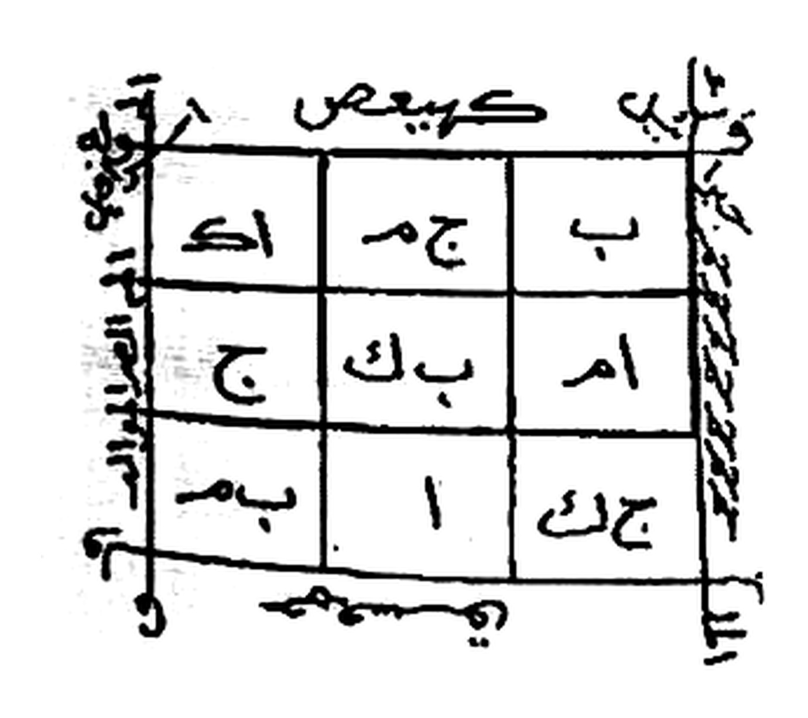

# BATCH 37 — Halaman 180–184 — Penutup Da'wah al-Jalalah, Da'wah al-Ism al-A'zham & ash-Shifah fi Ismillah al-A'zham
> **Kitab Asrar wa Khofayyat fi 'Ilmi Ruhaniyyat — Syeikh Athiyyah Abdul Hamid — Terjemahan Lengkap Indonesia — Batch 37 (Hal. 180–184)**

**Sumber:** Picture 091.jpg (Hal180–181), 093.jpg (Hal182–183), 094.jpg (Hal184–185 — dipakai belahan kanan saja)
**Total Rajah Batch37:** 1 Rajah — **Khatam Da'wah al-Jalalah** (wafaq 3×3 berhuruf) pada Hal180. Hal181–184 murni teks.
**Isi:** Hal180 penutup **Da'wah al-Jalalah** + khatamnya — Hal181–183 bab **Da'wah al-Ism al-A'zham** — Hal183–184 bab baru **ash-Shifah fi Ismillah al-A'zham**
**Sambungan:** melanjutkan Batch36 yang berhenti di Hal179 pada seruan `أجيبوا يا`

> **Catatan sumber — duplikat foto:** `Picture 092.jpg` adalah **foto ulang dari bentangan yang sama** dengan `Picture 091.jpg` (keduanya memuat Hal180–181). Kedua berkas berbeda secara biner namun identik susunannya, sehingga penomoran `Picture NNN` **melompat satu** mulai dari sini: Hal182–183 jatuh pada Picture 093, bukan 092. Pemetaan yang sudah diverifikasi lewat nomor halaman cetak: 091→180/181, **092→180/181 (duplikat)**, 093→182/183, 094→184/185, 095→186/187, 096→188/189, 097→190/191, 098→192/193, 099→194/195, 100→196/197.

---

### Halaman 180 — Penutup Da'wah al-Jalalah & Khatamnya

**[Teks Arab Asli]**

> …معاشر الخدام بحق الله الجليل جل جلاله الفرد الصمد الذي قضاؤه مضمون وأمره بين الكاف والنون إنما أمره إذا أراد شيئاً أن يقول له كن فيكون . أجيبوا بحق الملك كسفيائيل وبحق الاسم المكتوب على فلك زحل .
>
> أجيبوا بحق الله الباعث الوارث الجليل القادر المقتدر الديان الواحد الأحد الفرد الصمد الأزلي المبدئ المعيد . أجيبوا بحق الملك الغالب كسفيائيل عليكم وبحق سيدنا محمد ﷺ وبحق الله الغالب على كل شيء افعلوا ما أمرتكم به .
>
> بحق من قال للسموات والأرض (الآية) إلى قوله تعالى لله رب العالمين ذلكم ربكم (الآية) . أجب ياقهرماني ذلكم ربكم أزكى لكم وأطهر فإن لم تجد فإن الله غفور رحيم . خادم نبي الله سليمان بن داود عليهما السلام .
>
> بحق من قال يا أيها الملك أيكم يأتيني بعرشها (إلى قوله تعالى) غني كريم بالسكينة والوقار . يا قومنا أجيبوا داعي الله وآمنوا به يغفر لكم من ذنوبكم ويجركم من عذاب أليم ومن لا يجيب داعي الله فليس بمعجز في الأرض وليس له من دونه أولياء أولئك في ضلال مبين .
>
> وهذا صفة الخاتم لدعوة الجلالة

**[Transliterasi Latin Fonetik — bacaan washal]**

> *…Ma'āsyiral-khuddāmi bi ḥaqqillāhil-Jalīli jalla jalāluhul-Fardiṣh-Shamadil-ladzī qaḍhā'uhū maḍhmūnun wa amruhū bainal-kāfi wan-nūn, innamā amruhū idzā arāda syai'an an yaqūla lahū kun fa yakūn. Ajībū bi ḥaqqil-malaki Kasfayā'īla wa bi ḥaqqil-ismil-maktūbi 'alā falaki Zuḥal.*
>
> *Ajībū bi ḥaqqillāhil-Bā'itsil-Wāritsil-Jalīlil-Qādiril-Muqtadirid-Dayyānil-Wāḥidil-Aḥadil-Fardiṣh-Shamadil-Azaliyyil-Mubdi'il-Mu'īd. Ajībū bi ḥaqqil-malakil-ghālibi Kasfayā'īla 'alaikum wa bi ḥaqqi sayyidinā Muḥammadin ṣhallallāhu 'alaihi wa sallama wa bi ḥaqqillāhil-ghālibi 'alā kulli syai'in if'alū mā amartukum bih.*
>
> *Bi ḥaqqi man qāla lis-samāwāti wal-arḍhi (al-āyah) ilā qaulihī ta'ālā lillāhi rabbil-'ālamīn, dzālikum rabbukum (al-āyah). Ajib yā Qahramānī, dzālikum rabbukum azkā lakum wa aṭhhar, fa in lam tajid fa innallāha ghafūrun raḥīm. Khādimu nabiyyillāhi Sulaimānabni Dāwūda 'alaihimas-salām.*
>
> *Bi ḥaqqi man qāla yā ayyuhal-mala'u ayyukum ya'tīnī bi 'arsyihā (ilā qaulihī ta'ālā) ghaniyyun karīm, bis-sakīnati wal-waqār. Yā qaumanā ajībū dā'iyallāhi wa āminū bihī yaghfir lakum min dzunūbikum wa yujirkum min 'adzābin alīm, wa man lā yujib dā'iyallāhi fa laisa bi mu'jizin fil-arḍhi wa laisa lahū min dūnihī auliyā'u, ulā'ika fī ḍhalālin mubīn.*
>
> *Wa hādzā ṣhifatul-khātami li da'watil-jalālah.*

**[Terjemahan Indonesia]**

> *…Wahai sekalian khadam, demi hak Allah Yang Mahaagung — Mahaagung keagungan-Nya — Yang Maha Esa lagi tempat bergantung, Yang keputusan-Nya pasti terlaksana dan perintah-Nya berada di antara huruf Kaf dan Nun; sesungguhnya perintah-Nya apabila Dia menghendaki sesuatu hanyalah berkata kepadanya: "Jadilah!" maka jadilah ia. Penuhilah seruan ini demi hak Malaikat Kasfaya'il dan demi hak nama yang tertulis pada falak Zuhal.*
>
> *Penuhilah seruan ini demi hak Allah Yang Membangkitkan, Yang Mewarisi, Yang Mahaagung, Yang Mahakuasa, Yang Mahaperkasa, Yang Maha Membalas, Yang Maha Tunggal, Yang Maha Esa, Yang Maha Mandiri, Yang menjadi tempat bergantung, Yang Azali, Yang Memulai penciptaan dan Yang Mengembalikannya. Penuhilah seruan ini demi hak malaikat yang berkuasa atas kalian, Kasfaya'il, demi hak junjungan kita Nabi Muhammad ﷺ, dan demi hak Allah Yang Mahamenang atas segala sesuatu — kerjakanlah apa yang kuperintahkan kepada kalian.*
>
> *Demi hak Dzat yang berfirman kepada langit dan bumi (sampai akhir ayat), hingga firman-Nya: "milik Allah Tuhan semesta alam; itulah Allah Tuhan kalian" (sampai akhir ayat). Sambutlah, wahai Qahramani! "Itulah yang lebih suci dan lebih bersih bagi kalian; dan jika engkau tidak mendapati, maka sesungguhnya Allah Maha Pengampun lagi Maha Penyayang." Khadam Nabi Allah Sulaiman bin Dawud 'alaihimas-salam.*
>
> *Demi hak Dzat yang berfirman: "Hai para pembesar, siapakah di antara kalian yang sanggup mendatangkan singgasananya kepadaku?" (sampai firman-Nya) "Mahakaya lagi Mahamulia" — datanglah dengan tenang dan berwibawa. "Wahai kaum kami, sambutlah penyeru Allah dan berimanlah kepada-Nya, niscaya Dia mengampuni sebagian dosa-dosa kalian dan melepaskan kalian dari azab yang pedih. Dan barangsiapa tidak menyambut penyeru Allah, maka dia tidak akan melepaskan diri dari azab Allah di bumi, dan tidak ada baginya pelindung selain Allah. Mereka itu berada dalam kesesatan yang nyata."*
>
> *Dan inilah bentuk khatam (stempel) untuk Da'wah al-Jalalah.*

*Gambar Rajah Asli Halaman 180 — **Khatam Da'wah al-Jalalah** — wafaq 3×3 berisi huruf, dibaca dari kanan ke kiri lalu atas ke bawah: baris pertama `ب` · `ج م` · `اك`؛ baris kedua `ام` · `ب ك` · `ج`؛ baris ketiga `ج ك` · `ا` · `ب م`. Di tepi atas tertulis `كهيعص` beserta angka `٨`, tepi kiri memuat tulisan menurun yang memuat lafal `الله العظيم`, tepi bawah memuat `يس` dan huruf `و`, sedangkan tepi kanan berupa garis bergerigi (zigzag) sebagai bingkai — latar putih bersih*

---

### Halaman 181 — Da'wah al-Ism al-A'zham

**[Teks Arab Asli]**

> **دعوة الاسم الأعظم**
>
> بسم الله الرحمن الرحيم . اللهم إني أسألك أهم سقك حلع يص يا الله بحق اسمك العظيم الأعظم الأولى بذكرك القائم يا الله .
>
> أهم اللهم إني أسألك بحق اسمك أهم بالألوهية يا الله يا واحد يا أحد يا فرد ياصمد أنت أنت إله من في السموات ومن في الأرض وأنت الحاكم عليهم ياهادي يامؤمن يامهيمن يامتين . أهم سقك حلع يص يا الله هو ملك كريم سميع قادر حليم لطيف عليم بيقين صادق .
>
> اللهم إني أسألك بحق اسمك الذي استضأت بلوامع سواطعه السموات والأرض وفلقت بنوره فلق الصبح فاستمده بشعاعه أجسام نيرات فأدارت به مناطق نواطق الأفلاك بعزمك ويسرت به لطلاب رزقك بلوغ الأمل في ساحة حلمك وفتحت به أبواب الإجابة والطلب وألهمت به أولياءك فصارت دعوتهم بذلك مجابة وأنت السبب وشيدت به للعارفين ربوع الاستقامة .
>
> إلهي بحق إسمك الذي فتقت به الرتق سبح الغدق والجود والكرامة . إلهي وهو إسمك الذي فتقت به وأظهرت به معنى إسمك الحق وأبرزت به نواميس المكنونات من حرزك المصون وكونت به وأقسمت بالوهيتك الهياكل الجسمانية وكسوت بأحرف قابليته الحقيقة الإنسانية فسجدت له ملائكة القبول طوعاً لأمرك وتعظيماً لنفحة سرك الساري في الصور بصورة تدبيرك ورسمك .
>
> اللهم اغنيني بك عن سؤال خلقك بحقك عد ٧ مرات فإنه لا راد لأمرك ولا معقب

**[Transliterasi Latin Fonetik — bacaan washal]**

> ***Da'watul-Ismil-A'zham***
>
> *Bismillāhir-Raḥmānir-Raḥīm. Allāhumma innī as'aluka AHM SQK ḤL' YSH, yā Allāh, bi ḥaqqismikal-'Azhīmil-A'zhamil-ūlā bi dzikrikal-qā'imi yā Allāh.*
>
> *AHM. Allāhumma innī as'aluka bi ḥaqqismika AHM bil-ulūhiyyati yā Allāh. Yā Wāḥidu yā Aḥadu yā Fardu yā Shamadu, anta anta ilāhu man fis-samāwāti wa man fil-arḍhi wa antal-ḥākimu 'alaihim. Yā Hādī yā Mu'minu yā Muhaiminu yā Matīn. AHM SQK ḤL' YSH, yā Allāhu Huwa Malikun Karīmun Samī'un Qādirun Ḥalīmun Laṭhīfun 'Alīmun bi yaqīnin ṣhādiq.*
>
> *Allāhumma innī as'aluka bi ḥaqqismikal-ladzistaḍhā'at bi lawāmi'i sawāṭhi'ihis-samāwātu wal-arḍhu, wa falaqta bi nūrihī falaqaṣh-ṣhubḥi fastamaddahū bi syu'ā'ihī ajsāmun nayyirātun fa adārat bihī manāṭhiqa nawāṭhiqal-aflāki bi 'azmik, wa yassarta bihī li ṭhullābi rizqika bulūghal-amali fī sāḥati ḥilmik, wa fataḥta bihī abwābal-ijābati waṭh-ṭhalab, wa alhamta bihī auliyā'aka fa ṣhārat da'watuhum bi dzālika mujābatan wa antas-sabab, wa syayyadta bihī lil-'ārifīna rubū'al-istiqāmah.*
>
> *Ilāhī bi ḥaqqismikal-ladzī fataqta bihir-ratqa, sabbaḥal-ghadaqa wal-jūda wal-karāmah. Ilāhī wa huwasmukal-ladzī fataqta bihī wa azhharta bihī ma'nasmikal-Ḥaqq, wa abrazta bihī nawāmīsal-maknūnāti min ḥirzikal-mashūn, wa kawwanta bihī wa aqsamta bi ulūhiyyatikal-hayākilal-jismāniyyah, wa kasauta bi aḥrufi qābiliyyatihil-ḥaqīqatal-insāniyyah, fa sajadat lahū malā'ikatul-qabūli ṭhau'an li amrika wa ta'zhīman li nafḥati sirrikas-sārī fiṣh-ṣhuwari bi ṣhūrati tadbīrika wa rasmik.*
>
> *Allāhumma aghninī bika 'an su'āli khalqika bi ḥaqqik — 'adad 7 marrāt — fa innahū lā rādda li amrika wa lā mu'aqqib.*

**[Terjemahan Indonesia]**

> ***Seruan Nama Yang Teragung***
>
> *Dengan nama Allah Yang Maha Pengasih lagi Maha Penyayang. Ya Allah, sesungguhnya aku memohon kepada-Mu dengan AHM SQK HAL' YASH, wahai Allah, demi hak nama-Mu Yang Mahaagung lagi Teragung, yang paling utama untuk menyebut-Mu, Yang Mahategak, wahai Allah.*
>
> *AHM. Ya Allah, sesungguhnya aku memohon kepada-Mu demi hak nama-Mu AHM dengan sifat ketuhanan, wahai Allah. Wahai Yang Maha Tunggal, wahai Yang Maha Esa, wahai Yang Maha Mandiri, wahai Tempat Bergantung — Engkau, Engkaulah Tuhan bagi siapa pun yang ada di langit dan siapa pun yang ada di bumi, dan Engkaulah Yang Berkuasa atas mereka. Wahai Yang Maha Memberi Petunjuk, wahai Yang Maha Mengaruniakan Keamanan, wahai Yang Maha Memelihara, wahai Yang Mahakukuh. AHM SQK HAL' YASH — wahai Allah, Dialah Raja Yang Mahamulia, Maha Mendengar, Mahakuasa, Maha Penyantun, Mahalembut, Maha Mengetahui, dengan keyakinan yang benar.*
>
> *Ya Allah, sesungguhnya aku memohon kepada-Mu demi hak nama-Mu yang dengan kilauan pancarannya langit dan bumi memperoleh cahaya; dengan cahaya nama itu Engkau belah fajar subuh, lalu jasad-jasad yang bersinar mengambil tambahan sinar darinya, sehingga dengan nama itu berputarlah lingkar-lingkar falak yang bertutur atas kehendak-Mu. Dengan nama itu pula Engkau mudahkan bagi para pencari rezeki-Mu untuk menggapai harapan di pelataran kesantunan-Mu; dengan nama itu Engkau bukakan pintu-pintu ijabah dan permohonan; dengan nama itu Engkau ilhamkan kepada para wali-Mu sehingga doa mereka menjadi terkabul — dan Engkaulah sebabnya; dan dengan nama itu Engkau tegakkan bagi para arif petala-petala keistiqamahan.*
>
> *Tuhanku, demi hak nama-Mu yang dengannya Engkau pisahkan apa yang semula menyatu; yang bertasbih dengan limpahan air, kedermawanan, dan kemuliaan. Tuhanku, itulah nama-Mu yang dengannya Engkau pisahkan, Engkau tampakkan makna nama-Mu Al-Haqq, Engkau keluarkan rahasia-rahasia yang tersembunyi dari benteng-Mu yang terjaga; dengannya Engkau wujudkan dan Engkau sumpahkan — demi ketuhanan-Mu — segala kerangka jasmani; dengan huruf-huruf daya terimanya Engkau kenakan busana hakikat insani, sehingga para malaikat penerimaan bersujud kepadanya karena taat pada perintah-Mu dan karena mengagungkan hembusan rahasia-Mu yang mengalir di dalam rupa-rupa dengan bentuk pengaturan dan rancangan-Mu.*
>
> *Ya Allah, cukupkanlah aku dengan-Mu sehingga tidak perlu meminta kepada makhluk-Mu, demi hak-Mu — (dibaca 7 kali) — sebab tidak ada yang dapat menolak perintah-Mu dan tidak ada yang dapat mengubah ketetapan-Mu.*

---

### Halaman 182 — Lanjutan Da'wah al-Ism al-A'zham (Rangkaian Ayat & Permohonan Perlindungan)

**[Teks Arab Asli]**

> …لحكمك لتفتق عين قلبي فتبدأ منه شموس الأشراق وتنكشف كسائف سحب حجب فأدرك بك محاسن الأخلاق . اللهم اكسي قلبي جزاء بثوب القناعة مما به تفضلت بغلب تسلمي على الجزء الاختياري فإني أشهد أنك أنت الله .
>
> اللهم طهرني بطهور الإيمان من دنس هفوات اللذات . اللهم احمني بحمايتك من الوقوع في الذلات لأصير بمحض كرمك متصلاً لا منفصلاً وعلى سوابغ المواهب مشتملاً . لا معطي سواك ولا مانع لعطائك ولا راد لقضائك يا الله عد ٣ .
>
> ياحي ياقيوم ياعلي ياعظيم ياذا الجلال والإكرام كهيعص حمعسق . كما أنزلناه من السماء فاختلط به نبات الأرض فأصبح هشيماً تذروه الرياح . هو الله الذي لا إله إلا هو عالم الغيب والشهادة هو الرحمن الرحيم . يوم أزفت الآزفة إذا القلوب لدى الحناجر كاظمين ما للظالمين من حميم ولا شفيع يطاع . علمت نفس ما أحضرت فلا أقسم بالخنس الجوار الكنس والليل إذا عسعس والصبح إذا تنفس . ص والقرآن ذي الذكر بل الذين كفروا في عزة وشقاق .
>
> اللهم إني أسألك بحق اسمك العظيم الأعظم أن تحفظني بحفظك من الشيطان وشركه ومن شر السلطان وجوره ومن شر بني آدم وحسده ومن شر كل دابة أنت آخذ بناصيتها إن ربي على صراط مستقيم . توكلت على الله حسبي الله وكفى سمع الله لمن دعا حسبي الله لا إله إلا هو عليه توكلت وهو رب العرش العظيم .
>
> اللهم اجعل صباحنا صباح الصالحين وقلوبنا قلوب الخاشعين وألسنتنا ألسنة الذاكرين ومساءنا

**[Transliterasi Latin Fonetik — bacaan washal]**

> *…li ḥukmika li taftaqa 'aina qalbī fa tabda'a minhu syumūsul-isyrāqi wa tankasyifa kasā'ifu suḥubi ḥujubin fa udrika bika maḥāsinal-akhlāq. Allāhummaksi qalbī jazā'an bi tsaubil-qanā'ati mimmā bihī tafaḍhḍhalta bi ghalabi tasallumī 'alal-juz'il-ikhtiyārī, fa innī asyhadu annaka antallāh.*
>
> *Allāhumma ṭhahhirnī bi ṭhahūril-īmāni min danasi hafawātil-ladzdzāt. Allāhummaḥminī bi ḥimāyatika minal-wuqū'i fidz-dzallāti li aṣhīra bi maḥḍhi karamika muttaṣhilan lā munfaṣhilan wa 'alā sawābighil-mawāhibi musytamilā. Lā mu'ṭhiya siwāka wa lā māni'a li 'aṭhā'ika wa lā rādda li qaḍhā'ika yā Allāh — 'adad 3.*
>
> *Yā Ḥayyu yā Qayyūmu yā 'Aliyyu yā 'Azhīmu yā Dzal-Jalāli wal-Ikrām, KHY'SH ḤM'SQ. Kamā anzalnāhu minas-samā'i fakhtalaṭha bihī nabātul-arḍhi fa aṣhbaḥa hasyīman tadzrūhur-riyāḥ. Huwallāhul-ladzī lā ilāha illā huwa 'ālimul-ghaibi wasy-syahādati huwar-Raḥmānur-Raḥīm. Yauma azifatil-āzifati idzil-qulūbu ladal-ḥanājiri kāzhimīn, mā lizh-zhālimīna min ḥamīmin wa lā syafī'in yuṭhā'. 'Alimat nafsun mā aḥḍharat. Fa lā uqsimu bil-khunnasil-jawāril-kunnas, wal-laili idzā 'as'as, waṣh-ṣhubḥi idzā tanaffas. Shād, wal-qur'āni dzidz-dzikri, balil-ladzīna kafarū fī 'izzatin wa syiqāq.*
>
> *Allāhumma innī as'aluka bi ḥaqqismikal-'Azhīmil-A'zhami an taḥfazhanī bi ḥifzhika minasy-syaiṭhāni wa syarakihī, wa min syarris-sulṭhāni wa jaurihī, wa min syarri banī ādama wa ḥasadihī, wa min syarri kulli dābbatin anta ākhidzun bi nāṣhiyatihā, inna rabbī 'alā ṣhirāṭhin mustaqīm. Tawakkaltu 'alallāh, ḥasbiyallāhu wa kafā, sami'allāhu li man da'ā, ḥasbiyallāhu lā ilāha illā huwa 'alaihi tawakkaltu wa huwa rabbul-'arsyil-'azhīm.*
>
> *Allāhummaj'al ṣhabāḥanā ṣhabāḥaṣh-ṣhāliḥīn, wa qulūbanā qulūbal-khāsyi'īn, wa alsinatanā alsinatadz-dzākirīn, wa masā'anā…*

**[Terjemahan Indonesia]**

> *…bagi hukum-Mu, agar Engkau bukakan mata hatiku sehingga darinya terbit matahari-matahari penyinaran, tersingkap gumpalan awan hijab, lalu dengan-Mu aku meraih keindahan akhlak. Ya Allah, kenakanlah pada hatiku — sebagai balasan — pakaian qana'ah dari karunia yang Engkau limpahkan, dengan menangnya penyerahan diriku atas bagian ikhtiyari (pilihan hawaku); sebab aku bersaksi bahwa Engkaulah Allah.*
>
> *Ya Allah, sucikanlah aku dengan kesucian iman dari kotoran ketergelinciran syahwat. Ya Allah, lindungilah aku dengan perlindungan-Mu dari terjatuh ke dalam kehinaan, agar dengan kemurnian kemurahan-Mu aku menjadi orang yang tersambung dan tidak terputus, serta terliputi oleh limpahan anugerah yang sempurna. Tiada pemberi selain Engkau, tiada yang dapat menahan pemberian-Mu, dan tiada yang dapat menolak keputusan-Mu, wahai Allah — (dibaca 3 kali).*
>
> *Wahai Yang Mahahidup, wahai Yang Maha Berdiri Sendiri, wahai Yang Mahatinggi, wahai Yang Mahaagung, wahai Pemilik Keagungan dan Kemuliaan. Kaf Ha Ya 'Ain Shad, Ha Mim 'Ain Sin Qaf. "Sebagaimana air yang Kami turunkan dari langit, lalu tumbuh-tumbuhan bumi bercampur dengannya, kemudian menjadi kering diterbangkan angin." "Dialah Allah, tiada tuhan selain Dia, Yang Mengetahui yang gaib dan yang nyata; Dialah Yang Maha Pengasih lagi Maha Penyayang." "Pada hari yang semakin dekat, ketika hati menyesak sampai ke kerongkongan karena menahan duka; tiada bagi orang-orang zalim seorang teman setia pun dan tiada pula pemberi syafaat yang diterima." "Setiap jiwa mengetahui apa yang telah dikerjakannya." "Maka Aku bersumpah demi bintang-bintang yang beredar dan terbenam, demi malam apabila telah larut, dan demi subuh apabila mulai bernapas." "Shad. Demi Al-Qur'an yang mengandung peringatan. Sebenarnya orang-orang kafir itu berada dalam kesombongan dan permusuhan."*
>
> *Ya Allah, sesungguhnya aku memohon kepada-Mu demi hak nama-Mu Yang Mahaagung lagi Teragung, agar Engkau menjagaku dengan penjagaan-Mu dari setan dan jerat-jeratnya, dari kejahatan penguasa dan kezalimannya, dari kejahatan anak Adam dan kedengkiannya, serta dari kejahatan setiap makhluk melata yang ubun-ubunnya berada dalam genggaman-Mu. Sesungguhnya Tuhanku berada di atas jalan yang lurus. Aku bertawakal kepada Allah; cukuplah Allah bagiku dan Dia memadai; Allah mendengar siapa yang berdoa; cukuplah Allah bagiku, tiada tuhan selain Dia, kepada-Nya aku bertawakal, dan Dialah Tuhan pemilik 'Arsy yang agung.*
>
> *Ya Allah, jadikanlah pagi kami pagi orang-orang saleh, hati kami hati orang-orang yang khusyuk, lisan kami lisan orang-orang yang berzikir, dan sore kami…*

---

### Halaman 183 — Penutup Da'wah al-Ism al-A'zham & Bab Baru: ash-Shifah fi Ismillah al-A'zham

**[Teks Arab Asli]**

> …مساء الموحدين . اللهم ارفع عنا غضبك أجمعين . اللهم ارزقنا خير الصباح وخير المساء وخير القضاء وخير القدر وخير ما جرى به القلم .
>
> اللهم اجعل اول يومنا هذا صلاحاً وأوسطه فلاحاً وآخره نشاطاً ونجاحاً . اللهم بارك لنا في يومنا هذا ويوم القيامة إنك على كل شيء قدير .
>
> اللهم اجعل لنا في يومنا هذا خيراً وارزقنا فيه الشكر والذكر الحكيم والعفاف وسماحة النفس والسلامة والإثبات والفهم والرشد والتوفيق والرضا والمرار والتوية والقوة والعافية في الدين والدنيا والآخرة برحمتك يا أرحم الراحمين . وصلى الله على سيدنا محمد وعلى آله وصحبه وسلم .
>
> **الصفة في اسم الله الأعظم**
>
> هذا صفة الاسم المفرد تقول ـ بسم الله الرحمن الرحيم . اللهم إني أسألك بحق حقيقة اسمك الأعظم يا الله يا نور يا عليم يارحمن يارحيم .
>
> يا من تشعشع نوره من عرشه إلى فرشه وتعالى عن الشبيه والتطهير فلا شيء كمثله . وقهر العباد بسلطان سطوته وصار الملك مملوكاً لعظمته وسرى سر سره في جميع مخلوقاته .
>
> أن ترزقني الافتقار إليك والعبودية وتهب لي مقام الوحدة والوحدانية وتجملني بتجميل الأحدية والصمدانية وتعلمني بخواص العلوم اللدنية وتغمسني في أنوار الألوهية الذاتية وتغيبني بك منك فيك عن رؤية الآثار بالكلية وتجمع بيني وبين من فضلته على سائر البرية محمد ﷺ .
>
> (أجب دعوتي ياقريب يامجيب الدعوات وياكاشف الكروبات يا من

**[Transliterasi Latin Fonetik — bacaan washal]**

> *…masā'al-muwaḥḥidīn. Allāhummarfa' 'annā ghaḍhabaka ajma'īn. Allāhummarzuqnā khairaṣh-ṣhabāḥi wa khairal-masā'i wa khairal-qaḍhā'i wa khairal-qadari wa khaira mā jarā bihil-qalam.*
>
> *Allāhummaj'al awwala yauminā hādzā ṣhalāḥan wa ausaṭhahū falāḥan wa ākhirahū nasyāṭhan wa najāḥā. Allāhumma bārik lanā fī yauminā hādzā wa yaumal-qiyāmati innaka 'alā kulli syai'in qadīr.*
>
> *Allāhummaj'al lanā fī yauminā hādzā khairan warzuqnā fīhisy-syukra wadz-dzikral-ḥakīma wal-'afāfa wa samāḥatan-nafsi was-salāmata wal-itsbāta wal-fahma war-rusyda wat-taufīqa war-riḍhā wal-marāra wat-tawiyata wal-quwwata wal-'āfiyata fid-dīni wad-dunyā wal-ākhirati bi raḥmatika yā Arḥamar-rāḥimīn. Wa ṣhallallāhu 'alā sayyidinā Muḥammadin wa 'alā ālihī wa ṣhaḥbihī wa sallam.*
>
> ***Ash-Shifatu fismillāhil-A'zham***
>
> *Hādzā ṣhifatul-ismil-mufrad. Taqūlu: Bismillāhir-Raḥmānir-Raḥīm. Allāhumma innī as'aluka bi ḥaqqi ḥaqīqatismikal-A'zham, yā Allāhu yā Nūru yā 'Alīmu yā Raḥmānu yā Raḥīm.*
>
> *Yā man tasya'sya'a nūruhū min 'arsyihī ilā farsyihī wa ta'ālā 'anisy-syabīhi wat-taṭhhīri fa lā syai'a ka mitslih. Wa qaharal-'ibāda bi sulṭhāni saṭhwatihī wa ṣhāral-maliku mamlūkan li 'azhamatihī wa sarā sirru sirrihī fī jamī'i makhlūqātih.*
>
> *An tarzuqanil-iftiqāra ilaika wal-'ubūdiyyata, wa tahaba lī maqāmal-waḥdati wal-waḥdāniyyati, wa tujammilanī bi tajmīlil-aḥadiyyati waṣh-ṣhamadāniyyati, wa tu'allimanī bi khawāṣhil-'ulūmil-ladunniyyati, wa taghmisanī fī anwāril-ulūhiyyatidz-dzātiyyati, wa tughayyibanī bika minka fīka 'an ru'yatil-ātsāri bil-kulliyyati, wa tajma'a bainī wa baina man faḍhḍhaltahū 'alā sā'iril-bariyyati Muḥammadin ṣhallallāhu 'alaihi wa sallam.*
>
> *(Ajib da'watī yā Qarību yā Mujībad-da'awāti wa yā Kāsyifal-kurubāti yā man…*

**[Terjemahan Indonesia]**

> *…sore orang-orang yang mentauhidkan-Mu. Ya Allah, angkatlah dari kami murka-Mu seluruhnya. Ya Allah, karuniakanlah kepada kami kebaikan pagi, kebaikan sore, kebaikan qadha', kebaikan qadar, dan kebaikan segala yang telah dituliskan oleh pena takdir.*
>
> *Ya Allah, jadikanlah awal hari kami ini kebaikan, pertengahannya keberuntungan, dan akhirnya kebugaran serta keberhasilan. Ya Allah, berkahilah kami pada hari kami ini dan pada hari kiamat; sesungguhnya Engkau Mahakuasa atas segala sesuatu.*
>
> *Ya Allah, jadikanlah bagi kami kebaikan pada hari kami ini, dan karuniakanlah kepada kami di dalamnya rasa syukur, zikir yang penuh hikmah, penjagaan diri, kelapangan jiwa, keselamatan, keteguhan, kepahaman, kelurusan jalan, taufik, keridhaan, ketabahan, tobat, kekuatan, dan afiat dalam agama, dunia, dan akhirat — dengan rahmat-Mu, wahai Yang Paling Penyayang di antara para penyayang. Semoga Allah melimpahkan shalawat atas junjungan kita Nabi Muhammad, atas keluarga dan para sahabatnya, serta salam sejahtera.*
>
> ***Tata Cara (Sifat) pada Nama Allah Yang Teragung***
>
> *Inilah sifat (tata cara) Nama Tunggal. Engkau ucapkan: Dengan nama Allah Yang Maha Pengasih lagi Maha Penyayang. Ya Allah, sesungguhnya aku memohon kepada-Mu demi hak hakikat nama-Mu Yang Teragung, wahai Allah, wahai Cahaya, wahai Yang Maha Mengetahui, wahai Yang Maha Pengasih, wahai Yang Maha Penyayang.*
>
> *Wahai Dzat yang cahaya-Nya berpendar dari 'Arsy-Nya sampai ke hamparan bumi-Nya, Yang Mahatinggi dari segala keserupaan dan dari penyucian yang menyerupakan, maka tiada sesuatu pun yang menyamai-Nya. Dialah yang menundukkan para hamba dengan kekuasaan keperkasaan-Nya, sehingga raja pun menjadi hamba di hadapan keagungan-Nya, dan rahasia dari rahasia-Nya mengalir pada seluruh makhluk-Nya.*
>
> *(Aku memohon) agar Engkau karuniakan kepadaku rasa butuh kepada-Mu dan sikap penghambaan; Engkau anugerahkan kepadaku maqam kesatuan dan keesaan; Engkau perindah aku dengan keindahan ahadiyyah dan shamadaniyyah; Engkau ajarkan kepadaku kekhususan ilmu-ilmu ladunni; Engkau selamkan aku ke dalam cahaya ketuhanan yang bersifat dzatiyyah; Engkau lenyapkan aku dengan-Mu, dari-Mu, di dalam-Mu, dari memandang segala bekas makhluk secara keseluruhan; dan Engkau pertemukan aku dengan orang yang Engkau utamakan atas seluruh makhluk, yaitu Muhammad ﷺ.*
>
> *(Sambutlah seruanku, wahai Yang Mahadekat, wahai Yang Mengabulkan segala doa, wahai Yang Menyingkap segala kesusahan, wahai Dzat yang…*

---

### Halaman 184 — Lanjutan ash-Shifah: Seruan kepada Para Malaikat Muqarrabin

**[Teks Arab Asli]**

> …تقلبني حيث شئت وتحفظني حيث شئت) (ما شاء الله كان وما لم يشأ لم يكن اجعل مكنون إرادتي بين الكاف والنون) .
>
> وأسألك اللهم يا الله ٣ بحق حضرتك القدسية وملائكتك أهل الصفات الجوهرية الذين طوقتهم بأنوار ذاتك العلية أن تتولى يا ولي قبض روحي بألطاف لطيف لطفك يا رحمن يا رحيم يا غافر الذنوب والسيئات .
>
> (وأن تسخر لي ملائكتك أهل السموات المنزهون عن الكدرات والشهوات يكونوا لي عوناً على ما أريد بحق اسمك العظيم الأعظم يا من هو فعال لما يريد) .
>
> وبحق ياه ياه ياه ٢٨ ياسميع ٣ ياقريب يامجيب ياسريع لمن دعاك . أجيبوا واستجيبوا أيتها الملائكة الأملاك الكرام المتصرفون بقدرة الملك العلام في جميع الساعات والليالي والأيام .
>
> (أجب أيها الملك الجليل روفيائيل أنت وخدامك وأعوانك وأتباعك العلوية والسفلية وافعلوا ما أريد بحق اسم الله الأعلى الأعز الأكرم وهو الله الله الله) .
>
> (أجب أيها الملك الجليل جبرائيل أنت وخدامك وأعوانك وأتباعك العلوية والسفلية وافعلوا ما أريد بحق اسم الله الأعلى الأعز الأكرم وهو الله الله الله) .
>
> (أجب أيها الملك الجليل سمسمائيل أنت وخدامك وأعوانك وأتباعك العلوية والسفلية وافعلوا ما أريد) (بحق اسم الله الأعلى الأعز الأكرم وهو الله الله الله) .
>
> أجب أيها الملك الجليل ميكائيل أنت وخدامك وأعوانك وأتباعك العلوية والسفلية وافعلوا ما أريد بحق اسم الله الأعلى الأعز الأكرم وهو الله الله الله . أجب أيها الملك الجليل صرفيائيل أنت وخدامك

**[Transliterasi Latin Fonetik — bacaan washal]**

> *…tuqallibunī ḥaitsu syi'ta wa taḥfazhunī ḥaitsu syi'ta.) (Mā syā'allāhu kāna wa mā lam yasya' lam yakun — ij'al maknūna irādatī bainal-kāfi wan-nūn.)*
>
> *Wa as'alukallāhumma yā Allāh (3×) bi ḥaqqi ḥaḍhratikal-qudsiyyati wa malā'ikatika ahliṣh-ṣhifātil-jauhariyyatil-ladzīna ṭhawwaqtahum bi anwāri dzātikal-'aliyyati an tatawallā yā Waliyyu qabḍha rūḥī bi alṭhāfi laṭhīfi luṭhfika yā Raḥmānu yā Raḥīmu yā Ghāfiradz-dzunūbi was-sayyi'āt.*
>
> *(Wa an tusakhkhira lī malā'ikataka ahlas-samāwātil-munazzahūna 'anil-kadurāti wasy-syahawāti yakūnū lī 'aunan 'alā mā urīdu bi ḥaqqismikal-'Azhīmil-A'zhami yā man huwa fa''ālun li mā yurīd.)*
>
> *Wa bi ḥaqqi YĀH YĀH YĀH (28×), yā Samī'u (3×), yā Qarību yā Mujību yā Sarī'a li man da'āk. Ajībū wastajībū ayyatuhal-malā'ikatul-amlākul-kirāmul-mutaṣharrifūna bi qudratil-Malikil-'Allāmi fī jamī'is-sā'āti wal-layālī wal-ayyām.*
>
> *(Ajib ayyuhal-malakul-jalīlu Rūfayā'īlu anta wa khuddāmuka wa a'wānuka wa atbā'ukal-'ulwiyyatu was-sufliyyatu waf'alū mā urīdu bi ḥaqqismillāhil-A'lal-A'azzil-Akrami wa huwallāhullāhullāh.)*
>
> *(Ajib ayyuhal-malakul-jalīlu Jibrā'īlu anta wa khuddāmuka wa a'wānuka wa atbā'ukal-'ulwiyyatu was-sufliyyatu waf'alū mā urīdu bi ḥaqqismillāhil-A'lal-A'azzil-Akrami wa huwallāhullāhullāh.)*
>
> *(Ajib ayyuhal-malakul-jalīlu Samsamā'īlu anta wa khuddāmuka wa a'wānuka wa atbā'ukal-'ulwiyyatu was-sufliyyatu waf'alū mā urīd) (bi ḥaqqismillāhil-A'lal-A'azzil-Akrami wa huwallāhullāhullāh.)*
>
> *Ajib ayyuhal-malakul-jalīlu Mīkā'īlu anta wa khuddāmuka wa a'wānuka wa atbā'ukal-'ulwiyyatu was-sufliyyatu waf'alū mā urīdu bi ḥaqqismillāhil-A'lal-A'azzil-Akrami wa huwallāhullāhullāh. Ajib ayyuhal-malakul-jalīlu Ṣharfayā'īlu anta wa khuddāmuka…*

**[Terjemahan Indonesia]**

> *…Engkau balikkan aku ke mana Engkau kehendaki dan Engkau jaga aku di mana Engkau kehendaki.) (Apa yang Allah kehendaki pasti terjadi, dan apa yang tidak Dia kehendaki tidak akan terjadi — jadikanlah simpanan kehendakku berada di antara huruf Kaf dan Nun.)*
>
> *Dan aku memohon kepada-Mu, ya Allah — wahai Allah (3 kali) — demi hak hadirat kesucian-Mu dan demi para malaikat-Mu pemilik sifat-sifat jauhari yang telah Engkau kalungi dengan cahaya Dzat-Mu Yang Mahatinggi: hendaklah Engkau sendiri, wahai Yang Maha Melindungi, yang menangani pencabutan nyawaku dengan kelembutan dari kelembutan-Mu yang halus, wahai Yang Maha Pengasih, wahai Yang Maha Penyayang, wahai Pengampun segala dosa dan keburukan.*
>
> *(Dan hendaklah Engkau tundukkan untukku para malaikat-Mu penghuni langit yang disucikan dari segala kekeruhan dan syahwat, agar mereka menjadi penolongku atas apa yang kukehendaki, demi hak nama-Mu Yang Mahaagung lagi Teragung, wahai Dzat Yang Mahakuasa berbuat apa yang Dia kehendaki.)*
>
> *Dan demi hak YAH YAH YAH (28 kali), wahai Yang Maha Mendengar (3 kali), wahai Yang Mahadekat, wahai Yang Maha Mengabulkan, wahai Yang Mahacepat menjawab orang yang menyeru-Mu. Sambutlah dan penuhilah, wahai para malaikat yang mulia, yang bertindak dengan kekuasaan Raja Yang Maha Mengetahui pada seluruh saat, malam, dan siang.*
>
> *(Sambutlah, wahai malaikat yang agung, Rufaya'il — engkau beserta para khadam, para pembantu, dan para pengikutmu dari golongan atas maupun bawah; kerjakanlah apa yang kukehendaki, demi hak nama Allah Yang Mahatinggi, Mahaperkasa, Mahamulia; dan Dialah Allah, Allah, Allah.)*
>
> *(Sambutlah, wahai malaikat yang agung, Jibra'il — engkau beserta para khadam, para pembantu, dan para pengikutmu dari golongan atas maupun bawah; kerjakanlah apa yang kukehendaki, demi hak nama Allah Yang Mahatinggi, Mahaperkasa, Mahamulia; dan Dialah Allah, Allah, Allah.)*
>
> *(Sambutlah, wahai malaikat yang agung, Samsama'il — engkau beserta para khadam, para pembantu, dan para pengikutmu dari golongan atas maupun bawah; kerjakanlah apa yang kukehendaki) (demi hak nama Allah Yang Mahatinggi, Mahaperkasa, Mahamulia; dan Dialah Allah, Allah, Allah.)*
>
> *Sambutlah, wahai malaikat yang agung, Mika'il — engkau beserta para khadam, para pembantu, dan para pengikutmu dari golongan atas maupun bawah; kerjakanlah apa yang kukehendaki, demi hak nama Allah Yang Mahatinggi, Mahaperkasa, Mahamulia; dan Dialah Allah, Allah, Allah. Sambutlah, wahai malaikat yang agung, Sharfaya'il — engkau beserta para khadam…*

---

### Catatan Tashih Batch37

| Hal | Isi pokok | Rajah |
|-----|-----------|-------|
| 180 | Penutup **Da'wah al-Jalalah** — Malaikat Kasfaya'il, falak Zuhal, sisipan QS. Fushshilat 11, al-An'am 45, Hud 78, an-Naml 38–40, al-Ahqaf 31–32 | **1** (Khatam Da'wah al-Jalalah) |
| 181 | Bab **Da'wah al-Ism al-A'zham** — rantai sandi `أهم سقك حلع يص`, `عد ٧ مرات` | — |
| 182 | Lanjutan: permohonan futuh qalbi + rangkaian ayat (al-Kahfi 45, al-Hasyr 22–23, Ghafir 18, at-Takwir 15–18, Shad 1–2, Hud 56), `عد ٣` | — |
| 183 | Penutup Da'wah al-Ism al-A'zham + bab baru **ash-Shifah fi Ismillah al-A'zham** | — |
| 184 | Lanjutan ash-Shifah — seruan berurutan kepada Rufaya'il, Jibra'il, Samsama'il, Mika'il, Sharfaya'il; `ياه ٢٨`, `ياسميع ٣` | — |

**Struktur bab pada batch ini.** Hal180 menutup Da'wah al-Jalalah yang dibuka di Hal179, dan ditutup oleh khatamnya. Hal181 membuka bab **Da'wah al-Ism al-A'zham** yang berjalan sampai pertengahan Hal183. Pada pertengahan Hal183 dibuka bab **ash-Shifah fi Ismillah al-A'zham** yang belum selesai di Hal184 dan masih bersambung ke Hal185 (Batch 38).

**Bacaan yang perlu ditashih ulang ke cetakan aslinya:**

1. **Hal180 — `يا أيها الملك أيكم يأتيني بعرشها`**: bunyi baku QS. an-Naml 38 adalah `يَا أَيُّهَا الْمَلَأُ` (hai para pembesar), bukan `الْمَلِك` (raja). Cetakan menghilangkan hamzah; diterjemahkan mengikuti bacaan baku.
2. **Hal180 — `فإن لم تجد فإن الله غفور رحيم`**: potongan ini berasal dari QS. an-Nisa' 110 / al-Kahfi 58 yang berbunyi `فَإِنْ لَمْ تَجِدْ`; dalam konteks matan dipakai sebagai sisipan, bukan kutipan utuh satu ayat.
3. **Hal180 — `أجب ياقهرماني`**: `قهرماني` adalah nama khadam, bukan kata sifat. Dipertahankan sebagai nama diri.
4. **Hal180 — khatam**: isi kotak 3×3 adalah huruf-huruf abjad (`ا ب ج ك م`), bukan angka. Pola `ب` – `ج م` – `اك` dan seterusnya mengikuti sistem *huruf jumal*; nilai numeriknya tidak dicantumkan penerbit, karena itu tidak ditafsirkan di sini.
5. **Hal181 — `الأولى بذكرك القائم`**: susunan janggal. Kemungkinan `الْأَوْلَى بِذِكْرِكَ` (yang paling layak untuk menyebut-Mu) dengan `الْقَائِم` sebagai sifat bagi lafal Allah. Diterjemahkan demikian.
6. **Hal181 — `استضأت`**: cetakan terbaca `استنضأت`/`استضأت`; dibaca `اسْتَضَاءَتْ` (memperoleh cahaya), subjeknya `السموات والأرض`.
7. **Hal181 — `بيقين صادق`**: cetakan terbaca `بقين`; yang dimaksud `بِيَقِينٍ صَادِق`.
8. **Hal181 — `سبح الغدق`**: kata `سبح` kemungkinan salah cetak dari `سَيْح` (aliran/limpahan air), sehingga berbunyi `سَيْحَ الْغَدَقِ وَالْجُودِ وَالْكَرَامَة`. Dipertahankan apa adanya di blok Arab, diterjemahkan dengan makna limpahan.
9. **Hal181 — `وأقسمت بالوهيتك`**: dibaca `بِأُلُوهِيَّتِك`. Sebagian naskah sejenis membaca `وَأَقْسَمْتَ بِأُلُوهِيَّتِكَ الْهَيَاكِلَ` dengan makna "Engkau bagi-bagikan", dari akar `قَسَمَ` bukan `أَقْسَمَ` (bersumpah).
10. **Hal181 — `عد ٧ مرات`**: tanda cetak yang berarti "ulangi 7 kali", bukan bagian lafal doa.
11. **Hal182 — `كما أنزلناه من السماء`**: bunyi baku QS. al-Kahfi 45 adalah `كَمَاءٍ أَنْزَلْنَاهُ مِنَ السَّمَاءِ` (seperti air yang Kami turunkan). Cetakan menggabung `كماء` menjadi `كما`; diterjemahkan mengikuti bacaan baku.
12. **Hal182 — `والليل إذا عسعس`**: cetakan menulis `إذاً`; bunyi baku QS. at-Takwir 17 adalah `إِذَا` tanpa tanwin.
13. **Hal182 — `في عزة وشقاق`**: glif cetakan rancu antara `عزة` dan `غرة`. Bunyi baku QS. Shad 2 adalah `فِي عِزَّةٍ وَشِقَاق`; dipakai bacaan baku.
14. **Hal182 — `اكسي قلبي`**: dibaca sebagai fi'il amr `اكْسُ` (kenakanlah); huruf ya' pada cetakan adalah ejaan, bukan dhamir.
15. **Hal182 — `بغلب تسلمي`**: terbaca `بِغَلَبِ تَسَلُّمِي` (dengan menangnya penyerahan diriku). Sebagian naskah membaca `بِغَلَبَةِ تَسْلِيمِي`; makna keduanya berdekatan.
16. **Hal183 — `والمرار والتوية`**: dua kata ini janggal. `المرار` kemungkinan `الْمِرَار` (ketabahan) atau salah cetak dari `الْمَرَام` (cita-cita); `التوية` hampir pasti salah cetak dari `التَّوْبَة`. Diterjemahkan "ketabahan" dan "tobat".
17. **Hal183 — `وتعالى عن الشبيه والتطهير`**: `التطهير` janggal pada konteks tanzih. Kemungkinan salah cetak dari `التَّشْبِيه`/`التَّمْثِيل` atau dari `التَّطْيِير`. Diterjemahkan sebagai "penyucian yang menyerupakan" agar tetap sejalan dengan `فلا شيء كمثله`.
18. **Hal183 — `هذا صفة`**: semestinya `هٰذِهِ صِفَةُ` (muannats). Ejaan cetak dipertahankan.
19. **Hal184 — `ياه ياه ياه ٢٨`**: `٢٨` adalah bilangan pengulangan (28 kali), bukan bagian lafal. Demikian pula `ياسميع ٣`.
20. **Hal184 — `روفيائيل`, `سمسمائيل`, `صرفيائيل`**: tiga nama malaikat yang khas literatur ruhaniyyah dan tidak termasuk nama malaikat yang masyhur dalam nash. Ditransliterasikan apa adanya tanpa penyetaraan.
21. **Hal184 — `الملائكة الأملاك الكرام`**: penyebutan ganda (`الملائكة` + `الأملاك`) adalah gaya penguatan khas matan ini, bukan salah cetak.

**Catatan Rajah:** batch ini memuat **satu rajah**, yaitu Khatam Da'wah al-Jalalah pada Hal180. Pemotongannya memerlukan dua perlakuan khusus yang didokumentasikan di `crop_rajah_batch37.py`: (a) khatam berada tepat di sisi lipatan buku sehingga tulisan tepi kirinya tenggelam dalam bayangan gutter — batas kotak ditetapkan dari citra yang sudah dikoreksi *flat-field*, dan titik putih diturunkan ke `0.82` (Batch 34/35 memakai `0.88`); (b) teks cetak `وهذا صفة الخاتم لدعوة الجلالة` berjarak hanya ~2 px di sebelah kanan bingkai khatam, sehingga margin kanan dibuat nyaris nol agar prosa itu tidak ikut terpotong. Hal181–184 seluruhnya teks cetak tanpa rajah, wafaq, maupun tilsam.

**Total rajah kumulatif sampai Batch 37: 162.**

---

**Lanjutan:** Batch 38 menyambung di **Hal 185–189** (Picture 094 belahan kiri, 095, 096), melanjutkan bab ash-Shifah fi Ismillah al-A'zham yang terputus di `أجب أيها الملك الجليل صرفيائيل أنت وخدامك`.
