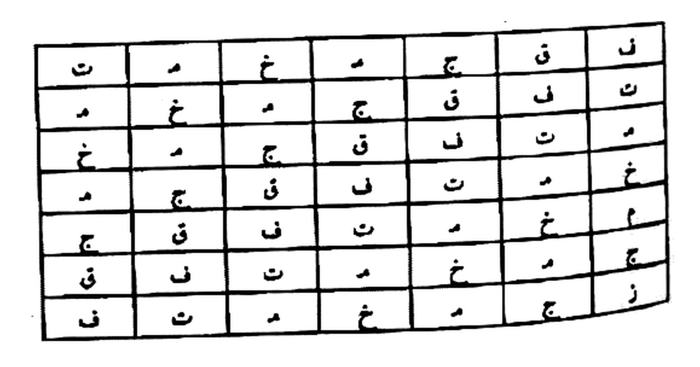
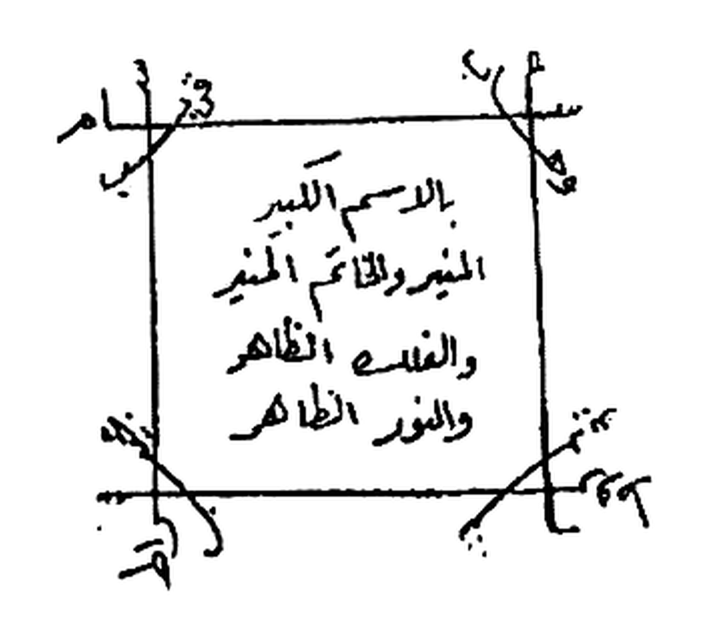
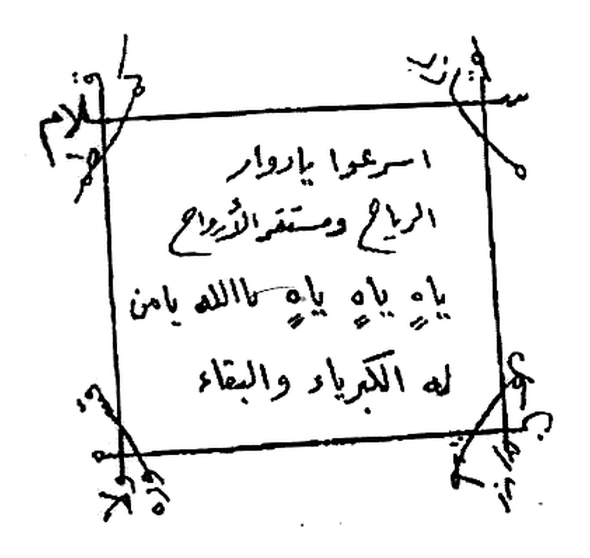

# BATCH 38 — Halaman 185–189 — Khatam Ism al-A'zham & Da'wah Ibrahim ad-Daili
> **Kitab Asrar wa Khofayyat fi 'Ilmi Ruhaniyyat — Syeikh Athiyyah Abdul Hamid — Terjemahan Lengkap Indonesia — Batch 38 (Hal. 185–189)**

**Sumber:** Picture 094.jpg (Hal184–185 — dipakai belahan kiri saja), 095.jpg (Hal186–187), 096.jpg (Hal188–189)
**Total Rajah Batch38:** 3 Rajah — Hal185 wafaq 7×7, Hal187 al-Khatam al-Kabir, Hal188 al-Khatam ash-Shaghir. Hal186 dan Hal189 tanpa rajah.
**Isi:** Hal185 penutup **ash-Shifah fi Ismillah al-A'zham** + khatamnya — Hal186 halaman katalog penerbit — Hal187–189 bab baru **Da'wah Ibrahim ad-Daili**
**Sambungan:** melanjutkan Batch37 yang berhenti di Hal184 pada seruan `أجب أيها الملك الجليل صرفيائيل أنت وخدامك`

---

### Halaman 185 — Penutup ash-Shifah fi Ismillah al-A'zham & Khatamnya

**[Teks Arab Asli]**

> …وأعوانك وأتباعك العلوية والسفلية وافعلوا ما أريد بحق اسم الله الأعلى الأعز الأكرم وهو الله الله الله .
>
> (أجب أيها الملك الجليل عنيائيل أنت وخدامك وأعوانك وأتباعك العلوية والسفلية وافعلوا ما أريد بحق اسم الله الأعلى الأعز الأكرم وهو الله الله الله) .
>
> أجب أيها الملك الجليل كسفيائيل أنت وخدامك وأعوانك وأتباعك العلوية والسفلية وافعلوا ما أريد بحق اسم الله الأعلى الأعز الأكرم وهو الله الله الله .
>
> أجيبوا معاشر الأرواح الروحانية والأرضية بحق ما أقسمت به عليكم وإنه لقسم لو تعلمون عظيم . الوحا٢ العجل٢ الساعة٢ . إن كانت إلا صيحة واحدة فإذا هم جميع لدينا محضرون . احضروا وأطيعوا .
>
> (بحق من تعالى فوق علوه الله نور السموات والأرض وخالق الطول والعرض نوره فوق كل نور وظلمته أبرق فيها فانجلت الظلمات وكذلك نري ابراهيم ملكوت السموات والأرض وليكون من الموقنين) .
>
> **وهذه صفة الخاتم**

**[Transliterasi Latin Fonetik — bacaan washal]**

> *…wa a'wānuka wa atbā'ukal-'ulwiyyatu was-sufliyyatu waf'alū mā urīdu bi ḥaqqismillāhil-A'lal-A'azzil-Akrami wa huwallāhullāhullāh.*
>
> *(Ajib ayyuhal-malakul-jalīlu 'Anyā'īlu anta wa khuddāmuka wa a'wānuka wa atbā'ukal-'ulwiyyatu was-sufliyyatu waf'alū mā urīdu bi ḥaqqismillāhil-A'lal-A'azzil-Akrami wa huwallāhullāhullāh.)*
>
> *Ajib ayyuhal-malakul-jalīlu Kasfayā'īlu anta wa khuddāmuka wa a'wānuka wa atbā'ukal-'ulwiyyatu was-sufliyyatu waf'alū mā urīdu bi ḥaqqismillāhil-A'lal-A'azzil-Akrami wa huwallāhullāhullāh.*
>
> *Ajībū ma'āsyiral-arwāḥir-rūḥāniyyati wal-arḍhiyyati bi ḥaqqi mā aqsamtu bihī 'alaikum, wa innahū la qasamun lau ta'lamūna 'azhīm. Al-waḥā (2×) al-'ajal (2×) as-sā'ah (2×). In kānat illā ṣhaiḥatan wāḥidatan fa idzā hum jamī'un ladainā muḥḍharūn. Uḥḍhurū wa aṭhī'ū.*
>
> *(Bi ḥaqqi man ta'ālā fauqa 'uluwwih, Allāhu nūrus-samāwāti wal-arḍhi wa khāliqiṭh-ṭhūli wal-'arḍhi, nūruhū fauqa kulli nūrin wa zhulmatuhū abraqa fīhā fanjalatizh-zhulumāt, wa kadzālika nurī Ibrāhīma malakūtas-samāwāti wal-arḍhi wa liyakūna minal-mūqinīn.)*
>
> ***Wa hādzihī ṣhifatul-khātam.***

**[Terjemahan Indonesia]**

> *…dan para pembantumu serta para pengikutmu dari golongan atas maupun bawah; kerjakanlah apa yang kukehendaki, demi hak nama Allah Yang Mahatinggi, Mahaperkasa, Mahamulia; dan Dialah Allah, Allah, Allah.*
>
> *(Sambutlah, wahai malaikat yang agung, 'Anya'il — engkau beserta para khadam, para pembantu, dan para pengikutmu dari golongan atas maupun bawah; kerjakanlah apa yang kukehendaki, demi hak nama Allah Yang Mahatinggi, Mahaperkasa, Mahamulia; dan Dialah Allah, Allah, Allah.)*
>
> *Sambutlah, wahai malaikat yang agung, Kasfaya'il — engkau beserta para khadam, para pembantu, dan para pengikutmu dari golongan atas maupun bawah; kerjakanlah apa yang kukehendaki, demi hak nama Allah Yang Mahatinggi, Mahaperkasa, Mahamulia; dan Dialah Allah, Allah, Allah.*
>
> *Sambutlah, wahai sekalian arwah ruhaniyyah dan ardhiyyah, demi hak sumpah yang kuucapkan atas kalian — dan sesungguhnya itu benar-benar sumpah yang besar sekiranya kalian mengetahui. Segera! Segera! Cepat! Cepat! Saat ini! Saat ini! "Tidak ada teriakan itu melainkan satu kali saja, maka tiba-tiba mereka semua dihadapkan kepada Kami." Hadirlah dan taatlah!*
>
> *(Demi hak Dzat yang Mahatinggi di atas ketinggian-Nya — Allah cahaya langit dan bumi, Pencipta panjang dan lebar; cahaya-Nya di atas segala cahaya, dan kegelapan-Nya berkilat di dalamnya sehingga sirnalah segala kegelapan. "Dan demikianlah Kami perlihatkan kepada Ibrahim kerajaan langit dan bumi, agar dia termasuk orang-orang yang yakin.")*
>
> ***Dan inilah bentuk khatam (stempel)-nya.***

*Gambar Rajah Asli Halaman 185 — **Khatam ash-Shifah fi Ismillah al-A'zham** — wafaq 7×7 (49 kotak) berisi huruf, bukan angka. Baris pertama dibaca dari kanan ke kiri: `ن` · `ق` · `ج` · `م` · `خ` · `م` · `ت`. Setiap baris berikutnya adalah **geseran siklis satu kotak ke kanan** dari baris di atasnya, sehingga huruf yang sama membentuk tujuh garis diagonal sejajar — latar putih murni 255*

---

### Halaman 186 — Halaman Katalog Penerbit (bukan matan)

**[Teks Arab Asli]**

> من اصدارات شيخ الروحانين الشيخ عطية عبد الحميد فى المكتبات
>
> مجلد السهم الصائب فى تنقية العلوم الروحانية من الشوائب
> مجلد الدعوات الروحانية فى حل الارصاد الفلكية خاص بعلم الكنوز
> كتاب الابراج اكتشف اسرار من تريد
> كتاب عجائب وفوائد النباتات والحيوانات وخواصهم الروحانية
> كتاب الصولجان فى الاستلاء على بنات الجان
> كتاب زجرات ميططرون فى الاقسام الحاكمة على قبائل الجان
> كتاب تصريف دعوات البرهتية الثلاثية الروحانية والأرضية والسفلية
> كتاب حكمة الحكماء فى علم السمياء والكيمياء
> كتاب الاستدلال على الضمائر الخفية بالقوانين الحرفية
> كتاب سر الأسرار فى التواصل مع روحانيات القران
> كتاب أسرار و خفايات فى علم الروحانيات
>
> شيخ الروحانيين فى الوطن العربي
> الشيخ عطية عبد الحميد
> 00201062022238

**[Transliterasi Latin Fonetik — bacaan washal]**

> *Min iṣhdārāti Syaikhir-Rūḥāniyyīn asy-Syaikh 'Aṭhiyyah 'Abdul-Ḥamīd fil-maktabāt:*
>
> *Mujalladus-Sahmiṣh-Ṣhā'ib fī tanqiyatil-'ulūmir-rūḥāniyyati minasy-syawā'ib.*
> *Mujalladud-Da'awātir-Rūḥāniyyah fī ḥallil-arṣhādil-falakiyyah, khāṣhun bi 'ilmil-kunūz.*
> *Kitābul-Abrāj — iktasyif asrāra man turīd.*
> *Kitābu 'Ajā'ib wa Fawā'idin-Nabātāti wal-Ḥayawānāti wa khawāṣhihimur-rūḥāniyyah.*
> *Kitābuṣh-Ṣhaulajān fil-istīlā'i 'alā banātil-jānn.*
> *Kitābu Zajarāti Mīṭhaṭhrūn fil-aqsāmil-ḥākimati 'alā qabā'ilil-jānn.*
> *Kitābu Taṣhrīfi Da'awātil-Barhatiyyatits-tsulātsiyyah ar-rūḥāniyyah wal-arḍhiyyah was-sufliyyah.*
> *Kitābu Ḥikmatil-Ḥukamā' fī 'ilmis-sīmiyā'i wal-kīmiyā'.*
> *Kitābul-Istidlāl 'alaḍh-ḍhamā'iril-khafiyyah bil-qawānīnil-ḥarfiyyah.*
> *Kitābu Sirril-Asrār fit-tawāṣhuli ma'a rūḥāniyyātil-qur'ān.*
> *Kitābu Asrār wa Khofāyāt fī 'ilmir-rūḥāniyyāt.*
>
> *Syaikhur-Rūḥāniyyīn fil-waṭhanil-'arabī — asy-Syaikh 'Aṭhiyyah 'Abdul-Ḥamīd — 00201062022238.*

**[Terjemahan Indonesia]**

> *Di antara terbitan Syeikh Para Ahli Ruhaniyyah, Syeikh Athiyyah Abdul Hamid, yang beredar di toko-toko buku:*
>
> *Jilid **as-Sahm ash-Sha'ib** tentang penyaringan ilmu-ilmu ruhaniyyah dari unsur-unsur yang mencemari.*
> *Jilid **ad-Da'awat ar-Ruhaniyyah** tentang penguraian rashad (penjagaan gaib) falakiyyah, khusus mengenai ilmu harta terpendam.*
> *Kitab **al-Abraj** — singkaplah rahasia siapa pun yang engkau kehendaki.*
> *Kitab **keajaiban dan khasiat tumbuhan serta hewan** beserta sifat-sifat ruhaniyyahnya.*
> *Kitab **ash-Shaulajan** tentang penguasaan atas para banat al-jann.*
> *Kitab **Zajarat Mithathrun** tentang qasam-qasam yang berkuasa atas kabilah-kabilah jin.*
> *Kitab **Tashrif Da'awat al-Barhatiyyah ats-Tsulatsiyyah** — ruhaniyyah, ardhiyyah, dan sufliyyah.*
> *Kitab **Hikmat al-Hukama'** tentang ilmu simiya' dan kimiya'.*
> *Kitab **al-Istidlal** atas rahasia-rahasia tersembunyi dengan kaidah-kaidah huruf.*
> *Kitab **Sirr al-Asrar** tentang penyambungan diri dengan ruhaniyyat Al-Qur'an.*
> *Kitab **Asrar wa Khofayat fi 'Ilm ar-Ruhaniyyat** (kitab ini sendiri).*
>
> *Syeikh Para Ahli Ruhaniyyah di Dunia Arab — Syeikh Athiyyah Abdul Hamid — 00201062022238.*

> **Catatan:** halaman ini adalah **sisipan iklan penerbit**, bukan bagian matan kitab. Isinya identik bentuknya dengan Hal178 pada Batch 36. Dicantumkan di sini hanya demi kelengkapan penomoran halaman.

---

### Halaman 187 — Bab Baru: Da'wah Ibrahim ad-Daili & al-Khatam al-Kabir

**[Teks Arab Asli]**

> **دعوة ابراهيم الديلي**
>
> وهي تتصرف في الخطف والتهييج . فإذا أردت الخطف فخذ ديك أبيض يوم الأربع في الساعة الأولى واكتب الخاتم الكبير في ورقة وعلقه بخيط أسود في جناح الديك الأيمن وعلق الخاتم في جناحه الأيسر وقوم على عملك الأول ٤٠ مرة حتى يموت الديك .
>
> وقد قال السيد يحيى بن عرفات عن يمين من لسانه ما قرأتها إلا ٧ مرات حتى مات الديك وقد كان جنبنا فاجراً ظالماً ولكن قد استجاب له من شدة الاسم فوجدنا في حوحلته أربعين ديناراً من كنوز الدنيا من الأرض .
>
> واعلم أيها الطالب لو عملها يهودي أو نصراني أو مجوسي لاستجابت له من شدة الاسم .
>
> (وإذا أردت للتهييج) فاكتب الخاتم الكبير يوم السبت في أول ساعة من النهار والصغير من تحت وتجعل على نار قوية وعزم بالعزيمة ٣ مرات حتى ترتعد الكانون ويلوح البيت فقل أجيبوا وهيجوا واجلبوا كذا إلى كذا فإنه يصير من حينه فاتق الله تعالى .
>
> **وهذا هو الخاتم الكبير**

**[Transliterasi Latin Fonetik — bacaan washal]**

> ***Da'watu Ibrāhīmad-Dailī***
>
> *Wa hiya tataṣharrafu fil-khaṭhfi wat-tahyīj. Fa idzā aradtal-khaṭhfa fa khudz dīkan abyaḍha yaumal-arba'i fis-sā'atil-ūlā, waktubil-khātamal-kabīra fī waraqatin wa 'alliqhu bi khaiṭhin aswada fī janāḥid-dīkil-aiman, wa 'alliqil-khātama fī janāḥihil-aisar, wa qum 'alā 'amalikal-awwali arba'īna marratan ḥattā yamūtad-dīk.*
>
> *Wa qad qālas-sayyidu Yaḥyābnu 'Arafāta 'an yamīnin min lisānihī: mā qara'tuhā illā sab'a marrātin ḥattā mātad-dīk, wa qad kāna janbanā fājiran zhāliman, wa lākin qadistajāba lahū min syiddatil-ismi fa wajadnā fī ḥauḥalatihī arba'īna dīnāran min kunūzid-dunyā minal-arḍh.*
>
> *Wa'lam ayyuhaṭh-ṭhālibu lau 'amilahā yahūdiyyun au naṣhrāniyyun au majūsiyyun lastajābat lahū min syiddatil-ism.*
>
> *(Wa idzā aradta lit-tahyīj) faktubil-khātamal-kabīra yaumas-sabti fī awwali sā'atin minan-nahāri waṣh-ṣhaghīra min taḥt, wa taj'ala 'alā nārin qawiyyatin wa 'azzim bil-'azīmati tsalātsa marrātin ḥattā tarta'idal-kānūnu wa yalūḥal-bait. Fa qul: ajībū wa hayyijū wajlibū kadzā ilā kadzā, fa innahū yaṣhīru min ḥīnih. Fattaqillāha ta'ālā.*
>
> ***Wa hādzā huwal-khātamul-kabīr.***

**[Terjemahan Indonesia]**

> ***Seruan Ibrahim ad-Daili***
>
> *Seruan ini berfungsi untuk khathf (penarikan) dan tahyij (pembangkitan). Apabila engkau menghendaki khathf, ambillah seekor ayam jantan putih pada hari Rabu di saat pertama; tulislah al-Khatam al-Kabir pada selembar kertas, gantungkan dengan benang hitam pada sayap kanan ayam itu, dan gantungkan khatam (yang satu lagi) pada sayap kirinya; lalu tekunilah amalanmu yang pertama sebanyak 40 kali hingga ayam itu mati.*
>
> *Dan sungguh as-Sayyid Yahya bin Arafat telah berkata — dengan sumpah yang keluar dari lisannya — "Tidaklah aku membacanya kecuali 7 kali hingga ayam itu mati, padahal di samping kami ada seorang yang fasik lagi zalim; namun seruan itu tetap dikabulkan baginya karena dahsyatnya nama tersebut, lalu kami dapati di dalam temboloknya empat puluh dinar dari harta terpendam dunia yang berasal dari dalam bumi."*
>
> *Ketahuilah, wahai penuntut ilmu, seandainya amalan ini dikerjakan oleh seorang Yahudi, Nasrani, atau Majusi, niscaya tetap dikabulkan baginya karena dahsyatnya nama tersebut.*
>
> *(Dan apabila engkau menghendakinya untuk tahyij) maka tulislah al-Khatam al-Kabir pada hari Sabtu di saat pertama dari siang, dan al-Khatam ash-Shaghir di bawahnya; letakkanlah di atas api yang besar, lalu bacakan azimah sebanyak 3 kali hingga tungku bergetar dan rumah bercahaya. Maka ucapkanlah: "Sambutlah, bangkitkanlah, dan datangkanlah si fulan kepada si fulan" — niscaya hal itu terjadi seketika. Dan bertakwalah kepada Allah Ta'ala.*
>
> ***Dan inilah al-Khatam al-Kabir.***

*Gambar Rajah Asli Halaman 187 — **al-Khatam al-Kabir** — bingkai persegi yang keempat sudutnya ditembus garis menyilang, masing-masing berujung pada goresan huruf. Di dalam bingkai tertulis empat baris: `بالاسم الكبير` / `المنير والخاتم المنير` / `والفلك الظاهر` / `والنور الطاهر` — latar putih murni 255*

---

### Halaman 188 — al-Khatam ash-Shaghir & ad-Da'wah ad-Dailamiyyah

**[Teks Arab Asli]**

> **وهذا هو الخاتم الصغير**

*Gambar Rajah Asli Halaman 188 — **al-Khatam ash-Shaghir** — bingkai persegi dengan empat sudut tertembus garis menyilang berujung goresan huruf. Di dalam bingkai tertulis empat baris: `اسرعوا ياروار` / `الرياح ومستقر الأرواح` / `ياه ياه ياه ياه بالله يامن` / `له الكبرياء والبقاء` — latar putih murni 255*

> **وهذه الدعوة المذكورة الديلمية**
>
> تقول ـ طاش٢ طروش٢ ابروق٢ وهيم عمشلوق٢ بحن دهليوش٢ زعزعين بيطشا هيولا عشلقيتا بياط ياهور طريق إله بعلشاقش اقشامقش شقمونهش مهراقش ايوه .
>
> أين صاحب الأخدود أين الوالد والمولود أين أصحاب الأعناق السود أين ساكن الأسواق والحدود أين بني قريش أين بني غلمش . انزلوا بحق بخط صنم كويج شقب صام صمصوم .
>
> أين ميمون السخطان وأنت يا ميمون الخرثان وأنت يا ميمون النهوان وأنت يا ميمون السهران . انزلوا بحق الاسم الذي نزل على الشمس فتكورت وعلى البحار فساحت أمواجه واضطربت أركانه وبحق الاسم الذي يحيي به الموتى

**[Transliterasi Latin Fonetik — bacaan washal]**

> ***Wa hādzā huwal-khātamuṣh-ṣhaghīr.***
>
> *Isi bingkai: Asri'ū yā Rawwār, ar-riyāḥi wa mustaqarril-arwāḥ. Yāh yāh yāh yāh billāhi yā man lahul-kibriyā'u wal-baqā'.*
>
> ***Wa hādzihid-da'watul-madzkūratud-dailamiyyah.***
>
> *Taqūlu: ṬHĀSY (2×) ṬHARŪSY (2×) ABRŪQ (2×) WAHĪM 'AMSYALŪQ (2×) BAḤAN DAHLIYŪSY (2×) ZA'ZA'ĪN BAIṬHASYĀ HAYŪLĀ 'ASYLAQĪTĀ BAYĀṬH YĀHŪR ṬHARĪQ ILĀH BA'LASYĀQISY AQSYĀMAQISY SYAQMŪNAHISY MAHRĀQISY AYŪH.*
>
> *Aina ṣhāḥibul-ukhdūd? Ainal-wālidu wal-maulūd? Aina aṣhḥābul-a'nāqis-sūd? Aina sākinul-aswāqi wal-ḥudūd? Aina banī Quraisy? Aina banī Ghalmasy? Inzilū bi ḥaqqi BAKHṬH ṢHANAM KŪYIJ SYAQAB ṢHĀM ṢHAMṢHŪM.*
>
> *Aina Maimūnas-Sakhṭhān? Wa anta yā Maimūnal-Kharitsān, wa anta yā Maimūnan-Nahwān, wa anta yā Maimūnas-Sahrān. Inzilū bi ḥaqqil-ismil-ladzī nazala 'alasy-syamsi fa takawwarat, wa 'alal-biḥāri fa sāḥat amwājuhū waḍhṭharabat arkānuh, wa bi ḥaqqil-ismil-ladzī yuḥyā bihil-mautā…*

**[Terjemahan Indonesia]**

> ***Dan inilah al-Khatam ash-Shaghir.***
>
> *Isi bingkai: "Bersegeralah, wahai Rawwar — (penguasa) angin dan tempat menetapnya ruh-ruh. Yah, Yah, Yah, Yah — demi Allah, wahai Dzat yang memiliki kebesaran dan kekekalan."*
>
> ***Dan inilah seruan Dailamiyyah yang dimaksud.***
>
> *Engkau ucapkan: THASY (2×) THARUSY (2×) ABRUQ (2×) WAHIM 'AMSYALUQ (2×) BAHAN DAHLIYUSY (2×) ZA'ZA'IN BAITHASYA HAYULA 'ASYLAQITA BAYATH YAHUR THARIQ ILAH BA'LASYAQISY AQSYAMAQISY SYAQMUNAHISY MAHRAQISY AYUH.*
>
> *Di manakah pemilik parit (ashhab al-ukhdud)? Di manakah yang melahirkan dan yang dilahirkan? Di manakah para pemilik leher-leher hitam? Di manakah penghuni pasar-pasar dan perbatasan? Di manakah Bani Quraisy? Di manakah Bani Ghalmasy? Turunlah kalian demi hak BAKHTH SHANAM KUYIJ SYAQAB SHAM SHAMSHUM.*
>
> *Di manakah Maimun as-Sakhthan? Dan engkau, wahai Maimun al-Kharitsan; dan engkau, wahai Maimun an-Nahwan; dan engkau, wahai Maimun as-Sahran. Turunlah kalian demi hak nama yang turun atas matahari sehingga ia menggulung, dan atas lautan sehingga ombaknya meluap dan sendi-sendinya berguncang; dan demi hak nama yang dengannya orang-orang mati dihidupkan…*

---

### Halaman 189 — Penutup Da'wah Ibrahim ad-Daili (Qasam, Bukhur & `تمت`)

**[Teks Arab Asli]**

> …ويميت به الأحيا إلا ما أقبلتم وأسرعتم في قضاء حاجتي وهي كذا .
>
> أقسمت عليكم بسيدكم سيدوك وأصحاب الأذى والحروك الواقفين بين الريح والكوكب والممسوك . ليس لكم طروق ولا سلوك حتى تأتوا بعبدك المملوك . أجيبوا واخطفوا واقلبوا هذا السردوك أسرع .
>
> ياعفريت الرياضي وأنت ياعروسة الرياضة وأنت يا أحمر صاحب المقام الأحمر وأنت يا عديس الساكن مع ابليس وأنت يا أبا فروة الساكن في الجزية المنفردة بحق فيعوج بكشط عكيش غلميش . فإن لم تجيء ولن تستطيع المجيء واستهزيت أحرقتك بشهاب ثاقب وشهاب مبين .
>
> أجيبوا من قبل أن يسخط الرب عليكم فلا طاقة لكم ولا راحة ولا هروب لكم من الله . إنه من سليمان وإنه بسم الله الرحمن الرحيم أن لا تعلوا علي وأتوني مسلمين مسرعين طائعين لله رب العالمين . الطاعة لله ولرسوله ولهذه الأسماء .
>
> بخور الخطف جاوى . وسندروس .
>
> بخور الجلب جاوى وكندر .
>
> **تمت**
>
> **دعوة الدرة النضيد في تصريف البيضة**

**[Transliterasi Latin Fonetik — bacaan washal]**

> *…wa yumītu bihil-aḥyā, illā mā aqbaltum wa asra'tum fī qaḍhā'i ḥājatī wa hiya kadzā.*
>
> *Aqsamtu 'alaikum bi sayyidikum SAIDŪK wa aṣhḥābil-adzā wal-ḥurūkil-wāqifīna bainar-rīḥi wal-kaukabi wal-mamsūk. Laisa lakum ṭhurūqun wa lā sulūkun ḥattā ta'tū bi 'abdikal-mamlūk. Ajībū wakhṭhifū waqlibū hādzas-sardūka asra'.*
>
> *Yā 'Ifrītar-Riyāḍhī, wa anta yā 'Arūsatar-Riyāḍhah, wa anta yā Aḥmaru ṣhāḥibal-maqāmil-aḥmar, wa anta yā 'Adīsas-sākina ma'a Iblīs, wa anta yā Abā Farwatas-sākina fil-jazīyatil-munfaridah, bi ḥaqqi FAI'ŪJ BIKASYṬH 'AKĪSY GHALMĪSY. Fa in lam tajī' wa lan tastaṭhī'al-majī'a wastahza'ta, aḥraqtuka bi syihābin tsāqibin wa syihābin mubīn.*
>
> *Ajībū min qabli an yaskhaṭhar-rabbu 'alaikum fa lā ṭhāqata lakum wa lā rāḥata wa lā hurūba lakum minallāh. Innahū min Sulaimāna wa innahū bismillāhir-raḥmānir-raḥīm, allā ta'lū 'alayya wa'tūnī muslimīna musri'īna ṭhā'i'īna lillāhi rabbil-'ālamīn. Aṭh-ṭhā'atu lillāhi wa li rasūlihī wa li hādzihil-asmā'.*
>
> *Bukhūrul-khaṭhfi: jāwī wa sandarūs.*
>
> *Bukhūrul-jalbi: jāwī wa kundur.*
>
> ***Tammat.***
>
> ***Da'watud-Durratin-Naḍhīd fī taṣhrīfil-baiḍhah.***

**[Terjemahan Indonesia]**

> *…dan yang dengannya orang-orang hidup dimatikan — kecuali kalian datang dan bersegera menunaikan hajatku, yaitu demikian dan demikian.*

> *Aku bersumpah atas kalian demi penghulu kalian, Saiduk, dan demi para pemilik gangguan dan keresahan yang berdiri di antara angin, bintang, dan yang tertahan. Tidak ada jalan dan tidak ada lintasan bagi kalian hingga kalian mendatangkan hamba sahayamu itu. Sambutlah, sambarlah, dan balikkanlah sardūk ini — segera!*
>
> *Wahai Ifrit ar-Riyadhi; dan engkau, wahai 'Arusah ar-Riyadhah; dan engkau, wahai Ahmar pemilik maqam merah; dan engkau, wahai 'Adis yang tinggal bersama Iblis; dan engkau, wahai Abu Farwah yang tinggal di pulau terpencil — demi hak FAI'UJ BIKASYTH 'AKISY GHALMISY. Jika engkau tidak datang, tidak sanggup datang, dan justru memperolok, niscaya kubakar engkau dengan panah api yang menembus dan nyala yang nyata.*
>
> *Sambutlah sebelum Tuhan murka kepada kalian, sehingga kalian tidak punya daya, tidak punya ketenangan, dan tidak punya tempat lari dari Allah. "Sesungguhnya surat itu dari Sulaiman, dan sesungguhnya isinya: Dengan nama Allah Yang Maha Pengasih lagi Maha Penyayang. Janganlah kalian berlaku sombong terhadapku, dan datanglah kepadaku sebagai orang-orang yang berserah diri" — dengan bersegera dan taat kepada Allah Tuhan semesta alam. Ketaatan itu milik Allah, Rasul-Nya, dan nama-nama ini.*
>
> *Bukhur (dupa) untuk khathf: jawi (kemenyan) dan sandarus.*
>
> *Bukhur untuk jalb: jawi dan kundur (olibanum).*
>
> ***Selesai.***
>
> ***Seruan ad-Durrah an-Nadhid tentang Pendayagunaan al-Baidhah (Telur).***

---

### Catatan Tashih Batch38

| Hal | Isi pokok | Rajah |
|-----|-----------|-------|
| 185 | Penutup **ash-Shifah fi Ismillah al-A'zham** — malaikat 'Anya'il & Kasfaya'il, sisipan QS. Yasin 53 dan al-An'am 75 | **1** (wafaq 7×7) |
| 186 | **Halaman katalog penerbit** — bukan matan; bentuknya sama dengan Hal178 | — |
| 187 | Bab baru **Da'wah Ibrahim ad-Daili** — tata cara khathf & tahyij, riwayat Yahya bin Arafat | **1** (al-Khatam al-Kabir) |
| 188 | **al-Khatam ash-Shaghir** + **ad-Da'wah ad-Dailamiyyah** (rantai nama 'ajamiyyah) | **1** (al-Khatam ash-Shaghir) |
| 189 | Penutup Da'wah Ibrahim ad-Daili — qasam, resep bukhur, `تمت`, lalu judul bab berikutnya | — |

**Struktur bab pada batch ini.** Hal185 menutup bab ash-Shifah fi Ismillah al-A'zham yang dibuka di Hal183, lalu ditutup khatamnya. Hal186 adalah sisipan iklan penerbit. Hal187 membuka bab **Da'wah Ibrahim ad-Daili** yang berjalan sampai Hal189 dan ditutup dengan `تمت`. Di baris terakhir Hal189 dibuka judul bab berikutnya, **Da'wah ad-Durrah an-Nadhid fi Tashrif al-Baidhah**, yang isinya baru dimulai di Hal190 (Batch 39).

**Bacaan yang perlu ditashih ulang ke cetakan aslinya:**

1. **Hal185 — `عنيائيل`**: nama malaikat yang tidak masyhur dalam nash; dibaca *'Anya'il*. Sebagian naskah sejenis menulis `عنيائيل`/`غنيائيل`. Ditransliterasikan apa adanya.
2. **Hal185 — `الوحا٢ العجل٢ الساعة٢`**: angka `٢` di sini adalah **tanda cetak pengulangan dua kali**, bukan bagian lafal. Pola yang sama dipakai berkali-kali pada Hal188.
3. **Hal185 — `إن كانت إلا صيحة واحدة`**: QS. Yasin 53; bunyi baku `إِنْ كَانَتْ إِلَّا صَيْحَةً وَاحِدَةً فَإِذَا هُمْ جَمِيعٌ لَدَيْنَا مُحْضَرُونَ`. Cetakan menulis `جميع` tanpa tanwin.
4. **Hal185 — `وظلمته أبرق فيها`**: susunan janggal. Kemungkinan salah cetak dari `وَظُلْمَتُهُ أَبْرَقَ فِيهَا` dengan subjek yang berpindah, atau dari `وَظُلْمَةٌ أَبْرَقَ فِيهَا`. Diterjemahkan mengikuti pembacaan cetakan.
5. **Hal185 — `وكذلك نري ابراهيم`**: QS. al-An'am 75; baku `وَكَذَٰلِكَ نُرِي إِبْرَاهِيمَ مَلَكُوتَ السَّمَاوَاتِ وَالْأَرْضِ وَلِيَكُونَ مِنَ الْمُوقِنِينَ`.
6. **Hal185 — wafaq 7×7**: isinya **huruf**, bukan angka, sehingga ini bukan wafaq 'adadi (magic square berjumlah tetap) melainkan wafaq harfi berpola geseran siklis. Dua kotak pada tiap baris memuat glif kecil yang secara cetak rancu antara `م` dan `هـ`; dibaca `م` karena ekor turunnya. Perlu ditashih ke cetakan aslinya.
7. **Hal187 — `يوم الأربع`**: maksudnya `يَوْمَ الْأَرْبِعَاء` (hari Rabu); cetakan memendekkan.
8. **Hal187 — `عن يمين من لسانه`**: janggal. Kemungkinan `عَنْ يَمِينٍ مِنْ لِسَانِهِ` (dengan sumpah dari lisannya) — diterjemahkan demikian — atau salah cetak dari `عَنْ يَقِينٍ`.
9. **Hal187 — `حوحلته`**: ejaan tidak baku untuk `حَوْصَلَتِهِ` (tembolok burung). Diterjemahkan "temboloknya".
10. **Hal187 — `وقوم على عملك`**: dibaca sebagai fi'il amr `وَقُمْ` (tekunilah/berdirilah); huruf waw tambahan adalah ejaan cetak.
11. **Hal187 — `ترتعد الكانون`**: `الكانون` = tungku perapian (`الكَانُون`). Kata kerjanya semestinya muzakkar `يَرْتَعِد`.
12. **Hal187 — `والصغير من تحت`**: maksudnya al-Khatam ash-Shaghir ditulis **di bawah** al-Khatam al-Kabir pada lembar yang sama.
13. **Hal188 — `ياروار`**: dibaca *yā Rawwār*, nama khadam. Sebagian naskah membaca `يا دوار`.
14. **Hal188 — rantai `طاش طروش ابروق…`**: deretan nama 'ajamiyyah (asing) yang **tidak diterjemahkan** karena memang tidak bermakna dalam bahasa Arab; hanya ditransliterasikan. Ini praktik baku dalam bab-bab 'azimah.
15. **Hal188 — `أين بني قريش`**: secara i'rab semestinya `أَيْنَ بَنُو قُرَيْشٍ`. Ejaan cetak dipertahankan.
16. **Hal188 — `نزل على الشمس فتكورت`**: merujuk QS. at-Takwir 1 `إِذَا الشَّمْسُ كُوِّرَتْ`.
17. **Hal188 — `فساحت أمواجه واضطربت أركانه`**: dhamir muzakkar (`ـه`) tidak serasi dengan `البحار` (jamak); semestinya `أمواجها` dan `أركانها`.
18. **Hal189 — `الأحيا`**: semestinya `الْأَحْيَاء` dengan hamzah.
19. **Hal189 — `سيدوك`** dan **`السردوك`**: dua nama 'ajamiyyah. `السردوك` dalam bab-bab sejenis kadang berarti "ayam jantan" (sardūk), yang cocok dengan konteks ayam pada Hal187. Ditransliterasikan apa adanya.
20. **Hal189 — `الجزية المنفردة`**: hampir pasti salah cetak dari `الْجَزِيرَةِ الْمُنْفَرِدَة` (pulau yang terpencil). Diterjemahkan "pulau terpencil".
21. **Hal189 — `فإن لم تجيء ولن تستطيع المجيء واستهزيت`**: campuran bentuk nafi dan syarat yang tidak baku; diterjemahkan sesuai maksud ancaman yang jelas pada kalimat berikutnya.
22. **Hal189 — `بشهاب ثاقب وشهاب مبين`**: gabungan dua ungkapan Al-Qur'an, `شِهَابٌ ثَاقِبٌ` (ash-Shaffat 10) dan `شِهَابٌ مُبِينٌ` (al-Hijr 18).
23. **Hal189 — `إنه من سليمان`**: QS. an-Naml 30–31.
24. **Hal189 — `جاوى`, `سندروس`, `كندر`**: nama-nama bahan dupa — *jawi* (kemenyan/benzoin), *sandarus* (getah sandarak), *kundur* (olibanum/frankincense).
25. **Hal186 — `الاستلاء`, `السمياء`, `القران`**: ejaan cetak; yang baku `الاستيلاء`, `السيمياء`, `القرآن`. Catatan yang sama sudah dibuat untuk Hal178 pada Batch 36.

**Catatan Rajah:** batch ini memuat **tiga rajah**, seluruhnya dipotong dengan `crop_rajah_batch38.py` pada 300 DPI berlatar **putih murni 255**. Standar flat-field tetap sama dengan batch sebelumnya, dengan dua penegasan: titik putih diturunkan ke `0.84` agar kertas benar-benar terdorong ke ujung putih, lalu `WHITE_SNAP` mengunci setiap piksel `>= 235` tepat ke `255`. Hasil terukur: 85–92% piksel non-tinta bernilai persis 255, sisanya adalah tepi halus (anti-alias) di sekeliling goresan yang memang sengaja dipertahankan agar huruf tidak pecah. Hal186 (katalog penerbit) dan Hal189 tidak memuat rajah.

**Total rajah kumulatif sampai Batch 38: 165.**

---

**Lanjutan:** Batch 39 menyambung di **Hal 190–194** (Picture 097–099), memulai isi bab **Da'wah ad-Durrah an-Nadhid fi Tashrif al-Baidhah** yang judulnya baru dibuka di baris terakhir Hal189.
