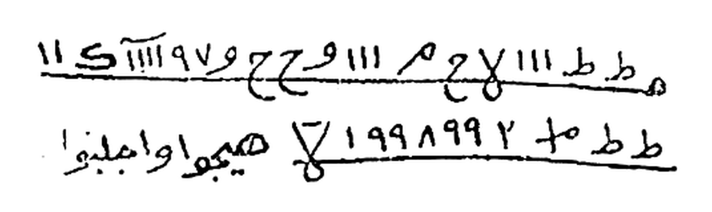
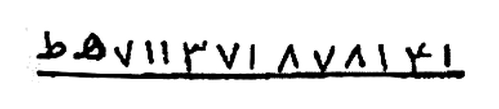

# BATCH 39 — Halaman 190–194 — Da'wah ad-Durrah an-Nadhid (Enam Tashrif) & Qasidah ad-Da'wah asy-Syarifah
> **Kitab Asrar wa Khofayyat fi 'Ilmi Ruhaniyyat — Syeikh Athiyyah Abdul Hamid — Terjemahan Lengkap Indonesia — Batch 39 (Hal. 190–194)**

**Sumber:** Picture 097.jpg (Hal190–191), 098.jpg (Hal192–193), 099.jpg (Hal194–195 — dipakai belahan kanan saja)
**Total Rajah Batch39:** 2 Rajah — Hal191 tilsam at-Tashrif ats-Tsani (dua baris), Hal192 tilsam at-Tashrif as-Sadis (satu baris). Hal190, Hal193, dan Hal194 murni teks.
**Isi:** Hal190–192 enam **Tashrif** dari bab **Da'wah ad-Durrah an-Nadhid fi Tashrif al-Baidhah** — Hal193–194 **Qasidah ad-Da'wah asy-Syarifah** (35 bait) — Hal194 bab baru **Da'wah al-Qasam al-'Ammari**
**Sambungan:** melanjutkan Batch38; judul bab `دعوة الدرة النضيد في تصريف البيضة` dibuka di baris terakhir Hal189, isinya dimulai di Hal190

---

### Halaman 190 — at-Tashrif al-Awwal & at-Tashrif ats-Tsani

**[Teks Arab Asli]**

> **التصريف الأول**
>
> **للتهييج وعطف القلوب وعقد النوم**
>
> تكتب هذه الأسماء على بيضة بنت يومها مغسولة طاهرة ـ بهشهة٢ كشكشة٢ مهولة٢ هايلة٢ خاطفة٢ مخطوفة٢ اخطفوا من السحاب أجيبوا يا خدام هذه الأسماء وهيجوا واجلبوا كذا إلى محبة كذا .
>
> وامسك يد الطالب بيدك واطلق البخور واتل الدعوة ٧ مرات وقل عقب كل مرة توكلوا يا خدام هذه الأسماء وهيجوا واجلبوا كذا إلى كذا وأروني علامة الإجابة . وهو أن تجذبوا يد الطالب من يدي ويمسك البيضة فإنك وقتها تجد الطالب يمد يده ويمسك البيضة ويلقيها في النار وأنت تقرأ الدعوة فما تحترق البيضة حتى يحضر المطلوب .
>
> **التصريف الثاني**
>
> لدوام المحبة حتى أنها لا تنقطع تكتب هذه الأسماء على بيضة بنت يومها مغسولة طاهرة ثم تضعها في قاع إناء نحاس أمامك وتطلق البخور وتقرأ الدعوة ٧ مرات وقل آخر كل مرة توكلوا يا خدام هذه الأسماء وهيجوا كذا إلى محبة كذا على الدوام .
>
> وأروني علامة الإجابة وهي أن تدور البيضة ٣ مرات في قاع كانون بحيث إن النار لا تحرقها بل الحرارة تصل إليها فقط فإن المطلوب يفر عقله على الطالب دواماً .

**[Transliterasi Latin Fonetik — bacaan washal]**

> ***At-Taṣhrīful-Awwal***
>
> ***Lit-tahyīji wa 'aṭhfil-qulūbi wa 'aqdin-naum***
>
> *Taktubu hādzihil-asmā'a 'alā baiḍhatin binti yaumihā maghsūlatin ṭhāhirah: BAHSYAHAH (2×) KASYKASYAH (2×) MAHŪLAH (2×) HĀYILAH (2×) KHĀṬHIFAH (2×) MAKHṬHŪFAH (2×). Ikhṭhifū minas-saḥāb! Ajībū yā khuddāma hādzihil-asmā'i wa hayyijū wajlibū kadzā ilā maḥabbati kadzā.*
>
> *Wamsik yadaṭh-ṭhālibi bi yadika, waṭhliqil-bukhūra, watlid-da'wata sab'a marrātin, wa qul 'aqiba kulli marratin: tawakkalū yā khuddāma hādzihil-asmā'i wa hayyijū wajlibū kadzā ilā kadzā wa arūnī 'alāmatal-ijābah. Wa huwa an tajdzibū yadaṭh-ṭhālibi min yadī wa yumsikal-baiḍhah. Fa innaka waqtahā tajiduṭh-ṭhāliba yamuddu yadahū wa yumsikul-baiḍhata wa yulqīhā fin-nāri wa anta taqra'ud-da'wata, fa mā taḥtariqul-baiḍhatu ḥattā yaḥḍharal-maṭhlūb.*
>
> ***At-Taṣhrīfuts-Tsānī***
>
> *Li dawāmil-maḥabbati ḥattā annahā lā tanqaṭhi': taktubu hādzihil-asmā'a 'alā baiḍhatin binti yaumihā maghsūlatin ṭhāhiratin, tsumma taḍha'uhā fī qā'i inā'i nuḥāsin amāmaka, wa tuṭhliqul-bukhūra, wa taqra'ud-da'wata sab'a marrātin, wa qul ākhira kulli marratin: tawakkalū yā khuddāma hādzihil-asmā'i wa hayyijū kadzā ilā maḥabbati kadzā 'alad-dawām.*
>
> *Wa arūnī 'alāmatal-ijābati wa hiya an tadūral-baiḍhatu tsalātsa marrātin fī qā'i kānūnin bi ḥaitsu innan-nāra lā taḥriquhā bal al-ḥarāratu taṣhilu ilaihā faqaṭh. Fa innal-maṭhlūba yafirru 'aqluhū 'alaṭh-ṭhālibi dawāmā.*

**[Terjemahan Indonesia]**

> ***Tashrif Pertama***
>
> ***Untuk tahyij (pembangkitan), pelembutan hati, dan 'aqd an-naum (pengikatan tidur)***
>
> *Engkau tuliskan nama-nama ini pada sebutir telur yang baru dikeluarkan hari itu, sudah dicuci dan suci: BAHSYAHAH (2×) KASYKASYAH (2×) MAHULAH (2×) HAYILAH (2×) KHATHIFAH (2×) MAKHTHUFAH (2×). Sambarlah dari awan! Sambutlah, wahai para khadam nama-nama ini; bangkitkanlah dan datangkanlah si fulan kepada cinta si fulan.*
>
> *Peganglah tangan sang penuntut dengan tanganmu, nyalakan dupa, dan bacalah seruan itu tujuh kali. Ucapkanlah setiap selesai satu kali: "Bertindaklah, wahai para khadam nama-nama ini; bangkitkanlah dan datangkanlah si fulan kepada si fulan, dan perlihatkanlah kepadaku tanda pengabulan." Tandanya adalah kalian menarik tangan sang penuntut dari tanganku lalu ia memegang telur itu. Pada saat itu engkau akan mendapati sang penuntut mengulurkan tangannya, memegang telur, dan melemparkannya ke dalam api sementara engkau membaca seruan — maka telur itu belum sempat terbakar sampai yang dituju hadir.*
>
> ***Tashrif Kedua***
>
> *Untuk melanggengkan cinta sehingga tidak terputus: engkau tuliskan nama-nama ini pada sebutir telur yang baru dikeluarkan hari itu, dicuci dan suci; lalu engkau letakkan di dasar bejana tembaga di hadapanmu, nyalakan dupa, dan bacalah seruan itu tujuh kali. Ucapkanlah di akhir setiap kali: "Bertindaklah, wahai para khadam nama-nama ini; bangkitkanlah si fulan kepada cinta si fulan untuk selamanya."*
>
> *Dan perlihatkanlah kepadaku tanda pengabulan, yaitu telur itu berputar tiga kali di dasar tungku sedemikian rupa sehingga api tidak membakarnya, melainkan hanya panasnya yang sampai kepadanya. Maka akal orang yang dituju akan senantiasa lari (tertambat) kepada sang penuntut.*

---

### Halaman 191 — Tilsam at-Tashrif ats-Tsani, at-Tashrif ats-Tsalits & ar-Rabi'

**[Teks Arab Asli]**

> **وهذا ما تكتب**

*Gambar Rajah Asli Halaman 191 — **Tilsam at-Tashrif ats-Tsani** — dua baris goresan tilsam, masing-masing dialasi satu garis mendatar panjang. Baris pertama memuat deretan huruf `ط` ganda, angka-angka `١١١`, `٧`, `٩٧`, lambang `ج` berkait dan `ك`; baris kedua memuat `ط ط`, `٢`, `١٩٩٨٩٩`, lambang segitiga terbalik, lalu ditutup dua kata Arab bergaya tilsam `هيجوا واجلبوا` — latar putih murni 255*

> كذا الى محبة كذا حتى لا يقر له قرار من محبته الوحا العجل الساعة .
>
> **التصريف الثالث**
>
> **لخطف من شئت من أي مكان وهو من العجائب الكبرى**
>
> اكتب الأسماء المذكورة في التصريف الأول على بيضتين مغسولتين وتضع واحدة في صدر الكانون والثانية في بابه واطلق البخور واتل الدعوة ١١ مرة وقل عقب كل مرة توكلوا يا خدام هذه الأسماء واجلبوا كذا إلى كذا في هذه الساعة سريعاً وأروني علامة الإجابة وهي أن تجمعوا البيضتين على بعضهما فعند اجتماعهما يحضر المطلوب .
>
> **التصريف الرابع**
>
> للمحبة والتهييج وجلب الحضرة سريعاً تكتب الطلاسم التي في التصريف الثاني على بيضة بنت يومها مغسولة طاهرة وتضعها على كرسي عالي وتطلق البخور وتقرأ الدعوة سبع مرات وتقول عقب كل مرة توكلوا يا خدام هذه الأسماء واجلبوا واحضروا كذا

**[Transliterasi Latin Fonetik — bacaan washal]**

> ***Wa hādzā mā taktub.***
>
> *…kadzā ilā maḥabbati kadzā ḥattā lā yaqirra lahū qarārun min maḥabbatih. Al-waḥā, al-'ajal, as-sā'ah.*
>
> ***At-Taṣhrīfuts-Tsālits***
>
> ***Li khaṭhfi man syi'ta min ayyi makānin, wa huwa minal-'ajā'ibil-kubrā***
>
> *Uktubil-asmā'al-madzkūrata fit-taṣhrīfil-awwali 'alā baiḍhataini maghsūlatain, wa taḍha'u wāḥidatan fī ṣhadril-kānūni wats-tsāniyata fī bābih, waṭhliqil-bukhūra, watlid-da'wata iḥdā 'asyrata marratan, wa qul 'aqiba kulli marratin: tawakkalū yā khuddāma hādzihil-asmā'i wajlibū kadzā ilā kadzā fī hādzihis-sā'ati sarī'an wa arūnī 'alāmatal-ijābati wa hiya an tajma'ul-baiḍhataini 'alā ba'ḍhihimā. Fa 'indajtimā'ihimā yaḥḍharul-maṭhlūb.*
>
> ***At-Taṣhrīfur-Rābi'***
>
> *Lil-maḥabbati wat-tahyīji wa jalbil-ḥaḍhrati sarī'an: taktubuṭh-ṭhalāsimal-latī fit-taṣhrīfits-tsānī 'alā baiḍhatin binti yaumihā maghsūlatin ṭhāhiratin, wa taḍha'uhā 'alā kursiyyin 'ālin, wa tuṭhliqul-bukhūra, wa taqra'ud-da'wata sab'a marrātin, wa taqūlu 'aqiba kulli marratin: tawakkalū yā khuddāma hādzihil-asmā'i wajlibū waḥḍhurū kadzā…*

**[Terjemahan Indonesia]**

> ***Dan inilah yang engkau tuliskan.***
>
> *…si fulan kepada cinta si fulan, sehingga tidak ada ketenangan baginya karena cintanya. Segera! Cepat! Saat ini juga!*
>
> ***Tashrif Ketiga***
>
> ***Untuk khathf (penarikan) siapa pun yang engkau kehendaki dari tempat mana pun — dan ini termasuk keajaiban besar***
>
> *Tulislah nama-nama yang disebutkan pada Tashrif Pertama di atas dua butir telur yang sudah dicuci. Engkau letakkan satu di bagian depan tungku dan yang kedua di mulut tungku; nyalakan dupa, bacalah seruan itu sebelas kali, dan ucapkan setiap selesai satu kali: "Bertindaklah, wahai para khadam nama-nama ini; datangkanlah si fulan kepada si fulan pada saat ini juga dengan segera, dan perlihatkanlah kepadaku tanda pengabulan, yaitu kalian menyatukan kedua telur itu satu sama lain." Maka ketika keduanya menyatu, yang dituju akan hadir.*
>
> ***Tashrif Keempat***
>
> *Untuk cinta, tahyij, dan mendatangkan kehadiran dengan cepat: tulislah tilsam-tilsam yang ada pada Tashrif Kedua di atas sebutir telur yang baru dikeluarkan hari itu, dicuci dan suci; letakkan di atas kursi yang tinggi, nyalakan dupa, bacalah seruan itu tujuh kali, dan ucapkan setiap selesai satu kali: "Bertindaklah, wahai para khadam nama-nama ini; datangkanlah dan hadirkanlah si fulan…"*

---

### Halaman 192 — at-Tashrif al-Khamis, as-Sadis & Tilsamnya

**[Teks Arab Asli]**

> …إلى كذا وأروني علامة الإجابة وهي أن ترموا هذه البيضة في حجري فما تتم العمل حتى تنط البيضة من على الكرسي لحجرك فخذها والقها في النار فما تحترق حتى يحضر المطلوب ـ والبخور في كل الأعمال عود ند وجاوي .
>
> **التصريف الخامس**
>
> لكل أمر تريده من خير أو شر تقرأ آية الكرسي ٣١٣ مرة وتقرأ الدعوة ٣ مرات عقب الثلاثة و٣ مرات عقب العشرة و٣ عقب كل مائة فإنك ترى ما يسرك من النجاح التام . وبخورها في هذا التصريف فلفل أبيض للخير وأسود للشر .
>
> **التصريف السادس**
>
> إذا أردت تهييج اكتب ما يأتي على بيضة بنت يومها وتدفنها في النار بعد أن تقرأ عليها الدعوة ٧ مرات ثم بعد دفنها في النار تقرأ القسم بغير عدد فإنك تسمع من يقول نعم نعم نعم ويأتي المطلوب بين يديك فتقول من أتى بك يقول لك عبد أسود طويل .
>
> **وهذا ما تكتب**

*Gambar Rajah Asli Halaman 192 — **Tilsam at-Tashrif as-Sadis** — satu baris goresan tilsam di atas satu garis mendatar panjang, dibaca dari kanan ke kiri: `ط` · `۵` · `٧` · `١١` · `٣` · `٧` · `١` · `٨` · `٧` · `٨` · `١` · `٤` · `١` — latar putih murni 255*

> توكلوا واجلبوا كذا إلى كذا بالمحبة الشديدة يا خدام هذا الطلسم الوحا٢ العجل٢ الساعة٢

**[Transliterasi Latin Fonetik — bacaan washal]**

> *…ilā kadzā wa arūnī 'alāmatal-ijābati wa hiya an tarmū hādzihil-baiḍhata fī ḥijrī. Fa mā tatimmul-'amalu ḥattā tanuṭhṭhal-baiḍhatu min 'alal-kursiyyi li ḥijrika. Fa khudzhā walqihā fin-nāri fa mā taḥtariqu ḥattā yaḥḍharal-maṭhlūb. Wal-bukhūru fī kullil-a'māli: 'ūdun, naddun, wa jāwī.*
>
> ***At-Taṣhrīful-Khāmis***
>
> *Li kulli amrin turīduhū min khairin au syarrin: taqra'u āyatal-kursiyyi tsalātsa mi'atin wa tsalātsa 'asyrata marratan, wa taqra'ud-da'wata tsalātsa marrātin 'aqibats-tsalātsati, wa tsalātsa marrātin 'aqibal-'asyarati, wa tsalātsan 'aqiba kulli mi'ah. Fa innaka tarā mā yasurruka minan-najāḥit-tāmm. Wa bukhūruhā fī hādzat-taṣhrīfi fulfulun abyaḍhu lil-khairi wa aswadu lisy-syarr.*
>
> ***At-Taṣhrīfus-Sādis***
>
> *Idzā aradta tahyījan: uktub mā ya'tī 'alā baiḍhatin binti yaumihā wa tadfinuhā fin-nāri ba'da an taqra'a 'alaihad-da'wata sab'a marrātin. Tsumma ba'da dafnihā fin-nāri taqra'ul-qasama bi ghairi 'adadin. Fa innaka tasma'u man yaqūlu na'am na'am na'am, wa ya'til-maṭhlūbu baina yadaika. Fa taqūlu: man atā bika? Yaqūlu laka: 'abdun aswadu ṭhawīl.*
>
> ***Wa hādzā mā taktub.***
>
> *Tawakkalū wajlibū kadzā ilā kadzā bil-maḥabbatisy-syadīdati yā khuddāma hādzaṭh-ṭhilasm. Al-waḥā (2×) al-'ajal (2×) as-sā'ah (2×).*

**[Terjemahan Indonesia]**

> *…kepada si fulan, dan perlihatkanlah kepadaku tanda pengabulan, yaitu kalian melemparkan telur ini ke pangkuanku. Maka belum selesai amalan itu sampai telur melompat dari atas kursi ke pangkuanmu. Ambillah telur itu dan lemparkan ke dalam api — maka ia belum sempat terbakar sampai yang dituju hadir. Adapun dupa untuk semua amalan ini adalah gaharu, nadd, dan jawi (kemenyan).*
>
> ***Tashrif Kelima***
>
> *Untuk setiap urusan yang engkau kehendaki, baik maupun buruk: bacalah Ayat Kursi 313 kali, dan bacalah seruan itu 3 kali setelah hitungan ketiga, 3 kali setelah hitungan kesepuluh, dan 3 kali setelah setiap seratus. Maka engkau akan melihat apa yang menyenangkanmu berupa keberhasilan yang sempurna. Dupanya pada tashrif ini adalah merica putih untuk kebaikan dan merica hitam untuk keburukan.*
>
> ***Tashrif Keenam***
>
> *Apabila engkau menghendaki tahyij: tulislah apa yang akan disebutkan di atas sebutir telur yang baru dikeluarkan hari itu, lalu benamkan ke dalam api setelah engkau bacakan seruan atasnya 7 kali. Kemudian setelah membenamkannya dalam api, bacalah qasam tanpa hitungan tertentu. Maka engkau akan mendengar suara yang berkata "Ya, ya, ya," dan yang dituju pun datang di hadapanmu. Lalu engkau bertanya: "Siapa yang membawamu?" Ia akan menjawab kepadamu: "Seorang hamba hitam yang jangkung."*
>
> ***Dan inilah yang engkau tuliskan.***
>
> *Bertindaklah dan datangkanlah si fulan kepada si fulan dengan cinta yang kuat, wahai para khadam tilsam ini. Segera! Segera! Cepat! Cepat! Saat ini! Saat ini!*

---

### Halaman 193 — Qasidah ad-Da'wah asy-Syarifah (bait 1–22)

**[Teks Arab Asli]**

> **وهذه هي الدعوة الشريفة تقول**
>
> بسم الله أبدى كل زجر ... واكسي بالمهابة والكمال
> باسم الله يقضي كل أمر ... بقدرته المهيمن ذي الجلال
> به أرجو انتصاراً بعد ذل ... وطاعة خلقه دان وعال
> بني الجن أدعوكم جميعاً ... لطاعة ربنا مولى الموالي
> بهيبة مالخ ملخي أجيبوا ... مناجاتي واقضوا لي سؤالي
> فهيا هيجروا من شئت هيا ... بجلب واجتذاب واتصال
> بقوة شملخ فاسعوا سريعاً ... بأنكبره بهوريسن بآل
> كذلك باشمخ وضيا شماخ ... على كل براخ فهو عالي
> بعال هلطف هيا أجيبوا ... بعزة من تفرد بالكمال
> بشليطيع اشماطون زجري ... به يجد الإجابة كل تالي
> بنور هكشن اقضوا لي مرادي ... بلاهوش بأنوار الجمال
> بيوقشن أحضروا جمعا مقامي ... بمن بسط الثرى فوق الزلال
> دحا الأرضين ربي فوق ماء ... وأثبتها بأوتاد ثقال
> ببهراج ببهراج أجيبوا ... بشمليخ بشمليخ سؤالي
> بداعوج فيعوج هلموا ... بمن خلق الورى مولى الموالي
> ألا يا مذهب فأتي سريعاً ... كذا يا مرة أنجز سؤالي
> ألا يا أحمر بالجيش فاحضر ... ونفذ مطلبي عند المقال
> ويا برقان فاظهر للعجائب ... ويا شمهورش جز بالمجال
> كذا يا أبيض فأتي مجيباً ... بسبوح قدوس وآل
> ويا ميمون أبا نوخ أجبني ... كطرف العين أو طيف الخيال
> ويا كهيوش احضر في مقامي ... سريعاً بالذي أرسى الجبال
> ألا يا سلهب لك صوت يدوي ... شبيه الرعد فوق الكل عالي

**[Transliterasi Latin Fonetik — bacaan washal]**

> ***Wa hādzihī hiyad-da'watusy-syarīfah. Taqūlu:***
>
> *Bismillāhi abdā kulla zajrin · waksī bil-mahābati wal-kamāli*
> *Bismillāhi yaqḍhī kulla amrin · bi qudratihil-Muhaimini dzil-jalāli*
> *Bihī arjū intiṣhāran ba'da dzullin · wa ṭhā'ata khalqihī dānin wa 'āli*
> *Banil-jinni ad'ūkum jamī'an · li ṭhā'ati rabbinā maulal-mawālī*
> *Bi haibati MĀLAKH MALKHĪ ajībū · munājātī waqḍhū lī su'ālī*
> *Fa hayyā hayjirū man syi'ta hayyā · bi jalbin waj-tidzābin wat-tiṣhāli*
> *Bi quwwati SYAMLAKH fas'au sarī'an · bi ANKABRAH BAHŪRĪSAN BI'ĀLI*
> *Kadzālika BĀSYMAKH wa ḌhIYĀ SYAMMĀKH · 'alā kulli BARĀKH fa huwa 'ālī*
> *Bi 'ĀL HALṬHAF hayyā ajībū · bi 'izzati man tafarrada bil-kamāli*
> *Bi SYALĪṬHĪ' ASYMĀṬHŪN zajrī · bihī yajidul-ijābata kullu tālī*
> *Bi nūri HAKASYN iqḍhū lī murādī · bi LĀHŪSY bi anwāril-jamāli*
> *Bi YŪQASYN aḥḍhirū jam'an maqāmī · bi man basaṭhats-tsarā fauqaz-zulāli*
> *Daḥal-arḍhīna rabbī fauqa mā'in · wa atsbatahā bi autādin tsiqāli*
> *Bi BAHRĀJ bi BAHRĀJ ajībū · bi SYAMLĪKH bi SYAMLĪKH su'ālī*
> *Bi DĀ'ŪJ FAI'ŪJ halummū · bi man khalaqal-warā maulal-mawālī*
> *Alā yā MADZHAB fa'tī sarī'an · kadzā yā MURRAH anjiz su'ālī*
> *Alā yā AḤMAR bil-jaisyi faḥḍhur · wa naffidz maṭhlabī 'indal-maqāli*
> *Wa yā BARQĀN fazhhar lil-'ajā'ibi · wa yā SYAMHŪRASY juz bil-majāli*
> *Kadzā yā ABYAḌh fa'tī mujīban · bi Subbūḥin Quddūsin wa āli*
> *Wa yā MAIMŪN Abā NŪKH ajibnī · ka ṭharfil-'aini au ṭhaifil-khayāli*
> *Wa yā KAHYŪSY uḥḍhur fī maqāmī · sarī'an bil-ladzī arsal-jibāli*
> *Alā yā SALHAB laka ṣhautun yadwī · syabīhar-ra'di fauqal-kulli 'ālī*

**[Terjemahan Indonesia]**

> ***Dan inilah seruan yang mulia itu. Engkau ucapkan:***
>
> *Dengan nama Allah, tampaklah setiap hardikan · dan berpakaianlah aku dengan kewibawaan dan kesempurnaan*
> *Dengan nama Allah, terputuslah setiap perkara · dengan kuasa Yang Maha Memelihara, Pemilik keagungan*
> *Dengannya aku berharap kemenangan setelah kehinaan · dan ketaatan makhluk-Nya, yang rendah maupun yang tinggi*
> *Wahai bani jin, aku menyeru kalian semua · kepada ketaatan pada Tuhan kami, Penguasa para penguasa*
> *Demi kewibawaan Malakh Malkhi, sambutlah · munajatku, dan tunaikanlah permintaanku*
> *Maka ayo, bangkitkanlah siapa pun yang engkau kehendaki · dengan penarikan, pemikatan, dan penyambungan*
> *Dengan kekuatan Syamlakh, bersegeralah dengan cepat · demi Ankabrah, Bahurisan, dan Bi'al*
> *Demikian pula Basymakh, Dhiya Syammakh · atas setiap Barakh — maka Dia Mahatinggi*
> *Demi 'Al Halthaf, ayo sambutlah · demi kemuliaan Dzat yang menyendiri dalam kesempurnaan*
> *Demi Syalithi' Asymathun hardikanku · dengannya setiap pembaca memperoleh pengabulan*
> *Demi cahaya Hakasyn, tunaikanlah maksudku · demi Lahusy, demi cahaya-cahaya keindahan*
> *Demi Yuqasyn, hadirlah berkumpul di tempatku · demi Dzat yang membentangkan tanah di atas air yang jernih*
> *Tuhanku menghamparkan dua bumi di atas air · dan meneguhkannya dengan pasak-pasak yang berat*
> *Demi Bahraj, demi Bahraj, sambutlah · demi Syamlikh, demi Syamlikh, permintaanku*
> *Demi Da'uj, Fai'uj, kemarilah · demi Dzat yang menciptakan makhluk, Penguasa para penguasa*
> *Wahai Madzhab, datanglah dengan cepat · demikian pula wahai Murrah, tunaikan permintaanku*
> *Wahai Ahmar, hadirlah bersama bala tentara · dan laksanakan permintaanku saat diucapkan*
> *Wahai Barqan, tampakkanlah keajaiban-keajaiban · dan wahai Syamhurasy, lintasilah medan itu*
> *Demikian pula wahai Abyadh, datanglah sebagai penyambut · demi Yang Mahasuci, Mahakudus, dan keluarga*
> *Wahai Maimun Abu Nukh, jawablah aku · secepat kedipan mata atau bayangan khayal*
> *Wahai Kahyusy, hadirlah di tempatku · dengan segera, demi Dzat yang memancangkan gunung-gunung*
> *Wahai Salhab, engkau memiliki suara yang menggelegar · menyerupai guruh, tinggi mengatasi segalanya*

---

### Halaman 194 — Qasidah (bait 23–35) & Bab Baru: Da'wah al-Qasam al-'Ammari

**[Teks Arab Asli]**

> ويا طيهوب أنك ذو المقامع ... بها تذر الكبير من الرجال
> فقد أقسمت بالمولى عليكم ... إله قادر صمد جلال
> عظيم الملك ذو الجبروت ربي ... تفرد بالبقاء عن المثال
> فامضوا للذي قد شئت يأتي ... ذليلاً حافياً فوق الرمال
> ونيران المحبة في حشاه ... تقيد بقلبه وقد اشتعال
> وسوقوه لعندي ليس يدري ... بميناً في الطريق أو الشمال
> ومن فوق الخيبول فركبوه ... سريعاً مثل بارقة الخيال
> وإلا طيروه بغير مهل ... أجيبوا دعوتي واقضوا سؤالي
> يهال هيول اهليول هلموا ... لإنجاز المطالب يا موالي
> بهيبة هيكش طوش بهوش ... أجيبوا دعوتي بجلال آل
> أجيبوا كلكم قولي أجيبوا ... بأنوار المهابة والكمال
> ولا تتأخروا عن اسم ربي ... فللعاصين نيران الويال
> أجيبوا بالذي خلق البرايا ... واقضوا حاجتي قبل النكال
>
> **دعوة القسم العماري**
>
> جاء في كتاب الأسرار للشيخ محمد بن البشير بن الحاج المغربي السوسي رحمه الله تعالى ؛ القسم العماري معروف بين الحكماء بعدة أسماء منها القسم المطلق و جزر الأجزار ، و فوائده لا تعد و لا تحصى و لا يمكن حصرها في كتاب واحد . ففي ها القسم سر الملك الخلاق إلى عباده الحذاق من أهل الأذواق ، و به اتصلت الرجال بالعلوم و بالسر المكتوم و خدمتهم ملوك الجن و أرهطها . و ها القسم شديد على كل جني شديد و مارد عنيد و عفريت صنديد ، و سطوة هذا القسم كسطوة عزرائيل على جميع خلق

**[Transliterasi Latin Fonetik — bacaan washal]**

> *Wa yā ṬHAIHŪB annaka dzul-maqāmi'i · bihā tadzarul-kabīra minar-rijāli*
> *Fa qad aqsamtu bil-Maulā 'alaikum · ilāhin qādirin ṣhamadin jalāli*
> *'Azhīmil-mulki dzil-jabarūti rabbī · tafarrada bil-baqā'i 'anil-mitsāli*
> *Famḍhū lil-ladzī qad syi'ta ya'tī · dzalīlan ḥāfiyan fauqar-rimāli*
> *Wa nīrānul-maḥabbati fī ḥasyāhu · tuqayyadu bi qalbihī wa qadisyta'āli*
> *Wa sūqūhu li 'indī laisa yadrī · bi maimanin fiṭh-ṭharīqi awisy-syimāli*
> *Wa min fauqil-KHAIBŪLI fa arkibūhu · sarī'an mitsla bāriqatil-khayāli*
> *Wa illā ṭhayyirūhu bi ghairi mahlin · ajībū da'watī waqḍhū su'ālī*
> *YAHĀL HAYŪL AHLĪYŪL halummū · li injāzil-maṭhālibi yā mawālī*
> *Bi haibati HAIKASY ṬHŪSY BAHŪSY · ajībū da'watī bi jalāli āli*
> *Ajībū kullukum qaulī ajībū · bi anwāril-mahābati wal-kamāli*
> *Wa lā tata'akhkharū 'anismi rabbī · fa lil-'āṣhīna nīrānul-wayāli*
> *Ajībū bil-ladzī khalaqal-barāyā · waqḍhū ḥājatī qablan-nakāli*
>
> ***Da'watul-Qasamil-'Ammārī***
>
> *Jā'a fī Kitābil-Asrār lisy-Syaikh Muḥammadibnil-Basyīribnil-Ḥājjil-Maghribīas-Sūsī raḥimahullāhu ta'ālā: al-Qasamul-'Ammārī ma'rūfun bainal-ḥukamā'i bi 'iddati asmā'in minhal-Qasamul-Muṭhlaqu wa Jazrul-Ajzār. Wa fawā'iduhū lā tu'addu wa lā tuḥṣhā wa lā yumkinu ḥaṣhruhā fī kitābin wāḥid. Fa fī hādzal-qasami sirrul-Malikil-Khallāqi ilā 'ibādihil-ḥudzdzāqi min ahlil-adzwāq. Wa bihittaṣhalatir-rijālu bil-'ulūmi wa bis-sirril-maktūmi wa khadamathum mulūkul-jinni wa arhāṭhuhā. Wa hādzal-qasamu syadīdun 'alā kulli jinniyyin syadīdin wa māridin 'anīdin wa 'ifrītin ṣhindīd. Wa saṭhwatu hādzal-qasami ka saṭhwati 'Izrā'īla 'alā jamī'i khalq…*

**[Terjemahan Indonesia]**

> *Wahai Thaihub, sungguh engkau pemilik gada-gada · yang dengannya engkau tinggalkan laki-laki besar tak berdaya*
> *Sungguh aku telah bersumpah atas kalian demi Sang Penguasa · Tuhan Yang Mahakuasa, tempat bergantung, Mahaagung*
> *Mahaagung kerajaan-Nya, pemilik keperkasaan, Tuhanku · yang menyendiri dalam kekekalan, tanpa ada yang menyerupai*
> *Maka pergilah kepada orang yang kukehendaki, agar ia datang · dalam keadaan hina dan bertelanjang kaki di atas pasir*
> *Sementara api-api cinta di dalam lubuk hatinya · terikat pada kalbunya dan telah menyala*
> *Giringlah ia kepadaku dalam keadaan tidak menyadari · apakah ia di sebelah kanan jalan atau kiri*
> *Dan naikkanlah ia ke atas punggung kuda · dengan cepat laksana kilatan khayal*
> *Jika tidak, maka terbangkanlah ia tanpa penangguhan · sambutlah seruanku dan tunaikan permintaanku*
> *Yahal, Hayul, Ahliyul — kemarilah · untuk menuntaskan segala permintaan, wahai para penguasaku*
> *Demi kewibawaan Haikasy, Thusy, Bahusy · sambutlah seruanku demi keagungan keluarga*
> *Sambutlah kalian semua akan ucapanku, sambutlah · demi cahaya-cahaya kewibawaan dan kesempurnaan*
> *Dan janganlah kalian menunda dari nama Tuhanku · sebab bagi para pendurhaka ada api-api kebinasaan*
> *Sambutlah demi Dzat yang menciptakan segala makhluk · dan tunaikanlah hajatku sebelum datang hukuman*
>
> ***Seruan al-Qasam al-'Ammari***
>
> *Disebutkan di dalam Kitab al-Asrar karya Syeikh Muhammad bin al-Basyir bin al-Hajj al-Maghribi as-Susi — semoga Allah Ta'ala merahmatinya: al-Qasam al-'Ammari dikenal di kalangan para hakim (ahli hikmah) dengan beberapa nama, di antaranya al-Qasam al-Muthlaq dan Jazr al-Ajzar. Faedahnya tidak terhitung dan tidak terhingga, serta tidak mungkin dihimpun dalam satu kitab. Sebab pada qasam ini terdapat rahasia Sang Raja Yang Maha Mencipta kepada hamba-hamba-Nya yang cerdas dari kalangan ahli dzauq. Dengannya para tokoh terhubung dengan berbagai ilmu dan dengan rahasia yang tersembunyi, dan raja-raja jin beserta kelompok-kelompoknya melayani mereka. Qasam ini keras atas setiap jin yang kuat, marid yang keras kepala, dan ifrit yang perkasa. Kekuatan qasam ini seperti kekuatan Izrail atas seluruh makhluk…*

---

### Catatan Tashih Batch39

| Hal | Isi pokok | Rajah |
|-----|-----------|-------|
| 190 | **at-Tashrif al-Awwal** (tahyij, 'athf al-qulub, 'aqd an-naum) & **ats-Tsani** (dawam al-mahabbah) | — |
| 191 | Tilsam at-Tashrif ats-Tsani + **ats-Tsalits** (khathf dari tempat mana pun) & **ar-Rabi'** | **1** |
| 192 | **al-Khamis** (Ayat Kursi 313×) & **as-Sadis** + tilsamnya | **1** |
| 193 | **Qasidah ad-Da'wah asy-Syarifah** bait 1–22 — seruan kepada tujuh raja jin | — |
| 194 | Qasidah bait 23–35 + bab baru **Da'wah al-Qasam al-'Ammari** (nukilan Kitab al-Asrar) | — |

**Struktur bab pada batch ini.** Hal190–192 memuat **enam tashrif** (cara pendayagunaan) dari bab Da'wah ad-Durrah an-Nadhid fi Tashrif al-Baidhah yang judulnya dibuka di akhir Hal189. Hal193 memulai **qasidah** berisi 35 bait berwazan dengan qafiyah `-āl/-ālī`, yang berfungsi sebagai lafal `الدعوة` yang berulang kali dirujuk pada keenam tashrif. Qasidah berakhir di Hal194, lalu dibuka bab baru **Da'wah al-Qasam al-'Ammari** yang dicetak dengan huruf lebih kecil dan rapat — penanda bahwa bagian ini merupakan **nukilan dari kitab lain**, yaitu Kitab al-Asrar karya Syeikh Muhammad bin al-Basyir al-Maghribi as-Susi.

**Tujuh raja jin** yang diseru pada qasidah Hal193–194 adalah susunan masyhur dalam literatur ruhaniyyah, masing-masing dikaitkan dengan satu hari: **Mudzhib** (Ahad), **Murrah** (Senin), **Ahmar** (Selasa), **Burqan** (Rabu), **Syamhurasy** (Kamis), **Abyadh** (Jumat), **Maimun** (Sabtu). Matan menambahkan **Kahyusy**, **Salhab**, dan **Thaihub** di luar tujuh tersebut.

**Bacaan yang perlu ditashih ulang ke cetakan aslinya:**

1. **Hal190 — `بهشهة٢ كشكشة٢ …`**: angka `٢` adalah **tanda cetak pengulangan dua kali**, bukan bagian lafal. Pola yang sama dipakai pada Hal192 (`الوحا٢ العجل٢ الساعة٢`).
2. **Hal190 — `بيضة بنت يومها`**: ungkapan khas yang berarti "telur yang baru dikeluarkan pada hari itu juga" (masih sangat segar).
3. **Hal190 — `وهو أن تجذبوا`**: dhamir semestinya muannats (`وهي`) karena merujuk `علامة الإجابة`, sebagaimana tertulis benar pada kalimat sejajarnya di Hal191 dan Hal192.
4. **Hal190 — `يفر عقله على الطالب`**: ungkapan idiomatik; maksudnya akal orang yang dituju senantiasa tertambat kepada sang penuntut. Bukan "lari menjauh".
5. **Hal191 — `لخطف من شئت من أي مكان`**: `مَنْ` pertama adalah isim maushul (objek `خَطْف`), `مِنْ` kedua huruf jar. Bacaannya `لِخَطْفِ مَنْ شِئْتَ مِنْ أَيِّ مَكَان`. Pada zoom rendah kedua kata ini mudah terbaca rangkap menjadi `لخطف من أي مكان` — sudah ditashih ke cetakan pada perbesaran 4,4×.
6. **Hal191 — `صدر الكانون` / `بابه`**: `الكانون` = tungku; `صدر` bagian dalam/depannya, `باب` mulutnya.
7. **Hal192 — `عود ند وجاوي`**: tiga bahan dupa — `عُود` (gaharu), `نَدّ` (racikan gaharu-ambar-misk), `جَاوِي` (kemenyan).
8. **Hal192 — `فما تتم العمل`**: semestinya `فَمَا يَتِمُّ الْعَمَلُ` (muzakkar).
9. **Hal192 — `تنط`**: `تَنُطُّ` = melompat/meloncat. Bentuk 'amiyyah yang lazim dipakai dalam matan praktis semacam ini.
10. **Hal192 — `٣١٣ مرة`**: bilangan 313 — jumlah yang masyhur dipakai sebagai 'adad Ayat Kursi dalam bab-bab ini.
11. **Hal192 — `فلفل أبيض للخير وأسود للشر`**: merica putih untuk tujuan baik, merica hitam untuk tujuan buruk. Dicatat apa adanya sebagai bagian matan.
12. **Hal193 — `أبدى كل زجر`**: dua kemungkinan baca — `أَبْدَى` (menampakkan) atau `أَبَدَى`. Diterjemahkan "tampaklah".
13. **Hal193 — `يقضي كل أمر`**: dapat dibaca `يَقْضِي` (memutuskan/menetapkan) maupun `يُقْضَى` (ditetapkan). Dipilih bentuk pertama.
14. **Hal193 — `دان وعال`**: dibaca `دَانٍ وَعَالٍ` (yang rendah dan yang tinggi), bukan fi'il.
15. **Hal193 — `هيجروا`**: janggal. Kemungkinan salah cetak dari `هَيِّجُوا` (bangkitkanlah) sebagaimana kata yang sama muncul berkali-kali pada Hal190–192. Diterjemahkan demikian.
16. **Hal193 — `بأنكبره بهوريسن بآل`**: rangkaian nama 'ajamiyyah; pemenggalan katanya tidak pasti pada cetakan. Hanya ditransliterasikan.
17. **Hal193 — `دحا الأرضين ربي فوق ماء`**: merujuk QS. an-Nazi'at 30 `وَالْأَرْضَ بَعْدَ ذَٰلِكَ دَحَاهَا`; bentuk `الأرضين` (dua bumi/banyak bumi) adalah pilihan penyair, bukan lafal ayat.
18. **Hal193 — `بسبوح قدوس وآل`**: `وَآل` di sini tuntutan qafiyah; maksudnya `وَالآل` (dan keluarga) atau penggalan dari `سُبُّوحٌ قُدُّوسٌ رَبُّ الْمَلَائِكَةِ وَالرُّوحِ`.
19. **Hal194 — `وقد اشتعال`**: semestinya `وَقَدِ اشْتَعَلَ`; alif terakhir adalah **alif ishba'** (penambahan huruf demi menjaga qafiyah) — lazim dalam syair.
20. **Hal194 — `بميناً في الطريق أو الشمال`**: dibaca `بِمَيْمَنٍ` (di sebelah kanan), lawan dari `الشمال` (kiri). Cetakan menulis `بميناً`.
21. **Hal194 — `ومن فوق الخيبول فركبوه`**: cetakan jelas menulis `الـخـيـبـول` (ada satu gigi bertitik bawah antara `ي` dan `و`), dipertahankan apa adanya sebagai matan. Hampir pasti ini **salah cetak dari `الخُيُول`** (kuda-kuda) — makna itulah yang dipakai pada terjemahan, dan sejalan dengan syathr keduanya `سريعاً مثل بارقة الخيال`. Kemungkinan kedua, ia nama 'ajamiyyah sejenis `هيول` / `اهليول` yang muncul dua bait sesudahnya; kemungkinan ini lebih lemah karena didahului `ومن فوق` dan diikuti `فركبوه`.
22. **Hal194 — `نيران الويال`**: `الوَيَال` tidak baku; kemungkinan dari `الوَيْل` (kebinasaan) yang dipanjangkan demi qafiyah. Diterjemahkan "api-api kebinasaan".
23. **Hal194 — `فامضوا للذي قد شئت يأتي`**: semestinya majzum sebagai jawab amr (`يَأْتِ`); cetakan mempertahankan `يأتي` demi wazan.
24. **Hal194 — `ففي ها القسم`** dan **`و ها القسم`**: `ها` di sini adalah bentuk pendek dari `هٰذَا` yang lazim dalam naskah Maghribi. Bukan salah cetak.
25. **Hal194 — `جزر الأجزار`**: nama lain al-Qasam al-'Ammari; dibaca `جَزْرُ الأَجْزَار`. Sebagian naskah membaca `جَزْرُ الأَجْزَاء`.
26. **Hal194 — `أرهطها`**: jamak dari `رَهْط` (kelompok/golongan); semestinya `أَرْهُطُهَا`.
27. **Hal194 — `محمد بن البشير بن الحاج المغربي السوسي`**: penulis Kitab al-Asrar yang dinukil. Nisbat `السوسي` merujuk wilayah Sus di Maroko selatan.

**Catatan Rajah:** batch ini memuat **dua rajah**, keduanya **tilsam baris** (goresan satu/dua baris di atas garis mendatar), bukan wafaq berkotak seperti Batch 38. Keduanya dipotong dengan `crop_rajah_batch39.py` pada 300 DPI berlatar **putih murni 255**, memakai standar flat-field yang sama persis dengan Batch 38 (`WHITE_AT = 0.84`, `WHITE_SNAP = 235`). Hasil terukur: 88,9% dan 90,3% piksel non-tinta bernilai persis 255.

Satu jebakan geometri didokumentasikan di dalam skrip: pada Hal192, **garis bawah tilsam dan bingkai hiasan tepi halaman berada pada baris piksel yang sama**, sehingga pengukuran tanpa pembatasan sumbu-x melaporkan tepi kanan di `x = 0.8741` — itu bingkai halaman, bukan tilsam. Tepi kanan yang benar adalah `x = 0.7396`. Hal190, Hal193, dan Hal194 tidak memuat rajah.

**Total rajah kumulatif sampai Batch 39: 167.**

---

**Lanjutan:** Batch 40 menyambung di **Hal 195–199** (Picture 099 belahan kiri, 100, 101), melanjutkan bab **Da'wah al-Qasam al-'Ammari** yang terputus di `وسطوة هذا القسم كسطوة عزرائيل على جميع خلق`.
