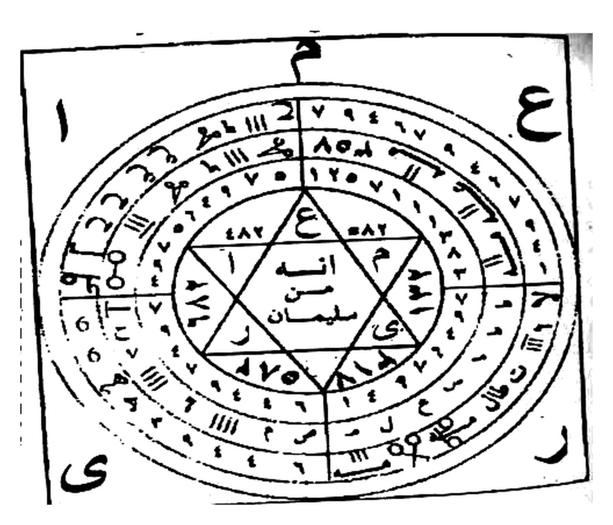

# BATCH 41 — Halaman 200–202 — Penutup al-Qasam al-'Ammari al-Kabir, Tilsam al-Kashf wal-Istinsar & Pembuka Da'wah as-Sabasi' al-Kubra
> **Kitab Asrar wa Khofayyat fi 'Ilmi Ruhaniyyat — Syeikh Athiyyah Abdul Hamid — Terjemahan Lengkap Indonesia — Batch 41 (Hal. 200–202)**

**Sumber:** Picture 102.jpg (Hal200 — belahan kanan, Hal201 — belahan kiri), Picture 103.jpg (Hal202 — belahan kanan saja)
**Total Rajah Batch41:** **1 Rajah** — Hal201 **Tilsam al-Kashf wal-Istinsar**: bingkai persegi berisi lingkaran berlapis empat dengan bintang segi enam di tengah bertuliskan `انه من سليمان`, huruf-huruf penjuru م ع ا ى ر. Hal200 dan Hal202 **murni teks** — tidak ada rajah lain pada batch ini.
**Isi:** Hal200 penutup **al-Qasam al-'Ammari al-Kabir** — dafta tujuh raja hari (Ahad–Sabtu) beserta malaikat penurunnya, diakhiri seruan penutup — Hal201 ekor qasam + penutup dengan ayat-ayat + **Tilsam al-Kashf wal-Istinsar** (dipakai pada jam-jam qamariyah) + pembuka bab baru **Da'wah as-Sabasi' al-Kubra al-Hakimah 'ala al-Muluk as-Sab'ah** — Hal202 faedah, adab, dan pembuka doa sabasi' (`بسم الله الذي احتجب عن الأبصار …`)
**Sambungan:** melanjutkan Batch40; Hal199 terputus di `يقش2 أقش2 كلام الله أعلى من كل` → Hal200 menyambung `كلام سبحان الذي لا يغفل و لا ينام …`

---

### Halaman 200 — Penutup al-Qasam al-'Ammari al-Kabir: Dafta Tujuh Raja Hari & Seruan Penutup

**[Teks Arab Asli]**

> … كلام سبحان الذي لا يغفل و لا ينام كيف يفلح من عصى منكم هذه الأسماء بسر بدرح2 كلوم2 شا2 يعصم2 لوحا2 يا أهل الطاعة النارية و الرياحية و المائية و الترابية و الطائرين في الهوى و الغواصين تحت الثرى لا راحة لكم مني مع هذه الأسماء حتى تحضروا الخدام و يبدون الروحاني و الخادم عبد النور يقضى حاجتي في صرع العوارض و إبطال الموانع و يفعل جميع ما أطلبه منه اينك يا عبد الله مذهب أدعوك بدوام الملك روقياييل و بشعاع الشمس و بيوم الأحد و بحق لياخيم و بياه ياه الله الفرد الواحد الأحد لم يلد و لم يولد و لم يكن له كفوا أحد و بحق الحمد لله رب العالمين و بحق أمجد و بسر الملك الودود مقلب القلوب أقسمت عليك أيها الملك مرة بن الحارث بنزول الملك جبريل بنور النصر بيوم المزيد بحق ليالقو بسام سام ثم الجبار مكور الليل على النهار و عتاق الشمس و القمر السيار و بحق الرحمن الرحيم و بحق هوزج و بسر الحكيم العليم أقسمت عليك أيها الملك أبا نوخ بانوخ الآخر بنزول الملك سمسماييل بنار المريخ يوم الثلاثاء بحق ليافور و بحق دمليخ2 الله المذكور مفتي الخلائق بالملكوت و بحق ملك يوم الدين و بحق طيكل و بسر العطوف الرؤوف أقسمت عليك يا أبا المزاج برقان بنزول الملك ميكائيل بمزاج عطارد بيوم الأربعاء بحق لياروث أهياش2 الله الثابت مطرق الأرزاق و مقدر الأعمار سبحانه هو الله الواحد القهار الذي كل شيء عنده بمقدار و بحق إياك نعبد و إياك نستعين و بحق متسع و بسر القادر المقتدر أقسمت عليك أيها الملك أبا الونية شهروث بنزول الملك صرفيائيل بمحكمة المشتري بيوم الخميس بحق لياروغ و بحق دردميش2 الله المظهر مبدل السوائع و فضله بين خلقته شائع و بحق أهدنا الصراط المستقيم و بحق فصفر و بسر الحي القيوم أقسمت عليك يا أبا الروابيع الملك الأبيض بنزول الملك عينائيل و بيضاء الزهرة و بيوم الجمعة و بحق لياروش سبوح2 قدوس2 رب الملائكة و الروح الله الخبير البصير الذي لا تدركه الأبصار و هو يدرك الأبصار و هو اللطيف الخبير و بحق صراط الذين أنعمت عليهم و بحق شثنخ و بسر القريب السريع أقسمت عليك أبا أما الأسود الملك ميمون بنزول الملك كسفيائيل بنحس زحل بيوم السبت بحق لياشلش أزلي2 إزرار2 الله المزكي فبارك الله أحسن الخالقين و بحق غير المغضوب عليهم و لا الضالين و بحق ضنطغ و بسر القاهر العزيز إذا … أجبتم و أسرعتم فيما أطلبه منكم من تعطيل الموانع و التصاوير و صرع العوارض و صرع القرائن و إفنائها و جلب الأشياء و منافعها و انجلاء مضارها و هتك الحجب و استنزال قبائل الجن و عقاربها و إرهاب

**[Transliterasi Latin Fonetik — bacaan washal]**

> *…kalāmu subḥānil-ladzī lā yaghfulu wa lā yanām. Kaifa yufliḥu man 'aṣhā minkum hādzihil-asmā'u bi sirri BADRAḤ 2 KALŪM 2 SYĀ 2 YA'ṢHAM 2 LŪḤĀ 2 yā ahlal-ṭhā'atin-nāriyyati war-rīyāḥiyyati wal-mā'iyyati wat-turābiyyati waṭh-ṭhā'irīna fil-hawā wal-ghawwāṣīna taḥtats-tsarā. Lā rāḥhata lakum minnī ma'a hādzihil-asmā'i ḥattā tuḥhḍhirūl-khuddāma wa yabdūnar-rūḥāniyyu wal-khādimu 'Abdun-Nūri yuqḍhā ājatī fī ṣhar'il-'awāriḍhi wa ibṭhālil-mawāni'i wa yaf'ala jamī'a mā aṭhlubuhū minh. Aynuka yā 'Abdallāhi MADZHAB ad'ūka bi dawāmil-maliki RŪQY'ĪLA wa bi syu'ā'isy-syamsi wa bi yaumil-aḥadi wa biḥaqqi LYĀKHĪMA wa bi YĀH YĀH Allāhul-Fardul-Wāḥidul-Aḥadi lam yalid wa lam yūlad wa lam yakul-lahū kufuwan aḥad, wa biḥaqqil-ḥamdu lillāhi Rabbil-'ālamīna wa biḥaqqi AMJADA wa bi sirril-Malikul-Wadūdi muqallibil-qulūb. Aqsamtu 'alaika ayyuhal-malaku MURRATABNUL-ḤĀRITSI bi nuzūlil-malaki Jibrīla bi nūrin-naṣhri bi yaumil-Mazīdi biḥaqqi LYĀLQŪ bi SĀM SĀM tsummal-Jabbāri makawwaril-laili 'alan-nahāri wa 'atāqisy-syamsi wal-qamaris-sayyāri wa biḥaqqir-Raḥmānir-Raḥīmi wa biḥaqqi HAWZAJA wa bi sirril-Ḥakīmil-'Alīm. Aqsamtu 'alaika ayyuhal-malaku ABĀ NŪKH bi BĀNKHAL-KHari bi nuzūlil-malaki SAMSAMĀ'ĪLA bi nāril-Mirrīkhi yaumats-tsulātsā'i biḥaqqi LYĀFŪRA wa biḥaqqi DAMLĪKH 2 Allāhul-Madzkūri muftil-khalā'iqi bil-malakūti wa biḥaqqi maliki yaumid-dīni wa biḥaqqi ṬHAIKALA wa bi sirril-'Aṭhūfir-Ra'ūf. Aqsamtu 'alaika yā ABAL-MAZĀJI BARQĀNA bi nuzūlil-malaki Mīkā'īla bi mazāji 'Uṭhārida bi yaumil-arbi'ā'i biḥaqqi LYĀRŪTSYA AHYĀSY 2 Allāhits-Tsābiti muṭhriqul-arzāqi wa muqaddiril-a'mār. Subḥānahū huwallāhul-Wāḥidul-Qahhārul-ladzī kulli syai'in 'indahū bi miqdār, wa biḥaqqi iyyāka na'budu wa iyyāka nasta'īn wa biḥaqqi MUTASI''IN wa bi sirril-Qādiril-Muqtadir. Aqsamtu 'alaika ayyuhal-malaku ABAL-WANIYYAH SYAHRŪTSYA bi nuzūlil-malaki Ṣharfiyā'īla bi maḥkamatil-Musytarī bi yaumil-khamīsi biḥaqqi LYĀRŪGHA wa biḥaqqi DARDAMĪSY 2 Allāhul-Muzhhiri mubaddilus-sawāni'i wa faḍhluhū baina khalqatihī syā'i', wa biḥaqqi ahdinaṣh-ṣhirāṭhal-mustaqīm wa biḥaqqi FAṢHAFARA wa bi sirril-Ḥayyil-Qayyūm. Aqsamtu 'alaika yā ABAR-RAWĀBĪ'IL-Malakal-Abyaḍha bi nuzūlil-malaki 'AINĀ'ĪLA wa bi baiḍhā'iz-Zuhrati wa bi yaumil-jum'ati wa biḥaqqi LYĀRŪSYA SUBBŪḤ 2 QUDDŪS 2 Rabbil-malā'ikati war-rūḥ. Allāhul-Khabīrul-Baṣhīrul-ladzī lā tudrikuhul-abṣhāru wa huwa yudrikul-abṣhāra wa huwal-Laṭhīful-Khabīr, wa biḥaqqi ṣhirāṭhal-ladzīna an'amta 'alaihim wa biḥaqqi SYATSANAKHA wa bi sirril-Qarībis-Sarī'. Aqsamtu 'alaika ABĀ AMAL-Aswadil-Malaku MAIMŪNA bi nuzūlil-malaki KASFYĀ'ĪLA bi naḥsi Zuḥala bi yaumis-sabti biḥaqqi LYASYALUSYA AZALĪ 2 IZRĀR 2 Allāhul-MUZAKKĪ fa bārakallāhu aḥsanul-khāliqīn, wa biḥaqqi ghairil-maghḍhūbi 'alaihim wa laḍh-ḍhāllīn wa biḥaqqi HANṬHAGHA wa bi sirril-Qāhiril-'Azīzi idzā … ajabtum wa asra'tum fīmā aṭhlubuhū minkum min ta'ṭhīlil-mawāni'i waṣh-ṣhawāwīri wa ṣhar'il-'awāriḍhi wa ṣhar'il-qarā'ini wa ifnā'ihā wa jalbil-asy-yā'i wa manāfi'ihā wan-jilā'i maḍhārihā wa hatkil-ḥujubi wastinzāli qabā'ilil-jinni wa 'aqāribihā wa irhāb…*

**[Terjemahan Indonesia]**

> *…firman Maha Suci yang tidak pernah lengah dan tidak pernah tidur. Bagaimana mungkin beruntung orang di antara kalian yang mendurhakai nama-nama ini — dengan rahasia BADRAH 2×, KALUM 2×, SYA 2×, YA'SHAM 2×, LUHA 2×! Wahai para penurut dari kalangan (ruh) api, angin, air, dan tanah, wahai yang terbang di angkasa dan yang menyelam di bawah tanah basah — tiada istirahat bagimu dariku bersama nama-nama ini sampai kalian menghadirkan para khadam dan ruhani pun tampak, dan sang khadam 'Abd an-Nur menunaikan hajatku dalam men-jazr (membantai) gangguan-gaib, membatalkan penghalang-penghalang, dan melakukan segala yang kuminta darinya. Di manakah engkau, wahai 'Abdullah MAdzhab? Aku menyerumu demi kelanggengan sang raja Ruqya'il, demi sinar matahari, demi hari Ahad, demi kebenaran Lyakhim, dan demi YAH YAH — Allah Yang Tunggal, Yang Esa, Yang Tempat bergantung; Dia tidak beranak dan tidak diperanakkan, dan tidak ada seorang pun yang setara dengan Dia; demi segala puji bagi Allah Tuhan semesta alam; demi Amjad; dan demi rahasia sang raja al-Wadud yang membolak-balikkan hati — aku bersumpah atasmu, wahai raja Murrah bin al-Harits, demi turunnya raja Jibril dengan cahaya pertolongan pada hari al-Mazid, demi kebenaran Lyalqu, SAM SAM, kemudian demi sang Jabbar yang menggulung malam atas siang, yang memerdekakan matahari dan bulan yang beredar; demi ar-Rahman ar-Rahim; demi Haujag; dan demi rahasia Yang Mahabijaksana lagi Mahamengetahui — aku bersumpah atasmu, wahai raja Abu Nukh bin Banukh al-Akhir, demi turunnya raja Samsama'il dengan api Marikh pada hari Selasa, demi kebenaran Lyafur, demi Damlikh 2× — Allah Yang Disebut, pemberi fatwa segala makhluk di alam malakut — demi raja hari pembalasan, demi Thaikal, dan demi rahasia Yang Mahakasih lagi Mahalembut — aku bersumpah atasmu, wahai Abu al-Mazaj Barqan, demi turunnya raja Mika'il dengan temperamen Utarid pada hari Rabu, demi kebenaran Lyarutsya, AHYASY 2× — Allah Yang Menetapkan, yang membagikan rezeki dan menakdirkan umur-umur; Mahasuci Dia, Dialah Allah Yang Maha Esa lagi Mahaperkasa; setiap sesuatu di sisi-Nya ada ukurannya; demi kebenaran "hanya kepada-Mu kami menyembah dan hanya kepada-Mu kami mohon pertolongan"; demi Mutasi''in; dan demi rahasia Yang Mahakuasa lagi Mahakuat — aku bersumpah atasmu, wahai raja Abu al-Waniyyah Syahrutsy, demi turunnya raja Sharfiya'il dengan pengadilan Musytari pada hari Kamis, demi kebenaran Lyarugh, demi Dardamisy 2× — Allah Yang Menampakkan, yang mengubah kejadian-kejadian, dan karunia-Nya di antara makhluk-Nya tersebar; demi kebenaran "tunjukilah kami jalan yang lurus"; demi Fashafar; dan demi rahasia Yang Mahahidup lagi Maha Berdiri Sendiri — aku bersumpah atasmu, wahai Abu ar-Rawabi', sang raja Putih, demi turunnya raja 'Aina'il dengan putihnya Zuhrah pada hari Jumat, demi kebenaran Lyarusy, SUBBUH 2×, QUDDUS 2×, Tuhan para malaikat dan ruh — Allah Yang Mahateliti lagi Mahamelihat, yang tidak dapat dicapai oleh penglihatan, sedangkan Dia mencapai segala penglihatan; Dialah Yang Mahalembut lagi Mahateliti; demi kebenaran jalan orang-orang yang Engkau beri nikmat; demi Syatsanakh; dan demi rahasia Yang Mahadekat lagi Mahacepat — aku bersumpah atasmu, wahai Abu Ama, sang raja Hitam Maimun, demi turunnya raja Kasfya'il dengan na'as Zuhal pada hari Sabtu, demi kebenaran Lyasyalussy, AZALI 2×, IZRAR 2× — Allah al-Muzakki — maka semoga Allah memberkahi, sebaik-baik pencipta; demi kebenaran "bukan (jalan) mereka yang dimurkai dan bukan (pula jalan) mereka yang sesat"; demi Dhanthagh; dan demi rahasia Yang Mahaperkasa lagi Mahamulia — apabila … niscaya kalian menjawab dan bergegas memenuhi apa yang kuminta dari kalian: melumpuhkan penghalang-penghalang dan gambar-gambar gaib, men-jazr gangguan-gaib, men-jazr para qarin dan membinasakannya, menarik segala sesuatu beserta manfaat-manfaatnya, menyingkap bahaya-bahayanya, merobek tabir-tabir, menurunkan suku-suku jin beserta kalajengking-kalajengkingnya, dan menebar teror…*

---

### Halaman 201 — Ekor Qasam, Penutup Berayat-ayat, Tilsam al-Kashf wal-Istinsar & Pembuka Da'wah as-Sabasi' al-Kubra

**[Teks Arab Asli]**

> … [الجـ]بار و إظهار غضبها و إظهار الكنوز و تبديل موانعها و إغماد السيوف و انصرام سلها في أقل من لمح البصر و ما أمرنا إلا واحدة كلمح بالبصر بحق بسم الله أركاس كل شيء دون عظمته ضعيف الرحمن الرحيم القادر غواش2 هوش2 منقاد لعظمتك ذليل غوش2 موش2 دراوش2 مارش2 أنت أرسلت الملائكة بشهاب ثاقب نورباش2 فلك الحكم على كل شيء اله جبار كوتا2 أنت ربي و رب كل شيء اله جبار حي قيوم قدوس اصمخهر محطاء أرسل سريعا إلى ملائكتك في أسرع وقت بقدرة أزليتك و عظمتك جلبها يا رحمن جلبا و لو ترى إذ فزعوا فلا فوت و أخذوا من مكان قريب قل رب أحكم بالحق و ربنا الرحمن المستعان على ما تصفون .
>
> يستخدم في الساعات القمرية
> شيخ الروحانيين الشيخ عطية عبد الحميد
>
> *(untuk keterangan vertikal di sisi kiri bingkai: `للكشف والاستنصار`)*

**[Transliterasi Latin Fonetik — bacaan washal]**

> *… [al-Jab]bāri wa izhāri ghaḍhabihā wa izhāril-kunūzi wa tabdīli mawāni'ihā wa ighmādis-suyūfi winṣhirāmi sallihā fī aqalli min lamaḥhil-baṣhari wa mā amrunā illā wāḥidatun kalamḥim bil-baṣhari biḥaqqi Bismillāhi arkāsu kulli syai'in dūna 'azhamatihī ḍha'īf. Ar-Raḥmānir-Raḥīmul-Qādiru GHAWWĀSY 2 HŪSY 2 munqādun li'azhamatika dzalīlun GHŪSY 2 MŪSY 2 DIRAWWASY 2 MĀRASY 2 anta arsaltal-malā'ikata bi syihābin tsāqibin NŪRBĀSY 2 falakul-ḥukmi 'alā kulli syai'in Ilāhun Jabbārun KŪT 2 anta rabbī wa rabbu kulli syai'in Ilāhun Jabbārun Ḥayyun Qayyūmun Quddūṣhun AṢHMAKHARA MAḤṬHĀ'u arsil sarī'an ilā malā'ikatika fī asra'i waqtin bi qudrati azaliyyatika wa 'azhamatika jalbihā yā Raḥmānu jalban wa law tarā idz fazi'ū fa lā fawta wa ukhidzū min makānin qarīb. Qul Rabbil-ḥkum bil-ḥaqqi wa Rabbunar-Raḥmānul-Musta'ānu 'alā mā taṣhifūn.*
>
> *Yustakhdamu fis-sā'ātil-qamariyyah. Syaikhur-Rūḥāniyyīnasy-Syaikhu 'Aṭhiyyah 'Abdul-Ḥamīd. (li al-kasyfi wal-istinṣhār — untuk penyibakan dan permohonan pertolongan.)*

**[Terjemahan Indonesia]**

> *…[sang Perkasa], dan penampakan murkanya, penampakan perbendaharaan-perbendaharaan terpendam, penggantian penghalang-penghalangnya, penyarungan pedang-pedang, dan putusan hulusnya — dalam waktu lebih singkat dari kejapan mata; dan urusan Kami tidaklah kecuali satu (perkataan) sebagaimana kejapan mata. Demi kebenaran Bismillah — segala fondasi sesuatu di bawah keagungan-Nya lemah. Ar-Rahman ar-Rahim Yang Mahakuasa — GHAWWASY 2×, HUSY 2× tunduk pada keagungan-Mu; hina GHUSY 2×, MUSY 2×, DIRAWWASY 2×, MARASY 2× — Engkaulah yang mengutus para malaikat dengan batu api yang menembus; NURBASY 2× — kepunyaan-Mu segala hukum atas segala sesuatu; Tuhan yang Mahaperkasa KUTA 2× — Engkaulah Tuhanku dan Tuhan segala sesuatu; Tuhan yang Mahaperkasa, Mahahidup, Maha Berdiri Sendiri, Mahasuci, ASHMAKHARA, MATHA' — kirimkanlah segera kepada para malaikat-Mu dalam waktu yang secepat-cepatnya, dengan kekuasaan azali-Mu dan keagungan-Mu; giringlah semuanya, wahai ar-Rahman, dengan giringan. Dan seandainya engkau melihat ketika mereka ketakutan, maka tidak ada kelolosan dan mereka disambar dari tempat yang dekat. Katakanlah: "Wahai Tuhanku, putuskanlah dengan hak. Dan Tuhan kami ialah ar-Rahman yang dimohonkan pertolongan-Nya atas apa yang kalian sifatkan."*
>
> *Dipergunakan pada jam-jam qamariyah (bulan). Syeikh para ahli ruhani: Syeikh 'Athiyyah 'Abdul Hamid. (Keterangan sisi bingkai: untuk al-kasyf — penyibakan hal tersembunyi — dan istinshar — memohon pertolongan.)*

### Gambar Rajah Asli Halaman 201 — **Tilsam al-Kashf wal-Istinsar**

**Gambar Rajah Asli Halaman 201**
+ Bingkai persegi besar memuat empat lingkaran sepusat yang dibagi empat kuadran oleh salib garis; di pusatnya bintang segi enam (khatam) bertuliskan `انه من سليمان` ("sesungguhnya ia dari Sulaiman") dengan huruf di sudut-sudut segitiganya: `ع` `م` `ا` `ى` `ر` serta angka-angka `٤٨٢` `٥٨٢` `٦٧٢` `١٣١` `٤٧٥` `٨١٢`.
+ Cincin-cincin lingkaran diisi deretan angka dan huruf berselang-seling (di antaranya `٧ ٩ ٤ ٦٧`, `٨٥٣`, `١٢٥٧١`, tanda-tanda `|||` dan lambang-lambang bergaya tilsam), plus huruf besar penjuru di luar lingkaran: `م` (atas), `ع` (kanan), `ا` (kiri), `ى` (kiri bawah), `ر` (kanan bawah).
+ Keterangan cetak di atas bingkai: `يستخدم في الساعات القمرية — شيخ الروحانيين الشيخ عطية عبد الحميد`; keterangan vertikal kiri: `للكشف والاستنصار`. Nomor `00201062022238` di tepi kiri adalah **stempel perpustakaan** pada scan — bukan bagian dari rajah — maka tidak ikut di-crop.
+ Fungsi sesuai keterangan: dipakai pada jam-jam qamariyah untuk *al-kasyf* (menyibak hal gaib) dan *al-istinshar* (memohon pertolongan/kemenangan) — latar putih murni 255.

**[Lanjutan teks Hal201 — pembuka bab baru]**

**[Teks Arab Asli]**

> دعوة السباسع الكبرى الحاكمة على الملوك السبعة
>
> هذه السباسع السبعة الكبرى بدعوهما التي استخبروها من سائر العلوم وهداية الصالحين ذخيرة من رب العالمين النور الساطع والسيف اللامع القاطع أقطع من اولاد استخارها من سائر العلوم وينال الخير بها كل

**[Transliterasi Latin Fonetik — bacaan washal]**

> *Da'watus-Sabāsi'il-Kubrāl-Ḥākimati 'alal-Mulūkis-Sab'ah.*
>
> *Hādzihis-sabāsi'us-sab'atul-kubrā bi du'ūhimā allatī istakhbarūhā min sā'iril-'ulūmi wa hidāyatuṣh-ṣhāliḥīna dzakhīratun min Rabbil-'ālamīn, an-nūrus-sāṭhi'u was-saiful-lāmi'ul-qāṭhi'u aqṭha'u min aulādistakhārihā min sā'iril-'ulūmi wa yanālul-khaira bihā kullu…*

**[Terjemahan Indonesia]**

> ***Da'wah as-Sabasi' al-Kubra (Doa Tujuh Sasi' Agung) yang menguasai tujuh raja.***
>
> *Inilah tujuh sabasi' agung dengan doa keduanya yang mereka uji-coba dari seluruh ilmu, dan hidayah bagi orang-orang saleh — simpanan dari Tuhan semesta alam; cahaya yang menyinar dan pedang yang berkilau lagi memutuskan — lebih memutuskan daripada anak-anak yang mengeluarkannya dari seluruh ilmu; dan meraih kebaikan dengannya setiap…*

---

### Halaman 202 — Faedah & Adab Doa Sabasi' + Pembuka Doa `بسم الله الذي احتجب عن الأبصار`

**[Teks Arab Asli]**

> من قصدها ويكون معزوز محفوظ مكروما طول حياته ولا يحتاج إلى أحد من خلق الله تعالى فهذه الدعوة تجيب على كل الدعوات وتجيب في جميع الأوقات وتجيب إليها هؤلاء الرؤوس الأربعة مازر , وكعطم وفسورة , وطيكل عليهم السلام وهي طائفة على بني غيلان وهؤلاء يحكمون على سائر الأجناد والأجناد وبه كشف الله عن بصيرتك إذا قرأتما لرأيت الأعوان يمرغون خدودهم ووجوههم في الأرض على التراب طاعة لهذه الأسماء وخوفا من الرؤوس الأربعة واعلم أن هذه الأسماء وأعلم أن هذه الأسماء فيها أسماء الأحبة وجميع الأجناس والأجناد وجميع المودة مطيعين لها وقد أوصى عليها مؤلفها انها لم تكن في الرخص مثل غيرها من سائر العلوم ولا تعطى لغير اهلها لأنها عزيزة مكتوبة فاحفظ عليها أيها الآخذ فلا تؤذي بها أحد إلا أن اذانك ولا تتبع هواك فقد سبقتك كلمة النبي صلى الله عليه وآله وسلم إنما الأعمال بالنيات إنما لكل امرئ ما نوى ونية المرء خير من عمله واعلم ان هذه الدعوة من سبع دعوات من الكبار الأخيار فإياك والشك والخن والسوء فإن بعض الظن إثم ولا تتهاون فإن فيها الأسم الأكبر العظيم الأعظم وعظم أمر صعب ترى منه سرعة الإجابة (وإذا أردت أن ترى صحتها) فاتلوها عند النوم سبع فإنك ترى ما يهولك في النوم بذلك على صحتها وفضلها . وهذه هي الدعوة : بسم الله الذي احتجب عن الأبصار فلا يرى رب السموات والأرضين السبع وما فيهن من الورى , الذي عجز كل شئ عن تكييف ذاته , كل واصف عن وصف صفات ذاته بشئ من علمه إلا بما شاء وسع كرسيه السماوات والأرض ولا يؤده حفظهما وهو العلي العظيم المتفرد بالملك والملكوت والمنفرد بالعزة والجبروت الحي القيوم الدائم الباقي الذي لا يموت أبدا سرمدا الذي تجلى في مقامه وتقدس سره في سمائه باسط الهواء بلا أركان وقاهر العباد بلا اعوان رب الظلمات والنور والظل والحرور والبحر المسحور المنكشف على جميع الأمور , الكبير في سلطانه الدائم في ملكه السرمد في ابديته , الشديد في بطشته القوي في أخذه , العادل في حكمه , المعبود الواحد الأحد الفرد الصمد المحيط بكل شئ عددا . يسبح كل شئ لعظمته وطار كل روح من مخافته وسكن كل شئ لسطوته وذل كل عزيز لجلاله وكبريائه الذي اضاء كل شئ من نوره لا إله إلا هو الملك المعبود تخرج الأشياء من العدم إلى الوجود , فسبحان الله ذو الجلال والإكرام والحمد لله الموصوف بالكمال والرهان , اللهم بكل إسم هو لك سميت به نفسك وأنزلته في كتابك وعلمته أحدا من خلقك واستأثرت به في علم الغيب عندك

**[Transliterasi Latin Fonetik — bacaan washal]**

> *Man qaṣhadahā wa yakūnu ma'zūzun maḥhfūzhan mukarraman ṭhūla ḥayātihī wa lā yaḥtāju ilā aḥadin min khalqillāhi ta'ālā. Fa hādzihid-da'watu tujību 'alā kullid-da'awāti wa tujību fī jamī'il-auqāti wa tujību ilaihā hā'ulā'ir-ru'ūsul-arba'atu MĀZARU, wa KA'ṬHAMA, wa FASŪRATU, wa ṬHAIKALU 'alaihimus-salām, wa hiya ṭhā'ifatun 'alā banī Ghailāna wa hā'ulā'i yaḥkumūna 'alā sā'iril-ajnādi wal-ajnād. Wa bihī kasyafallāhu 'an baṣhīratika idzā qara'tahā la ra'aital-a'wāna yumarighhūna khudūdahum wa wujūhahum fil-arḍhi 'alatt-turābi ṭhā'atan li hādzihil-asmā'i wa khaufan minar-ru'ūsil-arba'ah. Wa'lam anna hādzihil-asmā'a — wa a'lam anna hādzihil-asmā'a fīhā asmā'ul-aḥibbati wa jamī'ul-ajnāsi wal-ajnādi wa jamī'ul-mawaddati muṭhī'īna lahā, wa qad awṣhā 'alaihā mu'allifuhā annahā lam takun fir-rukhkhaṣhi mitsla ghairihā min sā'iril-'ulūmi wa lā tu'ṭhā li ghairi ahlihā li annahā 'azīzatun maktūbah. Faḥhfazh 'alaihā ayyuhal-ākhidzu fa lā tu'dzī bihā aḥadan illā an adzānuka wa lā tattabi' hawāka fa qad sabaqatka kalimatun-Nabiyyi ṣhallallāhu 'alaihi wa ālihī wa sallama: innamal-a'mālu bin-niyyāt, innamā li kulli imri'in mā nawā, wa niyyatul-mar'i khairun min 'amalih. Wa'lam anna hādzihid-da'wata min sab'i da'awātin minal-kibāril-akhyār, fa iyyāka wasy-syakka wal-khanna was-sū'a fa inna ba'ḍhazh-zhanni itsmun wa lā tatahāwan fa inna fīhāl-ismal-akbaral-'azhīmal-a'zhham, wa 'azhzhama amrun ṣha'bin tarā minhū sur'atal-ijābah. (Wa idzā aradta an tarā ṣhiḥḥatahā) fatlūhā 'indan-naumi sab'an fa innaka tarā mā yahūluka fin-naumi bi dzālika 'alā ṣhiḥḥatihā wa faḍhlihā. Wa hādzhiya hiyad-da'wah: Bismillāhil-ladzīḥtajaba 'anil-abṣhāri fa lā yurā, Rabbis-samāwāti wal-arḍhīna sab'i wa mā fīhinna minal-warā, alladzī 'ajaza kullu syai'in 'an taikīfi dzātih, kulli wāṣhifin 'an waṣhfi ṣhifāti dzātihī bi syai'in min 'ilmihī illā bimā syā', wasi'a kursiyyuhus-samāwāti wal-arḍha wa lā ya'ūduhū ḥifzhuhumā wa huwal-'Aliyyul-'Azhīm. Al-Mutafarridu bil-mulki wal-malakūti wal-munfaridu bil-'izzati wal-jabarūt, Al-Ḥayyul-Qayyūmu dā'imul-bāqil-ladzī lā yamūtu abadan sarmadā, alladzī tajallā fī maqāmihī wa taqaddasa sirruhū fī samā'ihī, bāṣhithul-hawā'i bi lā arkānin wa qāhirul-'ibādi bi lā a'wān, Rabbuzh-zhulumāti wan-nūri wazh-zhilli wal-ḥarūri wal-baḥril-masḥhūri al-munkasyifu 'alā jamī'il-umūr, al-Kabīru fī sulṭhānihid-dā'imi fī malakihis-sarmadī fī abadiyyatih, asy-Syadīdu fī baṭhsyatih, al-Qawiyyu fī akhdzih, al-'Ādilu fī ḥukmih, al-Ma'būdul-Wāḥidul-Aḥadul-Fardush-Ṣhamad, al-Muḥīṭhu bi kulli syai'in 'adadā. Yusabbiḥu kullu syai'in li'azhamatihī wa ṭhāra kullu rūḥin min makhāfatihī wa sakana kullu syai'in lisaṭhwatihī wa dzalla kullu 'azīzin li jalālihī wa kibriyā'ih, alladzī aḍhā'a kullu syai'in min nūrihī, lā ilāha illā huwal-Malikul-Ma'būd, tukhrajul-asy-yā'u minal-'adami ilal-wujūd. Fa subḥānallāhi dzul-jalāli wal-ikrāmi wal-ḥamdu lillāhil-mawṣhūfi bil-kamāli war-rahān. Allāhumma bi kulli ismin huwa laka sammaita bihī nafsaka wa anzaltahū fī kitābika wa 'allamtahū aḥadan min khalqika wastatsarta bihī fī 'ilmil-ghaibi 'indaka…*

**[Terjemahan Indonesia]**

> *…orang yang menginginkannya — niscaya ia menjadi mulia, terjaga, dan dimuliakan sepanjang hidupnya serta tidak membutuhkan seorang pun dari makhluk Allah ta'ala. Doa ini menjawab segala doa, menjawab di segala waktu, dan kepadanya menjawab empat kepala ini: Mazar, Ka'zham, Fasurah, dan Thaikal — salam sejahtera atas mereka — yaitu satu golongan yang menguasai Bani Ghailan; dan mereka ini memerintah seluruh pasukan dan bala tentara. Dengannya Allah menyibak mata batinmu: apabila engkau membacanya, niscaya engkau melihat para pembantu itu menggosok-gosokkan pipi dan wajah mereka ke tanah di atas debu, karena taat kepada nama-nama ini dan takut kepada empat kepala. Ketahuilah bahwa nama-nama ini — dan ketahuilah — bahwa di dalamnya terdapat nama-nama para kekasih, dan seluruh jenis makhluk serta seluruh bala tentara tunduk patuh kepadanya. Penulisnya telah berwasiat atasnya: sesungguhnya ia tidak pernah berada dalam kemurahan sebagaimana ilmu-ilmu lainnya, dan tidak diberikan kepada selain ahlinya karena ia adalah pusaka yang tertulis. Maka jagalah ia, wahai penerima — janganlah engkau menyakiti seorang pun dengannya kecuali dengan izinmu, dan janganlah mengikuti hawa nafsumu, sebab telah mendahuluimu sabda Nabi shallallahu 'alaihi wa sallam: "Sesungguhnya amal itu tergantung niatnya; setiap orang hanya mendapatkan apa yang ia niatkan; dan niat seseorang lebih baik daripada amalnya." Ketahuilah bahwa doa ini termasuk tujuh doa dari para pembesar yang terpilih — maka jauhilah ragu-ragu, prasangka buruk, dan kejahatan, sebab sebagian dari prasangka itu dosa; dan janganlah engkau meremehkannya, karena di dalamnya terdapat Nama yang Terbesar, Yang Agung, Yang Teragung, dan perkara yang besar lagi sulit — engkau akan melihat darinya kecepatan terkabulnya doa. (Dan apabila engkau ingin melihat kebenarannya) maka bacalah ia saat hendak tidur tujuh kali, niscaya engkau melihat dalam tidur apa yang mengejutkanmu — sebagai bukti atas kebenaran dan keutamaannya. Dan inilah doanya: Dengan nama Allah yang berhijab dari penglihatan maka Ia tidak terlihat — Tuhan tujuh lapis langit dan bumi serta segala makhluk yang ada padanya; yang segala sesuatu tak berdaya menetapkan hakikat diri-Nya; setiap penyifatan tak sanggup menyifati sifat-sifat diri-Nya dengan sesuatu dari ilmunya kecuali apa yang Ia kehendaki; Kursi-Nya melampung langit dan bumi, dan Ia tidak merasa berat memelihara keduanya; dan Ia Mahatinggi lagi Mahaagung. Yang Tunggal memiliki kerajaan dan alam malakut, Yang Sendirian memiliki kemuliaan dan kekuasaan; Yang Mahahidup lagi Maha Berdiri Sendiri; Yang Kekal abadi yang tidak pernah mati, selamanya; yang tampil nyata pada kedudukan-Nya dan tersucikan rahasia-Nya di langit-Nya; yang membentangkan udara tanpa tiang penyangga dan menundukkan para hamba tanpa penolong; Tuhan kegelapan-kegelapan dan cahaya, naungan dan terik panas, serta laut yang tersihir; yang tersingkap atas seluruh urusan; Yang Mahabesar pada kekuasaan-Nya, Yang Kekal pada kerajaan-Nya, Yang Serba Abadi pada keabadian-Nya; Yang Mahakeras pada hantaman-Nya, Yang Mahakuat pada pengambilan-Nya, Yang Mahaadil pada hukum-Nya; Sesembahan Yang Esa, Yang Tunggal, Yang Individu, tempat bergantung; yang meliputi segala sesuatu secara bilangan. Segala sesuatu bertasbih bagi keagungan-Nya, setiap ruh terbang karena takut kepada-Nya, segala sesuatu tunduk tenang karena kekuasaan-Nya, dan setiap yang mulia merendah kepada keagungan dan kebesaran-Nya — yang segala sesuatu bercahaya dari cahaya-Nya; tiada tuhan selain Dia, sang Raja yang disembah; segala sesuatu keluar dari ketiadaan menuju keberadaan. Maka Mahasuci Allah Pemilik keagungan dan kemuliaan, dan segala puji bagi Allah yang disifati dengan kesempurnaan dan anugerah. Ya Allah, demi setiap nama milik-Mu yang dengan nama itu Engkau menamai diri-Mu sendiri, yang Engkau turunkan dalam Kitab-Mu, yang Engkau ajarkan kepada seorang pun dari makhluk-Mu, atau yang Engkau rahasiakan khusus di sisi-Mu dalam ilmu gaib…*

---

**Catatan Tashih & Bacaan (Batch 41):**

1. **Hal200 — sambungan:** Hal199 berakhir pada `كلام الله أعلى من كل` → Hal200 menyambung `كلام سبحان الذي لا يغفل و لا ينام …`.
2. **Hal200 — angka `2` di belakang nama** (mis. `بدرح2 كلوم2 شا2`): konvensi cetakan kitab ini = perintah mengulang nama tersebut dua kali.
3. **Hal200 — `شا2` dan tepi kiri beberapa baris**: terpotong bayangan lipatan buku pada scan; dipertahankan apa yang terbaca.
4. **Hal200 — `روقياييل`**: nama raja hari Ahad; ejaan tidak lazim, dipertahankan.
5. **Hal200 — `ليالقو بسام سام ثم الجبار`**: nama berawalan `ليا…` mengikuti pola batch sebelumnya (bd. `ليافور`, `لياروث`, `لياروغ`, `لياروش`, `لياشلش` pada halaman yang sama).
6. **Hal200 — `دمليخ2`**: bd. nama `دمليخ` pada al-Qasam ash-Shaghir (Hal196-197).
7. **Hal200 — `الله المزكي`**: bacaan tepi lipatan tidak pasti; kemungkinan `الواحد` atau sejenisnya. Dipertahankan sebagaimana terbaca.
8. **Hal200 — `العزيز إذا … أجبتم`**: satu-dua kata tertutup lipatan buku antara `إذا` dan `أجبتم`; konteks menuntut makna "apabila (kalian diseru) maka kalian menjawab".
9. **Hal200 — `إفنائها`**: cetakan kabur; bacaan dipertahankan (kemungkinan maksudnya "membinasakan mereka", sejajar deretan `صرع العوارض و صرع القرائن`).
10. **Hal201 — awal halaman `[الجـ]بار`**: hanya `ـبار` yang tampak di tepi lipatan; sambungan Hal200 berakhir `و إرهاب` sehingga rangkaian terbaca `و إرهاب [الجـ]بار و إظهار غضبها`. Kandidat lain (`الكفار`, `الأشرار`) sama-sama berakhiran `ـار`; dipilih `الجبار` sebagai yang terdekat dengan guratan.
11. **Hal201 — `أركاس`**: cetakan menulis `أركاش`; kemungkinan tashih `أَرْكَاس` (fondasi/akar). Dicatat apa adanya.
12. **Hal201 — `كوتا2`**: guratan tepi lipatan tidak jelas (كوتا/كونا); dipertahankan.
13. **Hal201 — `اصمخهر محطاء`**: dua nama berstruktur ajaib; dipertahankan apa adanya.
14. **Hal201 — `و لو ترى إذ فزعوا فلا فوت و أخذوا من مكان قريب`**: QS. Saba' 51 dikutip dengan washal lafal cetakan.
15. **Hal201 — `قل رب أحكم بالحق`**: QS. al-Anbiya 112; **`ربنا الرحمن المستعان على ما تصفون`**: QS. Yusuf 18.
16. **Hal201 — rajah**: keterangan vertikal `للكشف والاستنصار` memberi nama tilsam; nomor `00201062022238` pada scan adalah stempel perpustakaan — **bukan** bagian rajah — dan dibuang dari crop.
17. **Hal201 — `بدعوهما التي استخبروها`**: cetakan demikian; kemungkinan maksud penerbit `يدعونها التي استخرجوها`.
18. **Hal201 — `أقطع من اولاد استخارها`**: cetakan demikian; kemungkinan `استخرجها`. Dipertahankan.
19. **Hal202 — `مازر , وكعطم وفسورة , وطيكل`**: empat "kepala" penjaga doa sabasi'; ejaan dipertahankan.
20. **Hal202 — `بني غيلان`**: nama golongan; dipertahankan.
21. **Hal202 — `إذا قرأتما`**: bentuk mutsanna (dua pembaca) pada cetakan; dipertahankan.
22. **Hal202 — `لم تكن في الرخص مثل غيرها`**: bacaan dipertahankan; makna harfiah "tidak pernah berada dalam kemurahan seperti lainnya" — yakni ilmu ini tidak pernah diobral murah.
23. **Hal202 — `فلا تؤذي بها أحد إلا أن اذانك`**: cetakan demikian; kemungkinan maksud `إلا بإذنك` (kecuali dengan izinmu). Dicatat.
24. **Hal202 — `إنما الأعمال بالنيات …`**: hadis masyhur (Riwayat al-Bukhari dan Muslim).
25. **Hal202 — `وسع كرسيه السماوات والأرض ولا يؤده حفظهما وهو العلي العظيم`**: potongan Ayat Kursi (QS. al-Baqarah 255).
26. **Hal202 — `والرهان`**: cetakan demikian; kemungkinan salah cetak dari `والرحمن` atau `والرضوان`. Dipertahankan apa adanya.
27. **Hal202** berakhir pada `واستأثرت به في علم الغيب عندك` — lanjutannya ada di Hal203 (Batch 42).

**Catatan Rajah:** batch ini memuat **1 rajah** — Tilsam al-Kashf wal-Istinsar (Hal201), di-crop presisi mengikuti bingkai persegi (bingkai miring terukur: kiri x=365→389, kanan x=833→855, atas y=462-465, bawah y=862; kolom stempel+keterangan vertikal dan bayangan gutter dibuang), output 4× LANCZOS 300 DPI latar putih murni. **Total rajah kumulatif menjadi 168** (167 akhir Batch 40 + 1 baru).

---

**Lanjutan:** Batch 42 menyambung di **Hal 203–207** (Picture 103 belahan kiri + Picture 104), melanjutkan doa sabasi' `بسم الله الذي احتجب عن الأبصار` yang terputus di `واستأثرت به في علم الغيب عندك`.
