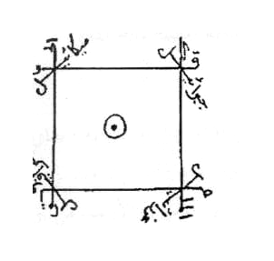

# BATCH-44 — Halaman 215–219 — DRAF, BELUM LENGKAP

> **Status: BELUM SELESAI.** Tautan di bawah menunjukkan scan asli Arab. Transliterasi Latin Arab, terjemah pesantren, dan inventarisasi lengkap rajah belum diverifikasi; jangan menandai batch ini selesai.

> **Catatan sumber:** nomor halaman mengikuti nomor cetak di foto. Urutan scan yang tersedia meloncat dari Picture 106 (hal. 208–209) ke Picture 107 (hal. 212–213); halaman 210–211 tidak ditemukan di aset yang ada. Halaman tersebut tidak direka.

## Hal 215 — Picture 108 (sisi kiri)

### Arab Gundul (Scan Asli):

*Scan dua halaman; halaman 215 berada di sisi kiri. Gambar menampilkan spread asli dan belum dipisah per halaman.*

### Latin Arab:
> **BELUM DITRANSLITERASI.** Teks harus disalin dan diperiksa langsung dari scan sebelum transliterasi diterbitkan.

### Terjemah Pesantren:
> **BELUM DITERJEMAHKAN.** Tidak ada terjemahan yang dikarang atau diisi otomatis.

### Rajah:

*Rajah persegi pada halaman 215. Crop sumber beresolusi 300 DPI; lihat `../rajah/rajah-hal-215-01.png`.*

## Hal 216 — Picture 109 (sisi kanan)

### Arab Gundul (Scan Asli):

*Scan dua halaman; halaman 216 berada di sisi kanan. Gambar menampilkan spread asli dan belum dipisah per halaman.*

### Latin Arab:
> **BELUM DITRANSLITERASI.** Teks harus disalin dan diperiksa langsung dari scan sebelum transliterasi diterbitkan.

### Terjemah Pesantren:
> **BELUM DITERJEMAHKAN.** Tidak ada terjemahan yang dikarang atau diisi otomatis.

### Rajah:
> **Belum diinventarisasi.** Ini bukan pernyataan bahwa halaman tidak memiliki rajah.

## Hal 217 — Picture 109 (sisi kiri)

### Arab Gundul (Scan Asli):

*Scan dua halaman; halaman 217 berada di sisi kiri. Gambar menampilkan spread asli dan belum dipisah per halaman.*

### Latin Arab:
> **BELUM DITRANSLITERASI.** Teks harus disalin dan diperiksa langsung dari scan sebelum transliterasi diterbitkan.

### Terjemah Pesantren:
> **BELUM DITERJEMAHKAN.** Tidak ada terjemahan yang dikarang atau diisi otomatis.

### Rajah:
> **Belum diinventarisasi.** Ini bukan pernyataan bahwa halaman tidak memiliki rajah.

## Hal 218 — Picture 110 (sisi kanan)

### Arab Gundul (Scan Asli):

*Scan dua halaman; halaman 218 berada di sisi kanan. Gambar menampilkan spread asli dan belum dipisah per halaman.*

### Latin Arab:
> **BELUM DITRANSLITERASI.** Teks harus disalin dan diperiksa langsung dari scan sebelum transliterasi diterbitkan.

### Terjemah Pesantren:
> **BELUM DITERJEMAHKAN.** Tidak ada terjemahan yang dikarang atau diisi otomatis.

### Rajah:
> **Belum diinventarisasi.** Ini bukan pernyataan bahwa halaman tidak memiliki rajah.

## Hal 219 — Picture 110 (sisi kiri)

### Arab Gundul (Scan Asli):

*Scan dua halaman; halaman 219 berada di sisi kiri. Gambar menampilkan spread asli dan belum dipisah per halaman.*

### Latin Arab:
> **BELUM DITRANSLITERASI.** Teks harus disalin dan diperiksa langsung dari scan sebelum transliterasi diterbitkan.

### Terjemah Pesantren:
> **BELUM DITERJEMAHKAN.** Tidak ada terjemahan yang dikarang atau diisi otomatis.

### Rajah:
> **Belum diinventarisasi.** Ini bukan pernyataan bahwa halaman tidak memiliki rajah.
