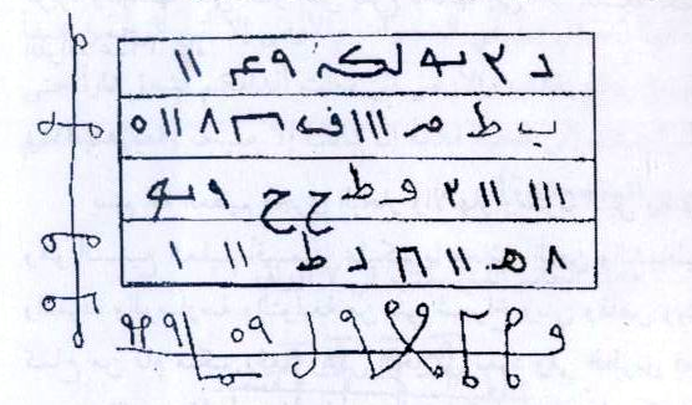
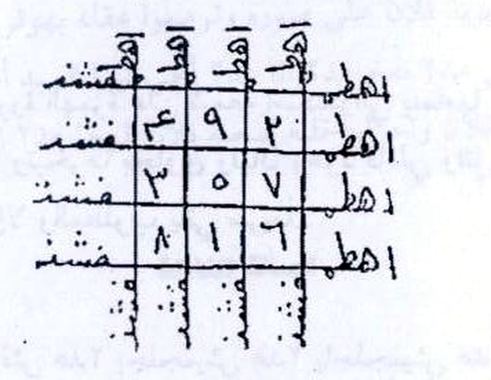

# Kitab *Asrār wa Khafāyāt fī 'Ilm al-Rūḥāniyyāt*
## Terjemahan Lengkap ke Bahasa Indonesia — Batch 1: Halaman Kitab 2–11
*(Berdasarkan foto pindaian `Picture 001.jpg` s.d. `Picture 005.jpg`)*

> **Keterangan umum terjemahan**
> - Format tiap paragraf: **Arab asli** (atas), **Latin** (tengah), **Terjemahan Indonesia** (bawah).
> - Istilah kunci hikmah yang tidak ada padanan Indonesianya dibiarkan dalam bahasa Arab dan diberi penjelasan dalam kurung, misalnya **taḥwīj** (pengikat/penarik), **'azīmah** (sumpah/incantasi pengikat), **shuf'ah** (lembar amalan), **lubān dhakir** (kemenyan/embal jantan), **jāwī** (kemenyan kayu jawa), **kuzbarah** (jintan), **kandar** (kemenyan kundur).
> - Dalam kitab, *"al-Ṣalāh al-..."* (shālah) yang dimaksud bukan shalat lima waktu, melainkan **formula incantasi/ritual** bernomor.
> - Kata ganti nama **falān / fulān** (Si Fulan) = nama orang laki-laki yang dituju; **fulānah** = nama perempuan yang dituju. Ganti dengan nama yang dimaksud saat diamalkan.
> - Untuk beberapa kata yang cetakan/pindaian-nya samar, digunakan bacaan paling mungkin; tempat yang diragukan ditandai (?).
> - Tabel huruf-angka (wafaq) dan gambar rajah TIDAK ditranskripsikan menjadi teks — disajikan sebagai gambar asli hasil crop, sesuai aturan terjemahan.

---

# BAB I (FAṢL I)

## Halaman 2
*(Foto `Picture 001.jpg`, halaman kanan)*

| | |
|---|---|
| 📜 **Arab** | كتاب أسرار و خفايات في علم الروحانيات ....... شيع الروحانيين الشيخ عطية عبد الحميد |
| 🔤 **Latin** | Kitāb Asrār wa Khafāyāt fī 'Ilm al-Rūḥāniyyāt …… Shaykh al-Rūḥāniyyīn al-Shaykh 'Aṭiyya 'Abd al-Ḥamīd |
| 🇮🇩 **Indonesia** | Kitab *Asrār wa Khafiyāt* (Ra-rahasia dan Hal-Hal yang Tersembunyi) dalam Ilmu Ruhaniyat (Ilmu Alam Spiritual)… Syekh ar-Rūḥānīyīn (Syekh Para Penghuni Alam Ruḥānī), Syekh 'Aṭiyya 'Abdul Ḥamīd |

| | |
|---|---|
| 📜 **Arab** | الفصل الأول |
| 🔤 **Latin** | Al-Faṣl al-Awwal |
| 🇮🇩 **Indonesia** | BAB PERTAMA |

| | |
|---|---|
| 📜 **Arab** | في |
| 🔤 **Latin** | Fī |
| 🇮🇩 **Indonesia** | Tentang |

| | |
|---|---|
| 📜 **Arab** | أعمال المحبة والجلب والتهميج |
| 🔤 **Latin** | A'māl al-Maḥabbah wa al-Jalab wa al-Taḥwīj |
| 🇮🇩 **Indonesia** | Amalan-amalan *Maḥabbah* (cinta/memikat kasih), *Jalab* (memanggil/menarik), dan *Taḥwīj* (pengikat/penawan) |

| | |
|---|---|
| 📜 **Arab** | من إصدارات شيع الروحانيين الشيخ عطية عبد الحميد في المكتبات |
| 🔤 **Latin** | Min iṣḥārāt shaykh al-rūḥāniyyīn al-shaykh 'Aṭiyya 'Abd al-Ḥamīd fī al-maktabāt |
| 🇮🇩 **Indonesia** | Dari terbitan Syekh ar-Rūḥānīyīn, Syekh 'Aṭiyya 'Abdul Ḥamīd, yang tersedia di toko-toko buku |

| | |
|---|---|
| 📜 **Arab** | مجلد السهم الصائب في تطبيقية العلوم الروحانية من الشواذب |
| 🔤 **Latin** | Majlid al-Sahm al-Ṣā'ib fī Tathbīqīyyat al-'Ulūm al-Rūḥāniyyah min al-Shawādhb |
| 🇮🇩 **Indonesia** | *(Judul kitab lain pengarang:)* Jilid *As-Sahm aṣ-Ṣā'ib* (Panah yang Tepat) tentang penerapan ilmu-ilmu ruhaniyah dari *Ash-Shawādhb* [nama khusus] |

| | |
|---|---|
| 📜 **Arab** | مجلد الدعوات الروحانية في حل الارصاد الفلكية خاص بعلم الكوز |
| 🔤 **Latin** | Majlid ad-Du'awāt al-Rūḥāniyyah fī Ḥall al-Irṣād al-Falakīyyah khāṣṣ bi-'Ilm al-Kūz |
| 🇮🇩 **Indonesia** | *(Judul kitab lain:)* Jilid *Ad-Du'awāt ar-Rūḥāniyyah* (Doa-Doa Ruhaniyah) tentang penyelesaian hitung-hitungan perbintangan (iṣṣād falakī), khusus tentang ilmu *Al-Kūz* [nama khusus] |

| | |
|---|---|
| 📜 **Arab** | كتاب الأبرارج اكتشاف أسرار من تريد |
| 🔤 **Latin** | Kitāb al-Abārrij Iktishāf Asrār Man Tardī |
| 🇮🇩 **Indonesia** | *(Judul kitab lain:)* Kitab *Al-Abārrij* [nama khusus] — Mengungkap rahasia dari (orang/hal) yang kamu inginkan |

| | |
|---|---|
| 📜 **Arab** | كتاب عجائب وفواتح النباتات والحيوانات وخصوصهم الروحانية |
| 🔤 **Latin** | Kitāb 'Ajā'ib wa Fawāḥith al-Nabātāt wa al-Ḥayawānāt wa Khaṣūṣhum al-Rūḥāniyyah |
| 🇮🇩 **Indonesia** | *(Judul kitab lain:)* Kitab Keajaiban dan Kunci-Kunci (*Fawāḥith*) Tumbuhan dan Binatang beserta rahasia ruhani yang khas pada keduanya |

| | |
|---|---|
| 📜 **Arab** | كتاب الصولجان في الاستلاء على بنات الجان |
| 🔤 **Latin** | Kitāb aṣ-Ṣūljān fī al-Intilā' 'Alā Banāt al-Jinn |
| 🇮🇩 **Indonesia** | *(Judul kitab lain:)* Kitab *Ash-Shūljān* (Tongkat Kekuasaan) tentang merebut kekuasaan atas putri-putri jin |

| | |
|---|---|
| 📜 **Arab** | كتاب زجرات ميظاطرون في الاقسام الحاكمة على قباطل الجان |
| 🔤 **Latin** | Kitāb Zarārāt Mīẓāṭūrīn fī al-Aqsām al-Ḥākimah 'Alā Qibāṭil al-Jinn |
| 🇮🇩 **Indonesia** | *(Judul kitab lain:)* Kitab Teriakan-teriakan *Mīẓāṭūrīn* [nama khusus] tentang bilangan-bilangan (aqsām) yang berkuasa atas para panglima (qibāṭil) jin |

| | |
|---|---|
| 📜 **Arab** | كتاب تصريف دعوات البرهنية الثلاثية الروحانية والأرضية والسفلية |
| 🔤 **Latin** | Kitāb Taṣrīf Du'awāt al-Barahaniyyah aṯ-Ḡalātsiyyah al-Rūḥāniyyah wa al-Arḍiyyah wa as-Sufliyyah |
| 🇮🇩 **Indonesia** | *(Judul kitab lain:)* Kitab Penataan Doa-Doa *Al-Barahaniyyah* yang tiga: yang ruhani, yang bumi (dunyawi), dan yang bawah (alam bawah) |

| | |
|---|---|
| 📜 **Arab** | كتاب حكمة الحكماء في علم السماء والكيمياء |
| 🔤 **Latin** | Kitāb Ḥikmat al-Ḥukamā' fī 'Ilm as-Samā' wa al-Kīmiyā' |
| 🇮🇩 **Indonesia** | *(Judul kitab lain:)* Kitab Hikmah para Ḥakīm (ulama hikmah) dalam ilmu langit dan kimia (kimia/iksir) |

| | |
|---|---|
| 📜 **Arab** | كتاب الاستدلال على الضمانير الخفية بالقوانين الحرفية |
| 🔤 **Latin** | Kitāb al-Istidlāl 'Alā aḍ-Ḍamā'nir al-Ḵhafīyah bi-al-Qawānīn al-Ḥurufiyyah |
| 🇮🇩 **Indonesia** | *(Judul kitab lain:)* Kitab Berdalil tentang *Aḍ-Ḍamā'nir* (watak-batin tersembunyi) dengan hukum-hukum huruf (abjad) |

| | |
|---|---|
| 📜 **Arab** | كتاب سر الأسرار في التواصل مع روحانيات القرآن |
| 🔤 **Latin** | Kitāb Sirr al-Asrār fī at-Tawāṣul ma'a Rūḥāniyyāt al-Qur'ān |
| 🇮🇩 **Indonesia** | *(Judul kitab lain:)* Kitab *Sirr al-Asrār* (Rahasia dari segala rahasia) tentang hubungan (taawashul) dengan ruh-ruh Qur'an |

| | |
|---|---|
| 📜 **Arab** | كتاب أسرار و خفايات في علم الروحانيات |
| 🔤 **Latin** | Kitāb Asrār wa Khafāyāt fī 'Ilm al-Rūḥāniyyāt |
| 🇮🇩 **Indonesia** | *(Judul kitab lain:)* Kitab *Asrār wa Khafiyāt fī 'Ilm ar-Rūḥāniyyāt* — yaitu kitab ini sendiri |

| | |
|---|---|
| 📜 **Arab** | شيخ الروحانيين في الوطن العربي |
| 🔤 **Latin** | Shaykh al-Rūḥāniyyīn fī al-Waṭan al-'Arabī |
| 🇮🇩 **Indonesia** | Syekh ar-Rūḥānīyīn (Kepala para ahli alam ruḥānī) di negeri-negeri Arab |

| | |
|---|---|
| 📜 **Arab** | الشيخ عطية عبد الحميد |
| 🔤 **Latin** | Al-Shaykh 'Aṭiyya 'Abd al-Ḥamīd |
| 🇮🇩 **Indonesia** | Syekh 'Aṭiyya 'Abdul Ḥamīd |

| | |
|---|---|
| 📜 **Arab** | 00201062022238 |
| 🔤 **Latin** | 00201062022238 |
| 🇮🇩 **Indonesia** | 00201062022238 *(nomor kontak yang dicetak pada halaman ini; 0020 = kode negara Mesir)* |

| | |
|---|---|
| 📜 **Arab** | ٢ |
| 🔤 **Latin** | (nomor halaman) 2 |
| 🇮🇩 **Indonesia** | (Nomor halaman kitab: 2) |

---

## Halaman 3
*(Foto `Picture 001.jpg`, halaman kiri)*

| | |
|---|---|
| 📜 **Arab** | كتاب أسرار و خفايات في علم الروحانيات ....... شيع الروحانيين الشيخ عطية عبد الحميد |
| 🔤 **Latin** | Kitāb Asrār wa Khafāyāt fī 'Ilm al-Rūḥāniyyāt …… Shaykh al-Rūḥāniyyīn al-Shaykh 'Aṭiyya 'Abd al-Ḥamīd |
| 🇮🇩 **Indonesia** | Kitab *Asrār wa Khafiyāt* dalam Ilmu Ruhaniyat… Syekh ar-Rūḥānīyīn, Syekh 'Aṭiyya 'Abdul Ḥamīd *(kepala halaman)* |

| | |
|---|---|
| 📜 **Arab** | الصلاة الأولى |
| 🔤 **Latin** | Aṣ-Ṣalāh al-Ulā |
| 🇮🇩 **Indonesia** | RITUAL (INCANTASI) PERTAMA |

| | |
|---|---|
| 📜 **Arab** | باب القلقة بين الرجل وزوجته |
| 🔤 **Latin** | Bāb al-Qalqah bayn ar-Rajul wa Zawjatih |
| 🇮🇩 **Indonesia** | Bab *Al-Qalqah* [istilah khusus kitab ini: ikatan/penarik rasa] antara seorang laki-laki dengan istrinya |

| | |
|---|---|
| 📜 **Arab** | تأخذ على بركة الله تعالى عشرين ورقة من ورق الليمون المالنج ثم تكتب على الأولى طلق وعلى الثانية مال وعلى الثالثة أتقش وعلى الرابعة فقش وعلى الخامسة ملش وعلى السادسة داس وعلى السابعة أراس وعلى الثامنة أفراراش وعلى التاسعة طبوخ وعلى العاشرة تماسية - ثم تكتب العشرة الباقية. أعني تكتب على كل واحدة منهم (حمدايني في باب الكلب خبيري). وتأخذ المرأة ورقتين في كل يوم وتمضيحها في ماء وسكر وتشرب حتى تنتهي العشرين ورقة في عشرة أيام فإن الرجل يحبها حباً شديداً - فصل - وإن كان الكره من المرأة فإن الرجل يأخذ العشرين ورقة المذكورين ويعمي في ماء ويدهن به فإن المرأة تحبه حباً شديداً وهو من المجربات. |
| 🔤 **Latin** | Ta'khudh 'alā barakatillāh ta'ālā 'ishrīni waraqatan min warq al-laymūn al-mālīj thumma taktub 'alā al-ūlā Ṭalaq wa 'alā ath-thāniyyah Māl wa 'alā ath-thālithah Atqash wa 'alā ar-rābi'ah Faqash wa 'alā al-khāmissah Malyash wa 'alā as-sādisah Dās wa 'alā as-sābi'ah Ārās wa 'alā aṯ-ṯāminah Āfarrāsh wa 'alā at-tāsi'ah Ṭabūkhw wa 'alā al-'āshirah Tamāsiyyah – thumma taktub al-'ashrata al-bāqiyah, a'ney taktub 'alā kull wāḥidatin minhum (Ḥamdānīy fī Bāb al-Kalbi Khabīrī). Wa ta'khudh al-mar'ah warqatayn fī kull yawm wa tumdīḥahā fī mā' wa sukkar wa tasyrab ḥattā tantaḥiya al-'ishrīn waraqatan fī 'asharati ayyām, fa inna ar-rajula yaḥibbahā ḥubbān syadīdan – faṣl – wa in kāna al-kurh min al-mar'ah fa inna ar-rajula ya'khudh al-'ishrīn waraqatan al-madhkūrīn wa ya'mimihā fī mā' wa yadhinna bihi, fa inna al-mar'ah tuḥibbuhū ḥubbān syadīdā, wa huwa min al-mujarrabāt. |
| 🇮🇩 **Indonesia** | Dengan keberkahan Allah Yang Maha Tinggi, ambillah dua puluh lembar daun *al-Mālīj* (sejenis daun jeruk/limau). Lalu tulislah pada lembar pertama kata **Ṭalaq**, pada lembar kedua **Māl**, pada lembar ketiga **Atqash**, pada lembar keempat **Faqash**, pada lembar kelima **Malyash**, pada lembar keenam **Dās**, pada lembar ketujuh **Ārās**, pada lembar kedelapan **Āfarrāsh**, pada lembar kesembilan **Ṭabūkhw**, dan pada lembar kesepuluh **Tamāsiyyah** — (kelima-kalimanya nama-nama khusus). Kemudian tulislah pada sepuluh lembar sisanya — maksudku, tulislah pada masing-masing satu di antara mereka (semuanya) kata: **"(Ḥamdānīy fī Bāb al-Kalbi Khabīrī)"** [kata-kata khusus]. Lalu wanita itu mengambil dua lembar setiap hari, [halus-halus/campurkan] ia ke dalam air dan gula, dan diminumnya, hingga habis dua puluh lembar itu dalam sepuluh hari. Maka (sesudah itu) si laki-laki akan mencintainya dengan cinta yang sangat kuat. — *(Bab beranjak)* — Dan jika kebencian itu datang dari pihak wanita, maka si laki-laki mengambil dua puluh lembar yang tersebut tadi, ia [rendam/diamalkan] dengan air, lalu dipakainya (diraupkan) sebagai minyak (pencampur air tersebut), maka wanita itu akan mencintainya dengan cinta yang sangat kuat. Ini termasuk amalan yang sudah teruji (*mujarrabāt*). |

| | |
|---|---|
| 📜 **Arab** | الصلاة الثانية |
| 🔤 **Latin** | Aṣ-Ṣalāh aṯ-Thāniyyah |
| 🇮🇩 **Indonesia** | RITUAL (INCANTASI) KEDUA |

| | |
|---|---|
| 📜 **Arab** | باب محبة وتهميج لطيف |
| 🔤 **Latin** | Bāb Maḥabbah wa Taḥwīj Layyīf |
| 🇮🇩 **Indonesia** | Bab Maḥabbah (memikat kasih) dan Taḥwīj (penawan) yang lembut/halus |

| | |
|---|---|
| 📜 **Arab** | ليس له نظير وليس له وقت معين إذا قرأت وإذا كتبت وهو يكتب على شريط من أثر المطلب أو على ملبس ويلبسه أو على مأكول ويأكله أو على مشنوم ويشمه والعدد ٧٢ مرة والبخور لبان ذكر وكبرية وجاوى. في سعد القمر. وهذا ما تكتب به وتعزم. |
| 🔤 **Latin** | Laysa lahu nadīr wa laysa lahu waqt mu'ayyan, idhā qara'ta wa idhā katabta. Wa huwa yuktub 'alā syariṭ min athar al-maṭlūb aw 'alā malbas wa yalbisuhū, aw 'alā ma'kūl wa ya'kuluhū, aw 'alā masyanūm wa yasyamuhū. Wa al-'adad 72 marrah, wa al-bakhūr lubān dhakir wa kabāriyyah wa jāwī. Fī Sa'd al-Qamar. Wa hādhā mā taktubu bihi wa ta'zam. |
| 🇮🇩 **Indonesia** | Amalan ini tidak ada yang menandinginya, dan tidak ada waktu tertentu: kamu baca saja dan tulis saja (kapan saja). Amalan ini ditulis pada sehelai kain (*syariṭ*) yang berasal dari jejak/jejak kain milik yang dikehendaki, atau pada pakaian lalu ia pakailah, atau pada makanan lalu ia makannya, atau pada sesuatu yang diwangikan lalu ia cium. Bilangan pengulangannya 72 kali. Bakurnya (kemenyannya): *lubān dhakir* (kemenyan jantan), *kabāriyyah* [sejenis wangi-wangian], dan *jāwī* (kemenyan kayu jawa). Diamalkan pada *Sa'd al-Qamar* (peruntungan hari bulan, salah satu dari 12 sa'ad/perioda peruntungan bulan). Dan inilah yang kamu tulis dengan amalan ini dan yang kamu ikat niatmu (*ta'zam*). |

---

## Halaman 4
*(Foto `Picture 002.jpg`, halaman kanan)*

| | |
|---|---|
| 📜 **Arab** | كتاب أسرار و خفايات في علم الروحانيات ....... شيع الروحانيين الشيخ عطية عبد الحميد |
| 🔤 **Latin** | Kitāb Asrār wa Khafāyāt fī 'Ilm al-Rūḥāniyyāt …… Shaykh al-Rūḥāniyyīn al-Shaykh 'Aṭiyya 'Abd al-Ḥamīd |
| 🇮🇩 **Indonesia** | Kitab *Asrār wa Khafiyāt* dalam Ilmu Ruhaniyat… Syekh ar-Rūḥānīyīn, Syekh 'Aṭiyya 'Abdul Ḥamīd *(kepala halaman)* |

| | |
|---|---|
| 📜 **Arab** | بسم الله كبير عدد٣. خطفت قلب فلانة بنت فلانة إلى فلان ابن فلانة بالسحر والزلازلة وملئتناها ومسجنتها ووضعت فيه محبة فلان ابن فلانة حتى لا تغفل ولا تنام عن محبة فلان ابن فلانة درجة واحدة إلا قلقلانة ولهانة حيرانه بالنار والنيران والوهيج والغليان مروج البحرين يلتقيان بشامشهم عدد٢ شماشم عدد٢ سميم عدد٢ شموم عدد٢ طحوم عدد٢ عوم عدد٢ هالجوم عدد٢ علجوم عدد٢ ابوم عدد٢ حيوم عدد٢ قيوم عدد٢ ديم عدد٢ سبحان عدد٢ بذكره تطفئ القلوب ويعلم خائنة الأعين وما تخفي الصدور وأصحاب الشمال ما أصحاب الشمال في سموم وحميم وظل من يحوم لا بارد ولا كريم حتى تأتي فلانة بنت فلانة إلى فلان ابن فلانة فرحانة مسرورة ضاحكة مستبشرة أجب وتوكل يا وسواس ويابخناس واللبس فلانة بنت فلانة من القدم إلى الرأس وحرك طبعمها وقبلها بالوسواس الخناس لا تنفك محبة فلان ابن فلانة من قلب فلانة بنت فلانة حتى يفجر لها بالقأس سنستدرجههم من حيث لا يعلمون ها هي هاجبت ومن عوائد السحر ما خابت. |
| 🔤 **Latin** | Bismillāh Kabīr 'adad 2. Khaṭiftu qalbi fulānata binti fulānā ilā falāni ibni falānā bis-siḥri wa az-zalāzalah wa malla'tunāhā wa masjantuhā wa waḍa'tu fīhi maḥabbata falāni ibni falānā ḥattā lā taghfla wa lā tunā'm 'an maḥabbati falāni ibni falānā darajatan wāḥidatan illā Qalqalānā wa Lahānā wa Ḥiyārāna bis-samari wa an-nīrān wa al-Wahīj wa al-Ghalayān, Murūj al-Baḥrayn allatay ya'taqyān bi-Syāmsihim 'adad 2, Syamāsim 'adad 2, Samīm 'adad 2, Shamūm 'adad 2, Ṭaḥūm 'adad 2, 'Awm 'adad 2, Hālajūm 'adad 2, 'Uljūm 'adad 2, Abūm 'adad 2, Ḥayūm 'adad 2, Qayūm 'adad 2, Dīm 'adad 2, Subḥān 'adad 2 — bi-dzikrihi taṭfī' al-qulūb, wa ya'lam khā'inata al-'aynīn wa mā tukhfi aṣ-ṣudūr, wa aṣ-ḥāb asy-syimāl mā aṣ-ḥāb asy-syimāl, fī samūm wa ḥamīm wa ẓallun min yaḥūm, lā bārid wa lā karīm — ḥattā ti'tiya fulānata bintu fulānā ilā falāni ibni falānā firaḥānata musyarrahṭan ḍāḥikatan mustabsyiratan. 'Ajib wa tawakkal yā Waswās wa yā Bukhnās. Wa al-libsu fulānata bintu fulānā min al-qadam ilā ar-rā's, wa harrik Ṭaba'mahā wa qabbilihā bil-Waswāsi al-Ḵhnās. Lā tanfak maḥabbatu falāni ibni falānā min qalbi fulānata binti fulānā ḥattā yafjara lahā bil-Qa's. Sanastadrījahum min ḥaytu lā ya'lamūn. Ha ha hiyyā hājabat, wa min 'awā'īd as-siḥri mā khābat. |
| 🇮🇩 **Indonesia** | *(Ucapan amalan, dibaca tiga kali — "jumlah 3"):* "Dengan nama Allah Yang Maha Agung, dua kali. Aku telah mencabut/memikat hati Si Fulanah binti Si Fulan ke arah Si Fulan bin Si Fulan dengan sihir dan goncangan (*zalāzalah*), aku telah memenuhi hatinya dan aku telah memenjarakannya, dan aku telah menanamkan di dalamnya cinta kepada Si Fulan bin Si Fulan, sehingga ia tidak sedikit pun lalai dan tidak pula tidur dari cinta kepada Si Fulan bin Si Fulan, walau satu derajat saja, kecuali *Qalqalānā, Lahānā, Ḥiyārānā* [nama-nama khusus] dengan api-apinya dan nyala-nyala api, amukan (*wahīj*) dan mendidihnya — Padang rumput dua laut yang bertemu (*murūj al-baḥrayn*), bersama matahari-matahari mereka, dua kali; *Syamāsim*, dua kali; *Samīm* (panas yang membakar), dua kali; *Shamūm* (angin terik), dua kali; *Ṭaḥūm*, dua kali; *'Awm*, dua kali; *Hālajūm*, dua kali; *'Uljūm*, dua kali; *Abūm*, dua kali; *Ḥayūm*, dua kali; *Qayūm*, dua kali; *Dīm*, dua kali; Mahasuci (Allah), dua kali — dengan dzikir-Nya padamlah hati-hati (musuh), dan (Allah) Maha Mengetahui pengkhianatan mata dan apa yang disembunyikan oleh dada; dan golongan kiri, apa itu golongan kiri: berada dalam hawa panas (*samūm*) dan panas yang membakar (*ḥamīm*) serta naungan dari yang mengelilingi — tidak dingin dan tidak pula menyenangkan — hingga datanglah Si Fulanah binti Si Fulan kepada Si Fulan bin Si Fulan dengan gembira, bersuka, tertawa-tawa, penuh pengharapan. Jawablah (*'ajib*) dan berserahlah, wahai Waswās (jin bisikan) dan wahai Bukhnās [nama jin]. Dan ikatlah (*al-libas*) Si Fulanah binti Si Fulan dari kaki sampai kepala, dan gerakkanlah watak-batinnya (*ṭaba'mahā*), dan sucikanlah ia dengan Waswās al-Khnās (jin bisukan yang persembunyi). Tidak akan lepas cinta Si Fulan bin Si Fulan dari hati Si Fulanah binti Si Fulan, hingga meledaklah baginya dengan *Al-Qa's* [nama khusus/tempat khusus]. Kami akan menggodanya dari arah yang tidak mereka ketahui. Lihatlah, ia telah mengamuk/merebak; dan dari kebiasaan sihir, tidak ada yang kecele (sia-sia)." |

| | |
|---|---|
| 📜 **Arab** | الصلاة الثالثة |
| 🔤 **Latin** | Aṣ-Ṣalāh aṯ-Thālithah |
| 🇮🇩 **Indonesia** | RITUAL (INCANTASI) KETIGA |

| | |
|---|---|
| 📜 **Arab** | باب تهميج |
| 🔤 **Latin** | Bāb Taḥwīj |
| 🇮🇩 **Indonesia** | Bab Taḥwīj (pengikat/penawan) |

| | |
|---|---|
| 📜 **Arab** | يكتب على شفعة نية يوم الثلاثاء عند طلوع الشمس وتوضعها في نار داتمة الوقود وتعزم عليها ٢١ مرة والبخور مطلوب وهو صندل أحمر وسندروس ولبان ذكر وجاوى وهو مجرب لا |
| 🔤 **Latin** | Yuktub 'alā shuf'ah niyyatan yawm at-syātsi' 'inda ṭulū' asy-syams, wa tuwaḍa'u hā fī nār dātimatin al-waqūd, wa ta'zam 'alayhā 21 marrah, wa al-bakhūr maṭlūb, wa huwa sandal aḥmar wa sandrūsh wa lubān dhakir wa jāwī. Wa huwa mujarrab, lā… |
| 🇮🇩 **Indonesia** | Tulislah pada selembar *shuf'ah* (kertas amalan) dengan niat pada hari Selasa ketika matahari terbit. Letakkanlah ia di atas api yang menyala hebat (*dātimah al-waqūd*), dan ikat niatmu (*ta'zam*) di atasnya 21 kali. Bakurnya (kemenyannya) yang dikehendaki: *sandal aḥmar* (kayu cendana merah), *sandrūsh* (kemenyan sandarosa), *lubān dhakir* (kemenyan jantan), dan *jāwī* (kemenyan kayu jawa). Ini amalan yang sudah teruji; tidak ada… |

---

## Halaman 5
*(Foto `Picture 002.jpg`, halaman kiri)*

| | |
|---|---|
| 📜 **Arab** | كتاب أسرار و خفايات في علم الروحانيات ....... شيع الروحانيين الشيخ عطية عبد الحميد |
| 🔤 **Latin** | Kitāb Asrār wa Khafāyāt fī 'Ilm al-Rūḥāniyyāt …… Shaykh al-Rūḥāniyyīn al-Shaykh 'Aṭiyya 'Abd al-Ḥamīd |
| 🇮🇩 **Indonesia** | Kitab *Asrār wa Khafiyāt* dalam Ilmu Ruhaniyat… Syekh ar-Rūḥānīyīn, Syekh 'Aṭiyya 'Abdul Ḥamīd *(kepala halaman)* |

| | |
|---|---|
| 📜 **Arab** | شك فيه وإياك والحرام. |
| 🔤 **Latin** | (Lā) syakk fīhi wa iyāka wa al-ḥarām. |
| 🇮🇩 **Indonesia** | …(tidak ada) keraguan sedikit pun terhadapnya (amalan ini), dan jagalah dirimu dari yang haram. *(Lanjutan kalimat terakhir dari halaman 4: "…ia adalah amalan yang sudah teruji, tidak ada keraguan…")* |

| | |
|---|---|
| 📜 **Arab** | وهذا ما تكتب على الشفعة كما ترى فانهن ترشد |
| 🔤 **Latin** | Wa hādhā mā taktubu 'alā ash-shuf'ah kamā tarā, fa-innahunna tursid |
| 🇮🇩 **Indonesia** | Dan inilah yang kamu tulis pada shuf'ah (kertas amalan) sebagaimana kamu lihat (pada gambar di bawah ini) — maka huruf-huruf dan angka-angka itu akan memberi petunjukmu. |

> 📸 **Gambar Rajah Asli Halaman 5**
>
> *(Tabel wafaq huruf-angka 4 baris, dengan nomor urut baris 1–4 di sisinya, dan deretan tulisan tangan di bawah kotak. Disajikan apa adanya, tidak ditranskripsikan.)*
>
> 
>
> **Cara baca (sesuai keterangan kitab):** Kitab tidak memberi penjelasan rinci selain: *"tulislah pada shuf'ah sebagaimana kamu lihat, maka ia akan memberimu petunjuk"* — artinya gambar wafaq di atas disalin persis sebagaimana ia terlihat (huruf, angka, dan penempatannya), tanpa mengubah satu tanda pun.

| | |
|---|---|
| 📜 **Arab** | وهذه العزيمه تقول أقسمت عليكم أيتها الأرواح الروحانية بالنار والنور والظل والحرور بعلاشاش عدد٢ مهراشش عدد٢ بمن أنزل الأمطار ومجري الأنهار ونور الشمس والقمر وأحيا وأمره كل ميت وأرسى الجبال رواسي الذي تجلى للجبل فجعله دكاً وخر موسى صعقاً إلا ما هيبتكم وأطلقتم النار في قلب فلانة إلى محبة فلان الوحا عدد٢ العجل عدد٢ الساعة عدد٢ إن كانت إلا صيحة واحدة فإذا هم جميع لدينا محضرون. |
| 🔤 **Latin** | Wa hādhih al-'azīmah taqūlu: "Aqsamtu 'alaykum ayyatuhā al-arwāḥ ar-rūḥāniyyah, bi-n-nār wa an-nūr wa aẓ-ẓill wa al-Ḥarūr, bi-'Ilāsyāsh 'adad 2 wa Muharrāsy 'adad 2, bi-Man anzala al-amṭār wa mujrā al-anhār wa nūr asy-syams wa al-qamar, wa aḥyā wa amara kulla mayyit, wa arasa al-jibāl ruwāsiya — alladhī tajallā lil-jibali fa-j'alahu dakan, wa kharra Mūsā ṣu'qan — illā mā hayyibatkum, wa aṭlaqtum an-nāra fī qalbi fulānā ilā maḥabbati falān. Al-Waḥā 'adad 2, al-'Ajl 'adad 2, as-Sā'ah 'adad 2. In kānat illa ṣiḥḥatan wāḥidatan, fa-idhā hum jamī'u ladinā maḥḍūrūn." |
| 🇮🇩 **Indonesia** | Dan ini *'azīmah*-nya (sumpah/incantasi pengikat), kamu ucapkan: "Demi kalian (aku bersumpah), wahai ruh-ruh yang ruhani, dengan api dan cahaya, dengan gelap dan *Al-Ḥarūr* [nama panas/gelar], dengan *'Ilāsyāsh*, dua kali, dan *Muharrāsy*, dua kali, demi Dia yang menurunkan hujan-hujan dan mengalirkan sungai-sungai, dan (pemberi) cahaya matahari dan bulan, yang menghidupkan dan (memerintah) segala yang mati, yang menancapkan gunung-gunung menjadi kokoh — Dialah yang menampakan diri (tajalli) kepada gunung lalu menjadikannya hancur berserak, dan Musa pingsan tak sadarkan diri — kecuali karena keagungan kalian (yang kuperhatikan), maka nyalakanlah api di dalam hati Si Fulanah menuju cinta kepada Si Fulan. *Al-Waḥā* [nama khusus], dua kali; *Al-'Ajl* (maut/janji saat), dua kali; *As-Sā'ah* (Hari Kiamat/saat yang ditentukan), dua kali. Jika pun itu hanya satu seruan — maka serta-merta mereka semua berada di sisi Kami dalam keadaan hadir." |

| | |
|---|---|
| 📜 **Arab** | الصلاة الرابعة |
| 🔤 **Latin** | Aṣ-Ṣalāh ar-Rābi'ah |
| 🇮🇩 **Indonesia** | RITUAL (INCANTASI) KEEMPAT |

| | |
|---|---|
| 📜 **Arab** | باب آخر مثله |
| 🔤 **Latin** | Bāb Ākhar Mithlah |
| 🇮🇩 **Indonesia** | Bab lain yang serupa dengan itu |

| | |
|---|---|
| 📜 **Arab** | وهو أن تكتب الوثق الأتي وتوكل بما تريد في سبع أوراق |
| 🔤 **Latin** | Wa huwa an taktub al-waṯīq al-āti, wa tawakkala bimā tardī fī sab'i awrāq |
| 🇮🇩 **Indonesia** | Yaitu: kamu menulis *waṯīq* (surat/surat perjanjian amalan) yang berikut ini, dan kamu serahkan (*tawakkal*) apa yang kamu kehendaki, pada tujuh lembar kertas. |

---

## Halaman 6
*(Foto `Picture 003.jpg`, halaman kanan)*

| | |
|---|---|
| 📜 **Arab** | كتاب أسرار و خفايات في علم الروحانيات ....... شيع الروحانيين الشيخ عطية عبد الحميد |
| 🔤 **Latin** | Kitāb Asrār wa Khafāyāt fī 'Ilm al-Rūḥāniyyāt …… Shaykh al-Rūḥāniyyīn al-Shaykh 'Aṭiyya 'Abd al-Ḥamīd |
| 🇮🇩 **Indonesia** | Kitab *Asrār wa Khafiyāt* dalam Ilmu Ruhaniyat… Syekh ar-Rūḥānīyīn, Syekh 'Aṭiyya 'Abdul Ḥamīd *(kepala halaman)* |

| | |
|---|---|
| 📜 **Arab** | وتعمل في كل ورقة عدد٢ حبات لبان ذكر وثلاث عدد٢ حبات كزبرة وتجمعها على النار تفرغ دخانها إلى آخر السبعه تكمل القراءة عدد٢ مرة. |
| 🔤 **Latin** | Wa ta'mal fī kull waraqatin 'adad 2 ḥabātan lubān dhakir wa ṡalāts 'adad 2 ḥabātan kuzbarah, wa tajma'uhā 'alā an-nār, tufriḥ dukhānahā ilā ākhir as-sab'ah, tukammil al-qirā'ah 'adad 2 marrah. |
| 🇮🇩 **Indonesia** | Dan letakkanlah pada setiap lembar dua biji *lubān dhakir* (kemenyan jantan) dan biji-biji *kuzbarah* (jintan) [jumlahnya seperti yang tertulis: "tiga, jumlah dua"], dan kumpulkanlah (bakarlah) di atas api; (biarkan) asapnya keluar hingga lembar ketujuh yang terakhir, lalu sempurnakan pembacaannya (doanya) dua kali. |

| | |
|---|---|
| 📜 **Arab** | وهذه العزيمه |
| 🔤 **Latin** | Wa hādhih al-'azīmah |
| 🇮🇩 **Indonesia** | Dan inilah *'azīmah*-nya (sumpah/incantasi pengikatnya): |

| | |
|---|---|
| 📜 **Arab** | بسم الله العظيم مجرى البحار والأنهار ومكون الليل والنهار وهو السميع العليم أقسمت عليكم يا معاشر الجن والشياطين والمردة والوساوسه والتوابعه من بني شمراخ وبني وقاض وبتي كماخ من قام منكم وقعد وعلى الخلائق تمرد وفي الطريق قعد ورسد بقل هو الله أحد الله الصمد لم يلد ولم يولد ولم يكن له كفواً أحد ليس كمثله شيء وهو السميع البصير اقبلا من كل فج عميق إلى فلان ابن فلانة إن كان نائماً فأيقلطوه وإن كان يفتتاناً فأوقفوه وعلى خيولكم مركبه وافتحوا له الباب واكسروا له الأقفال والأغلال ومشوه على جمر النيران وهيجوه واجليبه إلى فلانة بنت فلانة نيكولوا يا معشر العمار والملوك العلوية والسفلية والأرضية والسحابية والغمامية والمستمرورن في الهوا أجييبوا من معاشر الأرض ومغاريها هيجوه واجليبه إلى فلانة أين دهنش أين شمارخ أين طيكل أجييبوا بقدره من يحيي العظام وهي رميم أقسمت عليكم بالسماء وما أظلت والأرض وما أقطت والرياح وما لفحت والمياه وما جرت ارفعداوازجروا وزلزلوا وانزلوا على فلان ابن فلانة رهيجوه واجليبه إلى فلانة بنت فلانه بحق امهيا شراحيها أدنائي |
| 🔤 **Latin** | Bismillāhi al-'Azhīm, majrā al-biḥār wa al-anhār wa mukawwin al-lail wa an-nahār, wa huwa as-Samī' al-'Alīm. Aqsamtu 'alaykum yā ma'asyar al-jinn wa asy-syayāṭīn wa al-muraddah wa al-wasā'isyah wa at-tawābisah, min Banī Syumrākh wa Banī Waqādh wa Baṭṭay, kamākh — man qāma minkum wa qa'da, wa 'alā al-khalā'iq tamarrad, wa fī aṭ-ṭarīq qa'da, wa rabad, bi-"Qul huwallāhu aḥad, allāhu aṣ-Ṣamad, lam yalid wa lam yūlad, wa lam yakun lahū kufuwan aḥad. Laisa kamitslihī syay', wa huwa as-Samī' al-Baṣīr." "Iqbilā min kulli fij 'amīq ilā falāni ibni fulānā. In kāna nā'iman fa-ayqilṭūhū, wa in kāna yiftanānā fa-awqifūhū, wa 'alā khuwilikum marmūkah, wa-ftaḥū lahū al-bāb wa aksirū lahū al-aqfāl wa al-āġāl, wa masyshūhu 'alā jamrin an-nīrān wa hayyijūhū wa jālibūhū ilā fulānata binti fulānā. Nīkūlū yā ma'asyar al-'amār wa al-malūk: al-'ulyā, wa as-suflyā, wa al-arḍiyyah, wa as-sabā'iyyah, wa al-ghamāmiyyah, wa al-mustamarīn fī al-hawā'. Ajjibū — yā ma'asyar al-arḍ wa maḡārīhā — hayyijūhū wa jālibūhū ilā fulānā. Ayna Dahnasy, ayna Samārakh, ayna Ṭaykal? Ajjibū bi-qudrat Man yuḥyī al-'aẓām wa hiya ramīm. Aqsamtu 'alaykum bis-samā'i wa mā aẓzilat, wa al-arḍi wa mā aqṭat, wa ar-rīyāḥ wa mā lafḥat, wa al-miyāh wa mā jarat: irfa'dū wa azjurū, wa zallazilū wa anzilū 'alā falāni ibni fulānā, raḥayijūhū wa jālibūhū ilā fulānata binti fulānā, bi-ḥaqqi Amhiyā, Sharāḥihā, Adnāyā." |
| 🇮🇩 **Indonesia** | "Dengan nama Allah Yang Maha Agung, (Dialah) pengalir lautan dan sungai-sungai, dan pembentuk malam dan siang; dan Dia Yang Maha Mendengar lagi Maha Mengetahui. Demi kalian (aku bersumpah), wahai sekalian jin dan setan, dan *al-Muraddah* [penghuni murad/alam tertentu], dan *al-Wasā'isyah* (para penghasut bisikan) serta *At-Tawābisah* (pengikut-pengikutnya), dari Bani Syumrākh, Bani Waqādh, dan Baṭṭay [nama-nama kaum jin] — *kamākh* [kata khusus] — siapa pun dari kalian yang bangun dan yang duduk, dan terhadap segala makhluk (kalian) yang bermewah-mewah, dan yang duduk di jalan (menghalangi), dan yang berdiam (*rabad*): dengan (surat) *Qul Huwallāhu Aḥad* — "Katakanlah: Dia Allah Yang Maha Esa; Allah *aṣ-Ṣamad* (Tuhan yang segala makhluk bergantung kepada-Nya); Dia tidak melahirkan dan tidak dilahirkan; dan tidak ada satu pun yang sebanding dengan-Nya; tidak ada sesuatu pun yang seperti-Nya; dan Dia Yang Maha Mendengar lagi Maha Melihat." — Hadirilah (ia) dari setiap celah yang dalam, menuju Si Fulan bin Si Fulanah. Jika ia sedang tidur, bangunkanlah ia; dan jika ia sedang terjaga, tahanlah ia; dan tumpangkanlah ia di atas kuda-kuda kalian, dan bukakanlah baginya pintu-pintu, dan pecahkanlah baginya kunci-kunci dan belenggu-belenggu, dan bakarlah (tanda) ia pada bara api, gegerkanlah ia, dan bawalah ia kepada Si Fulanah binti Si Fulan. *Nīkūlū* [nama khusus], wahai sekalian *al-'Amār* (pembangun-pembangun) dan para raja: yang atas (surgawi), yang bawah, yang bumi, yang di awan, yang di kelabu mendung, dan yang tetap bertahta di udara — penuhilah (seruan)! — wahai sekalian (penghuni) bumi dan gua-guanya: gegerkanlah ia dan bawalah ia kepada Si Fulanah. Di mana Dahnasy? Di mana Samārakh? Di mana Ṭaykal? [tiga nama jin — dikecam agar hadir]. Penuhilah (seruan) dengan kekuasaan Dia yang menghidupkan tulang-tulang padahal tulang itu sudah hancur berkeping-keping. Demi langit dan apa yang ia naungi, demi bumi dan apa yang ia berkanangkan, demi angin-angin dan apa yang ia sentuh (tiup), dan demi air-air dan apa yang ia alirkan, aku bersumpah kepada kalian: angkatlah (ia) dan gerakkanlah, goncangkanlah dan turunkanlah kepada Si Fulan bin Si Fulanah; guncang-guncanglah ia dan bawalah ia kepada Si Fulanah binti Si Fulan, dengan hak *Amhiyā, Sharāḥihā, Adnāyā* [tiga nama/gelar khusus]." |

---

## Halaman 7
*(Foto `Picture 003.jpg`, halaman kiri)*

| | |
|---|---|
| 📜 **Arab** | كتاب أسرار و خفايات في علم الروحانيات ....... شيع الروحانيين الشيخ عطية عبد الحميد |
| 🔤 **Latin** | Kitāb Asrār wa Khafāyāt fī 'Ilm al-Rūḥāniyyāt …… Shaykh al-Rūḥāniyyīn al-Shaykh 'Aṭiyya 'Abd al-Ḥamīd |
| 🇮🇩 **Indonesia** | Kitab *Asrār wa Khafiyāt* dalam Ilmu Ruhaniyat… Syekh ar-Rūḥānīyīn, Syekh 'Aṭiyya 'Abdul Ḥamīd *(kepala halaman)* |

| | |
|---|---|
| 📜 **Arab** | اصباؤوت ال شديد ما أعظم سلطان الله الوحا العجل الساعة هيا يا خدام هذه الأسماء لا يعصي منكم كبير ولا صغير ولا ملك ولا مملوك إن كل من في السموات والأرض إلا أتي الرحمن عبداً السماء بكم تقذف والأرض من تحت أقدامكم تعمل نارا حتى تأتوا بنفلان إلى محبة فلانة إن كانت إلا صيحة واحدة فإذا هم جميع لدينا محضرون. |
| 🔤 **Latin** | Iṣbāwūt al-syadīd, mā a'zam sulṭān Allāh! Al-Waḥā, al-'Ajl, as-Sā'ah. Hayyā yā ḫidām hādhih al-asmā', lā ya'ṣī minkum kabīr wa lā ṣaġīr, wa lā malak wa lā mamlūk. In kulla man fī as-samāwāti wa al-arḍi illā ati' ar-Raḥmān 'abdan. As-samā' bikum taqdziif, wa al-arḍu min taḥt aqdāmikum ta'malu nāran, ḥattā tā'tū bi-Nafilān ilā maḥabbati fulānā. In kānat illa ṣiḥḥatan wāḥidatan fa-idhā hum jamī'u ladinā maḥḍūrūn. |
| 🇮🇩 **Indonesia** | "Iṣbāwūt al-Syadīd [nama khusus], alangkah agung kekuasaan Allah! *Al-Waḥā* [nama khusus], *Al-'Ajl* (saat maut), *As-Sā'ah* (saat yang ditakdirkan). Marilah, wahai para pelayan nama-nama ini; tidak ada seorang pun di antara kalian — besar maupun kecil, raja maupun budak — yang akan memberontak (tidak taat). Sungguh, setiap yang di langit dan di bumi, semuanya datang kepada Ar-Raḥmān (Allah Yang Maha Pengasih) sebagai hamba. Langit akan melemparkan kalian, dan bumi di bawah telapak kaki kalian akan menjadi api, hingga kalian membawa Si Nafilān (Si Fulan) menuju (hati) Si Fulanah yang (penuh) cinta. Jika pun (kalian harus didatangkan) hanya dengan satu seruan — maka serta-merta mereka semua berada di sisi Kami dalam keadaan hadir." |

| | |
|---|---|
| 📜 **Arab** | وهذا الخاتم الذي يكتب في ٧ أوراق |
| 🔤 **Latin** | Wa hādhā al-ḫātim alladhī yuktub fī 7 awrāq |
| 🇮🇩 **Indonesia** | Dan inilah *al-Ḫātim* (materai/surat pengikat), yang ditulis pada 7 lembar kertas: |

> 📸 **Gambar Rajah Asli Halaman 7**
>
> *(Tabel wafaq huruf-angka 4 kolom baris, dengan baris lanjutan samar di bawahnya. Disajikan apa adanya, tidak ditranskripsikan.)*
>
> 
>
> **Cara baca (sesuai keterangan kitab):** Kitab tidak memberi uraian tambahan selain: "ini adalah al-Ḫātim (materai) yang ditulis pada 7 lembar kertas" — tabel huruf-angka di atas disalin persis sebagaimana terlihat, lalu ditulis pada 7 lembar.

| | |
|---|---|
| 📜 **Arab** | وإن كتبت العزيمه المذكورة في ورقتين وخرتهم ويحمل واحدة الطالب والأخرى تعلق في الهوا فإن الهوا يطلب يحضر. |
| 🔤 **Latin** | Wa in katabta al-'azīmata al-madhkūrata fī warqatayn wa kharat-hum, wa yaḥmilu wāḥidatan aṭ-ṭālib, wa al-ukhrā tu'allaq fī al-hawā', fa inna al-hawā' yaṭlub, yaḥḍur. |
| 🇮🇩 **Indonesia** | Dan jika kamu menulis *'azīmah* (sumpah) yang tersebut tadi pada dua lembar, lalu kamu lipat/ratakan keduanya (*kharat*), dan lembar yang satu dibawa oleh orang yang meminta (pemilik urusan), sedangkan lembar yang lain digantung di udara (diangkat tinggi di tempat terbuka) — maka angin/udara akan mencarinya, dan (yang dikehendaki) akan hadir. |

| | |
|---|---|
| 📜 **Arab** | الصلاة الخامسة |
| 🔤 **Latin** | Aṣ-Ṣalāh al-Khāmisah |
| 🇮🇩 **Indonesia** | RITUAL (INCANTASI) KELIMA |

| | |
|---|---|
| 📜 **Arab** | باب تهميج لحصور |
| 🔤 **Latin** | Bāb Taḥwīj li-Ḥiṣūr |
| 🇮🇩 **Indonesia** | Bab taḥwīj (pengikat) untuk *ḥiṣūr* [penahapan/menahan kehadiran (yang diminta)] |

| | |
|---|---|
| 📜 **Arab** | يتلى عدد٤٠٠٠ مرة بعد صلاة العشاء والبخور كزبرة فإن الخادم يأتيك بعد٣٠٠ مرة ويوقف حتى تنهي من العدد وأضعاً |
| 🔤 **Latin** | Yutlā 'adad 4000 marrah ba'da ṣalāti al-'ishā', wa al-bakhūr kuzbarah. Fa inna al-ḫādim yā'tīka ba'da 300 marrah wa yuqaf, ḥattā tanhā min al-'adad wa adā'an. |
| 🇮🇩 **Indonesia** | Ia (dzikir/ritual ini) dilantunkan sebanyak 4.000 kali setelah shalat 'Isya, dan bakurnya adalah *kuzbarah* (jintan). Maka *al-Ḫādim* (pelayan ruhani yang ditugaskan) akan datang kepadamu setelah 300 kali, dan ia berhenti menunggu hingga kamu selesai dari hitungan (jumlah) dan pengulangannya. |

---

## Halaman 8
*(Foto `Picture 004.jpg`, halaman kanan)*

| | |
|---|---|
| 📜 **Arab** | كتاب أسرار و خفايات في علم الروحانيات ....... شيع الروحانيين الشيخ عطية عبد الحميد |
| 🔤 **Latin** | Kitāb Asrār wa Khafāyāt fī 'Ilm al-Rūḥāniyyāt …… Shaykh al-Rūḥāniyyīn al-Shaykh 'Aṭiyya 'Abd al-Ḥamīd |
| 🇮🇩 **Indonesia** | Kitab *Asrār wa Khafiyāt* dalam Ilmu Ruhaniyat… Syekh ar-Rūḥānīyīn, Syekh 'Aṭiyya 'Abdul Ḥamīd *(kepala halaman)* |

| | |
|---|---|
| 📜 **Arab** | يده على صدره فيعد فراغك يقول سريعاً ما تريد فاطلب منه حاجتك وهذا ما تقول: |
| 🔤 **Latin** | (Yuḍa') yaduhu 'alā ṣadrihi, fa yu'd furrāghak — yaqūl sarī'an mā tardī, faṭlub minhu ḥājatak. Wa hādhā mā taqūlu: |
| 🇮🇩 **Indonesia** | Ia meletakkan tangannya di atas dadanya, lalu (setelah itu selesai, *yu'd furrāghak* [?]) — cepatlah kamu katakan apa yang kamu inginkan, dan mintalah kepadanya (pelayan ruhani itu) keperluanmu. Dan inilah yang kamu ucapkan: |

| | |
|---|---|
| 📜 **Arab** | أجب يا عنقود بحق الأيمان والمعهود والدوايب والسود وبحق الأيمان المنزل على بهود وبحق الاسم الذي تفجر منه الماء من الحجر اللمهود وهو قاني لكونت اكوت |
| 🔤 **Latin** | 'Ajjib yā 'Inqūd, bi-ḥaqqi al-aymān wa al-ma'ūd wa ad-Dawā'ib wa as-Sawad, wa bi-ḥaqqi al-aymān al-manzīl 'alā Bahūd, wa bi-ḥaqqi al-ismi alladhī tafjara minhu al-mā' min al-ḥajari al-lamhūd, wa huwa qānī li-kūnti akūt. |
| 🇮🇩 **Indonesia** | "Jawablah, wahai *'Inqūd* (Tangkai Buah) [nama ruhani], dengan hak sumpah-sumpah dan janji yang terikat (*al-ma'ūd*), dan *Ad-Dawā'ib* [nama], dan *As-Sawad* (Yang Hitam) [nama]; dan dengan hak sumpah yang diturunkan di atas *Bahūd* [nama], dan dengan hak nama yang dari padanya memancar air dari batu *Al-Lamhūd* [nama batu]; dan engkau adalah *qānī* [penunggu setia], karena Aku (yang) berjanji kepadamu." |

| | |
|---|---|
| 📜 **Arab** | الصلاة السادسة |
| 🔤 **Latin** | Aṣ-Ṣalāh as-Sādisah |
| 🇮🇩 **Indonesia** | RITUAL (INCANTASI) KEENAM |

| | |
|---|---|
| 📜 **Arab** | باب محبة |
| 🔤 **Latin** | Bāb Maḥabbah |
| 🇮🇩 **Indonesia** | Bab Maḥabbah (memikat kasih) |

| | |
|---|---|
| 📜 **Arab** | تكتب سورة الهمزة على شمع اسكندراني يتمامها باسم من تريد ثم توقدها وتبخرها بجاوى ولبان وعقد قاقلي وتل العزيمه عليها فما تفرغ إلا والمطلوب يأتي سريعاً. |
| 🔤 **Latin** | Taktubu sūrata al-Humazah 'alā sham' iskindarānī, yumāmuhā bi-ismi man tardī, thumma tawqiduhā wa tabkhuruhā bi-jāwī wa lubān wa 'aqd Qāqlī, wa til al-'azīmah 'alayhā. Fa mā tafriġ illā wa al-maṭlūb yā'tī sarī'an. |
| 🇮🇩 **Indonesia** | Tulislah *Sūrat al-Humazah* (surat ke-105 Al-Qur'an) pada lilin/malam *Iskindarānī* (Asyut/serat khusus), sempurnakanlah ia dengan nama orang yang kamu inginkan, kemudian nyalakanlah (bakarlah) dan semayamkan dengan *jāwī* (kemenyan kayu jawa) dan *lubān* (kemenyan) serta ikatan *Qāqlī* [nama wangi-wangian/ikatan khusus], lalu bacakan *'azīmah* di atasnya. Maka belum juga ia habis, yang dikehendaki sudah datang dengan cepat. |

| | |
|---|---|
| 📜 **Arab** | وهذه العزيمه |
| 🔤 **Latin** | Wa hādhih al-'azīmah |
| 🇮🇩 **Indonesia** | Dan inilah *'azīmah*-nya (sumpah/incantasi pengikatnya): |

| | |
|---|---|
| 📜 **Arab** | تقول - باقلش عدد٢ بجلمجيش عدد٢ باجلجميش عدد٢ هويش عدد٢ مهراشش عدد٢ مهروقش عجّل أهيها الملك جرونش أجلب وهيج فلان ابن فلانة إلى فلانة بنت فلانة بالذي قال للسموات والأرض اتثيا طوعاً أو كرهاً قالتا ائينا طائعين بحق ويل لكل همزة لمزة الذي جمع مالا وعدده أيحسب أن ماله أخلده كلا ليسبذن في الحطمة وما أدراك ما الحطمة نار الله الموقدة في قلب فلانة بنت فلانة التي تطلع على الأتقده إنها عليهم معيمه مؤصدة في عمد ممدده. |
| 🔤 **Latin** | Taqūlu — Bāqlash 'adad 2, Bijalmajāsy 'adad 2, Bijalmamīsy 'adad 2, Hūwīsh 'adad 2, Muharrāsy 'adad 2, Mahrūqash 'adad 2. 'Ajil. Ahayyihā al-Malik Jarūnash. Ajjalib wa hayyij falānā ilā fulānata binti fulānā, bi-Man qāla lis-samāwāti wa al-arḍ: "Itsiyā ṭu'an aw kuraḥan," fa-qālā: "Innā ṭā'i'īn." Bi-ḥaqq "Wayl li-kulli humazatil-lamazah, alladhī jam'a mālan wa 'addahū, ay-ḥasubu anna mālahū akhladah, klal li-yuṣbanna fī aḍ-Ḍaḥma, wa mā adrākima aḍ-Ḍaḥmah, nārun Allāhil-mūqad, allatī taṭlu'u 'alā al-'uṭūdif, innahā 'alayhim mu'idah, mu'aṣidah, fī 'amdim maddadah." |
| 🇮🇩 **Indonesia** | Kamu ucapkan — "Bāqlash, dua kali; Bijalmajāsy, dua kali; Bijalmamīsy, dua kali; Hūwīsh, dua kali; Muharrāsy, dua kali; Mahrūqash, dua kali. Segera (*'ajil*). Hadirkanlah, wahai Raja *Jarūnash* [nama raja jin]! Bawalah dan gegerkanlah Si Fulanah kepada Si Fulanah binti Si Fulan, dengan (demi) Dia yang berkata kepada langit dan bumi: 'Hadirilah dengan itikad senang atau benci!' Maka keduanya berkata: 'Kami (datang) dengan taat.' Dengan hak (ayat): 'Celakalah setiap orang yang menghimpun (harta) dan menghitung-hitungnya; ia menyangka hartanya akan使其 kekal. Sama sekali (tidak)! Sesungguhnya ia akan dibuang ke dalam *aḍ-Ḍaḥmah* (neraka). Tahukah kamu apakah *aḍ-Ḍaḥmah*? Ia adalah api Allah yang dinyalakan, yang (membakar) sampai ke hati; sesungguhnya api itu ditutup rapat atas mereka, dan (mereka dibebankan) di dalam tiang-tiang yang panjang' (QS. Al-Humazah 105:1–8 — dikutip untuk menerabas/mengarahkan efeknya ke tujuan amalan). (Maka) nyalakanlah api Allah itu di dalam hati Si Fulanah binti Si Fulan — api yang membakar hingga ke *al-'uṭūdif* [puncak/titik tertinggi hati] — sesungguhnya api itu akan kembali (terus menyala) di atas mereka, ditutup rapat, di dalam tiang-tiang yang dipanjangkan." |

---

## Halaman 9
*(Foto `Picture 004.jpg`, halaman kiri)*

| | |
|---|---|
| 📜 **Arab** | كتاب أسرار و خفايات في علم الروحانيات ....... شيع الروحانيين الشيخ عطية عبد الحميد |
| 🔤 **Latin** | Kitāb Asrār wa Khafāyāt fī 'Ilm al-Rūḥāniyyāt …… Shaykh al-Rūḥāniyyīn al-Shaykh 'Aṭiyya 'Abd al-Ḥamīd |
| 🇮🇩 **Indonesia** | Kitab *Asrār wa Khafiyāt* dalam Ilmu Ruhaniyat… Syekh ar-Rūḥānīyīn, Syekh 'Aṭiyya 'Abdul Ḥamīd *(kepala halaman)* |

| | |
|---|---|
| 📜 **Arab** | الصلاة السابعة |
| 🔤 **Latin** | Aṣ-Ṣalāh as-Sābi'ah |
| 🇮🇩 **Indonesia** | RITUAL (INCANTASI) KE Tujuh |

| | |
|---|---|
| 📜 **Arab** | باب محبة |
| 🔤 **Latin** | Bāb Maḥabbah |
| 🇮🇩 **Indonesia** | Bab Maḥabbah (memikat kasih) |

| | |
|---|---|
| 📜 **Arab** | يكتب يوم الرابع وتعلقه على شجرة شقية وبخوره لبان ذكر وهذا ما يكتب فيه تعزم تقول: |
| 🔤 **Latin** | Yuktub yawm ar-rābi' (al-khamīs), wa tu'alliquhū 'alā syajaratin syaqiyyah, wa bakhūruhu lubān dhakir. Wa hādhā mā yuktub fīhi — ta'zam wa taqūlu: |
| 🇮🇩 **Indonesia** | Tulislah (amalan ini) pada hari Kamis (*yawm al-khamīs*), dan gantungkanlah ia pada sebatang pohon *syāqīq* (pokok asam/anacardium), dan bakurnya adalah *lubān dhakir* (kemenyan jantan). Dan inilah yang kamu tulis di dalamnya — ikat niatmu (*ta'zam*) dan ucapkan: |

| | |
|---|---|
| 📜 **Arab** | أن لا ملجأ من الله إلا إليه وجيلا بينهم وبين ما يشتهون فضرب بينهم بصوره له بطنه فيه الرحمة وظاهره من قبله العذاب توكّل يا ميمون الطيار ويا ميمون أبي نوح وضربوا بأيديكم العديدية الغرية فلان على صوره وتوهموا عقله بيهوتر عدد٢ كوش عدد٢ لوش عدد٢ نفخ عدد٢ أنا عدد٢ أجب أهيها السيد أنتا واحضروا وازعجوا فلان واحرقوا قلبه بمحبة فلانة الوحا عدد٢ العجل عدد٢ الساعة عدد٢. |
| 🔤 **Latin** | "Innā lā mulja'a min Allāh illā ilayh, wajaylan baynahum wa bayna mā yasyta'hūn. Fa-ḍuriba baynahum bi-ṣūrah, lahā baṭnuhā fīhir-raḥmah wa ẓāhiruhā min qablihi al-'adhab. Tawakkal yā Maymūn aṭ-Ṭayyār, wa yā Maymūn Abī Nūḥ. Wa-ḍribū bi-adyā'ikum al-'adīdīyah al-ghuriyyah falān 'alā ṣūrah, wa tawahhamū 'aqlahu bi-Yahwutar 'adad 2, Kūsh 'adad 2, Lūsh 'adad 2, Nafakh 'adad 2, Annā 'adad 2. 'Ajjib. Ahayyihā as-Sayyid Antā, wa-ḥaḍirū wa-za'ijū falān, wa-ḥarqū qalbihu bi-maḥabbati fulānā. Al-Waḥā 'adad 2, al-'Ajl 'adad 2, as-Sā'ah 'adad 2." |
| 🇮🇩 **Indonesia** | "Sesungguhnya tidak ada tempat berlari dari Allah kecuali kepada-Nya, dan (dibuat) penghalang di antara mereka dan apa yang mereka ingini. Maka dibuatkan di antara mereka suatu *ṣūrah* (bentuk/citra), yang dalamnya berisi rahmat dan yang di luarnya (dari depannya) ada azab. Berserahlah (kepada kami), wahai *Maymūn aṭ-Ṭayyār* (Yang Berkat Rezeki, Yang Terbang) dan wahai *Maymūn Abī Nūḥ* [nama-nama ruhani]. Pukullah dengan tangan-tangan kalian yang *al-'Adīdīyah al-Ghuriyyah* [kata khusus] Si Fulan, di atas citranya; dan kaburkanlah akalnya dengan *Yahwutar*, dua kali; *Kūsh*, dua kali; *Lūsh*, dua kali; *Nafakh* (tiupan), dua kali; *Annā*, dua kali. Jawablah! Hadirkanlah, wahai Tuan *Antā* [nama], dan hadirkanlah serta guncanglah (jiwa) Si Fulan, dan bakarkanlah hatinya dengan cinta kepada Si Fulanah. *Al-Waḥā* [nama], dua kali; *Al-'Ajl* (saat maut), dua kali; *As-Sā'ah* (saat yang ditakdirkan), dua kali." |

| | |
|---|---|
| 📜 **Arab** | الصلاة الثامنة |
| 🔤 **Latin** | Aṣ-Ṣalāh aṯ-Thāmiyyah |
| 🇮🇩 **Indonesia** | RITUAL (INCANTASI) KEDELAPAN |

| | |
|---|---|
| 📜 **Arab** | باب محبة |
| 🔤 **Latin** | Bāb Maḥabbah |
| 🇮🇩 **Indonesia** | Bab Maḥabbah (memikat kasih) |

| | |
|---|---|
| 📜 **Arab** | يكتب على أثر من تريد أو على بثفه هندي وهذا ما تكتب أجب يا عبد النار ويا هاروش ويا أحمر ويا سريع ويا بريق أجييبوا واعطفوا وازعجوا واحرقوا وافلقوا قلب فلان ابن فلانة بمحبة فلانة حتى لا يأكل ولا يشرب ولا ينام حتى يأتي إلى فلانة بنت فلانة طائعاً ذليلاً الوحا عدد٢ العجل عدد٢ الساعة عدد٢ ثم اجعلهم في سراج أخضر جديد وتأخذ ماجوراً وتكتب في قعره هاروت وماروت وليمون أقراطيش بشماوهيج أجييبوا أيتهها الخدام واحضروا |
| 🔤 **Latin** | Yuktub 'alā athar man tardī, aw 'alā biṡfah hindī. Wa hādhā mā taktubu: "'Ajjib yā 'Abd an-Nār, wa yā Hārūsh, wa yā Aḥmar, wa yā Sarī', wa yā Burīq. Ajjibū wa 'aṭifū wa-za'ijū wa-ḥarqū wa-falaqū qalbi falāni ibni fulānā bi-maḥabbati fulānā, ḥattā lā ya'kulu wa lā yasyrab wa lā yanāmu, ḥattā ya'tiya ilā fulānata binti fulānā ṭā'i'an dhaliyyan. Al-Waḥā 'adad 2, al-'Ajl 'adad 2, as-Sā'ah 'adad 2. Thumma aj'alhum fī sirājin akhḍar jadīd, wa-takhudh mājūran wa-taktub fī qa'rihi Hārūt wa Mārūt, wa-laymūn 'iqrāṭīsh bi-Shamawihīj. Ajjibū ayyatuhā al-ḫidām, wa-ḥaḍirū." |
| 🇮🇩 **Indonesia** | Tulislah pada jejak (pakaian/jejak) orang yang kamu inginkan, atau pada sehelai kain *biṡfah* India [kain India]. Dan inilah yang kamu tulis: "Jawablah, wahai *'Abd an-Nār* (Hamba Api) dan wahai *Hārūsh* dan wahai *Aḥmar* (Yang Merah) dan wahai *Sarī'* (Yang Cepat) dan wahai *Burīq* (Yang Berkilau) [nama-nama ruhani]. Penuhilah (seruan), dan sayangkanlah, dan guncanglah, dan bakarkanlah, dan belahlah (pecahkanlah) hati Si Fulan bin Si Fulanah dengan cinta kepada Si Fulanah, sehingga ia tidak bisa makan, tidak bisa minum, dan tidak bisa tidur, hingga ia datang kepada Si Fulanah binti Si Fulan dalam keadaan taat dan tunduk. *Al-Waḥā* [nama], dua kali; *Al-'Ajl* (saat maut), dua kali; *As-Sā'ah* (saat yang ditakdirkan), dua kali. Kemudian letakkanlah (lembar-lembar itu) di dalam sebuah *sirāj* (lantangan) hijau yang baru, dan ambillah sebuah *mājūr* [jenis lentera/tempiyan], dan tulislah di dasarnya (bagian bawahnya) nama Hārūt dan Mārūt [nama dua malaikat], dan *laymūn 'iqrāṭīsh bi-Shamawihīj* [pergumamaan khusus]. Penuhilah (seruan) — wahai para pelayan (ruhani) — dan hadirilah." |

---

## Halaman 10
*(Foto `Picture 005.jpg`, halaman kanan)*

| | |
|---|---|
| 📜 **Arab** | كتاب أسرار و خفايات في علم الروحانيات ....... شيع الروحانيين الشيخ عطية عبد الحميد |
| 🔤 **Latin** | Kitāb Asrār wa Khafāyāt fī 'Ilm al-Rūḥāniyyāt …… Shaykh al-Rūḥāniyyīn al-Shaykh 'Aṭiyya 'Abd al-Ḥamīd |
| 🇮🇩 **Indonesia** | Kitab *Asrār wa Khafiyāt* dalam Ilmu Ruhaniyat… Syekh ar-Rūḥānīyīn, Syekh 'Aṭiyya 'Abdul Ḥamīd *(kepala halaman)* |

| | |
|---|---|
| 📜 **Arab** | بفلان إلى مكان فلانة العجل الوحا الساعة بحق اهطمفمضد أسرعو به ثم اكفي المآجور على الموقود ثم تعزم عليها بهذه العزيمه عدد ٣١ مرة ملك وإن كان عدد اسم المطلوب كان أقوى. |
| 🔤 **Latin** | …bi-falān ilā makāni fulānā. Al-'Ajl, al-Waḥā, as-Sā'ah, bi-ḥaqqi iḥtaṭṭimfa-maḍad: asra'ū bihi! Thumma ikfī al-mā'jūra 'alā al-mawqūd. Thumma ta'zam 'alayhā bi-hādhih al-'azīmah 'adad 31 marrah malak. Wa in kāna 'adad ismi al-maṭlūb kāna aqrā. |
| 🇮🇩 **Indonesia** | *(Lanjutan dari halaman 9:)* "…(datanglah) Si Fulan ke tempat Si Fulanah. *Al-'Ajl* (saat maut), *Al-Waḥā* [nama], *As-Sā'ah* (saat yang ditakdirkan), dengan hak *iḥtaṭṭimfa-maḍad* [nama khusus] — percepatlah (datangnya) ia! Lalu cukupkan (gaji/pelayan) *al-mā'jūr* atas *al-mawqūd* (bahan bakarnya). Kemudian ikat niatmu di atasnya dengan *'azīmah* ini sebanyak 31 kali, (dengan sebutan) *malik* (raja). Dan jika (pengulangan itu sesuai) jumlah nama orang yang dikehendaki, maka ia akan lebih kuat." |

| | |
|---|---|
| 📜 **Arab** | وهذه العزيمه |
| 🔤 **Latin** | Wa hādhih al-'azīmah |
| 🇮🇩 **Indonesia** | Dan inilah *'azīmah*-nya (sumpah/incantasi pengikatnya): |

| | |
|---|---|
| 📜 **Arab** | تقول - أقسمت عليكم يا معاشر الجن والشياطين والأبالسة والمردة والزوابع والتوابيع واكسيام ملك السفليه ومليك العمار وملك القريية بحق هذه الأسماء العظيمه وهو اسم الله الأعظم المخزون الذي بين الكاف والنون الذي ذلت له رقاب الجبابرة وأطاعت له الملوك الأكاسرة وسجدت له ملوك الأرض مشرقاً ومغرباً قالوا إنا لله طائعين ولعظمته خاضعين ولعز هيبته ساجدين باسم اهيا شراحيها أدوناى أصباؤوت ال شداي أهيها اشهيا أهيها العزيز المعنتر الذي نظر إلى السماء فأزلفت وانجالت وإلى الأرض فارتعدت وماجت وإلى الجبال زلت وخر موسى صعقاً الذي أوحى في كل سماء أمرها أن تلقوا محبة فلان ابن فلانة في قلب فلانة بنت فلانة وتهيجوها وتقلقوها وتزعجوا قلب فلانة لمحببة فلان الوحا العجل الساعة عدد٢ أجييبوا يا خدام هذه الأسماء بحقها عليكم أجييبوا داعي الله من كل فج عميق وأطعموا وأسرعوا وهيجوا واجلوا واحرقوا قلب فلانة بمحبة فلان من قبل ما تحرق هذه الأسماء فثكونوا من النادمين اسرعوا بارك الله فيكم وعليكم عد ٣١ مرة. |
| 🔤 **Latin** | Taqūlu — "Aqsamtu 'alaykum yā ma'asyar al-jinn wa asy-syayāṭīn wa al-abālisa wa al-muraddah wa az-zawābi' wa at-tawābi' wa-Aksiyām maliki as-suflyā wa maliki al-'amār wa maliki al-Qurayyā, bi-ḥaqqi hādhih al-asmā'i al-'aẓhīm, wa huwa ism Allāhi al-A'zam al-makhzūn alladhī bayna al-kāf wa an-nūn, alladhī dhalat lahū riqāb al-jibābarah, wa aṭā't lahu al-malūk al-akāsirah, wa sajadat lahū mulūk al-arḍ masyriqan wa maghriban — qālū: 'Innā lillāhi ṭā'i'īn, wa li-'aẓamatihī khāḍi'ūn, wa li-'izz haibtihī sājidūn' — bi-ismin Ahayyā, Sharāḥihā, Adunāyā, Iṣbāwūt, al-Shadāy, Ahayyā, Ishhāyā, Ahayyā. Al-'Azīz al-Mu'antir alladhī nẓara ilā as-samā'i fa-azlilat wa injalāt, wa ilā al-arḍi fa-irta'dat wa mājat, wa ilā al-jibāl zilat, wa kharra Mūsā ṣu'qan — alladhī ūḥiya fī kulli samā'in amruhā an talqū maḥabbata falāni ibni fulānā fī qalbi fulānata binti fulānā, wa-tahayijūhā wa-tuqalliqūhā, wa-za'ijū qalbi fulānā li-maḥabbati falān. Al-Waḥā, al-'Ajl, as-Sā'ah, 'adad 2. Ajjibū yā ḫidām hādhih al-asmā' bi-ḥaqqihā: 'alaykum! Ajjibū dā'i Allāh min kulli fij 'amīq, wa-ṭ'amū wa-asra'ū wa-hayyijū wa-ajilū, wa-ḥarqū qalbi fulānā bi-maḥabbati falān min qabli mā tuḥarraqa hādhih al-asmā', fa-thakūnū min an-nādimīn. Asra'ū! Bārakallāhu fīkum wa 'alaykum. 'Add 31 marrah." |
| 🇮🇩 **Indonesia** | Kamu ucapkan — "Demi kalian (aku bersumpah), wahai sekalian jin dan setan, dan *al-Abālisa* (para Iblis), dan *Al-Muraddah* [penghuni murad], dan *Az-Zawābi'* (para penguasa badai), dan *At-Tawābi'* (para pengikut), dan *Aksiyām* — raja *As-Suflyā* (alam bawah) dan raja *Al-'Amār* (pembangun-pembangun) dan raja *Al-Qurayyā* [nama negeri/kaum], dengan hak nama-nama agung ini, dan (termasuk) nama Allah Yang Maha Agung yang tersimpan (*al-makhzūn*) yang berada di antara (huruf) kaf dan nun [isyarat kepada huruf-huruf awal surah], nama yang kepadanya tunduk leher-leher para jaguh, dan patuh kepada-Nya raja-raja Persia (*al-Akāsirah*), dan sujud kepada-Nya raja-raja bumi di timur dan di barat — mereka berkata: 'Sesungguhnya kami milik Allah dalam ketaatan, dan kepada keagungan-Nya kami merendahkan diri, dan kepada kemuliaan agungnya kami sujud' — dengan nama *Ahayyā, Sharāḥihā, Adunāyā, Iṣbāwūt, Al-Shadāy, Ahayyā, Ishhāyā, Ahayyā* [rangkaian nama/gelar khusus]. Yang Maha Mulia lagi *Al-Mu'antir* [nama khusus], yang ketika Ia memandang langit maka langit bergoncang dan terbentang, dan (memandang) bumi maka bumi gemetar dan bergejolak, dan (memandang) gunung-gunung maka ia runtuh, dan Musa pingsan tak sadarkan diri — yang diwahyukan-Nya kepada tiap langit perintahnya: 'Tebarkanlah cinta Si Fulan bin Si Fulanah ke dalam hati Si Fulanah binti Si Fulan!' — dan gegerkanlah ia dan goncangkanlah ia, dan guncanglah hati Si Fulanah karena cinta kepada Si Fulan. *Al-Waḥā* [nama], *Al-'Ajl* (saat maut), *As-Sā'ah* (saat yang ditakdirkan), dua kali. Penuhilah (seruan) wahai para pelayan nama-nama ini dengan haknya — atasmu! — penuhilah panggilan Allah dari setiap celah yang dalam, dan bawakanlah (hajatnya) dan percepatlah dan gegerkanlah dan dekatkanlah, dan bakarkanlah hati Si Fulanah dengan cinta kepada Si Fulan sebelum nama-nama ini sendiri terbakar — maka kaulah yang akan menjadi di antara orang-orang yang menyesal. Percepatlah! Semoga Allah memberkati kamu dan atas kamu. (Baca) 31 kali." |

---

## Halaman 11
*(Foto `Picture 005.jpg`, halaman kiri)*

| | |
|---|---|
| 📜 **Arab** | كتاب أسرار و خفايات في علم الروحانيات ....... شيع الروحانيين الشيخ عطية عبد الحميد |
| 🔤 **Latin** | Kitāb Asrār wa Khafāyāt fī 'Ilm al-Rūḥāniyyāt …… Shaykh al-Rūḥāniyyīn al-Shaykh 'Aṭiyya 'Abd al-Ḥamīd |
| 🇮🇩 **Indonesia** | Kitab *Asrār wa Khafiyāt* dalam Ilmu Ruhaniyat… Syekh ar-Rūḥānīyīn, Syekh 'Aṭiyya 'Abdul Ḥamīd *(kepala halaman)* |

| | |
|---|---|
| 📜 **Arab** | الصلاة التاسعة |
| 🔤 **Latin** | Aṣ-Ṣalāh at-Tāsi'ah |
| 🇮🇩 **Indonesia** | RITUAL (INCANTASI) KESEMBILAN |

| | |
|---|---|
| 📜 **Arab** | باب محبة وجلب |
| 🔤 **Latin** | Bāb Maḥabbah wa Jalab |
| 🇮🇩 **Indonesia** | Bab Maḥabbah (memikat kasih) dan Jalab (memanggil/menarik) |

| | |
|---|---|
| 📜 **Arab** | يكتب على اثر المطلب أو على خرقة كنان جديدة وتوقده في سراج جديد بسمين ياسمين ليلة الثلاث. |
| 🔤 **Latin** | Yuktub 'alā athar al-maṭlūb, aw 'alā kharqatin kanān jadīdah, wa-tawqiduhū fī sirājin jadīd bi-sammin yāsimīn, laylat aṯ-ṡalāts. |
| 🇮🇩 **Indonesia** | Tulislah pada jejak orang yang dikehendaki, atau pada sehelai kain *kanān* [kain sutra halus] yang baru, dan nyalakanlah ia di dalam *sirāj* (lantangan) yang baru dengan *sammin yāsimīn* (minyak/sumpah bunga melati), pada malam (hari) ketiga. |

| | |
|---|---|
| 📜 **Arab** | وهذا ما تكتب على الأثر |
| 🔤 **Latin** | Wa hādhā mā taktubu 'alā al-athar |
| 🇮🇩 **Indonesia** | Dan inilah yang kamu tulis pada jejak (itu): |

| | |
|---|---|
| 📜 **Arab** | هجملع هجعلمطلمط همعلعلطلممعسلح سلسكلمسكا هلسلمعى لحمين لهوسا عوسا والجمل ناهويا العجل بكذا توكل بجلب فلان إلى فلانة بحق هذه الأسماء عليكم والبخور مقل أزرق وكندر ومستكى. |
| 🔤 **Latin** | Hujamla', Huj'almaṭlmaṭ, Him'al'alṭalmum'al'almaṣalilmaḥ, Salsakalmuska, Halsalma'yā, Laḥmīn, Lahūsā, 'Ūsā, wa-al-jamal Nāhūyā. Al-'Ajl — bi-kadza tawakkalu bi-jalbi falān ilā fulānā, bi-ḥaqqi hādhih al-asmā' 'alaykum. Wa al-bakhūr muqall azraq wa kandar wa mustakā. |
| 🇮🇩 **Indonesia** | *(Deretan huruf-huruf abjad — sandi/kode ritual — disalin persis sebagaimana aslinya, tidak diterjemahkan kata per kata)*: "Hujamla'… Huj'almaṭlmaṭ… (dan seterusnya) …*wa-al-jamal Nāhūyā*. *Al-'Ajl* (saat maut) — dengan ini kamu berserah (*tawakkal*) untuk menarik (memanggil) Si Fulan kepada Si Fulanah, dengan hak nama-nama ini di atasmu. Bakurnya (kemenyannya): *muqall azraq* [kemenyan biru], *kandar* (kemenyan kundur), dan *mustakā* (mastic/kemenyan mustaka)." |

| | |
|---|---|
| 📜 **Arab** | وهذه العزيمه |
| 🔤 **Latin** | Wa hādhih al-'azīmah |
| 🇮🇩 **Indonesia** | Dan inilah *'azīmah*-nya (sumpah/incantasi pengikatnya): |

| | |
|---|---|
| 📜 **Arab** | الحمد لله الذي كان وجيل وجود المخلوقات الذي خلق بنوره الظلمات وعلم ما كان وما يكون وما هو كاين لا إله إلا هو الملك المعبود يخرج الأشياء من العدم إلى الوجود فسبحان الذي بيده ملكوت كل شيء وإليه ترجعون أقسمت عليكم يا خدام هذه الأسماء بحققها وطاعتها لديكم الا ما توكلتم وأجرستم وجليهم فلان إلى فلانة عنكموش عدد٢ هبوش عدد٢ طلووش عدد٢ قروش عدد٢ أهيووش عدد٢ طاليبوش عدد١ طهيطهوش عدد٢ ميووش عدد٢ كرميلياوش عدد١ نوش عدد١ هيجوا واجلوا والتوني به سريعاً عاجلاً حتى يأتي إلى فلانة بنت فلانة الوحا عدد٢ العجل عدد٢ الساعة عدد٢. |
| 🔤 **Latin** | Al-ḥamdu lillāhi alladhī kāna wa jīl wujūd al-mukhalqāt, alladhī ḫalaqa bi-nūrihi aẓ-ẓulumāt, wa 'alima mā kāna wa mā yakūnu wa mā huwa kā'in. Lā ilāha illā huwal-malikul-ma'būd, yukhrij al-asyā' min al-'adam ilā al-wujūd. Fa-subḥān alladhī bi-yadihi mulkūt kulli syay'in wa ilayhi tarji'ūn. Aqsamtu 'alaykum yā ḫidām hādhih al-asmā' bi-ḥaqqihā wa ṭā'atihā li-dīnikum, illā mā tawakkaltum wa ajrastum. Wa-jallīhim falān ilā fulānā. 'Anakūmūsh 'adad 2, Hubūsh 'adad 2, Ṭalwūsh 'adad 2, Qurūsh 'adad 2, Ahaywūsh 'adad 2, Ṭālibūsh 'adad 1, Taḥayṭahūsh 'adad 2, Mīwūsh 'adad 2, Karimīliyawsh 'adad 1, Nūsh 'adad 1. Hayyijū wa-ajilū wa-l-tawwīnī bihi sarī'an 'ājilan, ḥattā ya'tiya ilā fulānata binti fulānā. Al-Waḥā 'adad 2, al-'Ajl 'adad 2, as-Sā'ah 'adad 2. |
| 🇮🇩 **Indonesia** | "Segala puji bagi Allah, yang ada sejak zaman adanya makhluk-makhluk, yang dengan cahaya-Nya menciptakan kegelapan-kegelapan, dan mengetahui apa yang telah terjadi, apa yang akan terjadi, dan apa yang sedang terjadi. Tiada tuhan selain Dia — Raja yang disembah — yang mengeluarkan segala sesuatu dari ketiadaan menuju keberadaan. Maka Mahasuci Dia yang di tangan-Nya ada kerajaan segala sesuatu, dan kepada-Nya kamu kembali. Demi kalian (aku bersumpah), wahai para pelayan nama-nama ini, dengan hak dan ketaatan kalian terhadap agamaku — kecuali apa yang kamu serahkan (tawakkal) dan apa yang kamu langgar (berbuat maksiat). Dan dekatkanlah (datangnya) Si Fulan kepada Si Fulanah. *'Anakūmūsh*, dua kali; *Hubūsh*, dua kali; *Ṭalwūsh*, dua kali; *Qurūsh*, dua kali; *Ahaywūsh*, dua kali; *Ṭālibūsh*, satu kali; *Taḥayṭahūsh*, dua kali; *Mīwūsh*, dua kali; *Karimīliyawsh*, satu kali; *Nūsh*, satu kali. (Semua nama-nama ruhani tersebut). Gegerkanlah dan dekatkanlah, dan serahkanlah ia dengan cepat dan segera, hingga ia datang kepada Si Fulanah binti Si Fulan. *Al-Waḥā* [nama], dua kali; *Al-'Ajl* (saat maut), dua kali; *As-Sā'ah* (saat yang ditakdirkan), dua kali." |

---

## ⚠️ Catatan penting

Kitab ini memuat materi **sihir (siḥr) dan khurafat** yang bertentangan dengan akidah Islam — termasuk pengingkaran tauhid (menjadikan jin dan nama-nama gaib sebagai sebab tercapainya hajat), penggunaan ayat-ayat Al-Qur'an (Q.S. Al-Ikhlash, Ad-Dhuha, Al-Humazah) untuk tujuan sihir, serta ajakan bersumpah kepada selain Allah. Terjemahan di atas disajikan **secara utuh untuk keperluan akademik/studi tekstual** atas permintaan pemilik, dan TIDAK merestui atau menganjurkan pengamalan isi kitab ini.

**Progres terjemahan:**
- ✅ Halaman 2–11 (foto 001–005) — batch 1 (file ini)
- ⏳ Halaman 12–149 (foto 006–149) — menyusul per batch 10 halaman
