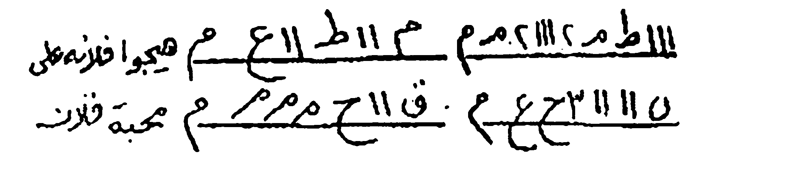
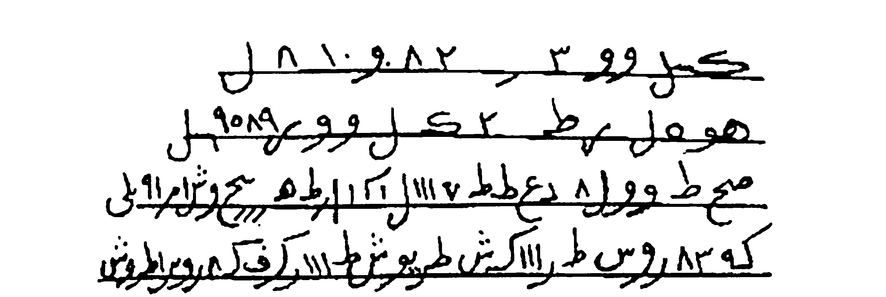
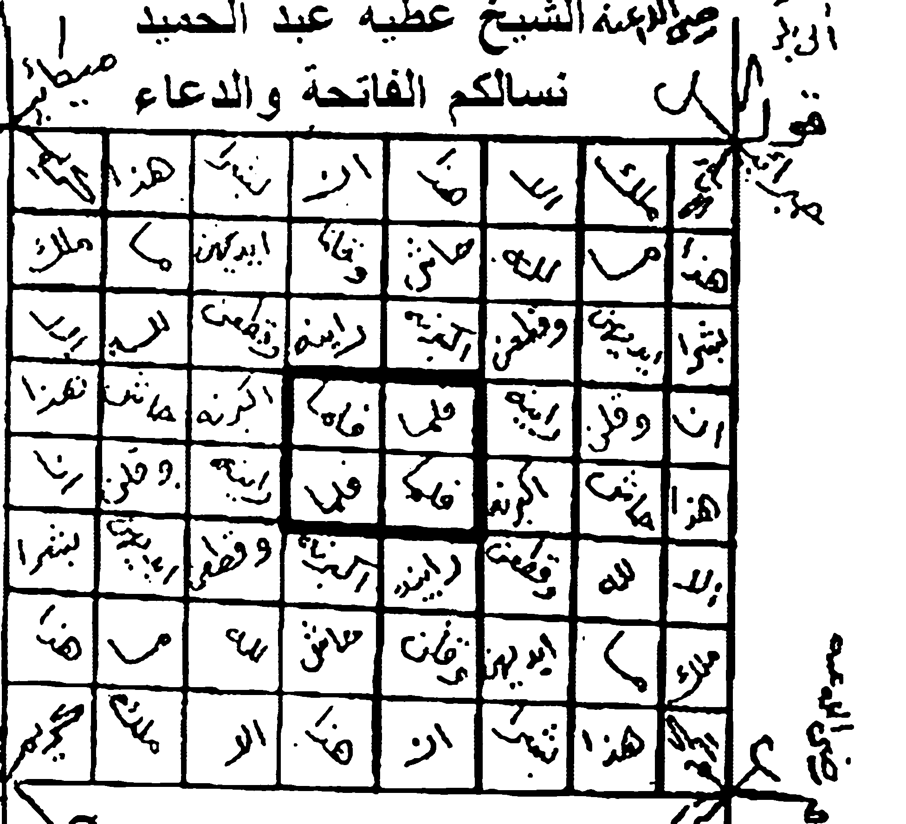
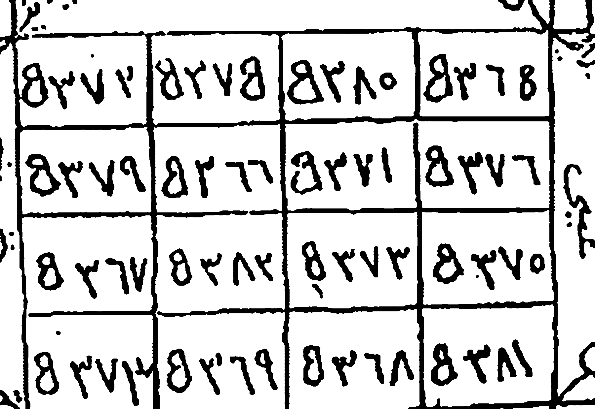

# Kitab *Asrār wa Khafāyāt fī 'Ilm al-Rūḥāniyyāt*
## Terjemahan Lengkap ke Bahasa Indonesia — Batch 2: Halaman Kitab 12–21
*(Berdasarkan foto pindaian `Picture 006.jpg` s.d. `Picture 010.jpg`)*

> **Keterangan umum terjemahan**
> - Format tiap paragraf: **Arab asli** (atas), **Latin** (tengah), **Terjemahan Indonesia** (bawah).
> - Istilah kunci hikmah yang tidak ada padanan Indonesianya dibiarkan dalam bahasa Arab dan diberi penjelasan dalam kurung.
> - Untuk beberapa kata yang cetakan/pindaian-nya samar, digunakan bacaan paling mungkin; tempat yang diragukan ditandai (?).
> - Tabel huruf-angka (wafaq/ṭilāsm) dan gambar rajah TIDAK ditranskripsikan menjadi teks — disajikan sebagai gambar asli hasil crop, sesuai aturan terjemahan.

---

## Halaman 12
*(Foto `Picture 006.jpg`, halaman kanan)*

| | |
|---|---|
| 📜 **Arab** | كتاب أسرار و خفايات في علم الروحانيات ....... شيع الروحانيين الشيخ عطية عبد الحميد |
| 🔤 **Latin** | Kitāb Asrār wa Khafāyāt fī 'Ilm al-Rūḥāniyyāt …… Shaykh al-Rūḥāniyyīn al-Shaykh 'Aṭiyya 'Abd al-Ḥamīd |
| 🇮🇩 **Indonesia** | Kitab *Asrār wa Khafiyāt* dalam Ilmu Ruhaniyat… Syekh ar-Rūḥānīyīn, Syekh 'Aṭiyya 'Abdul Ḥamīd *(kepala halaman)* |

| | |
|---|---|
| 📜 **Arab** | الصلاة العاشرة |
| 🔤 **Latin** | Aṣ-Ṣalāh al-'Āshira |
| 🇮🇩 **Indonesia** | RITUAL (INCANTASI) KESEPULUH |

| | |
|---|---|
| 📜 **Arab** | باب محبة وتهميج |
| 🔤 **Latin** | Bāb Maḥabbah wa Taḥwīj |
| 🇮🇩 **Indonesia** | Bab Maḥabbah (memikat kasih) dan Taḥwīj (pengikat/penawan) |

| | |
|---|---|
| 📜 **Arab** | تكتب ليلة الأحد بعد نوم الناس في كاغذ أبيض اسم الطالب وأمه والمطلوب وأمه مع هذه الأسماء وأنت تقول هيجوا فلانة وأزعجوها واحرقوا قلبها على محبة فلان ابن فلانة بحق اها شاه. أمها شراها. أدواني. اصاؤات ال شداي. |
| 🔤 **Latin** | Tuktubu laylat al-aḥadi ba'da nūmi an-nāsi fī kāghadhin Abyaḍ isma aṭ-Ṭālibi wa-ummihī wa-al-maṭlūbi wa-ummihū ma'a hādhih al-asmā', wa-anta taqūlu: Hayyijū fulānata wa-za'ijūhā wa-ḥarqū qalbuhā 'alā maḥabbati falāni ibni fulānā, bi-ḥaqqi Ahā Shāh, ummuhā Sharāhā(?), Adunāyā(?), Iṣbāwāt al-Shadāy(?). |
| 🇮🇩 **Indonesia** | Tulislah pada malam hari Ahad setelah manusia (sudah) tidur, pada selembar kertas putih, nama orang yang meminta (aṭ-Ṭālib) dan ibunya, serta nama orang yang dikehendaki (al-Maṭlūb) dan ibunya, bersama nama-nama ini, dan kamu ucapkan: "Gegerkanlah ia (Si Fulanah) dan guncanglah ia, dan bakarkanlah hatinya dengan cinta kepada Si Fulan bin Si Fulanah, dengan hak *Ahā Shāh*, ibunya *Sharāhā* (?), *Adunāyā* (?), *Iṣbāwāt al-Shadāy* (?)" [rangkaian nama-nama ruhani khusus — bentuknya serupa rangkaian "Ahayyā, Sharāḥihā, Adunāyā, Iṣbāwūt al-Shadāy" pada halaman 10]. |

| | |
|---|---|
| 📜 **Arab** | وهذا ما تكتب |
| 🔤 **Latin** | Wa hādhā mā taktub |
| 🇮🇩 **Indonesia** | Dan inilah yang kamu tulis: |

> 📸 **Gambar Rajah Asli Halaman 12**
>
> *(Deretan wafaq/ṭilasm huruf-angka 2 baris, ditulis tangan dengan huruf besar. Disajikan apa adanya, tidak ditranskripsikan.)*
>
> 
>
> **Cara baca (sesuai keterangan kitab):** Kitab tidak memberi penjelasan rinci — baris wafaq di atas disalin persis sebagaimana terlihat (huruf, angka, dan tandanya) ke atas kertas putih bersama nama orang yang meminta, ibunya, orang yang dikehendaki, dan ibunya, lalu diamalkan sesuai amalan Ritual Kesepuluh di atas.

| | |
|---|---|
| 📜 **Arab** | بالذي أنزل الكتاب على سيد الأحباب - والبخور مقل أزرق وسبعة سائلة وأنت في خلوة لوحدهك وتعلقها في الريح يواصل المطلوب بإذن الله. |
| 🔤 **Latin** | Bi-Man anzala al-Kitāb 'alā Sayyidi l-aḥbāb — wa al-bakhūr muqall azraq wa sab'atun sā'ilatun(?), wa-anta fī khalwatin lawḥadak wa tu'alliquhā fī ar-rīḥ yawāṣil al-maṭlūb bi-idznillāh. |
| 🇮🇩 **Indonesia** | (Ditulis/diamalkan) dengan nama (Demi) Dzat yang menurunkan Al-Kitāb (Al-Qur'an) kepada Sayyid al-Aḥbāb (pemimpin para kekasih [Allah]). Bakurnya (kemenyannya): *muqall azraq* [kemenyan biru] dan *sab'atun sā'ilatun* (?) [jenis kemenyan/godokan — bacaan samar]. Dan kamu (berada) dalam khalwat (penyepian) sendirian, lalu gantungkan (kertas amalan itu) di angin — (ia) akan menghubungkan (mengantarkan) orang yang dikehendaki dengan izin Allah. |

| | |
|---|---|
| 📜 **Arab** | الصلاة الحادية عشرة |
| 🔤 **Latin** | Aṣ-Ṣalāh al-Ḥādī 'Ashara |
| 🇮🇩 **Indonesia** | RITUAL (INCANTASI) KESEBELAS |

| | |
|---|---|
| 📜 **Arab** | باب محبة |
| 🔤 **Latin** | Bāb Maḥabbah |
| 🇮🇩 **Indonesia** | Bab Maḥabbah (memikat kasih) |

| | |
|---|---|
| 📜 **Arab** | يكتب على شفعة نية وترميمها في النار وأنت تعزم عليها عدد ٢٠ مرة |
| 🔤 **Latin** | Yuktub 'alā shuf'atin niyyatan wa tarmīmuhā(?) fī an-nār, wa-anta ta'zamu 'alayhā 'adad 20 marrah. |
| 🇮🇩 **Indonesia** | Tulislah (amalan ini) pada selembar *shuf'ah* (kertas amalan) dengan niat, dan *tarmīmuhā* (?) [membakarnya/menyempurnakannya — bacaan samar] di atas api, dan kamu ikat niatmu (*ta'zam*) di atasnya 20 kali. |

| | |
|---|---|
| 📜 **Arab** | ١٢ |
| 🔤 **Latin** | (nomor halaman) 12 |
| 🇮🇩 **Indonesia** | (Nomor halaman kitab: 12) |

---

## Halaman 13
*(Foto `Picture 006.jpg`, halaman kiri)*

| | |
|---|---|
| 📜 **Arab** | كتاب أسرار و خفايات في علم الروحانيات ....... شيع الروحانيين الشيخ عطية عبد الحميد |
| 🔤 **Latin** | Kitāb Asrār wa Khafāyāt fī 'Ilm al-Rūḥāniyyāt …… Shaykh al-Rūḥāniyyīn al-Shaykh 'Aṭiyya 'Abd al-Ḥamīd |
| 🇮🇩 **Indonesia** | Kitab *Asrār wa Khafiyāt* dalam Ilmu Ruhaniyat… Syekh ar-Rūḥānīyīn, Syekh 'Aṭiyya 'Abdul Ḥamīd *(kepala halaman)* |

| | |
|---|---|
| 📜 **Arab** | وهذا ما تكتب على الشفعة |
| 🔤 **Latin** | Wa hādhā mā taktubu 'alā ash-shuf'ah |
| 🇮🇩 **Indonesia** | Dan inilah yang kamu tulis pada *shuf'ah* (kertas amalan): |

> 📸 **Gambar Rajah Asli Halaman 13**
>
> *(Satu baris wafaq/ṭilasm huruf-angka besar, dengan deretan angka di bagian kanannya. Disajikan apa adanya, tidak ditranskripsikan.)*
>
> 
>
> **Cara baca (sesuai keterangan kitab):** Kitab tidak memberi uraian tambahan — baris wafaq di atas disalin persis sebagaimana terlihat (huruf, angka, dan tandanya) ke atas shuf'ah, lalu dibakar di atas api sebagaimana instruksi Ritual Kesebelas, dengan *'azīmah* (sumpah) di bawah ini.

| | |
|---|---|
| 📜 **Arab** | وهذه العزيمه تقول شمشوشين. طفبيوش. فوريش. عميد. بهيا فلانة إلى محبة فلا بن بحق هذه الأسماء عليكم الوحا عدد٢ العجل عدد٢ الساعة عدد٢ والبخر لبان وجاوى وكسرة ناشفة. |
| 🔤 **Latin** | Wa hādhih al-'azīmah taqūlu: Shamūshīn(?), Ṭufbīsh(?), Fūrīsh(?), 'Amīd(?), Buhayyā fulānatan ilā maḥabbati falān — bi-ḥaqqi hādhih al-asmā' 'alaykum. Al-Waḥā 'adad 2, al-'Ajl 'adad 2, as-Sā'ah 'adad 2. Wa al-bakhūr lubān wa jāwī wa kasratan nāshifa. |
| 🇮🇩 **Indonesia** | Dan inilah *'azīmah*-nya (sumpah/incantasi pengikat), kamu ucapkan: "*Shamūshīn* (?), *Ṭufbīsh* (?), *Fūrīsh* (?), *'Amīd* (?), *Buhayyā* (?)" [lima nama ruhani khusus — hadirkan] Si Fulanah menuju cinta kepada Si Fulan, dengan hak nama-nama ini yang di atasmu (kalian). *Al-Waḥā* [nama khusus], dua kali; *Al-'Ajl* (saat maut), dua kali; *As-Sā'ah* (saat yang ditakdirkan), dua kali. Bakurnya (kemenyannya): *lubān* (kemenyan), *jāwī* (kemenyan kayu jawa), dan sekeping roti kering (*kasratun nāshifa*). |

| | |
|---|---|
| 📜 **Arab** | الصلاة الثانية عشرة |
| 🔤 **Latin** | Aṣ-Ṣalāh aṯ-Ṡāniyya 'Ashara |
| 🇮🇩 **Indonesia** | RITUAL (INCANTASI) KE DUA BELAS |

| | |
|---|---|
| 📜 **Arab** | للمحبة والتهييج المحببح |
| 🔤 **Latin** | Li-Maḥabbah wa al-Taḥwīj al-Muḥbibbich |
| 🇮🇩 **Indonesia** | (Bab) untuk Maḥabbah (memikat kasih) dan Taḥwīj (penawan) yang membangkitkan kecintaan |

| | |
|---|---|
| 📜 **Arab** | قال الشيخ الإمام الفقيه عبد الله أحمد السوسوي صار لي أربعين عاماً وأنا في طلبها فوجدتها في بلاد غرناطة عند ملك من الملوك فأعطيتني فيها ماية دينار ونقلتها في قراطس قال الشيخ - خذ شعناً من شعرة الرأس وشعناً من شعر الباط وشعناً من شعر الوسط وأظافر اليدين والرجلين وحرزهم وادكك واجعل منهم مداداً واكتب به هذه الطلاسم واستقيمهم لعن شنت ولابد أن تبخر بالفلفل الأسود وتقول عند بخورك. |
| 🔤 **Latin** | Qāla ash-Shaykh al-Imām al-Faqīh 'Abd Allāh Aḥmad as-Sawsawī: Ṣāra lī arb'īna 'aaman wa-anā fī ṭalbihā, fa-wajadtuhā fī bilādi Garrāṭah 'inda malakin min al-mulūk, fa-āṭaytunī fīhā mā'iyya dīnār, wa-naqaltuhā fī qirāṭis. Qāla ash-Shaykh: Khudh sh'anā(?) min sya'arat ar-rāsi wa sh'anā(?) min sya'ari l-bāṭ wa sh'anā(?) min sya'ari l-wasṭ, wa-aḍfāri l-yadayn wa-r-rijlayn wa-ḥarzihim(?), wa-idakkik wa-aj'al minhum middādan, wa-iktub bihī hādhihi aṭ-ṭilāsim wa-staqīmhim(?) la-'un(?) shant(?) — wa-lā bad an tabkhura bi-l-filfili l-aswad wa-taqūl 'inda bakhūrika. |
| 🇮🇩 **Indonesia** | Berkata Syekh al-Imām al-Faqīh 'Abd Allāh Aḥmad as-Sawsawī: "Telah empat puluh tahun aku (menempuh) waktu itu dan aku dalam pencariannya, sampai aku menemukannya di negeri Granada (di Spanyol) di sisi salah seorang dari para raja; maka ia memberikannya kepadaku dengan harga seratus (*mā'iyya*) dinar, dan aku memindahkannya (membawanya) dalam kotak-kotak kulit (*qirāṭis* [?]). Syekh berkata: 'Ambillah *sy'an* (?) [sekitar seikat/sejumlah — bacaan samar] dari rambut kepala, *sy'an* dari rambut kemaluan (al-bāṭ), *sy'an* dari rambut pusar (bagian tengah), serta kuku-kuku tangan dan kaki, lalu ikatlah (*ḥarz*) mereka dan tumbuklah (haluskan) dan jadikanlah mereka menjadi tinta (midad). Dan tulislah dengan (tinta itu) *ṭilāsim* (formula-formula rahasia) ini, dan *wa-staqīmhim la-'un shant* (?) [bacaan samar — "pergunakanlah mereka..."]. Dan pastilah kamu membakar kemenyan dengan merica (lada) hitam, dan ucapkanlah pada saat kamu membakarnya (penciuman) berikut:" |

| | |
|---|---|
| 📜 **Arab** | أخذت قليك يا فلان يا ابن فلان يا ابن فلانة بمحبة فلانة بنت فلانة حتى لا تأكل ولا تشرب ولا تنجل ولا تنام حتى ترى وجه فلانة بنت فلانة. |
| 🔤 **Latin** | Akhadhtu qalbika(?) yā falān, yā ibna falān, yā ibna fulānā, bi-maḥabbati fulānata binti fulānā, ḥattā lā ta'kulu wa-lā tasyrab wa-lā tanjil(?) wa-lā tanāmu, ḥattā tarā wajha fulānata binti fulānā. |
| 🇮🇩 **Indonesia** | "Aku telah mengambil hatimu (qalbika), wahai Si Fulan, wahai anak Si Fulan, wahai anak Si Fulanah — dengan cinta kepada Si Fulanah binti Si Fulanah — sehingga kamu tidak makan, tidak minum, tidak *tanjil* (?) [tidak tenang/tidak duduk — bacaan samar], dan tidak tidur, hingga engkau melihat wajah Si Fulanah binti Si Fulanah." |

| | |
|---|---|
| 📜 **Arab** | ١٣ |
| 🔤 **Latin** | (nomor halaman) 13 |
| 🇮🇩 **Indonesia** | (Nomor halaman kitab: 13) |

---

## Halaman 14
*(Foto `Picture 007.jpg`, halaman kanan)*

| | |
|---|---|
| 📜 **Arab** | كتاب أسرار و خفايات في علم الروحانيات ....... شيع الروحانيين الشيخ عطية عبد الحميد |
| 🔤 **Latin** | Kitāb Asrār wa Khafāyāt fī 'Ilm al-Rūḥāniyyāt …… Shaykh al-Rūḥāniyyīn al-Shaykh 'Aṭiyya 'Abd al-Ḥamīd |
| 🇮🇩 **Indonesia** | Kitab *Asrār wa Khafiyāt* dalam Ilmu Ruhaniyat… Syekh ar-Rūḥānīyīn, Syekh 'Aṭiyya 'Abdul Ḥamīd *(kepala halaman)* |

| | |
|---|---|
| 📜 **Arab** | وهذه الطلاسم |
| 🔤 **Latin** | Wa hādhihi aṭ-Ṭilāsim |
| 🇮🇩 **Indonesia** | Dan inilah *ṭilāsim*-nya (formula-formula rahasianya): |

> 📸 **Gambar Rajah Asli Halaman 14**
>
> *(Empat baris wafaq/ṭilasm huruf-angka besar, ditulis tangan. Disajikan apa adanya, tidak ditranskripsikan.)*
>
> 
>
> **Cara baca (sesuai keterangan kitab):** Empat baris *ṭilasm* ini disalin persis sebagaimana terlihat (huruf, angka, dan tandanya) — tidak boleh diubah satu tanda pun — kemudian ditulis dengan tinta khusus sesuai amalan Ritual Ke Dua Belas di atas (rambut kepala, rambut kemaluan, rambut pusar, dan kuku-kuku yang ditumbuk menjadi tinta). Setelah ditulis, diamalkan dengan *'azīmah*: "Ṭayyūsh, Ṭayshū, 'Aqiliyā, wa-aṭqafū qalbuhā..." (lihat di bawah).

| | |
|---|---|
| 📜 **Arab** | طيوش طيشوا عقليا واطقفوا قلبها بمحبة فلان ابن فلانة |
| 🔤 **Latin** | Ṭayyūsh(?), Ṭayshū(?), 'Aqiliyā(?), wa-aṭqafū qalbuhā bi-maḥabbati falāni ibni fulānā. |
| 🇮🇩 **Indonesia** | "*Ṭayyūsh* (?), *Ṭayshū* (?), *'Aqiliyā* (?)" [tiga nama ruhani khusus — dikecam agar hadir], "dan kuncilah/pangkuilah (*aṭqafū*) hatinya dengan cinta kepada Si Fulan bin Si Fulanah." |

| | |
|---|---|
| 📜 **Arab** | الصلاة الثانية عشرة في دعوة قلا رايت اكترينه |
| 🔤 **Latin** | Aṣ-Ṣalāh aṯ-Ṡāniyya 'Ashara fī Du'ā' Qalā Rā'aytu Aktrīnah(?) |
| 🇮🇩 **Indonesia** | RITUAL (INCANTASI) KE DUA BELAS, dalam doa *"Qalā Rā'aytu Aktrīnah"* (?) [nama doa khusus] |

> **Catatan penerjemah:** Kitab mencantumkan nomor "aṯ-Ṡāniyya 'Ashara" (ke-12) dua kali di halaman 13 dan 14 — kemungkinan ada salah cetak pada nomor ritual (seharusnya yang kedua ini ke-13), atau memang kitab ini sengaja memberi dua bab bernomor sama. Kami terjemahkan apa adanya sesuai cetakan.

| | |
|---|---|
| 📜 **Arab** | وهي تصح لكل شيء - فإن أردتها لقبول واجمعها في حرز واجعلها على عضدك الأيمن ويكون عند الزوال - وإن أردتها للتيميل فاكتبها في حرزين أحدهما له والمطلوب والأخر تجملة المرأة في حزامها وإن كان للرجل فيحمله على عضده الأيمن وإن أردتها للخظة فاكتبها مع الدعوة بين عينيك يسهل الله لك ما تريد وإن أردتها للمحببة فاكتبها يوم الخميس أو يوم الجمعة قبل طلوع الشمس وعلقها للريح بشر رأس من تريده أو بخيط أحمر وبالله الذي لا إله إلا هو جمعه مرات ما خاكت أبداً وستنجاب في الوقت والحين والكاذب عليه لعنة الله وهذه أمانة الله لا تنعلمها إلا في الحال. |
| 🔤 **Latin** | Wa-hīya ṣaḥḥat li-kulli syay'in — fa-in aradtahā li-qabūlin wa-ajma'uhā fī ḥarazin wa-aj'alhā 'alā 'aḍuddika l-ayyam wa-yakūnu 'inda az-zawl; wa-in aradtahā li-l-tamīl fa-iktubhā fī ḥarazayn, aḥaduhūma lahū wa-al-maṭlūb, wa-al-ukhrā tujmaluhā(?) al-mar'ah fī ḥizāmihā, wa-in kāna li-r-rajuli fa-yaḥmiluhū 'alā 'aḍdihī l-ayyam; wa-in aradtahā li-l-khaṭba(?) fa-iktubhā ma'a ad-du'ā' bayna 'aynik, yusahhullāhu lak mā tardī; wa-in aradtahā li-l-maḥabbah fa-iktubhā yawm al-khamīs aw yawm al-jum'ah qabla ṭulū'i sy-syams, wa-tu'alliqhā li-r-rīḥ bi-syarr(?) ra'si man tardīhu aw bi-khaṭṭin aḥmar, wa-bi-Allāhi alladhī lā ilāha illā huwa — jama'ah(?) marrāt, mā khākit(?) abdā wa-satunjāb(?) fī al-waqt wa-l-ḥīn. Wa-l-kādhibu 'alayhi la'natullāh, wa-hādhihi amānatullāhi lā tan'amillāhā(?) illā fī al-ḥāl. |
| 🇮🇩 **Indonesia** | Dan ia (doa *Qalā Rā'aytu Aktrīnah* ini) berlaku untuk segala hal. Maka: jika kamu menginginkannya untuk **diterima (qabūl)** — kumpulkanlah ia dalam satu gantungan/leher (*ḥaraz*) dan pasanglah ia di lengan kananmu, dan itu dilakukan pada waktu *az-Zawl* (waktu dhuha menjelang siang). Dan jika kamu menginginkannya untuk **kecenderungan/memiringkan hati (tamīl)** — tulislah ia dalam dua gantungan: satu untuk dia (yang meminta) dan orang yang dikehendaki, dan yang lain dipasang oleh wanita itu pada pinggangnya; dan jika untuk laki-laki, maka ia memakainya di lengan kanannya. Dan jika kamu menginginkannya untuk **xhaṭba (?)** [permohonan/perencanaan — bacaan samar] — tulislah ia bersama doanya di antara kedua matamu, niscaya Allah memudahkan bagimu apa yang kamu inginkan. Dan jika kamu menginginkannya untuk **memikat kasih (maḥabbah)** — tulislah ia pada hari Kamis atau hari Jumat sebelum matahari terbit, dan gantungkanlah ia di angin — dengan *syarr* (?) [rambut — bacaan samar] kepala orang yang kamu kehendaki, atau dengan benang merah — dan dengan Allah yang tiada tuhan selain Dia. *Jama'ah* (?) kali — *mā khākit abdā wa-satunjāb* (?) [tidak akan pernah terputus dan akan terbuka (?) — bacaan samar] pada saat dan harinya. Dan siapa yang berdusta tentangnya, ia kena laknat Allah; dan ini adalah amanat Allah — janganlah kamu mengumumkannya (*tan'amillāhā*) kecuali pada saat (keperluan) itu. |

| | |
|---|---|
| 📜 **Arab** | ١٤ |
| 🔤 **Latin** | (nomor halaman) 14 |
| 🇮🇩 **Indonesia** | (Nomor halaman kitab: 14) |

---

## Halaman 15
*(Foto `Picture 007.jpg`, halaman kiri)*

| | |
|---|---|
| 📜 **Arab** | كتاب أسرار و خفايات في علم الروحانيات ....... شيع الروحانيين الشيخ عطية عبد الحميد |
| 🔤 **Latin** | Kitāb Asrār wa Khafāyāt fī 'Ilm al-Rūḥāniyyāt …… Shaykh al-Rūḥāniyyīn al-Shaykh 'Aṭiyya 'Abd al-Ḥamīd |
| 🇮🇩 **Indonesia** | Kitab *Asrār wa Khafiyāt* dalam Ilmu Ruhaniyat… Syekh ar-Rūḥānīyīn, Syekh 'Aṭiyya 'Abdul Ḥamīd *(kepala halaman)* |

| | |
|---|---|
| 📜 **Arab** | وهذا ما تكتب مع الخاتم |
| 🔤 **Latin** | Wa hādhā mā taktubu ma'a al-Ḫātim |
| 🇮🇩 **Indonesia** | Dan inilah yang kamu tulis bersama *al-Ḫātim* (materai/surat pengikat): |

| | |
|---|---|
| 📜 **Arab** | بسم الله الرحمن الرحيم الحمد لله الذي جعل الظلمات والنور. اللهم نور قلب فلان وقلبة بمحبة لو أفقنت ما في الأرض جميعا إلى قوله حكيم. اللهم ألف بين فلان وفلانة ألفت سنين في أهل مدين ثم جئت على قدر يا موسى. كذلك يجعل الله محبة فلان في قلب فلانة. شهد الله الله لا إله إلا هو والملككة إلى حكيم. عسى الله أن يجعل بينكم وبين الذين عاديتم منهم مودة والله قدير. والله غفور رحيم. اللهم أطف قلب فلان في قلب فلانة. اللهم ألف بينهم كما ألفت بين سيدنا محمد ﷺ وعائشة وكما ألفت بين علي وفاطمة وكما ألفت بين يوسف وزليخا. يا الله يا الله يا رحمن يارحمن يارحمن يا رحيم يا رحيم يا رحيم يا يهودود يا يهودود يا يهودود. يارووف يارووف يارووف يارووف يارووف يارووف يارووف يارووف يارووف يا عطفوف يا عطفوف يا عطفوف يا عطفوف يا عطفوف يا عطفوف ياعطفوف ياعطفوف ياعطفوف ياعطفوف ياعطفوف ياعطفوف ياعطفوف. عطف قلب فلان إلى محبة فلانة بحق هذه الأسماء عليكم بالله بحق اسمك الظاهر ياذا الجلال والإكرام عدد ٣. ألم نشرح لك صدرك إلى آخرها. اللهم رغب فلانة في قلب فلان وبن عليك توكلا إليك أيابا واليك العسير. اللهم بارك بحق أسمائك الظاهرة وملاكلك وأنبيائك أن تجعل محبة فلانة في قلب فلان بالريح العاصف وبالبرق الخاطف. إنه من سليمان وإنه بسم الله الرحمن. |
| 🔤 **Latin** | Bismillāhi r-Raḥmāni r-Raḥīm. Al-ḥamdu lillāhi alladhī ja'ala aẓ-ẓulumāti wa-n-nūr. Allāhumma nūr qalbi falān wa-qalbuhā bi-maḥabbah — law afaqanna(?) mā fī al-arḍi jamī'a ilā qawlihi Ḥakīm. Allāhumma alaff bayna falān wa fulānata — alaffa sinnīn fī ahlī Madyan, thumma ja'ta 'alā qadar yā Mūsā. Kadhālika ya'jamullāhu maḥabbata falān fī qalbi fulānā. Syahid Allāh, Allāhu lā ilāha illā huwa wa-al-mulūkku(?) ilā Ḥakīm. 'Asā Allāhu an ya'jamala baynakum wa bayna alladhīna 'ādaytum minhum mawaddah, wa-Allāhu Qadīr. Wa-Allāhu Ghafūr Raḥīm. Allāhumma aṭfah(?) qalbi falān fī qalbi fulānā. Allāhumma alaff baynahum kamā alaffata bayna Sayyidinā Muḥammadin ﷺ wa-'A'ishah, wa-kamā alaffata bayna 'Alī wa-Fāṭimah, wa-kamā alaffata bayna Yūsuf wa-Zulaikhā. Yā Allāh yā Allāh yā Raḥmān. Yā Raḥmān yā Raḥmān yā Raḥīm yā Raḥīm yā Raḥīm. Yā Yahūdūd yā Yahūdūd yā Yahūdūd. Yā Rūwaf yā Rūwaf yā Rūwaf yā Rūwaf yā Rūwaf yā Rūwaf yā Rūwaf yā Rūwaf yā Rūwaf. Yā 'Aṭūf yā 'Aṭūf yā 'Aṭūf yā 'Aṭūf yā 'Aṭūf yā 'Aṭūf yā 'Aṭūf yā 'Aṭūf yā 'Aṭūf yā 'Aṭūf yā 'Aṭūf yā 'Aṭūf. 'Aṭif qalbi falān ilā maḥabbati fulānā bi-ḥaqqi hādhih al-asmā' 'alaykum, bi-llāh, bi-ḥaqqi ismika l-ẓāhir yā dza l-jalāli wa-l-ikrām, 'adad 3. 'Alam nashraḥ lak ṣadrika ilā ākhirihā. Allāhumma raghib fulānatan fī qalbi falān, wa-binna(?) 'alayka tawakkulā, ilayka ayāban, wa-ilayka al-'asīr. Allāhumma bārik bi-ḥaqqi asmā'ika l-ẓāhirah wa-malā'ikika wa-anbiyā'ika an taj'ala maḥabbata fulānāti fī qalbi falān bi-r-rīḥi l-'āṣif wa-bi-l-barqi l-ḫāṭif. Innhū min Sulaymān wa-innhū bismillāhi r-Raḥmān. |
| 🇮🇩 **Indonesia** | "Dengan nama Allah Yang Maha Pengasih lagi Maha Penyayang. Segala puji bagi Allah yang menjadikan kegelapan-kegelapan dan cahaya. Ya Allah, cahayakanlah hati Si Fulan dan hatinya (perempuan yang dikehendaki) dengan (tanam) kecintaan — *law afaqanna mā fī al-arḍi jamī'a ilā qawlihi Ḥakīm* (?) [kalau aku menghamburkan seisi bumi, sampai (menyebut) firman-Nya Yang Mahabijaksana — bacaan samar]. Ya Allah, padukanlah (*alaff*) antara Si Fulan dan Si Fulanah — sebagaimana Engkau memadukan (mereka) selama bertahun-tahun di (kalangan) penduduk Madyan, kemudian Engkau datang (memerintahkan) dengan kadar (yang pantas), wahai Mūsā. Demikianlah Allah menjadikan cinta Si Fulan di dalam hati Si Fulanah. Allah bersaksi: Allah, tiada tuhan selain Dia — dan *al-mulūkku* (?) sampai kepada Yang Mahabijaksana (*Ḥakīm*). Mudah-mudahan Allah menjadikan di antara kamu dan orang-orang yang kamu bermusuhan dengan mereka (sebuah) kasih sayang; dan Allah Mahakuasa. Dan Allah Maha Pengampun lagi Maha Penyayang. Ya Allah, nyalakanlah (*aṭfah*?) hati Si Fulan di dalam hati Si Fulanah. Ya Allah, padukanlah mereka sebagaimana Engkau memadukan antara junjungan kita Nabi Muhammad ﷺ dan 'A'isyah, sebagaimana Engkau memadukan antara 'Alī dan Fāṭimah, dan sebagaimana Engkau memadukan antara Yūsuf dan Zulaikha. Ya Allah, Ya Allah, Ya Raḥmān. Ya Raḥmān, Ya Raḥmān, Ya Raḥīm, Ya Raḥīm, Ya Raḥīm. Ya Yahūdūd (?), Ya Yahūdūd, Ya Yahūdūd. Ya Rūwaf (?), Ya Rūwaf, Ya Rūwaf, Ya Rūwaf, Ya Rūwaf, Ya Rūwaf, Ya Rūwaf, Ya Rūwaf, Ya Rūwaf. Ya 'Aṭūf (?), Ya 'Aṭūf, Ya 'Aṭūf, Ya 'Aṭūf, Ya 'Aṭūf, Ya 'Aṭūf, Ya 'Aṭūf, Ya 'Aṭūf, Ya 'Aṭūf, Ya 'Aṭūf, Ya 'Aṭūf, Ya 'Aṭūf. Condongkanlah (*'aṭif*) hati Si Fulan kepada kecintaan kepada Si Fulanah, dengan hak nama-nama ini yang di atasmu (kalian) — demi Allah, dengan hak nama-Mu yang zahir, wahai Dzat yang mempunyai keagungan dan kemuliaan — ( baca) 3 kali. 'Bukankah Kami telah lapangkan untukmu dadamu?' — (sampai akhir ayat, Q.S. Asy-Syamsiyah 94:1). Ya Allah, jadikanlah Si Fulanah diinginkan (dirindukan) di dalam hati Si Fulan. Dan kepada-Mulah (*wa-binna*) (?) kami bertawakal; kepada-Mulah kepulangan (*ayāb*); dan kepada-Mulah (kesulitan) yang berat (*al-'asīr*). Ya Allah, berilah keberkahan dengan hak nama-nama-Mu yang zahir, para malaikat-Mu, dan para nabi-Mu — agar Engkau menjadikan kecintaan kepada Si Fulanah di dalam hati Si Fulan — dengan angin yang kencang (al-rīḥ al-'āṣif) dan petir yang menyambar (al-barq al-ḫāṭif). Sesungguhnya ia (surat ini) dari Sulaymān, dan sesungguhnya ia (ditulis) dengan (ucapan) Bismillāhi r-Raḥmān (dengan nama Allah Yang Maha Pengasih)." |

| | |
|---|---|
| 📜 **Arab** | ١٥ |
| 🔤 **Latin** | (nomor halaman) 15 |
| 🇮🇩 **Indonesia** | (Nomor halaman kitab: 15) |

> **Catatan penerjemah:**
> - Deretan nama-nama dzikir (Yā Yahūdūd ×3, Yā Rūwaf ×9, Yā 'Aṭūf ×12) disalin persis sesuai hitungan pada cetakan.
> - Ayat "Alam nashraḥ lak ṣadrika" adalah Q.S. Asy-Syamsiyah (94):1; kitab ini menggunakannya sebagai bagian formula amalan.

---

## Halaman 16
*(Foto `Picture 008.jpg`, halaman kanan)*

| | |
|---|---|
| 📜 **Arab** | كتاب أسرار و خفايات في علم الروحانيات ....... شيع الروحانيين الشيخ عطية عبد الحميد |
| 🔤 **Latin** | Kitāb Asrār wa Khafāyāt fī 'Ilm al-Rūḥāniyyāt …… Shaykh al-Rūḥāniyyīn al-Shaykh 'Aṭiyya 'Abd al-Ḥamīd |
| 🇮🇩 **Indonesia** | Kitab *Asrār wa Khafiyāt* dalam Ilmu Ruhaniyat… Syekh ar-Rūḥānīyīn, Syekh 'Aṭiyya 'Abdul Ḥamīd *(kepala halaman)* |

| | |
|---|---|
| 📜 **Arab** | الرحيم ان لا تعملا عليه وأنوني مسلمين لباغو الله رب العالمين ليachim اجب يا دانيب الشمس اجب يامر بيقح دائرة القمر لياغو اجب يا احمر بحق دائرة المريض ليافور اجب يا برمان بحق دائرة الكاتب لياروع اجب باشمهورس بحق دائرة المشتري لياروث اجب يا بيض بحق دائرة الزهرة لياروش اجب يا ميمون بحق دائرة زحل لياشل توكالوا يا معشر السادات الاولين بحق هذا الخاتم بمحبة فلان في قلب فلانة |
| 🔤 **Latin** | …r-Raḥīm, an lā ta'malā 'alayhi wa-anannī(?) Muslimīn(?) — li-Bāghū(?), Allāhu Rabbil-'ālamīn. Liyrāḥ(?), 'ajib yā Dānīb asy-Syams, 'ajib yā Amīr bi-ḥaqqi dā'irati l-Qamar. Liyāghu(?), 'ajib yā Aḥmar bi-ḥaqqi dā'irati l-Marīḍ(?). Liyāfūr(?), 'ajib yā Burmān(?) bi-ḥaqqi dā'irati l-Kātib. Liyārū'(?), 'ajib bāsh-Mahūrās(?) bi-ḥaqqi dā'irati l-Musytarī. Liyārūth(?), 'ajib yā Bayaḍ bi-ḥaqqi dā'irati az-Zahrā. Liyārūš(?), 'ajib yā Maymūn bi-ḥaqqi dā'irati Zaḥal. Liyāšal(?), tawakkalū yā ma'asyara as-Sādāti l-Awwalīn bi-ḥaqqi hādhā al-Ḫātim — bi-maḥabbati falān fī qalbi fulānā. |
| 🇮🇩 **Indonesia** | *(Lanjutan 'azīmah dari halaman 15:)* "…Yang Maha Penyayang — agar kamu berdua tidak mengamalkannya (menyalahgunakannya) atasmu, dan aku adalah Muslimin (?) — *li-Bāghū* (?), (demi) Allah Tuhan semesta alam. *Liyrāh* (?) — jawablah, wahai *Dānīb asy-Syams* (bintang 'Deneb' matahari) — jawablah, wahai Amīr (Pembesar), dengan hak lingkaran (dā'irah) Bulan. *Liyāghu* (?) — jawablah, wahai Aḥmar (Yang Merah), dengan hak lingkaran *al-Marīḍ* (?) — *liyāfūr* (?) — jawablah, wahai *Burmān* (?), dengan hak lingkaran al-Kātib (Merkurius/Sang Penulis) — *liyārū'* (?) — jawablah, wahai *Shamhūrās* (?), dengan hak lingkaran al-Musytarī (Jupiter) — *liyārūth* (?) — jawablah, wahai Bayaḍ (Yang Putih), dengan hak lingkaran az-Zahrā (Venus) — *liyārūš* (?) — jawablah, wahai Maymūn (Yang Berkat), dengan hak lingkaran Zaḥal (Saturnus). *Liyāšal* (?) — berserahlah (*tawakkal*), wahai kaum para Sādis (Penguasa ruhani) yang awal, dengan hak *al-Ḫātim* (materai) ini — (yaitu) cinta kepada Si Fulan di dalam hati Si Fulanah." |

| | |
|---|---|
| 📜 **Arab** | وهذا الجدول شيخ الروحانيين |
| 🔤 **Latin** | Wa hādhā al-jadwāl. Shaykh al-Rūḥāniyyīn. |
| 🇮🇩 **Indonesia** | Dan inilah tabel (jadwāl)-nya — (dari) Syekh ar-Rūḥānīyīn: |

> 📸 **Gambar Rajah Asli Halaman 16**
>
> *(Tabel wafaq besar 8×8 berisi huruf, dengan baris judul di dalam kotak: "عظائمه الشيخ عطية عبد الحميد / نسائكم الفاتحة والدعاء". Disajikan apa adanya, tidak ditranskripsikan.)*
>
> 
>
> **Cara baca (sesuai keterangan kitab):** Kitab hanya menyebut "wa-hādhā al-jadwāl" (dan inilah tabelnya) — tabel wafaq huruf ini disalin persis sebagaimana terlihat (semua huruf dalam setiap kotak, termasuk baris judul di atasnya) ke atas kertas, lalu ditempelkan/ditulis bersama *al-Ḫātim* sesuai amalan.

| | |
|---|---|
| 📜 **Arab** | ١٦ |
| 🔤 **Latin** | (nomor halaman) 16 |
| 🇮🇩 **Indonesia** | (Nomor halaman kitab: 16) |

---

## Halaman 17
*(Foto `Picture 008.jpg`, halaman kiri)*

| | |
|---|---|
| 📜 **Arab** | كتاب أسرار و خفايات في علم الروحانيات ....... شيع الروحانيين الشيخ عطية عبد الحميد |
| 🔤 **Latin** | Kitāb Asrār wa Khafāyāt fī 'Ilm al-Rūḥāniyyāt …… Shaykh al-Rūḥāniyyīn al-Shaykh 'Aṭiyya 'Abd al-Ḥamīd |
| 🇮🇩 **Indonesia** | Kitab *Asrār wa Khafiyāt* dalam Ilmu Ruhaniyat… Syekh ar-Rūḥānīyīn, Syekh 'Aṭiyya 'Abdul Ḥamīd *(kepala halaman)* |

| | |
|---|---|
| 📜 **Arab** | الصلاة الرابعة عشرة |
| 🔤 **Latin** | Aṣ-Ṣalāh ar-Rābi'u 'Ashara |
| 🇮🇩 **Indonesia** | RITUAL (INCANTASI) KE EMPAT BELAS |

| | |
|---|---|
| 📜 **Arab** | مسألة للمحبية |
| 🔤 **Latin** | Masā'ilat li-l-Maḥabbah |
| 🇮🇩 **Indonesia** | (Bagian) soal/perihal maḥabbah (memikat kasih) |

| | |
|---|---|
| 📜 **Arab** | مجربة على يد كاتبها وهي لدعوة الفاتحة في مريع وتبخر برائحة طبية وتكتب في يوم ساعة المريض وتحمل في أي يوم كان سعيد |
| 🔤 **Latin** | Mujarrabatun 'alā yadi kātibihā, wa-hīya li-du'ā'i l-Fātiḥah fī murī'(?), wa-tubkharu bi-ra'iḥati ṭibbīyah(?), wa-tuktubu fī yawmi sā'ati l-marīḍ(?), wa-tuḥmalu fī ayy yawmin kāna sa'īd. |
| 🇮🇩 **Indonesia** | (Formula) ini sudah teruji di tangan penulisnya; dan ia adalah untuk *du'ā' al-Fātiḥah* (doa al-Fātiḥah) dalam *murī'* (?) [wadah/mereeh — bacaan samar], dan dibakarnya dengan wangi obat-obatan (*ra'iḥatun ṭibbīyyah* ?), dan ditulis pada hari jam orang sakit (?) [waktu khusus — bacaan samar], dan (kertasnya) dibawa pada hari apa pun yang *sa'īd* (beruntung/baik). |

| | |
|---|---|
| 📜 **Arab** | وهذا ما تكتب ويه تعزم |
| 🔤 **Latin** | Wa hādhā mā taktubu wa-bihī ta'zimu. |
| 🇮🇩 **Indonesia** | Dan inilah yang kamu tulis, dan dengan(nya) kamu membuat *'azīmah* (sumpah pengikat): |

| | |
|---|---|
| 📜 **Arab** | تقول بسم الله الرحمن الرحيم الحمد لله رب العالمين ياحي ياقيوم اجب ياروقائل أنت وأعوانك العلوية واجلب فلان إلى فلانة بحق الحمد لله رب العالمين الحي القيوم وحق سيدنا محمد ﷺ وبحرمة الملائكة الموكلين بقوام العرش اجب يا مذهب أنت وخدامك الأرضية واجلبوا واهيجوا واجلبوا فلان إلى فلانة بحق الملك الغالب عليك أمه سيد روقيبائيل الرحمن الرحيم الرؤف العطف اجب يا جبرايل أنت وأعوانك العلوية واجلب واهيج قلب فلان بمحبة فلانة بحق الرحمن الرحيم الرؤف العطف وحق سيدنا ﷺ وحق الملك الموكل بالقواتم العرشية هوج يا بيض اجب يا وضيع أنت وخدامك الأرضية اجب واجلب وامهيج واهرج قلب فلان بمحبة فلانة بحق الملك الغالب عليك أمرك جبرائيل ملك يوم الدين يا مقبض القلوب والأصارع اجب ياسمسمائيل أنت وأعوانك العلوية اجب واجلب واهرج واحرق |
| 🔤 **Latin** | Taqūlu: Bismillāhi r-Raḥmāni r-Raḥīm, al-ḥamdu lillāhi Rabbil-'ālamīn. Yā Ḥayy, yā Qayyūm, 'ajib yā Rāfā'īl(?) — anta wa-'awānuka al-'ulyā, wa-ajlib falān ilā fulānā bi-ḥaqq "Al-ḥamdu lillāhi Rabbil-'ālamīni l-Ḥayyi l-Qayyūm" wa-ḥaqqi Sayyidinā Muḥammadin ﷺ wa-bi-ḥurmati l-malā'ikati l-muwakkalīna bi-quwāmi l-'Arsh. 'Ajjib yā Madhahib(?) — anta wa-ḫidāmak al-arḍiyyah, wa-ajlibū wa-hayyijū wa-ajlibū falān ilā fulānā bi-ḥaqqi l-maliki l-ghālib 'alayka, ummihī(?), sayyid Rūqibā'īl(?), ar-Raḥmān ar-Raḥīm ar-Ra'ūf al-'Aṭūf. 'Ajjib yā Jibrā'īl — anta wa-'awānuka al-'ulyā, wa-ajlib wa-hayyij qalbi falān bi-maḥabbati fulānā bi-ḥaqqi r-Raḥmāni r-Raḥīmi r-Ra'ūfi l-'Aṭūf, wa-ḥaqqi Sayyidinā ﷺ, wa-ḥaqqi l-malaki l-muwakkali bi-l-quwātim(?) al-'arshiyyah. Hūj yā Bayaḍ! 'Ajjib yā Wadī'(?), anta wa-ḫidāmak al-arḍiyyah, 'ajib wa-ajlib wa-mahayyij wa-harij qalbi falān bi-maḥabbati fulānā bi-ḥaqqi l-maliki l-ghālib 'alayka — amruka Jibrā'īlu maliku yawmi d-dīn, yā Muqbiḍ al-qulūbi wa-l-aṣāri'(?), 'ajib yā Samasmā'īl(?) — anta wa-'awānuka al-'ulyā, 'ajib wa-ajlib wa-harij wa-ḥarriq. |
| 🇮🇩 **Indonesia** | Kamu ucapkan: "Dengan nama Allah Yang Maha Pengasih lagi Maha Penyayang; segala puji bagi Allah Tuhan semesta alam. Ya Ḥayy (Yang Mahahidup), ya Qayyūm (Yang Mahaberkelangsungan) — jawablah, wahai *Rāfā'īl* (?) (malaikat Rāfā'īl), engkau dan para pembantu-mu yang atas (surgawi) — dan datangkanlah Si Fulan kepada Si Fulanah, dengan hak (firman) 'Segala puji bagi Allah Tuhan semesta alam, Yang Mahahidup lagi Mahaberkelangsungan' dan dengan hak junjungan kita Nabi Muhammad ﷺ, dan dengan kemuliaan malaikat-malaikat yang diamanatkan (mengurus) tiang-tiang 'Arsy (Takhta). Jawablah, wahai *Madhahib* (?), engkau dan pelayan-pelayanmu yang bawah (bumi) — datangkanlah dan gegerkanlah, dan datangkanlah Si Fulan kepada Si Fulanah, dengan hak Raja yang Menangisi di atasmu, ibunya (?), Sayyid *Rūqibā'īl* (?) — Yang Maha Pengasih lagi Maha Penyayang, Yang Maha Lembut lagi Maha Menyayangi. Jawablah, wahai *Jibrā'īl* (Jibrīl), engkau dan para pembantu-mu yang atas — dan datangkanlah, dan gegerkanlah hati Si Fulan dengan cinta kepada Si Fulanah, dengan hak ar-Raḥmān ar-Raḥīm ar-Ra'ūf al-'Aṭūf, dan dengan hak junjungan kita ﷺ, dan dengan hak malaikat yang diamanatkan dengan *al-quwātim* (?) 'Arsy (para pembantu Tahta). Gegerkan (hūj), wahai Bayaḍ (Yang Putih)! Jawablah, wahai *Wadī'* (?), engkau dan pelayan-pelayanmu yang bawah — jawablah, dan datangkanlah, dan gegerkanlah, dan cabutlah hati Si Fulan dengan cinta kepada Si Fulanah, dengan hak Raja yang Menangisi di atasmu — perintah-mu, Jibrā'īl, Raja Hari Pembalasan — wahai Penguasik hati-hati dan *al-aṣāri'* (?) — jawablah, wahai *Samasmā'īl* (?), engkau dan para pembantu-mu yang atas — jawablah, datangkanlah, dan guncanglah, dan bakarkanlah…" |

| | |
|---|---|
| 📜 **Arab** | ١٧ |
| 🔤 **Latin** | (nomor halaman) 17 |
| 🇮🇩 **Indonesia** | (Nomor halaman kitab: 17) |

---

## Halaman 18
*(Foto `Picture 009.jpg`, halaman kanan)*

| | |
|---|---|
| 📜 **Arab** | كتاب أسرار و خفايات في علم الروحانيات ....... شيع الروحانيين الشيخ عطية عبد الحميد |
| 🔤 **Latin** | Kitāb Asrār wa Khafāyāt fī 'Ilm al-Rūḥāniyyāt …… Shaykh al-Rūḥāniyyīn al-Shaykh 'Aṭiyya 'Abd al-Ḥamīd |
| 🇮🇩 **Indonesia** | Kitab *Asrār wa Khafiyāt* dalam Ilmu Ruhaniyat… Syekh ar-Rūḥānīyīn, Syekh 'Aṭiyya 'Abdul Ḥamīd *(kepala halaman)* |

| | |
|---|---|
| 📜 **Arab** | والأصارع اجب العresh اجب يا احمر أنت وخدامك الأرضية اجب واجلب وهيج واهرج قلب فلان بمحبة فلانة بحق الملك الغالب عليك أمه والآخر بناصيتك سمسمائيل إليك ونبعك نستمعن السريع القريب وحق سيدنا محمد ﷺ وبحرمة الملك الموكل بقائم العresh منسع اجب يا برقان أنت وخدامك الأرضية اجلب واهيج واحرق قلب فلان بمحبة فلانة بحق الملك الغالب عليك أمره والآخذ بناصيتك سمسمائيل اهدنا الصراط المستقيم ياقتدر اجب باصرفائيل أنت وأعوانك العلوية اجب واجلب واهيج واحرق قلب فلان بمحبة فلانة بحق اهدنا الصراط المستقيم وحق القادر المقدتر وحق سيدنا محمد ﷺ وبحرمة الملك الموكل بقائم العresh نقصر اجب ياشمهوروش أنت وخدامك الأرضية اجب واجلب واهيج واحرق قلب فلان بمحبة فلانة بحق الملك الغالب عليك أمه والآخذ بناصيتك صرFAILaيل صراط الذين أنعمت عليهم ياعليم يا حكيم اجب باغتائيل أنت وأعوانك العلوية واجلب واهرج قلب فلان بمحبة فلانة بحق صراط الذين أنعمت عليهم وبحق العلم الحكمي وحق سيدنا محمد ﷺ وحق الملك الموكل بقائم العresh شتخ اجب يا بازوعة أنت وخدامك الأرضية واجلب وهيج واهرج قلب فلان بمحبة فلانة بحق الملك الغالب عليك أمه والآخذ بناصيتك عينائيل غير المنصور عليهم ولا الضالين وبحق القاهر العزيز وحق سيدنا محمد ﷺ وبحرمة الملك الموكل |
| 🔤 **Latin** | Wa-l-aṣāri'(?) 'ajib. Al-'Arsh(?) 'ajib yā Aḥmar — anta wa-ḫidāmak al-arḍiyyah, 'ajib wa-ajlib, wa-hayyij wa-harij qalbi falān bi-maḥabbati fulānā bi-ḥaqqi l-maliki l-ghālib 'alayka, ummihī(?), wa-al-ākhiru bi-nāṣiyatika Samasmā'īl, ilayka wa-na'buk(?) nastami'u l-sarī'(?), al-qarīb — wa-ḥaqqi Sayyidinā Muḥammadin ﷺ, wa-bi-ḥurmati l-malaki l-muwakkali bi-qā'imi l-'Arsh. Mansa'(?), 'ajib yā Barqān — anta wa-ḫidāmak al-arḍiyyah, 'ajlib wa-hayyij wa-ḥarriq qalbi falān bi-maḥabbati fulānā bi-ḥaqqi l-maliki l-ghālib 'alayka — amruhū wa-al-ākhiḍh bi-nāṣiyatika Samasmā'īl: "Ihdinā ṣ-ṣirāṭa l-mustaqīm." Yā Muqtadir(?), 'ajib bi-Isrāfā'īl(?) — anta wa-'awānuka al-'ulyā, 'ajib wa-ajlib wa-hayyij wa-ḥarriq qalbi falān bi-maḥabbati fulānā bi-ḥaqqi "Ihdinā ṣ-ṣirāṭa l-mustaqīm", wa-ḥaqqi l-Qadīr al-Muqtadhir(?), wa-ḥaqqi Sayyidinā Muḥammadin ﷺ, wa-bi-ḥurmati l-malaki l-muwakkali bi-qā'imi l-'Arsh. Naqṣar(?), 'ajib yā Shamahūrūsh — anta wa-ḫidāmak al-arḍiyyah, 'ajib wa-ajlib wa-hayyij wa-ḥarriq qalbi falān bi-maḥabbati fulānā bi-ḥaqqi l-maliki l-ghālib 'alayka, ummihī(?), wa-al-ākhiḍh bi-nāṣiyatika Ṣirā'īl(?): "Ṣirāṭ alladhīna an'amta 'alayhim." Yā 'Alīm yā Ḥakīm, 'ajib bi-'Ightā'īl(?) — anta wa-'awānuka al-'ulyā, wa-ajlib wa-harij qalbi falān bi-maḥabbati fulānā bi-ḥaqqi "Ṣirāṭi lladhīna an'amta 'alayhim", wa-bi-ḥaqqi l-'ilmi l-ḥakimī(?), wa-ḥaqqi Sayyidinā Muḥammadin ﷺ, wa-ḥaqqi l-malaki l-muwakkali bi-qā'imi l-'Arsh. Shitakh(?), 'ajib yā Bāzū'a — anta wa-ḫidāmak al-arḍiyyah, wa-ajlib wa-hayyij wa-harij qalbi falān bi-maḥabbati fulānā bi-ḥaqqi l-maliki l-ghālib 'alayka, ummihī(?), wa-al-ākhiḍh bi-nāṣiyatika 'Unaynā'īl(?): "Ghairi l-maḍṭūbi('alayhim) wa-lā aḍ-ḍāllīn." Wa-bi-ḥaqqi l-Qāhiri l-'Azīz, wa-ḥaqqi Sayyidinā Muḥammadin ﷺ, wa-bi-ḥurmati l-malaki l-muwakkali. |
| 🇮🇩 **Indonesia** | *(Lanjutan 'azīmah Ritual Ke Empat Belas:)* "…dan *al-Aṣāri'* (?) — jawablah. *Al-'Arsh* (?) — jawablah, wahai Aḥmar (Yang Merah) — engkau dan pelayan-pelayanmu yang bawah — jawablah dan datangkanlah, dan gegerkanlah dan cabutlah hati Si Fulan dengan cinta kepada Si Fulanah, dengan hak Raja yang Menangisi di atasmu, ibunya (?), dan yang terakhir: dengan ubun-ubunmu (naṣiyah), O *Samasmā'īl* (?) — kepadamu (kami), *wa-na'buk nastami'u l-sarī' al-qarīb* (?) [bacaan samar — 'kepadamu kami (mendengar) yang cepat, yang dekat'] — dan dengan hak junjungan kita Nabi Muhammad ﷺ, dan dengan kemuliaan malaikat yang diamanatkan dengan tiang 'Arsy. *Mansa'* (?) — jawablah, wahai Barqān (Yang Kilat/Petir) — engkau dan pelayan-pelayanmu yang bawah — datangkanlah, gegerkanlah, dan bakarkanlah hati Si Fulan dengan cinta kepada Si Fulanah, dengan hak Raja yang Menangisi di atasmu — perintah-Nya, dan yang mencengkeram ubun-ubunmu, O *Samasmā'īl* (?): 'Tunjuki kami jalan yang lurus.' Ya Muqtadir (?) (Yang Kuasa) — jawablah, O *Isrāfā'īl* (?) — engkau dan para pembantu-mu yang atas — jawablah, datangkanlah, gegerkanlah, dan bakarkanlah hati Si Fulan dengan cinta kepada Si Fulanah, dengan hak 'Tunjuki kami jalan yang lurus', dan dengan hak al-Qadīr al-Muqtadhir (?) (Yang Maha Kuasa), dan dengan hak junjungan kita Nabi Muhammad ﷺ, dan dengan kemuliaan malaikat yang diamanatkan dengan tiang 'Arsy. *Naqṣar* (?) — jawablah, wahai Shamahūrūsh (?) — engkau dan pelayan-pelayanmu yang bawah — jawablah, datangkanlah, gegerkanlah, dan bakarkanlah hati Si Fulan dengan cinta kepada Si Fulanah, dengan hak Raja yang Menangisi di atasmu, ibunya (?), dan yang mencengkeram ubun-ubunmu, O *Ṣirā'īl* (?): '(Tunjukilah kami) jalan orang-orang yang kamu anugerahi nikmat.' Ya 'Alīm (Yang Maha Mengetahui), ya Ḥakīm (Yang Mahabijaksana) — jawablah, O *'Ightā'īl* (?) — engkau dan para pembantu-mu yang atas — dan datangkanlah, dan guncanglah hati Si Fulan dengan cinta kepada Si Fulanah, dengan hak 'jalan orang-orang yang kamu anugerahi nikmat', dan dengan hak *al-'ilm al-ḥakimī* (?) (Ilmu yang Bijaksana), dan dengan hak junjungan kita Nabi Muhammad ﷺ, dan dengan hak malaikat yang diamanatkan dengan tiang 'Arsy. *Shitakh* (?) — jawablah, wahai Bāzū'a (?) — engkau dan pelayan-pelayanmu yang bawah — dan datangkanlah, dan gegerkanlah, dan cabutlah hati Si Fulan dengan cinta kepada Si Fulanah, dengan hak Raja yang Menangisi di atasmu, ibunya (?), dan yang mencengkeram ubun-ubunmu, O *'Unaynā'īl* (?): '— bukan (jalan) orang-orang yang kamu murkai, dan bukan (pula) orang-orang yang sesat.' Dan dengan hak al-Qāhir al-'Azīz (Yang Mahakuasa lagi Mahamulia), dan dengan hak junjungan kita Nabi Muhammad ﷺ, dan dengan kemuliaan malaikat yang diamanatkan…" |

> **Catatan penerjemah:** Halaman ini penuh dengan *'azīmah* panjang yang memanggil berbagai nama malaikat (Jibrā'īl, Isrāfīl, Rāfā'īl, dan nama-nama gaib lain) dengan pola berulang: "jawablah, wahai X — engkau dan pembantu-pembantu-mu yang atas/bawah — datangkan dan gegerkan hati Si Fulan…". Bagian "al-qur'ān" (ayat: *Ihdinā ṣ-ṣirāṭa l-mustaqīm*… *ghairi l-maghḍūbi 'alayhim wa-lā aḍ-ḍāllīn* — Q.S. Al-Fātiḥah 1:6–7) dikutip sebagai bagian formula amalan.

| | |
|---|---|
| 📜 **Arab** | ١٨ |
| 🔤 **Latin** | (nomor halaman) 18 |
| 🇮🇩 **Indonesia** | (Nomor halaman kitab: 18) |

---

## Halaman 19
*(Foto `Picture 009.jpg`, halaman kiri)*

| | |
|---|---|
| 📜 **Arab** | كتاب أسرار و خفايات في علم الروحانيات ....... شيع الروحانيين الشيخ عطية عبد الحميد |
| 🔤 **Latin** | Kitāb Asrār wa Khafāyāt fī 'Ilm al-Rūḥāniyyāt …… Shaykh al-Rūḥāniyyīn al-Shaykh 'Aṭiyya 'Abd al-Ḥamīd |
| 🇮🇩 **Indonesia** | Kitab *Asrār wa Khafiyāt* dalam Ilmu Ruhaniyat… Syekh ar-Rūḥānīyīn, Syekh 'Aṭiyya 'Abdul Ḥamīd *(kepala halaman)* |

| | |
|---|---|
| 📜 **Arab** | بقائم العresh فضغط اجب يا ميمون ابنخ أنت وخدامك الأرضية واجلب واهيج واهرج قلب فلان بمحبة فلانة بحق الملك الغالب عليك أمه والآخذ بناصيتك كسفيبائيل أجيبوا يا معاصر الأرواح الروحانية العلوية والخدام السفلية والملائكة العرشية أجيبوا واجلبوا واهرجوا قلب فلان بمحبة فلانة بحق السبعة المثاني وبحق الأسماء المعظم والأيام الكرام أحضروا واجلبوا واهيجوا واهرجوا قلب فلان بمحببة فلانة بحق ما تعتقدونه فيها من الغظة والكرباء الوحا عدد٢ العجل عدد٢ الساعة عدد٢ بارك الله فيكم وعليكم. |
| 🔤 **Latin** | …bi-qā'imi l-'Arsh. Faḍ-ḍaghṭ(?), 'ajib yā Maymūn Ibnākh(?) — anta wa-ḫidāmak al-arḍiyyah, wa-ajlib wa-hayyij wa-harij qalbi falān bi-maḥabbati fulānā bi-ḥaqqi l-maliki l-ghālib 'alayka, ummihī(?), wa-al-ākhiḍh bi-nāṣiyatika Kufaybā'īl(?). Ajībū yā ma'asyar al-arwāḥ al-rūḥāniyyah al-'ulyā wa-al-ḫudām as-suflyah wa-al-malā'ikah al-'arshiyyah: ajībū wa-ajlibū wa-harijū qalbi falān bi-maḥabbati fulānā bi-ḥaqqi s-sab'i l-mathānī wa-bi-ḥaqqi l-asmā'i l-mu'azzam(?) wa-l-ayyāmi l-kiram. Aḥḍirū wa-ajlibū wa-hayyijū wa-harijū qalbi falān bi-maḥabbati fulānā bi-ḥaqqi mā ta'taqidūna fīhā min al-ghaẓa(?) wa-l-karbā'(?). Al-Waḥā 'adad 2, al-'Ajl 'adad 2, as-Sā'ah 'adad 2. Bārakallāhu fīkum wa 'alaykum. |
| 🇮🇩 **Indonesia** | *(Lanjutan 'azīmah:)* "…dengan tiang 'Arsy. *Fa-ḍaghṭ* (?) (tekanlah!) — jawablah, wahai *Maymūn Ibnākh* (?) — engkau dan pelayan-pelayanmu yang bawah — dan datangkanlah, dan gegerkanlah, dan cabutlah hati Si Fulan dengan cinta kepada Si Fulanah, dengan hak Raja yang Menangisi di atasmu, ibunya (?), dan yang mencengkeram ubun-ubunmu, O *Kufaybā'īl* (?). Penuhilah (seruan), wahai sekalian ruh-ruh ruhani yang atas, pelayan-pelayan yang bawah, dan malaikat-malaikat 'Arsy — penuhilah (seruan), dan datangkanlah, dan guncanglah hati Si Fulan dengan cinta kepada Si Fulanah, dengan hak *as-Sab' al-Mathānī* (tujuh ayat yang diulang-ulang = Sūrat al-Fātiḥah) dan dengan hak nama-nama yang dimuliakan (?) dan hari-hari yang mulia. Hadirkanlah, dan datangkanlah, dan gegerkanlah, dan guncanglah hati Si Fulan dengan cinta kepada Si Fulanah, dengan hak apa yang kalian yakini di dalamnya dari *al-ghaẓa wa-l-karbā'* (?) [bacaan samar]. *Al-Waḥā* [nama khusus], dua kali; *Al-'Ajl* (saat maut), dua kali; *As-Sā'ah* (saat yang ditakdirkan), dua kali. Semoga Allah memberkati kamu dan beserta kamu." |

| | |
|---|---|
| 📜 **Arab** | وهذا هو الخاتم المشار إليه |
| 🔤 **Latin** | Wa hādhā huwa al-Ḫātim ash-shāriṣ ilayhi. |
| 🇮🇩 **Indonesia** | Dan inilah *al-Ḫātim* (materai/surat pengikat) yang dimaksud: |

> 📸 **Gambar Rajah Asli Halaman 19**
>
> *(Tabel wafaq angka 4×4 berisi bilangan-bilangan (83xx), ditulis tangan di dalam kotak, dengan coretan keterangan di sekelilingnya. Disajikan apa adanya, tidak ditranskripsikan.)*
>
> 
>
> **Cara baca (sesuai keterangan kitab):** Kitab menyebut "hādhā huwa al-Ḫātim ash-shāriṣ ilayhi" (inilah al-Ḫātim yang diisyaratkan) — tabel angka 4×4 di atas disalin persis sebagaimana terlihat (bilangan di setiap kotak) ke atas kertas sebagai materai amalan.

| | |
|---|---|
| 📜 **Arab** | شيخ الروحانيين الشيخ عطية عبد الحميد نسائكم الفاتحة والدعاء |
| 🔤 **Latin** | Shaykh al-Rūḥāniyyīn, ash-Shaykh 'Aṭiyya 'Abd al-Ḥamīd. Nusālikum(?), al-Fātiḥah wa-ad-Du'ā'. |
| 🇮🇩 **Indonesia** | Syekh ar-Rūḥānīyīn, Syekh 'Aṭiyya 'Abdul Ḥamīd. *Nusālikum* (?) [bacaan samar — "…untukmu"], (surat) al-Fātiḥah dan (surat) do'a. *(baris cetakan di bawah tabel — judul/kepala bagian)* |

| | |
|---|---|
| 📜 **Arab** | ١٩ |
| 🔤 **Latin** | (nomor halaman) 19 |
| 🇮🇩 **Indonesia** | (Nomor halaman kitab: 19) |

---

## Halaman 20
*(Foto `Picture 010.jpg`, halaman kanan)*

| | |
|---|---|
| 📜 **Arab** | كتاب أسرار و خفايات في علم الروحانيات ....... شيع الروحانيين الشيخ عطية عبد الحميد |
| 🔤 **Latin** | Kitāb Asrār wa Khafāyāt fī 'Ilm al-Rūḥāniyyāt …… Shaykh al-Rūḥāniyyīn al-Shaykh 'Aṭiyya 'Abd al-Ḥamīd |
| 🇮🇩 **Indonesia** | Kitab *Asrār wa Khafiyāt* dalam Ilmu Ruhaniyat… Syekh ar-Rūḥānīyīn, Syekh 'Aṭiyya 'Abdul Ḥamīd *(kepala halaman)* |

| | |
|---|---|
| 📜 **Arab** | الصلاة الخامسة عشرة |
| 🔤 **Latin** | Aṣ-Ṣalāh al-Khāmsa 'Ashara |
| 🇮🇩 **Indonesia** | RITUAL (INCANTASI) KE LIMA BELAS |

| | |
|---|---|
| 📜 **Arab** | باب تهييج ومحبية |
| 🔤 **Latin** | Bāb Taḥwīj wa Maḥabbah |
| 🇮🇩 **Indonesia** | Bab Taḥwīj (pengikat) dan Maḥabbah (memikat kasih) |

| | |
|---|---|
| 📜 **Arab** | تكتب في سبعة أوراق الساعة ١١ يوم السبت وهي ساعة الشمس في أول الشهر ثم اجعل في كل ورقة سبع حبات فلفل أبيض وسبع حصوات لبن ذكر وشيء من اثر المطلوب ثم الق ورقة في النار وهكذا تحرق واحدة بعد واحدة بحضور المطلوب مذهول العقل. |
| 🔤 **Latin** | Tuktubu fī sab'i awrāq as-sā'ah 11 yawm as-sabt, wa-hiya sā'at asy-syams fī awwali sy-syahr. Thumma aj'al fī kull waraqatin sab'a ḥabāt filfil Abyaḍ wa sab'a ḥaṣawāt lubān dhakir wa syay'in min aṯar al-maṭlūb, thumma alqi waraqatan fī an-nār, wa-hakdhā tuḥriq wāḥidatan ba'da wāḥidah bi-ḥuḍūri l-maṭlūbi madhhūli l-'aql. |
| 🇮🇩 **Indonesia** | Tulislah (amalan ini) pada tujuh lembar kertas, pada jam ke-11 hari Sabtu — yaitu jam matahari di awal bulan. Kemudian letakkanlah di setiap lembar tujuh butir merica (lada) putih dan tujuh butir *lubān dhakir* (kemenyan jantan), dan sedikit dari *aṯar* (jejak/barang) orang yang dikehendaki; lalu lemparlah selembar ke dalam api, dan demikianlah kamu bakar satu persatu (berurutan) — di hadapan orang yang dikehendaki dalam keadaan *madhhūl al-'aql* (pikirannya hilang/ketukar [karena pengaruh amalan]). |

| | |
|---|---|
| 📜 **Arab** | وهذا ما تكتب في الأوراق السبعة احون عدد٢ احماطس عدد٢ كلموصا عدد٢ كهلموصا عدد٢ هميركهيير عدد٢ اطلح عدد٢ أنطراطيق عدد٢ دلهيمو عدد٢ طلبميمك عدد٢ نوكالوا يا خدام هذه الأسماء بتهميج واحرق قلب فلانة على محبة فلان يبحقها عليكم بجلب وتهميج فلانة بنت فلانة في محبة فلان ابن فلانة الوحام العجل ٢ الساعة ٢. |
| 🔤 **Latin** | Wa hādhā mā taktubu fī al-awrāqi s-sab'ah: Aḥūn(?) 'adad 2, Aḥmāṭṣ(?) 'adad 2, Kalāmūṣā(?) 'adad 2, Kahalmūṣā(?) 'adad 2, Hamīrakahayr(?) 'adad 2, Aṭlaḥ(?) 'adad 2, Anṭarāṭīq(?) 'adad 2, Dalhīmu(?) 'adad 2, Ṭalbamīmik(?) 'adad 2. Nūkālū(?), yā ḫidām hādhih al-asmā' — bi-taḥwīj, wa-ḥarriq qalbi fulānā 'alā maḥabbati falān, wa-yabqa'uhā(?) 'alaykum — bi-jalab wa-taḥwīj fulānata binti fulānā fī maḥabbati falāni ibni fulānā. Al-Waḥam(?), al-'Ajl 2, as-Sā'ah 2. |
| 🇮🇩 **Indonesia** | Dan inilah yang kamu tulis pada ketujuh lembar kertas: "*Aḥūn* (?), dua kali; *Aḥmāṭṣ* (?), dua kali; *Kalāmūṣā* (?), dua kali; *Kahalmūṣā* (?), dua kali; *Hamīrakahayr* (?), dua kali; *Aṭlaḥ* (?), dua kali; *Anṭarāṭīq* (?), dua kali; *Dalhīmu* (?), dua kali; *Ṭalbamīmik* (?), dua kali. *Nūkālū* (?) — wahai para pelayan nama-nama ini — dengan taḥwīj (pengikatan), dan bakarkanlah hati Si Fulanah dengan cinta kepada Si Fulan, dan *wa-yabqa'uhā* (?) 'atasmu (kalian) — dengan jalab (penarikan) dan taḥwīj (pengikatan) Si Fulanah binti Si Fulanah di dalam cinta kepada Si Fulan bin Si Fulanah. *Al-Waḥam* (?) [nama], *Al-'Ajl* (saat maut), dua kali; *As-Sā'ah* (saat yang ditakdirkan), dua kali." |

| | |
|---|---|
| 📜 **Arab** | وهذه العزيمه |
| 🔤 **Latin** | Wa hādhih al-'azīmah. |
| 🇮🇩 **Indonesia** | Dan inilah *'azīmah*-nya (sumpah/incantasi pengikatnya): |

| | |
|---|---|
| 📜 **Arab** | تقول - السلام عليك يا بنت فلانة إن كنت نائمة أو يقظانة فأتي. جلبك في هذه الساعة سبعة السماء فائتك وحريرك ودهرشت عقلتك ودخلت عليك بسحر هاروت وماروت فاشتغلنك وضربت الأرض من تحتك وصدقت الجن من خلقك نقطت ترينتك ليست جئتك فأطلت محبة فلان ابن فلان في قلبك وفي ذكرك وفي دمك وفي لحمك فاشتغل قلبك بالهيجان وفتحك |
| 🔤 **Latin** | Taqūlu: As-salāmu 'alayki yā binta fulānā, in kunti nā'imatan aw yaqẓānatan fa-'atī. Jalābuki fī hādhih as-sā'ah — sab'u s-samāwāti fa-āṭatik(?) wa-ḥarīruk(?). Wa-dahraśtu(?) 'aqlik, wa-dakhaltu 'alayka bis-siḥri Hārūt wa Mārūt, fa-ishtaghaltunak(?), wa-ḍarabtu al-arḍa min taḥtiki wa-ṣadaqt(?) al-jinna min khalqik naqqaṭat(?). Taryinik(?), la-yaisat(?) jā'tuki, fa-aṭwalt(?) maḥabbata falāni ibni falān fī qalbiki wa-fī dzikrika wa-fī damik wa-fī laḥmik, fa-ishtaghala qalbuka bi-l-hayjāni wa-fatḥak(?). |
| 🇮🇩 **Indonesia** | Kamu ucapkan — "Salam atasmu, wahai anak Si Fulanah; jika kamu sedang tidur atau sedang bangun, maka datanglah (datangkanlah ia). Penarikannya (jalab) pada jam ini — tujuh langit (*sab'u s-samāwāt*) — *fa-āṭatik wa-ḥarīruk* (?) [bacaan samar — '…datang atasmu dan …-mu']. Aku telah menghancurkan (*dahraṣtu*?) akal-pikiranmu, dan aku telah masuk atasmu dengan sihir Hārūt dan Mārūt [dua malaikat, disebut dalam Q.S. Al-Baqarah 2:102], sehingga aku menyibukkanmu (*fa-ishtaghaltunak*?), dan aku menewaskan bumi di bawahmu, dan *wa-ṣadaqt al-jinna min khalqik naqqaṭat* (?) [bacaan samar — 'dan jin dari ciptaanmu…']. *Taryinik la-yaisat jā'tuki* (?) [bacaan samar] — maka telah memanjangkan (menanam kuat) cinta kepada Si Fulan bin Si Fulan di dalam hatimu, dan di dalam dzikirmu, dan di dalam darahmu, dan di dalam dagingmu; sehingga hatimu menjadi sibuk dengan amukan (al-hayjān), dan *wa-fatḥak* (?) [bacaan samar]…" |

| | |
|---|---|
| 📜 **Arab** | ٢٠ |
| 🔤 **Latin** | (nomor halaman) 20 |
| 🇮🇩 **Indonesia** | (Nomor halaman kitab: 20) |

---

## Halaman 21
*(Foto `Picture 010.jpg`, halaman kiri)*

| | |
|---|---|
| 📜 **Arab** | كتاب أسرار و خفايات في علم الروحانيات ....... شيع الروحانيين الشيخ عطية عبد الحميد |
| 🔤 **Latin** | Kitāb Asrār wa Khafāyāt fī 'Ilm al-Rūḥāniyyāt …… Shaykh al-Rūḥāniyyīn al-Shaykh 'Aṭiyya 'Abd al-Ḥamīd |
| 🇮🇩 **Indonesia** | Kitab *Asrār wa Khafiyāt* dalam Ilmu Ruhaniyat… Syekh ar-Rūḥānīyīn, Syekh 'Aṭiyya 'Abdul Ḥamīd *(kepala halaman)* |

| | |
|---|---|
| 📜 **Arab** | بالطيران وقرزيتك لهياج الجن وأحرقنك نار على نار واشتد القلب منك وطا ورتخيل العقل منك وحار وسواسك الصنصادفينا بالأفكار ولقي بك الغرام بنار المحبة ضاخرت حقاً ٢ وروشحت عرقا ٢ وهامت عشقا ٢ وذابت قلقتان كتليان الماء في القدور على النار إذا ألقوا فيها سمعوا لها شهيقا وهي تنور ذبي يا فلانة يا بنت فلانة كما ذابت الموتى في القبر فلا يبنك عملك هذا حتى ينفخ إسرافيل في الصور وتخرج الموتى من القبور إن ربي لغفور شكور برجمت بقسمي وهمهمت بنفسي وتوكلت على ربي وقلت إنه من سليمان وأنه بسم الله الرحمن الرحيم أن لا تعلوا علي' وأتوني مسلمين مسررين طاعين لله رب العالمين بحق اها شرايا ادوناي اصاؤات ال شداي ولو تعلمون العظيم ٢ ابيل ٢ اده ٢ اهبيا ٢ مهيل ٢ شلهيب ٢ دوسم ٢ اهديليا طرخيشتا ٢ هليا يا أصحاب الكلام طلس ٢ طلوس ٢ بها ٢ بهوط ٢ بهاييل بهولة ٢ بعاظطه عطوفة بحافظة خطوفة اخطفوا قلب فلانة بنت فلانة في محبة فلان ابن فلانة حتى لا تأكل ولا تشرب ولا تهندي ولا تنام بحق بعضكم على بعض العجل فيكم وعليكم بارك الله وكان أمر الله مفعلا وصرى الله على سيدنا محمد وعلى اله وصحبه وسلم. |
| 🔤 **Latin** | …bi-l-ṭayrāni wa-qarzaytik(?) li-hayjā'i l-jinn, wa-aḥraqnuka nāran 'alā nāri wa-ishtadd al-qalb minka wa-ṭā(?), wa-irtakha(?) al-'aql minka, wa-ḥāra waswāsum l-iṣ-ṣinṣādafaynā(?) bi-l-afkār, wa-la'qāka l-gharamu bi-nāri l-maḥabbah. Ḍākhirat(?) ḥaqqan 2, wa-rūshshaḥat(?) 'arqan 2, wa-hāmat(?) 'ishqan 2, wa-ẓābat(?) qalaqatāhā(?) ka-tallā'ayni l-mā' fī l-qadūr 'alā an-nār, idhā alqaw fīhā sami'ū lahā shahīqan wa-hiya tanūru(?) dhubbī(?). Yā fulānā yā bint fulānā kamā ẓābat al-mawtā fī l-qabri — fa-lā yabni(?) 'amaluka hādhā ḥattā yunfaḫa Isrāfīl fī s-syūr, wa-tukhrija l-mawtā min al-qubūr. Inna rabbī la-ghafūrun shakūr. Bi-rajjam(?) bi-qasamī, wa-hammamtu(?) bi-nafsī, wa-tawakkaltu 'alā Rabbī, wa-qultu innhū min Sulaymān wa-innhū bismillāhi r-Raḥmāni r-Raḥīm: "An lā ta'lū 'alayya wa-ātūnī Muslimīna masarrīn(?) ṭā'i'īna li-llāhi Rabbil-'ālamīn." Bi-ḥaqqi Ahā, Sharāyā(?), Adunāyā, Iṣbāwāt al-Shadāy, wa-law ta'lamūn: al-'Aẓīm 2, Abīl 2, Adah 2, Ahayyā 2, Mahayl 2, Shalahayb 2, Dausam 2, Ahadalyā(?), Ṭarkhayshatā 2, Hayyā — yā aṣḥāb al-kalām. Ṭalasa 2, Ṭalūs 2, Bahā 2, Bihūṭ 2, Bihayyil(?), bi-hawlah(?) 2, bi-'āẓiẓat(?) al-'aṭūf(?), bi-ḥāfiẓat khaṭūf: ikhtafiū qalbi fulānata binti fulānā fī maḥabbati falāni ibni fulānā ḥattā lā ta'kula wa-lā tashrab wa-lā tahandin(?) wa-lā tanām. Bi-ḥaqqi ba'ḍikum 'alā ba'ḍ. Al-'ajal fīkum wa-'alaykum, bārakallāh, wa-kāna amru llāhi muf'alan, wa-ṣallā Allāhu 'alā Sayyidinā Muḥammadin wa-'alā ālih wa-ṣaḥbih wa-sallam. |
| 🇮🇩 **Indonesia** | *(Lanjutan 'azīmah Ritual Ke Lima Belas:)* "…dengan terbang (al-ṭayrān) dan *wa-qarzaytik* (?) untuk amukan jin, dan aku telah membakarmu dengan api di atas api, dan menguatlah (gejolak) hati darimu dan *wa-ṭā* (?), dan *wa-irtakha* (?) akal-pikiran darimu, dan kacau (kacaulah) bisikan-bisikanmu *l-iṣ-ṣinṣādafaynā* (?) [bacaan samar] karena pikiran-pikiran; dan kamu telah ditimpa oleh *gharam* (cinta yang menyakitkan) dengan api cinta. *Ḍākhirat ḥaqqan* (?) [bacaan samar] dua kali, dan *wa-rūshshaḥat 'arqan* (?) [mengucurkan keringat (?) ] dua kali, dan *wa-hāmat 'ishqan* (?) [terbang karena cinta (?)] dua kali, dan melelehlah (*wa-ẓābat*) dua kegelisahanmu (?) bagaikan (penuangan) air di dalam kuali-kuali di atas api; apabila mereka melemparkannya di dalamnya, mereka mendengar (suara) desahan (shahīq) untuknya, dan ia menjadi tanūr (tungku) *dhubbī* (?) [bacaan samar]. Wahai Si Fulanah binti Si Fulanah — sebagaimana mayat-mayat meleleh dalam kubur — maka tidak akan dibangun (berkembang) (*fa-lā yabni*?) pekerjaan (amal)mu ini hingga ditiupkan oleh Isrāfīl [malaikat peniup sangkakala] ke dalam asy-Syūr [sangaka] dan dikeluarkan mayat-mayat dari kubur-kubur. Sesungguhnya Tuhanku Maha Pengampun lagi Maha Berterima kasih. Dengan *rajjam* (?) [lemparan batu (?) ] sumpah-ku, dan *wa-hammamtu bi-nafsī* (?) [aku berniat dengan diriku (?)], dan aku bertawakal kepada Tuhanku, dan aku berkata: sungguh ia (surat ini) dari Sulaymān, dan sungguh ia (ditulis) dengan (ucapan) Bismillāhi r-Raḥmāni r-Raḥīm: 'Janganlah kamu sombong di atas-ku, dan datanglah kepadaku dalam keadaan Muslimin (berserah), *masarrīn* (?), dan taat kepada Allah Tuhan semesta alam.' Dengan hak *Ahā*, *Sharāyā* (?), *Adunāyā*, *Iṣbāwāt al-Shadāy*, dan seandainya kamu tahu (kebesaran ini): *al-'Aẓīm* (Yang Mahabesar), dua kali; *Abīl* (?), dua kali; *Adah* (?), dua kali; *Ahayyā* (?), dua kali; *Mahayl* (?), dua kali; *Shalahayb* (?), dua kali; *Dausam* (?), dua kali; *Ahadalyā* (?), *Ṭarkhayshatā* (?), dua kali; *Hayyā* — wahai para pembawa perkataan (aṣḥāb al-kalām). *Ṭalasa* (?), dua kali; *Ṭalūs* (?), dua kali; *Bahā* (Kemuliaan), dua kali; *Bihūṭ* (?), dua kali; *Bihayyil* (?), *bi-hawlah* (?) dua kali; dengan *'āẓiẓat al-'aṭūf* (?) [kemahsyuran (?) belenggu kasih (?) ], dengan penjaga (ḥāfiẓ) yang cepat menyambar (khaṭūf): ambillah (cabutlah) (*ikhtafīū*) hati Si Fulanah binti Si Fulanah di dalam cinta kepada Si Fulan bin Si Fulanah, sehingga ia tidak makan, tidak minum, tidak *tahandin* (?) [tidak tenang/tidak bersuka — bacaan samar], dan tidak tidur. Dengan hak sebagian kamu atas sebagian (yang lain). *Al-'Ajl* (saat yang segera) adalah di dalam kalian dan di atas kalian; semoga Allah memberkati — dan perkaranya Allah (pasti) dilakukan; dan semoga Allah melimpahkan salawat atas junjungan kita Nabi Muhammad, beserta keluarga dan sahabatnya, dan semoga ia diberi salam." |

> **Catatan penerjemah:** Bagian "أن لا تعلوا عليّ وأتوني مسلمين" merupakan pengutipan/parafrase dari Q.S. Sād (38):31 — perkataan Sulaymān kepada para jin; kitab ini menggunakannya sebagai formula sihir. Kata "وصرى" pada cetakan adalah salah cetak untuk "وصلى" (wa-ṣallā — semoga Allah melimpahkan salawat).

| | |
|---|---|
| 📜 **Arab** | الصلاة السادسة عشرة |
| 🔤 **Latin** | Aṣ-Ṣalāh as-Sāda 'Ashara |
| 🇮🇩 **Indonesia** | RITUAL (INCANTASI) KE ENAM BELAS |

| | |
|---|---|
| 📜 **Arab** | مسألة للمحبية |
| 🔤 **Latin** | Masā'ilat li-l-Maḥabbah |
| 🇮🇩 **Indonesia** | (Bagian) soal/perihal maḥabbah (memikat kasih) |

| | |
|---|---|
| 📜 **Arab** | تأخذ قطعة عجين وصور منها صورة فرس وتأخذ شيء من |
| 🔤 **Latin** | Ta'khudh qiṭ'atan 'ajayn, wa-ṣawwir minhā ṣūrata faras, wa-takhudh syay'an min… |
| 🇮🇩 **Indonesia** | Ambillah sekeping adonan (ʿajīn), dan buatlah darinya gambar/angka (ṣūrah) seekor kuda, dan ambillah sedikit dari… *(terusan di halaman 22)* |

| | |
|---|---|
| 📜 **Arab** | ٢١ |
| 🔤 **Latin** | (nomor halaman) 21 |
| 🇮🇩 **Indonesia** | (Nomor halaman kitab: 21) |

---

## ⚠️ Catatan penting

Kitab ini memuat materi **sihir (siḥr) dan khurafat** yang bertentangan dengan akidah Islam — termasuk pemanggilan jin/malaikat sebagai "pelayan" untuk memaksa kehendak, penggunaan ayat-ayat Al-Qur'an (Al-Fātiḥah, asy-Syamsiyah) dan nama-nama malaikat (Jibrīl, Isrāfīl, Hārūt, Mārūt) untuk tujuan sihir, serta ajakan bersumpah kepada selain Allah. Terjemahan di atas disajikan **secara utuh untuk keperluan akademik/studi tekstual** atas permintaan, dan TIDAK merestui atau menganjurkan pengamalan isi kitab ini.

**Progres terjemahan:**
- ✅ Sampul (`1.jpg`) + Halaman 1 mukadimah (`Picture.jpg`)
- ✅ Batch 1: halaman 2–11 (foto 001–005)
- ✅ Batch 2: halaman 12–21 (foto 006–010) — batch ini
- ⏳ Batch 3 dst.: halaman 22–299 (foto 011–149) — menyusul per 10 halaman
