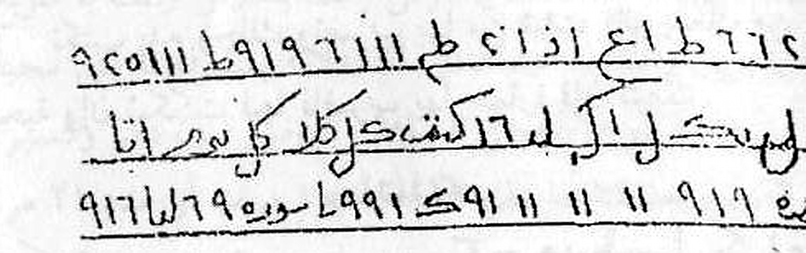
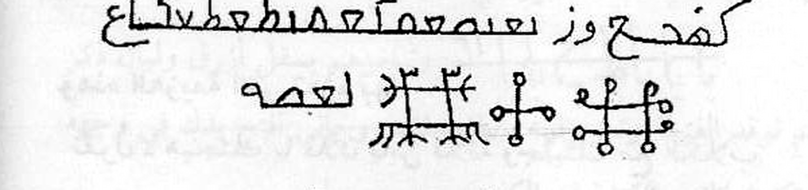
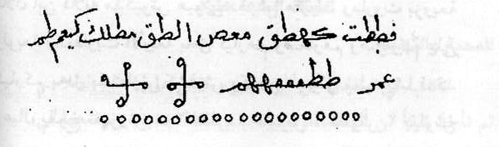
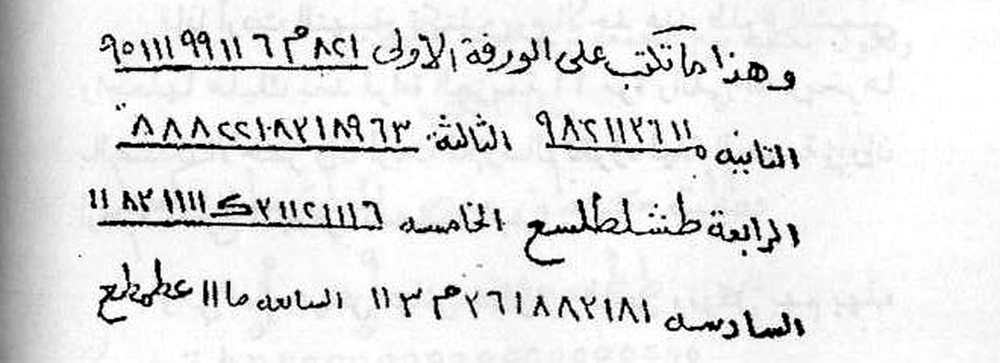
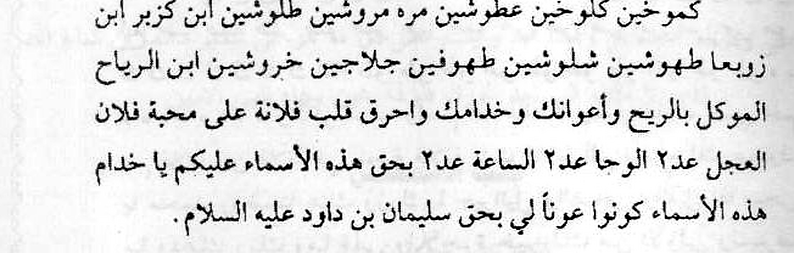
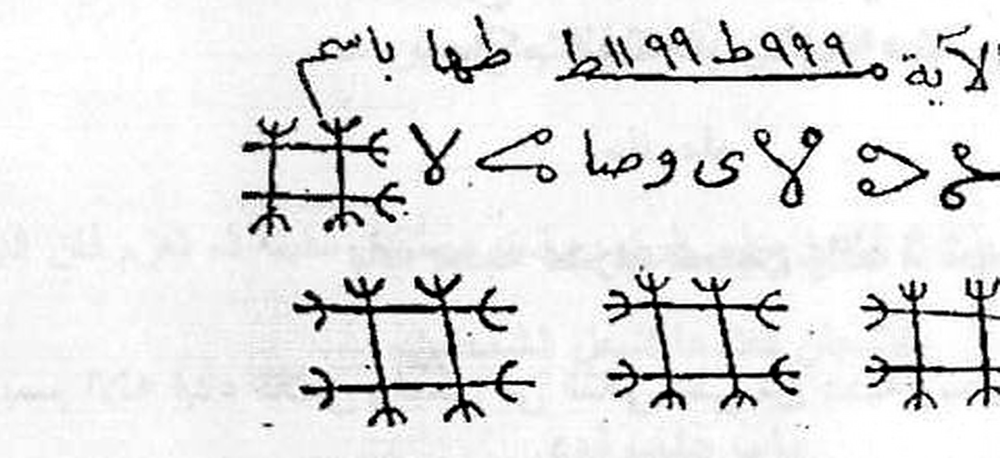
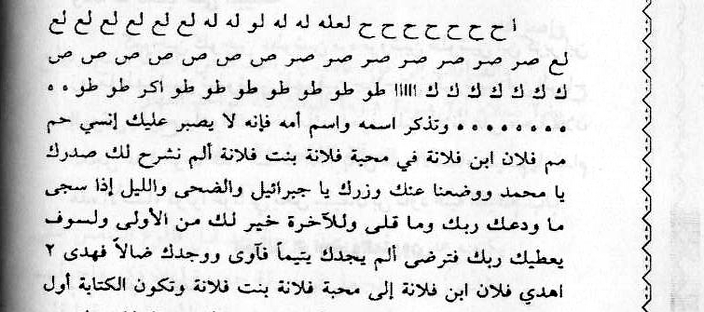

# Kitab *Asrār wa Khafāyāt fī 'Ilm al-Rūḥāniyyāt*
## Terjemahan Lengkap ke Bahasa Indonesia — Batch 3: Halaman Kitab 22–31
*(Berdasarkan foto pindaian `Picture 011.jpg` s.d. `Picture 015.jpg`)*

> **Keterangan umum terjemahan**
> - Format tiap paragraf: **Arab asli** (atas), **Latin** (tengah), **Terjemahan Indonesia** (bawah).
> - Istilah kunci hikmah yang tidak ada padanan Indonesianya dibiarkan dalam bahasa Arab dan diberi penjelasan dalam kurung.
> - Untuk beberapa kata yang cetakan/pindaian-nya samar, digunakan bacaan paling mungkin; tempat yang diragukan ditandai (?).
> - Tabel huruf-angka (wafaq/ṭilāsm) dan gambar rajah TIDAK ditranskripsikan menjadi teks — disajikan sebagai gambar asli hasil crop, sesuai aturan terjemahan.
> - Foto `Picture 014` terpotong di bagian atas (baris pertama halaman 29 hilang sebagian) dan `Picture 015` terpotong di bagian bawah (baris terakhir halaman 31 hilang sebagian).

---

## Halaman 22
*(Foto `Picture 011.jpg`, halaman kanan)*

| | |
|---|---|
| 📜 **Arab** | كتاب أسرار و خفايات في علم الروحانيات ....... شيع الروحانيين الشيخ عطية عبد الحميد |
| 🔤 **Latin** | Kitāb Asrār wa Khafāyāt fī 'Ilm al-Rūḥāniyyāt …… Shaykh al-Rūḥāniyyīn al-Shaykh 'Aṭiyya 'Abd al-Ḥamīd |
| 🇮🇩 **Indonesia** | Kitab *Asrār wa Khafiyāt* dalam Ilmu Ruhaniyat… Syekh ar-Rūḥānīyīn, Syekh 'Aṭiyya 'Abdul Ḥamīd *(kepala halaman)* |

| | |
|---|---|
| 📜 **Arab** | أثر المطلوب وتكتب عليها هذه الأسماء التي ذكرها وتلووها قطران وزيت طيب وتبرهما مثل الفتيلة وتجمعها في قم الفرس وأيضاً تختبم في كتك الشمال قبل أن توضع الفتيلة في قم الفرس. |
| 🔤 **Latin** | Aṯar al-maṭlūb, wa-taktubu 'alayhā hādhihi al-asmā' alladhī dhakarahā, wa-talwūhā qaṭrānan wa-zaytan ṭayyiban, wa-tabbirhumā(?) mithl al-fatīlah, wa-tajma'uhā fī qammi l-fars, wa-ayḍan taḫtabim(?) fī kataki(?/katab?) ash-shamāl qabla an tuḍa'a al-fatīlah fī qammi l-fars. |
| 🇮🇩 **Indonesia** | (Ambillah) *aṯar* (jejak/barang bekas) orang yang dikehendaki, dan tulislah di atasnya nama-nama ini yang telah (ia) sebutkan, lalu campurilah (mereka) dengan karna (*qaṭrān*) dan minyak wangi yang baik, dan *wa-tabbirhumā* (?) [taburkanlah (?) keduanya — bacaan samar] seperti sumbu (*fatīlah*), dan kumpulkanlah di *qammi l-fars* [ujung/kepala (gambaran) kuda — melanjutkan amalan Ritual Ke Enam Belas di halaman 21 yang memerintahkan membuat patung kuda], dan juga *taḫtabim* (?) di *katak ash-shamāl* (?) [tempat di sisi kiri — bacaan samar] sebelum sumbu itu diletakkan di *qammi l-fars*. |

| | |
|---|---|
| 📜 **Arab** | وهذا ما تكتب على الكف والاطر |
| 🔤 **Latin** | Wa-hādhā mā taktubu 'alā al-kaffi wa-l-aṭar. |
| 🇮🇩 **Indonesia** | Dan inilah yang kamu tulis pada telapak tangan (al-kaff) dan *al-ṭar* (?) [bagian tubuh yang digarap (?) — bacaan samar]: |

| | |
|---|---|
| 📜 **Arab** | قن قن قزن هزن هزن حزن خزن حزن خزن فرش فرش فرش |
| 🔤 **Latin** | Qun(?), Qun(?), Qazan(?), Hazan(?), Hazan(?), Ḥazan(?), Khazan(?), Ḥazan(?), Khazan(?), Farash(?), Farash(?), Farash(?). |
| 🇮🇩 **Indonesia** | "*Qun* (?), *Qun* (?), *Qazan* (?), *Hazan* (?), *Hazan* (?), *Ḥazan* (?), *Khazan* (?), *Ḥazan* (?), *Khazan* (?), *Farash* (?), *Farash* (?), *Farash* (?)" [rangkaian nama/term ruhani khusus — disalin apa adanya]. |

| | |
|---|---|
| 📜 **Arab** | فرش الجلجوش العجلجوش ذو العزة والسلطان انفروا خفافاً وقتلوا فإذا قبضت الصلاة فانشروا في الأرض |
| 🔤 **Latin** | Farash(?), al-Jaljūsh(?), al-'Ajljūsh(?), dhū l-'izati wa-s-sulṭān: Unfirū khauffāfan wa-qatalū(?); fa-idhā qabidhat aṣ-ṣalāhat fa-انشirū fī al-arḍ. |
| 🇮🇩 **Indonesia** | "*Farash* (?) — *al-Jaljūsh* (?), *al-'Ajljūsh* (?) — Pemilik kemuliaan (al-'izah) dan kekuasaan (as-sulṭān): 'Berkatalah (unfirū) dengan (suara) yang lembut (khauffāfan) dan (mereka) telah membunuh (qatalū?)'; maka apabila (waktu) shalat (qabidhat aṣ-ṣalāh — waktu shalat masuk), maka sebarlah (fa-insyirū) di bumi." |

> 📸 **Gambar Rajah Asli Halaman 22**
>
> *(Wafaq 2 baris besar "ما بيطح / يبالاه" — disajikan apa adanya, tidak ditranskripsikan.)*
>
> 
>
> **Cara baca (sesuai keterangan kitab):** Wafaq di atas terletak di samping baris "وتبخرهم بمقل أزرق ولبان ذكر" dan disalin persis sebagaimana terlihat (huruf-huruf dan tandanya) ke atas telapak tangan/lembar amalan sesuai instruksi "وهذا ما تكتب على الكف والاطر" di atasnya, bersama deretan "قن قن قزن..." dan "فرش الجلجوش..." yang mendahuluinya.

| | |
|---|---|
| 📜 **Arab** | وتبخرهم بمقل أزرق ولبان ذكر |
| 🔤 **Latin** | Wa-tabkhurhum bi-muqall(?/muqal?) azraq wa-lubāni dhakir. |
| 🇮🇩 **Indonesia** | Dan buburlah/bakarlah (tabkhur) mereka dengan *muqall azraq* [kemenyan biru — bacaan samar] dan *lubān dhakir* (kemenyan jantan). |

| | |
|---|---|
| 📜 **Arab** | ثم توقد الفتيلة وتعزم فإنه يأتيك ملك روحاني اكتب وذلك في وجهه وتكون كاتب الكتابة في الكف. |
| 🔤 **Latin** | Thumma tuq'id al-fatīlata wa-ta'zimu, fa-innahu yātīka malakun rūḥānī: ukhtub(?), wa-dhālika fī wajhihi, wa-takūn kātib al-kitābah fī al-kaff. |
| 🇮🇩 **Indonesia** | Kemudian nyalakan sumbunya (*tuq'id al-fatīlah*) dan buatlah *'azīmah* (sumpah pengikat) — maka sesungguhnya akan datang kepadamu seorang *malak rūḥānī* (penguasa alam ruhani); "tulislah (ukhtub ?)" [kitab tidak menjelaskan — kemungkinan: tuliskan apa yang diperintahkan/ditampakkan], dan itu (penampakan/tulisan) ada di wajahnya, dan kamu adalah penulis (kātib) tulisan yang ada di telapak tangan (kaff). |

| | |
|---|---|
| 📜 **Arab** | وهذا ما تعزم به |
| 🔤 **Latin** | Wa-hādhā mā ta'zimu bihi. |
| 🇮🇩 **Indonesia** | Dan inilah yang kamu pakai untuk membuat *'azīmah* (sumpah pengikat): |

| | |
|---|---|
| 📜 **Arab** | تقول - معتراش جه مقرض لطرش هند وقطنش طقش هيا فلطش بحق فهوش لشهيا فرش الساعة إلى فلان ابن فلانة بارك الله فيكم وعليكم. |
| 🔤 **Latin** | Taquulu: Mu'trāsh(?), Jah(?), Muqaraḍ(?), Liṭarsh(?), Hind(?), Waqaṭunsh(?), Ṭaqash(?), Hayyā(?), Falṭash(?) — bi-ḥaqqi Fuhūsh(?), Li-shuhayyā(?), Farash(?) as-sā'ah ilā falāni ibni fulānā. Bārakallāhu fīkum wa-'alaykum. |
| 🇮🇩 **Indonesia** | Kamu ucapkan — "*Mu'trāsh* (?), *Jah* (?), *Muqaraḍ* (?), *Liṭarsh* (?), *Hind* (?), *Waqaṭunsh* (?), *Ṭaqash* (?), *Hayyā* (?), *Falṭash* (?)" [rangkaian nama-nama ruhani khusus — hadirkan], "dengan hak *Fuhūsh* (?), *Li-shuhayyā* (?), *Farash* (?) — (datangkan) pada saat/jam (as-sā'ah) ini Si Fulan bin Si Fulanah. Semoga Allah memberkati kamu dan beserta kamu." |

| | |
|---|---|
| 📜 **Arab** | المسألة السابعة عشرة |
| 🔤 **Latin** | Al-Masā'ilat as-Sābi'u 'Ashara |
| 🇮🇩 **Indonesia** | SOAL (MASYKIL) KE TUJUH BELAS |

| | |
|---|---|
| 📜 **Arab** | للمحببة والتهميج |
| 🔤 **Latin** | Li-l-Maḥabbah wa-t-Taḥwīj |
| 🇮🇩 **Indonesia** | (Amalan) untuk memikat kasih (maḥabbah) dan taḥwīj (pengikat/penawan) |

| | |
|---|---|
| 📜 **Arab** | تكتب في صفيحة من الرصاص وتنفس عليها هذه الطلاسم ثم تأخذ شيئاً من أثر المطلوب وتجنب شفعة جديدة وتوضعها في |
| 🔤 **Latin** | Tuktubu fī ṣafīḥatin min ar-raṣāṣ wa-tanaffisu('alayhā) hādhihi aṭ-ṭilāsim, thumma ta'khudh syay'an min aṯar al-maṭlūb, wa-tajannubu(?/tajtabu?) shuf'atan jadīdahan, wa-tuḍa'u fī… |
| 🇮🇩 **Indonesia** | Tulislah (amalan ini) pada selembar pelat tipis (*ṣafīḥah*) timah/lembah (raṣāṣ), dan bacakan (tanaffas) di atasnya *ṭilāsim* (formula-formula rahasia) ini, lalu ambillah sedikit dari *aṯar* (jejak/barang bekas) orang yang dikehendaki, dan *wa-tajannubu* (?) [siapkan (?) — bacaan samar] selembar *shuf'ah* (kertas amalan) yang baru, dan letakkan (ia) di… *(terusan di halaman 23)* |

| | |
|---|---|
| 📜 **Arab** | ٢٢ |
| 🔤 **Latin** | (nomor halaman) 22 |
| 🇮🇩 **Indonesia** | (Nomor halaman kitab: 22) |

---

## Halaman 23
*(Foto `Picture 011.jpg`, halaman kiri)*

| | |
|---|---|
| 📜 **Arab** | كتاب أسرار و خفايات في علم الروحانيات ....... شيع الروحانيين الشيخ عطية عبد الحميد |
| 🔤 **Latin** | Kitāb Asrār wa Khafāyāt fī 'Ilm al-Rūḥāniyyāt …… Shaykh al-Rūḥāniyyīn al-Shaykh 'Aṭiyya 'Abd al-Ḥamīd |
| 🇮🇩 **Indonesia** | Kitab *Asrār wa Khafiyāt* dalam Ilmu Ruhaniyat… Syekh ar-Rūḥānīyīn, Syekh 'Aṭiyya 'Abdul Ḥamīd *(kepala halaman)* |

| | |
|---|---|
| 📜 **Arab** | النار فإذا حميت الشفعة ترمي عليها الاثر والرصاص فوق النار وتتعزم عليها ٢١ مرة والبخور لبان ذكر وكسبرة. |
| 🔤 **Latin** | …an-nār, fa-idhā ḥamīat ash-shuf'at tar-mī 'alayhā al-aṯara wa-r-raṣāṣa fawq an-nār, wa-tata'zamu('alayhā) 21 marrah, wa-al-bakhūr lubānun dhakīr wa-kausibah(?). |
| 🇮🇩 **Indonesia** | "…(di) api; maka apabila *shuf'ah* (kertas amalan) itu sudah membara, lemparkanlah di atasnya *aṯar* (jejak) dan (pelat) timah (raṣāṣ) di atas api, dan buatlah *'azīmah* (sumpah pengikat) di atasnya 21 kali; bakurnya (kemenyannya) adalah *lubān dhakir* (kemenyan jantan) dan *kausibah* (?) [jenis kemenyan/obat — bacaan samar]." |

| | |
|---|---|
| 📜 **Arab** | وهذا ما تنفس على الرصاص مع اسم المطلوب وأمه كما ترى إنهم ترشد |
| 🔤 **Latin** | Wa-hādhā mā tanaffisu('alayhi) 'alā ar-raṣāṣ ma'a ismi l-maṭlūbi wa-ummihī, kamā tara, fa-innahum yarshidūna(?). |
| 🇮🇩 **Indonesia** | Dan inilah yang kamu bacakan (tanaffas) di atas (pelat) timah (raṣāṣ) bersama nama orang yang dikehendaki dan (nama) ibunya, sebagaimana kamu lihat — (maka) mereka memberi petunjuk (yurshidūn) (?) [akhir baris samar — kemungkinan: fa-innahu ya'ashid/yurshid = dan ia menjadi tanda/memberi petunjuk]. |

> 📸 **Gambar Rajah Asli Halaman 23**
>
> *(Deretan wafaq/ṭilasm 3 baris besar berisi rangkaian huruf dan angka-angka Arab, ditulis tangan. Disajikan apa adanya, tidak ditranskripsikan.)*
>
> 
>
> **Cara baca (sesuai keterangan kitab):** Kitab menyebut "hādhā mā tanaffisu ʿalā ar-raṣāṣ" (inilah yang dibacakan di atas timah) — deretan wafaq 3 baris di atas disalin persis sebagaimana terlihat (huruf, angka, dan tandanya) ke atas pelat timah bersama nama orang yang dikehendaki dan ibunya, lalu didiamalkan sesuai Soal Ketujuh Belas (halaman 22): pelat timah dan kertas amalan dibakar bersama *aṯar* orang yang dikehendaki, dengan *'azīmah* 21 kali.

| | |
|---|---|
| 📜 **Arab** | وهذه العزيمه التي تعزم بها |
| 🔤 **Latin** | Wa-hādhih al-'azīmah allatī ta'zimu bihā. |
| 🇮🇩 **Indonesia** | Dan inilah *'azīmah* (sumpah/incantasi pengikat) yang kamu amalkan dengannya: |

| | |
|---|---|
| 📜 **Arab** | تقول - هيجنتك يا فلان يا ابن فلانة واجبتك مع الكلاب الثايحة وهيحنتك مع السباع الضارية هيجنتك مع الذئاب الغاوية هيجنتك مع الدبوك الصائحة هيجنتك يا فلان مع الرياح الهائلة بالمردة المستقرين السمع من سحب ابا النار والنور والظلل والحرور اعزم على سكان اللحامات والقميدات والبيارى والقافارى والأسواق والأبيار والرياسين عملوجوا واسرعوا وغيخوا فلان ابن فلانة منديوش هيوش دحوش هاروت وماروت زورعة ولوبة والعفاريت الأربعة بحق كبارهم وصغارهم على كباركم بحق بكشارش وكورش طموش شلبناشا وقدد وعبياي بآلوح شهروش عدد ٢ ملش ٢ هيوش ٢ شلوش ٢ بقلوؤش |
| 🔤 **Latin** | Taquulu: Hayyijnatuka yā falān, yā ibna fulānā, wa-ajabbituka(?) ma'a al-kilābi s-sā'ikh(?), wa-hayyijnatuka ma'a as-sibā'i ḍ-ḍāriyah, hayyijnatuka ma'a az-zirāb(?) al-ghāwiyah, hayyijnatuka ma'a ad-dabūki(?/aḍ-ḍabūkh?) aṣ-ṣā'īḥah, hayyijnatuka yā falān ma'a ar-rīāḥ al-hā'ilah bi-l-muridi(?) l-mustaqirīn — as-sam'(?) min suḥūb(?), 'abā(?) an-nāri wa-n-nūr wa-ẓ-ẓalal wa-l-ḥurūr. A'zim 'alā sikāni l-laḥāmāt(?) wa-l-qumīdāt(?) wa-l-bayārā(?/al-bayāri) wa-l-qāfārā(?/al-qāfāri) wa-l-aswāq wa-l-ābīār(?) wa-r-riyāsīn(?): ʿAmalūjū(?), wa-isriʿū(?), wa-ghaykhū(?). Falān ibna fulānā: Mandiyūsh(?), Hayyūsh(?), Dahiūsh(?), Hārūt wa Mārūt, Zūri'a(?), Walūbah(?), wa-l-'afārīt al-arba'ah — bi-ḥaqqi kibārihim wa-ṣighārihim(?), 'alā kibārikum bi-ḥaqqi Bikhāshish(?), wa-Kurush(?), Ṭumūsh(?), Shulbunāshā(?), wa-Qaddadd(?), wa-'Ubayyāy(?), Bālūḥ(?), Shaharūsh(?) 'adad 2, Malash(?) 'adad 2, Hayyūsh(?) 'adad 2, Shulūsh(?) 'adad 2, Baqlawūsh(?). |
| 🇮🇩 **Indonesia** | Kamu ucapkan — "Aku telah mengguncangmu (*hayyijnatuka*), wahai Si Fulan, wahai anak Si Fulanah; dan *wa-ajabbituka* (?) [mempaksamu (?) — bacaan samar] di antara anjing-anjing *as-Sā'ikh* (?) [yang mengaum/mengamuk (?) — bacaan samar]; aku telah mengguncangmu di antara binatang buas yang ganas (as-sibā' aḍ-ḍāriyyah); aku telah mengguncangmu di antara serigala-serigala yang sesat (az-zirāb al-ghāwiyah); aku telah mengguncangmu di antara *ad-Dabūk* (?) [binatang (?) yang berteriak (aṣ-ṣā'īḥah) — bacaan samar]; aku telah mengguncangmu, wahai Si Fulan, bersama angin-angin yang dahsyat (ar-rīāḥ al-hā'ilah) — di antara *al-muridīn* (?) [yang memberontak (?) — bacaan samar] yang bersemayam (al-mustaqirīn) — *as-sam' min suḥūb* (?) [pendengaran dari awan (?) — bacaan samar] — *'abā* (?) api dan cahaya dan bayang-bayang (aẓ-ẓalāl) dan *al-ḥurūr* (?) [yang membakar (?)]! Aku bersumpah (a'zim) atas para penghuni *al-Laḥāmāt* (?), *al-Qumīdāt* (?), *al-Bayār* (?) [padang (?) ] dan *al-Qāfār* [padang tandus] dan pasar-pasar (al-aswāq) dan *al-Ābīār* (?) dan *ar-Riyāsīn* (?) [para pembesar (?)]: '*ʿAmalūjū* (?)', 'bersiaplah/cepatlah (isriʿū!)', dan '*ghaykhū* (?)'! Wahai Si Fulan bin Si Fulanah: *Mandiyūsh* (?), *Hayyūsh* (?), *Dahiūsh* (?), Hārūt dan Mārūt [dua malaikat, disebut dalam Q.S. Al-Baqarah 2:102], *Zūri'a* (?), *Walūbah* (?), dan *al-ʿafārīt* al-arba'ah (empat *ʿafarīt* [semacam ruh/gaib]), dengan hak para pembesar mereka dan *ṣighārihim* (?) [para kecil mereka (?)] — atas para pembesar kalian, dengan hak *Bikhāshish* (?), *Kurush* (?), *Ṭumūsh* (?), *Shulbunāshā* (?), *Qaddadd* (?), *ʿUbayyāy* (?), *Bālūḥ* (?), *Shaharūsh* (?) — dua kali; *Malash* (?) — dua kali; *Hayyūsh* (?) — dua kali; *Shulūsh* (?) — dua kali; *Baqlawūsh* (?)" *(terusan di halaman 24)* |

| | |
|---|---|
| 📜 **Arab** | ٢٣ |
| 🔤 **Latin** | (nomor halaman) 23 |
| 🇮🇩 **Indonesia** | (Nomor halaman kitab: 23) |

---

## Halaman 24
*(Foto `Picture 012.jpg`, halaman kanan)*

| | |
|---|---|
| 📜 **Arab** | كتاب أسرار و خفايات في علم الروحانيات ....... شيع الروحانيين الشيخ عطية عبد الحميد |
| 🔤 **Latin** | Kitāb Asrār wa Khafāyāt fī 'Ilm al-Rūḥāniyyāt …… Shaykh al-Rūḥāniyyīn al-Shaykh 'Aṭiyya 'Abd al-Ḥamīd |
| 🇮🇩 **Indonesia** | Kitab *Asrār wa Khafiyāt* dalam Ilmu Ruhaniyat… Syekh ar-Rūḥānīyīn, Syekh 'Aṭiyya 'Abdul Ḥamīd *(kepala halaman)* |

| | |
|---|---|
| 📜 **Arab** | ٢ وطميطون ٢ زعتشر ٢ اسرجوا ٢ وعجولا ٢ والقوا محبة فلانة بنت فلانة في قلب فلان ابن فلانة الوحام العجل الساعة. |
| 🔤 **Latin** | …(wa-)Ṭamīṭūn(?) 'adad 2, Za'atachar(?) 'adad 2, Israjū(?) 'adad 2, wa-'Ajūlā(?) 'adad 2. Wa-alqū maḥabbata fulānata binti fulānā fī qalbi falāni ibni fulānā. Al-Waḥām(?), al-'Ajl(?), as-Sā'ah. |
| 🇮🇩 **Indonesia** | *(Lanjutan 'azīmah dari halaman 23:)* "…*Wa-Ṭamīṭūn* (?) — dua kali; *Za'atachar* (?) — dua kali; 'bersiaplah/dipersiapkanlah (israjū!)' — dua kali; *wa-'Ajūlā* (?) — dua kali. Dan jatuhkanlah (taruhlah) cinta kepada Si Fulanah binti Si Fulanah ke dalam hati Si Fulan bin Si Fulanah. *Al-Waḥām* (?) [nama khusus], *Al-'Ajl* (jam yang segera datang), *As-Sā'ah* (jam yang ditakdirkan)." |

| | |
|---|---|
| 📜 **Arab** | المسألة الثامنة عشرة |
| 🔤 **Latin** | Al-Masā'ilat aṯ-Ṡāmina 'Ashara |
| 🇮🇩 **Indonesia** | SOAL (MASYKIL) KE DELAPAN BELAS |

| | |
|---|---|
| 📜 **Arab** | مسألة للمحبة |
| 🔤 **Latin** | Masā'ilat li-l-Maḥabbah |
| 🇮🇩 **Indonesia** | (Bagian) soal/perihal maḥabbah (memikat kasih) |

| | |
|---|---|
| 📜 **Arab** | تكتب بدم رجلك وتضرب بها من شتت فإنه ينتيك من شدة المحبة وإن شككت فيها فاضرب بها حماره فإن تتبعك. |
| 🔤 **Latin** | Taktubu bi-dam rijlika, wa-tuḍribu bihā man shattata(?) — fa-innahu yantīk(?)/yabīk(?) min shiddati l-maḥabbah; wa-in shakkakta fīhā fa-ḍrib bihā ḥimāran(?) — fa-in(ta) tatabba'uk(?). |
| 🇮🇩 **Indonesia** | Tulislah (nama-nama amalan) dengan darah kakimu, dan pukullah dengannya orang yang kamu pisahkan/menghamburkannya (syattattā ?) [yaitu orang yang dikehendaki yang telah kamu 'jauhkan' — bacaan samar] — maka ia akan datang kepadamu (*yabīka* ?) karena hebatnya (shiddah) kecintaan; dan jika kamu ragu akan (kekuatan) amalan itu, maka pukullah dengannya seekor keledai (*ḥimār* ?) — maka (ia) akan mengikuti kamu (*tatabba'uk* ?) [sebagai tanda bahwa amalan itu telah bekerja — bacaan samar]. |

| | |
|---|---|
| 📜 **Arab** | وهذا ما تكتب |
| 🔤 **Latin** | Wa-hādhā mā taktub. |
| 🇮🇩 **Indonesia** | Dan inilah yang kamu tulis: |

> 📸 **Gambar Rajah Asli Halaman 24 — Rajah 1 (atas)**
>
> *(Wafaq 2 baris "كفحص وز بعدصمدك عمشكع / لعصه" dengan corak huruf bersilang di bawahnya. Disajikan apa adanya, tidak ditranskripsikan.)*
>
> 
>
> **Cara baca (sesuai keterangan kitab):** Wafaq di atas (untuk Soal Ke Delapan Belas) disalin persis sebagaimana terlihat (huruf, corak, dan tandanya) ke atas kertas/lapisan amalan, lalu dipukul dengan darah kaki orang yang mengamalkan sesuai instruksi di atasnya.

| | |
|---|---|
| 📜 **Arab** | المسألة التاسعة عشرة |
| 🔤 **Latin** | Al-Masā'ilat at-Tāsi'a 'Ashara |
| 🇮🇩 **Indonesia** | SOAL (MASYKIL) KE SEMBILAN BELAS |

| | |
|---|---|
| 📜 **Arab** | مسألة للمحبة |
| 🔤 **Latin** | Masā'ilat li-l-Maḥabbah |
| 🇮🇩 **Indonesia** | (Bagian) soal/perihal maḥabbah (memikat kasih) |

| | |
|---|---|
| 📜 **Arab** | تكتب بدم رجلك وتضرب بها من شتت ثلاث مرات على رأسها لا شك فيها وإن شككت فيها فاضرب بها حماره فإنها تتبعك وتكون الكتابة يوم الجمعة ترى عجبا عظيماً. |
| 🔤 **Latin** | Taktubu bi-dam rijlika, wa-tuḍribu bihā man shattata(?) thalātha marrāt 'alā ra'sihā — lā shakka fīhā; wa-in shakkakta fīhā fa-ḍrib bihā ḥimāran(?) — fa-innāhā tatabba'uk(?); wa-takūn al-kitābatu yawm al-jumu'ah — tara('ajiban 'aẓīmā). |
| 🇮🇩 **Indonesia** | Tulislah (nama-nama amalan) dengan darah kakimu, dan pukullah dengannya orang yang kamu pisahkan (?) tiga kali di kepalanya — tidak ada keraguan akan (kekuatan) amalan ini; dan jika kamu ragu akan (kekuatan) amalan itu, maka pukullah dengannya seekor keledai (*ḥimār* ?) — maka (ia) akan mengikuti kamu (?). Dan penulisan (amalan ini) dilakukan pada hari Jumat — kamu akan melihat sesuatu yang menakjubkan ('ajab) yang besar. |

| | |
|---|---|
| 📜 **Arab** | وهذا ما تكتب |
| 🔤 **Latin** | Wa-hādhā mā taktub. |
| 🇮🇩 **Indonesia** | Dan inilah yang kamu tulis: |

> 📸 **Gambar Rajah Asli Halaman 24 — Rajah 2 (bawah)**
>
> *(Wafaq 2 baris "فطبت حطقي معصن الطن مطلق كليم / عمر طقمها هر منو منو" dengan deretan bulatan-bulatan kecil (○) di bawahnya. Disajikan apa adanya, tidak ditranskripsikan.)*
>
> 
>
> **Cara baca (sesuai keterangan kitab):** Wafaq di atas (untuk Soal Ke Sembilan Belas) disalin persis sebagaimana terlihat (huruf, corak, dan deretan bulatannya) ke atas kertas amalan; amalan ini dipukul dengan darah kaki tiga kali di kepala orang yang dikehendaki, dan penulisannya dilakukan hari Jumat sesuai instruksi di atasnya.

| | |
|---|---|
| 📜 **Arab** | ٢٤ |
| 🔤 **Latin** | (nomor halaman) 24 |
| 🇮🇩 **Indonesia** | (Nomor halaman kitab: 24) |

---

## Halaman 25
*(Foto `Picture 012.jpg`, halaman kiri)*

| | |
|---|---|
| 📜 **Arab** | كتاب أسرار و خفايات في علم الروحانيات ....... شيع الروحانيين الشيخ عطية عبد الحميد |
| 🔤 **Latin** | Kitāb Asrār wa Khafāyāt fī 'Ilm al-Rūḥāniyyāt …… Shaykh al-Rūḥāniyyīn al-Shaykh 'Aṭiyya 'Abd al-Ḥamīd |
| 🇮🇩 **Indonesia** | Kitab *Asrār wa Khafiyāt* dalam Ilmu Ruhaniyat… Syekh ar-Rūḥānīyīn, Syekh 'Aṭiyya 'Abdul Ḥamīd *(kepala halaman)* |

| | |
|---|---|
| 📜 **Arab** | المسألة العشرون |
| 🔤 **Latin** | Al-Masā'ilat al-'Isyrūn |
| 🇮🇩 **Indonesia** | SOAL (MASYKIL) KE DUA PULUH |

| | |
|---|---|
| 📜 **Arab** | باب محبية |
| 🔤 **Latin** | Bāb Maḥabbah |
| 🇮🇩 **Indonesia** | Bab maḥabbah (memikat kasih) |

| | |
|---|---|
| 📜 **Arab** | يكتب على شفعة بمعبر طبيرد منفرد منفرد |
| 🔤 **Latin** | Yuktubu 'alā shuf'atin bi-ma'bari(?/mubāshari?) Ṭabīrid(?), munfadin munfadin. |
| 🇮🇩 **Indonesia** | Tulislah (amalan ini) pada selembar *shuf'ah* (kertas amalan) dengan *al-ma'bar* (?) [tinta/cara penulisan khusus (?) — bacaan samar] *Ṭabīrid* (?), "munfādin" (terpisah/berdiri sendiri) — (ulangi) "munfādin" (terpisah). |

| | |
|---|---|
| 📜 **Arab** | منفرد يفرده بها ششه ٢ بلكشكه ٢ مكشكشه ٢ هاله ٢ مهوله ٢ |
| 🔤 **Latin** | Munfadin, yafrīduhā bihā: Shashah(?) 'adad 2, Balashkah(?) 'adad 2, Mushkashkah(?) 'adad 2, Hālah(?) 'adad 2, Muhawalah(?) 'adad 2. |
| 🇮🇩 **Indonesia** | (Tulisan yang) terpisah — kamu (menj)adikannya terpisah oleh (bacaan) ini: "*Shashah* (?)" — dua kali; "*Balashkah* (?)" — dua kali; "*Mushkashkah* (?)" — dua kali; "*Hālah* (?)" — dua kali; "*Muhawalah* (?)" — dua kali. |

| | |
|---|---|
| 📜 **Arab** | خاطفة ٢ خطورة ١ اختطف بها رانش وانت ياامارنش وانت يا سريع |
| 🔤 **Latin** | Khāṭifah(?) 'adad 2, Khaṭūrah(?) 'adad 1 — ikhṭaṭ(?) bihā Rānish(?); wa-anta yā Amārish(?), wa-anta yā Sarī'. |
| 🇮🇩 **Indonesia** | "*Khāṭifah* (?) [yang menyambar (?)]" — dua kali; "*Khaṭūrah* (?)" — satu kali; "cabutlah/sambarlah (ikhṭaṭ) dengannya, O *Rānish* (?); dan engkau, O *Amārish* (?); dan engkau, O As-Sarī' (Yang Maha Cepat)." |

| | |
|---|---|
| 📜 **Arab** | وانت يا بيرت وانت يا عبد النار قلب فلانة بنت فلانة إلى محبة فلان ابن فلانة الوحاح العجل الساعة والبخور لبان ذكر وكسبرة |
| 🔤 **Latin** | Wa-anta yā Bayrat(?), wa-anta yā 'Abda n-nār — qalbi fulānata binti fulānā ilā maḥabbati falāni ibni fulānā. Al-Waḥāḥ(?), al-'Ajl(?), as-Sā'ah. Wa-al-bakhūr lubānun dhakīr wa-kausibah(?). |
| 🇮🇩 **Indonesia** | "Dan engkau, O *Bayrat* (?); dan engkau, O 'Abd an-Nār (hamba Api) — (putarlah) hati Si Fulanah binti Si Fulanah kepada kecintaan kepada Si Fulan bin Si Fulanah. *Al-Waḥāḥ* (?) [nama khusus], *Al-'Ajl* (jam yang segera datang), *As-Sā'ah* (jam yang ditakdirkan)." Bakurnya (kemenyannya) adalah *lubān dhakir* (kemenyan jantan) dan *kausibah* (?) [jenis kemenyan/obat — bacaan samar]. |

| | |
|---|---|
| 📜 **Arab** | وتقرأ العزيمه بعد كتابتها على الشفعة عددها مرات أو عدد ٢١ مرة وهي في النار دامة الوقود. |
| 🔤 **Latin** | Wa-taqra' al-'azīmah ba'da kitābahatihā('alā) ash-shuf'ah — 'adadah(?) marrāt aw 'adad 21 marrah — wa-hiya fī an-nāri dā'imata l-waqūd. |
| 🇮🇩 **Indonesia** | Dan bacalah (laflam) *'azīmah* (sumpah pengikat) itu setelah penulisannya pada *shuf'ah* (kertas amalan) itu — (sebanyak) bilangannya (ʿadadah) kali, atau sebanyak 21 kali — sedangkan (kertas itu) berada dalam api, terus-menerus menyala (dā'imat al-waqūd). |

| | |
|---|---|
| 📜 **Arab** | المسألة الواحدة والعشرون |
| 🔤 **Latin** | Al-Masā'ilat al-Wāḥidah wa-l-'Isyrūn |
| 🇮🇩 **Indonesia** | SOAL (MASYKIL) KE DUA PULUH SATU |

| | |
|---|---|
| 📜 **Arab** | باب السر المصون |
| 🔤 **Latin** | Bāb as-Sirr al-Maṣūn |
| 🇮🇩 **Indonesia** | Bab as-Sirr al-Maṣūn (Rahasia yang Terjaga) |

| | |
|---|---|
| 📜 **Arab** | ملعون ثم ملعون من يطلع عليه غير أهله وهو من ذخائر الملك وهو يصرف في أمور شتى فيها التهجيج والإحضار الخصم ومنها الإرسال الهوائي منها لسرع لصيع المصاب. |
| 🔤 **Latin** | Mal'ūnun, thumma mal'ūnun, man yaṭla'u('alayhi) ghayru ahlīhi. Wa-huwa min dakhā'iri l-Malaki(?), wa-huwa yaṣarrifu fī amūrin shattā: fīhā at-tahyīj(?)/at-tahwīj wa-l-iḥḍāru l-khaṣm(?), wa-minhā al-irsālu l-hawwā'ī(?), wa-minhā li-sara'i(?)/sarā'i'i li-ṣ-ṣari'i(?/aṣ-ṣābi') l-maṣāb(?). |
| 🇮🇩 **Indonesia** | "Tercela, kemudian tercela pula, siapa pun yang melihat (isi rahasia ini) selain orang yang berhak (ghayru ahlīhi). Dan ia (formula ini) termasuk perbendaharaan (dakhā'ir) *al-Malik* (Sang Raja), dan ia dipergunakan dalam berbagai urusan yang bermacam-macam — di antaranya *at-Tahyīj/at-Taḥwīj* (penggerak/pengikat) dan *al-Iḥḍār* (pemanggilan) *al-Khaṣm* (?) [lawan/objek (?) — bacaan samar]; dan di antaranya *al-Irsāl al-Hawwā'ī* (?) [pengiriman melalui udara (?) — bacaan samar]; dan di antaranya untuk kelancaran (sarā' ?) *aṣ-Ṣarī'/aṣ-Ṣābi'* (?) [orang yang ditimpa musibah (?) ] bagi orang yang tertimpa (al-maṣūb) (?)." |

| | |
|---|---|
| 📜 **Arab** | فإذا أردت التهجيج تكتب يوم الأحد عند طلوع الشمس واجعلها عليك بعد قراءة العزيمه ٢١ مرة وانتي الله وبخراها بالصنصال الأحمر وإن أردت للإرسال تقروه ليلة الجمعة. وإن أردت للصريع اكتبه في كف المصاب. |
| 🔤 **Latin** | Fa-idhā aradda(ta) at-tahyīja taktubu yawm al-aḥadi 'inda ṭulū'i s-syams, wa-aj'alhā('alayka) ba'da qirā'ati l-'azīmah 21 marrah, wa-antā Allāh(?), wa-bakhūrahā bi-aṣ-ṣanṣāli l-aḥmar(?); wa-in aradda(ta) li-l-irsāli taqūrahā(?) laylat al-jumu'ah. Wa-in aradda(ta) li-ṣ-ṣari'i(?/aṣ-ṣar'i'ah) aktubhā fī kaffi l-maṣāb(?)/l-maṣūb. |
| 🇮🇩 **Indonesia** | Maka jika kamu menginginkannya untuk *tahyīj* (penggerak/pemikat), tulislah (ia) pada hari Ahad ketika matahari terbit, dan jadikanlah (ia) di atasmu setelah membacakan *'azīmah* (sumpah pengikat) 21 kali — "wa-antā Allāh" (?) [bacaan samar — kemungkinan: wa-antadh-dhāliq/wa-āmanā (?)] — dan bakurnya (bakhūrah) dengan *aṣ-Ṣanṣāl al-Aḥmar* (?) [jenis kemenyan/ketuban merah (?) — bacaan samar]. Dan jika kamu menginginkannya untuk *irsāl* (pengiriman), bacalah (taqūrahā ?) pada malam Jumat. Dan jika kamu menginginkannya untuk *aṣ-Ṣarī'/aṣ-Ṣar'i'ah* (?) [orang yang terbunuh/orang sakit (?) — bacaan samar], tulislah (ia) di telapak tangan (kaff) orang yang tertimpa (al-maṣūb). |

| | |
|---|---|
| 📜 **Arab** | وهي هذه هياش مباش شالوش طاخي وتوكل بهم بهذه الأسماء تقول: |
| 🔤 **Latin** | Wa-hiya hādhā: Hayyāsh(?), Bīyash(?), Shālūsh(?), Ṭākhī(?). Wa-tawakkal bihim bi-hādhihi al-asmā', taquulu: |
| 🇮🇩 **Indonesia** | Dan (formula) itu adalah ini: "*Hayyāsh* (?), *Bīyash* (?), *Shālūsh* (?), *Ṭākhī* (?)" [rangkaian nama-nama ruhani khusus]; dan bertawakallah dengan mereka dengan nama-nama ini; kamu ucapkan: |

| | |
|---|---|
| 📜 **Arab** | ٢٥ |
| 🔤 **Latin** | (nomor halaman) 25 |
| 🇮🇩 **Indonesia** | (Nomor halaman kitab: 25) |

---

## Halaman 26
*(Foto `Picture 013.jpg`, halaman kanan)*

| | |
|---|---|
| 📜 **Arab** | كتاب أسرار و خفايات في علم الروحانيات ....... شيع الروحانيين الشيخ عطية عبد الحميد |
| 🔤 **Latin** | Kitāb Asrār wa Khafāyāt fī 'Ilm al-Rūḥāniyyāt …… Shaykh al-Rūḥāniyyīn al-Shaykh 'Aṭiyya 'Abd al-Ḥamīd |
| 🇮🇩 **Indonesia** | Kitab *Asrār wa Khafiyāt* dalam Ilmu Ruhaniyat… Syekh ar-Rūḥānīyīn, Syekh 'Aṭiyya 'Abdul Ḥamīd *(kepala halaman)* |

| | |
|---|---|
| 📜 **Arab** | كشارش ٢ مشارش ٢ طرياش ٢ أيغوش ٢ جلهوش ٢ تعلموش ٢ كنديوش ٢ عواديبوش ٢ هيا يا أهل النار والشرار |
| 🔤 **Latin** | Khashāsh(?) 'adad 2, Mīshāsh(?) 'adad 2, Ṭariyāsh(?) 'adad 2, Ayyagūsh(?) 'adad 2, Jalhūsh(?) 'adad 2. Ta'allamūsh(?) 'adad 2, Kandiyūsh(?) 'adad 2, 'Awāḍībūsh(?) 'adad 2. Hayyā yā ahl an-nāri wa-sh-sharrār. |
| 🇮🇩 **Indonesia** | "*Khashāsh* (?)" — dua kali; "*Mīshāsh* (?)" — dua kali; "*Ṭariyāsh* (?)" — dua kali; "*Ayyagūsh* (?)" — dua kali; "*Jalhūsh* (?)" — dua kali; "*Ta'allamūsh* (?)" — dua kali; "*Kandiyūsh* (?)" — dua kali; "*ʿAwāḍībūsh* (?)" — dua kali [rangkaian nama-nama ruhani khusus]; "Hadirlah (hayyā), wahai penduduk neraka dan *asy-Sharrār* (para penyerbak kejahatan)!" |

| | |
|---|---|
| 📜 **Arab** | والإزعاج والأمراض وتكلاو وانكلوا كما بحق هذه الأسماء عليكم |
| 🔤 **Latin** | Wa-l-īzā'aj wa-l-amarāḍ; wa-takallū(?)/wa-taklāw(?), wa-ankalū(?) kamā(?), bi-ḥaqqi hādhihi al-asmā' 'alaykum. |
| 🇮🇩 **Indonesia** | "(Bawakanlah) kegugupan (al-īzā'aj) dan penyakit-penyakit (al-amarāḍ); dan *wa-takallū/wa-taklāw* (?) [dan kalian akan terbelah (?) — bacaan samar], dan *wa-ankalū* (?) [dan kalian akan tercerai-berai (?) — bacaan samar] *kamā* (?)" — dengan hak nama-nama ini yang di atasmu (kalian). |

| | |
|---|---|
| 📜 **Arab** | وطاعتها لديكم نار وإحراق من عمى تكون قليلا الوحا ٢ العجل ٢ الساعة ٢ |
| 🔤 **Latin** | Wa-ṭā'atuhā(?) li-dīkum(?) — nārun wa-iḥrāqun min 'umyā(?); ta-kūnu qalīlan(?). Al-Waḥā 'adad 2, al-'Ajl 'adad 2, as-Sā'ah 'adad 2. |
| 🇮🇩 **Indonesia** | "Dan *wa-ṭā'atuhā li-dīkum* (?) [ketaatannya bagi kalian (?) — bacaan samar] adalah api dan pembakaran (iḥrāq) dari *ʿumyā* (?) [kegelapan/kebodohan (?) — bacaan samar]; (ia) akan menjadi kecil (qalīlan) (?)." — *Al-Waḥā* [nama khusus] — dua kali; *Al-'Ajl* (jam yang segera datang) — dua kali; *As-Sā'ah* (jam yang ditakdirkan) — dua kali. |

| | |
|---|---|
| 📜 **Arab** | وإصفاره |
| 🔤 **Latin** | Wa-iṣfāruhu(?). |
| 🇮🇩 **Indonesia** | "Dan *wa-iṣfāruhu* (?)" [dan kekuningannya/kapur barusnya (?) — bacaan samar — kemungkinan lanjutan baris sebelumnya]. |

| | |
|---|---|
| 📜 **Arab** | والصافات إلى قولها تاقب يا راضد الجن ياغلبنا امتنع ردييح |
| 🔤 **Latin** | Wa-ṣ-Ṣāfāt(?) ilā qawlihā: Taqab(?) yā Rāddi(?)/Rāzid(?) l-jinn, yā Ghulabannā(?), amtanā' Raḍḍīyāḥ(?). |
| 🇮🇩 **Indonesia** | "Dan *aṣ-Ṣāfāt* (?) [kumpulan (?) — kemungkinan rujukan ke Sūrat aṣ-Ṣāffāt (?) — bacaan samar] sampai (panggilan) katanya: '*Taqab* (?) — wahai *Rādd/Rāzid* (?) jin, *yā Ghulabannā* (?) — tahanlah (amtanā'), O *Raḍḍīyāḥ* (?)" [rangkaian nama-nama gaib — bacaan samar]. |

| | |
|---|---|
| 📜 **Arab** | بح ٢ بسلام أعاه ههوه ههوه الملك الله الواحد القهار. |
| 🔤 **Latin** | Bīḥ(?) 'adad 2. Bi-salām, 'ayyāhu(?), Hahawuh(?), Hahawuh(?); al-Malaku Llāh al-Wāḥidu l-Qahhār. |
| 🇮🇩 **Indonesia** | "*Bīh* (?)" — dua kali; "Dalam keselamatan, O *ʿAyyāh* (?) — *Hahawuh* (?), *Hahawuh* (?); (demi) *al-Malik* (Sang Raja) — Allah, Yang Maha Esa (al-Wāḥid) lagi Mahamenundukkan (al-Qahhār)." |

| | |
|---|---|
| 📜 **Arab** | المسألة الثانية والعشرون |
| 🔤 **Latin** | Al-Masā'ilat at-Tāniyah wa-l-'Isyrūn |
| 🇮🇩 **Indonesia** | SOAL (MASYKIL) KE DUA PULUH DUA |

| | |
|---|---|
| 📜 **Arab** | باب محبة |
| 🔤 **Latin** | Bāb Maḥabbah |
| 🇮🇩 **Indonesia** | Bab maḥabbah (memikat kasih) |

| | |
|---|---|
| 📜 **Arab** | يكتب على ورق الزيتون يوم الأحد قبل طلوع الشمس على سبع ورقات زيتون وتجعل في ورقة حصوة لبان ذكر واحرقهم واحدة بعد واحدة وأنت تقول يا خدام هذه الأسماء احرقوا قلب فلان ابن فلانة في محبة فلانة بنت فلانة. |
| 🔤 **Latin** | Yuktubu 'alā warqi az-zaytūni yawm al-aḥadi qabla ṭulū'i s-syams — 'alā sab'i waraqāti zaytūn, wa-tuj'al fī waraqatin ḥaṣwatun lubān(?/lubānin) dhakir, wa-ḥarriqhum wāḥidatan ba'da wāḥidah, wa-anta taquulu: yā ḫidām hādhihi al-asmā' — aḥriqu qalbi falāni ibni fulānā fī maḥabbati fulānata binti fulānā. |
| 🇮🇩 **Indonesia** | Tulislah (amalan ini) pada daun zaitun pada hari Ahad sebelum matahari terbit — pada tujuh lembar daun zaitun; dan letakkanlah di (setiap) lembar satu butir (*ḥaṣwah*) *lubān dhakir* (kemenyan jantan), dan bakarlah mereka satu per satu berurutan, sedangkan kamu ucapkan: "Wahai para pelayan nama-nama ini — bakarlah hati Si Fulan bin Si Fulanah di dalam kecintaan kepada Si Fulanah binti Si Fulanah!" |

> 📸 **Gambar Rajah Asli Halaman 26**
>
> *(Wafaq angka-angka 4 baris, ditulis tangan, masing-masing baris berlabel: "وهذا ما تكتب على الورقة الأولى... الثانية... الرابعة تطلسم الخامسة... والسادسة" dengan deretan angka di samping tiap label. Disajikan apa adanya, tidak ditranskripsikan.)*
>
> 
>
> **Cara baca (sesuai keterangan kitab):** Kitab menyebut "hādhā mā taktubu ʿalā al-warqah al-ūlā..." (inilah yang kamu tulis di lembar pertama...) — deretan wafaq angka 4 baris di atas disalin persis sebagaimana terlihat (semua angka di setiap baris, beserta label lembar: pertama, kedua, keempat + "tathalasmu al-khāmisah" (?), dan keenam) ke atas ketujuh lembar daun zaitun sesuai Soal Ke Dua Puluh Dua di atas, lalu dibakar satu per satu dengan sebutan "يا خدام هذه الأسماء احرقوا قلب...".

| | |
|---|---|
| 📜 **Arab** | ٢٦ |
| 🔤 **Latin** | (nomor halaman) 26 |
| 🇮🇩 **Indonesia** | (Nomor halaman kitab: 26) |

---

## Halaman 27
*(Foto `Picture 013.jpg`, halaman kiri)*

| | |
|---|---|
| 📜 **Arab** | كتاب أسرار و خفايات في علم الروحانيات ....... شيع الروحانيين الشيخ عطية عبد الحميد |
| 🔤 **Latin** | Kitāb Asrār wa Khafāyāt fī 'Ilm al-Rūḥāniyyāt …… Shaykh al-Rūḥāniyyīn al-Shaykh 'Aṭiyya 'Abd al-Ḥamīd |
| 🇮🇩 **Indonesia** | Kitab *Asrār wa Khafiyāt* dalam Ilmu Ruhaniyat… Syekh ar-Rūḥānīyīn, Syekh 'Aṭiyya 'Abdul Ḥamīd *(kepala halaman)* |

| | |
|---|---|
| 📜 **Arab** | المسألة الثالثة والعشرون |
| 🔤 **Latin** | Al-Masā'ilat aṯ-ṠāliṠah wa-l-'Isyrūn |
| 🇮🇩 **Indonesia** | SOAL (MASYKIL) KE TIGA PULUH TIGA |

| | |
|---|---|
| 📜 **Arab** | باب محبة |
| 🔤 **Latin** | Bāb Maḥabbah |
| 🇮🇩 **Indonesia** | Bab maḥabbah (memikat kasih) |

| | |
|---|---|
| 📜 **Arab** | يكتب على بيضة بنت يومها وتبخرها بلبان وتستدوس |
| 🔤 **Latin** | Yuktubu 'alā bayḍat(binti?) yawmihā(?), wa-tubkhiruhā bi-lubānin, wa-tastaddūsu(?). |
| 🇮🇩 **Indonesia** | Tulislah (amalan ini) pada se butir telur (*bayḍah*) — *bint yawmihā* (?) [yang bertelur pada hari itu (?) — bacaan samar]; dan buburlah/bakarlamlah (tabkhir) ia dengan *lubān* (kemenyan), dan *wa-tastaddūs* (?) [injaklah (?) — bacaan samar]. |

| | |
|---|---|
| 📜 **Arab** | ومستيك وكبيرت وادفنها في نار |
| 🔤 **Latin** | Wa-mustīk(?)/wa-mustaki(?), wa-kabīrath(?), wa-adfinhā fī nārin. |
| 🇮🇩 **Indonesia** | "Dan *wa-mustīk/wa-mustakī* (?) [jenis kemenyan/gaharu (?) — bacaan samar] dan *wa-kabīrath* (?) [bacaan samar] — dan kuburlah ia dalam api." |

| | |
|---|---|
| 📜 **Arab** | وهذا ما تكتب على البيضة |
| 🔤 **Latin** | Wa-hādhā mā taktubu('alā) al-bayḍah. |
| 🇮🇩 **Indonesia** | Dan inilah yang kamu tulis pada telur: |

> 📸 **Gambar Rajah Asli Halaman 27 — Rajah 1 (atas)**
>
> *(Rangkaian 4 baris nama-nama gaib bertulisan tangan (huruf-huruf "ـوش/ـوين") — teks yang ditulis pada telur, diturunkan persis apa adanya. Tidak ditranskripsikan.)*
>
> 
>
> **Cara baca (sesuai keterangan kitab):** Rangkaian 4 baris di atas (nama-nama berakhiran *-ūsh/-ayn*: *Kamūkayn, Kalūkayn, ʿAṭūshayn, Marūshayn, Ṭūlūshayn, Ibn Kazīr, Ibn Zūyimā, Ṭahūshayn, Shamalūshayn, Jālūkhayn, Kharūshayn, Ibn ar-Rabīḥ, al-Maukīl bi-r-Rīḥ* [malaikat yang diserahi angin] *wa-aʿwānika wa-khudāmak* [dan para pembantu serta pelayanmu], ditutup perintah *aḥriqi qalbi fulānā ʿalā maḥabbati falān* — bakarlah hati Si Fulanah dalam cinta kepada Si Fulan — serta penutup *al-ʿAjlu 2, al-Waḥā 2, as-Sāʿah 2, bi-ḥaqqi hādhihi al-asmāʾ ʿalaykum yā khudām*) disalin persis sebagaimana terlihat (semua huruf dan tandanya) ke atas telur, lalu telur itu dibuburi kemenyan dan ditanam dalam api sesuai Soal Ke Tiga Puluh Tiga di atas.

| | |
|---|---|
| 📜 **Arab** | هذه الأسماء كونوا عوناً لي بحق سليمان بن داود عليه السلام. |
| 🔤 **Latin** | Hādhihi al-asmā' — kunū 'awanan lī bi-ḥaqqi Sulaymāna ibni Dāwūda 'alayhi s-salām. |
| 🇮🇩 **Indonesia** | "Wahai (pemilik) nama-nama ini — jadilah penolong (ʿawan) bagiku dengan hak Sulaymān bin Dāwūd (Nabi Sulaiman putra Nabi Daud, عليه السلام)." |

| | |
|---|---|
| 📜 **Arab** | المسألة الرابعة والعشرون |
| 🔤 **Latin** | Al-Masā'ilat ar-Rābi'u wa-l-'Isyrūn |
| 🇮🇩 **Indonesia** | SOAL (MASYKIL) KE EMPAT PULUH TIGA |

| | |
|---|---|
| 📜 **Arab** | باب محبة النساء |
| 🔤 **Latin** | Bāb Maḥabbati n-Nisā' |
| 🇮🇩 **Indonesia** | Bab maḥabbah an-Nisā' (memikat kasih — untuk para wanita) |

| | |
|---|---|
| 📜 **Arab** | تكتب يوم الاثنين مع اسم الرجل واسم المرأة وتدفعنه في الأرض تحت فراشك فإن المرأة تحبك حبا شديداً، وهي هذه الطلاسم مجرب صريح |
| 🔤 **Latin** | Taktubu yawm aṯ-ṯanīn ma'a ismi r-rajuli wa-ismi l-mar'ah, wa-tudfi'annuhā fī al-arḍi taḥta farāshik, fa-inna l-mar'ah taḥibbuk ḥubban shadīdā. Wa-hiya hādhihi aṭ-ṭilāsim — mujarrab ṣarīḥ. |
| 🇮🇩 **Indonesia** | Tulislah (amalan ini) pada hari Senin bersama nama laki-laki (yang meminta) dan nama wanita (yang dikehendaki), lalu masukkan (ia) ke dalam tanah di bawah ranjangmu — maka wanita itu akan mencintaimu dengan cinta yang sangat (shadīd); dan (ia) ini adalah *ṭilāsim* (formula-formula rahasia) — teruji dengan jelas (mujarrab ṣarīḥ). |

> 📸 **Gambar Rajah Asli Halaman 27 — Rajah 2 (bawah)**
>
> *(Wafaq 3 baris: baris pertama "هذه الآية" dengan deretan angka "٩٩٩" dan "طها باس"; baris kedua huruf-huruf tersilang (ط ح ج ... ي و ص م ... لا); baris ketiga tiga kolom angka. Disajikan apa adanya, tidak ditranskripsikan.)*
>
> 
>
> **Cara baca (sesuai keterangan kitab):** Kitab menyebut "hādhā aṣ-Ṣilāsim — mujarrab ṣarīḥ" (inilah formula rahasianya — teruji dengan jelas) — wafaq 3 baris di atas (termasuk deretan angka dan kolom-kolomnya) disalin persis sebagaimana terlihat ke atas kertas amalan, lalu dimasukkan ke dalam tanah di bawah ranjang orang yang meminta, sesuai Soal Ke Empat Puluh Tiga di atas.

| | |
|---|---|
| 📜 **Arab** | ٢٧ |
| 🔤 **Latin** | (nomor halaman) 27 |
| 🇮🇩 **Indonesia** | (Nomor halaman kitab: 27) |

---

## Halaman 28
*(Foto `Picture 014.jpg`, halaman kanan)*

| | |
|---|---|
| 📜 **Arab** | كتاب أسرار و خفايات في علم الروحانيات ....... شيع الروحانيين الشيخ عطية عبد الحميد |
| 🔤 **Latin** | Kitāb Asrār wa Khafāyāt fī 'Ilm al-Rūḥāniyyāt …… Shaykh al-Rūḥāniyyīn al-Shaykh 'Aṭiyya 'Abd al-Ḥamīd |
| 🇮🇩 **Indonesia** | Kitab *Asrār wa Khafiyāt* dalam Ilmu Ruhaniyat… Syekh ar-Rūḥānīyīn, Syekh 'Aṭiyya 'Abdul Ḥamīd *(kepala halaman)* |

| | |
|---|---|
| 📜 **Arab** | المسألة الخامسة والعشرون |
| 🔤 **Latin** | Al-Masā'ilat al-Khāmisah wa-l-'Isyrūn |
| 🇮🇩 **Indonesia** | SOAL (MASYKIL) KE LIMA PULUH LIMA |

| | |
|---|---|
| 📜 **Arab** | باب محبة مجرب صحيح |
| 🔤 **Latin** | Bāb Maḥabbah Mujarrab Ṣaḥīḥ |
| 🇮🇩 **Indonesia** | Bab maḥabbah (memikat kasih) — teruji dan benar (mujarrab ṣaḥīḥ) |

| | |
|---|---|
| 📜 **Arab** | تكتب هذه الأسماء في ورقة ويحمل على الرأس وتكتب أيضاً وتندن تحت عتبة باب من تريد فإنه لا يصربر عليك ساعة واحدة |
| 🔤 **Latin** | Taktubu hādhihi al-asmā' fī waraqatin, wa-yuḥmalu('alā) ar-ra's, wa-taktubu ayḍan wa-tataddanu(?)/wa-tanda(?) taḥta 'utbat bāb man tardī, fa-innahu lā yaṣbiru('alayka) sā'atan wāḥidah. |
| 🇮🇩 **Indonesia** | Tulislah nama-nama ini pada selembar kertas, dan (kertas itu) dipasang di kepala (dibawa di kepala); dan tulislah (pula) (salinannya) serta letakkanlah (*wa-tataddan* ? — bacaan samar) di bawah ambang pintu orang yang kamu kehendaki — maka ia (orang itu) tidak akan sanggup menahan dirinya darimu (lā yaṣbiru ʿalayka) bahkan hanya satu jam pun. |

| | |
|---|---|
| 📜 **Arab** | وهذا ما تكتب واقرأ من الغلط |
| 🔤 **Latin** | Wa-hādhā mā taktubu, wa-aqra' min al-ghalaṭ. |
| 🇮🇩 **Indonesia** | Dan inilah yang kamu tulis, dan bacalah (ia) tanpa kesalahan (wa-aqri' min al-ghalaṭ — "bacalah dengan teliti"). |

> 📸 **Gambar Rajah Asli Halaman 28**
>
> *(Wafaq 9 baris bertulisan tangan: deretan huruf (اح ح ح ح..., لع صر صر..., لك ك ك ك ك ك, titik-titik) lalu rangkaian nama (وذكر اسمه واسم أمه..., مم ابن فلان في محبة فلانة بنت فلانة...) yang di dalamnya terselip potongan ayat-ayat (ألم نشرح لك صدرك, يا محمد وضعنا عنك وزرك, والضحى والليل إذا سجى, ما ودعك ربك وما قلى, يعطيك ربك فترضى, اهدي فلان ابن فلانة إلى محبة فلانة بنت فلانة وتكون الكتابة أول...). Disajikan apa adanya, tidak ditranskripsikan.)*
>
> 
>
> **Cara baca (sesuai keterangan kitab):** Wafaq 9 baris di atas disalin persis sebagaimana terlihat (semua huruf, angka, dan tandanya) ke atas kertas — di dalamnya penulis menyelipkan potongan ayat-ayat Al-Qur'an (di antaranya: *Alam nashraḥ lak ṣadrika* [Q.S. Asy-Syarḥ 94:1], *wa-ḍaʿnā 'anka wizraka* [Q.S. Asy-Syarḥ 94:2], *wa-dh-Dhuhā* [Q.S. Adh-Dhuḥā 93:1], *ma wajadakum* [Q.S. Adh-Dhuḥā 93:3-4], *ya'ṭīka rabbuka fa-trḍā* [Q.S. Adh-Dhuḥā 93:5]) — sebagai bagian formula amalan. Setelah disalin, diamalkan sesuai instruksi terusan di bawah: ditulis pada awal (tanggal) tiga hari bulan sebelum matahari terbit, dengan campuran kapur barus (misk), kunyit (za'faran), dan air mawar (mā' ward).

| | |
|---|---|
| 📜 **Arab** | ثلاث في الشهر قبل طلوع الشمس بمسك وزعفران وماء ورد ويحملها الطالب تحت العمامة في مقدم رأسه ويقبل على المطلوب. |
| 🔤 **Latin** | …(awwalu) ṯalātha fī sy-syahr qabla ṭulū'i s-syamsi, bi-miskin wa-za'farān wa-mā' ward, wa-yuḥmiluhā aṭ-Ṭālib taḥta l-'imāmah fī maqaddimi ra'sih, wa-yaqbulu('alā) al-maṭlūb. |
| 🇮🇩 **Indonesia** | "…(pada tanggal) pertama dari tiga hari bulan, sebelum matahari terbit — (campurkan/di atasnya) kapur barus (misk), kunyit (za'faran), dan air bunga mawar (mā' ward); dan *aṭ-Ṭālib* (orang yang meminta) membawa (kertas amalan itu) di bawah sorbannya (ʿimāmah) pada bagian depan kepalanya, dan menghadap (yaqbulu) kepada orang yang dikehendaki (al-maṭlūb)." |

| | |
|---|---|
| 📜 **Arab** | شيخ الروحانيين |
| 🔤 **Latin** | Shaykh ar-Rūḥāniyyīn |
| 🇮🇩 **Indonesia** | Syekh ar-Rūḥānīyīn (Kepala Guru-guru Alam Ruḥānī) |

| | |
|---|---|
| 📜 **Arab** | الشيخ عطية عبد الحميد |
| 🔤 **Latin** | Al-Shaykh 'Aṭiyya 'Abd al-Ḥamīd |
| 🇮🇩 **Indonesia** | Syekh 'Aṭiyya 'Abdul Ḥamīd |

| | |
|---|---|
| 📜 **Arab** | نسائكم الفاتحة والدعاء |
| 🔤 **Latin** | Nusālikum(?), al-Fātiḥah wa-d-Du'ā'. |
| 🇮🇩 **Indonesia** | *Nusālikum* (?) [bacaan samar — "…untukmu"], (surat) al-Fātiḥah dan (surat) doa. *(baris cetakan di akhir bagian — permohonan agar dibacakan al-Fātiḥah dan doa)* |

| | |
|---|---|
| 📜 **Arab** | باب محبة مجرب صحيح والله لا شك فيه |
| 🔤 **Latin** | Bāb Maḥabbah Mujarrab Ṣaḥīḥ, wa-llāhi lā shakka fīhi. |
| 🇮🇩 **Indonesia** | BAB MAḤABBAH (MEMIKAT KASIH) — TERUJI DAN BENAR, DAN DENGAR TUHAN TIDAK ADA KERAGUAN DI DALAMNYA |

| | |
|---|---|
| 📜 **Arab** | بسم الله ابدء كلامي واصلي في الثانی على من بحبه وحب اتباع سنه نادتى محم |
| 🔤 **Latin** | Bismi Llāhi abad'u kalāmī, wa-aṣallā fī aṯ-Ṯānī(?) 'alā man bi-ḥibbihī wa-ḥibbi ittibā'i sunnah(?), nādatī(?), muḥammad… |
| 🇮🇩 **Indonesia** | "Dengan nama Allah aku memulai perkataanku, dan aku bersalawat di *aṯ-Ṯānī* (?) [yang kedua (?) — kemungkinan merujuk pada salah satu dari dua tokoh yang disebut — bacaan samar] kepada (orang) yang dengan cintanya dan dengan cinta mengikuti sunnah-nya (sunnah) — *nādatī* (?) (aku dipanggil) — wahai Muḥammad…" *(terpotong di baris bawah, terusan di halaman 29)* |

| | |
|---|---|
| 📜 **Arab** | النبي الطاهر صلى الله وسلمه عليك ال يبيتك الطاهرين وعلى اصحابك التابعين |
| 🔤 **Latin** | An-Nabī aṭ-Ṭāhir, ṣallā Llāhu wa-sallamahu('alayki) — al-ya-bītik(?)/wa-ālih(?i) aṭ-Ṭāhirīna wa-'alā aṣḥābika aṭ-Ṭābi'īn. |
| 🇮🇩 **Indonesia** | "…Nabi yang suci (an-Nabī aṭ-Ṭāhir) — semoga Allah melimpahkan salawat dan salam atas (engkau), — dan atas *aṭ-Ṭāhirīn* (keluarga yang suci) (?) — dan atas para sahabatmu (aṣḥābika) dan para *aṭ-Ṭābi'īn* (pengikut-pengikut setia)…" *(baris terakhir halaman terpotong oleh pindaian; terusan di halaman 29)* |

| | |
|---|---|
| 📜 **Arab** | ٢٨ |
| 🔤 **Latin** | (nomor halaman) 28 |
| 🇮🇩 **Indonesia** | (Nomor halaman kitab: 28) |

---

## Halaman 29
*(Foto `Picture 014.jpg`, halaman kiri — bagian atas halaman terpotong oleh pindaian)*

| | |
|---|---|
| 📜 **Arab** | كتاب أسرار و خفايات في علم الروحانيات ....... شيع الروحانيين الشيخ عطية عبد الحميد |
| 🔤 **Latin** | Kitāb Asrār wa Khafāyāt fī 'Ilm al-Rūḥāniyyāt …… Shaykh al-Rūḥāniyyīn al-Shaykh 'Aṭiyya 'Abd al-Ḥamīd |
| 🇮🇩 **Indonesia** | Kitab *Asrār wa Khafiyāt* dalam Ilmu Ruhaniyat… Syekh ar-Rūḥānīyīn, Syekh 'Aṭiyya 'Abdul Ḥamīd *(kepala halaman)* |

| | |
|---|---|
| 📜 **Arab** | يحسان إلى الدين أمين صلى الله عليه وسلم... اما بعد ,. لمن أراد أن ينعم يحب |
| 🔤 **Latin** | (baris terpotong di pindaian) …yaḥsanū(?) ilā d-dīn, Āmīn(?), ṣallā Llāhu 'alayhi wa-sallam… Ammā ba'd: li-man arāda an yunʿama(?) bi-ḥibb(?). |
| 🇮🇩 **Indonesia** | *(Baris pertama halaman ini terpotong sebagian oleh pindaian.)* "…(dengan) kebaikan mereka kepada agama (?), Āmīn (?), semoga Allah melimpahkan salawat dan salam atas (beliau)… Adapun selanjutnya (ammā ba'd): bagi orang yang ingin dinaikkan/diberkahi (yunʿama ?) dalam mencinta (ḥubb)…" |

| | |
|---|---|
| 📜 **Arab** | المحبوب يكتب بالمعاد المعروف لدينا جميعا قوله تعالي داود وسليمان إذ بحكمان |
| 🔤 **Latin** | Al-Maḥbūb: yuktubu bi-l-muʿāda(?)/al-maʿrūf li-nā jamī'an: qawluhu taʿālā: (Dāwūdu wa-Sulaymānu idh yaḥkumān(?)). |
| 🇮🇩 **Indonesia** | "(Formula) *al-Maḥbūb* (yang dicintai): tulislah dengan *al-Muʿāda* (?) [yang dikenal (?) — bacaan samar] yang dikenal oleh kami semua — firman-Nya yang Maha Tinggi (qawluhu taʿālā): (mengenai) Dāwūd dan Sulaymān ketika mereka mengadili (idh yaḥkumūn) [merujuk Q.S. An-Naml (27):19-21 — kisah kebun anggur kaumnya yang dirusak kambing dan putusan Sulaiman]." |

| | |
|---|---|
| 📜 **Arab** | في الحرث إذ تنفعت فيه عنم القوم وكنا لحكمهم شاهدين كذلك حكمت ومكنت محبة فلان |
| 🔤 **Latin** | …fī l-ḥarṯ idh tanaffasa(?/tanfaʿat?) fīhi ʿanam al-qawm, wa-kunnā li-ḥukmihim shāhidīn — kadhālika ḥakimta(?), wa-makana(ta) maḥabbata falān. |
| 🇮🇩 **Indonesia** | "…di ladang (al-ḥarṡ) ketika kambing-kambing (ʿanam) kaum itu (kerasukan/mengunyah) di dalamnya [parafrase Q.S. An-Naml 27:19: idh nafasat fīhi ʿanam al-qawm], dan kami adalah saksi atas putusan mereka — 'demikianlah (kadhālika) [Aku] mengadili (ḥakimta ?), dan [Aku] mewujudkan (makkanta ?) kecintaan kepada Si Fulan…' [ayat Al-Qur'an dibelokkan menjadi formula maḥabbah]." |

| | |
|---|---|
| 📜 **Arab** | ابن فلانة في قلب فلانة بنت فلانة هل على الاسنان حين من الدهر لم يكن شيئا |
| 🔤 **Latin** | …ibni fulānā fī qalbi fulānata binti fulānā. Hal(?/ḥamdullāh) ʿalā al-asnān(?), ḥīnun min ad-dahri lam yakun shay'a. |
| 🇮🇩 **Indonesia** | "…bin Si Fulanah (seorang laki-laki yang ibunya Si Fulanah) di dalam hati Si Fulanah binti Si Fulanah. *Hal ʿalā al-asnān* (?) [bacaan samar — kemungkinan: 'alā al-'aql/ʿalā an-nafus (?)] — pada suatu ketika (ḥīn) di zaman dahulu ketika (ia) belum menjadi sesuatu (shay') [ungkapan serupa Q.S. Yā-Sīn 36:82 — innamā amruhu idzā arāda syay'an an yaqūla lahū kun fa-yakūn — bacaan samar]." |

| | |
|---|---|
| 📜 **Arab** | مذكورا الا خلقتا الاسنان من نطقة امشاج نبتليه نبتليه نبتيبه كذلك يبتلي أو يبتلى فلاه |
| 🔤 **Latin** | …madhkurā, illā kha-laqa(ta)(?) al-asnān(?) min nuṭfati(?) amshāji: nabtalīk(?), nabtalīk(?), nabtayyib(?) — kadhālika yubtalī(?) aw yubtālā(?), fa-lāh(?). |
| 🇮🇩 **Indonesia** | "…disebutkan — selain (bukan) [bahwa] Engkau menciptakan (kha-laqtā ?) (manusia) dari setetes air (nuṭfa) yang bercampur (amshāj) [merujuk Q.S. Al-Insān 76:2: innā khalaqnākum min dhakarin wa-unṯā li-najʿalakum azwājā] — 'Kami menguji engkau (nabtalīk ?)' — (diulang) 'Kami menguji engkau (nabtalīk ?)' — *nabtayyib* (?) [bacaan samar] — 'demikianlah [Kami] menguji (yubtalī ?) atau [demikianlah] kamu diuji (yubtālā ?)' — O Allah (fa-lāh ?)" [baris ini sangat kabur di cetakan — campuran antara rujukan ayat dan nama-nama gaib]. |

| | |
|---|---|
| 📜 **Arab** | بنت فلانة بمحبة ومودة والفة وعشق فلان ابن فلانة بالمحبة الدائمة بدوام ملك الله تم |
| 🔤 **Latin** | …binti fulānā, bi-maḥabbatin wa-mawaddatin wa-alafatin wa-'ishqi falāni ibni fulānā, bi-l-maḥabbati d-dā'imah bi-dawāmi malaki Llāh — tamamma(ta). |
| 🇮🇩 **Indonesia** | "…binti Si Fulanah — dengan cinta (maḥabbah), kasih sayang (mawaddah), kerukunan (alāfah), dan kemesraan ('ishq) kepada Si Fulan bin Si Fulanah — dengan cinta yang kekal (al-maḥabbah ad-dā'imah) oleh kekekalan kerajaan (malak) Allah — [ia] telah sempurna (tamamat)." |

| | |
|---|---|
| 📜 **Arab** | وكمل على وضعه الصحيح ووفقنا الله وايكم على كل ما هو الخير دائما ان شاء الله |
| 🔤 **Latin** | Wa-kamala('alā) waḍ'ihi aṣ-Ṣaḥīḥ, wa-wafaqanā Llāhu wa-aykum('alā) kulli mā huwa l-khayru dā'iman in shā'a Llāh. |
| 🇮🇩 **Indonesia** | "Dan [ia] sempurna menurut cara penempatannya yang benar; dan semoga Allah memberi taufik kepada kami dan kalian (selalu) dalam segala yang baik — insya Allah." |

| | |
|---|---|
| 📜 **Arab** | اللهم لا نكلنا إلى احد غيرك طرفة عين بجاه البيى الامين |
| 🔤 **Latin** | Allāhumma lā tuwakkilnā(?/nā nākulnā) ilā aḥadin ghayrika ṭurfata 'ayn bi-jahāi n-Nabī a-l-Amīn. |
| 🇮🇩 **Indonesia** | "Ya Allah — janganlah Engkau serahkan (tawakkil) kami kepada siapa pun selain Engkau, walau sekejap mata (ṭarf ʿayn) — demi derajat (jahā) Nabi yang Āmīn (yang jujur — gelar Nabi Muhammad ﷺ)." |

| | |
|---|---|
| 📜 **Arab** | جلب الشمعيين |
| 🔤 **Latin** | Jalabu aṣ-Šamʿayain |
| 🇮🇩 **Indonesia** | JALAB (PENARIKAN) DUA LILIN (aṣ-Šamʿayain) *(sub-bagian amalan)* |

| | |
|---|---|
| 📜 **Arab** | اكتب على شمعيتين التي |
| 🔤 **Latin** | Iktub('alā) shamʿatayni allatī… |
| 🇮🇩 **Indonesia** | "Tulislah pada dua lilin (shamʿatān) yang (ialah)…" |

| | |
|---|---|
| 📜 **Arab** | على الأولى : ومن الجن من يعمل بيده بأذن ربه إلى الشكور توكلوا ياخدام هذه |
| 🔤 **Latin** | ʿAlā l-ūlā: (wa-min al-jinni man yaʿmalu bi-yadihi bi-idzni Rabbihī) — ilā aš-Shakūri. Tawakkalū yā ḫudām hādhi… |
| 🇮🇩 **Indonesia** | "Pada lilin yang pertama: 'Dan di antara jin ada yang bekerja dengan tangannya sendiri dengan izin Tuhannya' [Q.S. Jāthiyah (34):12] — kepada *aš-Shakūr* (Yang Maha Menghargai). Bertawakallah (tawakkalū), wahai para pelayan (ḫudām) ini…" |

| | |
|---|---|
| 📜 **Arab** | الايات بجلب وتهيج فلان بن فلانة : ومن الجن من يعمل بيده بأذن |
| 🔤 **Latin** | …al-āyāti bi-jalab wa-tahyīji falāni ibni fulānā: (wa-min al-jinni man yaʿmalu bi-yadihi bi-idzni). |
| 🇮🇩 **Indonesia** | "…ayat-ayat (al-āyāt) ini (dipakai) untuk jalab (penarikan) dan tahyīj (penggerak/pemikat) Si Fulan bin Si Fulanah: 'Dan di antara jin ada yang bekerja dengan tangannya sendiri dengan izin (Tuhannya)…" [ulangan potongan Q.S. Jāthiyah 34:12]." |

| | |
|---|---|
| 📜 **Arab** | ربه إلى الشكور بمحبة فلانة بنت فلانة ثم اطلق الجاوي والكسيبه واللبان والذكر وعزم |
| 🔤 **Latin** | …Rabbihī) ilā aš-Shakūri bi-maḥabbati fulānata binti fulānā. Thumma aṭlaq(?) al-jāwī wa-l-kusaybah(?/al-kissāb?) wa-l-lubān wa-dz-dzikr, wa-ʿazima. |
| 🇮🇩 **Indonesia** | "…Tuhannya, kepada *aš-Shakūr* (Yang Maha Menghargai) — dengan kecintaan kepada Si Fulanah binti Si Fulanah. Kemudian lepaskanlah (*aṭlaq* ?) *al-Jāwī* (kemenyan kayu jawa), *al-Kusaybah* (?) [jenis kemenyan (?) — bacaan samar], *al-Lubān* (kemenyan), dan *ad-Dzikr* (lafal dzikir/seruan) — dan buatlah *'azīmah* (sumpah pengikat)." |

| | |
|---|---|
| 📜 **Arab** | عليهما حتى يتلقتان ثم اشعل الشمعيين فان المطلوب يأتي سريعاً وجرب وحكم والعزيزه |
| 🔤 **Latin** | ʿAlayhimā ḥattā yatawaallaqā(ta)?/yataqā(ta)?, thumma ushʿil aš-Šamʿayain — fa-innā l-maṭlūb(a) yātī sarī'an. Wa-jarrab(?) wa-ḥukim(?), wa-l-ʿĀzizatu(?). |
| 🇮🇩 **Indonesia** | "…di atas keduanya, hingga mereka (kedua lilin itu) bertemu (yataqātan ?), kemudian nyalakanlah kedua lilin itu (aš-Šamʿayain) — maka sesungguhnya orang yang dikehendaki (al-maṭlūb) akan datang dengan segera. Dan [ia] telah dicoba (jarrab) dan (memiliki) kekuatan (ḥukm ?) — dan *al-ʿĀzizah* (Sang Mahatinggi) (?)." |

| | |
|---|---|
| 📜 **Arab** | هي الآية التي كتبتها على الشمع بدون عدد |
| 🔤 **Latin** | Hiya l-āyah allatī katabtuhā('alā) aš-Šamʿi bi-dūni ʿadad. |
| 🇮🇩 **Indonesia** | "(Yaitu) ayat yang aku tulis pada lilin (shamʿ) itu tanpa (ditentukan) bilangan (pengulangan)." |

| | |
|---|---|
| 📜 **Arab** | ملحوظه |
| 🔤 **Latin** | Malḥuḍah |
| 🇮🇩 **Indonesia** | CATATAN (MALḤUḌAH) |

| | |
|---|---|
| 📜 **Arab** | تضع كل شمعة في يد ثم تضع اليدتين على الركب وانت مستقبل القبلة ثم تعزم فان الديدن |
| 🔤 **Latin** | Tadʿu kulla shamʿatin fī yadin, thumma tadʿu l-yadayn('alā) ar-rukab, wa-anta mustaqbil l-qiblah, thumma ta'zimu, fa-innā d-dīdin(?). |
| 🇮🇩 **Indonesia** | "Letakkanlah setiap lilin di (masing-masing) tangan, kemudian letakkanlah kedua tangan di atas lutut, sedangkan engkau menghadap kiblat (mustaqbil al-qiblah), kemudian buatlah *'azīmah* (sumpah pengikat) — maka *ad-Dīdīn* (?) [biasanya/kebiasaan (?) — bacaan samar]…" |

| | |
|---|---|
| 📜 **Arab** | يجتمعان فقد اشعل الشمعيين |
| 🔤 **Latin** | …yajtahamā(fan) qad ushʿilta aš-Šamʿayain. |
| 🇮🇩 **Indonesia** | "…(maka) keduanya (kedua lilin itu) akan berkumpul (yajtahamā ?), setelah itu nyalakanlah kedua lilin itu (aš-Šamʿayain)." |

| | |
|---|---|
| 📜 **Arab** | باب جلب قوي |
| 🔤 **Latin** | Bāb Jalab Qawī |
| 🇮🇩 **Indonesia** | BAB JALAB (PENARIKAN) YANG KUAT *(mulai bab baru — terusan di halaman 30)* |

| | |
|---|---|
| 📜 **Arab** | ٢٩ |
| 🔤 **Latin** | (nomor halaman) 29 |
| 🇮🇩 **Indonesia** | (Nomor halaman kitab: 29) |

---

## Halaman 30
*(Foto `Picture 015.jpg`, halaman kanan)*

| | |
|---|---|
| 📜 **Arab** | كتاب أسرار و خفايات في علم الروحانيات ....... شيع الروحانيين الشيخ عطية عبد الحميد |
| 🔤 **Latin** | Kitāb Asrār wa Khafāyāt fī 'Ilm al-Rūḥāniyyāt …… Shaykh al-Rūḥāniyyīn al-Shaykh 'Aṭiyya 'Abd al-Ḥamīd |
| 🇮🇩 **Indonesia** | Kitab *Asrār wa Khafiyāt* dalam Ilmu Ruhaniyat… Syekh ar-Rūḥānīyīn, Syekh 'Aṭiyya 'Abdul Ḥamīd *(kepala halaman)* |

| | |
|---|---|
| 📜 **Arab** | تأخذ على بركة الله ورقة بيضاء وتخصص منها شخصين وتخبر عمال وهو ال |
| 🔤 **Latin** | Ta'khudh ʿalā barakati Llāhi waraqatan bayḍā', wa-takhassisu minhā shakhsayn, wa-takhbiru(?)/wa-takhtubu(?) ʿamālan(?), wa-huwa l-… |
| 🇮🇩 **Indonesia** | "(Bab Jalab Qawī — lanjut dari halaman 29:) Ambillah — dengan berkah Allah (ʿalā barakati Llāh) — selembar kertas putih, dan khususkan (buatkan) di atasnya dua orang (shakhsayn), dan *wa-takhbiru ʿamālan* (?) [tulis/tandai (?) pekerjaannya (?) — bacaan samar] — dan ia (amalan) itu adalah…" |

| | |
|---|---|
| 📜 **Arab** | الذكر وهو أن تأخذ 50 حصوة لبان وكتب عليها حرف الجيم (( ٢ ج )) وهذا ما ت |
| 🔤 **Latin** | …adz-dzikr, wa-huwa an ta'khudh 50 ḥaṣwata lubān, wa-taktubu('alayhā) ḥarfa l-jīm ((2 jīm)), wa-hādhā mā t… |
| 🇮🇩 **Indonesia** | "…dzikir (seruan) — yaitu: engkau mengambil 50 butir (ḥaṣawāt) *lubān* (kemenyan), dan tuliskan di atas (setiap butirnya) huruf *jīm* (ج) — ((2 jīm)) [ditulis dua kali (?)] — dan inilah yang t…" *(terpotong, terusan di baris berikutnya)* |

| | |
|---|---|
| 📜 **Arab** | على الشخصين وبه تقول جلبت بجال الجبور بعزة العظمة وبالكبرياء وب |
| 🔤 **Latin** | …ʿalā sh-shakhsayn, wa-bihī taquulu: Jalabtu bi-Jāl(?)/Jabal(?) al-Jabūr(?), bi-ʿizati l-ʿAẓmah wa-bi-l-Kibrīā' wa-b… |
| 🇮🇩 **Indonesia** | "…(ditulis) di atas dua orang itu, dan dengan (kertas) itu kamu ucapkan: 'Aku telah menarik (jalabtu) dengan *Jāl al-Jabūr* (?) [nama penarik (?) — bacaan samar] — dengan kemuliaan (ʿizah) Yang Maha Agung (al-ʿAẓmah) dan dengan keagungan (al-Kibrīā') — dan b…" |

| | |
|---|---|
| 📜 **Arab** | من نجى اللجيل بفعلتة دكا ورح موسي صنعفا جلبت محبوبى من مطلوبي الى حبيب |
| 🔤 **Latin** | …min Najjā(?)/Najā l-Jajil(?)/al-Jalīl(?) bi-faʿilah(?)/faʿalihī(?) Dūkā(?)/Dakkā(?), wa-raḥ(?)/rūḥ(?) Mūsā ṣa-ṣanʿafā(?), jalabtu maḥbūbī min maṭlūbī ilā ḥabīb. |
| 🇮🇩 **Indonesia** | "…dari *Najjā al-Jalīl* (?) dengan perbuatannya (*faʿlah*) *Dūkā* (?) dan roh (rūḥ) Mūsā (Nabi Musa) — *ṣa-ṣanʿafā* (?) [bacaan samar] — aku telah menarik kekasihku (maḥbūbī) dari (orang) yang kukehendaki (maṭlūbī) kepada kekasih (ḥabīb)…" |

| | |
|---|---|
| 📜 **Arab** | القريب المجيب اجب يااطقناييل خادم حرف الجيم بما فيك من الشرو التلجيج بتلين |
| 🔤 **Latin** | …al-Qarīb al-Mujīb: 'Ajjib yā Aṭqanā'īl(?)/Aṭṭanā'īl(?), ḫādima ḥarfi l-jīm — bi-mā fīka min ash-Shurū(?)/ash-Sharā'(?), at-Talajjīj(?), bi-Talīn(?). |
| 🇮🇩 **Indonesia** | "…*al-Qarīb* (Yang Maha Dekat) *al-Mujīb* (Yang Maha Mengabulkan): 'Jawablah (ʿajjib), wahai *Aṭqanā'īl/Aṭṭanā'īl* (?) — pelayan huruf *jīm* (ج) — dengan apa yang ada padamu dari *ash-Shurū* (?) [perihal/masalah (?) — bacaan samar] dan *at-Talajjīj* (?) [penarikan (?) — bacaan samar], oleh *Talīn* (?)'." |

| | |
|---|---|
| 📜 **Arab** | وبيططريق وفوتلجيج وعولجيج وأرجنجي مرجيج الشمس في الوجيه جعلتك جواد |
| 🔤 **Latin** | …wa-Bayṭṭarīq(?), wa-Fūtaljīj(?), wa-ʿUlajīj(?), wa-ʾArjanjī(?) — murājij(?) asy-Syamsi fī al-Wajīh(?), jaʿaltuka Jawād(?). |
| 🇮🇩 **Indonesia** | "…dan *Bayṭṭarīq* (?), dan *Fūtaljīj* (?), dan *ʿUlajīj* (?), dan *ʾArjanjī* (?) — *murājij* (?) (penarik kembali) matahari di *al-Wajīh* (?) — Engkau menjadikan-ku (jaʿaltuka) *Jawād* (?) [yang murah/? — bacaan samar]." |

| | |
|---|---|
| 📜 **Arab** | وقسمه عليك برب العباد سبحان من ليس كمثله شيا وهو السميع البصير... |
| 🔤 **Latin** | Wa-qasmuhu('alayk) bi-Rabbi l-ʿibād: Subḥāna man laysa kamithlihi shay'a(?), wa-huwa aṣ-Samīʿu l-Baṣīr… |
| 🇮🇩 **Indonesia** | "Dan aku bersumpah (qasam) atasmu (ʿalayk) dengan Tuhan para hamba (Rabb al-ʿibād): Maha Suci (Subḥān) Dzat yang tidak ada sesuatu (shay') pun yang menyerupai-Nya — dan Dialah Yang Maha Mendengar (as-Samīʿ) lagi Maha Melihat (al-Baṣīr)…" |

| | |
|---|---|
| 📜 **Arab** | ملحوظة |
| 🔤 **Latin** | Malḥuḍah |
| 🇮🇩 **Indonesia** | CATATAN (MALḤUḌAH) |

| | |
|---|---|
| 📜 **Arab** | ٣٠ |
| 🔤 **Latin** | (nomor halaman) 30 |
| 🇮🇩 **Indonesia** | (Nomor halaman kitab: 30) |

---

## Halaman 31
*(Foto `Picture 015.jpg`, halaman kiri — baris terakhir halaman terpotong oleh pindaian)*

| | |
|---|---|
| 📜 **Arab** | كتاب أسرار و خفايات في علم الروحانيات ....... شيع الروحانيين الشيخ عطية عبد الحميد |
| 🔤 **Latin** | Kitāb Asrār wa Khafāyāt fī 'Ilm al-Rūḥāniyyāt …… Shaykh al-Rūḥāniyyīn al-Shaykh 'Aṭiyya 'Abd al-Ḥamīd |
| 🇮🇩 **Indonesia** | Kitab *Asrār wa Khafiyāt* dalam Ilmu Ruhaniyat… Syekh ar-Rūḥānīyīn, Syekh 'Aṭiyya 'Abdul Ḥamīd *(kepala halaman)* |

| | |
|---|---|
| 📜 **Arab** | تخرم من كل شخص ورق خرم من جانب الصدر الجانب اليمين وتبوضع فيه خط ايم |
| 🔤 **Latin** | Tukhram(?) min kulli shakhsin wa-raqqan(?), kharman min jānibi ṣ-Ṣadr(?), al-jānb al-yamīn, wa-tubuḍa'u fīhi khaṭṭa(?)/khayṭa(? ʿīma(?)). |
| 🇮🇩 **Indonesia** | "Buatlah lubang (kharman) pada setiap kertas orang (shakhs) — sebuah lubang dari sisi dada (al-ṣadr) — sisi kanan (al-jānb al-yamīn), dan letakkan (tabiḍa') di dalamnya *khaṭṭ* (?) [garis/tanda (?) — kemungkinan: khaṭṭ al-ʿayn (garis mata) (?) — bacaan samar]." |

| | |
|---|---|
| 📜 **Arab** | مثل جبل الكتان او من القطن وتعزم عليهم حتى يقفوا الشخصين وينجموا فهذه علاما |
| 🔤 **Latin** | …mithla jabali l-iktin(?)/kitān(?), aw min al-qutuṉ, wa-ta'zimu('alayhim) ḥattā yaqfū(?)/yatqafū(?) ash-shakhsan(?)/ash-shakhsayn wa-yanjimū(?)/yankumū(?), fa-hādhihi ʿalāmah(?). |
| 🇮🇩 **Indonesia** | "…(dibuat) seperti dua simpul (jabar ?) kain katun (kitān) atau dari kapas (qutuṉ), dan buatlah *'azīmah* (sumpah pengikat) di atas mereka, hingga kedua orang itu (shakhsayn) berdiri (yaqfū ?) dan *wanjimū* (?) [bersinergi (?) — bacaan samar] — maka inilah tandanya (ʿālamah)." |

| | |
|---|---|
| 📜 **Arab** | الاجابة |
| 🔤 **Latin** | Al-Jawāb |
| 🇮🇩 **Indonesia** | JAWABAN (AL-JAWĀB) |

| | |
|---|---|
| 📜 **Arab** | ومن الفواتد الجيلية للمحبية والجلب |
| 🔤 **Latin** | Wa-min al-Fawā'id(?)/al-Fawātid(?)-l-Jilā'iyah(?) li-l-Maḥabbah wa-l-Jalab. |
| 🇮🇩 **Indonesia** | "Dan di antara *al-Fawā'id al-Jilā'iyah* (?) [keutamaan/permulaan (?) *Jilā'ī* (?) — bacaan samar] untuk maḥabbah (memikat kasih) dan jalab (penarikan)." |

| | |
|---|---|
| 📜 **Arab** | تأخذ قطعة من أثر المطلوب وتكتب عليها ودل لكل هرمز الى نار وتوكل اجلبوا كذا إلى |
| 🔤 **Latin** | Ta'khudh qiṭ'atan min aṯar al-maṭlūb, wa-taktubu('alayhā): wa-dal(?)/wa-darb(?) li-kulli Hurmuz(?) — ilā nārin, wa-tawakkil(?): "Ajlibū kadhā ilā… |
| 🇮🇩 **Indonesia** | "Ambillah sepotong (qiṭʿah) dari *aṯar* (jejak/barang bekas) orang yang dikehendaki, dan tulislah di atasnya: *wa-dal li-kulli Hurmuz* (?) [bacaan samar — kemungkinan: wa-dhara li-kulli Hurmuz (?)]; (lemparkan) ke dalam api, dan bertawakallah (tawakkil): 'Datangkanlah (ajlibū) si fulan demikian ke…" |

| | |
|---|---|
| 📜 **Arab** | محبة كذا الوحاح العجل الساعته الكتابة بمسك وزعفران وماء ورد وتعملها فتيلة وتوقدها |
| 🔤 **Latin** | …maḥabbata kadhā. Al-Waḥāḥ(?), al-'Ajl(?), as-Sā'ah. Al-kitābatu bi-miskin wa-za'farān wa-mā' ward, wa-taʿmaluhā fatīlatan, wa-tuq'iduhā. |
| 🇮🇩 **Indonesia** | "…kecintaan (maḥabbah) si fulan demikian. *Al-Waḥāḥ* (?) [nama khusus], *Al-'Ajl* (jam yang segera datang), *As-Sā'ah* (jam yang ditakdirkan). (Kertas) ditulis (dicampur) dengan kapur barus (misk), kunyit (za'faran), dan air bunga mawar (mā' ward) — dan buatlah ia menjadi sumbu (fatīlah) dan nyalakanlah (tuq'id) ia." |

| | |
|---|---|
| 📜 **Arab** | في سراج يبدن لياسمين مقابلا ليبت المطلوب وتعزم عليه بما يأتي ٢١ مرة وأنت تبخر |
| 🔤 **Latin** | …fī sirāj yabdan(?)/yaḍūn(?) li-Yāsamin(?), muqābilan li-yabt(?)/yūtab(?) al-maṭlūb, wa-ta'zimu('alayh) bi-mā yātī 21 marrah, wa-anta tabkhuru. |
| 🇮🇩 **Indonesia** | "…di dalam pelita (sirāj) yang *yabdan* (?) [terangi (?) — bacaan samar] untuk *Yāsamin* (?) [nama/bunga melati (?) — bacaan samar], di hadapan tempat datangnya (yūtab ?) orang yang dikehendaki (al-maṭlūb) — dan buatlah *'azīmah* (sumpah pengikat) di atasnya dengan (bacaan) berikut ini 21 kali, sedangkan engkau membubuki (tabkhur) (api) itu." |

| | |
|---|---|
| 📜 **Arab** | بعد استماع في ماء ورد وهو ان تقول أعزم عليكم ايها الأرواح الروحانية المكتوبون |
| 🔤 **Latin** | …ba'da (ras-s?) istīmāʿ(?) fī mā' ward, wa-huwa an taquulu: "A'zimu('alaykum) yā ayyuhā al-arwāḥ ar-Rūḥāniyyah al-Maktūbūn. |
| 🇮🇩 **Indonesia** | "…setelah *istimāʿ* (?) [penyemburan/pembasahan (?) — bacaan samar] dengan air bunga mawar — dan itu ialah: engkau berkata, 'Aku membuat *'azīmah* (sumpah pengikat) atas kalian — wahai ruh-ruh ruhani (al-arwāḥ ar-rūḥāniyyah) yang tertulis (al-maktūbūn)…" |

| | |
|---|---|
| 📜 **Arab** | بهذه الفتيلة أنت بادهتش وأنت يا زوبيه وأنت يا لوبيه وأنت يا مهقل وأنت يا عباده |
| 🔤 **Latin** | …bi-hādhihi l-fatīlah: Anta Bādshat(?)/Bādash(?), wa-anta yā Zūbayyah(?), wa-anta yā Lūbayyah(?), wa-anta yā Muhayqil(?), wa-anta yā ʿAbādah. |
| 🇮🇩 **Indonesia** | "…dengan sumbu (fatīlah) ini: engkau (adalah) *Bādashat* (?); dan engkau, O *Zūbayyah* (?); dan engkau, O *Lūbayyah* (?); dan engkau, O *Muhayqil* (?); dan engkau, O *ʿAbādah* [rangkaian nama-nama gaib]." |

| | |
|---|---|
| 📜 **Arab** | وأن يا سويدك بالذى جل وأرفع وأتنق ما صنع وشتت وجمع وأم البرق ولمع والغيب |
| 🔤 **Latin** | …wa-anta yā Sawīduk(?)/Sawīd(?), bi-lladhī jall(?)/jalla, wa-arfiʿ(?)/wa-rfiʿ, wa-atina(?)/wa-ṭafā(?) mā ṣanaʿa wa-shattata wa-jaʿama(?), wa-umm(?/am) al-barqi wa-lum'at(?), wa-l-ghayb. |
| 🇮🇩 **Indonesia** | "…dan engkau, O *Sawīduk* (?) — demi Dzat yang Maha Agung (alladhī jalla) — dan angkatlah (irfiʿ) dan *wa-atina* (?) [bacaan samar] apa yang telah (Allah) ciptakan, sebar (syatta), dan kumpulkan (jaʿama ?) — dan O petir (um al-barq) dan kilatnya (lum'ah) dan yang gaib (al-Ghayb)." |

| | |
|---|---|
| 📜 **Arab** | فهمك وكلهم موسى فاستمع لتجلي اللجيل بفعلتة دكا وخر موسي صعفا ساجدا وركع من |
| 🔤 **Latin** | …fa-fahhimka?/fa-fahima, wa-kulluhum Mūsā, fa-istamiʿ li-tajalli l-Jalīl(?)/l-Jajil(?) bi-faʿlah(?/faʿalihī) Dūkā(?), wa-kharr(?) Mūsā ṣaʿfan(?)/ṣāʿidan(?), sājidān wa-rākiʿan(?) min. |
| 🇮🇩 **Indonesia** | "…maka pahami (fahim ?) — dan mereka semua (kulluhum) adalah Mūsā (Nabi Musa) — maka dengarkanlah (istamiʿ) untuk penampakan (tajallī) *al-Jalīl* (?) dengan perbuatannya (*faʿlah*) *Dūkā* (?) — dan tersungkurlah (khara ?) Mūsā *ṣaʿfan* (?) [terlentang (?) — bacaan samar], bersujud (sājid) dan ber-rukuʿ (rākiʿ) dari…" |

| | |
|---|---|
| 📜 **Arab** | الخوف والفزع فقال الله تعال يا موسى ( إننى الله لا إله إلا أنا خالق السماوات |
| 🔤 **Latin** | …al-khawfi wa-l-faʿẓi(?)/wa-l-faʿzi. Fa-qāla Llāhu taʿālā li-Mūsā: ("Innī Llāhu, lā ilāha illā Anā, Ḵāliq as-samāwāt. |
| 🇮🇩 **Indonesia** | "…takut (al-khawf) dan gentar (al-faʿd). Maka Allah Yang Maha Tinggi berkata kepada Mūsā: '(Sesungguhnya) Aku Allah — tiada tuhan selain Aku — Pencipta (Ḵāliq) langit-langit…" [pengutipan Q.S. Al-A'rāf (7):145]." |

| | |
|---|---|
| 📜 **Arab** | والأرض ) أقسمت عليكم يا خدام هذه الأسماء بالاسم الذي خلق الله به البحر العواج |
| 🔤 **Latin** | …wa-l-arḍ). Aqsamtu('alaykum) yā ḫudām hādhihi al-asmā' bi-l-ismi alladhī khalaqa Llāhu bihi l-baḥr al-ʿAwāj(?)/al-ʿUwwāj(?). |
| 🇮🇩 **Indonesia** | "…dan bumi). Aku bersumpah (aqsamtu) atas kalian — wahai para pelayan (ḫudām) nama-nama ini — dengan nama yang dengan-Nya Allah menciptakan lautan *al-ʿAwāj* (?) [yang bergelora (?) — bacaan samar]." |

| | |
|---|---|
| 📜 **Arab** | فهاج وماج وتلاطم بالأواج وصار كالليل الدا فيصبح حيتانه واضطربت أركانه من |
| 🔤 **Latin** | …fa-hāj(a) wa-māja, wa-talāṭama bi-l-ʿAwāj(?), wa-ṣāra kal-layli aḍ-Ḍā'(?)/aẓ-Ẓal(?), fa-tasbaḥ(?)/fa-yuṣbiḥ(?) ḥayātuhū, wa-iḍṭarabat arkānuhu min. |
| 🇮🇩 **Indonesia** | "…lalu ia bergelora (hāja) dan bergolak (māja), dan ombaknya saling memukul (talāṭama) dengan *al-ʿAwāj* (?), dan menjadi seperti malam yang gelap (kal-layl aḍ-Ḍā' ?), sehingga ikan-ikannya (ḥayātuhu) timbul (?) dan tiang-tiangnya/fondasinya (arkān) bergoncang dari…" |

| | |
|---|---|
| 📜 **Arab** | هيه الله ذى الجلال والإكرام بديع السموات والأرض عزمتم عليكم بكهيعص وح عسق |
| 🔤 **Latin** | Hayya(?), Llāhu dhā l-Jalāli wa-l-Ikrām, bādīʿ(?)/barīʾ a-s-samāwāti wa-l-arḍ — ʿazimtuka(?)/ʿazimta(?)(ʿalaykum) bi-Kah 'Ayn Saad(?), Wāḥ 'Ayn Qāf. |
| 🇮🇩 **Indonesia** | "Wahai Allah — Pemilik Keagungan (al-Jalāl) dan Kemuliaan (al-Ikrām), Pencipta (Barīʾ) langit dan bumi — aku membuat *'azīmah* (sumpah pengikat) atas kalian dengan *Kah-Hay-Ya-Sīn* (Q.S. Yā-Sīn 36:1), *Wāḥ* (Q.S. Fāṭir 45:1 / Ḥā-Mīm 42:1), dan *ʿAyn Saqf* (Q.S. Ḥā-Qaf 40:1) [merujuk kepada huruf-huruf pemuka surat-surat Al-Qur'an]." |

| | |
|---|---|
| 📜 **Arab** | وبيطه ويس وبسوة ون ويص وبسورة ق والقمر وبطاسم القرآن وبسورة الرحم |
| 🔤 **Latin** | …wa-Bayṭa(?)/wa-baytuha(?), wa-Ya-Sīn(?), wa-Bisuwwa(?)/wa-Ṣāw(?), wa-Nūn(?), wa-Yiṣ(?), wa-bisūrat Qāf(?), wa-l-Qamar, wa-bi-aṣma(?)/bi-ṣma(?/ṭasma'?) l-Qur'ān, wa-bisūrat ar-Raḥm(?ān). |
| 🇮🇩 **Indonesia** | "…dan *Bayṭa* (?) [rumah/bait (?) — kemungkinan rujukan ke "al-Bayt al-Ma'mūr" (?) atau huruf-huruf (?) — bacaan samar], dan *Yās* (?) [Yā-Sīn (?)], dan *Bisūwa* (?) [Bānisūwa (?) — bacaan samar], dan *Nūn* (?) [huruf nūn — Q.S. al-Qalam 68:1 (?)], dan *Yiṣ* (?) [Yā-Sīn (?)], dan Sūrat *Qāf* (?) [Q.S. Qāf (50) (?)] dan *al-Qamar* (Q.S. al-Qamar 54), dan dengan nama (asmā') Al-Qur'an, dan Sūrat *ar-Raḥmān* (Q.S. ar-Raḥmān 55) [baris terpotong di tengah kata]." |

| | |
|---|---|
| 📜 **Arab** | والحواميم والدخان والبطور ومسطور في رق منظور والبيت المعمور والسقف |
| 🔤 **Latin** | …wa-al-Ḥawā'im(?)/wa-l-Ḥawā'im(?), wa-Dh-Dhukhān, wa-Aṭ-Ṭūr(?), wa-miṣṭaurun(?) fī raqqin maẓnūr(?), wa-l-Bayt al-Ma'mūr, wa-s-Saqf. |
| 🇮🇩 **Indonesia** | "…dan *al-Ḥawā'im* (?) [surat-surat yang diawali "Ḥā-Mīm" (Q.S. 2:1, 3:1, 4:1, 5:1, 7:1, 13:1, 22:1, 27:1, 28:1, 30:1, 40:1, 42:1, 44:1, 46:1, 78:1, 95:1 ?)], dan (Sūrat) ad-Dukhān (Q.S. 44), dan (Sūrat) aṭ-Ṭūr (Q.S. 52), dan tertulis (miṣṭar) pada lembaran (raqq) yang tampak (maẓnūr ?), dan *al-Bayt al-Ma'mūr* (Rumah yang Banyak Dikunjungi di langit), dan *as-Saqf* (Langit-langit/Lengkung)." |

| | |
|---|---|
| 📜 **Arab** | المرفوع والبحر المسحور إن عذاب ربك لو اقع مالُه من دافع ( وإنه لقسم لو تعلمون |
| 🔤 **Latin** | …al-Marfūʿ(?), wa-l-baḥri l-masḥūr(?). Inna ʿadhāba Rabbika law aqʿa(?)/law qaʿa(?) māluhu min dāfiʿ. ("Wa-innahu laqasman law taʿlamūn. |
| 🇮🇩 **Indonesia** | "…*al-Marfūʿ* (?) [yang terangkat (?) — kemungkinan rujukan ke "al-Bayt al-Marfūʿ" (?) — bacaan samar] dan lautan yang tersihir (al-baḥr al-masḥūr). 'Sesungguhnya azab (ʿadhāb) Tuhanmu — jika ia jatuh (qaʿa ?) — (tidak ada) penahannya (min dāfiʿ)' — ('Dan sesungguhnya (ini) adalah sumpah yang besar, seandainya kamu mengetahui…' [pengutipan Q.S. Al-Ḥā' (51):20 — baris terpotong di tengah ayat]." |

| | |
|---|---|
| 📜 **Arab** | عظيم أن تسرعوا وتهيجوا كذا وكذا بحق هذه الأسماء والقسام والرسول عليكمما |
| 🔤 **Latin** | …ʿaẓīm, an tasīrū(?)/tasraʿū wa-tahyijū kadhā wa-kadhā, bi-ḥaqqi hādhihi al-asmā' wa-l-qusūm(?), wa-l-Rasūl ʿalaykumma. |
| 🇮🇩 **Indonesia** | "…besar (ʿaẓīm) — bahwa kalian bergegas (tasīrū ?) dan menggerakkan (tahyijū) si fulan demikian dan demikian, dengan hak nama-nama ini dan *al-qusūm* (?) [para penyumpah (?) — bacaan samar] — ar-Rasūl (Rasul/Sang Utusan) atas kalian (ʿalaykumma) [baris terpotong di tengah kalimat]." |

| | |
|---|---|
| 📜 **Arab** | شواط من نار ونحاس فلا تنصتروا أو بارسلكم صاعقة مثل صاعقة عاد وثمود |
| 🔤 **Latin** | …shawāṭ(?)/shawāʿib(?) min nārin wa-nahās, fa-lā tastaqirū(?)/tanṣatirū(?), aw yursaluka?/bursaluka? ṣāʿiqatun mithl ṣāʿiqati ʿĀd wa-Thamūd. |
| 🇮🇩 **Indonesia** | "…nyala-nyala (shawāʿib) api dan tembaga (nahās) — maka janganlah kalian merasa aman (tastaqirrū ?) — atau akan dikirimkan (yursaluka ?) kepada kalian petir (ṣāʿiqah) seperti petir kaum ʿĀd dan Tsamūd [dua kaum yang telah binasa, disebut dalam Al-Qur'an (Q.S. aṣ-Ṣāffāt 38:13-16, an-Naml 27:46, Ḥud 11:60-67)]." |

| | |
|---|---|
| 📜 **Arab** | فتكونوا كما أخلر الله في القرآن فكانما خر من السماء فتخطفه الطير أو تهوي به الريح |
| 🔤 **Latin** | …fa-takūnū kamā akhar(?)/ʿadda? Llāhu fī l-Qur'ān: fa-kanmā kharra min as-samā'i fa-takhtafuhū aṭ-Ṭayr aw tahwī bihi ar-rīḥ. |
| 🇮🇩 **Indonesia** | "…maka kalian akan menjadi seperti yang (pernah) Allah perintahkan (khara ?) di dalam Al-Qur'an: 'Seolah-olah ia (kertas/qurās) jatuh dari langit, maka burung-burung akan mencabutnya (takhtafuhū aṭ-ṭayr), atau angin akan menerbangkannya (tahwī bihi ar-rīḥ)' [pengutipan Q.S. Az-Zukhruf (43):17-18]." |

| | |
|---|---|
| 📜 **Arab** | في مكان سحيق " إلا ما هيجتم كذا وكذا بحق هذه الأسماء فإن خاتم ريمتم بهشاب |
| 🔤 **Latin** | …fī makānin saḥīq. ("Illā mā hayyajtum?") — kadhā wa-kadhā bi-ḥaqqi hādhihi al-asmā', fa-inna khātim(?)/khatm(?) rayimtumu(?)/rayimtum? bi-shahāb. |
| 🇮🇩 **Indonesia** | "…di tempat yang jauh (makān saḥīq) — ('kecuali apa yang telah kalian gegerkan (?)') [parafrase/penyelisipan ungkapan Al-Qur'an — bacaan kabur] — si fulan demikian dan demikian, dengan hak nama-nama ini — maka (akan ada) *khatm* (?) [segel (?) ] yang kalian *rayimtum* (?) dengan meteor (shahāb) [baris ini sangat kabur]." |

| | |
|---|---|
| 📜 **Arab** | ثاقب وشواط من نار فقتلتهموا كما فتنلبوا هذه الفتيلة حتى تتأوا بهذا كذا بحق أيها |
| 🔤 **Latin** | …thāqib, wa-shawāṭ(?) min nārin, fa-qattaltumū(?)/fa-qatalat(?)hummā(?), kamā fitanlabū(?)/futamalabū(?) hādhihi l-fatīlah ḥattā tatta'ū(?)/tattā'u(?) bi-hādhā kadhā, bi-ḥaqqi ay-yuhā. |
| 🇮🇩 **Indonesia** | "…tembus (thāqib), dan nyala-nyala (shawāṭ) api, sehingga kalian akan membunuh mereka (?) sebagaimana mereka akan *fitanlabū* (?) [binasa (?) — bacaan samar] — (dengan) sumbu (fatīlah) ini, hingga kalian diberi (tattā'ū ?) oleh ini — si fulan demikian — dengan hak O kalian (ayyuhā)…" |

| | |
|---|---|
| 📜 **Arab** | شαραهي أدوناي أصاباوت آل شديد الوحاح 2 العجل 2 الساعة 2 |
| 🔤 **Latin** | Sharāhayi(?), Adonāy(?), Aṣbāwūt(?), ʾĀl(?), Shadīd(?). Al-Waḥāḥ(?) 2, al-'Ajl 2, as-Sā'ah 2. |
| 🇮🇩 **Indonesia** | "*Sharāhayi* (?), *Adonāy* (?) [nama dalam bahasa gaib — kemungkinan bentuk "Tuhan-ku" (?) — bacaan samar], *Aṣbāwūt* (?), *ʾĀl* (?), *Shadīd* (?) [Yang Mahakeras (?) ] — *Al-Waḥāḥ* (?) — 2 kali; *Al-'Ajl* (jam yang segera datang) — 2 kali; *As-Sā'ah* (jam yang ditakdirkan) — 2 kali." |

| | |
|---|---|
| 📜 **Arab** | باب محبة وعطف بين المرأة وزوجها |
| 🔤 **Latin** | Bāb Maḥabbah wa-ʿIṭf bayna l-Mar'ah wa-Zawjihā. |
| 🇮🇩 **Indonesia** | BAB MAḤABBAH (MEMIKAT KASIH) DAN ʿIṬF (KASIH SAYANG/PEMIMPIN) ANTARA WANITA DAN SUAMINYA |

| | |
|---|---|
| 📜 **Arab** | وهو سريع الإجالية لكل أمر من جلب خير ودفع كل شر كرش وثلث وهو عدده 693 |
| 🔤 **Latin** | Wa-huwa sarīʿ al-ijāliyyah(?)/al-Ijābah(?), li-kulli amrin min jalabi khayrin wa-dafʿi kulli sharr — karsh(?)/karāsh(?), wa-thuluth(?)/wa-thulath(?), wa-huwa ʿadaduhu 693. |
| 🇮🇩 **Indonesia** | "Dan ia (amalan ini) cepat *al-ijāliyyah* (?) [jawa ban (?) — bacaan samar] untuk segala urusan penarikan kebaikan (jalab khayr) dan penolakan segala kejahatan (daf' shar) — *karsh* (?) dan *thulāts* (?) [bacaan samar] — dan angka (jumlah)nya (ʿadaduhu) adalah 693 [jumlah hitab (jumal) formula]." |

| | |
|---|---|
| 📜 **Arab** | وتوكل بما تريد حول الجدول وهو مدور وقوله اعم سقف حلق بصل طن وعقله في |
| 🔤 **Latin** | Wa-tawakkal bi-mā tardī ḥawla l-jadwāl, wa-huwa mudawwar(?), wa-qawluhu: "Aʿam(?)/Aʿimm(?), saqqaf(?), ḥalq(?), baṣal(?), ṭunn(?), wa-ʿaqluhū fī… |
| 🇮🇩 **Indonesia** | "Dan bertawakallah (tawakkal) dengan apa yang kamu inginkan, di sekeliling tabel (jadwāl) — dan ia berbentuk bulat (mudawwar) — dan perkataannya: '*Aʿam* (?), *saqqaf* (?), *ḥalq* (?), *baṣal* (?), *ṭunn* (?) — dan akalnya (ʿaqluhu) ada di…" [baris terpotong di tengah kata]." |

| | |
|---|---|
| 📜 **Arab** | السبيبة من عيادان الرومان الحلو والبخبر بالقندور والقرزبور والجاوي وأنت تتلوا |
| 🔤 **Latin** | …as-Sabībah(?), min ʿiyādhān(?)/ʿaydān(?)-r-Rumān(?)/al-rummān(?) a-l-Ḥalw, wa-l-bakhr(?)/al-bukhūr(?) bi-l-qandūr(?)/al-qand(?), wa-l-qarzbūr(?)/al-qurshbūr(?), wa-l-jāwī, wa-anta tatlū. |
| 🇮🇩 **Indonesia** | "…*as-Sabībah* (?) [jenis ramuan (?) — bacaan samar] yang dibuat dari *ʿaydān al-rummān* (?) [getah buah delima manis (?) — bacaan samar] dan *al-bukhūr* (?) (kemenyan) dengan *al-qand* (?) [gula batu (?) — bacaan samar] dan *al-qarzbūr* (?) [jenis rempah (?) — bacaan samar] dan *al-jāwī* (kemenyan kayu jawa) — sedangkan engkau membaca (tatlū)…" |

| | |
|---|---|
| 📜 **Arab** | عليه الاسم الأعظم المذكور عدد 1111 فإن الوقف بدور فذادار فيعلم بأن الحاجة التي |
| 🔤 **Latin** | ʿAlayhi l-isma l-ʿAẓam al-madhkūr ʿadad 1111. Fa-innā l-waqfa badūr(?), fa-ḍādara(?)/fa-ḍādar(?), fa-yaʿlamu anna l-ḥājah allatī. |
| 🇮🇩 **Indonesia** | "…atasnya, (bacalah) *al-Ism al-ʿAẓam* (Nama Agung Allah) yang telah disebutkan sebanyak 1111 kali. Maka sesungguhnya *al-Waqf* (penghentian/penghentian) *badūr* (?) — *fa-ḍādar* (?) [bacaan samar] — sehingga diketahui bahwa keperluan (al-ḥājah) yang…" |

| | |
|---|---|
| 📜 **Arab** | وكلت عليها ايقضت سواو كان خيرا ام شرا وهذا من مجربات التجيبات الكبير وهو أن |
| 🔤 **Latin** | …wa-kullat(?)/wa-kiyyat(?) ʿalayhā, iqaḍḍat(?)/aqaḍḍat(?), sawā(?)/sawā'un(?) kāna khayran am sharrā. Wa-hādhā min mujarrabāti l-tajāwībāt(?)/tajarībāt(?)-l-Kabīr, wa-huwa an. |
| 🇮🇩 **Indonesia** | "…dan (kamu) meletakkan (kullat ?) di atasnya — (ia) terjaga (iqaḍḍat ?) — apakah itu (keadaan) baik atau buruk (sawā'un kāna khayran am sharrā). Dan ini termasuk di antara *al-Mujarrabāt al-Kabīr* (?) [ujian-ujian besar (?) / *at-Tajāwībāt al-Kabīr* (?) — bacaan samar], yaitu bahwa…" |

| | |
|---|---|
| 📜 **Arab** | تطر ح من العدد 12 وتقسمة على 3 وأدخل في بيت الواحد بزيادة إلى بيت البناع ثم إلى |
| 🔤 **Latin** | …taṭraḥ(?)/taṭraḥ(?) min al-ʿadad 12, wa-taqṣimum('alā) 3, wa-udkhil fī bayti l-wāḥid bi-ziyādatin ilā bayti l-banāʿ(?)/al-bayāḍ(?), thumma ilā… |
| 🇮🇩 **Indonesia** | "…kurangkan (taṭraḥ) dari angka 12, dan bagilah dengan 3, dan masukkan ke dalam "rumah" (bayt) yang satu dengan tambahan, ke rumah *al-Banāʿ* (?) [pembangunan (?) — bacaan samar], kemudian ke…" [baris terakhir halaman terpotong oleh pindaian — terusan tidak tampak dalam foto]." |

| | |
|---|---|
| 📜 **Arab** | ٣١ |
| 🔤 **Latin** | (nomor halaman) 31 |
| 🇮🇩 **Indonesia** | (Nomor halaman kitab: 31) |

---

> **Catatan penerjemah Batch 3 (halaman 22–31):**
> - Halaman 22–23: lanjutan *ʿazīmah* panjang dari Soal Ketujuh Belas (pelat timah + kertas amalan dibakar dengan *aṯar* orang yang dikehendaki); *ʿazīmah* memanggil nama-nama gaib (Hārūt dan Mārūt, al-ʿafārīt, dan puluhan nama-nama ruhani lain) dengan pola "guncangkan hati Si Fulan…".
> - Halaman 24–25: Soal 18–21 — amalan dengan darah kaki, wafaq 2 set (hal. 24), shuf'ah yang dibakar 21 kali, dan *Bāb as-Sirr al-Maṣūn* (Rahasia yang Terjaga) yang berisi larangan keras bagi yang bukan ahlinya (tercega, kemudian tercega…).
> - Halaman 26–27: Soal 22–24 — pembakaran 7 daun zaitun dengan wafaq angka (hal. 26), telur yang dibakar dengan rangkaian nama (hal. 27), dan *ṭilāsim mujarrab ṣarīḥ* yang ditanam di bawah ranjang (hal. 27).
> - Halaman 28–29: Soal 25 (wafaq 9 baris yang di dalamnya terselip potongan ayat-ayat Al-Qur'an — *Asy-Syarḥ, Adh-Dhuḥā*), lalu *Bāb Maḥabbah Mujarrab Ṣaḥīḥ* dan amalan *Jalab aṣ-Šamʿayain* (penarikan dengan 2 lilin) yang memakai potongan Q.S. Jāthiyah 34:12-13.
> - Halaman 30–31: *Bāb Jalab Qawī* — 50 butir *lubān* yang ditulisi huruf *jīm* (ج), *ʿazīmah* panjang yang mengutip Q.S. Al-A'rāf 7:145, Az-Zukhruf 43:17-18, Al-Ḥā' 51:20, serta penutup dengan *al-Ism al-ʿAẓam* 1111 kali; baris terakhir halaman 31 terpotong oleh pindaian.
> - Bagian-bagian yang ditandai (?) adalah tempat cetak/pindaian yang samar; bacaan Latin mengikuti teks yang terbaca sebaik-baiknya.

---

## ⚠️ Catatan penting

Kitab ini memuat materi **sihir (siḥr) dan khurafat** yang bertentangan dengan akidah Islam — termasuk pemanggilan jin/malaikat sebagai "pelayan" untuk memaksa kehendak, penggunaan ayat-ayat Al-Qur'an (Jāthiyah, Asy-Syarḥ, Adh-Dhuḥā, Al-A'rāf, Az-Zukhruf, Al-Ḥā') dan nama-nama gaib untuk tujuan sihir, serta ajakan bersumpah kepada selain Allah. Terjemahan di atas disajikan **secara utuh untuk keperluan akademik/studi tekstual** atas permintaan, dan TIDAK merestui atau menganjurkan pengamalan isi kitab ini.

**Progres terjemahan:**
- ✅ Sampul (`1.jpg`) + Halaman 1 mukadimah (`Picture.jpg`)
- ✅ Batch 1: halaman 2–11 (foto 001–005)
- ✅ Batch 2: halaman 12–21 (foto 006–010)
- ✅ **Batch 3: halaman 22–31 (foto 011–015) — batch ini**
- ⏳ Batch 4 dst.: halaman 32–299 (foto 016–149) — menyusul per 10 halaman
