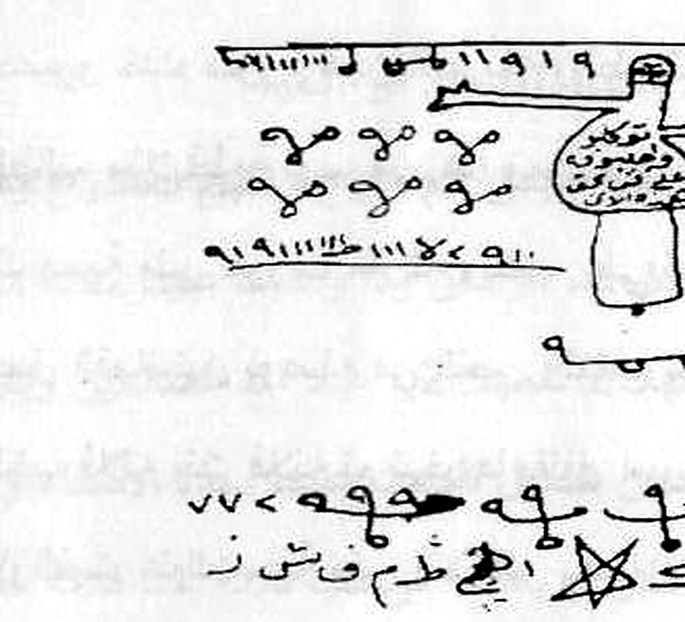

# Kitab *Asrār wa Khafāyāt fī 'Ilm al-Rūḥāniyyāt*
## Terjemahan Lengkap ke Bahasa Indonesia — Batch 4: Halaman Kitab 32–41
*(Berdasarkan foto pindaian `Picture 016.jpg` s.d. `Picture 020.jpg`)*

> **Keterangan umum terjemahan**
> - Format tiap paragraf: **Arab asli** (atas), **Latin** (tengah), **Terjemahan Indonesia** (bawah).
> - Istilah kunci hikmah yang tidak ada padanan Indonesianya dibiarkan dalam bahasa Arab dan diberi penjelasan dalam kurung.
> - Untuk beberapa kata yang cetakan/pindaian-nya samar, digunakan bacaan paling mungkin; tempat yang diragukan ditandai (?).
> - **Catatan khusus batch ini:** cetakan/pindaian halaman 32–40 tergolong kabur (banyak baris yang pecah/samar); pembacaan Latin mengikuti teks yang terbaca sebaik-baiknya dan bagian yang tidak terbaca ditandai (?).
> - Tabel huruf-angka (wafaq/ṭilāsm) dan gambar rajah TIDAK ditranskripsikan menjadi teks — disajikan sebagai gambar asli hasil crop, sesuai aturan terjemahan.

---

## Halaman 32
*(Foto `Picture 016.jpg`, halaman kanan)*

| | |
|---|---|
| 📜 **Arab** | كتاب أسرار و خفايات في علم الروحانيات ....... شيع الروحانيين الشيخ عطية عبد الحميد |
| 🔤 **Latin** | Kitāb Asrār wa Khafāyāt fī 'Ilm al-Rūḥāniyyāt …… Shaykh al-Rūḥāniyyīn al-Shaykh 'Aṭiyya 'Abd al-Ḥamīd |
| 🇮🇩 **Indonesia** | Kitab *Asrār wa Khafiyāt* dalam Ilmu Ruhaniyat… Syekh ar-Rūḥānīyīn, Syekh 'Aṭiyya 'Abdul Ḥamīd *(kepala halaman)* |

| | |
|---|---|
| 📜 **Arab** | الجيم ثم على الذي ثم النهاء ثم إلى الواو ثم إلى الزين ثم إلى الحاء ثم إلى الط |
| 🔤 **Latin** | …al-Jīm, thumma 'alā alladhī(?), thumma an-Nihā'a(?), thumma ilā l-Wāw, thumma ilā aẓ-Ẓayn(?), thumma ilā l-Ḥā', thumma ilā aṭ-Ṭā'. |
| 🇮🇩 **Indonesia** | *(Terusan dari baris terakhir halaman 31 — rangkaian perpindahan dari satu "rumah" (bayt) huruf ke "rumah" huruf lain:)* "…(ke) al-Jīm (ج), lalu kepada *al-ladhī* (?) (yang), lalu *an-Nihā'a* (?) [ujung/pangkal (?) — bacaan samar], lalu (ke) al-Wāw (و), lalu (ke) *aẓ-Ẓayn* (?) [thā' (ث) / yā' (ي) — bacaan samar], lalu (ke) al-Ḥā' (ح), lalu (ke) aṭ-Ṭā' (ط)…" |

| | |
|---|---|
| 📜 **Arab** | ودور حوله الحروف النورانية أ هم سكت حلق بصل طن حروف مفرقة |
| 🔤 **Latin** | Wa-dawwar(?) ḥawlahu l-ḥurūf an-Nawrāniyyah: ʾAlif(?), Hā(?), Mīm(?), Sīn(?), Kāf(?), Ta'(?), Ḥā(?), Lām(?), Qāf(?), Bā(?), Ṣād(?), Lām(?), Ṭā(?), Nūn(?) — ḥurūfun mufarraqa. |
| 🇮🇩 **Indonesia** | "Dan (di) sekelilingnya (diputar) huruf-huruf *nawrāniyyah* (huruf-huruf cahayawi): *ʾAlif* (?) — rangkaian huruf *alif, hā, mīm, sīn, kāf, ta' (sakt ?), ḥā, lām, qāf* — dan *bā, ṣād, lām, ṭā, nūn* (?) — huruf-huruf yang terpisah-pisah (mufarraqa)." [pengurutan huruf-hijā'iyah untuk amalan tajwīd huruf] |

| | |
|---|---|
| 📜 **Arab** | باب محبة وجلب حريق على 7 بروات |
| 🔤 **Latin** | Bāb Maḥabbah wa-Jalab Ḥarīq('alā) 7 Bruwāt(?)/Burūqāt(?). |
| 🇮🇩 **Indonesia** | BAB MAḤABBAH (MEMIKAT KASIH) DAN JALAB (PENARIKAN) — *Ḥarīq* (pembakaran/api) — ATAS 7 *BRUWĀT* (?) [bacaan samar — kemungkinan: 7 *burwāt/burqāt* (?) / 7 *ḥarqāt* (pembakaran) (?)]. |

| | |
|---|---|
| 📜 **Arab** | اكتب على سبعة أوراق وتضع كل ورقة بخور طيب وإحرقهم في النار ورقة بعد و |
| 🔤 **Latin** | Iktub('alā) sab'ati awrāq, wa-tad'(?)/wa-tuḍi'(?) kulla waraqatin bakhūran ṭayyiban, wa-aḥriqhum fī an-nāri waraqatan ba'da… |
| 🇮🇩 **Indonesia** | "Tulislah (amalan ini) pada tujuh lembar kertas, dan (siapkan) setiap lembar dengan pembakaran wewangian (bakhūr) yang baik, dan bakarlah mereka dalam api — selembar setelah (lembar) selembar…" |

| | |
|---|---|
| 📜 **Arab** | ولا تضع الورقة الثانية إلا بعد انتهاء الأولى إلى كذا حتى نهاية الورق |
| 🔤 **Latin** | Wa-lā taḍa' ash-shafḥa l-ṯāniyatan illā ba'da intihā'i l-ūlā ilā kadhā ḥattā nihāyat al-waraq. |
| 🇮🇩 **Indonesia** | "Dan janganlah kamu letakkan (bakar) lembar kedua kecuali setelah habis (terbakar) lembar pertama — demikian seterusnya (kadhā) hingga habis seluruh lembar-lembar itu." |

| | |
|---|---|
| 📜 **Arab** | الورقة الأولى : هيوش 3 طرش 3 بزطش 3 أهتمنن قشز يا روحانية هذه الأسماء بح |
| 🔤 **Latin** | Al-Warqa l-ūlā: Hayyūsh(?) 3, Ṭarash(?) 3, Bizaṭash(?) 3, Ahtaminnun(?), Qashash(?)/Qashzh(?) — yā rūḥāniyyata hādhihi al-asmā' — bi-ḥ… |
| 🇮🇩 **Indonesia** | "(Isi) lembar pertama: *Hayyūsh* (?) — 3 kali; *Ṭarash* (?) — 3 kali; *Bizaṭash* (?) — 3 kali; *Ahtaminnun* (?); *Qashzh* (?) — 'wahai ruh (rūḥāniyyah) dari nama-nama ini' — dengan hak (bi-ḥaq)…" *(terpotong, terusan di baris berikutnya)* |

| | |
|---|---|
| 📜 **Arab** | عليكم وطاعنتها لديكم واجلبوا كذا إلى كذا بالمحبة والمودة القوية الدائمة الشديدة قل |
| 🔤 **Latin** | ʿAlaykum, wa-ṭāʿatuhā(?) li-dīkum(?), wa-ajlibū kadhā ilā kadhā bi-l-maḥabbah wa-l-mawaddah al-qawiyyah ad-dā'imah asy-syadīdah. Qul. |
| 🇮🇩 **Indonesia** | "…(yang ada) di atas kalian (ʿalaykum), dan *wa-ṭāʿatuhā li-dīkum* (?) [ketaatannya bagi kalian (?) — kemungkinan: wa-ṭāʿatuhā = ketaatannya (?) ] — dan datangkanlah (ajlibū) si fulan demikian kepada si fulan demikian, dengan kecintaan (maḥabbah) dan kasih sayang (mawaddah) yang kuat, kekal, dan hebat. Ucapkan (qul):" |

| | |
|---|---|
| 📜 **Arab** | تحرق هذه الأسماء الواحا العجل الساعة |
| 🔤 **Latin** | Tuḥriq(?)/ta-ḥriq(?) hādhihi al-asmā'. Al-Wāḥā, al-'Ajl, as-Sā'ah. |
| 🇮🇩 **Indonesia** | "(Ini) membakar (tuḥriq ?) nama-nama (ini). *Al-Wāḥā* [nama khusus], *Al-'Ajl* (jam yang segera datang), *As-Sā'ah* (jam yang ditakdirkan)." |

| | |
|---|---|
| 📜 **Arab** | الورقة 2: برش 3 مرش 3 وكمال التوكيل |
| 🔤 **Latin** | Al-Warqa 2: Barash(?) 3, Mārash(?) 3, wa-Kamāl at-Tawakkul. |
| 🇮🇩 **Indonesia** | "(Isi) lembar ke-2: *Barash* (?) — 3 kali; *Mārash* (?) — 3 kali; dan *Kamāl at-Tawakkul* (kesempurnaan penyerahan diri)." |

| | |
|---|---|
| 📜 **Arab** | الورقة 3 : أيكومش 3 ارز 3 زبوش 3 وكمال التوكيل الذي فوق هو هو الورقة |
| 🔤 **Latin** | Al-Warqa 3: Aikūmash(?) 3, Arz(?) 3, Zibūsh(?) 3, wa-Kamāl at-Tawakkul alladhī fawq — huwa huwa l-warqa(?). |
| 🇮🇩 **Indonesia** | "(Isi) lembar ke-3: *Aikūmash* (?) — 3 kali; *Arz* (?) — 3 kali; *Zibūsh* (?) — 3 kali; dan *Kamāl at-Tawakkul* (kesempurnaan penyerahan diri) yang di atas (fawq) — *huwa huwa l-warqa* (?) [bacaan samar — kemungkinan: "itulah (isi) lembar-nya" (?)]" |

| | |
|---|---|
| 📜 **Arab** | فيوش 3 يوش 3 الورقة 5: طهش 3 قش 3 الورقة 6: طيوش 3 طوش |
| 🔤 **Latin** | Fiyūsh(?) 3, Yūsh(?) 3. Al-Warqa 5: Ṭahash(?) 3, Qash(?) 3. Al-Warqa 6: Ṭayyūsh(?) 3, Ṭūsh(?). |
| 🇮🇩 **Indonesia** | "*Fiyūsh* (?) — 3 kali; *Yūsh* (?) — 3 kali [kemungkinan isi lembar ke-4 — label "الورقة 4" tidak tampak di cetakan]. (Isi) lembar ke-5: *Ṭahash* (?) — 3 kali; *Qash* (?) — 3 kali. (Isi) lembar ke-6: *Ṭayyūsh* (?) — 3 kali; *Ṭūsh* (?)." |

| | |
|---|---|
| 📜 **Arab** | طوش 3 الورقة 7: مهليوش 3 مهطايش 3 ونفس التوكيل على كل ورقة |
| 🔤 **Latin** | Ṭūsh(?) 3. Al-Warqa 7: Mahallayyūsh(?)/Mahallayūsh(?), Maḥṭaysh(?)/Mahṭaysh(?), wa-nafsi t-tawakkul('alā) kulli waraqah. |
| 🇮🇩 **Indonesia** | "*Ṭūsh* (?)" — 3 kali [lanjutan lembar ke-6]. "(Isi) lembar ke-7: *Mahallayyūsh* (?), *Maḥṭaysh* (?) — masing-masing 3 kali — dan *nafs at-Tawakkul* (serupa dengan penyerahan diri) yang (sama) pada setiap lembar." |

| | |
|---|---|
| 📜 **Arab** | ٣٢ |
| 🔤 **Latin** | (nomor halaman) 32 |
| 🇮🇩 **Indonesia** | (Nomor halaman kitab: 32) |

---

## Halaman 33
*(Foto `Picture 016.jpg`, halaman kiri)*

| | |
|---|---|
| 📜 **Arab** | كتاب أسرار و خفايات في علم الروحانيات ....... شيع الروحانيين الشيخ عطية عبد الحميد |
| 🔤 **Latin** | Kitāb Asrār wa Khafāyāt fī 'Ilm al-Rūḥāniyyāt …… Shaykh al-Rūḥāniyyīn al-Shaykh 'Aṭiyya 'Abd al-Ḥamīd |
| 🇮🇩 **Indonesia** | Kitab *Asrār wa Khafiyāt* dalam Ilmu Ruhaniyat… Syekh ar-Rūḥānīyīn, Syekh 'Aṭiyya 'Abdul Ḥamīd *(kepala halaman)* |

| | |
|---|---|
| 📜 **Arab** | الصورة فجمعانهم وجعما وهو على جمعهم إذ يشاء قدرة اللم حقير بن حالة كما حيرت |
| 🔤 **Latin** | …aṣ-Ṣūrah: fa-ajma'annahum(?) wa-ja'ama(?), wa-huwa ʿalā jam'i him idh yasyā'(?), qudratu llāh(?)/qudratuhu, ḥaqīr(?)/ḥaqqan(?), bni(?) ḥālah(?), kamā ḥayara(t). |
| 🇮🇩 **Indonesia** | *(Terusan dari halaman 32 — baris ini sangat samar di pindaian:)* "…(menurut) gambar (aṣ-ṣūrah): maka kumpulkanlah mereka (fa-ajma'annahum ?) dan (Dia) mengumpulkan (ja'ama ?) — dan Dia Maha kuasa atas mengumpulkan mereka apabila Dia mau (idh yasyā' ?) — dengan kekuasaan (qudrat)-Nya — *ḥaqqan* (?) — *bni ḥālah* (?) [bacaan samar] — sebagaimana (Dia) menjadikan bingung (ḥayara)…" |

| | |
|---|---|
| 📜 **Arab** | الجملة في عقلى والطير في وقرة الولد على محبة أمه حتى يرجع إليها ومكانها الذي |
| 🔤 **Latin** | Al-Jamla(?) fī ʿaqlī(?), wa-aṭ-Ṭayr(?) fī wakrat(?)/wukrat(?) al-walad ʿalā maḥabbati ummihī ḥattā yarja'u('ilāhā), wa-makānuhū(?) alladhī. |
| 🇮🇩 **Indonesia** | "…(seperti) ungkapan (jamla ?) dalam akal (ʿaql ?) — dan burung (aṭ-Ṭayr) di sarangnya (wukrah ?) — anak burung (al-walad) karena cinta (maḥabbah) kepada induknya hingga ia kembali kepadanya — dan tempatnya (makānuhū ?) yang…" [analogi: kuncup/induk yang mendambai anaknya pulang — bacaan samar]. |

| | |
|---|---|
| 📜 **Arab** | خرج منه ونخف في الصور فإذا هم من الأجداث إلى ربهم ينسلون قاولوا ياويئنا من بعضنا |
| 🔤 **Latin** | …kharaja minhu, wa-naḫkhaf(?) fī aṣ-Ṣuwar, fa-idhā hum min al-ajdāth ilā Rabbihim yansalūn. Qālū: yā awwaynā(?)/yā awwiynā(?), min ba'ḍinā. |
| 🇮🇩 **Indonesia** | "…(ia) keluar darinya, dan *wa-naḫkhaf* (?) [bacaan samar] di dalam gambar-gambar (aṣ-ṣuwar) — maka tiba-tiba mereka keluar dari tempat-tempat persemayaman (al-ajdāth) menuju Tuhan mereka seraya merangkak (yansalūn) [Q.S. Al-Furqān (25):13] — mereka berkata: 'Wahai saudara-saudara kami (yā awwaynā ?) — (kalian) di antara kami (min ba'ḍinā)…" [citraan akhirat diabaikan ke dalam amalan — bacaan samar]. |

| | |
|---|---|
| 📜 **Arab** | من مردنا هذا ما وعد الرحمن وصق المرسلون إن كانت إلا صيغة واحدة فإذا هم جميعا |
| 🔤 **Latin** | …min mardīnā(?)/marratin(?). Hādhā mā waʿada r-Raḥmān, wa-ṣadaqa(?)/wa-ṣaqqa(?) l-mursalūn — inna kānat illā ṣiwagat(?)/ṣuwwaghat(?) wāḥidah fa-idhā hum jamī'an. |
| 🇮🇩 **Indonesia** | "…dari (antara) kami (mardīnā ?) — inilah yang dijanjikan ar-Raḥmān (Yang Maha Pengasih) dan para rasul membenarkannya (wa-ṣadaqa al-mursalūn) [Q.S. Al-Furqān (25):13] — sesungguhnya (ialah) bukan (illā) satu bentuk (ṣīghah ?), maka tiba-tiba mereka semuanya (jamī'an)…" |

| | |
|---|---|
| 📜 **Arab** | لدنيا محضرون ولا تحيوية الأرض ولا تحيوية دار ولا مكان حتى يرجع إلى زوجته فلانة |
| 🔤 **Latin** | …li-dunya? muḥḍarūn(?), wa-lā taḥyīyat(?)/taḥyawiyyat(?) al-arḍ, wa-lā taḥyīyat(?/taḥyawiyyat) dār(?), wa-lā makān(?), ḥattā yarja'u('ilā) zawjatihī fulānā. |
| 🇮🇩 **Indonesia** | "…(mereka) hadir (muḥḍarūn ?) untuk dunia (?), dan tidak ada *taḥyawiyyat* (?) [penghidupan (?) — bacaan samar] bumi, dan tidak ada *taḥyawiyyat* (?) (penghidupan) rumah, dan tidak ada tempat (makān) — hingga (ia) kembali kepada istrinya, Si Fulanah…" [baris ini sangat samar]. |

| | |
|---|---|
| 📜 **Arab** | بنت فلانة اللهم كما ردت موسي إلى امه وكما ردت يوسف بعقوق وكما ردت العفينة |
| 🔤 **Latin** | Binti fulānā. Allāhumma kamā radadta Mūsā ilā ummihī, wa-kamā radadta Yūsufa bi-ʿuqūq(?)/ilā abawayhī(?), wa-kamā radadta al-'Afinah(?)/al-'Afinayn(?). |
| 🇮🇩 **Indonesia** | "…binti Si Fulanah. Ya Allah — sebagaimana Engkau mengembalikan Mūsā (Nabi Musa) kepada ibunya [Q.S. Ṭā-Hā (20):40], dan sebagaimana Engkau mengembalikan Yūsuf (Nabi Yusuf) *bi-ʿuqūq* (?) [kepada kedua orang tuanya (?) — bacaan samar], dan sebagaimana Engkau mengembalikan *al-'Afinah* (?) [bacaan samar — kemungkinan rujukan ke kisah tertentu (?)]…" |

| | |
|---|---|
| 📜 **Arab** | على جسد أيوب أريه جلال قدرتك وقدرك يا قادر يا مقتدر يا جامع الشتناات |
| 🔤 **Latin** | ʿAlā jasad ʾAyyūb — arinā(?)/arini(?) jalāla qudratika wa-qudrik. Yā Qādir, yā Muqtadir, yā Jāmiʿ aš-Shattāt(?)/as-Syattāt(?). |
| 🇮🇩 **Indonesia** | "…(Engkau) menampakkan pada jasad ʾAyyūb (Nabi Ayyub) keagungan (jalāl) kekuasaan-Mu (qudrat) — wahai Yang Maha Kuasa (Yā Qādir), wahai Yang Maha Berkuasa (Yā Muqtadir), wahai Yang Mengumpulkan yang Tersebar (Yā Jāmiʿ aš-Shattāt)…" |

| | |
|---|---|
| 📜 **Arab** | يا جامع الناس لل يوم لا ريب فيه إن الله لا يخلف الميعاد رد كذا إلى كذا إلى مكانه الذي خرج |
| 🔤 **Latin** | Yā Jāmiʿ an-Nāsi li-l-Yawmi lā Rayba Fīh — inna Llāha lā yukhlifu l-Mīʿād. Radd kadhā ilā kadhā ilā makānihi alladhī kharaja. |
| 🇮🇩 **Indonesia** | "…wahai Yang Mengumpulkan manusia untuk Hari (al-Yawm) yang tidak ada keraguan di dalamnya [Q.S. Al-Qiyāmah (75):6] — sesungguhnya Allah tidak menepati janji-Nya (lā yukhlifu l-Mīʿād) [Q.S. Adh-Dhāriyāt (51):55]. Kembalikan si fulan demikian kepada si fulan demikian, ke tempat ia (pernah) keluar (darinya)…" |

| | |
|---|---|
| 📜 **Arab** | منه واجمع شمله بشملها إنك على كل شىء قادر الواحا قدير العجل الساعة |
| 🔤 **Latin** | …minhu, wa-ajma' shamla(?) bi-shamlihā. Innaka ʿalā kulli shay'in Qadīr. Al-Wāḥā, al-Qadīr(?), al-'Ajl, as-Sā'ah. |
| 🇮🇩 **Indonesia** | "…darinya, dan kumpulkanlah keselamatannya (shamli ?) bersama keselamatannya (shamlihā) — sesungguhnya Engkau Maha Kuasa atas segala sesuatu (inaka ʿalā kulli syay'in Qadīr). *Al-Wāḥā* [nama khusus], *al-Qadīr* (Yang Mahakuasa), *Al-'Ajl* (jam yang segera datang), *As-Sā'ah* (jam yang ditakdirkan)." |

| | |
|---|---|
| 📜 **Arab** | بخوره : لبان ذكر وكزبرة وجاوى ويكتب ويلقى في الهواء والله الذي لا رب غيره لو كان |
| 🔤 **Latin** | Bakhūruh: lubānun dhakīr wa-kuzbarah wa-jāwī. Wa-yuktubu wa-yulqā fī al-hawā', wa-Llāhi alladhī lā rabba ghayruhu law kāna. |
| 🇮🇩 **Indonesia** | "Bakurnya (kemenyannya): *lubān dhakir* (kemenyan jantan), *kuzbarah* (jintan/ketumbar), dan *jāwī* (kemenyan kayu jawa). Dan (kertas) ditulis lalu dilempar ke udara (fī al-hawā') — demi Allah yang tiada tuhan selain-Nya — seandainya (law kāna)…" |

| | |
|---|---|
| 📜 **Arab** | في عمق البحار يأتي الزوج ويرجع إلى زوجته |
| 🔤 **Latin** | …fī ʿimuqi l-baḥār(y) yātī az-zawj wa-yarja'u('ilā) zawjatih. |
| 🇮🇩 **Indonesia** | "…(sekalipun ia) di dasar (ʿimq) lautan, sang suami (az-zawj) akan datang dan kembali kepada istrinya (zawjih)." |

| | |
|---|---|
| 📜 **Arab** | باب إرسال جلب الحق |
| 🔤 **Latin** | Bāb Irsāl Jalab al-Ḥaqq |
| 🇮🇩 **Indonesia** | BAB PENGIRIMAN PENARIKAN (JALAB) YANG BENAR/SANGAT (AL-ḤAQQ) |

| | |
|---|---|
| 📜 **Arab** | إذا كان لك حق عند إنسان من مال وغير المال مثل البناء والأرضي وهو عون شديد إذا |
| 🔤 **Latin** | Idhā kāna lak ḥaqqun ʿinda insānin min māl wa-ghayri l-māl — mithl al-binā'(?)/al-bunjān(?), wa-l-arḍī(?), wa-huwa ʿawn(?)/ʿudwun(?) shadīd idhā. |
| 🇮🇩 **Indonesia** | "Jika kamu memiliki hak (ḥaqq) di sisi seorang manusia — berupa harta (māl) maupun bukan harta — seperti bangunan (al-binā' ?) dan tanah (al-arḍi ?), dan (ia) adalah orang yang sangat kuat (ʿudwun shadīd ?) — maka jika…" |

| | |
|---|---|
| 📜 **Arab** | أردت العمل به تصوم به يوم السبت برياضة كاملة وتفيطر عند المغرب ثم تأخذ جريدة |
| 🔤 **Latin** | Aradda(ta) l-ʿamala bihi, taṣum(?) bihi yawm as-sabt bi-riyāḍatin kāmilah, wa-tufṭir('inda) l-maghrib, thumma ta'khudh jarīdhatan. |
| 🇮🇩 **Indonesia** | "…kamu ingin mengamalkan (ia) — berpuasalah (ṣum) padanya (hari) Sabtu dengan puasa penuh (riyāḍah kāmilah), dan berbukalah (fṭar) pada waktu maghrib; kemudian ambil sehelai koran (jarīdah)…" |

| | |
|---|---|
| 📜 **Arab** | خضراء وتكتب عليها سورة والعاديات ضحا إلى آخرها وبعد العششاء تأخذ مجرة للفحح |
| 🔤 **Latin** | Khudrā', wa-taktubu('alayhā) sūrat(?)/sūrat al-'Ādiyāt(?), wa-Ḍuḥā(?) ilā ākhirihā; wa-ba'da l-'asyā'(?)/al-'ishyā'(?), ta'khudh majran(?)/majratan(?) li-l-faḥaḥ(?). |
| 🇮🇩 **Indonesia** | "…(kertas/koran) hijau (khuḍrā'), dan tulislah di atasnya (surat) *al-ʿĀdiyāt* (?) dan *Ḍuḥā* (?) [Q.S. Al-ʿĀdiyāt (100) dan Q.S. Adh-Dhuḥā (93) ?] sampai akhir (ākhiri)nya; dan setelah malam (al-ʿishyā' ?), ambil *majran* (?) [jenis wadah (?) — bacaan samar] untuk *al-faḥaḥ* (?) [bacaan samar]…" |

| | |
|---|---|
| 📜 **Arab** | جديدة وعليها فخم قوي وبخورك الضحى وعلى نار قوية وأنت ممسك الجريدة في يدك |
| 🔤 **Latin** | Jadīdatun(?), wa-ʿalayhā faḫmun(?) qawī, wa-bakhūruk(?)/wa-bakhūrah(?) aḍ-Ḍuḥā(?), wa-ʿalā nārin qawiyyah, wa-anta mumsiku l-jarīdhat fī yadik. |
| 🇮🇩 **Indonesia** | "…(yang) baru (jadīdah), dan di atasnya *faḫmun qawī* (?) [bacaan samar — kemungkinan: faḥmun (?) / fākhim (?) — bahan kuat (?)], dan bakurnya (bakhūrah) — *aḍ-Ḍuḥā* (?) [jam dhuha (?) — bacaan samar] — di atas api yang kuat, sedangkan kamu menggenggam (mamsik) helai koran (jarīdah) itu di tanganmu." |

| | |
|---|---|
| 📜 **Arab** | وعزم بالقرم 70 مرة حتى تتهز الجريدة في يدك فأصره لمن تريد الآن ولا تتأخر بل |
| 🔤 **Latin** | Wa-ʿazim(?) bi-l-qar'am(?)/bi-l-qira'ah(?) 70 marrah ḥattā tathhazzaza l-jarīdat fī yadik, fa-iṣṣirihi(?) li-man tardī al-ān, wa-lā tatta'akhkhar bal. |
| 🇮🇩 **Indonesia** | "…dan buatlah *'azīmah* (sumpah pengikat) dengan *al-qar'am/bi-l-qira'ah* (?) [bacaan/bekam (?) — bacaan samar] 70 kali, hingga helai koran itu bergetar (tathhazzaz) di tanganmu — maka teguhkanlah (iṣṣir ?) ia kepada orang yang kamu kehendaki (al-ān) sekarang, dan janganlah kamu terlambat, melainkan…" |

| | |
|---|---|
| 📜 **Arab** | تصرف بكل سرعة لمن تريده وإذا تأخرت بضربك بالجمر الذي هي أمك فأسمع |
| 🔤 **Latin** | Taṣarraff(?) bi-kulli sur'ah li-man tardīhu. Wa-idhā ta'akhkhar(?)/ta'akhkhara, bi-ḍarbik(?)/bi-ḍarbihi(?) bi-l-jimari(?)/jamari(?) alladhī hiya ummuk(?), fa-asma'(?). |
| 🇮🇩 **Indonesia** | "…(ia) bergerak (taṣarruf ?) dengan segala kecepatan (sur'ah) kepada orang yang kamu kehendaki. Dan jika (ia) terlambat (ta'akhkhar ?) — (lempar) dengan pukulanmu (?) dengan bara (jamār ?) yang adalah ibumu (?) [bacaan samar] — maka (ia) akan mendengar (asma' ?)…" |

| | |
|---|---|
| 📜 **Arab** | بإصراره اليه الشخص وهذا هو القسم الذي تقول 70 مرة سريع 2 رفع 2 مطلع 2 |
| 🔤 **Latin** | Bi-iṣṣārihi(?) ilayhi a-sh-shakhs. Wa-hādhā huwa al-qasm alladhī taquulu 70 marrah: Sarī' 2, Rafa' 2, Mathal 2. |
| 🇮🇩 **Indonesia** | "…dengan tekunnya (iṣṣārih ?) ia kepada orang itu (shakhs). Dan inilah sumpah (qasm) yang kamu ucapkan 70 kali: *Sarī'* (Yang Maha Cepat) — 2 kali; *Rafa'* (Yang Menaikkan) — 2 kali; *Mathal* (?) [teladan (?) — bacaan samar] — 2 kali;" |

| | |
|---|---|
| 📜 **Arab** | سلطع 2 هليع 2 ملع 2 بخافش 2 بمخفاش 2 بحق ديعج 2 دليبيوش 2 اصطاف 2 |
| 🔤 **Latin** | Silaṭaʿ(?) 2, Halyaʿ(?) 2, Maluʿ(?) 2, Bi-ḫāfash(?) 2, Bi-mukhfāsh(?) 2, bi-ḥaqqi Dīyaj(?) 2, Dalbayyūsh(?) 2, iṣṭaffa(?) 2. |
| 🇮🇩 **Indonesia** | "*Silaṭaʿ* (?)" — 2 kali; "*Halyaʿ* (?)" — 2 kali; "*Maluʿ* (?)" — 2 kali; "dengan *ḫāfash* (?)" — 2 kali; "dengan *mukhfāsh* (?)" — 2 kali; "dengan hak *Dīyaj* (?)" — 2 kali; "*Dalbayyūsh* (?)" — 2 kali; "*iṣṭaffa* (?)" [dipilih (?) — bacaan samar] — 2 kali. |

| | |
|---|---|
| 📜 **Arab** | ٣٣ |
| 🔤 **Latin** | (nomor halaman) 33 |
| 🇮🇩 **Indonesia** | (Nomor halaman kitab: 33) |

---

## Halaman 34
*(Foto `Picture 017.jpg`, halaman kanan)*

| | |
|---|---|
| 📜 **Arab** | كتاب أسرار و خفايات في علم الروحانيات ....... شيع الروحانيين الشيخ عطية عبد الحميد |
| 🔤 **Latin** | Kitāb Asrār wa Khafāyāt fī 'Ilm al-Rūḥāniyyāt …… Shaykh al-Rūḥāniyyīn al-Shaykh 'Aṭiyya 'Abd al-Ḥamīd |
| 🇮🇩 **Indonesia** | Kitab *Asrār wa Khafiyāt* dalam Ilmu Ruhaniyat… Syekh ar-Rūḥānīyīn, Syekh 'Aṭiyya 'Abdul Ḥamīd *(kepala halaman)* |

| | |
|---|---|
| 📜 **Arab** | عماع اخ ايب يا مرة وتوكل بهذا صلىك على نزلة ملكاتة الغضب على من عد |
| 🔤 **Latin** | ʿAmmaʿ(?)/ʿImmaʿ(?), akh(?)/ʾakhkh(?), 'āyib(?)/yā(?), yā(?) marrah(?), wa-tawakkal bi-hādhā ṣalāk(?)/'alā ṣalāk(?) ʿalā nuzūli malākahat(?)/malā'ikah(?) al-ghaḍaḍ(?)/al-ghaḍab(?) ʿalā man ʿada(?). |
| 🇮🇩 **Indonesia** | *(Terusan sumpah (qasm) dari halaman 33 — baris ini sangat samar di pindaian:)* "*ʿAmmaʿ* (?) — *akh/ʾakhkh* (?) — *ʾāyib* (?) — wahai (yā) marrah (?) [kemurungan (?) — bacaan samar] — dan bertawakallah dengan ini (bi-hādhā) — *ṣalāk* (?) [bacaan samar] — atas turun (nuzūl) para malaikat (malā'ikah) amarah (al-ghaḍab ?) kepada orang yang melawan (ʿada)…" |

| | |
|---|---|
| 📜 **Arab** | قسي يشر بك بالنة كنكاما خر من السماء فتخطفه الطير أو تهوي به الريح فتخ |
| 🔤 **Latin** | Qasī(?)/Qasiyya(?), yaṣhiru(?) bi-ka(?)/bi-l-qā? bi-l-qanah(?)/bi-l-qanā'(?), ka-kanmā kharra min as-samā'i fa-takhtafuhū aṭ-Ṭayr aw tahwī bihi ar-rīḥ, fa-takh… |
| 🇮🇩 **Indonesia** | "*Qasī* (?) — *yaṣhiru bi-ka/bi-l-qanā'* (?) [bacaan samar] — sebagaimana (ka-kanmā) (ia) jatuh dari langit, maka burung-burung akan mencabutnya (takhtafuhū aṭ-ṭayr), atau angin akan menerjangnya (tahwī bihi ar-rīḥ), maka (fa-takh…)…" [pengutipan Q.S. Az-Zukhruf (43):18 — baris terpotong]. |

| | |
|---|---|
| 📜 **Arab** | في مكان سحيق الوحاح العجل الساعة ( وهذا هو الإصراف بكياش 2 عبوش 2 بخ 2 توكل |
| 🔤 **Latin** | …fī makānin saḥīq. Al-Waḥāḥ(?), al-'Ajl, as-Sā'ah. (Wa-hādhā huwa al-iṣrāf(?): Bi-kiyāsh(?) 2, ʿAbbūsh(?) 2, bi-ḫ(?)/bikh(?) 2, tawakkal. |
| 🇮🇩 **Indonesia** | "…di tempat yang jauh (makān saḥīq). *Al-Waḥāḥ* (?) [nama], *Al-'Ajl* (jam yang segera datang), *As-Sā'ah* (jam yang ditakdirkan). (Dan inilah) *al-Iṣrāf* (?) [penyerahan/penyia-nya (?) — bacaan samar]: "dengan *Biyāsh* (?)" — 2 kali; "*ʿAbbūsh* (?)" — 2 kali; "dengan *ḫ (?)" — 2 kali; (serahkan) tawakkal." |

| | |
|---|---|
| 📜 **Arab** | بكذا ما أمرتك به بحق هذه الاسماء بكياش 2 عبوش 2 بخ 2 توكل |
| 🔤 **Latin** | Bi-kadhā mā amartuka bihi bi-ḥaqqi hādhihi al-asmā': Bi-kiyāsh(?) 2, ʿAbbūsh(?) 2, bi-ḫ(?) 2, tawakkal. |
| 🇮🇩 **Indonesia** | "Dengan si fulan demikian (bi-kadhā) — apa yang telah kuperintahkan kepadamu (mā amartuka bihi) — dengan hak nama-nama ini: *Biyāsh* (?)" — 2 kali; "*ʿAbbūsh* (?)" — 2 kali; "*bi-ḫ* (?)" — 2 kali; (serahkan) tawakkal. |

| | |
|---|---|
| 📜 **Arab** | السيد مهجنائيل بأصراف مرة إلى كذا واجب يا مرة و افعل ما أمرتك به بحق هذ |
| 🔤 **Latin** | As-Sayyid Mahyanā'īl(?)/Mahjanā'īl(?), bi-iṣrāf(?)/bi-ṣirāf(?) marrah(?) ilā kadhā — wāajib(?)/wājib(?) yā marrah(?), wa-if'ala mā amartuka bihi bi-ḥaqqi hādh… |
| 🇮🇩 **Indonesia** | "…(dengan perintah) Sayyid *Mahyanā'īl/Mahjanā'īl* (?) (Tuan *Mahyanā'īl* ?) — dengan *iṣrāf/ṣirāf* (?) (?), sekali (marrah ?) kepada si fulan demikian — *wājib* (?) [wajib (?) — bacaan samar] — wahai marrah (?) — dan lakukanlah (if'ala) apa yang telah kuperintahkan kepadamu (mā amartuka bihi) dengan hak ini (bi-ḥaqqi hādh…)…" |

| | |
|---|---|
| 📜 **Arab** | الاسماء ولا تخالف بنار السموع هيا هيا الوحاح العجل الساعة |
| 🔤 **Latin** | …al-Asmā', wa-lā takhālif(?)/takhālaf(?) bi-nāri s-Samuʿ(?)/as-Samuʿ(?). Hayya, hayya. Al-Waḥāḥ(?), al-'Ajl, as-Sā'ah. |
| 🇮🇩 **Indonesia** | "…(dengan hak) nama-nama itu (al-asmā'), dan janganlah kamu bermaksiat (takhālaf ?) terhadap api (nār) *as-Samuʿ* (?) [bacaan samar] — maju, maju (hayya hayya)! *Al-Waḥāḥ* (?), *Al-'Ajl* (jam yang segera datang), *As-Sā'ah* (jam yang ditakdirkan)." |

| | |
|---|---|
| 📜 **Arab** | باب عقد نوم ومجبة واعلم حبيبك لم ينم قط |
| 🔤 **Latin** | Bāb ʿAqd Nawm wa-Maḥabbah(?), wa-a'lam: ḥabībuka lam yannam qaṭṭ. |
| 🇮🇩 **Indonesia** | BAB PENGIKATAN (ʿAqd) TIDUR DAN MAḤABBAH (MEMIKAT KASIH) — ketahuilah: kekasihmu (ḥabībuka) tidak akan pernah tidur sama sekali (lam yannam qaṭṭ). |

| | |
|---|---|
| 📜 **Arab** | إذا اردت العمل به اتعمل به شخص من ورق مثل المطلوب وتكتب على رأسه فلان بن فا |
| 🔤 **Latin** | Idhā aradda(ta) l-ʿamala bihi, fa-taʿmal(?) bihi shakhsan min waraq mithl al-maṭlūb, wa-taktubu('alā) ra'sihī: Falān ibna fa… |
| 🇮🇩 **Indonesia** | "Jika kamu ingin mengamalkan (ia) — buatlah (taʿmal ?) darinya (dari kertas) sebuah bentuk orang (shakhs) seperti orang yang dikehendaki (al-maṭlūb), dan tulislah di kepalanya (ra'sih): 'Si Fulan bin Si Fu[lanah]…' *(terpotong, terusan di baris berikutnya)*" |

| | |
|---|---|
| 📜 **Arab** | واكتب على جبهته ذا نقر في النقر على يده اليمنى غلت أيديهم وعلى يده اليسر |
| 🔤 **Latin** | Wa-iktub('alā) jabhatihī: dha(?)/dhā(?), naqqar(?)/an-naqqar(?); fī n-naqqār(?)/annaqqār(?) ʿalā yadihi l-yumnā: Ghalat Aydīhim(?); wa-ʿalā yadihi l-yus… |
| 🇮🇩 **Indonesia** | "…dan tulislah di dahinya (jabhatih): *dhā/naqqar* (?) [bacaan samar] — di (bagian) *annaqqār* (?) — di tangan kanannya (yaduhu l-yumnā): 'telah terikat (ghalat) tangan-tangan mereka (Ghalat Aydīhim) [Q.S. Al-Mā'idah (5):38]'; dan di tangan kirinya (yaduhu l-yus…)…" |

| | |
|---|---|
| 📜 **Arab** | قدر الوش وعلى رجليه ميضرون وعلى الشمال كشطورش كشتروش وط |
| 🔤 **Latin** | Qadr(?)/Qaddar(?), al-wash(?) — wa-ʿalā rajlayhi Mayḍurūn(?)/Māyḍurūn(?), wa-ʿalā aṣ-Ṣimāl(?)/aṣ-Ṣimā'il(?) Kaṣṭūrash(?)/Kaṣṭūrash(?), Kaṣtarūsh(?), wa-ṭ… |
| 🇮🇩 **Indonesia** | "…(sebesar) *qadr* (?) [bacaan samar] — dan di kakinya (rajlayh): *Mayḍurūn* (?) [yang diputar/digulung (?) — bacaan samar]; dan di (bagian) kiri (aṣ-ṣimāl ?) — *Kaṣṭūrash* (?), *Kaṣtarūsh* (?), dan *ṭ (?)" *(terpotong, terusan di baris berikutnya)*" |

| | |
|---|---|
| 📜 **Arab** | صدره الخناسيل الذي يوسوس في صدور الناس ثم تدق مسمار في صدر الشخص وق |
| 🔤 **Latin** | Ṣadrah(?)/ṣadr(ihi) l-khānīs(?)/al-khānāsīl(?): alladhī yuwaswisu fī ṣudūri n-nās; thumma tadqiq musmāran fī ṣadri a-sh-shakhs, wa-qa… |
| 🇮🇩 **Indonesia** | "…di dadanya (ṣadr(ih)): (para) *al-Khānīs/Al-Khānāsīl* (?) [bisikan-setan (?) — kemungkinan rujukan ke Q.S. An-Nās (114):6: wa-min asy-syayāṭīni al-khinānāt… wa-shayṭānin yuwaswisūna fī ṣudūri n-nās] — yang membisikkan di dada-dada manusia; kemudian (kamu) memakukan (daqiq) sepancang (musmār) di dada orang (shakhs) itu, dan *wa-qa (?)" *(terpotong)*" |

| | |
|---|---|
| 📜 **Arab** | فتله حبيب 7 سبعة الوان وشعرة من المطلوب وتقراءة عليه سورة الجن السبعة والبركة |
| 🔤 **Latin** | Fattalah(?) ḥabīb(?), 7 — sab'u al-walūn(?)/al-alwān(?), wa-syaʿratan min al-maṭlūb, wa-taqra'u('alayhī) sūrat al-Jinn, al-sab'ah(?), wa-l-barakah. |
| 🇮🇩 **Indonesia** | "…(buatlah) *fattalah* (?) [benda/bulatan (?) — bacaan samar] *ḥabīb* (?) — 7 — *sab'u al-alwān* (tujuh warna) dan sehelai rambut (syāʿrah) dari orang yang dikehendaki; dan bacakanlah (taqra') di atasnya (surat) *al-Jinn* (Q.S. Al-Jinn 72), (yang) tujuh (?) (al-sab'ah ?), dan (dengan) keberkahan (al-barakah)…" |

| | |
|---|---|
| 📜 **Arab** | 21 مرة البخور عمل وهو خردل ولبان ذكر وكزبرة وبعد تمام العمل والعزيمه |
| 🔤 **Latin** | 21 marrah. Al-Bakhūru ʿamal(?)/ʿamil(?), wa-huwa khurdl(?)/khurda(?), wa-lubānun dhakīr, wa-kuzbarah; wa-ba'da tamām al-ʿamal wa-l-'azīmah. |
| 🇮🇩 **Indonesia** | "…21 kali. Bakurnya (bakhūr) adalah *ʿamal/ʿamil* (?) [bacaan samar] — yaitu *khurdl/khurda* (?) [gulai (?) — kemungkinan: khārdal (mostarda) (?) — bacaan samar] dan *lubān dhakir* (kemenyan jantan) dan *kuzbarah* (jintan); dan setelah sempurna (tamām) amalan dan *'azīmah* (sumpah pengikat) itu." |

| | |
|---|---|
| 📜 **Arab** | تغرق شخص بالنار وهو معلق في الحائط والمسمار مدفوق فاته مادام مكانه لا |
| 🔤 **Latin** | Taḥriq(?) a-sh-shakhs bi-n-nāri, wa-huwa muʿallaqun fī l-ḥā'iṭ(?)/al-ḥa'iṭ(?), wa-l-musmāru madfūq(?)/madfūq(?), fa-attah(?) mā dāma makānahu lā. |
| 🇮🇩 **Indonesia** | "…bakarlah (taḥriq ?) orang (shakhs) itu dengan api, sedangkan (bentuk kertas) itu tergantung (muʿallaq) di dinding (al-ḥā'iṭ) dan pancang (musmār) itu tertancap (madfūq ?) — maka (ia) akan datang (fa-attah ?) selama (mā dāma) di tempatnya (makānuh) — jangan (lā)…" [baris sangat samar]. |

| | |
|---|---|
| 📜 **Arab** | ولا تفعبه إلا في الشأن الشديد فهو مجرب ومعمول به وأصبر به من الشاء وقت الشدة |
| 🔤 **Latin** | Wa-lā tufi'bih(?)/taf'alah(?) illā fī aṣ-ṣyāni l-syadīd — fa-huwa mujarrab wa-ma'mūlun bihi, wa-aṣbir(?) bihi min aṣ-Ṣyā'(?)/al-ayyām(?) waqta l-syiddah. |
| 🇮🇩 **Indonesia** | "…dan janganlah kamu melakukannya (taf'alah ?) kecuali dalam perkara yang berat (aṣ-ṣyān asy-syadīd) — maka (ia) telah teruji (mujarrab) dan biasa dilakukan (ma'mūlu bih), dan bersabarlah (aṣbir ?) dengan (mengamalkannya) dari *aṣ-Ṣyā'* (?) [bacaan samar — kemungkinan: min al-ayyām (?) ] pada waktu berat (waqt asy-syiddah)." |

| | |
|---|---|
| 📜 **Arab** | تصرف خاص للحية والجلب والتهميج |
| 🔤 **Latin** | Taṣarruf(?)/Taṣrīf(?) ṣābiḥ(?)/ṣābir(?)/ṣāriḥ(?) li-l-Ḥayāh(?)/al-Ḥayyah(?), wa-l-Jalab, wa-t-Taḥwīj. |
| 🇮🇩 **Indonesia** | TATAPAN/TINDAKAN (TAṢARRUF) KHUSUS (*ṣāḥiḥ/ṣāriḥ* ? — bacaan samar) UNTUK KEHIDUPAN (AL-ḤAYĀH ?), PENARIKAN (JALAB), DAN TAḤWĪJ (PENGIKATAN/PEMAKAI). |

| | |
|---|---|
| 📜 **Arab** | فإذا اردت جلب و الحبة للسارق والمطلوب والغائب والحاضر وغيره فقطص صور |
| 🔤 **Latin** | Fa-idhā aradda(ta) jalaban wa-l-ḥubbah(?) li-s-sāriq(?)/al-maṭlūb(?), wa-l-ghā'ib(?), wa-l-ḥāḍir(?), wa-ghayrihī — fa-qṭiṭṣ(?) ṣūran. |
| 🇮🇩 **Indonesia** | "Maka jika kamu ingin penarikan (jalab) dan *al-ḥubbah* (?) [kasih (?)] kepada orang yang dicuri (barangnya) (as-sāriq ?) dan orang yang dikehendaki (al-maṭlūb) dan orang yang tiada (al-ghā'ib ?) dan orang yang hadir (al-ḥāḍir ?) dan selain mereka — maka guntinglah (qṭiṭṭa ?) sebuah gambar (ṣūrah)…" |

| | |
|---|---|
| 📜 **Arab** | شخص من ورق كاملة الأطراف واكتب عليها العزيمه الاتية والتوكيل على اسم السا |
| 🔤 **Latin** | …shakhsan min waraq kāmilati l-aṭrāf(?), wa-iktub('alayhā) al-'azīmah allatīyah, wa-t-tawakkil(?) ʿalā ismi s-Sā… |
| 🇮🇩 **Indonesia** | "…(gambar) orang (shakhs) dari kertas yang utuh tepinya (kāmilat al-aṭrāf ?), dan tulislah di atasnya *'azīmah* (sumpah pengikat) berikut ini, dan (ucapan) penyerahan (at-Tawakkil ?) atas nama si Sa… *(terpotong — kemungkinan: as-Sāriq (si pencuri) / as-Saḥr (?))*" |

| | |
|---|---|
| 📜 **Arab** | والطالب والمطلوب وعلاقه بخيط حبر احمر مع شعر المطلوب ان وجد وعلاقه ف |
| 🔤 **Latin** | …wa-aṭ-Ṭālib, wa-al-Maṭlūb, wa-'alāqah(?) bi-khayṭ ḥibr(?)/ḥabarin(?/ḥabrin) aḥmar, ma'a sya'ri l-maṭlūb in wujida, wa-'alāqah(?)/wa-'alāqata(?) f… |
| 🇮🇩 **Indonesia** | "…dan (nama) aṭ-Ṭālib (pencari) dan (nama) al-Maṭlūb (yang dikehendaki) — dan (ikatkan) hubungan ('alāqah ?) dengan seutas benang (khaṭṭ) tinta (ḥibr/ḥibrin) merah, bersama rambut orang yang dikehendaki (in wujida — jika ada) — dan (ikatkan) hubungan ('alāqah ?) di f… *(terpotong, terusan di halaman 35)*" |

| | |
|---|---|
| 📜 **Arab** | ٣٤ |
| 🔤 **Latin** | (nomor halaman) 34 |
| 🇮🇩 **Indonesia** | (Nomor halaman kitab: 34) |

---

## Halaman 35
*(Foto `Picture 017.jpg`, halaman kiri)*

| | |
|---|---|
| 📜 **Arab** | كتاب أسرار و خفايات في علم الروحانيات ....... شيع الروحانيين الشيخ عطية عبد الحميد |
| 🔤 **Latin** | Kitāb Asrār wa Khafāyāt fī 'Ilm al-Rūḥāniyyāt …… Shaykh al-Rūḥāniyyīn al-Shaykh 'Aṭiyya 'Abd al-Ḥamīd |
| 🇮🇩 **Indonesia** | Kitab *Asrār wa Khafiyāt* dalam Ilmu Ruhaniyat… Syekh ar-Rūḥānīyīn, Syekh 'Aṭiyya 'Abdul Ḥamīd *(kepala halaman)* |

| | |
|---|---|
| 📜 **Arab** | معلق ووضع البخور بجانبها وأقرأ العزيمه الآتية بنفسها 71 مرة ثم علقلها للريح فان |
| 🔤 **Latin** | Muʿallaq(?), wa-waḍaʿa l-bakhūra bi-jānihā, wa-aqra'a l-'azīmah allatīyah bi-nafsihā(?)/bi-naṣsihā(?) 71 marrah, thumma 'allaqahā(?) li-r-rīḥ — fa-inn… |
| 🇮🇩 **Indonesia** | "…(kertas) digantung (muʿallaq), dan letakkanlah pembakaran wewangian (bakhūr) di sisinya, dan bacakanlah *'azīmah* (sumpah pengikat) yang berikut ini dengan naskahnya sendiri (bi-naṣsihā ?) 71 kali, kemudian gantungkanlah ia ('allaqahā ?) di angin (riḥ) — maka sesungguhnya (fa-inn…)…" |

| | |
|---|---|
| 📜 **Arab** | المطلوب لا يبتن الا مسافة الطريق مجرث صحيحو اليكم العزيمه باسم الملك الودود |
| 🔤 **Latin** | …al-Maṭlūb lā yabtaʿid(?)/yabtan(?) illā masāfat aṭ-Ṭarīq(?). Mujarrab(?)/mujrass(?), ṣaḥīḥ — wa-ilaykum al-'azīmah bi-ismi l-Malaki l-Wadūd. |
| 🇮🇩 **Indonesia** | "…orang yang dikehendaki (al-Maṭlūb) tidak akan (ia) pergi jauh (yabtaʿid ?) kecuali sejauh jarak jalan (masāfat aṭ-Ṭarīq). (Ia) telah teruji (mujarrab ?) dan benar (ṣaḥīḥ) — dan berikut ini *'azīmah* (sumpah pengikat) (bagi) kalian (ilaykum) dengan nama *al-Malik al-Wadūd* (Sang Raja yang Mahamencintai)." |

| | |
|---|---|
| 📜 **Arab** | الجامع المعيد مقالب القلوب والابصار عالم الغيوب الذي قال وقوله الحق واضطغ عليهم |
| 🔤 **Latin** | Al-Jāmiʿ, al-Muʿīd, Muqālib al-Qulūb wa-l-Abṣār, ʿĀlim al-Ghuyūb — alladhī qāla(?), wa-qawluhu l-Ḥaqq(?), wa-iḍṭagh(?)/wa-iḍḍagh(?)(ʿalayhim). |
| 🇮🇩 **Indonesia** | "(Yaitu nama-nama): *Al-Jāmiʿ* (Yang Mengumpulkan), *Al-Muʿīd* (Yang Mengembalikan), *Muqālib al-Qulūb wa-l-Abṣār* (Pembolak-balik hati dan penglihatan [Q.S. Āl ʿImrān (3):26, 27]), *ʿĀlim al-Ghuyūb* (Yang Mengetahui yang gaib) — Dzat yang telah berfirman (qāla ?), dan firman-Nya adalah kebenaran (wa-qawluhū l-ḥaqq ?), dan *wa-iḍṭagh ʿalayhim* (?) [bacaan samar — kemungkinan: 'wa-iḍhaṭṭa ʿalayhim' (dan Dia menimpakan kepada mereka) (?)]" |

| | |
|---|---|
| 📜 **Arab** | الارض بما رحبت وضافت عليهم والظلم ان ملجا من الله الا اليه ضرتهم بينهم |
| 🔤 **Latin** | …al-Arḍa bi-mā raḥibath(?), wa-iḍhāfath(?)/wa-iḍhāfath(?)(ʿalayhim), wa-al-Ẓulm(?). Innā malja'an(?)/maljā'an(?) min Llāhi illā ilayhi? ḍarathum(?)/ḍaratha('baynahum). |
| 🇮🇩 **Indonesia** | "…bumi (al-arḍ) seluas apa pun (raḥibat ?), dan (ia) menambahkan (iḍhāfath ?) kepada mereka — dan kezaliman (aẓ-Ẓulm ?) — sesungguhnya tiada tempat perlindungan (malja') dari (ketakutan kepada) Allah selain kepada-Nya (illā ilayhi ?) — *ḍarathum baynahum* (?) [bacaan samar — kemungkinan: 'wa-dharathum baynahum' (dan Dia menimpakan mereka di antara mereka) (?)]" [baris sangat samar — kemungkinan campuran antara potongan ayat (Q.S. An-Nisā' 4:78: fa-inna malaja'a min Llāhi wa-r-rasūli…) dan teks amalan]. |

| | |
|---|---|
| 📜 **Arab** | يسور له باب فيه الرحمة وظاهره من قبله العذاب توكل ياميمون الطيار ويا ميمون |
| 🔤 **Latin** | …yusawwir(?)/yasaṭur(?) lahu bābun fīhi r-Raḥmah(?), wa-ẓāhiruhū min qablihi l-ʿadhāb. Tawakkal: yā Maimūn aṭ-Ṭayyār(?), wa-yā Maimūn… |
| 🇮🇩 **Indonesia** | "…(bagi) orang yang (diikatkan) itu dibukakan (yusawwir ?) sebuah pintu (bābun) yang di dalamnya ada rahmat (ar-Raḥmah), dan tampak (ẓāhiruhū) dari hadapannya azab (al-ʿadhāb) [Q.S. Al-Kahf (18):102, 20:130 — diabaikan ke dalam amalan] — (serahkan) tawakkal: wahai Maimūn aṭ-Ṭayyār (?) (Maimūn yang terbang ?), dan wahai Maimūn…" |

| | |
|---|---|
| 📜 **Arab** | الغواص ويا ميمون الاسود ويا ميمون الازرق ويا ميمون اخ النوح صاحبى السيفاف |
| 🔤 **Latin** | …al-Ghāwaṣ(?)/al-Ghāṣṣ(?), wa-yā Maimūn al-Aswad, wa-yā Maimūn al-Azraq(?), wa-yā Maimūn akh(?) an-Nūḥ(?)/a-Nūḥ(?), Ṣāḥibay(?) aṣ-Ṣayfāf(?)/aṣ-Ṣāfiyā(?). |
| 🇮🇩 **Indonesia** | "…(wahai Maimūn) al-Ghāwaṣ (?) [yang menyelam (?) — bacaan samar]; dan wahai Maimūn al-Aswad (Maimūn si Hitam); dan wahai Maimūn al-Azraq (?) (Maimūn si Biru); dan wahai Maimūn saudara (akh ?) an-Nūḥ (?) (Nuh ?) — *Ṣāḥibay aṣ-Ṣayfāf/aṣ-Ṣāfiyā* (?) [bacaan samar]." |

| | |
|---|---|
| 📜 **Arab** | وتوكلا واجلبوا واخطفو ابائكم القوية فلانة بنت فلانة ابن فلان ونكاح ووصال وعشق ومودة وطاعة |
| 🔤 **Latin** | Wa-tawakkalū(?), wa-ajlibū, wa-ikhtafū(?)/wa-khuthfū(?) abā'ikum(?)/abā'ikum(?) al-qawiyya(?)/al-qawīyah(?) — Fulānatan binti fulānā, [wa] ibna falān(?): wa-nikāḥ, wa-waṣal, wa-'ishq, wa-mawaddah, wa-ṭā'ah. |
| 🇮🇩 **Indonesia** | "…dan bertawakallah (tawakkalū ?)! Dan datangkanlah (ajlibū)! Dan cabutlah/sambarlah (ikhtafū ?) — *abā'ikumu l-qawiyyah* (?) [bacaan samar — kemungkinan: 'wa-abā'ikum l-qawīyah' (dan orang-orang kuat kalian) (?)] — (datangkan) Si Fulanah binti Si Fulanah (dan) Si Fulan: (datangkanlah) pernikahan (nikāḥ), hubungan (waṣal), kemesraan ('ishq), kasih sayang (mawaddah), dan ketaatan (ṭāʿah)!" |

| | |
|---|---|
| 📜 **Arab** | والوقت والساعة هذهبقادة عزيز فلا عزيز غيره ولا اعز منه وبحق انمو 2 هانج 2 |
| 🔤 **Latin** | Wa-l-waqt(?), wa-s-sā'ah. Hādhihi bi-qā'ida(?)/bi-qiyādat(?)/bi-qādat(?) ʿAzīz(?), fa-lā ʿazīza ghayruh, wa-lā aʿazza minhu. Wa-bi-ḥaqqi Anmū(?) 2, Hānaj(?) 2. |
| 🇮🇩 **Indonesia** | "…dan waktu (al-waqt), dan jam (as-sā'ah). Ini (hādhih) dengan pemimpin (qā'ida ?) *ʿAzīz* (?) (Yang Mahamulia) — maka tidak ada Yang Mulia selain-Nya (fa-lā ʿazīza ghayruh), dan tidak ada yang lebih mulia daripada-Nya (wa-lā aʿazza minhu). Dan dengan hak *Anmū* (?)" — 2 kali; "*Hānaj* (?)" — 2 kali. |

| | |
|---|---|
| 📜 **Arab** | باشمخ شمش شمش شامخ شموخ 2 اشخ كمشخ كاخ اشخ احيبوا وتوكلا وارجلو و |
| 🔤 **Latin** | Bi-Shamkh(?)/Bi-Ḥamkh(?), Shamash(?), Shamash(?), Shāmikh(?), Shamūkh(?) 2, Ashkh(?)/Ashkh(?), Kamaṣkh(?), Kākh(?), Ashkh(?), aḥbibū(?)/aḥhibū(?), wa-tawakkalū(?), wa-arjalū(?)/wa-arghalū(?), wa… |
| 🇮🇩 **Indonesia** | "Dengan *Shamkh* (?), *Shamash* (?), *Shamash* (?), *Shāmikh* (?) (Yang Tinggi), *Shamūkh* (?)" — 2 kali; "*Ashkh* (?)", "*Kamaṣkh* (?)", "*Kākh* (?)", "*Ashkh* (?)", "cintailah (aḥbibū ?)" — dan bertawakkallah (tawakkalū ?), dan *wa-arjalū/wa-arghalū* (?) [bacaan samar], dan…" |

| | |
|---|---|
| 📜 **Arab** | بتهميج واحرق قلب وقواد وخطوف عقل وروحانية وجلب واحضر المسمي فلانة بنت فلانة |
| 🔤 **Latin** | Bi-taḥwīj(?)/tahyīj(?), wa-aḥriq(?)/wa-ḥarriq(?) qalban wa-qawād(?), wa-khaṭūf(?) ʿaqlin, wa-rūḥāniyyah, wa-jalab(?)/wa-ajlib(?), wa-aḥḍir(?/aḥḍir?) a-masmā(?)/al-masmā'(?): Fulānatan binti fulānā. |
| 🇮🇩 **Indonesia** | "…dengan taḥwīj (pengikatan) — dan bakarkanlah (aḥriq ?) hati (qalbun) dan *qawād* (?) [pengaruh (?) — bacaan samar], dan (cabut) *khaṭūf* (?) (kesambitan) akal (ʿaqlun), dan (buatlah) keruhanian (rūḥāniyyah), dan penarikan (jalab) — dan hadirkanlah (aḥḍir ?) yang bernama (al-masmāʾ ?): Si Fulanah binti Si Fulanah…" |

| | |
|---|---|
| 📜 **Arab** | صاحبة هذه الصورة إلى محبة وطاعة ومودة وعشق ووصال ونكاح فلان ابن |
| 🔤 **Latin** | Ṣāḥibata hādhihi aṣ-Ṣūrah ilā maḥabbatin wa-ṭā'ah wa-mawaddah wa-'ishq wa-waṣal wa-nikāḥ — Falān ibna… |
| 🇮🇩 **Indonesia** | "…(ia) pemilik (ṣāḥibah) gambar (ṣūrah) ini — menuju (kepada) kecintaan (maḥabbah), ketaatan (ṭāʿah), kasih sayang (mawaddah), kemesraan ('ishq), hubungan (waṣal), dan pernikahan (nikāḥ) — (dengan) Si Fulan bin Si…" |

| | |
|---|---|
| 📜 **Arab** | فلانة واتوا بها واحضروها اليه في بيته ومنزله وعلى فراشه مسرعين في الوقت |
| 🔤 **Latin** | …Fulānā. Wa-ātū bihā, wa-aḥḍirūhā ilayhi fī baytih, wa-manzilih, wa-ʿalā farāshih, musraʿīna fī l-waqt… |
| 🇮🇩 **Indonesia** | "…binti Si Fulanah. Dan bawakanlah ia (wāṭū bihā), dan hadirkanlah ia (aḥḍirūhā) kepadanya — di rumahnya (baytih), dan di kediamannya (manzilih), dan di atas ranjangnya (farāshih) — dalam keadaan bergegas (musraʿīna) pada waktu (al-waqt)…" |

| | |
|---|---|
| 📜 **Arab** | والساعة هذ بحق يا مه دعوتكم واقسمت به عليكم وبحق قال عفريت من الجن إلى |
| 🔤 **Latin** | …wa-s-sā'ah. Hādhā bi-ḥaqqi yā Mah(?)/Mah(?): da'wātikum(?)/da'awtikum(?), wa-aqsamtu bihi('alaykum), wa-bi-ḥaqqi qāla(?)/qāla(?) ʿafarītan min al-Jinn ilā. |
| 🇮🇩 **Indonesia** | "…dan jam (as-sā'ah). Ini (hādhā) dengan hak wahai *Mah* (?) [nama khusus] — (ini adalah) permohonan kalian (daʿwātikum ?), dan aku bersumpah dengannya (aqsamtu bihi) atas kalian — dan dengan hak (bi-ḥaqqi) apa yang dikatakan (qāla ?) oleh seekor *ʿafarīt* (perih) dari kalangan jin (al-jinn) — kepada (ilā)…" |

| | |
|---|---|
| 📜 **Arab** | طرفك العجل 2 الوحا 2 بارك الله فيكم وعليكم . تمت هذه العزيمه المباركة |
| 🔤 **Latin** | Ṭarfulak(?)/ṭarfih(?), al-'Ajl 2, al-Wāḥā 2. Bārakallāhu fīkum wa-'alaykum. Tammat hādhih al-'azīmah al-Mubārakah. |
| 🇮🇩 **Indonesia** | "…(di) batas (ṭarf) kamu (?) — *Al-'Ajl* (jam yang segera datang) — 2 kali; *Al-Wāḥā* [nama khusus] — 2 kali. Semoga Allah memberkati kamu dan beserta kamu. Telah selesai *'azīmah* (sumpah pengikat) yang penuh berkah ini." |

| | |
|---|---|
| 📜 **Arab** | واسال الله لي ولكم التوفيق منه هو مقالب القلوب والابصار عالم الغيب والشهادة هو |
| 🔤 **Latin** | Wa-as'al Llāha lī wa-lakum at-Taufīq minhu — huwa Muqālib al-Qulūb wa-l-Abṣār, ʿĀlim al-Ghaybi wa-ṣy-Syahādah — huwa. |
| 🇮🇩 **Indonesia** | "Dan aku memohon kepada Allah (as'al Llāh) taufik (at-Taufīq) bagiku dan bagi kalian dari (ridha)-Nya — Dia (lah) Pembolak-balik hati dan penglihatan (muqālib al-qulūb wa-l-abṣār), Yang Mengetahui yang gaib (al-ghayb) dan yang zahir (aṣ-ṣyahādah) [Q.S. Al-Baqarah (2):284] — Dia…" |

| | |
|---|---|
| 📜 **Arab** | الرحمن الرحيم |
| 🔤 **Latin** | Ar-Raḥmān ar-Raḥīm |
| 🇮🇩 **Indonesia** | "(Yaitu) ar-Raḥmān (Yang Maha Pengasih), ar-Raḥīm (Yang Maha Penyayang)." |

| | |
|---|---|
| 📜 **Arab** | باب محبة وعقد نوم لأيام حبيبك ابتدا |
| 🔤 **Latin** | Bāb Maḥabbah wa-ʿAqd Nawm li-Ayyām(?)/li-Ayyām(?), ḥabībika ibtidā'. |
| 🇮🇩 **Indonesia** | BAB MAḤABBAH (MEMIKAT KASIH) DAN PENGIKATAN (ʿAqd) TIDUR — UNTUK (HARI-HARI) KECINTA-MU (ḤABĪBIKA) — MULAI (IBTIDĀ') *(judul sub-bagian amalan)* |

| | |
|---|---|
| 📜 **Arab** | ٣٥ |
| 🔤 **Latin** | (nomor halaman) 35 |
| 🇮🇩 **Indonesia** | (Nomor halaman kitab: 35) |

---

## Halaman 36
*(Foto `Picture 018.jpg`, halaman kanan)*

| | |
|---|---|
| 📜 **Arab** | كتاب أسرار و خفايات في علم الروحانيات ....... شيع الروحانيين الشيخ عطية عبد الحميد |
| 🔤 **Latin** | Kitāb Asrār wa Khafāyāt fī 'Ilm al-Rūḥāniyyāt …… Shaykh al-Rūḥāniyyīn al-Shaykh 'Aṭiyya 'Abd al-Ḥamīd |
| 🇮🇩 **Indonesia** | Kitab *Asrār wa Khafiyāt* dalam Ilmu Ruhaniyat… Syekh ar-Rūḥānīyīn, Syekh 'Aṭiyya 'Abdul Ḥamīd *(kepala halaman)* |

| | |
|---|---|
| 📜 **Arab** | وهو إذا أردت العمل أن تتجليس لوضع في مكان خالى من الناس بعد العشاء وتقرأ |
| 🔤 **Latin** | Wa-huwa: idhā aradda(ta) l-ʿamala an tajlis(?)/tatajālis(?) li-waḍ'i(?), fī makānin khālī(min) an-nās, ba'da l-ʿisyā', wa-taqra'u… |
| 🇮🇩 **Indonesia** | "Dan (pengamalan) ini: jika kamu ingin mengamalkan (ia), maka duduklah (tatajālis) untuk (melakukan) penempatan (waḍ'i ?) di tempat yang sepi (khālī) dari manusia, setelah malam (ʿisyā'), dan bacakan…" |

| | |
|---|---|
| 📜 **Arab** | العزيمه الآتية على 7 سبع حصصات لبان ذكر أبيض وعلى كل حصوة من اللبان س |
| 🔤 **Latin** | Al-'azīmah allatīyah ʿalā 7 — sabʿ ḥaṣāṭ(?)/ḥiṣāṣ(?) lubān(?)/lubānin, dhakir(?)/abyaḍ(?), wa-ʿalā kulli ḥaṣwatin min al-lubān ṣ… |
| 🇮🇩 **Indonesia** | "…*ʿazīmah* (sumpah pengikat) yang berikut ini, di atas 7 — tujuh butir (ḥiṣāṣ) *lubān* (kemenyan) yang putih (abyaḍ) [membaca: lubān aḍ-ḍakīr al-abyaḍ (kemenyan jantan yang putih) ? — bacaan samar] — dan di setiap butir (ḥaṣwah) dari kemenyan itu, (ucap) ṣ…" |

| | |
|---|---|
| 📜 **Arab** | مرات وترميها في النار وتقول ذلك إلى تمام السبع 7 حصوات لبان وتنام فإن المطلو |
| 🔤 **Latin** | …marāt, wa-tarmīhā fī an-nār, wa-taqūlu dhalika ilā tamām as-sabʿ — 7 ḥaṣawāt lubān(?), wa-tanām(?)/wa-tanām(?), fa-inna l-maṭlūb… |
| 🇮🇩 **Indonesia** | "…(sebanyak) kali, dan lemparlah ia (ar-ḥaṣawāt) ke dalam api, dan ucapkanlah (taqūlu) itu (bacaan) itu hingga habis (tamām) tujuh — 7 butir (ḥaṣawāt) *lubān* (kemenyan) — dan (orang yang dikehendaki) tidur (tanām ?); maka sesungguhnya orang yang dikehendaki (al-maṭlūb)…" |

| | |
|---|---|
| 📜 **Arab** | بنام ولا يغمط له جن من شدة المحبة والقفل حتى يأتيك سراعا هذا معرب به يشعب |
| 🔤 **Latin** | …bi-nawm(?)/bi-na'am(?), wa-lā yaghmaṭ(?)/yaghmaḍ(?)(lah) jinnun min shiddati l-maḥabbah wa-l-qafal(?)/aṭ-ṭalab(?), ḥattā yāṭīk sarīʿan. Hādhā maʿrūb(?)/muʿarrab(?) bihi? yashʿab(?). |
| 🇮🇩 **Indonesia** | "…(ia) tidur (bi-na'am ?), dan tidak ada jin (jinnun) yang berani (yaghmaḍ ?) mendekatinya karena hebatnya (shiddah) kecintaan (al-maḥabbah) dan penguncian (al-qafal ?), hingga ia datang kepadamu (yāṭīk) dengan segera (sarīʿan). Ini (hādhā) *maʿrūb/muʿarrab* (?) [bacaan samar] dengan (mengamalkan) ini — *yashʿab* (?) [bacaan samar]." |

| | |
|---|---|
| 📜 **Arab** | 2 طشتش 2 خط 2 طحتبيش 2 بيهويش 2 اجيب يا ربيوش وتوكل بتهميج وجلب و عقد |
| 🔤 **Latin** | 2 Ṭashṭash(?), 2 Khaṭṭ(?), 2 Ṭaḥtabbīsh(?), 2 Bayhūyīsh(?). 'Ajib yā Rabyūsh(?)/Rabyūsh(?), wa-tawakkal bi-taḥwīj(?)/tahyīj(?), wa-jalab, wa-ʿaqd… |
| 🇮🇩 **Indonesia** | "*Ṭashṭash* (?)" — 2 kali; "*Khaṭṭ* (?)" — 2 kali; "*Ṭaḥtabbīsh* (?)" — 2 kali; "*Bayhūyīsh* (?)" — 2 kali; "Jawablah (ʿajib), wahai *Rabyūsh* (?); dan (serahkan) tawakkal dengan taḥwīj (pengikatan) dan jalab (penarikan) dan pengikatan (ʿaqd)…" |

| | |
|---|---|
| 📜 **Arab** | كذا وكذا واعقدوا نومها بمحبته حتى لانتي نام ليلة ولا نهار من شدة القلق |
| 🔤 **Latin** | Kadhā wa-kadhā, wa-ʿaqidū nawmahā bi-maḥabbatih(?)/bi-muḥibbatih(?), ḥattā lā tattā(?)/tattā(?)/tanām(?) laylata wa-lā nahāran min shiddati l-qalaq. |
| 🇮🇩 **Indonesia** | "…si fulan demikian dan si fulan demikian — dan ikatlah (ʿaqidū) tidurnya (nawmahā) dengan cintanya (maḥabbat ?), hingga ia tidak (lā) tidur (tanām ?) malam (laylata) dan siang (nahāran) pun, karena hebatnya (shiddah) kegelisahan (al-qalaq) (atas) dirimu." |

| | |
|---|---|
| 📜 **Arab** | والوسواس والفكار بق كهود 2 طهود 2 عهود 2 بطلوش 2 بهاده 2 بريك 2 بهوى |
| 🔤 **Latin** | Wa-l-wasa-was, wa-l-fikār(?). Biq(?)/Bi-Khudh(?): Kahun(?) 2, Ṭahud(?) 2, ʿAhud(?) 2, Baṭalūsh(?) 2, Bi-ḥādhā(?) 2, Barīk(?) 2, Bi-hawā(?). |
| 🇮🇩 **Indonesia** | "…dan (dengan) bisikan setan (al-wasa-was) dan pikiran (al-fikār ?). Dengan (bi ?) *Kahud* (?)" — 2 kali; "*Ṭahud* (?)" — 2 kali; "*ʿAhud* (?)" — 2 kali; "*Baṭalūsh* (?)" — 2 kali; "*Bi-ḥādhā* (?)" — 2 kali; "*Barīk* (?)" — 2 kali; "*Bi-hawā* (?)." |

| | |
|---|---|
| 📜 **Arab** | يكروك 2 توكل باعفقدو بتهميج وجلب كذا إلى كذا ومحبيته كذا بن كذا واعقدوا نوم |
| 🔤 **Latin** | Yakrūrik(?)/Yakrūk(?), 2. Tawakkal bi-iʿfaqdu(?)/bi-ʿafqadhū(?), bi-taḥwīj(?)/tahyīj(?), wa-jalab, kadhā ilā kadhā, wa-muḥibbitih(?) kadhā, bni(?) kadhā, wa-ʿaqidū nawm… |
| 🇮🇩 **Indonesia** | "*Yakrūk* (?)" — 2 kali. "(Serahkan) tawakkal dengan *iʿfaqdū* (?) [ikatkan (?) — bacaan samar], dengan taḥwīj (pengikatan) dan jalab (penarikan): si fulan demikian kepada si fulan demikian, dan kecintaannya (muḥibbit ?) si fulan demikian bin Si fulan demikian — dan ikatlah (ʿaqidū) tidurnya (nawm)…" |

| | |
|---|---|
| 📜 **Arab** | بمحبيه بحق نهرطخ 2 قليخ 2 شلشيخ 2 أن كنت إلا واحدة فصحة فاذا ج |
| 🔤 **Latin** | Bi-muḥibbih(?), bi-ḥaqqi Naḥrakh(?) 2, Qalīkh(?) 2, Shalakhaykh(?) 2. Inna kunt(?)/Inna kāna(?) illā wāḥidah, fa-iṣḥa(?)/fa-iṣbiḥ(?), fa-idhā… |
| 🇮🇩 **Indonesia** | "…dengan kecintaannya (muḥibbih ?), dengan hak *Naḥrakh* (?)" — 2 kali; "*Qalīkh* (?)" — 2 kali; "*Shalakhaykh* (?)" — 2 kali. "Sesungguhnya (innā) (ia) tidak (illā) (akan) satu (wāḥidah) — maka (ia) akan menjadi (iṣḥa ?) — apabila (fa-idhā)…" |

| | |
|---|---|
| 📜 **Arab** | لدينا محضرين الواحا العجل 2 الساعة 2 |
| 🔤 **Latin** | …li-dīnā(?)/li-dā'(?), muḥaḍḍarāyn(?)/muḥaḍḍarā(?). Al-Wāḥā, al-'Ajl 2, as-Sā'ah 2. |
| 🇮🇩 **Indonesia** | "…(hadir) bagi kita (li-dīnā ?) dalam keadaan siap (muḥaḍḍar ?). *Al-Wāḥā* [nama khusus], *Al-'Ajl* (jam yang segera datang) — 2 kali; *As-Sā'ah* (jam yang ditakdirkan) — 2 kali." |

| | |
|---|---|
| 📜 **Arab** | ولا تفعل هذا الباب إلا في الحالات قواله مجرب ولا أضع لكم إلا المجرباتقنصتة عن الح |
| 🔤 **Latin** | Wa-lā taf'al hādhā l-bāb illā fī l-ḥālah(?)/al-ḥālāt(?), qauluhu(?)/qauluh(?) mujarrab, wa-lā aḍa'(?)/aḍī'(?)(lakum) illā l-mujarrabāt(?). Taqnaṣṭu(?)/taqnaṣṭanah(?) ʿan al-ḥ… |
| 🇮🇩 **Indonesia** | "…dan janganlah kamu mengamalkan bab ini kecuali dalam keadaan (al-ḥāl ?) yang (sesuai) — perkataannya (qawluh ?) telah teruji (mujarrab) — dan aku tidak letakkan (aḍī' ?) untuk kalian kecuali hal-hal yang telah teruji (al-mujarrabāt). *Taqnaṣṭanah ʿan al-ḥ(?)* [bacaan samar — kemungkinan: 'fa-innā naṣṭānu ʿan al-ḥaram' (?) — aku menghindarimu dari perkara haram (?)]…" |

| | |
|---|---|
| 📜 **Arab** | ليهتك به المحرمات وقد نصحتك |
| 🔤 **Latin** | …li-yahṭaka(?)/yahtaḥiq(?) bihi l-muḥarramāt, wa-qad naṣaḥtuk. |
| 🇮🇩 **Indonesia** | "…(agar kamu tidak) menodai (yahtaṭiq ?) dengan (mengamalkan)nya perkara-perkara haram (al-muḥarramāt) — dan sungguh aku telah menasihatimu (naṣaḥtuk)." |

| | |
|---|---|
| 📜 **Arab** | باب محبة صحيح ومجرب |
| 🔤 **Latin** | Bāb Maḥabbah Ṣaḥīḥ wa-Mujarrab |
| 🇮🇩 **Indonesia** | BAB MAḤABBAH (MEMIKAT KASIH) YANG BENAR DAN TERUJI |

| | |
|---|---|
| 📜 **Arab** | يكتب بالتزعفران والمسك ويحمل في يوم كان سيده الأحد والخميس والإثنين أول الش |
| 🔤 **Latin** | Yuktubu bi-aṭ-Ṭiʿfūr(?)/aṭ-Ṭiʿfūr(?)/al-Zaʿfarān(?), wa-l-misk, wa-yuḥmalu fī yawm kāna sayyiduhu(?)/siyāduhu(?), al-Aḥad(?), wa-l-Khamīs(?), wa-l-Iṯnayn(?), awwal a-sh-… |
| 🇮🇩 **Indonesia** | "Tulislah (amalan ini) dengan kunyit (aṭ-ṭiʿfūr ? — kemungkinan: kunyit/zaʿfarān) dan kapur barus (misk), dan (kertas) dibawa (di pasang) pada hari yang tuannya (sayyīduhū ?) adalah hari Ahad, hari Kamis, dan hari Senin — (tanggal) awal (awwal) bulan (aṣ-…)…" |

| | |
|---|---|
| 📜 **Arab** | إلى العاشر منه الهجري هذه هي الأيام السعيدة خذوها قاعدى لكي تتقدم عنها فا |
| 🔤 **Latin** | …ilā l-ʿāshiri minh al-hijrī(?). Hādhihi hiya al-ayyām as-saʿīdah — khudhūhā qaʿīdā(?)/qaʿidan(?), li-ka tattaqaddam(?) ʿanhā, fa… |
| 🇮🇩 **Indonesia** | "…hingga tanggal sepuluh (al-ʿāshir) dari bulan hijriah (al-hijrī ?) itu. Inilah (hādhā) hari-hari yang beruntung (al-ayyām as-saʿīdah) — ambillah (khudhū) ia dengan cara (qaʿīdan ?) [bacaan samar], agar (ia) didahulukan (tattaqaddam ?) darinya, maka (fa…)…" |

| | |
|---|---|
| 📜 **Arab** | اليوب بأختلاف الساعات الفلكية وهذا ما تكتب به تعزم بسم الله الرحمن الرحيم |
| 🔤 **Latin** | …al-Yawb(?)/al-Yaww(?), bi-ikhtilāfi s-saʿāt al-falkiyyah(?). Wa-hādhā mā taktubu bihi(?)/bihi(?), ta'zimu: Bismi Llāhi r-Raḥmāni r-Raḥīm. |
| 🇮🇩 **Indonesia** | "…(hari-hari) *al-Yawb* (?) [bacaan samar] dengan perbedaan (ikhtilāf) jam-jam astronomis (saʿāt al-falkiyyah ?). Dan inilah (yang) kamu tulis dengannya (bihi ?), dan kamu buat *'azīmah* (sumpah pengikat) atasnya: 'Dengan nama Allah Yang Maha Pengasih lagi Maha Penyayang (Bismillāhi r-Raḥmāni r-Raḥīm)…" |

| | |
|---|---|
| 📜 **Arab** | الحمد لله رب العالمين يا حي يا قيوم اجب يا روقنائل أنت وأعوانك العلوية وإجلب فلانا |
| 🔤 **Latin** | Al-Ḥamdu lillāhi Rabbil-'Ālamīn. Yā Ḥayy(?), yā Qayyūm(?), 'ajib yā Ruqanā'īl(?), anta wa-'awānuka l-'ulā(?), wa-ijlib(?)/wa-ajlib(?). |
| 🇮🇩 **Indonesia** | "…Segala puji bagi Allah Tuhan semesta alam (al-ḥamdu lillāhi Rabbil-ʿĀlamīn). Ya Ḥayy (Yang Mahahidup), ya Qayyūm (Yang Mahaberkelangsungan) — jawablah (ʿajib), wahai *Ruqanā'īl* (?), engkau (anta) dan para pembantu-mu yang atas (al-ʿulā ?) — dan datangkanlah (ijlib ?) (orang) Si Fulan(a)…" |

| | |
|---|---|
| 📜 **Arab** | إلى فلانة أو العكس والحمد لله رب العالمين الحي القيوم وبحق سيدنا محمد صلي الله |
| 🔤 **Latin** | …ilā fulānata aw al-'aks(?). Al-Ḥamdu lillāhi Rabbil-'Ālamīn a-Ḥayy(?), a-Qayyūm(?), wa-bi-ḥaqqi Sayyidinā Muḥammadin ṣallā Llāhu… |
| 🇮🇩 **Indonesia** | "…kepada Si Fulanah (atau kebalikannya [laki-laki ke perempuan] — al-'aks). Segala puji bagi Allah Tuhan semesta alam, Yang Mahahidup (al-Ḥayy) lagi Mahaberkelangsungan (al-Qayyūm) — dan dengan hak junjungan kita Nabi Muhammad ﷺ — semoga Allah…" |

| | |
|---|---|
| 📜 **Arab** | وسلم وبحرمة الملائكة الموكلين بقوام العرش أيجد أجب يا مذهب أنت وخدامك الأرض |
| 🔤 **Latin** | …wa-sallam, wa-bi-ḥurmati l-malā'ikati l-muwakkalīna bi-quwāmi l-'Arsh. 'Ajib(?) yā Madhahib(?), anta wa-ḫidāmak al-arḍ… |
| 🇮🇩 **Indonesia** | "…dan salam (wa-sallam) — dan dengan kemuliaan (bi-ḥurmati) para malaikat (al-malā'ikah) yang diserahi (muwakkalīn) penyangga-penyangga (quwām) ʿArsy (Takhta) (Allah) — *ʿajib* (?) (jawabi) — wahai *Madhahib* (?) [nama gaib], engkau (anta) dan pelayan-pelayanmu yang di bumi (al-arḍ…)…" |

| | |
|---|---|
| 📜 **Arab** | و أفعل كذا بحق الملك الغالب عليك امرة السيد روقيبنائل الرحمن الرحيم بحق العزيز |
| 🔤 **Latin** | …wa-if'al kadhā bi-ḥaqqi l-Malaki l-Ghālib('alayk) — amrat(?)/amru(?)/amr(?), as-Sayyid Ruqbaynā'īl(?), ar-Raḥmān ar-Raḥīm, bi-ḥaqqi l-ʿAzīz… |
| 🇮🇩 **Indonesia** | "…dan lakukanlah (if'al) (yang) demikian (kadhā) dengan hak Raja (al-Malik) yang menangisi di atasmu (al-Ghālib ʿalayk) — dengan perintah (amr) dari *as-Sayyid Ruqbaynā'īl* (?) (Tuan *Ruqbaynā'īl* ?) — Yang Maha Pengasih lagi Maha Penyayang (ar-Raḥmān ar-Raḥīm) — dengan hak Yang Mahamulia (al-ʿAzīz)…" |

| | |
|---|---|
| 📜 **Arab** | ٣٦ |
| 🔤 **Latin** | (nomor halaman) 36 |
| 🇮🇩 **Indonesia** | (Nomor halaman kitab: 36) |

---

## Halaman 37
*(Foto `Picture 018.jpg`, halaman kiri)*

| | |
|---|---|
| 📜 **Arab** | كتاب أسرار و خفايات في علم الروحانيات ....... شيع الروحانيين الشيخ عطية عبد الحميد |
| 🔤 **Latin** | Kitāb Asrār wa Khafāyāt fī 'Ilm al-Rūḥāniyyāt …… Shaykh al-Rūḥāniyyīn al-Shaykh 'Aṭiyya 'Abd al-Ḥamīd |
| 🇮🇩 **Indonesia** | Kitab *Asrār wa Khafiyāt* dalam Ilmu Ruhaniyat… Syekh ar-Rūḥānīyīn, Syekh 'Aṭiyya 'Abdul Ḥamīd *(kepala halaman)* |

| | |
|---|---|
| 📜 **Arab** | المتكبر اجب يا جبرائيل أنت وأعوانك العلوية أنت أبيض وخدامك الأرضية والجلب |
| 🔤 **Latin** | …al-Mutakabbir(?): 'ajib yā Jibrā'īl(?), anta wa-'awānuka l-'ulā(?), anta abyad(?), wa-ḫidāmak al-arḍiyyah, wa-l-jalab… |
| 🇮🇩 **Indonesia** | *(Terusan ʿazīmah dari halaman 36:)* "…(dengan hak) Yang Menyombongkan (al-Mutakabbir ?): jawablah (ʿajib), wahai *Jibrā'īl/Jibrīl* (malaikat Jibril) — engkau (anta) dan para pembantu-mu yang di atas (al-ʿulā ?) — engkau (anta) berwarna putih (abyaḍ) dan para pelayanmu yang di bumi (al-arḍiyyah) — dan (datangkan) penarikan (al-jalab)…" |

| | |
|---|---|
| 📜 **Arab** | كذا كذا وحق العزيز الجبار الكريم الوهاب وبحق سيدنا محمد صلى الله عليه وسلم |
| 🔤 **Latin** | Kadhā, wa-kadhā — wa-ḥaqq(?)/bi-ḥaqqi l-ʿAzīz al-Jabbar(?), al-Karīm(?), al-Wahhāb(?), wa-bi-ḥaqqi Sayyidinā Muḥammadin ṣallā Llāhu 'alayhi wa-sallam. |
| 🇮🇩 **Indonesia** | "…(si fulan) demikian dan (si fulan) demikian — dan (dengan) hak Yang Mahamulia lagi Mahaperkasa (al-ʿAzīz al-Jabbar ?), Yang Maha Pemurah (al-Karīm ?), Yang Maha Pemberi (al-Wahhāb ?) — dan dengan hak junjungan kita Nabi Muhammad, semoga Allah melimpahkan salawat dan salam atas beliau (ṣallā Llāhu ʿalayhi wa-sallam)." |

| | |
|---|---|
| 📜 **Arab** | وبحكمة الملك الموكل بالقوام العرشية هزج اجب أبيض أنت وخدامك الأرضية وأفعل |
| 🔤 **Latin** | Wa-bi-ḥikmat(?) l-Malaki l-muwakkali bi-quwāmi l-'Arshiyyah(?), hazh(?)/hajj(?): 'ajib, abyad(?), anta wa-ḫidāmak al-arḍiyyah, wa-if'al. |
| 🇮🇩 **Indonesia** | "…dan dengan kehormatan (bi-ḥikmat ?) Raja (al-Malik) yang diserahi penyangga-penyangga (quwām) ʿArsy (Takhta) — *Hajj/Hazh* (?) (jawabi): (wahai yang) putih (abyaḍ ?), engkau (anta) dan para pelayanmu yang di bumi (al-arḍiyyah) — dan lakukanlah (if'al)…" |

| | |
|---|---|
| 📜 **Arab** | كذا بحق الملك بناصيتك السيد جبرائيل وبحرمة سيدنا محمد صلى الله عليه وسلم |
| 🔤 **Latin** | Kadhā, bi-ḥaqqi l-Malaki bi-nāṣiyatika — as-Sayyid Jibrā'īl(?), wa-bi-ḥurmati Sayyidinā Muḥammadin ṣallā Llāhu 'alayhi wa-sallam. |
| 🇮🇩 **Indonesia** | "…(yang) demikian, dengan hak Raja (al-Malik) yang menggenggam ubun-ubunmu (bi-nāṣiyatika) — *as-Sayyid Jibrā'īl* (?) (Tuan Jibril) — dan dengan kemuliaan (bi-ḥurmati) junjungan kita Nabi Muhammad, semoga Allah melimpahkan salawat dan salam atas beliau." |

| | |
|---|---|
| 📜 **Arab** | بحق الملك الموكل بقوام العرش هزح ملك يوم الدين يا مقالب القلوب والأبصار أجب يا |
| 🔤 **Latin** | Bi-ḥaqqi l-Malaki l-muwakkali bi-quwāmi l-'Arsh: Hazh(?), malaku yawmi d-dīn(?), yā Muqālib al-qulūb wa-l-abṣār(?), 'ajib yā… |
| 🇮🇩 **Indonesia** | "…dengan hak Raja (al-Malik) yang diserahi penyangga-penyangga (quwām) ʿArsy (Takhta) — *Hazh* (?) — Raja Hari Kiamat (malaku yawm ad-dīn ?), wahai Pembolak-balik hati dan penglihatan (yā Muqālib al-qulūb wa-l-abṣār [Q.S. Āl ʿImrān (3):26-27]) — jawablah (ʿajib), wahai…" |

| | |
|---|---|
| 📜 **Arab** | سمسانيل أنت وأعوانك العلوية أجب يا أحمر وأفعال كذا وخدامك الأرضية بحق الملك |
| 🔤 **Latin** | Samsanā'īl(?), anta wa-'awānuka l-'ulā(?), 'ajib yā aḥmar(?), wa-if'al(?) kadhā, wa-ḫidāmak al-arḍiyyah, bi-ḥaqqi l-Malik… |
| 🇮🇩 **Indonesia** | "…*Samsanā'īl* (?) — engkau (anta) dan para pembantu-mu yang di atas (al-ʿulā ?) — jawablah (ʿajib), wahai Merah (yā aḥmar ?), dan lakukan (if'al ?) (yang) demikian (kadhā) — (bersama) para pelayanmu yang di bumi (al-arḍiyyah) — dengan hak Raja (al-Malik)…" |

| | |
|---|---|
| 📜 **Arab** | الآخذ بناصيتك السمسنايل وبحرمة سيدنا محمد صلى الله عليه وسلم وبحرمة الملك |
| 🔤 **Latin** | …al-Ākhidh bi-nāṣiyatika aṣ-Samsanā'īl(?), wa-bi-ḥurmati Sayyidinā Muḥammadin ṣallā Llāhu 'alayhi wa-sallam, wa-bi-ḥurmati l-Malik… |
| 🇮🇩 **Indonesia** | "…(yaitu) yang menggenggam ubun-ubunmu (al-ākhidh bi-nāṣiyatika), *aṣ-Samsanā'īl* (?) — dan dengan kemuliaan (bi-ḥurmati) junjungan kita Nabi Muhammad, semoga Allah melimpahkan salawat dan salam atas beliau — dan dengan kemuliaan (bi-ḥurmati) Raja (al-Malik)…" |

| | |
|---|---|
| 📜 **Arab** | الموكل بقوام العرش طبلك أباك تعبد واناك نستعين يا سريع يا قريب اجب يا ميكانيل أنت |
| 🔤 **Latin** | …al-Muwakkali bi-quwāmi l-'Arsh: Ṭabalak(?), 'abūk(?), taʿbud(?), wa-annā(?), nastaʿīn(?). Yā Sarī'(?), yā Qarīb(?), 'ajib yā Mīkānā'īl(?), anta… |
| 🇮🇩 **Indonesia** | "…(yaitu) yang diserahi penyangga-penyangga (quwām) ʿArsy (Takhta) — *Ṭabalak* (?), *ʿabūk* (?), *taʿbud* (?) — dan kami (wa-annā ?) meminta pertolongan (nastaʿīn ?). Wahai Yang Maha Cepat (yā Sarī' ?), wahai Yang Maha Dekat (yā Qarīb ?) — jawablah (ʿajib), wahai *Mīkānā'īl* (?) — engkau (anta)…" |

| | |
|---|---|
| 📜 **Arab** | وأعوانك العلوية وأنت يا برقان بخدامك الأرضية أفعال كذا و بحق المستعين |
| 🔤 **Latin** | …wa-'awānuka l-'ulā(?), wa-anta yā Barqān(?), bi-ḫidāmak al-arḍiyyah(?), if'al(?) kadhā, wa-bi-ḥaqqi l-Mustahīn(?)/al-Mustanīn(?). |
| 🇮🇩 **Indonesia** | "…dan para pembantu-mu yang di atas (al-ʿulā ?) — dan engkau, O *Barqān* (?) (Yang Kilat?), bersama para pelayanmu yang di bumi (al-arḍiyyah ?) — lakukan (if'al ?) (yang) demikian (kadhā) — dan dengan hak *al-Mustaḥīn* (?) [bacaan samar]." |

| | |
|---|---|
| 📜 **Arab** | بقوام العرش منيع أحمدنا الصراط المستقيم يا قادر يا مقتدر اجب يا صرقيبانيل أنت |
| 🔤 **Latin** | …bi-quwāmi l-'Arsh: Manīʿ(?), aḥmadnā(?)/aḥmadunā(?), aṣ-Ṣirāṭa l-mustaqīm(?). Yā Qādir(?), yā Muqtadhir(?), 'ajib yā Ṣirqbānā'īl(?), anta. |
| 🇮🇩 **Indonesia** | "…dengan penyangga-penyangga (quwām) ʿArsy (Takhta) — *Manīʿ* (?) (Yang Kokoh), (kami) memuji (aḥmadunā ?) — (dengan) jalan (aṣ-ṣirāṭ) yang lurus (al-mustaqīm [Q.S. Al-Fātiḥah (1):6]). Wahai Yang Mahakuasa (yā Qādir ?), wahai Yang Mahaberkukasa (yā Muqtadhir ?) — jawablah (ʿajib), wahai *Ṣirqbānā'īl* (?) — engkau (anta)…" |

| | |
|---|---|
| 📜 **Arab** | وأعوانك العلوية وأنت يا شمهوروش أنت وخدامك الأرضية أفعلا كذا وحق الصراط الذين |
| 🔤 **Latin** | …wa-'awānuka l-'ulā(?), wa-anta yā Shamahūrūsh(?), anta wa-ḫidāmak al-arḍiyyah(?), if'al(?) kadhā, wa-ḥaqq(?)/bi-ḥaqqi aṣ-Ṣirāṭi ladhīna… |
| 🇮🇩 **Indonesia** | "…dan para pembantu-mu yang di atas (al-ʿulā ?) — dan engkau, O *Shamahūrūsh* (?) — engkau (anta) dan para pelayanmu yang di bumi (al-arḍiyyah ?) — lakukan (if'al ?) (yang) demikian (kadhā) — dan dengan hak (bi-ḥaqqi) (ayat) al-Ṣirāṭ — (yaitu) orang-orang yang (al-ladhīna)…" |

| | |
|---|---|
| 📜 **Arab** | أنعمت عليهم بحق العظيم الحكيم وبحق سيدنا محمد صلى الله عليه وسلم وبحرمة الملك |
| 🔤 **Latin** | …an'amta 'alayhim. Bi-ḥaqqi l-'Aẓīm(?), al-Ḥakīm(?), wa-bi-ḥaqqi Sayyidinā Muḥammadin ṣallā Llāhu 'alayhi wa-sallam, wa-bi-ḥurmati l-Malik… |
| 🇮🇩 **Indonesia** | "…yang kamu anugerahi nikmat (an'amta ʿalayhim [Q.S. Al-Fātiḥah (1):7]). Dengan hak Yang Maha Agung (al-ʿAẓīm ?) lagi Mahabijaksana (al-Ḥakīm ?) — dan dengan hak junjungan kita Nabi Muhammad, semoga Allah melimpahkan salawat dan salam atas beliau — dan dengan kemuliaan (bi-ḥurmati) Raja (al-Malik)…" |

| | |
|---|---|
| 📜 **Arab** | الموكل بقوام العرش شنتغ غير المغضوب عليهم ولا الضالين أجب يا كسفنيانيل أنت |
| 🔤 **Latin** | …al-Muwakkali bi-quwāmi l-'Arsh: Shantagh(?), ghayr al-maghḍūbi 'alayhim wa-lā aḍ-ḍāllīn. 'Ajjib yā Kasfaynā'īl(?), anta. |
| 🇮🇩 **Indonesia** | "…(yaitu) yang diserahi penyangga-penyangga (quwām) ʿArsy (Takhta) — *Shantagh* (?) — (yaitu) bukan (ghayr) orang-orang yang dimurkai (al-maghḍūbi ʿalayhim) dan bukan pula orang-orang yang sesat (aḍ-ḍāllīn [Q.S. Al-Fātiḥah (1):7]). Jawablah (ʿajjib), wahai *Kasfaynā'īl* (?) — engkau (anta)…" |

| | |
|---|---|
| 📜 **Arab** | وأعانك العلوية أجب يا ديبوع أبنوخ أنت وخدامك الأرضية بحق غير المغضوب عليهم |
| 🔤 **Latin** | …wa-'awānuka l-'ulā(?). 'Ajjib yā Daybūʿ(?), Abnūkh(?)/Ibnūkh(?), anta wa-ḫidāmak al-arḍiyyah, bi-ḥaqqi ghayr al-maghḍūbi 'alayhim. |
| 🇮🇩 **Indonesia** | "…dan para pembantu-mu yang di atas (al-ʿulā ?). Jawablah (ʿajjib), wahai *Daybūʿ* (?) — *Ibnūkh* (?) [bacaan samar] — engkau (anta) dan para pelayanmu yang di bumi (al-arḍiyyah) — dengan hak (bi-ḥaqqi) (ayat) 'bukan orang-orang yang dimurkai (ghayr al-maghḍūbi ʿalayhim)' [Q.S. Al-Fātiḥah (1):7]…" |

| | |
|---|---|
| 📜 **Arab** | ولا الضالين بحق القاهر العزيز وبحق سيدنا محمد صلى الله عليه وسلم وبحرمة الملك |
| 🔤 **Latin** | …wa-lā aḍ-ḍāllīn. Bi-ḥaqqi l-Qāhir(?), al-ʿAzīz(?), wa-bi-ḥaqqi Sayyidinā Muḥammadin ṣallā Llāhu 'alayhi wa-sallam, wa-bi-ḥurmati l-Malik… |
| 🇮🇩 **Indonesia** | "…dan bukan pula orang-orang yang sesat (wa-lā aḍ-ḍāllīn [Q.S. Al-Fātiḥah (1):7]). Dengan hak Yang Mahamenundukkan lagi Mahamulia (al-Qāhir al-ʿAzīz ?) — dan dengan hak junjungan kita Nabi Muhammad, semoga Allah melimpahkan salawat dan salam atas beliau — dan dengan kemuliaan (bi-ḥurmati) Raja (al-Malik)…" |

| | |
|---|---|
| 📜 **Arab** | الموكل بقوام العرش اضغط أجيبوا يا معشر الأرواح الروحانية العلوية وخدام السفلية |
| 🔤 **Latin** | …al-Muwakkali bi-quwāmi l-'Arsh: ḍaṭṭiṣ(?). 'Ajibū yā ma'asyara l-arwāḥ(?), ar-Rūḥāniyyah(?), al-'ulā(?), wa-ḫudāmi aṣ-Ṣuflā(?). |
| 🇮🇩 **Indonesia** | "…(yaitu) yang diserahi penyangga-penyangga (quwām) ʿArsy (Takhta) — *Ḍaṭṭiṣ* (?) (bacaan). penuhilah (panggilan) (ʿajibū), wahai kaum (ma'asyar) para ruh (arwāḥ) yang ruhani (al-rūḥāniyyah) — yang di atas (al-ʿulā ?) — dan para pelayan (khudām) yang di bawah (aṣ-Ṣuflā ?)…" |

| | |
|---|---|
| 📜 **Arab** | ٣٧ |
| 🔤 **Latin** | (nomor halaman) 37 |
| 🇮🇩 **Indonesia** | (Nomor halaman kitab: 37) |

---

## Halaman 38
*(Foto `Picture 019.jpg`, halaman kanan)*

| | |
|---|---|
| 📜 **Arab** | كتاب أسرار و خفايات في علم الروحانيات ....... شيع الروحانيين الشيخ عطية عبد الحميد |
| 🔤 **Latin** | Kitāb Asrār wa Khafāyāt fī 'Ilm al-Rūḥāniyyāt …… Shaykh al-Rūḥāniyyīn al-Shaykh 'Aṭiyya 'Abd al-Ḥamīd |
| 🇮🇩 **Indonesia** | Kitab *Asrār wa Khafiyāt* dalam Ilmu Ruhaniyat… Syekh ar-Rūḥānīyīn, Syekh 'Aṭiyya 'Abdul Ḥamīd *(kepala halaman)* |

| | |
|---|---|
| 📜 **Arab** | و أفعلوا كذا بحق السبع وبحق الأسماء العظام والآيات الكرام وإفعلوا كذا بحق ما تع |
| 🔤 **Latin** | …wa-if'alū kadhā bi-ḥaqqi s-Sabʿ(?), wa-bi-ḥaqqi l-asmā'i l-ʿAẓām(?), wa-l-āyāti l-Kirām(?), wa-if'alū kadhā bi-ḥaqqi mā taʿ… |
| 🇮🇩 **Indonesia** | *(Terusan ʿazīmah dari halaman 37:)* "…dan lakukanlah (if'alū) (yang) demikian (kadhā) dengan hak (bi-ḥaqqi) (Sūrat) *as-Sabʿ al-Mathānī* (?) (Tujuh yang diulang-ulang = Al-Fātiḥah), dan dengan hak nama-nama yang agung (al-asmā' al-ʿAẓām) dan ayat-ayat yang mulia (al-āyāt al-kirām ?) — dan lakukanlah (if'alū) (yang) demikian (kadhā) dengan hak apa yang (mā taʿ…)… (terpotong)" |

| | |
|---|---|
| 📜 **Arab** | فيها من العظمة والكبرياء والواحاح العجل الساعة |
| 🔤 **Latin** | …fīhā min al-ʿaẓmah(?), wa-l-kibrīā', wa-l-Waḥāḥ(?), al-'Ajl(?), as-Sā'ah. |
| 🇮🇩 **Indonesia** | "…(yang ada) di dalamnya (fīhā) dari keagungan (al-ʿaẓmah) dan kebesaran (al-kibrīyā') — *Al-Waḥāḥ* (?) [nama], *Al-'Ajl* (jam yang segera datang), *As-Sā'ah* (jam yang ditakdirkan)." |

| | |
|---|---|
| 📜 **Arab** | وهذا خاتمه |
| 🔤 **Latin** | Wa-hādhā Khātimuhu. |
| 🇮🇩 **Indonesia** | "Dan inilah (penutup) *Khātimah*-nya (materiai/segel penutup) *(perihal ʿazīmah panjang Bab Muḥabbah Ṣaḥīḥ wa-Mujarrab di halaman 36–38)*:" |

| | |
|---|---|
| 📜 **Arab** | والقيت عليك محبة منى |
| 🔤 **Latin** | Wa-alqaytu('alayka) maḥabbatan minnī. |
| 🇮🇩 **Indonesia** | "Dan aku telah meletakkan (wa-alqaytu) di atasmu (ʿalayka) sebuah kecintaan (maḥabbah) dariku (minnī)." |

| | |
|---|---|
| 📜 **Arab** | عليك محبة منى وألقلت |
| 🔤 **Latin** | ʿAlayka maḥabbatan minnī, wa-alqaytu(?). |
| 🇮🇩 **Indonesia** | "Di atasmu (ʿalayka) sebuah kecintaan (maḥabbah) dariku (minnī) — dan aku telah melemparkan/menyisipkan (wa-alqaytu ?)…" |

| | |
|---|---|
| 📜 **Arab** | محبة منى ألفت عليك |
| 🔤 **Latin** | Maḥabbatan minnī — alaffa('alayka). |
| 🇮🇩 **Indonesia** | "Sebuah kecintaan (maḥabbah) dariku (minnī) — aku telah memadukannya (alaffa) di atasmu (ʿalayka)." |

| | |
|---|---|
| 📜 **Arab** | منى ألفت عليك محبة |
| 🔤 **Latin** | Minnī — alaffa('alayka) maḥabbatan. |
| 🇮🇩 **Indonesia** | "Dariku (minnī) — aku telah memadukannya (alaffa) di atasmu (ʿalayka) sebuah kecintaan (maḥabbah)." |

| | |
|---|---|
| 📜 **Arab** | هذا هو خاتهما ولقد أخرجهما للزوجة الغاضبة والزوج الذي ترك زوجته والحب |
| 🔤 **Latin** | Hādhā huwa khātimahumā(?). Wa-laqad akhrajahūma(?) li-zawjati l-ghaḍab(?), wa-l-zawji alladhī taraka zawjah(?), wa-l-ḥubb. |
| 🇮🇩 **Indonesia** | "Inilah (hādhā) penutupnya (khātimah) bagi keduanya (humā ?). Dan sungguh (wa-laqad) aku telah menuliskannya (akhrajahumā ?) untuk (keperluan) istri yang marah (az-zawjat al-ghaḍab ?) dan suami yang meninggalkan istrinya (az-zawj alladhī taraka zawjah) — dan untuk (keperluan) cinta (al-ḥubb)…" |

| | |
|---|---|
| 📜 **Arab** | والحبية أي الخطاب يرجع تاني مرة الأخرى إلى محبوبته وانها مجربة من شيخت |
| 🔤 **Latin** | …wa-l-ḥubbiyyah(?), ya'ni(?) aṭ-Ṭibb(?)/aṭ-Ṭīb(?): yarja'(?), taniyyat marrah(?), al-ukhrā(?), ilā maḥbūbahat(?). Wa-innahā mujarrabāt(?) min Shaykh(?)/shaykh… |
| 🇮🇩 **Indonesia** | "…dan (keperluan) *al-Ḥubbiyyah* (?) [bacaan samar] — yaitu (ya'ni ?) kata-kata/khitab (aṭ-ṭibb ?): (ia) akan kembali (yarja' ?) untuk yang kedua kalinya (tāniyyatan marrah ?) — (di) lain kali (al-ukhrā ?) — kepada orang yang dicintainya (maḥbūbat ?). Dan sungguh (innahā) (ia) telah teruji (mujarrabāt ?) dari (sisi) Syekh (shaykh)…" |

| | |
|---|---|
| 📜 **Arab** | التيجانية وهي شغلها اليومي بها وهي مصححة وليس بالضرورة أن تكتبها روحاني |
| 🔤 **Latin** | At-Tījāniyyah(?). Wa-hiya syaghluhā(?)/syaghla(?) al-yawmiyyah(?), bihā, wa-hiya muṣaḥḥah(?). Wa-laisa bi-l-ḍarūrah an taktubahā rūḥānī… |
| 🇮🇩 **Indonesia** | "…(yaitu) (amalan) *at-Tījāniyyah* (?) [merujuk kepada thariqat Tijaniyah (?) — bacaan samar]. Dan ia adalah pekerjaan (usyul) harian-nya (syaghl al-yawmiyyah ?) dengannya — dan ia telah dibenarkan (muṣaḥḥah ?). Dan tidak harus (laisa bi-dh-dharūrah) (seorang) *rūḥānī* (guru ruhani) yang menulisnya (taktubahā)…" |

| | |
|---|---|
| 📜 **Arab** | يكون طاهر متوضا الله ويصلي ركعتين قبلها ويطلق بخوره الحلو مثل ؟ البنان والج |
| 🔤 **Latin** | …yakūnu ṭāhiran(?), mutawaḍḍi'an(?), wa-yuṣalli rukʿatayni(?), qablahā, wa-yuṭlaq(?)/wa-yuṭlaq(?) bakhūruhu l-ḥalw, mithl(?): ? al-Bannān(?)/al-Lubān(?), wa-l-J… |
| 🇮🇩 **Indonesia** | "…(orang yang menulisnya) harus suci (ṭāhir) dan berwudhu (mutawaḍḍi' ?), dan shalat dua rakaat (rukʿatayn) sebelum (menulisnya), dan (ia) membubuki (yuṭlaq ?) pembakaran wewangian (bakhūr) yang harum (al-ḥalw) — seperti: ? *al-Lubān* (?) (kemenyan) dan *al-J*… *(terpotong — kemungkinan: jāwī (kemenyan kayu jawa))*" |

| | |
|---|---|
| 📜 **Arab** | والعود اذا امكن وبيندئ بالتاكثابة على ورق تنظيف او جلد غير ان امكن ويقرأ علي |
| 🔤 **Latin** | …wa-l-ʿUd(?), idhā amkana, wa-bayyndi'(?) bi-tatakātibah(?), ʿalā waraq(?)/wa-rāqi(?), tanṭīf(?), aw jild(?), ghayr(?) in amkana(?), wa-yuqra'u('alayhī). |
| 🇮🇩 **Indonesia** | "…dan (pembakaran) kayu gaharu (al-ʿUd), jika memungkinkan (idhā amkana) — dan (ia) memulai (bayyndi' ?) penulisan (tatakātibah ?) pada kertas (wa-rāqi ?) yang bersih (tanṭīf ?) atau pada kulit (jild), selain (ghayr ?) jika memungkinkan (in amkana ?) — dan (ia) dibaca (yuqra') di atasnya (ʿalayhī)…" |

| | |
|---|---|
| 📜 **Arab** | المكتوب 7 مرات فواا الذي نفسي بده تجاب في اللحظة اذا كانت النتيجة طيبة وتعلم |
| 🔤 **Latin** | Al-Maktūb 7 marrāt. Fa-wwā'(?)/Fawwā'(?), alladhī nafsī bih(?)/baddih(?), tajāb(?)/tajīb(?), fī l-laḥḍah(?)/aḍ-Ḍaḥwah(?). Idhā kānat an-natījah ṭayyibah, wa-taʿlam(?). |
| 🇮🇩 **Indonesia** | "…(membaca) apa yang tertulis (al-maktūb) 7 kali. Maka *Fawwā'* (?) [bacaan samar] — (secepat) jiwaku (nafsī) menghendaki (baddih ?) — (ia) akan menjawab (tajīb ?) pada saat itu (fī aḍ-ḍaḥwah ?). Jika hasilnya (an-natījah) baik (ṭayyibah), maka (kamu) akan tahu (taʿlam ?)…" |

| | |
|---|---|
| 📜 **Arab** | الخير |
| 🔤 **Latin** | Al-Khayr. |
| 🇮🇩 **Indonesia** | "…(kebaikan/khasiat) yang baik (al-khayr)." |

| | |
|---|---|
| 📜 **Arab** | محبة الم نشرح للنساء فقط |
| 🔤 **Latin** | Maḥabbat(?)/Maḥabbah — Al-Mashsharah(?)/Al-Manshurah(?), li-n-Nisā'(?), faqat(?). |
| 🇮🇩 **Indonesia** | MAḤABBAH (MEMIKAT KASIH) DENGAN (SŪRAT) "ALAM NASHRAḤ" (Q.S. Asy-Syarḥ 94) — KHUSUS UNTUK WANITA SAJA (LI-N-NISĀ' FAQAT) *(judul sub-bagian amalan)* |

| | |
|---|---|
| 📜 **Arab** | بسم الله الرحمن الرحيم اختي الرحيم اختي الصالحة النصحك ان تستخدمي هذا العمل لزواج |
| 🔤 **Latin** | Bismi Llāhi r-Raḥmāni r-Raḥīm. Ukhtī(?), ar-Raḥīm(?)/ar-Raḥīmah(?), ukhtī aṣ-Ṣāliḥah: an-naḥsk(?) an istakhdimī(?)/tistakhdimī(?) hādhā l-ʿamala li-zawāj… |
| 🇮🇩 **Indonesia** | "Dengan nama Allah Yang Maha Pengasih lagi Maha Penyayang. Saudariku (ukhtī) — (wahai yang) Maha Penyayang (ar-Raḥīm ?), saudariku yang saleh (ukhtī aṣ-ṣāliḥah) — nasihatku kepadamu (an-naḥsk): gunakanlah (istakhdimī ?) amalan ini untuk pernikahan (li-zawāj)…" |

| | |
|---|---|
| 📜 **Arab** | هذا الزمن الصعب تكتبي سورة النشرك 3 مرات بماء الورد والزعفران ومنقالد درا |
| 🔤 **Latin** | Hādhā az-Zaman aṣ-Ṣaḥīḥ(?)/aṣ-Ṣābi'(?). Takhtub(?)/takhtubī(?), sūrat an-Nashḥ(?)/an-Nashraḥ(?), 3 marrāt, bi-mā'i ward(?), wa-aẓ-Ẓafarān(?), wa-minqālad(?)/minqālad(?), drā(?). |
| 🇮🇩 **Indonesia** | "…(pada) zaman (az-zaman) yang sulit (aṣ-ṣābi' ?) ini — tuliskan (takhtubī ?) (surat) *An-Nashraḥ* (Q.S. Asy-Syarḥ 94 — kemungkinan: surat yang dimaksud) 3 kali dengan air bunga mawar (mā' ward) dan kunyit (azh-Ẓafarān), dan *minqālad drā* (?) [bacaan samar — kemungkinan: wadah/tempat (?)]." |

| | |
|---|---|
| 📜 **Arab** | المح ثم تكتبى اسماء الله السبعة والسبعون مرة واحدة على ورقة غير مستطرة ثم ت |
| 🔤 **Latin** | Al-Muḥ(?). Thumma takhtub(?)/takhtubī(?), asmā'a Llāhi s-sabʿah(?), wa-s-sabʿūn(?), marrah, wāḥidah, ʿalā waraqatin ghayr muṣṭattarah(?)/muṣṭarrah(?). Thumma t… |
| 🇮🇩 **Indonesia** | "…(di) tempat (al-muḥ ?) — kemudian tuliskan (takhtubī ?) nama-nama Allah (asmā' Llāh) — (yang) Tujuh (as-sab'ah ?) dan Tujuh Puluh (as-sab'ūn — kemungkinan: 77 nama [asma' al-ḥusnā 77]) — satu kali (marrah wāḥidah) pada selembar kertas (warāq) yang tidak tertutup/tertutup (ghayr muṣṭarrā ?) — kemudian (thumma) t…" |

| | |
|---|---|
| 📜 **Arab** | ما تكتبي اما ان تضعى الماء مع الكحل او تمسحي بالكتابة بقطنة مبلولة ثم ت |
| 🔤 **Latin** | Mā takhtub(?)/takhtubī(?), imma an taḍa'(?)/taḍa'ī(?), al-mā'a ma'a l-kuhl(?), aw tamassahī(?)/tamassah(?), bi-l-kitābah bi-quṭnatin mublūlah(?). Thumma t… |
| 🇮🇩 **Indonesia** | "…apa yang (kamu) tulis (takhtubī ?) — (yaitu) apakah kamu meletakkan (taḍa'ī ?) air (al-mā') bersama *kohl* (bedak mata) (al-kuhl), atau (kamu) mengusap (tamassahī ?) (tubuh/muka) dengan (membaca) tulisan (al-kitābah) dengan kapas yang basah (quṭnatun mublūlah ?) — kemudian (thumma) t…" |

| | |
|---|---|
| 📜 **Arab** | حتى تجفف تم تحرق وتوضع مع الكحل ويمكن لهذا الماء ان يوضع مع الحناء |
| 🔤 **Latin** | Ḥattā tajaffaf(?). Thumma tuḥriq(?)/tuḥriqa(?), wa-tuḍa'u ma'a l-kuhl(?), wa-yamkinu li-hādhā l-mā'i an yuḍa'a ma'a l-Ḥinnā. |
| 🇮🇩 **Indonesia** | "…hingga (ia) kering (tajaffaf ?). Kemudian (kertas) dibakar (tuḥriq ?), dan (abu) diletakkan (tuḍa') bersama *kohl* (bedak mata) — dan air ini (hādhā l-mā') dapat (yamkin) diletakkan (yuḍa') bersama *henna* (randu/uruk — pewarna)." |

| | |
|---|---|
| 📜 **Arab** | ٣٨ |
| 🔤 **Latin** | (nomor halaman) 38 |
| 🇮🇩 **Indonesia** | (Nomor halaman kitab: 38) |

---

## Halaman 39
*(Foto `Picture 019.jpg`, halaman kiri)*

| | |
|---|---|
| 📜 **Arab** | كتاب أسرار و خفايات في علم الروحانيات ....... شيع الروحانيين الشيخ عطية عبد الحميد |
| 🔤 **Latin** | Kitāb Asrār wa Khafāyāt fī 'Ilm al-Rūḥāniyyāt …… Shaykh al-Rūḥāniyyīn al-Shaykh 'Aṭiyya 'Abd al-Ḥamīd |
| 🇮🇩 **Indonesia** | Kitab *Asrār wa Khafiyāt* dalam Ilmu Ruhaniyat… Syekh ar-Rūḥānīyīn, Syekh 'Aṭiyya 'Abdul Ḥamīd *(kepala halaman)* |

| | |
|---|---|
| 📜 **Arab** | ايضا النشاء الله بغرعي بتقر خلال فترة واجعلي هذا العمل دايك ولك ولااخوات كل |
| 🔤 **Latin** | Iyyādhā(?), an-Nashā'(?) Llāh(?), bi-gharri'(?), bi-taqqar(?)/taqarrar(?), khilāl(?)/khalāla(?), fatarah. Wa-aj'alī(?)/wa-aj'ali(?), hādhā l-ʿamala dā'iman(?), wa-lik(?)/wa-lak(?), wa-lā akhwāt(?)/wa-l-ukhūth(?), kull… |
| 🇮🇩 **Indonesia** | *(Terusan dari halaman 38 — baris ini samar:)* "…(demikian juga) insya Allah (an-Nashā' Llāh ?) — dengan *gharri'* (?) [bacaan samar] — dan akan menetap (taqarrar ?) dalam (selama) suatu waktu (khalāla fatarah). Dan jadikanlah (aj'ali ?) amalan ini (hādhā l-ʿamal) selalu (dā'iman ?) — dan untukmu (wa-lak ?), dan (untuk) saudara-saudara perempuan (l-ukhūth ?) semua (kull…)…" |

| | |
|---|---|
| 📜 **Arab** | تقدير واحترام |
| 🔤 **Latin** | Taqdīr(?), wa-Iḥtirām. |
| 🇮🇩 **Indonesia** | "(Dengan) penghargaan (taqdīr) dan hormat (iḥtirām)." |

| | |
|---|---|
| 📜 **Arab** | الباقووة الثمنية في العطفة مجربة يد شيخ الروحانيين |
| 🔤 **Latin** | Al-Bāqiyah(?), aṯ-Tsamaniyyah(?), fī l-'Aṭf(?), mujarrab, yad(?)/idh(?), Shaykh ar-Rūḥāniyyīn. |
| 🇮🇩 **Indonesia** | "(Itulah) yang tersisa (al-Bāqiyah ?) — yang delapan (aṯ-ṣamaniyyah ?) — di dalam *al-ʿAṭf* (?) [kecenderungan/kasih sayang (?) — bacaan samar] — telah teruji (mujarrab) — (ditulis) oleh tangan (yad/idh ?) Shaykh ar-Rūḥāniyyīn (Kepala Guru-guru Alam Ruḥānī) [catatan akhir bagian *Maḥabbat al-Manshūrah*]." |

| | |
|---|---|
| 📜 **Arab** | الشيخ عطية عبد الحميد قده الله سره |
| 🔤 **Latin** | Ash-Shaykh 'Aṭiyya 'Abd al-Ḥamīd. Qaddasa(?) Llāhu Sirrahu(?). |
| 🇮🇩 **Indonesia** | "Syekh 'Aṭiyya 'Abdul Ḥamīd — semoga Allah memuliakan rahasia (jati diri) beliau (qaddasa Llāhu sirrah ? [pembetulan dari cetakan: qaddasa Llāhu sirrahu])." |

| | |
|---|---|
| 📜 **Arab** | اللهم يا في أسمانيه يا الله يا من فرد يا وقضاه يا الله يا من تقديس أسمانه يا |
| 🔤 **Latin** | Allāhumma yā fī asmānīh(?), yā Llāh, yā man farda(?)/fardā(?), yā wa-quḍāh(?), yā Llāh, yā man taq'dīs(?)/taqaddīsa(?), asmānīh(?), yā. |
| 🇮🇩 **Indonesia** | *(Permulaan doa panjang:)* "Ya Allah — wahai (yang ada) di *asmānīh* (?) [langit-langitnya (?) — bacaan samar] — wahai Allah, wahai Dzat yang Esa (yā man fardā ?) — wahai (yang mempunyai) *quḍāh* (?) [ketetapan (?) — bacaan samar] — wahai Allah, wahai Dzat yang menguduskan (taqaddīsa ?) *asmānīh* (?) — wahai…" |

| | |
|---|---|
| 📜 **Arab** | والله يا من تعظم شانته يا الله يا من هو عادل في حكمه يا الله يا من هو صادق في |
| 🔤 **Latin** | Wa-Llāh, yā man ta'azzim(?)/tata'azzamu(?), shānahu(?), yā Llāh, yā man huwa 'Ādil(?), fī ḥukmih(?), yā Llāh, yā man huwa Ṣādiq(?), fī. |
| 🇮🇩 **Indonesia** | "…dan (demi) Allah — wahai Dzat yang mengagungkan (ta'azzim ?) keagungan-Nya (shānuh ?) — wahai Allah, wahai Dzat yang Adil ('Ādil) dalam hukum-Nya (ḥukmi) — wahai Allah, wahai Dzat yang Benar (Ṣādiq) dalam…" |

| | |
|---|---|
| 📜 **Arab** | جوده يا الله يا من اخذ ابراهيم خليلا يا الله يا من كلمه موسي كلمينا يا الله يا من |
| 🔤 **Latin** | Jūdih(?). Yā Llāh, yā man akhaḍh(?)/akhaḍh(?), Ibrāhīm khalīlan(?), yā Llāh, yā man kalam(?)/kalama(?), Mūsā — kalīmīnā(?)/kalīminā(?), yā Llāh, yā man. |
| 🇮🇩 **Indonesia** | "…kemurahan-Nya (jūd). Ya Allah — wahai Dzat yang mengambil Ibrāhīm (Nabi Ibrahim) sebagai teman/khalil (khalīl [Q.S. An-Nisā' 4:125]) — ya Allah, wahai Dzat yang berfirman (kalama) kepada Mūsā (Nabi Musa) — (maka) bicarakanlah kepada kami (kalīmīnā ?) — ya Allah, wahai Dzat yang…" |

| | |
|---|---|
| 📜 **Arab** | ايد عيسى بلوح المقدس يا الله يا من من رفع الدريش مكانا عليا يا الله يا من كشف الضر |
| 🔤 **Latin** | Ayyad(?)/'Ayyada(?), 'Īsā(?), bi-l-waḥj(?)/bi-l-waḥj(?), al-muqaddas(?). Yā Llāh, yā man min rafa'(?)/rafa'a(?), ad-Darīsh(?), makānan ʿaliyyā(?). Yā Llāh, yā man kasyafa(?), aḍ-Ḍar… |
| 🇮🇩 **Indonesia** | "…yang memberi pertolongan (ʿāyada ?) kepada 'Īsā (Nabi Isa) dengan *al-Waḥj al-Muqaddas* (?) [Lembar Suci (?) — bacaan samar] — ya Allah, wahai Dzat yang (yang) mengangkat (rafa'a ?) *ad-Darīsh* (?) [bacaan samar] ke tempat yang tinggi (makānan ʿaliyyā) — ya Allah, wahai Dzat yang menyingkap (kasyafa) kemudaratan (aḍ-ḍar)…" |

| | |
|---|---|
| 📜 **Arab** | عن ايوب يا الله يا من من رد يوسف إلى يعقوب يا الله يا من من رجع موسي إلى امه كي |
| 🔤 **Latin** | ʿAn ʾAyyūb. Yā Llāh, yā man min radda(?), Yūsufa ilā Yaʿqūb. Yā Llāh, yā man min rajʿa(?), Mūsā ilā ummih(?) — ki. |
| 🇮🇩 **Indonesia** | "…(menyingkap) dari ʾAyyūb (Nabi Ayyub). Ya Allah — wahai Dzat yang mengembalikan (radda) Yūsuf (Nabi Yusuf) kepada Yaʿqūb (Nabi Yaʿkub) — ya Allah, wahai Dzat yang mengembalikan (rajʿa) Mūsā (Nabi Musa) kepada ibunya (ummih ?) — agar (ki)…" |

| | |
|---|---|
| 📜 **Arab** | تقر عينها يا الله يا من من افرج بونيس من بطن الحوت حين دعاه يا الله يا من يا حفظ |
| 🔤 **Latin** | Tashshaba(?) 'Aynuh(?). Yā Llāh, yā man min afragh(?)/afrāja(?), Būnis(?)/Yūnis(?), min baṭni l-Ḥūt(?), ḥīn daʿāh. Yā Llāh, yā man, yā Ḥafẓ(?)/Ḥāfiẓ(?). |
| 🇮🇩 **Indonesia** | "…(agar) matanya menjadi tenteram (tashshaba ʿaynuh ? [Q.S. Ṭā-Hā 20:40: ka-nashshaba ʿayna umm Mūsā]). Ya Allah — wahai Dzat yang melapangkan (afrajā ?) *Yūnis* (Nabi Yunus) dari perut ikan (baṭn al-ḥūt [Q.S. Anbiyā' 21:87]) ketika ia memohon (ḥīn daʿāh) — ya Allah, wahai Dzat — wahai *al-Ḥāfiẓ* (Yang Memelihara)…" |

| | |
|---|---|
| 📜 **Arab** | ابنت شعيب ياالله يا من مزيل الحاضر في علمه يا الله يا من من اطلب دم من الجتنه يا |
| 🔤 **Latin** | Binti Shuʿayb(?). Yā Llāh, yā man muzīl(?)/māzil(?), aḥaḍḍar(?)/al-ḥāḍir(?), fī ʿilmih(?). Yā Llāh, yā man min talab(?)/talaq(?), dammin(?), min al-Jinnah(?)/al-Jinn(?), yā. |
| 🇮🇩 **Indonesia** | "…(pelihara) anak perempuan Shuʿayb (Ibrahim ?). Ya Allah — wahai Dzat yang menghilangkan (muzīl ?) *al-ḥāḍir* (?) [yang hadir (?) — bacaan samar] dalam ilmu-Nya (fī ʿilmih) — ya Allah, wahai Dzat yang (yang) menuntut (talaq ?) darah (dammin ?) dari kalangan jin (al-jinn) — wahai…" |

| | |
|---|---|
| 📜 **Arab** | والله يا من من لين الحديديداود بقدرته يا الله يا من من سخر الريح لسليمان بامره ياالله يا |
| 🔤 **Latin** | Wa-Llāh, yā man min layyana(?), al-Ḥadīd(?), li-Dāwūd bi-qudratih(?). Yā Llāh, yā man min saḫkhar(?)/saḫkhara(?), ar-Rīḥ li-Sulaymān bi-amrih(?). Yā Llāh, yā. |
| 🇮🇩 **Indonesia** | "…dan (demi) Allah — wahai Dzat yang melunakkan (layyana) besi (al-ḥadīd) bagi Dāwūd (Nabi Daud) dengan kekuasaan-Nya (bi-qudratih [Q.S. Sād 38:36]) — ya Allah, wahai Dzat yang menundukkan (saḫkhara) angin (ar-rīḥ) bagi Sulaymān (Nabi Sulaiman) dengan perintah-Nya (bi-amrih [Q.S. Anbiyā' 21:81]) — ya Allah, wahai…" |

| | |
|---|---|
| 📜 **Arab** | من اصطفي سيدنا محمد صلى الله عليه وسلم على سائر الخلق يا الله يا من من الف بين |
| 🔤 **Latin** | Man iṣṭafā(?), Sayyidinā Muḥammadan ṣallā Llāhu 'alayhi wa-sallam, ʿalā ṣā'iri l-khalq. Yā Llāh, yā man min alaffa(?), bayna. |
| 🇮🇩 **Indonesia** | "…(wahai Dzat) yang memilih (iṣṭafā) junjungan kita Nabi Muhammad, semoga Allah melimpahkan salawat dan salam atas beliau, di atas seluruh makhluk (ʿalā ṣā'ir al-khalq) — ya Allah, wahai Dzat yang memadukan (alaffa) antara (bayna)…" |

| | |
|---|---|
| 📜 **Arab** | قلوب المؤمنين يا الله واوحينا إلى موسى أن اضرب بعصاك البحر فالتق فكان كل فرق |
| 🔤 **Latin** | Qulūbi l-mu'minīn. Yā Llāh — wa-awḥaynā(?), ilā Mūsā: an iḍrib bi-ʿaṣāka l-baḥr, fa-tallaq(?)/fa-infalaq(?), fa-kāna kullu farq… |
| 🇮🇩 **Indonesia** | "…hati-hati orang-orang beriman (qulūb al-mu'minīn). Ya Allah — 'Dan Kami mewahyukan (wa-awḥaynā) kepada Mūsā: Pukullah dengan tongkatmu (iḍrib bi-ʿaṣāka) lautan (al-baḥr) itu' — maka (ia) terbelah (fa-infalaq ? [Q.S. Ṭā-Hā 20:77]) — maka setiap bagian (farq)…" |

| | |
|---|---|
| 📜 **Arab** | كالطود العظيم اللهم اقل اقلب بمحبة واجعل في قلبها الرافة والرحمة والحنانة و |
| 🔤 **Latin** | …kal-Ṭawdi l-ʿAẓīm(?). Allāhumma, aql(?)/aqil(?), aqlab(?) bi-maḥabbah, wa-aj'al fī qalbihā rāfatan(?), wa-r-Raḥmah(?), wa-l-ḥannānah(?), wa. |
| 🇮🇩 **Indonesia** | "…seperti gunung yang besar (kal-ṭawd al-ʿaẓīm [Q.S. Ṭā-Hā 20:77]). Ya Allah — baliklah (aqil ?) (hatinya) dengan (menanam) kecintaan (maḥabbah), dan jadikanlah (aj'al) di dalam hatinya (qalbuhā) kelembutan (rāfah ?), rahmat (ar-rahmah), dan kasih sayang (al-ḥannāh ?) — dan…" |

| | |
|---|---|
| 📜 **Arab** | العطف والقبول ديو م داي بديم والعز البقاء قشفاك عطنك عطاطك فيقصر كل اليوم |
| 🔤 **Latin** | Al-'Aṭf(?), wa-l-Qabūl(?). Dīw(?), m(?), dāy(?), b-dīm(?)/bi-dīm(?), wa-l-'Izz(?)/al-'Izz(?), al-Baqqā'(?). Qashfak(?), 'aṭṭanak(?), 'aṭṭaṭak(?). Fa-yaqṣar(?), kullu l-yawm… |
| 🇮🇩 **Indonesia** | "…kecenderungan/kekasih (al-ʿAṭf) dan penerimaan (al-qabūl) — *Dīw (?), m (?), dāy (?), bi-dīm (?) — dan kemuliaan (al-'izz), kekekalan (al-baqqā')*. *Qashfak* (?), *aṭṭanak* (?), *aṭṭaṭak* (?) [rangkaian nama-nama gaib — bacaan samar]. Maka (fa-) (ia) akan dipendekkan/dipercepat (yaqṣar ?) setiap hari (kullu l-yawm)…" |

| | |
|---|---|
| 📜 **Arab** | حديدي بكاد البرق الى قامو 7 مرات توكيل من الناس من تخت من دون الله التدا |
| 🔤 **Latin** | Ḥadyīd(?), bi-kādi(?), al-barq(?), ilā qām(?)/qāma(?), 7 marrāt. Tawakkil(?), min an-nās, min takht(?), min dūn(?) Llāh, at-tadā(?)/at-tadā'(?). |
| 🇮🇩 **Indonesia** | "…*Ḥadyīd* (?) [bacaan samar] — dengan hak (bi-) *kādi al-barq* (?) [hak kilat (?) — bacaan samar] — sampai (ilā) *qām* (?) [bacaan samar] — 7 kali. (Dengan) penyerahan (tawakkil) dari manusia (min an-nās) — dari (min) singgasana (takht ?) — selain (dūn) Allah (Llāh) — *at-Tadā'* (?) [bacaan samar]." |

| | |
|---|---|
| 📜 **Arab** | يحبونهم الله قال رجال من الذين يخافون اطمع عليهم ادخلو عليهم الباب فاد دخلتم |
| 🔤 **Latin** | Yaḥbūnahum(?). Llāh qāla(?), rijāl min alladhīna yakhāfūn(?), aṭmaʿ(?)('alayhim), ukhliju(?)('alayhim), al-bāb(?). Fa-idhā dakhlum(?)/fa-idhā dukhultum(?). |
| 🇮🇩 **Indonesia** | "…(supaya) mereka mencintainya (yaḥbūnah ?). Allah berfirman (qāla) (mengenai) orang-orang (rijāl) di antara orang-orang yang takut (min alladhīna yakhāfūn) — (yang) serakah (aṭmaʿ ?) atas mereka — 'Masuklah (ukhlijū ?) kepada mereka melalui pintu (al-bāb) itu; maka apabila kamu masuk (fa-idhā dukhultum) [Q.S. Al-Ḥijr (15):65]…'" |

| | |
|---|---|
| 📜 **Arab** | فاتكم غاليون وعلى الله فتوكلوا كنتم مومنين سيجمعل لهم الرحمن ود ال ت ريف |
| 🔤 **Latin** | …fa-attum(?), ghalyūn(?), wa-ʿalā Llāhi fa-tawakkalū(?), kuntum mu'minīn(?). Sayajmaʿ(?) lahum al-Raḥmān(?), wa-d(?), al(?), t(?), rīf(?). |
| 🇮🇩 **Indonesia** | "…maka (ia) akan menjadi berat/berharga (fa-attum ghalyūn ?) — dan kepada Allah (wa-ʿalā Llāh) maka bertawakallah (fa-tawakkalū [Q.S. Al-Ḥijr (15):99]) — kamu orang-orang mukmin (kuntum mu'minīn). (Allah) akan mengumpulkan (sayajmaʿ ?) bagi mereka (laḥum) — ar-Raḥmān (?) — *wa-d al-t-rīf* (?) [bacaan samar — kemungkinan potongan kalimat yang tidak jelas (?)]" |

| | |
|---|---|
| 📜 **Arab** | ضر به الله مثلا عسى الله ان يجعل بييك وبم الدين عاديتم منهم مودة والله غفور رحيم |
| 🔤 **Latin** | Ḍara(?), bihi Llāh mitslā(?). ʿAsā Llāha an yajʿala(?), baynakum(?), wa-bayna(?), ad-Dīn(?)/alladhīna(?), ʿādaytum minhum mawaddah. Wa-Llāhu Ghafūr(?), Raḥīm. |
| 🇮🇩 **Indonesia** | "…(menjadikan) itu (ḍara ?) sebagai perumpamaan (mithāl) — mudah-mudahan Allah (ʿasā Llāha) menjadikan (yajʿala) di antara kamu (baynakum) dan orang-orang yang kamu bermusuhan dengan mereka (alladhīna ʿādaytum minhum) (sebuah) kasih sayang (mawaddah) [Q.S. Al-Mujādila (58):22] — dan Allah Maha Pengampun lagi Maha Penyayang (wa-Llāhu Ghafūr Raḥīm)." |

| | |
|---|---|
| 📜 **Arab** | ٣٩ |
| 🔤 **Latin** | (nomor halaman) 39 |
| 🇮🇩 **Indonesia** | (Nomor halaman kitab: 39) |

---

## Halaman 40
*(Foto `Picture 020.jpg`, halaman kanan)*

| | |
|---|---|
| 📜 **Arab** | كتاب أسرار و خفايات في علم الروحانيات ....... شيع الروحانيين الشيخ عطية عبد الحميد |
| 🔤 **Latin** | Kitāb Asrār wa Khafāyāt fī 'Ilm al-Rūḥāniyyāt …… Shaykh al-Rūḥāniyyīn al-Shaykh 'Aṭiyya 'Abd al-Ḥamīd |
| 🇮🇩 **Indonesia** | Kitab *Asrār wa Khafiyāt* dalam Ilmu Ruhaniyat… Syekh ar-Rūḥānīyīn, Syekh 'Aṭiyya 'Abdul Ḥamīd *(kepala halaman)* |

| | |
|---|---|
| 📜 **Arab** | هو الذي ايده بالصبره وبالمومنين والف بين قلوبهم لو انفقتم ما في الارض جميع |
| 🔤 **Latin** | Huwa alladhī ayyadah(?) bi-aṣ-Ṣabr(?), wa-bi-l-mu'minīn, wa-alaffa bayna qulūbihim. Law anfaqtum(?) mā fī al-arḍ jamī'. |
| 🇮🇩 **Indonesia** | "…Dialah (huwa) yang membantunya (ayyadah ?) dengan kesabaran (bi-aṣ-ṣabr ?) dan dengan orang-orang mukmin (al-mu'minīn), dan yang memadukan (alaffa) di antara hati-hati mereka [Q.S. Al-Ḥadīd (57):22-23] — seandainya kamu menghamburkan (law anfaqtum) segala apa yang ada di bumi (jamī')" [pengutipan Q.S. Al-Ḥadīd (57):20]. |

| | |
|---|---|
| 📜 **Arab** | حكيم هل أتى على الانسان حين من الدهر لم يكن من نطقة امشاج نبتياه توكيل الله |
| 🔤 **Latin** | …Ḥakīm(?). Hal ata('alā) al-insāni ḥīnun min ad-dahri lam yakun(?), min nuṭfati(?), amshāji — nabtīhā(?)/nabtiyah(?). Tawakkil(?), Llāh. |
| 🇮🇩 **Indonesia** | "…(sementara) Yang Mahabijaksana (Ḥakīm). 'Apakah telah datang (hal ata) kepada manusia (al-insān) suatu masa (ḥīnun) dari sejarah (ad-dahar) ketika (ia) belum menjadi (lam yakun ?) — dari setetes air (nuṭfa) yang bercampur (amshāj) [Q.S. Al-Insān (76):1-2] — *nabtīhā* (?) [bacaan samar]. (Dengan) penyerahan (tawakkil) kepada Allah (Llāh)…" |

| | |
|---|---|
| 📜 **Arab** | استك بالايف المعتوف الذي هو ابتداء الحروف وباء البهاء و ياء التواف وال |
| 🔤 **Latin** | Istak(?), bi-alif(?), al-muʿattaf(?), alladhī huwa ibtidā'(?), al-ḥurūf — wa-Bā(?)/wa-Bā'(?), al-Bahā'? — wa-Yā'(?)/wa-Yā'(?), at-Tawāf(?), wa-l… |
| 🇮🇩 **Indonesia** | "…(dengan) *istak* (?) — dengan *alif* (?) [huruf alif (?) — bacaan samar] yang *muʿattaf* (?) [bacaan samar] — yaitu (yang) permulaan (ibtidā') huruf-huruf (al-ḥurūf) — dan (huruf) *bā' al-bahā'* (?) (bā' = cahaya), dan (huruf) *yā' at-tawāf* (?) (yā' = penyempurna (?) — bacaan samar) — dan (huruf)…" |

| | |
|---|---|
| 📜 **Arab** | تشويت بميم الجلال وبقاء الحياة وبقاء الخوف وبدال التدلاة وبضال ذات |
| 🔤 **Latin** | Ta-shāwit(?), bi-Mīm(?), al-Jalāl(?), wa-Baqqā'(?), al-Ḥayāh(?), wa-Baqqā'(?), al-Khawf(?), wa-Badhal(?), at-Tadalā'?/at-Tadalā'(?), wa-Badhal(?), Dāth(?). |
| 🇮🇩 **Indonesia** | "…dan (huruf) *tā' at-tasyawī'* (?) [bacaan samar] — dengan (huruf) *mīm al-jalāl* (?) (mīm = keagungan), dan *bā' al-baqqā'* (?) (bā' = kekekalan (?)) — kehidupan (al-ḥayāh), dan *bā' al-baqqā'* (?) (kekekalan (?)) — ketakutan (al-khawf), dan (huruf) *dal at-tadalā'* (?) [bacaan samar], dan (huruf) *dāl dāth* (?) [penjelasan makna huruf-hijā'iyah secara esoteris — seluruhnya bacaan samar]." |

| | |
|---|---|
| 📜 **Arab** | الذاريات وبراء الرحمة والربوبية وبزاي الزبور وبالناء الريادة وبطاع الطول والطور |
| 🔤 **Latin** | …adh-Dhāriyāt(?). Wa-Bā(?)/Wa-Bā'(?), ar-Raḥmah(?), wa-ar-Rubūbiyyah(?), wa-Bazāy(?), az-Zabūr(?), wa-Bal-Nā'(?), ar-Riyādhah(?), wa-Baṭā'(?), aṭ-Ṭūl(?), wa-aṭ-Ṭūr(?). |
| 🇮🇩 **Indonesia** | "…(surat) *Adh-Dhāriyāt* (Q.S. 51). Dan (huruf) *rā' ar-rahmah* (?) (rā' = rahmat) dan *al-rubūbiyyah* (ke-Tuhan-an) — dan (huruf) *zāy az-Zabūr* (?) (zāy = Zabur) — dan (huruf) *nūn ar-riyādhah* (?) (nūn = kepemimpinan (?)) — dan (huruf) *ṭā' aṭ-Ṭūl* (?) (ṭā' = panjang/kekekalan (?)) dan *aṭ-Ṭūr* (Q.S. 52) [penjelasan makna huruf-hijā'iyah — bacaan samar]." |

| | |
|---|---|
| 📜 **Arab** | بطاق الظلمات وبكا كون الكون وبلام اللوح وبميم المجيد وبنون |
| 🔤 **Latin** | Wa-Baṭā'(?), aẓ-Ẓulumāt(?). Wa-Bakā'(?), al-Kawn(?), al-Kawn(?). Wa-Bal-Lām(?), al-Lauḥ(?). Wa-Ba-Mīm(?), al-Majīd(?), wa-Bin-Nūn(?). |
| 🇮🇩 **Indonesia** | "…dan (huruf) *ṭā' aẓ-ẓulumāt* (?) (ṭā' = kegelapan (?)) — dan (huruf) *kā' al-kawn* (?) (kāf = keberadaan (?)) — dan (huruf) *lām al-lawḥ* (?) (lām = *al-Lawḥ al-Maḥfūẓ* [Lembar Terjaga] ?) — dan (huruf) *mīm al-Majīd* (?) (mīm = Yang Mahamulia) — dan (huruf) *nūn* (?)" |

| | |
|---|---|
| 📜 **Arab** | بطاق الفوق والقرن وبين العلم وبين الغيب وبقي القور وبقاف |
| 🔤 **Latin** | Wa-Baṭā'(?), al-Fawq(?), wa-l-Qarn(?). Wa-Bayna(?), al-ʿIlm(?), wa-Bayna(?), al-Ghayb(?). Wa-Ba-Qā'(?), al-Qawr(?). Wa-Ba-Qāf(?). |
| 🇮🇩 **Indonesia** | "…dan (huruf) *ṭā' al-fawq* (?) (ṭā' = yang di atas (?)) dan *al-qarn* (?) [bacaan samar] — dan (huruf) *bā' bayna al-ʿilm* (?) (bā' = di antara ilmu (?)) dan *bayna al-ghayb* (?) (di antara yang gaib) — dan (huruf) *qāf al-qawr* (?) [bacaan samar] — dan (huruf) *qāf* (?)" |

| | |
|---|---|
| 📜 **Arab** | وبياء التلاوة والسلام والستر والسلام بيوشين الشهادة وبقاى الوحة |
| 🔤 **Latin** | Wa-Bi-Yā'(?), at-Tilāwah(?), wa-s-Salām(?), wa-s-Sitr(?), wa-s-Salām(?). Bi-Yūsh(?), ash-Shahādah(?). Wa-Ba-ʿAyy(?), al-Waḥdah(?). |
| 🇮🇩 **Indonesia** | "…dan (huruf) *yā' at-tilāwah* (?) (yā' = pembacaan (?)) dan *as-salām* (kedamaian) dan *as-sitr* (penyembunyi/penutup) dan *as-salām* (kedamaian) — (dengan) *yūsh* (?) — *ash-Shahādah* (kesaksian). Dan (huruf) *ʿayn al-waḥdah* (?) ('ain = ke-Esaan (?))." |

| | |
|---|---|
| 📜 **Arab** | بلام لا اله الا الله وبياء اليقين وبقفي لطيف الله بطقم صنع الله ويحمبل ستر |
| 🔤 **Latin** | Bi-Lām(?), lā ilāha illā Llāh. Wa-Bi-Yā'(?), al-Yaqīn(?). Wa-Ba-Qāf(?), li-Ṭayyib(?), Llāh(?). Wa-Ba-Ṭaqm(?), ṣanʿa(?)/ṣinʿat(?), Llāh(?), wa-yuḥmil(?), sirr(?)/sirr(?). |
| 🇮🇩 **Indonesia** | "…dengan (huruf) *lām* (dalam *lā ilāha illā Llāh* [tiada tuhan selain Allah]) — dan (huruf) *yā' al-yaqīn* (?) (yā' = keyakinan) — dan (huruf) *qāf li-ṭayyib Llāh* (?) (qāf = kelembutan Allah ?) — dan (huruf) *ṭā' ṣinʿat Llāh* (?) (ṭā' = ciptaan Allah) — dan (ia) membawa (yuḥmil) rahasia (sirr)…" |

| | |
|---|---|
| 📜 **Arab** | دخلت في كنف الله تشغفت برسول الله وبطم عظمة الله وبسر الله وبعاو ح |
| 🔤 **Latin** | Dakhaltu(?) fī kanfi(?), Llāh(?). Tashaffaftu(?), bi-rasūli Llāh(?). Wa-Baṭm(?), ʿaẓmah(?), Llāh(?). Wa-Basir(?), Llāh(?). Wa-Ba-ʿaw(?), Ḥ… |
| 🇮🇩 **Indonesia** | "…(aku) memasuki (dakhaltu ?) dalam naungan (kanf) Allah (Llāh) — (aku) terpesona (tashaffaftu ?) dengan Rasulullah (rasūl Llāh) — dan dengan (bi-) *ṭam* (?) keagungan (ʿaẓmah) Allah — dan dengan (bi-) *sir* (?) rahasia (sir) Allah — dan dengan (bi-) *ʿaw* (?) — *Ḥ*…" |

| | |
|---|---|
| 📜 **Arab** | ي قيوم قدرة الله. اللهم اتي اساللك بحمنا مضياك وبحمالة عرشك ما سخرت |
| 🔤 **Latin** | …Yā(?), Qayyūm(?), qudrat(?), Llāh(?). Allāhumma(?), tī(?), as'aluka(?), bi-ḥammā(?)/bi-ḥammā'(?), muḍiyāka(?), wa-bi-ḥamālat(?), ʿarshik(?), mā saḫirt(?). |
| 🇮🇩 **Indonesia** | "…(wahai) Qayyūm (Yang Mahaberkelangsungan) — (dengan) kekuasaan (qudrat) Allah (Llāh). Ya Allah — *tī* (?) — aku memohon kepada-Mu (as'aluka) dengan (bi-) *ḥammā' muḍiyāka* (?) [bacaan samar — kemungkinan: bi-ḥimmātin muḍiyāka (dengan sayap/sayap-mu yang melindungi ?)] — dan dengan (bi-) *ḥamālat ʿarshik* (?) (pemikul-pemikul ʿArsy [Takhta]-Mu) — apa yang (Engkau) tundukkan (mā saḫirt ?)…" |

| | |
|---|---|
| 📜 **Arab** | لين قلبيها له كما لينت الحديد لداءود عليه السلام والف قلبيها له كما الفت بين قلوب |
| 🔤 **Latin** | …layyan(?), qalbihā(?) lahu, kamā layyinat(?), al-Ḥadīd(?), li-Dāwūda('alayhi s-salām). Wa-Laff(?), qalbihā(?) lahu, kamā liffa(?), bayna qulūb… |
| 🇮🇩 **Indonesia** | "…(jadikanlah) lembut (layyana) hatinya (qalbuhā) kepadanya, sebagaimana besi (al-ḥadīd) telah dilunakkan untuk Dāwūd (Nabi Daud), semoga Allah melimpahkan salawat dan salam atas beliau [Q.S. Sād (38):36]. Dan (padukanlah) hatinya (qalbuhā) kepadanya, sebagaimana (Engkau) memadukan (liffa ?) di antara hati-hati (qulūb)…" |

| | |
|---|---|
| 📜 **Arab** | المومنين على السلام وبحق السجدة القرآن كلها. ان الدين لا يستترون عن عباد |
| 🔤 **Latin** | Al-mu'minīn(?). ʿAlā s-salām(?). Wa-bi-ḥaqqi(?), as-Sajdah(?), al-Qur'ān(?), kulluh(?). Inna d-dīn(?)/anna d-dīn(?), lā yastatūrun(?), ʿan ʿibād(?). |
| 🇮🇩 **Indonesia** | "…orang-orang mukmin (al-mu'minīn [Q.S. Al-Ḥadīd (57):22]) — dengan (bi-) kedamaian (as-salām) — dan dengan hak (bi-ḥaqqi) (surat) *As-Sajdah* (?) (Q.S. 32) — Al-Qur'an (kulluh) — sesungguhnya agama (innā d-dīn ?) — (mereka) tidak dapat (lā yastaṭīrūn ?) bersembunyi (istatārū ?) dari (ʿibād ?) [bacaan samar]." |

| | |
|---|---|
| 📜 **Arab** | يسبحون وله يسجدون كذلك تسجد ....... وهذا الغ. هو الذي أيك بنت |
| 🔤 **Latin** | …yasbḥūn(?), wa-lahu yasjdūn(?). Kadhālika yasjdūn(?). Wa-hādhā(?), al-gh(?)/al-ghayb(?). Huwa alladhī(?), ayik(?), bint(?). |
| 🇮🇩 **Indonesia** | "…(para malaikat) bertasbih (yasbḥūn) dan kepada-Nya mereka bersujud (wa-lahu yasjdūn [Q.S. An-Naml (27):25-26]) — demikianlah (kathālika) mereka bersujud (yasjdūn) — (berulang) — dan (bagian) *al-gh(?)* [bacaan samar — kemungkinan: al-ghaib (yang gaib) ?]. Dialah (huwa) yang (ya-) *ayik* (?) [bacaan samar] — (wahai) anak perempuan (bint ?)…" |

| | |
|---|---|
| 📜 **Arab** | إلى حكيم تكتب الجدول وتدور به الاسماء ومن تسقيه شنت في طاعة الله تم |
| 🔤 **Latin** | …ilā Ḥakīm(?). Taktub(?), al-jadwāl(?), wa-tadūru(?), bihi al-asmā'(?). Wa-man tasqīhi(?), shant(?)/shant(?), fī ṭā'at(?), Llāh(?). Tamat(?). |
| 🇮🇩 **Indonesia** | "…(kepada) Yang Mahabijaksana (ḥakīm). (Kamu) menulis (taktub ?) tabel (al-jadwāl) dan (kamu) memutar (ta-dawwar ?) dengannya nama-nama (al-asmā') — dan (barangsiapa) yang (kamu) sirami (tasqīh ?) dengan *shant* (?) [bacaan samar] dalam ketaatan (ṭā'ah) kepada Allah (Llāh) — (telah) sempurna (tamāt ?)." [catatan akhir: rujukan ke tabel/jadwal huruf yang tidak tersisa di pindaian] |

| | |
|---|---|
| 📜 **Arab** | فائده تهييج رأس العفريت |
| 🔤 **Latin** | Fā'idah(?), tahyīj(?), ra's(?), al-ʿafarīt(?). |
| 🇮🇩 **Indonesia** | CATATAN/KEGUNAAN (FĀ'IDAH) — PENGGERAK (TAHYĪJ) KEPALA (RĀ'IS) *AL-ʿAFARĪT* (MAJALAH/PERIHEL) |

| | |
|---|---|
| 📜 **Arab** | تتكب في ر ق غزال بمسك وزعفران وماء ورد وتبخرة بكدر وميعه سائلة وتغم |
| 🔤 **Latin** | Taktub(?), fī waraq(?), ghazāl(?), bi-misk(?), wa-za'farān(?), wa-mā'(?), ward(?). Wa-tabkhur(?), bi-kadhdhar(?), wa-mā'(?), sā'ilah(?). Wa-taghmu(?). |
| 🇮🇩 **Indonesia** | "Tulislah (taktub ?) pada kertas (wa-rāqi) — kertas (ghazāl [kertas jenis gazala ?]) — dengan kapur barus (misk) dan kunyit (za'farān) dan air bunga mawar (mā' ward) — dan (kamu) membubuki (tabkhur ?) dengan (bi-) *kadhdhar* (?) [bacaan samar] dan air (mā') yang mengalir (sā'ilah) — dan (kamu) menutup (tughmu ?)…" |

| | |
|---|---|
| 📜 **Arab** | بالرهيبة 21 مرة بعد صرف العمار ثم تعلق في الهواء مع أثر المطلوب فاته غاية |
| 🔤 **Latin** | Bi-l-rahibah(?), 21 marrah, ba'da(?), ṣarfi(?), al-ʿimār(?). Thumma ta'allaq(?), fī al-hawā'(?), ma'a aṯar(?), al-maṭlūb(?). Fattah(?), ghāyah(?). |
| 🇮🇩 **Indonesia** | "…dengan (menggunakan) *ar-Rahībah* (?) [benda yang mengerikan (?) — bacaan samar] 21 kali, setelah (ba'da) mengeluarkan/mentahbiskan (ṣarf) *al-ʿimār* (?) [bacaan samar]. Kemudian gantungkan (ta'allaq ?) di udara (fī al-hawā') bersama *aṯar* (jejak/barang bekas) orang yang dikehendaki (al-maṭlūb) — maka (ia) akan datang (fattah ?) dengan segera (ghāyah ?)." |

| | |
|---|---|
| 📜 **Arab** | والجلب وان لم يوجد الاثر في كاد ما يكتب وتكتب حولة البرهتية |
| 🔤 **Latin** | Wa-l-jalab(?). Wa-in lam yujada(?), al-aṯar(?), fī kād(?), mā yaktub(?). Wa-taktubu(?), ḥawlahā(?), al-Burhaytīyah(?). |
| 🇮🇩 **Indonesia** | "…(yaitu) penarikan (al-jalab). Dan jika (ia) tidak ditemukan (lā yujada) jejak/barang bekas (al-aṯar) — maka (fī kād ?) apa yang ditulis (mā yaktub) — dan (kamu) menulis (taktubu ?) di sekelilingnya (ḥawl) *al-Burhaytīyah* (?) [bacaan samar — kemungkinan: kaligrafi/bentuk (?) tertentu (?)] ." |

| | |
|---|---|
| 📜 **Arab** | ٤٠ |
| 🔤 **Latin** | (nomor halaman) 40 |
| 🇮🇩 **Indonesia** | (Nomor halaman kitab: 40) |

---

## Halaman 41
*(Foto `Picture 020.jpg`, halaman kiri)*

| | |
|---|---|
| 📜 **Arab** | كتاب أسرار و خفايات في علم الروحانيات ....... شيع الروحانيين الشيخ عطية عبد الحميد |
| 🔤 **Latin** | Kitāb Asrār wa Khafāyāt fī 'Ilm al-Rūḥāniyyāt …… Shaykh al-Rūḥāniyyīn al-Shaykh 'Aṭiyya 'Abd al-Ḥamīd |
| 🇮🇩 **Indonesia** | Kitab *Asrār wa Khafiyāt* dalam Ilmu Ruhaniyat… Syekh ar-Rūḥānīyīn, Syekh 'Aṭiyya 'Abdul Ḥamīd *(kepala halaman)* |

> 📸 **Gambar Rajah Asli Halaman 41**
>
> *(Tajsm/rajah: figur manusia (gambar tubuh) dengan huruf-huruf dan angka-angka di dalam kepala/dadanya, deretan angka di atas dan di bawah, corak huruf-huruf tersebar, serta tanda silang/bintang di bagian bawah. Disajikan apa adanya, tidak ditranskripsikan.)*
>
> 
>
> **Cara baca (sesuai keterangan kitab):** Tajsm (figur manusia) di atas adalah "penarik" (muḥarrak) bagi amalan *Maḥabbat ʿAjābiyyah* (di bawahnya) — figur manusia (bentuk tubuh dengan kepala, dada, dan anggota) dengan huruf dan angka di dalamnya disalin persis sebagaimana terlihat (semua huruf, angka, corak, dan tandanya) ke atas kertas amalan, lalu digabungkan dengan 3 helai rambut orang yang dikehendaki sesuai instruksi di bawahnya.

| | |
|---|---|
| 📜 **Arab** | محبة عجبية |
| 🔤 **Latin** | Maḥabbat ʿAjābiyyah(?)/Maḥabbat ʿAjāb(?). |
| 🇮🇩 **Indonesia** | MAḤABBAH (MEMIKAT KASIH) YANG AJAIB (ʿAJĀB) *(judul sub-bagian amalan)* |

| | |
|---|---|
| 📜 **Arab** | إذا اردت ذلك فخذ ثلاث شعرات من رأس المطلوب ثم تكتب بالفاحه بالصحة الاتية |
| 🔤 **Latin** | Idhā aradda(ta) dhalik(?), fa-khudh(?), thalātha syaʿrāt(?) min ra's(?), al-maṭlūb(?), thumma taktubu(?), bi-l-Fātiḥah(?), bi-aṣ-Ṣīghah(?), allatīyah(?). |
| 🇮🇩 **Indonesia** | "Jika kamu ingin (mengamalkan) itu (idhā aradda dhalik), maka ambillah (fa-khudh) tiga helai rambut (thalātha syaʿrāt) dari kepala (ra's) orang yang dikehendaki (al-maṭlūb), kemudian tulislah (thumma taktub) dengan (membaca) *al-Fātiḥah* (Q.S. 1) dengan rumus (bi-aṣ-ṣīghah) berikut ini (allatīyah)…" |

| | |
|---|---|
| 📜 **Arab** | توكل باسم الطالب والمطلوب وتوضع الشعر في قلب الورقة بعد البخور وتحمل و هذا ما |
| 🔤 **Latin** | Tawakkal(?), bi-isim(?), aṭ-Ṭālib(?), wa-al-Maṭlūb(?). Wa-tuḍa'u(?), asy-Syaʿr(?), fī qalb(?), al-warqah(?), ba'da(?), al-bakhūr(?). Wa-tuḥmal(?). Wa-hādhā(?), mā. |
| 🇮🇩 **Indonesia** | "…(dengan) penyerahan (tawakkal) atas nama (bi-isim) aṭ-Ṭālib (pencari) dan al-Maṭlūb (yang dikehendaki). Dan (rambut) diletakkan (tuḍa') di bagian tengah (qalb) kertas (al-warāq) setelah pembakaran wewangian (ba'da al-bakhūr) — dan (kertas) dibawa/dipasang (tuḥmal). Dan inilah (mā)…" |

| | |
|---|---|
| 📜 **Arab** | تكتب بسم الله الرحمن الرحيم كهيعص مالك يوم الدين طسم طسم اياك نعبد |
| 🔤 **Latin** | Taktubu(?): Bismi Llāhi r-Raḥmāni r-Raḥīm. Kāh(?), Yā'(?), Sīn(?). Mālik(?), yawmi d-dīn(?). Ṭā'(?), Sīn(?), Mīm(?). Ṭā'(?), Sīn(?), Mīm(?). Iyyāka(?), naʿbud(?). |
| 🇮🇩 **Indonesia** | "…(yang) kamu tulis (taktub): 'Dengan nama Allah Yang Maha Pengasih lagi Maha Penyayang (Bismillāhi r-Raḥmāni r-Raḥīm). *Kāh-Yā'-Sīn* [huruf pemuka Q.S. Yā-Sīn (36):1] — (semata) Pemilik (Mālik) Hari Kiamat (yawm ad-dīn [Q.S. Al-ʿAnʿām (6):125]). *Ṭā'-Sīn-Mīm* [huruf pemuka Q.S. Ṭā-Hā (20:1)]. *Ṭā'-Sīn-Mīm* (diulang) — (hanya) kepada-Mu (iyyāka) kami menyembah (naʿbud) [Q.S. Al-Fātiḥah (1):5]…'" |

| | |
|---|---|
| 📜 **Arab** | و اياك نستعين الم مر أعنا الصراط المستقيم ق ن صراط الذين أنعمت طسم |
| 🔤 **Latin** | …wa-iyyāka(?), nastaʿīn(?). Alif(?), Lām(?), Mīm(?). Mīm(?), Rā'(?). Ahdhinā(?)/A'innā(?), aṣ-Ṣirāṭa(?), l-mustaqīm(?). Qāf(?), Nūn(?). Aṣ-Ṣirāṭa(?), alladhīna(?), an'amta(?). Ṭā'(?), Sīn(?), Mīm(?). |
| 🇮🇩 **Indonesia** | "…dan (hanya) kepada-Mu (wa-iyyāka) kami memohon pertolongan (nastaʿīn [Q.S. Al-Fātiḥah (1):5]). *Alif-Lām-Mīm* [huruf pemuka Q.S. Āl ʿImrān (3:1)]. *Mīm-Rā'* [huruf pemuka Q.S. Maryam (19:1)]. (Tunjukilah) kami (a'innā ?) jalan (aṣ-ṣirāṭ) yang lurus (al-mustaqīm [Q.S. Al-Fātiḥah (1):6]). *Qāf-Nūn* [huruf pemuka Q.S. al-Qalam (68:1)]. (Yaitu) jalan (aṣ-ṣirāṭ) orang-orang yang (al-ladhīna) kamu anugerahi nikmat (an'amta [Q.S. Al-Fātiḥah (1):7]). *Ṭā'-Sīn-Mīm* [huruf pemuka Q.S. Ṭā-Hā (20:1)]…'" |

| | |
|---|---|
| 📜 **Arab** | عليهم غير المغضوب عليهم والاضلين امين امين توكلو يا خدام هذة السورة |
| 🔤 **Latin** | ʿAlayhim(?). Ghayr(?), al-maghḍūbi(?), ʿalayhim(?), wa-l-aḍ-ḍāllīn(?). Āmīn(?), Āmīn(?). Tawakkalū(?), yā ḫudām(?), hādhihi(?), aṣ-Ṣūrah(?). |
| 🇮🇩 **Indonesia** | "…(yaitu) jalan mereka (ʿalayhim) — bukan (ghayr) orang-orang yang dimurkai (al-maghḍūbi ʿalayhim) dan bukan pula orang-orang yang sesat (aḍ-ḍāllīn [Q.S. Al-Fātiḥah (1):7]). Āmīn — Āmīn. (Serahkan) tawakkal (tawakkalū), wahai para pelayan (yā khudām) sūrah (aṣ-ṣūrah) ini…'" |

| | |
|---|---|
| 📜 **Arab** | الشريفة والاحرف النورانية والكو فلان ابن فلانة قلب فلانة بنت فلانة حتى |
| 🔤 **Latin** | Aṣ-Ṣyarīfah(?). Wa-al-Ḥurūf(?), an-Nawrāniyyah(?). Wa-al-Kāf(?), falān(?), ibni(?), fulānā(?). Qalb(?), fulānata(?), binti(?), fulānā(?). Ḥattā(?). |
| 🇮🇩 **Indonesia** | "…(yaitu) yang mulia (aṣ-ṣyarīfah) — dan huruf-huruf cahayawi (al-ḥurūf an-nawrāniyyah) — dan (huruf) *kāf* (?) [bacaan samar] — (padukanlah) Si Fulan bin Si Fulanah dengan hati (qalb) Si Fulanah binti Si Fulanah, hingga (ḥattā)…" |

| | |
|---|---|
| 📜 **Arab** | لا يستقر لها حال ولا قرار ولا مكانولا يأخذ هدوء ولا صبر عن محبة وعشق وطاعة |
| 🔤 **Latin** | Lā yastaqirri(?), lahā ḥālun(?), wa-lā qarārun(?), wa-lā makānun(?), wa-lā ya'khudh(?), huduwwan(?), wa-la ṣabran(?), ʿan maḥabbatin(?), wa-'ishq(?), wa-ṭā'ah(?). |
| 🇮🇩 **Indonesia** | "…(ia) tidak akan stabil (lā yastaqirr) keadaannya (lahā ḥāl) dan tidak akan tenang (wa-lā qarār) dan tidak ada tempat (wa-lā makān) baginya — dan (ia) tidak akan mengambil (wa-lā ya'khudh) ketenangan (hudūw) dan tidak (akan) sabar (wa-lā ṣabran) dari (tanpa) kecintaan (maḥabbah), kemesraan ('ishq), dan ketaatan (ṭāʿah)…" |

| | |
|---|---|
| 📜 **Arab** | فلان ابن فلانة بحق سر الفاتحة وما فيها من الاسماء العظاموالاحرف النورانية ثم تعزم |
| 🔤 **Latin** | Falān(?), ibn(?), fulānā(?), bi-ḥaqqi(?), sirri l-Fātiḥah(?), wa-mā fīhā min al-asmā'i l-ʿAẓām(?), wa-al-ḥurūf(?), an-Nawrāniyyah(?), thumma taʿzim(?). |
| 🇮🇩 **Indonesia** | "…(padukanlah) Si Fulan bin Si Fulanah — dengan hak (bi-ḥaqqi) rahasia (sir) *al-Fātiḥah* (Q.S. 1) dan apa yang ada di dalamnya (mā fīhā) dari nama-nama yang agung (al-asmā' al-ʿAẓām) dan huruf-huruf cahayawi (al-ḥurūf an-nawrāniyyah) — kemudian buatlah *ʿazīmah* (sumpah pengikat) (taʿzim)…" |

| | |
|---|---|
| 📜 **Arab** | عليها 131 وشعماها وقابل بيبها من عملت له ترى عجبا |
| 🔤 **Latin** | ʿAlayhā 131(?), wa-syamʿāhā(?), wa-qābil(?), b-yibhā(?). Man ʿamilta lahu, tarā ʿajaban. |
| 🇮🇩 **Indonesia** | "…atas (kertas) itu (ʿalayhā) — 131 (?) [angka — kemungkinan: jumlah bacaan (?)] — dan *wasymʿāhā* (?) [bacaan samar] — dan *waqābil b-yibhā* (?) [bacaan samar]. Barangsiapa (man) yang (kamu) amalkan (ʿamilta) untuknya, (maka ia akan) melihat keajaiban (tarā ʿajaban)." |

| | |
|---|---|
| 📜 **Arab** | فاتده للمحبة في الحال مجرب يد شيخ الروحانيين الشيخ عطية عبد الحميد |
| 🔤 **Latin** | Fā'idah(?) li-l-maḥabbah fī l-ḥāl, mujarrab, yad(?), Shaykh ar-Rūḥāniyyīn, ash-Shaykh 'Aṭiyya 'Abd al-Ḥamīd. |
| 🇮🇩 **Indonesia** | "CATATAN/KEGUNAAN (FĀ'IDAH) untuk (perihal) maḥabbah (memikat kasih) seketika itu juga (fī al-ḥāl) — telah teruji (mujarrab) — (ditulis) oleh tangan (yad) Shaykh ar-Rūḥāniyyīn (Kepala Guru-guru Alam Ruḥānī), Syekh 'Aṭiyya 'Abdul Ḥamīd." |

| | |
|---|---|
| 📜 **Arab** | هذه العزيمه والطريقة للجب والمحبه وهي طبيعا في الحال ولا يجوز استخدماهما في |
| 🔤 **Latin** | Hādhihi l-'azīmah wa-l-Ṭarīqah li-l-Jalab(?)/li-l-Jalb(?), wa-l-maḥabbah, wa-hiya ṭabīʿat(?)/ṭabīʿan(?), fī l-ḥāl, wa-lā yajūzu istikhdamahumā(?) fī. |
| 🇮🇩 **Indonesia** | "(Ini) ʿazīmah (sumpah pengikat) dan thariqah (metode) ini untuk jalab (penarikan) dan maḥabbah (memikat kasih) — dan (ia) secara tabiat (ṭabīʿan ?) seketika itu juga (fī al-ḥāl) — dan tidak boleh (lā yajūz) menggunakan keduanya (istakhdamahumā ?) dalam…" |

| | |
|---|---|
| 📜 **Arab** | الحرام وهي قويه وتفل العجب ويجب قبلها ان تصرف العمار الموجود بالبيت |
| 🔤 **Latin** | Al-Ḥarām(?), wa-hiya qawiyyah(?), wa-tafal(?)/tafaʿal(?), al-ʿajab. Wa-yajibu qablahā an tasharraff(?), al-ʿimār(?), al-mawjūd(?), bil-bayt. |
| 🇮🇩 **Indonesia** | "…perkara haram (al-ḥarām) — dan (ia) kuat (qawiyyah) dan (ia) akan melakukan (tafaʿal ?) keajaiban (al-ʿajab) — dan sebelum (mengamalkannya) (qablahā) wajib (yajib) untuk menyingkirkan (tasharruf ?) *al-ʿimār* (?) [benda-benda gaib (?) — bacaan samar] yang ada (al-mawjūd) di rumah (al-bayt)." |

| | |
|---|---|
| 📜 **Arab** | ٤١ |
| 🔤 **Latin** | (nomor halaman) 41 |
| 🇮🇩 **Indonesia** | (Nomor halaman kitab: 41) |

---

> **Catatan penerjemah (Batch 4):**
> 1. **Halaman 32–40 sangat samar di pindaian**: banyak baris yang hurufnya pecah/samar, terutama pada rangkaian nama-nama gaib (*nawāhil/rūḥāniyyāt* seperti *Rabīsh, Miyyūsh, Rīqaynā'īl, Samsanā'īl, Mīkānā'īl, Daybūʿ, Shamahūrūsh, Kasfaynā'īl* dll) dan pada bagian-bagian yang mengandung potongan ayat Al-Qur'an yang dirangkai ke dalam ʿazīmah. Bacaan Latin mengikuti teks yang terbaca sebaik-baiknya dan bagian yang tidak terbaca ditandai (?).
> 2. **Halaman 40** mengandung penjelasan makna huruf-hijā'iyah (bā' al-bahā', mīm al-jalāl, nūn ar-riyādhah, ṭā' aṭ-Ṭūr, lām al-lawḥ, ʿayn al-waḥdah, dll) yang merupakan bagian dari praktik *tajwīd al-ḥurūf* (penjabaran huruf) — disajikan apa adanya.
> 3. **Rajah halaman 41** (tajsm figur manusia) di-crop presisi dari pindaian, latar putih, resolusi tinggi — disajikan apa adanya tanpa transkripsi huruf/angka, sesuai aturan terjemahan.
> 4. **Istilah kunci** yang dipertahankan dalam bahasa Arab: *ʿazīmah* (sumpah pengikat), *jalab* (penarikan), *maḥabbah* (memikat kasih), *taḥwīj* (pengikatan), *tawakkil/tawakkal* (penyerahan diri), *ʿaqd* (pengikatan), *fā'idah* (catatan/kegunaan), *aṯar* (jejak/barang bekas), *tajsm* (figur manusia), *khātimah* (materiai/segel penutup).
> 5. Ayat-ayat Al-Qur'an yang dikutip dalam teks (Q.S. Al-Furqān (25):13, Q.S. Az-Zukhruf (43):18, Q.S. Al-Mā'idah (5):38, Q.S. An-Nās (114):6, Q.S. Al-Qiyāmah (75):6, Q.S. Adh-Dhāriyāt (51):55, Q.S. Al-Baqarah (2):284, Q.S. Āl ʿImrān (3):26-27, Q.S. Al-Kahf (18):102, Q.S. An-Nisā' (4):78, Q.S. Al-Kahf (18):102, Q.S. Ṭā-Hā (20:40, 77), Q.S. Sād (38):36, Q.S. Anbiyā' (21):81, 87, Q.S. Al-Fātiḥah (1):5-7, Q.S. Yā-Sīn (36):1, Q.S. Al-ʿAnʿām (6):125, Q.S. Ṭā-Hā (20:1), Q.S. Maryam (19:1), Q.S. al-Qalam (68):1, Q.S. Al-Mujādila (58):22, Q.S. Al-Ḥijr (15):65, 99, Q.S. Al-Ḥadīd (57):20-23, Q.S. Al-Insān (76):1-2, Q.S. An-Naml (27):25-26, Q.S. Adh-Dhāriyāt (51), Q.S. aṭ-Ṭūr (52), Q.S. Āl ʿImrān (3):1) dikutip sesuai konteks kitab.

## ⚠️ Catatan penting (akidah)
Kitab ini berisi praktik-praktik *ʿilm al-ruḥāniyyāt* (ilmu keruhanian) yang mencakup:
- **Penyerahan diri (tawakkil)** kepada nama-nama gaib (*rūḥāniyyāt*) selain Allah — padahal dalam akidah Islam, tawakkal, doa, dan penyerahan diri **hanya kepada Allah semata** (Q.S. Al-Ḥadīd (57):22: *Alladzi jaʿala kulla shay'in khalaqahu ṣadāqan*...; Q.S. Al-Mulk (67):42: *Alladhi yashā'u yunfiʿu wa-man yashā'u yadhurru*).
- **Bersumpah (qasm) dengan nama-nama gaib** (*ʿazīmah*) — padahal sumpah hanya sah dengan nama Allah (Q.S. Al-Mā'idah (5):2: *Lā tayayyanū wa-lā taqṣimū bism illāhi*).
- **Hubungan dengan jin** (Q.S. Al-An'ām (6):100, Q.S. Al-A'rāf (7):111-112) — padahal syariat Islam melarang berhubungan dengan jin untuk tujuan apa pun (Q.S. Al-An'ām (6):100, Q.S. Al-A'rāf (7):111-112).
- **Penggunaan nama-nama gaib** (*rūḥāniyyāt*) untuk penarikan (*jalab*), pengikatan (*ʿaqd*), dan memikat kasih (*maḥabbah*) — padahal semua ini termasuk praktik-praktik yang dilarang dalam syariat Islam (Q.S. Al-An'ām (6):100, Q.S. Al-A'rāf (7):111-112).

**Terjemahan ini disajikan sebagai terjemahan akademis/linguistik semata** — untuk memahami isi kitab secara historis dan linguistik — dan **bukan sebagai panduan praktik**. Praktik-praktik yang termuat dalam kitab ini **bertentangan dengan akidah Islam** dan tidak boleh diamalkan.

**Progres:**
- ✅ Sampul, halaman 1, 2–11, 12–21, 22–31
- ✅ **Batch 4: halaman 32–41** (selesai — 10 halaman + 1 rajah tajsm halaman 41)
- ⏳ Batch 5 dst. (halaman 42–299) — dikerjakan berurutan per 10 halaman
